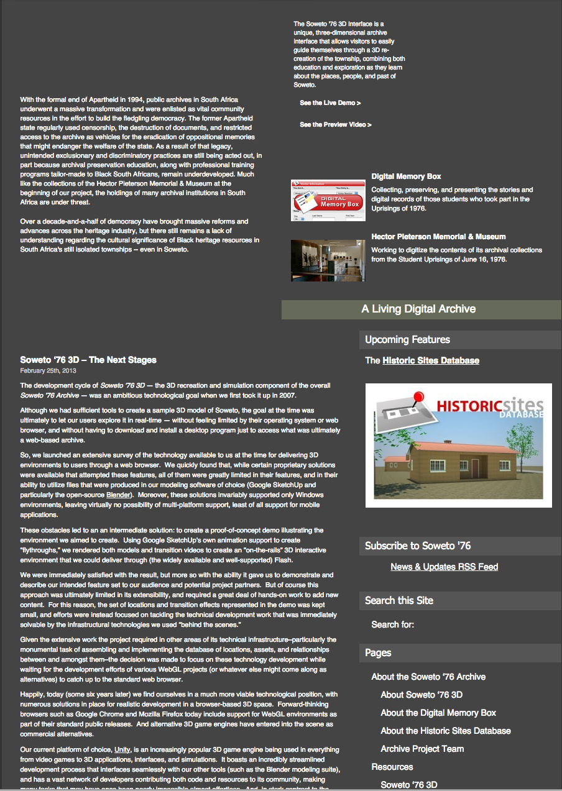

--- 
title: Digital Pedagogy in the Humanities
subtitle: Concepts, Models, and Experiments 
chapter: Race
URL: keywords/race.md
author: 
- family: Koh
  given: Adeline
editor: 
- family: Davis
  given: Rebecca Frost
publisher: Modern Language Association
type: book
---

# RACE (Draft)

## AUTHOR(S): [Adeline Koh](http://adelinekoh.org)
Stockton University | [adelinekoh.org](http://adelinekoh.org)

##### Publication Status:
* unreviewed draft
* **draft version undergoing editorial review**
* draft version undergoing peer-to-peer review
* published 

--- 
REBECCA: Editorial comments by Rebecca Frost Davis are included inline below following "REBECCA:" for each paragraph of feedback. I begin with overall feedback before the curatorial statement, then add more inline comments mostly following the paragraph to which the feedback applies.

REBECCA: This keyword includes a range of resources with great potential for enriching both digital pedagogy and the pedagogy of race.  In the curatorial statement, you address current limitations to those pedagogies and argue for the power of digital technologies to change how race is taught and the power of race to expand the definition of digital pedagogy.  I especially like how you address  examples that push instructors beyond traditional digital humanities scholarly projects.

REBECCA: In your revisions, I think your argument can be even stronger if you can more clearly summarize your criteria for choosing artifacts in your curatorial statement, then explicitly link back to those criteria within each artifact.  We are also hoping, where possible, for examples drawn from the openly available work of other instructors to demonstrate that this isn't just your own idiosyncratic pedagogy but rather an overall trend in digital pedagogy. These do not necessarily need to be additional artifacts, but rather could be cited in the context of some of your artifacts. As an example of how you might do that, take a look at the keyword hybrid. In the annotation on his second artifact, "A 12-week Assignment to Write a Wikipedia Article," Jesse Stommel refers to a version of this assignment used by you.  You do include helpful pedagogical suggestions for each artifact, but they are phrased as suggestions rather than concrete examples.  Is that because there is a dearth of concrete examples because these are new resources that are pushing against boundaries? If so, it would be appropriate to address that challenge in your opening essay.  

REBECCA: It may be helpful to your revisions to consider the intended audience for this project.  While it includes digital humanists interested in pedagogy, we are also trying to reach typical humanists to engage them in digital work, especially digital pedagogy. Are there humanists interested in race who might then engage with digital pedagogy through that interest?  Consider what starting point your audience might take when trying to figure out how to use one of these artifacts in their own pedagogy.

## CURATORIAL STATEMENT 

While it may not seem like it on first inspection, issues of race
and ethnicity are deeply embedded in technology. European colonial
discourses from the eighteenth century onwards deployed the ideology
that “civilized” groups deserved supremacy over others because of
their superior technology. They located this superiority in multiple fields, from
advances in Western scientific knowledge to the West’s development of modern military
equipment and artillery. Postcolonial scholarship has largely
challenged this assumption, with critics arguing that the modernity
of non-Europeans actually predates the European construct of
modernity, or that notions of modernity need to be expanded
(Chakrabarty, Ong, Prakash, Diop). Even in contemporary discourse,
technology continues to be racialized by the assumption that people
in “developing” nations or from minority populations are outsiders
to technology. This belief is inaccurate. For example, as Anna
Everett has shown, far from being outsiders to the early years of
cyberspace, African Americans and African diasporic peoples were
actually early adopters of information age technology. The
persistence of this mode of thought in contemporary times indicates the cultural 
significance of race and ethnicity in technology and digital cultures. 

REBECCA: This first paragraph persuasively argues why race is important to digital pedagogy.

Given this historical backdrop, any responsible representation of race and
technology should offer challenges to and an expansion of how digital
pedagogy and digital humanities are defined. The selection of
artifacts in this keyword represents such a deliberate political
choice. It argues that most seminal digital humanities
work on race does not fit into traditional notions of digital
humanities research because it has been initiated and developed outside of
the academy. It locates this work in activist politics, in new modes of crowdfunding, and
in private foundations, among others. The majority of this work has not
received the sorts of governmental, federal and institutional support
other less politicized work has. This is not a new critique; a variety
of scholars (Earhart, Koh) have argued that the majority of the extant digital humanities
corps overly focuses on authors and cultural producers of European descent. 

REBECCA: In this second paragraph you are walking a tightrope.  I think it is important that you explicitly state that you are deliberately making a political choice.  For the third sentence, would you consider saying "much" instead of "most'?  I can imagine reaction that will point to exceptions to your rule.  On the other hand, that might weaken the point you are trying to make here.  

REBECCA: For the phrase "digital humanities corps" in the final sentence, do you mean "corpora" instead of "corps"? 

Thus on first look, a visitor to this project may find some of the selections in
this entry slightly odd. Some of these projects do not resonate as
typical “digital humanities” work because they began and continue to
exist outside of the academy without institutional support. Others
might appear unusual because they are simple blog posts or google
documents—artifacts whose production does not require much technical
expertise, thereby raising the question of whether they adequately
“count” as digital humanities pedagogy or research.

REBECCA: In your second paragraph, you signal your expansion of the definitions of both digital pedagogy and digital humanities but in your third paragraph you focus in on digital humanities in a way that implies that the core audience for this project is a digital humanist interested in pedagogy.  While that is certainly one of the audiences likely to be attracted--given many of the people involved in this project--we are also aiming to reach typical humanists.  How would you address that audience?  Do you want to argue that often pedagogy--because its artifacts do not seem to require deep technical knowledge--may also suffer from being seen as less than "real digital humanities"?  I think the point that digital pedagogy allows engagement beyond the academy is an important one.  Can you take this point further and consider what advice you might give a typical humanist or MLA member if they want to consider how and why to engage the digital in their pedagogy?

This choice is intentional. Through this curation, this collection seeks to expand 
the definition of “digital humanities” and “digital pedagogy” beyond the academy, and
beyond the conventional understanding that “doing digital humanities”
work requires deep technical knowledge. Through its composition, it
makes the argument that the included work should count as digital
humanities research and teaching.  This is because this work 1)
exists on digital infrastructures, and 2) because they are
representative of the definition of the humanities: the process and
documentation of the human experience.

In so doing, this project thus defines “digital humanities pedagogy” as one which actively uses the digital space to create, build upon and sustain communities and
networks. In draws on bell hooks’ definition of “engaged
pedagogy,” a pedagogy which emphasizes the self-actualization of both
the teacher as well as the students, one which prioritizes having the
classroom as a community learn together the social, material and
political relationships that exist within the classroom and without.
It also draws upon Jesse Stommel’s concept of “critical digital
pedagogy,” which “centers its practice on community and
collaboration; must remain open to diverse, international voices […];
will not, cannot, be defined by a single voice but must gather a
cacophony of voices; must have use and application outside
traditional institutions of education.” 

The projects that make up this curated list exemplify these definitions of engaged pedagogy and critical digital pedagogy, and many break down the barriers of the
academy to the public. A final note: this curated list is not
intended to be an exhaustive look at the field of race and the
digital humanities and digital pedagogy—indeed, it cannot completely
represent this entire field. This keyword, then, is only the
beginnings of an attempt to open up definitions of “digital
humanities” and “digital pedagogy.”

REBECCA: Can you more explicitly summarize or list the criteria for the intersections of digital pedagogy and race?  I think it would be appropriate for you to end your paragraph citing bell hooks and Jesse Stommel with your own voice in a definition that blends theirs.

REBECCA: I know that you felt limited in choosing only 10 pedagogical artifacts; in your final paragraph and in your annotations, can you get at how those chosen are models or exemplify the range of criteria you see as important here?  The criteria I see you pointing to in your curatorial statement are the following:
* artifacts that break down the barrier between academia and the rest of the world
* artifacts that represent accessible technology (that includes rather than excludes)
* artifacts that represent activist technology
* artifacts that engage students with communities
* artifacts that pull students into larger networks
* artifacts that exemplify technology empowering rather than disenfranchising "diverse, international voices"
* artifacts that help students develop their own understanding of diversity
* artifacts that exemplify how the classroom as a community learns together the social, material and political relationships that exist within the classroom and without. 

REBECCA: The following comments relate to the overall selection of artifacts.  What is the principle of organization for your artifacts? I thought it was alphabetical at first, but later that rule is not followed.

REBECCA: Another aspect you might consider is assessment.  How can instructors evaluate their students work in this area.  AAC&U has a rubric on intercultural knowledge and competence: https://www.aacu.org/value/rubrics/intercultural-knowledge  Is this helpful for assessing student work in this area?  Or consider the civic engagement rubric: https://www.aacu.org/civic-engagement-value-rubric

REBECCA: Many of your examples exemplify the power of technology to support disenfranchised communities--can you give a negative example by way of comparison--a technology or archive that excludes?  That doesn't have to be an artifact but it might be brought up in a comparison.

## CURATED ARTIFACTS

### African Diaspora PhD
* Artifact Type: Directory of Atlantic African diaspora history scholarship

* Source URL: http://africandiasporaphd.com/ 
* Copy of Artifact: forthcoming
* Creator: Jessica Marie Johnson (Michigan State University) and Kidada Williams (Wayne State University)

African Diaspora, Ph.D. is a curated blog that highlights scholarship and scholars in the field of Atlantic African diaspora history. This valuable resource is useful for students to gain an overview of current issues in Atlantic African diaspora history, and its relevance to contemporary race issues. It also provides a useful index of scholars working on this topic, many of whom are people of color. Students could be tasked with creating a literature review on this topic through researching this directory. 

REBECCA: Which of your criteria are you invoking here? Does it include any teaching resources?  Thanks for suggesting an assignment. Do you know of anyone who has used this resource? Is this an artifact that could be used to engage students with a larger academic community?  How does this resource help students link current issues in Altantic African diaspora with contemporary race issues?
    

### Ferguson Syllabus 
* Artifact Type: Crowdsourced Syllabus 

* Source URL: https://docs.google.com/document/d/1kwZl23Q9tgZ23dxSJWS-WpjZhOZ_mzVPtWL8-pWuLt8/edit/edit?pli=1#heading=h.l15kj4sa2rn0
* Copy of Artifact: forthcoming
* Creator: Marcia Chatelain, hashtag originator (Georgetown University), Dan Krutka, Google document host & faciliator (Texas Women's University)

This is a crowdsourced Google document containing resources and annotations that are helpful for instructors teaching about the events and reactions that occurred in Ferguson, MO in late 2014, when Michael Brown, an unarmed black teenager, was shot and killed by white police officer Darren Wilson. Wilson has not faced any charges for his actions. Widespread protests in Ferguson and on social media have resulted. Prof. Marcia Chatelain at Georgetown University then started the hashtag #FergusonSyllabus to provide sources for people wishing to learn and teach more about the historical context that resulted in the Michael Brown shooting, in particular, larger patterns of systemic racism and police brutality. This google document is one such product of the #FergusonSyllabus hashtag. It collates many sources offered by the public, including annotations, links and ideas for instructors.

### Mapping Police Violence 
* Artifact Type: Mapping tool 

* Source URL: http://mappingpoliceviolence.org/ 
* Copy of Artifact: forthcoming
* Creator: Deray McKesson, Netta, Samuel Sinyangwe, all of WeTheProtestors.org

This site offers easy to read and to use visualizations of crowdsourced data on people of have been shot and/or killed by police. The collaborators base their data off databases such as FatalEncounters.org, the U.S. Police Shootings Database and KilledByPolice.net, along with original research from the team. The visuals clearly show that the number of black and Hispanic people killed by the police since May 2013 is inordinately high as compared with other races and ethnicities. The easy to use tables and data could provide an interesting classroom project investigating police shootings in a certain region, as well as course projects involving race and state violence.

REBECCA: There seems to be a word missing in your first sentence: "crowdsourced data on people of have been shot".  Should this read "people of [color who] have been shot"  or "people [who] have been shot" or something else?

REBECCA: I appreciate that you suggest a hypothetical assignment; can you point to concrete examples? Do you have any comments on how this resource functions in connection to your stated criteria, e.g., activist technology, knowledge as power, etc.  The other interesting thing about this site is its relationship to generative scholarship.  It draws on databases to present a stronger argument; this is a nice model for how students might mine other publicly available data.  What if they worked collaboratively to construct comparable sites focusing on other populations?  

### Mukurtu 
* Artifact Type: Content Management System for indigenous communities to preserve and share cultural heritage digitally

* Source URL: http://www.mukurtu.org/ 
* Copy of Artifact: forthcoming 
* Creator: Kim Christen (University of Washington, Pullman) and Michael Ashley (University of California at Berkeley)

Mukurtu is an open source content management system aimed at empowering indigenous communities to manage, share and exchange digital heritage in relevant and ethically-minded ways. It began as a response to the archival needs of the Waramungu Aboriginal community in the Central Australian town of Tennant Creek. While Mukurtu is free and open source, items contained within the database can be given different levels of permission for viewing and interacting, thereby providing greater flexibility for communities unwilling for their heritage collections to be completely open to the public. The CMS can easily be used in multiple ways for class  projects: exploring its functionality and reporting on its affordances and limitations in comparison with other similar database exhibition tools, and working together with a local community to build their own particular instance of Mukurtu for their uses, for example. 

REBECCA: This is a great example of technology as empowering.  Can you point to a concrete assignment using it or is it too new? Which of your criteria does it exemplify?  Can you give a comparison example of a CMS that isn't empowering?

### SAADA (South Asian American Digital Archive)
 * Artifact Type: Archive

* Source URL: https://www.saadigitalarchive.org/ 
* Copy of Artifact: forthcoming
* Creator and Affiliation: Samip Mallick (SAADA) 

SAADA is a digital archive that aims to increase the digital representation of South Asian Americans through documenting, preserving and sharing their stories. SAADA is registered as a non-profit organization based in Philadelphia, PA. Instructors can easily integrate much of the archive's material into courses on South Asia, American studies, diaspora studies as secondary material, getting students to research additional metadata and context to the objects, as well as possibly getting students involved in volunteering for the archive. 

REBECCA: This looks like a great resource; can you give some concrete examples of its use?  What is the pedagogical value or the learning outcome?  Which of your criteria are exemplified?  How does it expand a student's understanding of race and the power of technology and/or the archive? How does it impact student learning? Why is it important that this is a digital resource?
    
### Soweto76
* Artifact Type: 3D digital archive

* Source URL: http://www.soweto76archive.org/ 
* Copy of Artifact: forthcoming
* Creator: Angel David Nieves (Hamilton College) 

This is a 3D virtual representation of the black township of Soweto, South Africa in 1976 on the Unity platform. It allows visitors to guide themselves through the 3D recreation of the township and learn about the historical significance of various places in Soweto. 1976 is an important historical year for the township as black high school students from Soweto took to the streets to protest the introduction of Afrikaans in place of English as the medium of instruction in local schools. Up to 700 students may have died in the protest. This protest was due to the perception of Afrikaans being linked to apartheid and to the language of the oppressor. The materials in the archive will be an excellent addition to courses on South Africa or about global race and ethnicity by introducing elements of visualization and geography into study of this historical protest. 

REBECCA: I believe that some students have played a role in work on this archive.  Can you point to their contributions?  Also, it would be great to have a screenshot of the 3D version.  Is that possible?  Why is it important that this is in 3D?  How does this help advance student learning about race? Why is it important for students to engage in creating resources like this?  How does this link students, historians, and the community? What is the status of this project?  There do not seem to be many materials in the 3D section at least.  The Digital Memory Box seems interesting--what if students were asked to create their own digital memories of local events.  (I couldn't get this section to load, though.)
    

### Invisible Australians: The Real Face of White Australia 
* Artifact Type: Archive/Exhibit 

* Source URL: http://invisibleaustralians.org/faces/ 
* Copy of Artifact: forthcoming
* Creator: Kate Bagnall (ANU College of Asia and the Pacific), Tim Sherratt (National Library of Australia, University of Canberra)

This archival project seeks to overturn the actual effectiveness of the "White Australia Policy," a state-directed racial policy developed in Australia since 1901 to restrict the immigration of non-white ethnicities into Australia, and the integration of racial minorities into Australian culture. Drawn from records of the National Archives of Australia, the visual wall of portraits of non-white Australians documents both the inaccuracy of the myth of an all-white Australia, as well as the monitoring and restriction of people who were the target of this policy. These sources can be used in courses on global race and ethnicity, particularly to introduce students to archival sources and their use in government policy. 

REBECCA: Again, this is a great project that demonstrates the power of technology to question the dominant narrative.  Can you point to a concrete example or its use? By which criteria did you choose it?  You might also consider citing a learning outcome as the artifact.

### #ThisTweetCalledMyBack 
* Artifact Type: Hashtag and tumblr blog

* Source URL: https://twitter.com/search?f=realtime&q=%23thistweetcalledmyback&src=typd 
    http://thistweetcalledmyback.tumblr.com/ 
* Copy of Artifact: forthcoming
* Creator: @tgirlinterruptd, @chiefelk, @bad_dominicana, @aurabogado, @so_treu, @blackamazon, @thetrudz 

&#35;ThisTweetCalledMyBack is a hashtag movement from late 2014, in which women of color activists on Twitter called attention to the appropriation of much of their work on social media by both journalists, activists and academic. The hashtag references the seminal book *This Bridge Called My Back: Writings by Radical Women of Color*, edited and first published in 1981 by Cherríe Moraga, Gloria Anzaldua and Toni Cade Bambara. The hashtag can be taught in conjunction with themes of the appropriation of work by women of color in feminist movements and in relation to hashtag activism and new social media feminist movements and in comparison to their pre-internet counterparts.
 REBECCA: Could you point to  concrete assignments, learning outcomes, etc., and link to criteria for choosing?

### #TransformDH 
* Artifact Type: Tumblr blog

* Source URL: http://transformdh.org/ 
* Copy of Artifact: forthcoming
* Creator: Anne Cong-Huyen (Whittier College), Alexis Lothian (University of Maryland),  Amanda Phillips (University of California, Davis), Melanie Kohnen (New York University), Moya Bailey (Northeastern  University), Marta S. Rivera Monclova (PhDeviate), Tanner Higgin (Common Sense Media), Fiona Barnett (Duke University), Anna Everett (University of California, Santa Barbara), Lisa Nakamura (University of Michigan), Tara McPherson (University of Southern California), Natalia Cecire (University of Sussex), Jessica M. Johnson (Michigan State University)

&#35;TransformDH is a fluid collective of people and ideas invested in the representation and scholarship of marginalized communities in the digital humanities. The tumblr blog would be good as an assigned reading in digital humanities classes, particularly in relation to considering the relationship of its content to the field at large. 

REBECCA: Could you point to  concrete assignments, learning outcomes, etc., and link to criteria for choosing? 

### Afro Free Culture Wikimedia (AfroCROWD) Kickoff Edit-a-thons
* Artifact Type: Wikipedia Edit-A-Thon 

* Source URL: https://en.wikipedia.org/wiki/Wikipedia:Meetup/NYC/AfroCrowd
* Copy of Artifact: forthcoming
* Creator and Affiliation: Multiple Wikipedia editors

AfroCROWD is a Wikimedia initiative to increase the number of people of African descent who actively take part in the Wikimedia and free knowledge, culture and software movements. The event is part of Black WikiHistory Month, and is open to all Afrodescents who self-identify as being part of the diaspora. Student clubs and organizations focused on the African diaspora might be interested in organizing in-person nodes for these edit-a-thons. Instructors who are teaching more racially and ethnically classes can also help add to the project by contributing to the [WikiProject African Diaspora](https://en.wikipedia.org/wiki/Wikipedia:WikiProject_African_diaspora)

REBECCA: Could you point to  concrete assignments, learning outcomes, etc., and link to criteria for choosing?  This is a great resource for linking to community-based or engaged learning.

## RELATED MATERIALS

* Everett, Anna. *Digital Diaspora: A Race for Cyberspace* Albany, NY: SUNY Press, 2009. 

* Harding, Sandra, ed. *The Postcolonial Science and Technology Reader* Durham: Duke University Press, 2011. 

* Koh, Adeline. *NITLE Race and the Digital Humanities Zotero Bibliography* (https://www.zotero.org/groups/nitle_race_and_digital_humanities/items)

* McPherson, Tara. "Why Are the Digital Humanities So White? Or Rethinking the Histories of Race and Computation" *Debates in the Digital Humanities* ed: Matt Gold. Minnesota, University of Minnesota Press. [<http://dhdebates.gc.cuny.edu/debates/text/29>](http://dhdebates.gc.cuny.edu/debates/text/29) 

* Nakamura, Lisa and Peter Chow-White (eds). *Race After the Internet* New York: Routledge, 2011. 

## WORKS CITED

*AfroCROWD* Web. [<https://en.wikipedia.org/wiki/Wikipedia:Meetup/NYC/AfroCrowd>](https://en.wikipedia.org/wiki/Wikipedia:Meetup/NYC/AfroCrowd) 3 Apr. 2015. 

Chakrabarty, Dipesh. *Provincializing Europe: Postcolonial Thought and Historical Difference.* Princeton: Princeton University Press, 2007.

Christen, Kim and Michael Ashley. *Mukurtu* Web. [<http://www.mukurtu.org/>](http://www.mukurtu.org/) 3. Apr. 2015. 

Cong-Huyen, Anne et al. *#TransformDH*  Web. [<http://transformdh.org/>](http://transformdh.org/) 3 Apr. 2015.

Chatelain, Marcia. *#Ferguson Syllabus* Web. [<https://docs.google.com/document/d/1kwZl23Q9tgZ23dxSJWS-WpjZhOZ_mzVPtWL8-pWuLt8/edit/edit?pli=1#heading=h.l15kj4sa2rn0]>](https://docs.google.com/document/d/1kwZl23Q9tgZ23dxSJWS-WpjZhOZ_mzVPtWL8-pWuLt8/edit/edit?pli=1#heading=h.l15kj4sa2rn0]) 3. Apr. 2015. 

Bagnall, Kate and Tim Sherratt. *Invisible Australians: The Real Face of White Australia*
Web. [<http://invisibleaustralians.org/faces/>](http://invisibleaustralians.org/faces/) 3 Apr. 2015.

Diop, Cheikh Anta. 1974. *The African Origin of Civilization: Myth or Reality.* Chicago: Chicago Review Press, 2012.

Earhart, Amy. “Can Information be Unfettered? Race and the New Digital Humanities Canon.” *Debates in the Digital Humanities.* Ed. Matt Gold. Minneapolis: University of Minnesota Press, 2012.

Everett, Anna. *Digital Diaspora: The Race for Cyberspace.* Albany, NY: SUNY Press, 2009.

Harding, Sandra, ed. *The Postcolonial Science and Technology Reader* Durham: Duke University Press, 2011. 

hooks, bell. *Teaching to Transgress: Education as the Practice of Freedom.* New York: Routledge, 1994.

Johnson, Jessica M. and Kidada Williams. *African Diaspora PhD* Web. [<http://africandiasporaphd.com/>](http://africandiasporaphd.com/) 3 Apr. 2015.

Koh, Adeline. “Inspecting the Nineteenth-century Literary Digital Archive: Omissions of Empire.” *Journal of Victorian Culture.* 19.3 (2014): 385-395.

Koh, Adeline. *NITLE Race and the Digital Humanities Zotero Bibliography* (https://www.zotero.org/groups/nitle_race_and_digital_humanities/items)

Mallick, Samip. *SAADA (South Asian American Digital Archive.)* Web. [<https://www.saadigitalarchive.org/>](https://www.saadigitalarchive.org/) 3 Apr. 2015.

McKesson, Deray, et al. *Mapping Police Violence* Web. [<http://mappingpoliceviolence.org/>](http://mappingpoliceviolence.org/) 

McPherson, Tara. "Why Are the Digital Humanities So White? Or Rethinking the Histories of Race and Computation" *Debates in the Digital Humanities* ed: Matt Gold. Minnesota, University of Minnesota Press. [<http://dhdebates.gc.cuny.edu/debates/text/29>](http://dhdebates.gc.cuny.edu/debates/text/29) 

Nakamura, Lisa and Peter Chow-White (eds). *Race After the Internet* New York: Routledge, 2011. 

Nieves, Angel David. *Soweto76* Web. [<http://www.soweto76archive.org/>](http://www.soweto76archive.org/)

Nonini, David M. and Aihwa Ong. *Ungrounded Empires: The Cultural Politics of Modern Chinese Nationalism.* New York: Routledge, 1997.

Prakash, Gyan. *Another Reason: Science and the Imagination of Modern India.* Princeton: Princeton University Press, 1999.

Stommel, Jesse. “Critical Digital Pedagogy: A Definition.” *Hybrid Pedagogy.* November 18, 2014. [<http://www.hybridpedagogy.com/journal/critical-digital-pedagogy-definition/>](http://www.hybridpedagogy.com/journal/critical-digital-pedagogy-definition/)

@tgirlinterruptd, et al. *ThisTweetCalledMyBack* Web. [<https://twitter.com/search?f=realtime&q=%23thistweetcalledmyback&src=typd>](https://twitter.com/search?f=realtime&q=%23thistweetcalledmyback&src=typd) 3 Apr. 2015.
