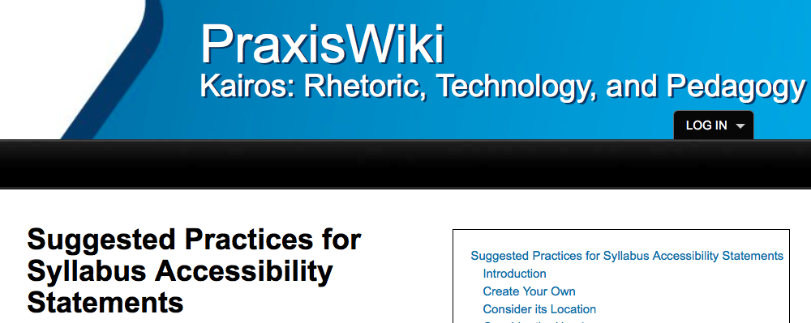
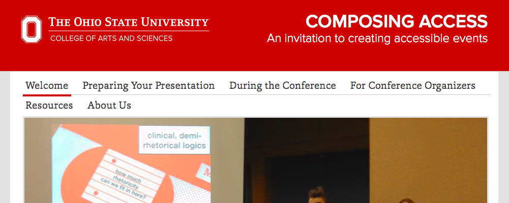
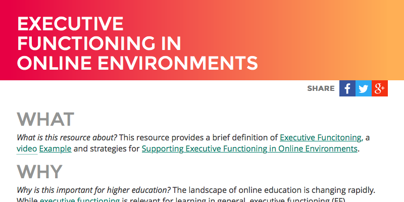
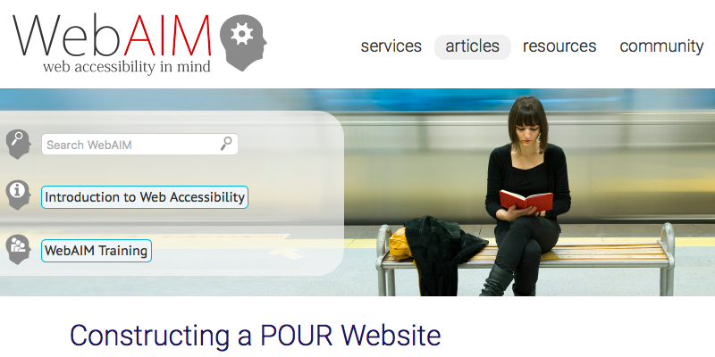
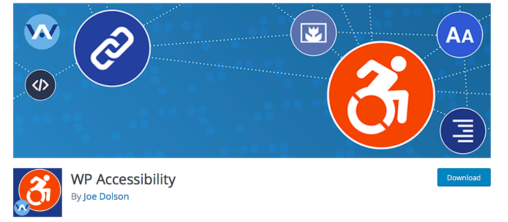
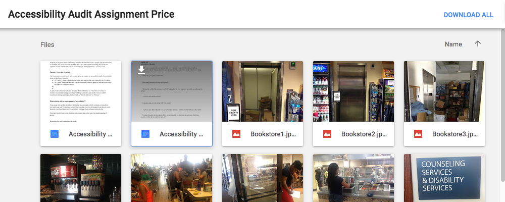
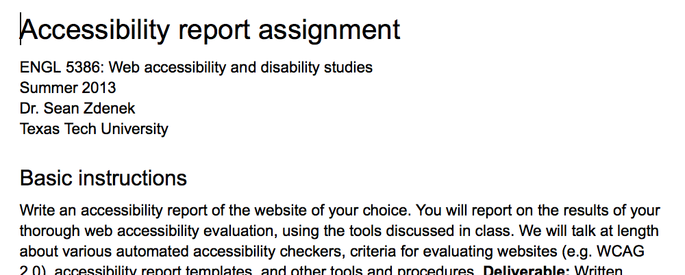
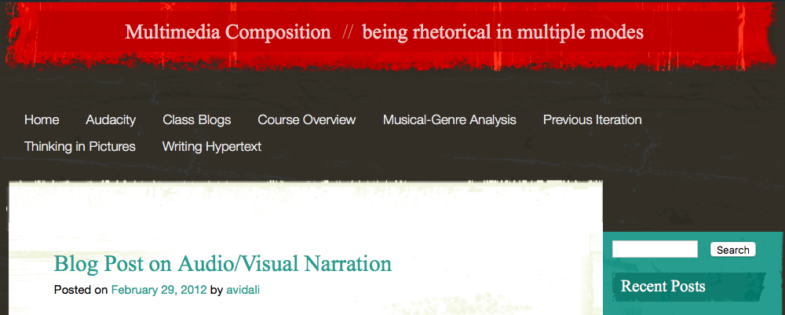
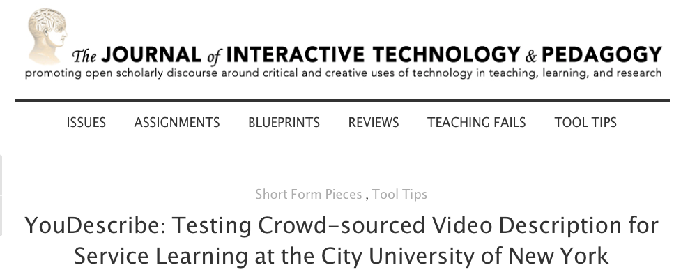
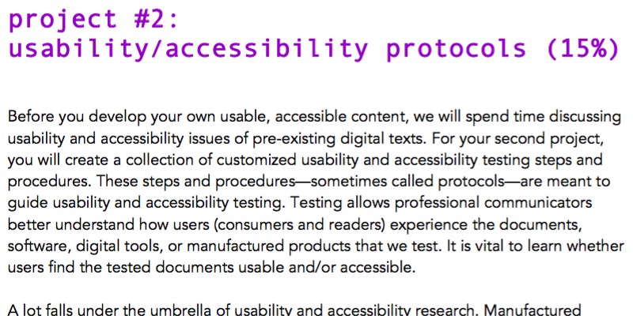

# ACCESS 

## GEORGE H. WILLIAMS
University of South Carolina Upstate | [http://georgehwilliams.net](http://georgehwilliams.net)

---

##### Publication Status:
* unreviewed draft
* draft version undergoing editorial review
* draft version undergoing peer-to-peer review 
* **draft version undergoing MLA copyediting**
* published 

---
### Cross-Reference Keywords: 
---

## CURATORIAL STATEMENT

According to the World Health Organization’s 2011 *[World Report on Disability](http://www.who.int/disabilities/world_report/2011/report/en/)* “about 15% of the world’s population lives with some form of disability,” a percentage that translates into more than a billion people. For this substantial population, lack of digital access to educational and other informational materials presents a significant barrier in their lives. Inaccessible features can range from videos with no captions to images that lack corresponding textual descriptions to scanned documents with error-filled OCR to poorly-designed websites that are difficult to navigate. The vast and growing collections of otherwise valuable materials available online are all too often plagued by accessibility flaws that make them useless for a significant proportion of their potential audiences. As Jonathan Lazar and Paul Jaeger argue, these flaws “threaten to make people with disabilities into the second-class citizens of the information society.”

It would be a mistake, however, to conclude that access is a concept whose importance is primarily restricted to the needs of people with disabilities. This keyword entry focuses on access from the perspective of making digital resources usable by people with disabilities with the understanding that doing the work necessary to achieve this kind of accessibility goes a long way towards the goals associated with other meanings of access. Accessibility exists when a user (who may or may not have a particular disability) can easily make use of a particular digital resource (which may be textual, auditory, visual, or some combination) with their choice of technology (which may or may not be explicitly labeled “assistive” technology) and can, as a result, cognitively process the information as it comes to them from that resource through that technology. The importance of access has intensified in recent years as a result of a number of different factors. The growth in using information and communication technologies for teaching and learning has led to more and more users accessing educational materials primarily through digital means, both for courses that meet face-to-face and those that are solely offered online. The high cost of commercially-produced textbooks and associated media has fueled a movement of producing and using open educational resources available online. The enforcement (however inconsistent) of legal requirements concerning accessibility in educational environments has offered a significant incentive to institutions who might otherwise be reluctant to devote adequate attention to the issue. Lastly, the development and extensive adoption of the universal design for learning (UDL) framework has led many educators to consider the ways access (or its lack) affects the diverse kinds of students found in the classroom.

Access should be part of the criteria used when choosing materials assigned to be read, viewed, listened to, or (in the case of hypertext) explored. And any instructional materials generated for class — e.g. syllabi, assignment sheets, video tutorials, and course websites — should be created while following current accessibility guidelines. Finally, students who create digital products for class should be provided with the opportunity to learn the importance of access, given the tools for evaluating and improving the accessibility of the materials they produce, and prompted to think critically about evaluative criteria for accessibility; this may be done in any course at any level, so long as the appropriate adjustments are made for the specific context.

The artifacts collected here were selected with three different activities central to teaching and learning in mind: planning, evaluating, and re-thinking. Planning is foregrounded in order to discourage the "retrofit" mindset by which materials and pedagogical practice are first created and *then* tinkered with -- often inadequately -- to make them more widely accessible. Evaluating is included to encourage able-bodied and neurotypical users to learn how to appraise the accessibility of resources, both digital and physical. Re-thinking represents perhaps the most ambitious of activities given that it necessitates rebooting one's perhaps unexamined (or underexamined) assumptions about the core practices of creating, consuming, and interpreting information. And finally, more abstract considerations of access and pedagogy may be found under Related Materials. 

### Planning

With appropriate guidance, both teachers and students may broaden their awareness of the diverse needs and abilities of others and plan accordingly when creating and sharing information. Although there is no perfect set of standard practices that will remove all barriers for all people, the aspirational goal should be to eliminate as much as possible the need to enact separate and additional acts of retrofitting or accommodation.

### Evaluating

Accessibility standards for built environments and for digital environments allow these environments to be evaluated, an activity that involves considering the affordances of a particular resource from someone else’s point of view. Able-bodied users often overlook design features that restrict access for others, but the assignments in this section push students to pay careful attention to the impact design choices make on accessibility.

### Re-thinking

Working to make information accessible involves re-thinking one’s own default methods for creating and/or interpreting, and understanding others’ methods for doing so. Amy Vidali’s assignment, for example, teaches students that primarily visual information needs to be adequately described with textual information – written, or aural, or both – in order to make it usable by those who are blind or have low vision. Allison Hitt takes re-thinking one step further by having students develop their own protocols for testing the usability and accessibility of content.

## CURATED ARTIFACTS

## Planning

### Suggested Practices for Syllabus Accessibility Statements

* Artifact Type: Article
* Source URL: [http://kairos.technorhetoric.net/praxis/tiki-index.php?page=Suggested_Practices_for_Syllabus_Accessibility_Statements](http://kairos.technorhetoric.net/praxis/tiki-index.php?page=Suggested_Practices_for_Syllabus_Accessibility_Statements)
* Artifact Permissions: Permission requested, awaiting response.
* Copy of the Artifact:
* Creators: Tara Wood, Rockford University and Shannon Madden, University of Rhode Island 

This straightforward and well-organized essay discusses an important element of the syllabus that many instructors might be tempted to overlook: the statement of accessibility (often referred to by other terms, such as "Disability Statement" or "Accommodations Statement"). Institutions often provide boilerplate language to be copied and pasted into syllabi, language that is chosen not with pedagogy in mind but with the aim of legal compliance. Wood and Madden emphasize the rhetorical significance of the statement and encourage instructors to create their own, arguing that it "warrants closer attention from [those] who wish to create inclusive classrooms and meet their students' needs in flexible and comprehensive ways." They offer practical advice not only for how to word the statement of accessibility but also how to re-think pedagogy to take into account the needs of diverse students. Examples are provided from others, and further reading is recommended.

### Composing Access

* Artifact Type: Guidelines
* Source URL: [https://u.osu.edu/composingaccess/](https://u.osu.edu/composingaccess/)
* Artifact Permissions: n/a
* Copy of the Artifact:
* Creator: Committee on Disability Issues in College Composition, and the Computers and Composition Digital Press.

This website provides extensive advice and specific guidelines for how to "enhance accessibility at [academic] conferences," but most of what can be found here is useful information for the classroom, either for instructors wishing to improve the accessibility of their teaching methods or for students who have been assigned a presentation for class. The information here is not presented dogmatically; instead, the authors write, "[w]e encourage you to shop around, pick up ideas as you like, and hopefully try something new." The section titled "Preparing Your Presentation" covers such topics as the physical space of the presentation, designing useful handouts, sharing presentation material online, and preparing a script to be shared with others such as sign-language interpreters and audience members who might have difficulty processing auditory information. There is also a section explaining what to do "During the Presentation" and a page with links to additional information.

### Executive Functioning in Online Environments

* Artifact Type: Article
* Source URL: [http://udloncampus.cast.org/page/teach_executive](http://udloncampus.cast.org/page/teach_executive)
* Artifact Permissions: CC BY-SA 4.0
* Copy of the Artifact: 
* Creator: Center for Applied Special Technology

The *UDL on Campus* website is an exhaustive resource addressing universal design for learning at colleges and universities. This particular article explains the online challenges faced by students with cognitive disabilities, a population that is often overlooked in discussions of accessibility and digital educational environments. While face-to-face classroom environments can provide a variety of means to support a student's progress through the course content, in an online environment students can struggle with tasks such as "goal setting, planning, organization, and applying strategies to achieve goals." The article outlines specific strategies for supporting these tasks, including a logical semantic structure to the course website, opportunities for synchronous class events, a discussion environment where peers can ask and answer questions about the course, and a predictable routine for course activities and expectations.

### Constructing a POUR Website

* Artifact Type: Instructions
* Source URL: [http://webaim.org/articles/pour/](http://webaim.org/articles/pour/)
* Artifact Permissions: &copy;  WebAIM (Web Accessibility in Mind): [http://WebAIM.org](http://WebAIM.org).
* Copy of the Artifact:
* Creator: Center for Persons with Disabilities

Utah State University’s Center for Persons with Disabilities is home to WebAIM (Web Accessibility in Mind), a non-profit organization whose mission is to improve the accessibility of the web through a variety of educational strategies. "Constructing a POUR Website" provides an in-depth but beginner-friendly explanation of how and why to create a website that is "Perceivable, Operable, Understandable, and Robust." Of particular value here is the emphasis upon what your website's users will need and expect rather than just upon the technical standards for coding and markup. The article would not only be very useful to an instructor working to ensure her course materials are accessible but would also make appropriate assigned reading in a course where students create digital resources.

### WordPress Accessibility Plugin

* Artifact Type: Software
* Source URL: [https://wordpress.org/plugins/wp-accessibility/](https://wordpress.org/plugins/wp-accessibility/)
* Artifact Permissions:
* Copy of the Artifact:
* Creator: Joe Dolson, Accessible Web Design

The content-management system and blogging tool WordPress has been widely adopted as a platform for teaching and learning in higher education, used to host the content for entire courses and to give students a medium to publish their work for class. [The WordPress Accessibility Team](https://make.wordpress.org/accessibility/) has been working for the last few years to make accessibility a core feature of the software. Team member Joe Dolson developed and maintains the WordPress Accessibility Plugin with the goal of giving site administrators the ability to fine tune various accessibility features of a site that runs on WordPress. This plugin is technical enough to reveal what is happening at the level of code and markup but user-friendly enough for a non-expert to learn a great deal about what goes into enhancing the accessibility of a website. It could be used productively by an instructor building a site for a course or assigned as a required tool for students developing their own sites for a class project.

## Evaluating

### Accessibility Audit Assignment

* Artifact Type: Assignment
* Source URL: [https://drive.google.com/folderview?id=0B-h_I_KLxUTLaGpSX1NFMllmd0E&usp=sharing](https://drive.google.com/folderview?id=0B-h_I_KLxUTLaGpSX1NFMllmd0E&usp=sharing)
* Artifact Permissions: Permission requested, awaiting response.
* Copy of the Artifact:
* Creator: Margaret Price, Ohio State University

This assignment asks students to evaluate the accessibility of a given physical space on campus using a checklist that is composed in part of specific legal requirements and design recommendations and in part of suggestions and concerns created by students in the class. In this way, students are encouraged to think about accessibility in a holistic way and not just as a simple list of conditions that must be met. The digital aspect of the activity as described here is that students are encouraged to photograph the space they're evaluating. However, an instructor could easily incorporate additional technologies &mdash; such as audio and video &mdash; into the required final product. An especially ambitious adaptation of the assignment could require a redesign of the space using 3D digital modeling tools.

### Accessibility Report Assignment

* Artifact Type: Assignment
* Source URL: [https://docs.google.com/document/d/1Yf75OtOQ73iRs7S5NSljGNH-Rc2RHeyM47KPDiU3Tx0/edit?pref=2&pli=1](https://docs.google.com/document/d/1Yf75OtOQ73iRs7S5NSljGNH-Rc2RHeyM47KPDiU3Tx0/edit?pref=2&pli=1)
* Artifact Permissions: Permissions acquired
* Copy of the Artifact: [access-zdenek_accessibility-report-assignment_spring2017_engl5386.docx](files/access-zdenek_accessibility-report-assignment_spring2017_engl5386.docx)
* Creator: Sean Zdenek, University of Delaware

Given to students in a graduate-level class on "Web Accessibility and Disability Studies,"  this assignment clearly explains how to evaluate a website's accessibility and points out that "[c]hecking for accessibility involves a combination of software tools and human judgment." Zdenek recommends specific techniques to try and provides a detailed list of software tools that automate much of the process. A particular strength here is the balance between technical standards for access and the necessity of understanding and explaining accessibility recommendations persuasively. Although this assignment might be too advanced for some undergraduate courses, it could easily be adapted. For example, accessibility evaluation could be an important part of a peer review workshop where students provide each other feedback on their own digital projects.

## Re-Thinking

### Audio/Visual Description Assignment

* Artifact Type: Assignment
* Source URL: [https://multimediacomp.wordpress.com/2012/02/29/blog-post-on-audiovisual-narration/](https://multimediacomp.wordpress.com/2012/02/29/blog-post-on-audiovisual-narration/)
* Artifact Permissions: Permission requested, awaiting response.
* Copy of the Artifact:
* Creator: Amy Vidali, University of Colorado Denver

Many courses that once might have asked students to author text-only assignments now require them to create artifacts with a significant visual component, artifacts ranging from infographics to comics to digital stories. Potential readers of those artifacts who are blind or have low vision will, of course, find them more than a little challenging. In her course on multimedia composition &mdash; as part of her unit on "Thinking in Pictures" &mdash; Vidali has her students create a comic and then introduces them to the concept of "visual/audio description." She explains why multiple means of representation are important, distinguishes between interpretation and description, and provides several links to explanations and examples from various sources. This assignment requires students to publish their text-based description alongside their comic.

### YouDescribe: Testing Crowd-sourced Video Description for Service Learning at the City University of New York

* Artifact Type: Review
* Source URL: [http://jitp.commons.gc.cuny.edu/youdescribe-testing-crowd-sourced-video-description-for-service-learning-at-the-city-university-of-new-york/](http://jitp.commons.gc.cuny.edu/youdescribe-testing-crowd-sourced-video-description-for-service-learning-at-the-city-university-of-new-york/)
* Artifact Permissions: CC BY-NC-SA 3.0 US
* Copy of the Artifact:
* Creator: Julia Miele Rodas, Brooklyn Community College

Although as a video-sharing website YouTube is a primarily visual medium of information, the site is visited by a significant number of users who are blind or have low vision. For such users, the availability of video descriptions &mdash; an audio track where someone narrates the information that is only presented visually &mdash; makes a particular video much more accessible. Rodas reviews and reflects on YouDescribe, a free tool for crowdsourcing video descriptions of YouTube videos, noting that she was surprised to find herself less confident with the task of description than with the need to learn the tool’s interface. She concludes that an assignment requiring students to use YouDescribe might be discouraging to first-year students just being introduced to multimedia composition assignments but would be effective in a class of more-advanced and tech-confident students.

### Usability / Accessibility Protocols

* Artifact Type: Assignment
* Source URL: *temporary* [https://drive.google.com/open?id=0BziwFClCcZeJc2ZoaDlpWWpVd1E](https://drive.google.com/open?id=0BziwFClCcZeJc2ZoaDlpWWpVd1E)
* Artifact Permissions: Permission requested, awaiting response.
* Copy of the Artifact:
* Creator: Allison Hitt, University of Central Arkansas

This assignment for an undergraduate course asks students to go beyond evaluating digital content using criteria provided by someone else. Here, they must develop their own "collection of customized usability and accessibility testing steps and procedures" or "protocols" to be used for such evaluation. Hitt asks students to consult Steve Krug's *Don't Make Me Think, Revisited* when creating their usability testing protocol and the *Web Content Accessibility Guidelines* from the World Wide Web Consortium when creating their accessibility testing protocol. As a result, Hitt requires students to think critically about the impact of design choices that go into creating digital content as well as the technical standards that govern such content's code and markup.

## RELATED MATERIALS

Dolmage, Jay. "Universal Design: Places to Start." [http://dsq-sds.org/article/view/4632/3946](http://dsq-sds.org/article/view/4632/3946)

King-Sears, Margaret. "Universal Design for Learning: Technology and Pedagogy." [http://ldq.sagepub.com/content/32/4/199.refs](http://ldq.sagepub.com/content/32/4/199.refs)

Lazar, Jonathan and Paul Jaeger. "Reducing Barriers to Online Access for People with Disabilities." [http://issues.org/27-2/lazar/](http://issues.org/27-2/lazar/)

Lunches, Andrew, ed. *Disability Studies Approaches to Pedagogy, Research, and Design* [http://jitp.commons.gc.cuny.edu/table-of-contents-issue-eight/](http://jitp.commons.gc.cuny.edu/table-of-contents-issue-eight/)

Yergeau, Melanie, Elizabeth Brewer, Stephanie L. Kerschbaum, Sushi K. Oswald, Margaret Price, Cynthia L. Self, Michael J. Salvo, and Franny Howes. *Multimodality in Motion: Disability and Kairotic Spaces.* [http://kairos.technorhetoric.net/18.1/coverweb/yergeau-et-al/index.html](http://kairos.technorhetoric.net/18.1/coverweb/yergeau-et-al/index.html)

## WORKS CITED

Center for Applied Special Technology. "Executive Functioning in Online Environments." [http://udloncampus.cast.org/page/teach_executive](http://udloncampus.cast.org/page/teach_executive)

Center for Persons with Disabilities. "Constructing a POUR Website" [http://webaim.org/articles/pour/](http://webaim.org/articles/pour/)

Committee on Disability Issues in College Composition, and the Computers and Composition Digital Press. *Composing Access* [http://composingaccess.net](http://composingaccess.net)

Dolmage, Jay. "Universal Design: Places to Start." [http://dsq-sds.org/article/view/4632/3946](http://dsq-sds.org/article/view/4632/3946)

Dobson, Joe. "WordPress Accessibility Plugin." [https://wordpress.org/plugins/wp-accessibility/](https://wordpress.org/plugins/wp-accessibility/)

Hitt, Allison. "Usability / Accessibility Protocols." [https://drive.google.com/open?id=0BziwFClCcZeJc2ZoaDlpWWpVd1E](https://drive.google.com/open?id=0BziwFClCcZeJc2ZoaDlpWWpVd1E)

King-Sears, Margaret. "Universal Design for Learning: Technology and Pedagogy." [http://ldq.sagepub.com/content/32/4/199.refs](http://ldq.sagepub.com/content/32/4/199.refs)

Lazar, Jonathan and Paul Jaeger. "Reducing Barriers to Online Access for People with Disabilities." [http://issues.org/27-2/lazar/](http://issues.org/27-2/lazar/)

Lunches, Andrew, ed. *Disability Studies Approaches to Pedagogy, Research, and Design* [http://jitp.commons.gc.cuny.edu/table-of-contents-issue-eight/](http://jitp.commons.gc.cuny.edu/table-of-contents-issue-eight/)

Price, Margaret. "Accessibility Audit Assignment." [https://drive.google.com/folderview?id=0B-h_I_KLxUTLaGpSX1NFMllmd0E&usp=sharing](https://drive.google.com/folderview?id=0B-h_I_KLxUTLaGpSX1NFMllmd0E&usp=sharing)

Rodas, Julia Miele. "YouDescribe: Testing Crowd-sourced Video Description for Service Learning at the City University of New York" [http://jitp.commons.gc.cuny.edu/youdescribe-testing-crowd-sourced-video-description-for-service-learning-at-the-city-university-of-new-york/](http://jitp.commons.gc.cuny.edu/youdescribe-testing-crowd-sourced-video-description-for-service-learning-at-the-city-university-of-new-york/)

Vidali, Amy. "Audio/Visual Description Assignment." [https://multimediacomp.wordpress.com/2012/02/29/blog-post-on-audiovisual-narration/](https://multimediacomp.wordpress.com/2012/02/29/blog-post-on-audiovisual-narration/)

Wood, Tara and Shannon Maddon. *Suggested Practices for Syllabus Accessibility Statements* [http://kairos.technorhetoric.net/praxis/tiki-index.php?page=Suggested_Practices_for_Syllabus_Accessibility_Statements](http://kairos.technorhetoric.net/praxis/tiki-index.php?page=Suggested_Practices_for_Syllabus_Accessibility_Statements)

Yergeau, Melanie, Elizabeth Brewer, Stephanie L. Kerschbaum, Sushi K. Oswald, Margaret Price, Cynthia L. Self, Michael J. Salvo, and Franny Howes. *Multimodality in Motion: Disability and Kairotic Spaces.* [http://kairos.technorhetoric.net/18.1/coverweb/yergeau-et-al/index.html](http://kairos.technorhetoric.net/18.1/coverweb/yergeau-et-al/index.html)

Zdenek, Sean.  "Accessibility Report Assignment." [https://docs.google.com/document/d/1Yf75OtOQ73iRs7S5NSljGNH-Rc2RHeyM47KPDiU3Tx0/edit?pref=2&pli=1](https://docs.google.com/document/d/1Yf75OtOQ73iRs7S5NSljGNH-Rc2RHeyM47KPDiU3Tx0/edit?pref=2&pli=1)
