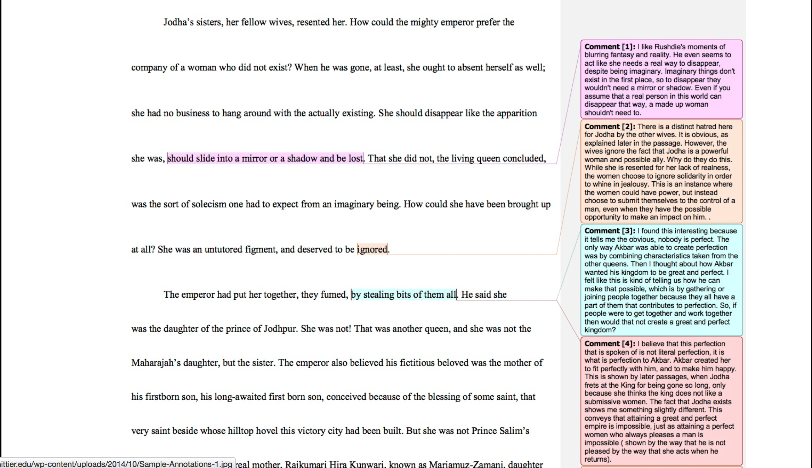
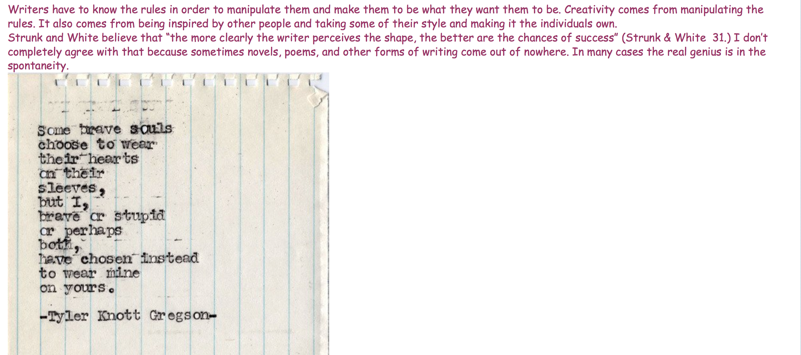
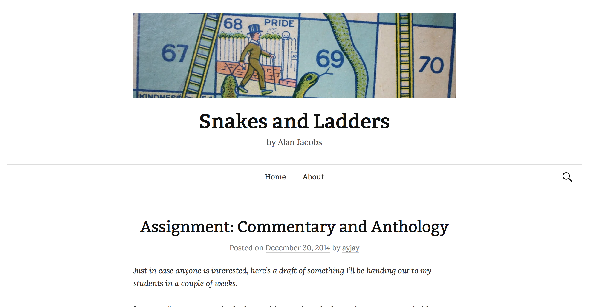
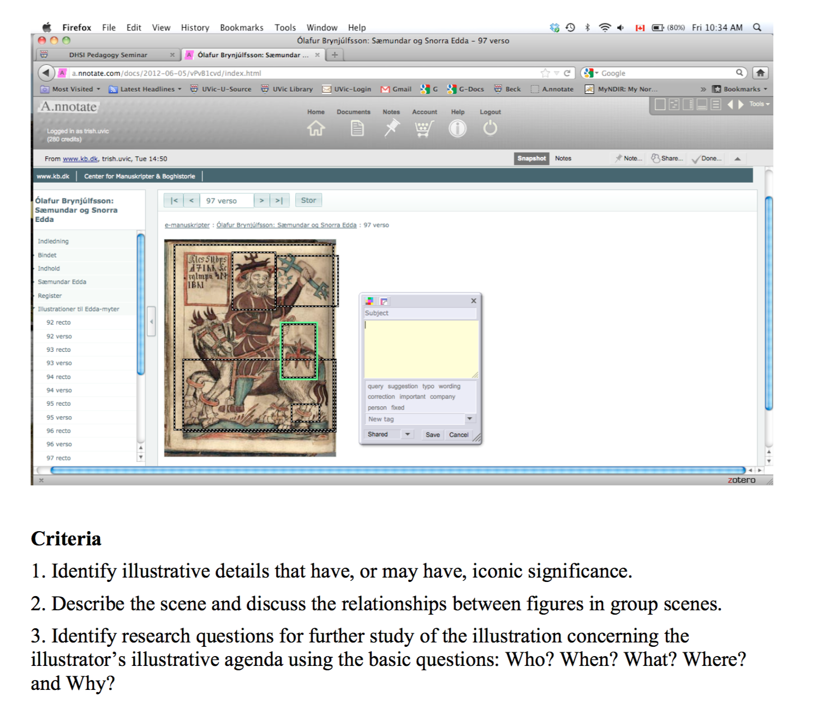
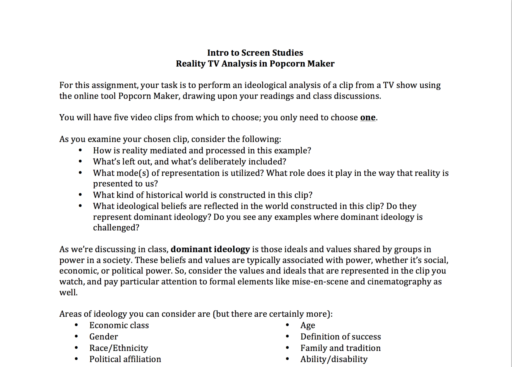
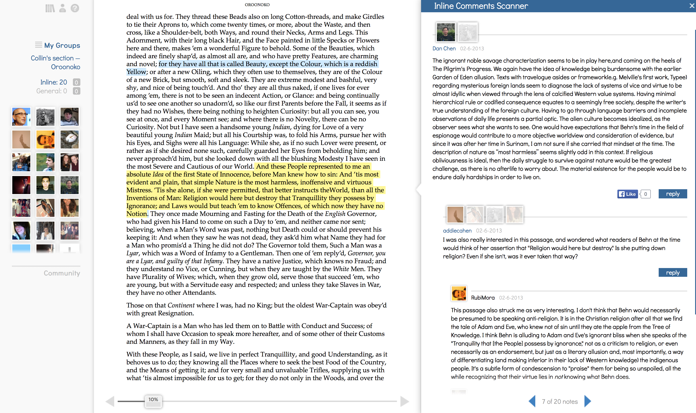
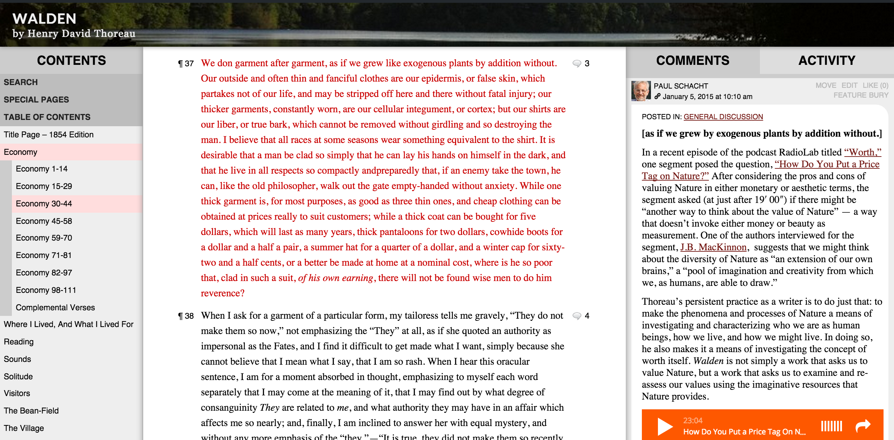
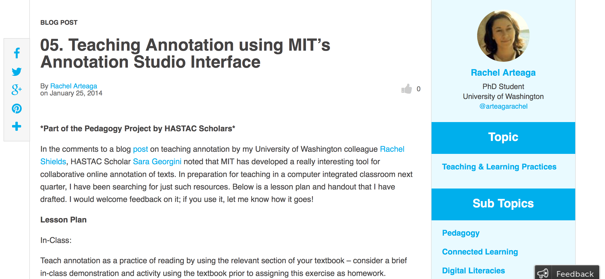
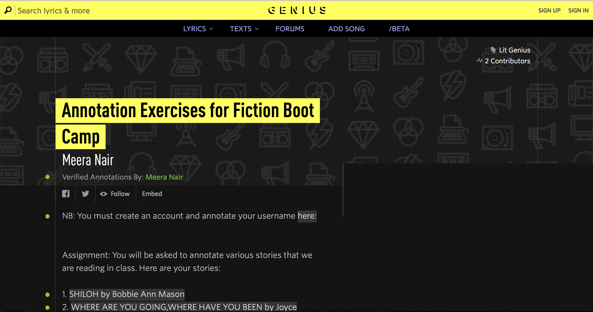
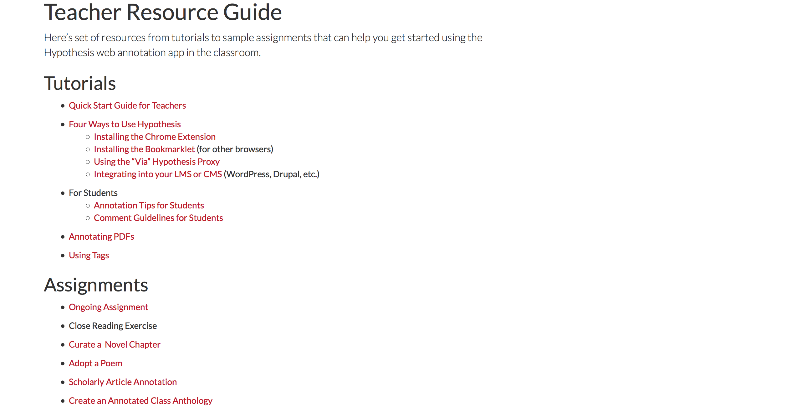

# ANNOTATION

## PAUL SCHACHT
State University of New York at Geneseo | http://www.geneseo.edu/english/schacht

---

##### Publication Status:
* unreviewed draft
* draft version undergoing editorial review
* **draft version undergoing peer-to-peer review https://digitalpedagogy.commons.mla.org/**
* published 

--- 

## CURATORIAL STATEMENT

"I contend, quite bluntly, that marking up a book is not an act of mutilation but of love." So wrote the philosopher Mortimer J. Adler in 1941, describing an amatory practice that scholars, students, and other serious readers have pursued with gusto for millennia. But continuing that practice with digital text has not always been easy. Although Mosaic, the first graphical Web browser, [was intended to permit annotation](https://www.hastac.org/initiatives/hastac-scholars/scholars-forums/amplified-marginalia-social-reading-listening-and), good tools for marking up what you read - or hear, or view - online have been slow to develop. 

Fortunately, they're now available in abundance. And as they enable multitudes of readers to share their "acts of love" instantly across space and time, connecting not only with texts but with one another *inside* texts, they're facilitating a kind of textual intimacy that traditional books don't provide. 

Two words frequently used to describe online annotation tools underscore what's new: "social" and "open." Thanks to a platform named [SocialBook](http://www.livemargin.com), Stephen Duncombe's annotatable edition of Thomas More's _Utopia_ is "open to criticism, open to participation, and open to re-creation" by its readers, offering a kind of intimacy at scale. SocialBook's CEO, Bob Stein, is founder and co-director of the [Institute for the Future of the Book](http://futureofthebook.org), the birthplace of [MediaCommons](http://mediacommons.futureofthebook.org/), a digital scholarly network where in 2009 Kathleen Fitzpatrick made her manuscript [*Planned Obsolescence*](http://mcpress.media-commons.org/plannedobsolescence/) available for ["open peer review"](http://mcpress.media-commons.org/plannedobsolescence/#pAisatbctchwtsOotptahainrprfdaiwbamphtaepiciospwpao) using [CommentPress](http://futureofthebook.org/commentpress/), an annotation plugin to the open-source blogging platform [WordPress](http://wordpress.org).

The participatory ethos of social annotation aligns it with the promise of radical democracy: free expression, common ownership, mutual commitment; liberty, equality, fraternity. The promise stands in marked opposition to those aspects of higher education pedagogy and scholarship that remain, even in democratic societies, hierarchical, exclusive, proprietary, and competitive.

First and foremost, then, collaborative annotation platforms offer teachers a tool for democratic practice. When teaching literature, such practice might involve encouraging students to "talk back" to a canonical author in the margins of the author's work, or inviting them to engage in conversation there as equals with  their professor and classmates. When teaching writing, it might entail inviting students to engage in peer review of one another's drafts or finished essays.  Both kinds of assignment build community, empower students to speak, and underscore the inherently collective nature of creativity and interpretation.

These platforms also provide an opportunity to highlight what democratic deliberation shares with academic discourse: the general form of conversation. As Gerald Graff and Cathy Birkenstein argue in their influential writing handbook *"They Say"/"I Say": The Moves that Matter in Academic Writing*, writing-as-conversation, both within and outside academia, typically begins by gesturing toward an actual or hypothetical position taken by another, then responds in ways that follow a limited menu of general patterns, each of which allows for considerable variation. The margins of a text can serve as a space for noticing and practicing the moves that matter in written discourse at a faster pace than is possible at the level of the essay.

Some social annotation tools provide an option for private note-taking.  This feature can be a useful provocation to explore the countervailing values of openness and privacy in the classroom, on the Web, and in democracy generally. It can also help students learn to read more deliberately, attentively, even caressingly, not only marking and defining unfamiliar words, concepts, or references, not only positing interpretations, but also registering their sensory experience of a text, exchanging a hermeneutic approach for the erotic one memorably advocated by the critic Susan Sontag. 

Although the terms *social reading* and *social annotation* point to a genuinely new affordance of digital text, it's important to note that the affordance isn't sociality itself but, as noted above, the speed and scale at which it can be practiced. Failure to register this fact obscures one of the most important opportunities that the Web offers us as teachers: to explore with our students how thoroughly social the activities of reading and writing have always been. The deeply social nature of annotation in particular was a theme of a symposium held in 1988, five years before the advent of the graphical Web, entitled "Annotation and Its Texts," at which the historian Anthony Grafton delivered an "informal report" on a pathbreaking investigation with his colleague Lisa Jardine into Renaissance reading practices. Setting out to discover how the English writer Gabriel Harvey read his copy of Livy's Roman history, Grafton and Jardine discovered that the answer was publicly, rhetorically, even collaboratively, not so much for private meditation as for worldly action. It would have surprised but perhaps not displeased Harvey that a world-wide audience can now page through his annotations of Livy themselves at [Annotated Books Online](http://www.annotatedbooksonline.com/), where they can also engage in a kind of second-order social annotation: lovingly transcribing his notes and those of other margin-scribblers in a growing library of annotated early modern books. 

The artifacts collected here are intended to illustrate social annotation's wide range of possible uses for teaching literature, writing, and the history of books and reading, as well as the variety of the tools themselves.

## CURATED ARTIFACTS

#### Annotation Assignment

* Artifact Type: Assignment
* 
* [http://diglibarts.whittier.edu/?page_id=1372](http://diglibarts.whittier.edu/?page_id=1372)
* **Permissions:** Used with permission of author
* **Document:** annotation_document_google_docs.pdf

Jonathan Burton's assignment uses social annotation to sharpen students' close reading skills and to teach collaboration. Working in teams, students select  passages from the assigned reading that they consider "rich in figurative language, curious in form or otherwise abundant in detail," transcribe them in [Google docs](https://www.google.com/docs/about/), and annotate them. In a second round, they respond to some of their classmates' annotations. Finally, students draw on their annotated transcriptions to produce brief "problem papers." This assignment takes advantage of a simple digital tool with a very shallow learning curve to move students past the "solitary-reader-meets-text" model of textual analysis and scaffold their development of a more comprehensive argument. It can be easily adapted to any text.

#### Annotating *The Elements of Style*

* Artifact Type: Assignment
* 
* [http://introtoenglishstudies.pbworks.com/w/page/68678680/Group%204%20Wiki%20Page](http://introtoenglishstudies.pbworks.com/w/page/68678680/Group%204%20Wiki%20Page)
* **Permissions:** None specified
* **Document:** annotation_document_pbwiki.html

Using [PBWorks](http://www.pbworks.com), a group of Laura Lisabeth's students produced this artifact for a class she describes in her article "Empowering Education with Social Annotation and Wikis," published in _Web Writing: Why and How for Liberal Arts Teaching and Learning_, ed. Jack Dougherty and Tennyson O'Donnell (University of Michigan Press/Trinity College ePress edition, 2014), [http://epress.trincoll.edu/webwriting/chapter/lisabeth](http://epress.trincoll.edu/webwriting/chapter/lisabeth). This anthology of essays on digital writing pedagogy was itself assembled through an open peer-review process. (The CommentPress version of Lisabeth's essay may be found [here](http://webwriting2013.trincoll.edu/citation-annotation/lisabeth-2013/?doing_wp_cron=1442324537.1288309097290039062500). Lisabeth asked students to respond to Strunk and White's *Elements of Style* -- a freighted cultural object -- encouraging them to comment not only discursively but also in ways that make use of links (literal or figurative) to other objects. This emphasis on objects deliberately pulls against the conventional notion of social annotation as conversation.

#### Commentary and Anthology as Genres

* Artifact Type: Assignment
* 
* [http://blog.ayjay.org/uncategorized/assignment-commentary-and-anthology/](http://blog.ayjay.org/uncategorized/assignment-commentary-and-anthology/)
* Permissions: Author copyright 
* Document: annotation_document_commentary_anthology.html

Like many of the other artifacts collected here, Alan Jacobs' assignment is designed to encourage close reading. But Jacobs' eloquent explanation of the assignment also invites students to consider both their reading and their writing historically. Pointing out that commentary is a *genre*, he questions the cultural assumption that it is "passive" in comparison to the genre most students are asked to master in college: the argumentative essay. Jacobs has students compile an anthology of writings in [CommentPress](http://futureofthebook.org/commentpress/), a plugin for the WordPress blogging platform, then comment on these writings collaboratively. As he points out, the anthology, too, is a genre, and together the two genres of genre and anthology represent major traditions of religious reading.

### Image Annotation Assignment

* Artifact Type: Assignment
* 
* [http://web.uvic.ca/~englblog/pedagogydhsi/files/2012/05/baer.pdf](http://web.uvic.ca/~englblog/pedagogydhsi/files/2012/05/baer.pdf)
* **Permissions:** None specified
* **Document:** annotation_document_image_annotation.pdf

Trish Baer's annotation assignment for a course on "Old Norse Gods and Heroes" was developed as part of a course on [Digital Pedagogy](http://web.uvic.ca/~englblog/pedagogydhsi/) taught at [DHSI](http:/dhsi.org), the Digital Humanities Summer Institute, by Katherine D. Harris, Diane Jakacki, and Jentery Sayers. It illustrates the value of social annotation for teaching students to read images as well as text. Baer's assignment has students use [A.nnotate](http://a.nnotate.com/), a platform that permits users to select image regions for annotation. She asks students to think of an unfamiliar image from Norse mythology "as a mystery in need of a solution that you will acquire the skills to solve." Solving the mystery involves recognizing some of the features that set images apart from written texts, such as the use of visual icons and the placement of figures in spacial relationships that generate meaning.

#### Video Annotation Assignment

* Artifact Type: Assignment
* 
* [http://files.cargocollective.com/18691/TVAnalysisPopcornMaker.pdf](http://files.cargocollective.com/18691/TVAnalysisPopcornMaker.pdf)
* Permissions: CC-BY-NC 2.5
* Document: annotation_document_video_annotation.pdf

Jennifer Proctor's video annotation assignment uses an open-source platform for which the creator, Mozilla, has chosen to discontinue support: [PopcornMaker](https://blog.webmaker.org/product-update-for-appmaker-and-popcorn-maker). It thus illustrates one of the risks of social annotation and of digital pedagogy in general. However, it's included here not for the choice of platform but for the shape of the assignment and the fact that the annotated object is a moving image. Proctor's assignment establishes a very particular framework for the student's annotations, asking students to consider, for example, how reality is mediated and processed in the clip they are to annotate. Any platform that supports video annotation, such as [SocialBook](http://www.livemargin.com), could work for this assignment; another option would be to use open-source video annotation software such as that being developed by the [Open Video Annotation Project](http://www.openvideoannotation.org/). 

#### Sample of Student Conversation

* Artifact Type: Student Sample
* 
* [http://futureofthebook.org/blog/wp-content/uploads/2014/03/oroonoko-2.png](http://futureofthebook.org/blog/wp-content/uploads/2014/03/oroonoko-2.png)
* **Permissions:** None specified
* **Document:** annotation_document_socialbook.png

This screenshot of an upper-level British literature survey class is included in Bob Stein's blogpost ["SocialBook in Action"](http://futureofthebook.org/blog/2013/08/18/socialbook-in-action/), which illustrates the range and power of [SocialBook](https://www.livemargin.com) as a collaborative annotation platform. Readers can establish social identities with avatars and belong to multiple groups. They can engage in rich, detailed interpretive discussion in the margins of a text, and they can connect these discussions to their broader social presence online -- for example, by "liking" a marginal comment on Facebook. As Stein points out in his blogpost, the "emerging class of applications" to which SocialBook and other platforms collected here belong  might be called '[collaborative] thinking processors' as opposed to reading environments or word processors. The stronger the social ties in a platform for collaborative annotation, the greater the likelihood that a class moves from conversation to a genuine sense of community. 

#### Instructor Comment in The Readers' Thoreau
* Artifact Type: Instructor Sample
* 
* [http://commons.digitalthoreau.org/walden/economy/economy-30-44/#comment-2172](http://commons.digitalthoreau.org/walden/economy/economy-30-44/#comment-2172)
* **Permissions:** Used with permission of author
* **Document:** annotation_document_readers_thoreau.html

I've included my own comment in the margin of Henry David Thoreau's _Walden_ here to illustrate how an instructor's annotation can serve to make connections between a text under discussion and other texts in a variety of media. An instructor's comment can also prompt students to consider a particular passage in the larger context of the work or in the context of ideas. This social edition of _Walden_ can be found at [The Readers' Thoreau](http://commons.digitalthoreau.org), a site that embeds a library of Henry David Thoreau's works in a social network built with [Commons In A Box](http://commonsinabox.org) and [CommentPress](http://futureofthebook.org/commentpress/). Kristen Case (University of Maine, Farmington) and I describe how the network operates and our experience teaching with it in ["Reading Deliberately: Thoreau Online"](https://www.academia.edu/9729828/Reading_Deliberately_Thoreau_Online). Like [SocialBook](http://www.livemargin.com), The Readers' Thoreau attempts to build a sense of community among readers by extending their connections beyond the margins of the text.

#### Annotation Lesson Plan

* Artifact Type: Lesson Plan
* 
* [https://www.hastac.org/blogs/rachel-arteaga/2014/01/25/05-teaching-annotation-using-mits-annotation-studio-interface](https://www.hastac.org/blogs/rachel-arteaga/2014/01/25/05-teaching-annotation-using-mits-annotation-studio-interface)
* **Permissions:** None specified
* **Document:** annotation_document_lesson_plan.html

Rachel Arteaga's lesson plan for annotating a portion of *Moby-Dick* using MIT's [Annotation Studio](http://www.annotationstudio.org/) not only encourages close reading and collaboration but also illustrates the variety of textual features that can be brought to students' attention through annotation. It also encourages students to think about those features taxonomically by taking advantage of Annotation Studio's ability to accept comment tags. Arteaga divides her students into 5 groups focused on annotating, respectively, vocabulary, cultural/literary/geographical references, claims, tone/language/syntax, and social contexts.

#### Guidelines for Annotating Fiction

* Artifact Type: Best Practice
* 
* [http://genius.com/Meera-nair-annotation-exercises-for-fiction-boot-camp-annotated](http://genius.com/Meera-nair-annotation-exercises-for-fiction-boot-camp-annotated)
* Permissions: None specified
* Document: annotation_document_genius.html

Meera Nair's "Annotation Exercises for Fiction Boot Camp" has been included here for its attempt to define what an "excellent fiction annotation" should contain, as well as for its use of [Genius](http://genius.com) as annotation platform. Most of the social annotation assignments collected here ask students to generate interpretive or explanatory annotations; Nair's does the same, but it also asks them to comment on passages with an eye toward craft, focusing, for example, on characterization, scenic presentation, and thematic development. Genius is a platform that many students will already be familiar with, and it's one where they can join a larger community of readers interested in annotating literature (particularly song lyrics) collaboratively. Nair has written about her use of social annotation to teach fiction for the [National Writing Project](http://digitalis.nwp.org/resource/6179). 

#### Teacher Resource Guide

* Artifact Type: Resource Guide
* 
* [https://hypothes.is/teacher-resource-guide/](https://hypothes.is/teacher-resource-guide/)
* **Permissions:** None specified
* **Document:** annotation_document_hypothesis.html

Unlike the other annotation tools represented here, [Hypothes.is](http://hypothes.is) doesn't work by importing content into an annotation platform; instead, it superimposes annotation functionality on Web content wherever you find it. It can even be used to annotate pdfs on the Web. This Teacher Resource Guide on the Hypothes.is website explains how to install the Chrome extension and the bookmarklet for other browsers, walks users through the basics of creating an annotation, and provides several examples of assignments, including an assignment to annotate a scholarly article. In one of the resources, ["10 Ways to Annotate with Students"](https://hypothes.is/blog/back-to-school-with-annotation-10-ways-to-annotate-with-students/), Jeremy Dean, Director of Education for Hypothes.is, points out the value of asking students to explore different users' annotation streams, apart from the texts to which the annotations are attached; this approach foregrounds social connections rather than texts.  

## RELATED MATERIALS

- *Hypothes.is YouTube Channel*. Web. 17 September 2015. https://www.youtube.com/user/hypths
- *Annotations at Harvard*. Harvard University. Web. 17 September 2015. http://www.annotations.harvard.edu/icb/icb.do?keyword=k80243&pageid=icb.page422517
- *MIT Annotation Studio YouTube Channel*. Web. 17 September 2015. https://www.youtube.com/channel/UC701jx4rVA2eQSqjJ-ylf_g
- *Candide 2.0*. New York Public Library. Web. 17 September 2015. http://candide.nypl.org/text/
- Stein, Bob. *A Taxonomy of Social Reading*. Institute for the Future of the Book. Web. 17 September 2015. http://futureofthebook.org/social-reading/

## WORKS CITED

- *A.nnotate*. Web. 17 September 2015. http://a.nnotate.com/
- *Annotated Books Online*. Web. 17 September 2015. 
http://www.annotatedbooksonline.com/
- *Commons In A Box*. Web. 17 September 2015. http://commonsinabox.org
- Dean, Jeremy. "Back to School with Annotation: 10 Ways to Annotate with Students." Blog post. 25 August 2015. Web. 17 September 2015. https://hypothes.is/blog/back-to-school-with-annotation-10-ways-to-annotate-with-students/
- Duncombe. Stephen. *Open Utopia*. Web. 17 September 2015. http://theopenutopia.org/
- Fitzpatrick, Kathleen. *Planned Obsolescence*. Web. 17 September 2015. http://mcpress.media-commons.org/plannedobsolescence/
- *Genius*. Web. 17 September 2015. http://genius.com
- Graff, Gerald and Cathy Birkenstein. *"They Say/I Say": The Moves that Matter in Academic Writing*. 3rd ed. New York: W.W. Norton and Co., 2015.
- Grafton, Anthony and Lisa Jardine. "'Studied for Action': How Gabriel Harvey Read His Livy." *Past & Present* 129 (1990): 30-78. Print.  
- Grafton, Anthony. "*Discitur ut agatur*: How Gabriel Harvey Read His Livy." *Annotation and Its Texts*. Ed. Stephen A. Barney. New York: Oxford University Press, 1991. 108-129.
- HASTAC Scholars Program. "'Amplified Marginalia': Social Reading, Listening, and Writing." Blog post. 9 May 2013. Web. 17 September 2015. https://www.hastac.org/initiatives/hastac-scholars/scholars-forums/amplified-marginalia-social-reading-listening-and
- Harris, Katherine D., Diane Jakacki, and Jentery Sayers. *Digital Pedagogy*. Web. 17 September 2015. http://web.uvic.ca/~englblog/pedagogydhsi/
- Lisabeth, Laura. "Empowering Education with Social Annotation and Wikis." _Web Writing: Why and How for Liberal Arts Teaching and Learning_. Ed. Jack Dougherty and Tennyson O'Donnell (University of Michigan Press/Trinity College ePress edition, 2014), http://epress.trincoll.edu/webwriting/chapter/lisabeth
- Nair, Meera. "Annotate the Plot: Using Annotation to Write Better Fiction." *Digital Is*. National Writing Project. Web. 17 September 2015. http://digitalis.nwp.org/resource/6179
- *Open Video Annotation Project*. Web. 17 September 2015. http://www.openvideoannotation.org/
- *The Readers' Thoreau*. Web. 17 September 2015. http://commons.digitalthoreau.org
- Schacht, Paul and Kristen Case. "Reading Deliberately: Thoreau Online." 
- *SocialBook*. Web. 17 September 2015. http://www.livemargin.com
*Pedagogy* 15 (2015): 193-206.
- Sontag, Susan. *Against Interpretation and Other Essays*. New York: Dell Publishing Co., 1978. 
- Stein, Bob. "Social Book in Action." Blog post. 18 August 2013. Web. 17 September 2015. http://futureofthebook.org/blog/2013/08/18/socialbook-in-action/

