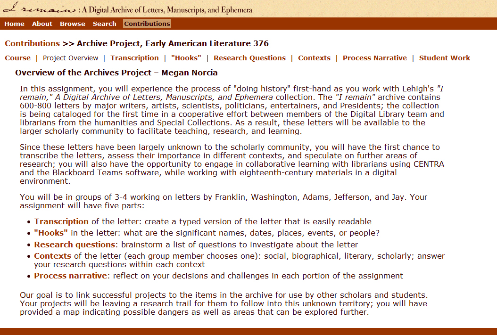
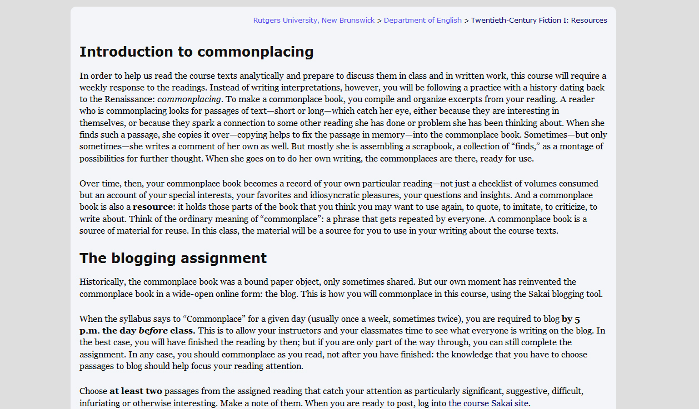
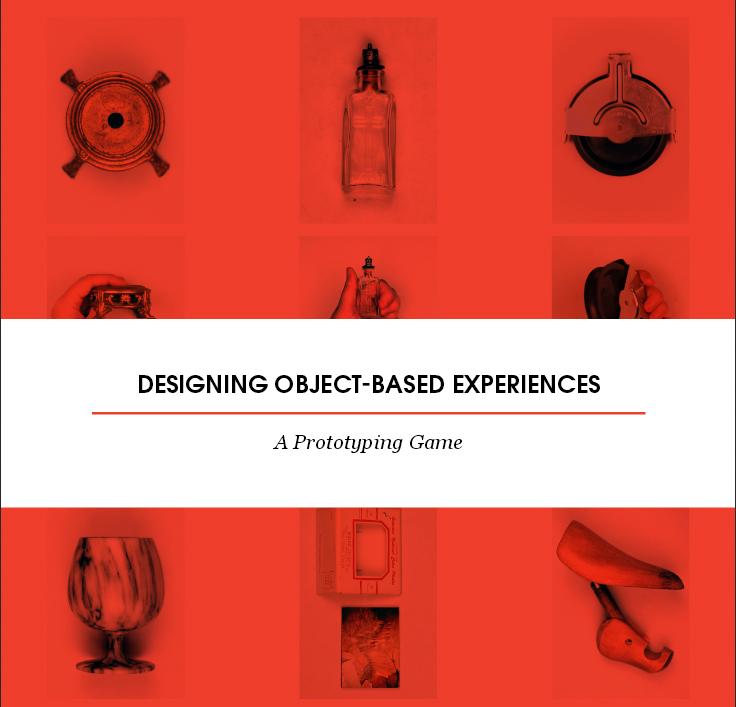
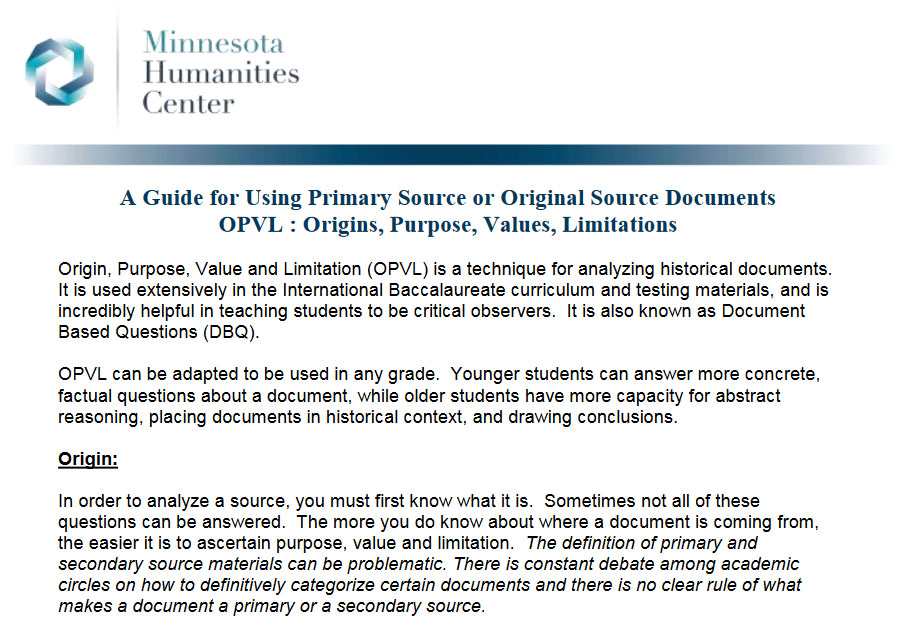
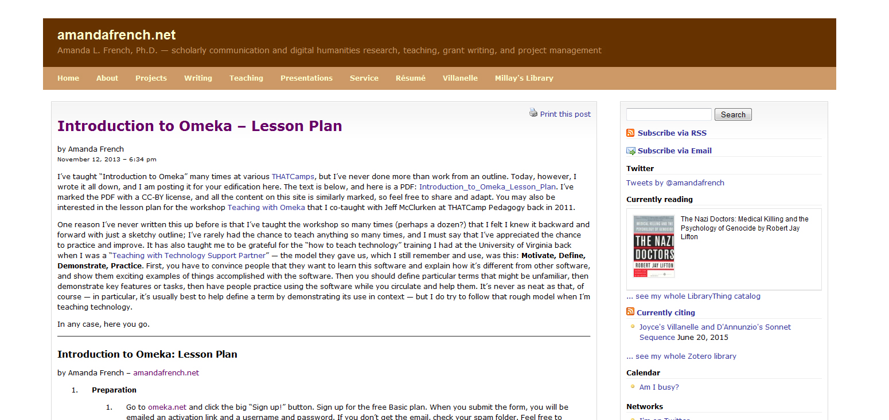
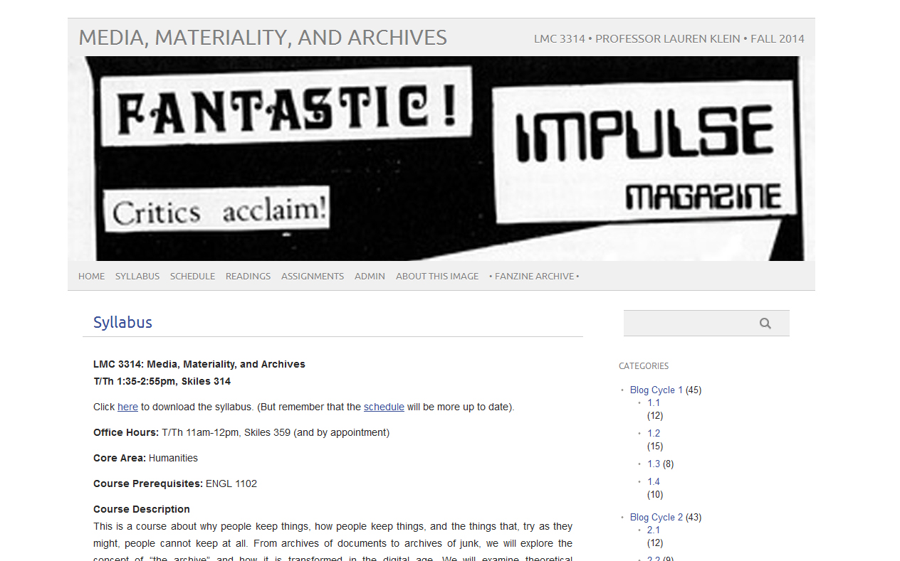
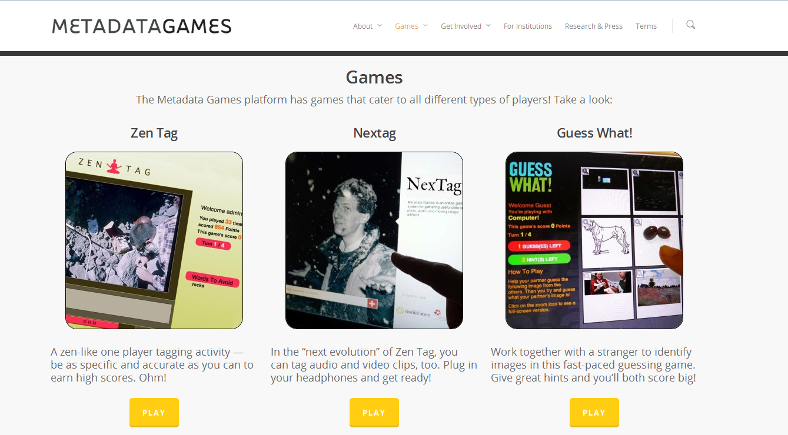
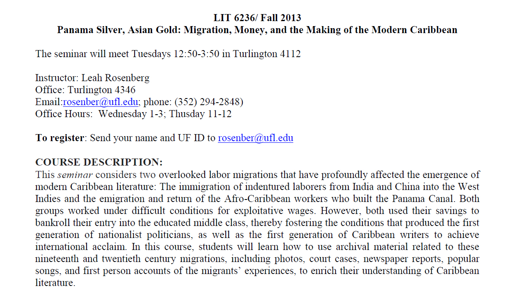
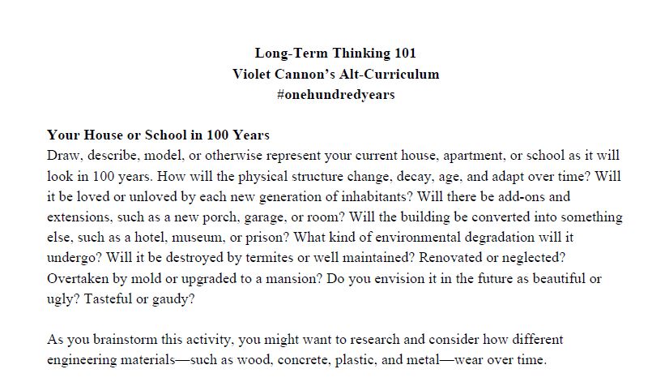

# ARCHIVE (Draft)

## AUTHORS: Lauren Coats (LSU) and Gabrielle Dean (Johns Hopkins University)

---

##### Publication Status:
* unreviewed draft
* draft version undergoing editorial review
* **draft version undergoing peer-to-peer review https://digitalpedagogy.commons.mla.org/**
* published 

--- 	

## CURATORIAL STATEMENT

##### Wonder
That is often the response of students in their encounters with archival materials: a rare early edition of a canonical novel, an odd handwritten scribble on a favorite author’s manuscript, a stunning digital collection of comic book covers.  Such wonder is powerful, and for us is the starting point for the pedagogical value of archives.  When students are free to explore the archive, when they are encouraged to investigate objects they find fascinating, wonder propels a fundamental scholarly process: discovery. Perhaps even more importantly, when a student is moved by an object in the archive—finding it strange or significant, frightening or beautiful, marvelous or inane—the experience itself is an eloquent indicator of the impact of literature and the pull of literary history.

##### Mediation
Investigations of the archive make literature and literary history tangible.  The focus on the object that is at the heart of archival pedagogy helps students grasp the materiality of textual artifacts and grapple with the relationship of form and content.  In the classroom, the archive can include digital and analog materials: manuscripts and printed papers, books, photographs, films, tapes, digital entities. This variety of materials helps students recognize the textual differences that different technologies produce, and consider the continuities and discontinuities between digital forms and their antecedents. The digital archive—whether composed of born-digital objects or digitized surrogates—does not entail a loss of materiality but instead puts it in relief, presenting new varieties of textual mediation.  Analyzing a digitized version of an abolitionist newspaper, for example, students can broach questions central to textual and material culture studies about the production and circulation of literature: Who read this newspaper originally, and where? Why were reading and writing seen as central to political action?  The contrast between nineteenth-century print newspapers and twenty-first-century online databases makes these questions more resonant and connects them to the present: Why and how are we reading these newspapers now?  Whether it involves analog or digital materials or both, archive-focused pedagogy fundamentally enables an analysis of media’s relation to culture. 

##### Curation
Archival materials are the physical traces of value-laden actions. Archives represent a chain of selection decisions, policy implementations, and stewardship procedures, taken over and over again, in order to save particular materials from the past or present and offer them to an imagined future— or not.  These curatorial processes are what make an archive; and they make an archive far from neutral.  Archivists, both professional and lay, gather and structure materials in ways that embody values. These values—beliefs, norms, cultural assumptions—may be explicit (as in the Society of American Archivists’ [Code of Ethics](http://www2.archivists.org/statements/saa-core-values-statement-and-code-of-ethics)) or implicit (as when the topical focus of a digital collection reinforces or challenges traditional ways of studying literary history). Moreover, the values that shape an archive inflect its future use by forming points of access and interest.  

In many kinds of classes—from the special collections single session to the survey course to the advanced seminar—the use of archival materials, digital or analog, requires thinking about the archive itself.  Asking students to practice as archivists—by selecting items for a new archive, reorganizing an existing archive, or presenting an archive for display—means they participate in the repertoire of actions that produce, assemble, make available, preserve, and use a set of materials. This practice requires them to examine the range of values archives express and contend with the ethics of curation.  In making their own digital collections, for example, students must navigate the politics of inclusion and exclusion.  Acting as archivists, they must determine what principles will guide their selections, consider how best to present and share what they have chosen, and confront practical limitations that have ethical dimensions.  From this vantage-point, they are also better equipped to analyze the selection and presentation choices others have made: what ideas about how a collection will be used inform its metadata framework (archive-wide categories and vocabularies used to organize and describe the content) or digital display, for example.  In exercises like these, students enter into long-standing critical debates about taste and canonicity as participants, not simply as observers.  More broadly, archival practice gives students a compelling introduction to the intellectual consequences of curation, the many choices about an object's archival fate that determine if and how future users will see and use it.  
 
The objects we have collected below embrace a decidedly vernacular understanding of "archives" as any purpose-built collection of materials, as opposed to a [stricter professional definition](http://www.archivesnext.com/?p=3683).  They focus on the three facets of archive-focused pedagogy discussed above: wonder, mediation, and curation.  We have selected these objects as literary scholars and teachers who regularly use analog as well as digital archives, and exploit the affordances of digital technology to enrich teaching and learning with archives of both old and new media. This list, arranged alphabetically, emphasizes student activities: archive-focused exercises and assignments and teacher resources for developing them. Above all, we have selected items that we think will help students enter the archive as thoughtful users and makers.  

## CURATED ARTIFACTS

### "Archive Project"

* Artifact type: assignment and student work
* Source URL: http://digital.lib.lehigh.edu/remain/con/lit376_over.html
* Copy of Artifact: [files/archive-archive%20project-copy.htm](files/archive-archive%20project-copy.htm)
* Creator: Ed Gallagher (Lehigh University) and Meg Norcia (State University of New York - Brockport)
* Permissions:  fair use

In this transcription exercise, students both use and build archives, which has several pedagogical outcomes.  As students transcribe digital surrogates of manuscript letters, they engage in the process of remediation that raises questions about what is lost and gained when information is moved from one medium to another. As students annotate significant features of their letters, they learn how to develop a larger research project or question from a single object. Because student transcriptions are incorporated into the institutional archive, the exercise opens up issues of access, use, and public scholarship. Adaptations of this exercise as a stand-alone course transcription project might take advantage of open-source transcription tools (such as [Scripto](http://scripto.org/) or [From the Page](http://beta.fromthepage.com/)).  Or, students could contribute to an extant crowdsourcing transcription project, such as University of Iowa’s [DIY History](http://diyhistory.lib.uiowa.edu/) or the [National Archives’ Transcription Challenge](http://www.archives.gov/citizen-archivist/transcribe/).

### Commonplacing Assignment

* Artifact type:  assignment
* Source URL: http://www.rci.rutgers.edu/~ag978/355/commonplace/single.html
* Copy of Artifact: [files/archive-commonplacing%20assignment-copy.htm](files/archive-commonplacing%20assignment-copy.htm)
* Creator: Andrew Goldstone (Rutgers University)
* Permissions: CC-BY-NC 3.0 Unported

A commonplace book is a form of personal archive, a means of recording and arranging textual passages of particular value to the collector for future use. This exercise adapts the traditional paper-based commonplace book to a digital form, the blog. Valuable as a stand-alone exercise, as a way to support attentive reading and textual analysis, it can also serve as a springboard for other activities: collection-building projects that develop principles of selection and organization, discussions of the subjective and affective aspects of archiving (Benjamin), or essay assignments that address the selected passages.

### "Composing Digital Media: Citizen Archives"

* Artifact type: syllabus
* Source URL: http://www.digitaltrishacampbell.com/cdm_citizen.html
* Copy of Artifact: [files/archive-composing%20digital%20media-copy.htm](files/archive-composing%20digital%20media-copy.htm)
* Creator: Trisha Campbell (Salisbury University)
* Permissions: no license or copyright information given; fair use

This course demonstrates one way to focus students’ attention on what is left out, by teaching students to recognize and redress the gaps that exist in all archives.  Building on the National Archives’ call for "citizen archivists" to contribute to its collections, Campbell’s readings and assignments help students develop digital media skills by composing narratives and artifacts for  "locally made, citizen composed archives."  The assignments, such as creating a photographic "Recovery Story" of a person or thing, encourage students to consider the historical importance and the ephemerality of individual perspectives and the everyday.  This course models how digital literacy or composition courses can productively engage with archival practices and theories.

### *Designing Object-Based Experiences: A Prototyping Game*

* Artifact type: game
* Source URL: http://beautifuldata.metalab.harvard.edu/wp-content/uploads/2014/09/BD_Game_Cards.pdf 
* Copy of Artifact: [files/archive-designing%20object%20based%20experiences-copy.pdf](files/archive-designing%20object%20based%20experiences-copy.pdf)
* Creator: metaLAB (Harvard University)
* Permissions: Creative Commons Attribution 3.0 Unported 

What kinds of experiences can archival materials generate?  Students get to play with this question in this game, in which players stage a range of archival encounters. The game includes "object histories," with detailed information about six specific objects, and three sets of playing cards: one set that describes possible audiences (e.g., "a college student who is deaf"), one set devoted to presentation formats (e.g., "mobile app"), and one to presentation values (e.g., "shareability"). Participants draw one of each card, then "prototype an experience" with the selected object that fits the parameters.  Teachers could develop their own object histories and cards to fit their course themes and media; the game could also help students brainstorm possibilities at the start of an archive- or exhibit-building assignment. The game helps students experiment with the variety of meanings artifacts can accrue through different kinds of mediation and curation.

### *A Guide for Using Primary Source or Original Source Documents: Origins, Purpose, Values, Limitations (OPVL)*

 
* Artifact type: teaching guidelines
* Source URL: http://www.minnesotahumanities.org/Resources/A%20Guide%20for%20Using%20Primary%20Source%20Documents.pdf
* Copy of Artifact: [files/archive-guide%20using%20primary%20sources-copy.pdf)](files/archive-guide%20using%20primary%20sources-copy.pdf)
* Creator: Minnesota Humanities Center
* Permissions: no copyright or license information given; fair use

A basic object analysis exercise can turn a student's initial wonder about an object—"what is it?"—into a foundation for further research by providing a scaffolding for observation and the pursuit of evidence. The resource models how much students can learn about an object through careful examination of its paratexts and bibliographic information.  Although the "original source document" is presumed to be paper-based, the OPVL exercise is easily adapted to digital materials, just as the analog exercise can be extended by digital means, such as a class blog or online annotation tool. In our own classes, we have supplemented the exercise with specific questions about a textual object’s materiality: packaging, design, evidence of use. Teachers can find similar pedagogical resources within some digital collections, such as the [National Archives Docs Teach](http://docsteach.org/) that offers a suite of educational activities.
 

### "Introduction to Omeka: Lesson Plan"

* Artifact type: lesson plan
* Source URL: http://amandafrench.net/2013/11/12/introduction-to-omeka-lesson-plan
* Copy of Artifact: [files/archive-introduction%20to%20omeka-copy.pdf](files/archive-introduction%20to%20omeka-copy.pdf)
* Creator: Amanda French (Virginia Tech)
* Permissions: Creative Commons Attribution 3.0 Unported 

A student-curated digital exhibit is a foundational and flexible archival exercise. This lesson plan introduces one digital exhibition platform, Omeka.  The lesson provides useful background information, such as definitions of key terms in digital content management and links to Omeka projects and resources.  It takes students through the different stages of building an exhibit, from selecting items to identifying them to arranging them—what French describes as a "multimedia essay" that intimately links the exhibition narrative and display to the archival collection.  It thus serves as a general introduction to the storytelling and argumentation skills that students develop through the exhibition curation process.

### "Media, Materiality, and Archives" Syllabus

* Artifact type: syllabus
* Source URL: http://blogs.iac.gatech.edu/archives14/syllabus/ 
* Copy of Artifact: [files/archive-media%20materiality%20archives-copy.htm](files/archive-media%20materiality%20archives-copy.htm)
* Creator: Lauren Klein (Georgia Tech)
* Permissions: Used with permission of Lauren Klein. 

This course integrates literary study of contemporary texts with archival theory and practice. The course texts include a pulp thriller, a work of "serious" literary fiction, a graphic novel, and an ephemeral electronic book; embodying a variety of forms, they address and enact the "concept of 'the archive.'" As students interrogate the relationship between archival formations and textual materiality, they gain fluency in a set of questions which they then transfer to digital projects: a class blog and a digital archive of sci-fi fanzines made from a library collection. Students thus engage with the challenges of mediation and curation both as consumers of literature and as producers of literary history.

### *Metadata Games*

* Artifact type: set of games
* Source URL: http://www.metadatagames.org/#games 
* Copy of Artifact: [files/archive-metadata%20games-copy.htm](files/archive-metadata%20games-copy.htm)
* Creator: Mary Flanagan (Tiltfactor Laboratory Dartmouth College), Peter Carini (Rauner Library Dartmouth College), et al
* Permissions: "Metadata Games is a free and open source software (FOSS) online game system"; the website is copyrighted. 

It can be difficult to suture the sense of wonder that archives can produce to pedagogical and scholarly practice. This resource, a suite of metadata games, literally turns archival work into play. Players are asked to tag items with descriptive words or phrases; their tags feed back into the participating archives to become part of the objects’ descriptions. It’s a fun and easy way to introduce the role of metadata in digital discovery: How do you identify things in archives so that researchers can find relevant sources, and what happens to objects that lack descriptors? Follow-up conversations might address the differences between folksonomies (like the students’ tags) and controlled vocabularies, or the consequences of mistaken or false tags. An advanced version of this exercise might ask students to create their own archive games, for instance to [program a twitterbot](http://f14tot.ryancordell.org/2014/11/12/lab-12-scripting/) to remix content from a student-created or university archive.

### "Panama Silver, Asian Gold: Migration, Money, and the Making of Modern Caribbean Literature” Syllabus

* Artifact type: syllabus and related assignments
* Source URL: http://ufdc.ufl.edu/AA00013935/00001
* Copy of Artifact: [files/archive-panama%20silver-copy.pdf](files/archive-panama%20silver-copy.pdf)
* Creator : Leah Rosenberg (University of Florida), in collaboration with Rhonda Cobham Sander (Amherst College) and Donette Francis (University of Miami)
* Permissions:  CC-BY-NC-SA 3.0 Unported 

In this class, students read early twentieth-century and contemporary Caribbean novels and short stories in tandem with archival materials in the Digital Library of the Caribbean (www.dloc.com). The course positions the archive both as a means of historical and cultural recovery and as a symptom of colonial power that frustrates the act of recovery. Students [create](http://ufdc.ufl.edu/AA00021230/00001) collections of textual annotations, reading guidelines, explanations of historical references, and digitized primary sources on their own homepages and in a class wiki; successful projects may be added to the Digital Library of the Caribbean. But these projects also probe archival distortions and absences. Rather than "reinforc[e] the damaging notion that… [some] voices… are silent, and irretrievably lost" (Klein 665), this class trains students to scrutinize and counter "the colonial structure of existing historical archival materials."

### "Your House or School in 100 Years"

* Artifact type: student activity
* Source URL: https://docs.google.com/document/d/13Ay2Dzx1AnnOMlfbr12qMblO24eJdvETIrLw1hKu6Vk/edit
* Copy of Artifact: [files/archive-your%20house%20or%20school.pdf](files/archive-your%20house%20or%20school.pdf)
* Creator: Kari Kraus (University of Maryland) 
* Permissions: open source (NSF funded project)

Will the future care, or not, about the things we hold dear? What objects from the present will be preserved? This activity makes the stakes of these archival preservation questions immediately apparent and personal. In this activity, students imagine how a familiar "physical structure [might] change, decay, age, and adapt" over the course of a century and represent its future state in a drawing, model, or description. The activity is part of [DUST](https://fallingdust.com/), an online educational Alternate Reality Game in which teen participants imagine the future and build research and analytic skills. The exercise could be adapted to focus on various materials. For example, students could explore [One Terabyte of Kilobyte Age](http://contemporary-home-computing.org/1tb/), a blog that resurrects and remixes old GeoCities websites from the 1990s, and then imagine the fate of their own born-digital materials.

## RELATED MATERIALS

Coats, Lauren and Gabrielle Dean, eds. *Undergraduates in the Archive*. Spec. issue of *Archive Journal*. Fall 2012. http://www.archivejournal.net/issue/2/ 

Marsh, Allison C. "Omeka in the Classroom: The Challenges of Teaching Material Culture in a Digital World." *Literary and Linguistic Computing* 28.2 (2013): 279-282. http://llc.oxfordjournals.org/content/early/2013/01/08/llc.fqs068 

Mitchell, Eleanor, Peggy Seiden, and Suzy Taraba, eds. *Past or Portal? Enhancing Undergraduate Learning through Special Collections and Archives*. Chicago: Association of College & Research Libraries, 2012.

Stallybrass, Peter. "Against Thinking." *PMLA* 122.5 (2007): 1580-1587.

Theimer, Kate, ed. *Educational Programs: Innovative Practices for Archives and Special Collections*. Lanham: Rowman & Littlefield, 2015.

## WORKS CITED

Benjamin, Walter. "Unpacking My Library: A Talk about Book Collecting." *Illuminations: Essays and Reflections*. Trans. Harry Zohn. Ed. Hannah Arendt. New York: Schocken Books, 1968. 59-67.

Campbell, Trisha. "Composing Digital Media: Citizen Archives" syllabus. [Spring 2014]. Web. 15 August 2015. http://www.digitaltrishacampbell.com/cdm_citizen.html

Coats, Lauren and Gabrielle Dean, eds. *Undergraduates in the Archive*. Spec. issue of *Archive Journal*. Fall 2012. Web. 15 August 2015. http://www.archivejournal.net/issue/2/ 

Cordell, Ryan. "Lab #12: Script(ing)." 12 November 2014. Web. 15 August 2015. http://f14tot.ryancordell.org/2014/11/12/lab-12-scripting/

*Designing Object-Based Experiences: A Prototyping Game*. metaLab, Berkman Center for Internet and Society, Harvard University.  [2014]. Web. 15 August 2015. http://beautifuldata.metalab.harvard.edu/wp-content/uploads/2014/09/BD_Game_Cards.pdf

*Digital Library of the Caribbean*. [2004- ]. Web. 15 August 2015. www.dloc.com

*DIY History*. University of Iowa. Web. 15 August 2015. http://diyhistory.lib.uiowa.edu/

*Docs Teach*. National Archives. Web. 15 August 2015. http://docsteach.org/

Espenschied, Dragan, Olia Lialina et al. *One Terabyte of Kilobyte Age: Digging through the Geocities Torrent*. August 2011- . Web. 15 August 2015.

Flanagan, Mary, Peter Carini et al. *Metadata Games*. Web. 15 August 2015. http://www.metadatagames.org/#games 

French, Amanda. "Introduction to Omeka: Lesson Plan." 12 November 2013. Web. 15 August 2015. http://amandafrench.net/2013/11/12/introduction-to-omeka-lesson-plan

FromThePage.  Web. 15 August 2015.http://beta.fromthepage.com/ 

Gallagher, Ed and Meg Norcia. "Archive Project." [2005]. Web. 15 August 2015. http://digital.lib.lehigh.edu/remain/con/lit376_over.html

Goldstone, Andrew. [Commonplacing Assignment]. [Fall 2012]. Web. 15 August 2015. http://www.rci.rutgers.edu/~ag978/355/commonplace/single.html.

*A Guide for Using Primary Source or Original Source Documents: Origins, Purpose, Values, Limitations (OPVL)*. Minnesota Humanities Center. Web. 15 August 2015. http://www.minnesotahumanities.org/Resources/A%20Guide%20for%20Using%20Primary%20Source%20Documents.pdf

Hansen, Derek and Kari Kraus. *DUST*. Winter 2015. Web. 15 August 2015. https://fallingdust.com/

Klein, Lauren F. "The Image of Absence: Archival Silence, Data Visualization, and James Hemings." *American Literature* 85.4 (2013): 661-688.

Klein, Lauren F. "Media, Materiality, and Archives" syllabus. Fall 2014. Web. 15 August 2015. http://blogs.iac.gatech.edu/archives14/syllabus/

Kraus, Kari. "Your House or School in 100 Years." [2015]. Web. 15 August 2015. https://docs.google.com/document/d/13Ay2Dzx1AnnOMlfbr12qMblO24eJdvETIrLw1hKu6Vk/edit

Marsh, Allison C. "Omeka in the Classroom: The Challenges of Teaching Material Culture in a Digital World." *Literary and Linguistic Computing* 28.2 (2013): 279-282.
http://llc.oxfordjournals.org/content/early/2013/01/08/llc.fqs068 

Mitchell, Eleanor, Peggy Seiden, and Suzy Taraba, eds. *Past or Portal? Enhancing Undergraduate Learning through Special Collections and Archives*. Chicago: Association of College & Research Libraries, 2012.

Rosenberg, Leah. "Panama Silver, Asian Gold: Migration, Money, and the Making of Modern Caribbean Literature" syllabus. Fall 2014. Web. 15 August 2015. http://ufdc.ufl.edu/AA00013935/00001 

"SAA Core Values Statement and Code of Ethics." Society of American Archivists. May 2011. Web. 15 August 2015. http://www2.archivists.org/statements/saa-core-values-statement-and-code-of-ethics
 
Scripto: A Community Transcription Tool. Roy Rosenzweig Center for History and New Media, George Mason University. Web. 15 August 2015. http://scripto.org/ 

Stallybrass, Peter. "Against Thinking." *PMLA* 122.5 (2007): 1580-1587.

Theimer, Kate, ed. *Educational Programs: Innovative Practices for Archives and Special Collections*. Lanham: Rowman & Littlefield, 2015.

Theimer, Kate. "The role of ‘the professional discipline’ in archives and digital archives." *ArchivesNext*. 17 February 2014. Web. 15 August 2015. http://www.archivesnext.com/?p=3683

*Transcription Challenge*. Citizen Archivist Dashboard, National Archives. Web. 15 August 2015. http://www.archives.gov/citizen-archivist/transcribe/
