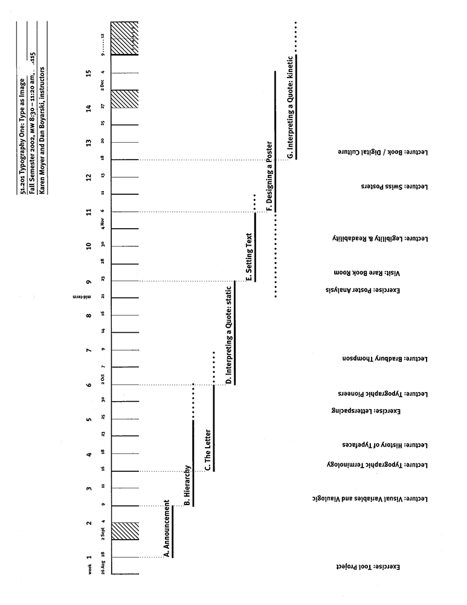
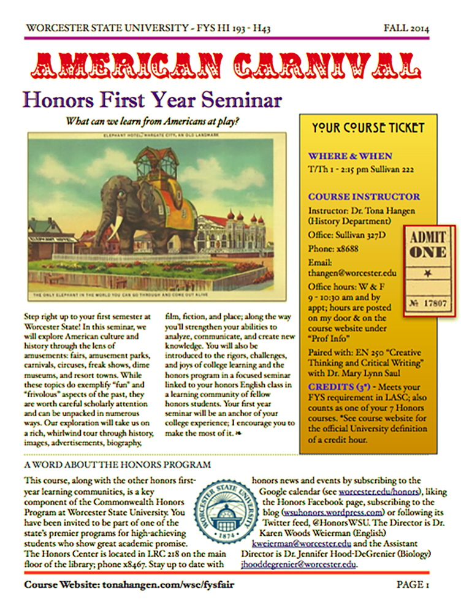
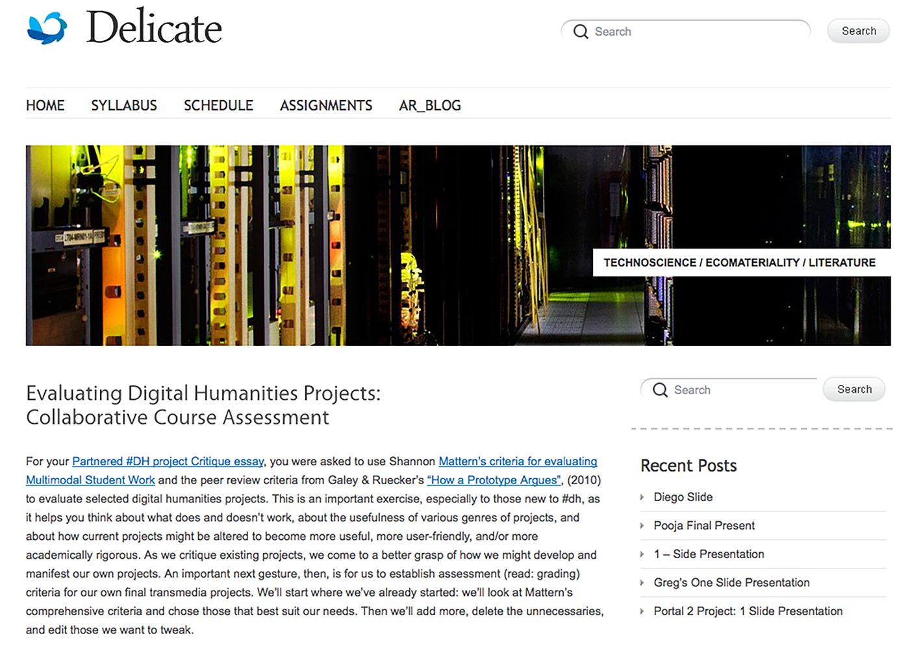
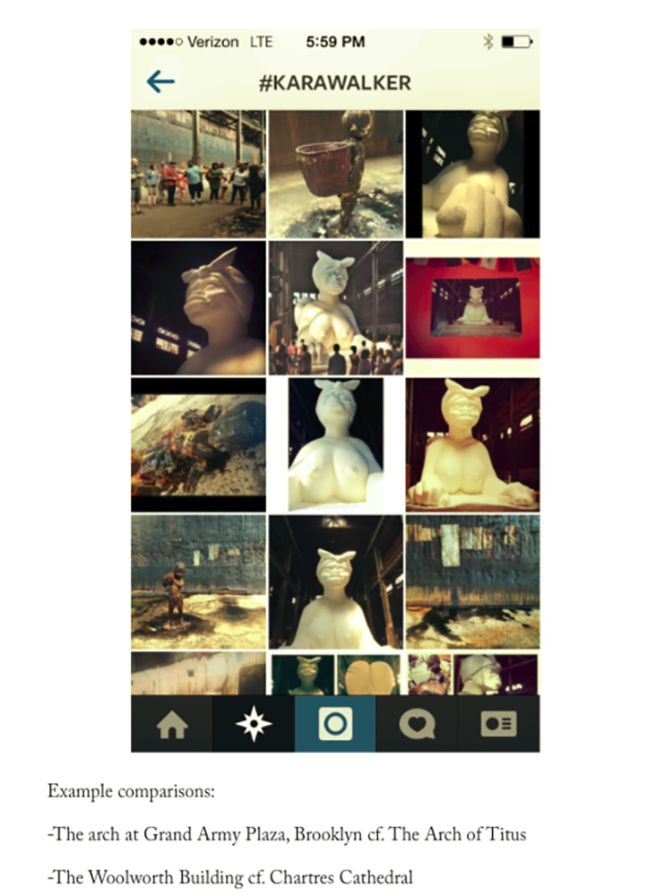
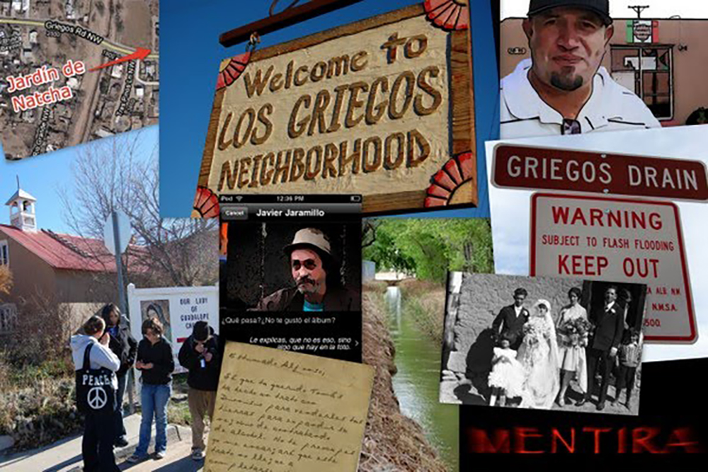
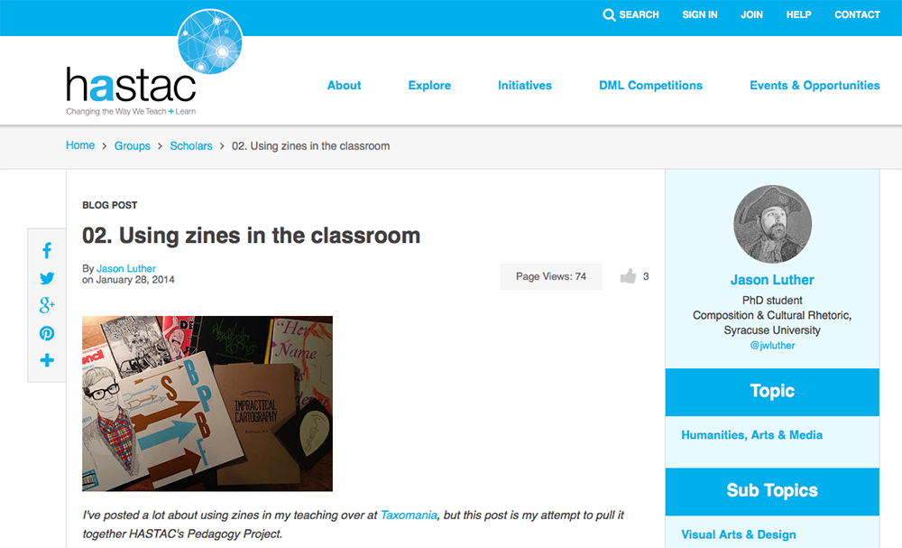
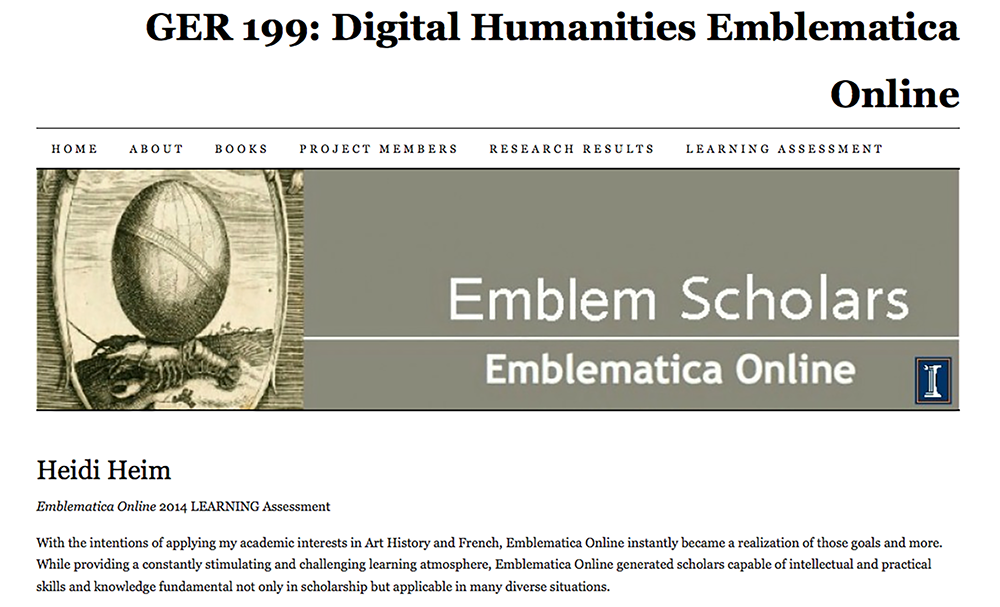
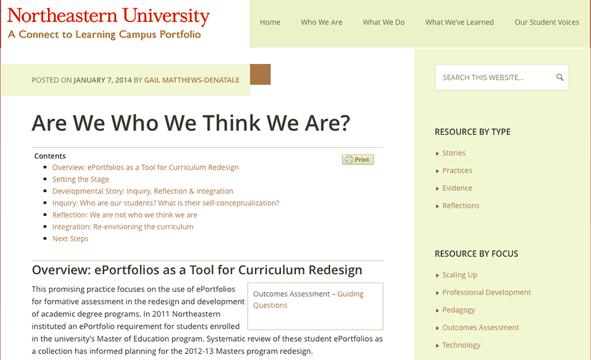
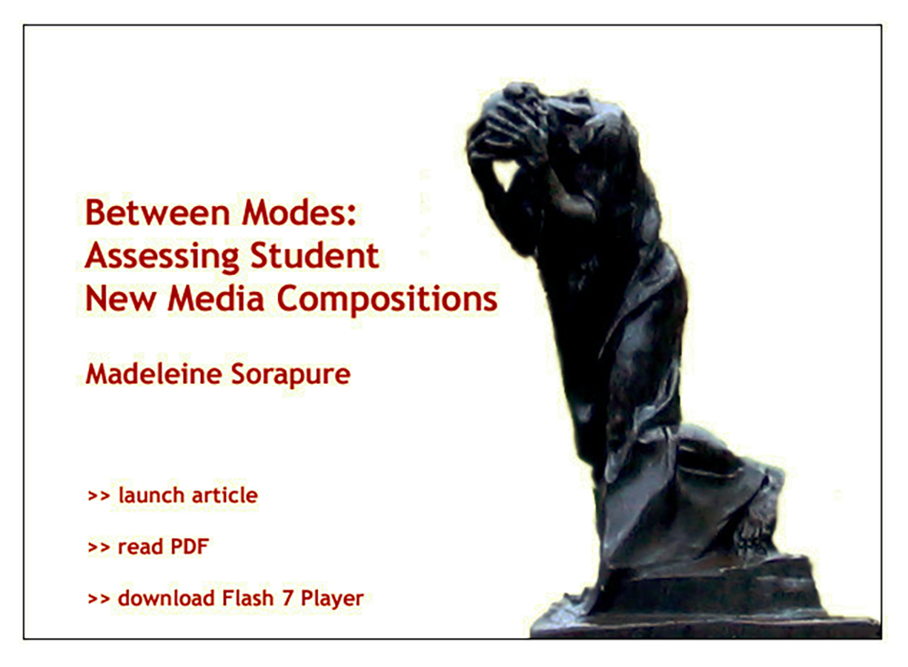
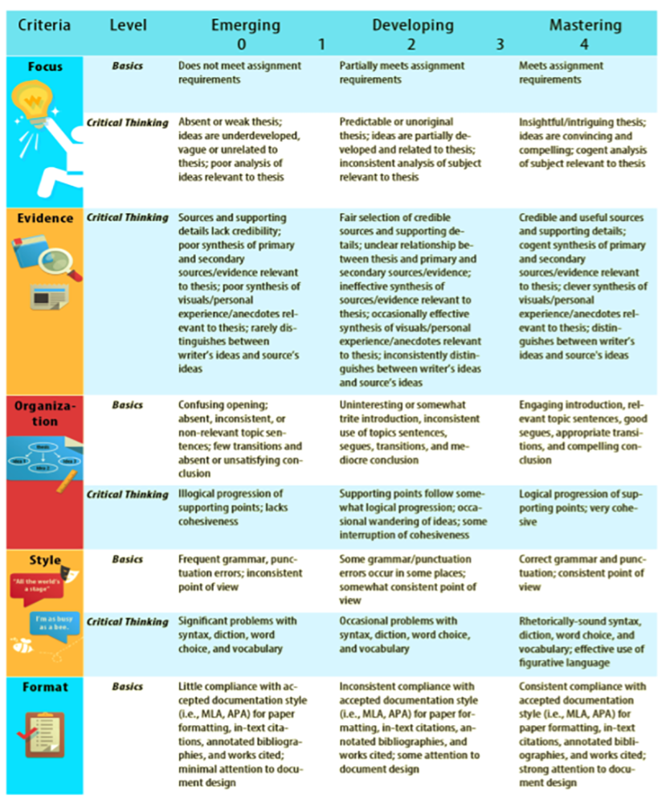

# ASSESSMENT 
 
### J. Elizabeth Clark
LaGuardia Community College, CUNY
---
##### Publication Status:
* unreviewed draft
* draft version undergoing editorial review
* draft version undergoing peer-to-peer review
* **draft version undergoing MLA copyediting**
* awaiting pre-print copy
* published 

---
### Cross-Reference Keywords: archive, badge, blogging coding, gaming, e-portfolios, makerspaces, multimodal, storytelling 
--- 
## CURATORIAL STATEMENT

**Defining Assessment**

In many ways, this is the beginning of the era of digital assessment because technology offers the possibility of a more robust assessment methodology. Research is at the heart of all scholarly work, including teaching. Assessment is simply an intellectual and scholarly investigation into the question: what are students learning and how do we know? How do new digital pedagogies transform what we need to measure and evaluate? The integration of technology into assessment methods is more than evaluating digital work; emerging assessments allow for more complex and granular understanding of student skill and knowledge-development over time.

Assessment is an all-encompassing term used to indicate anything from faculty evaluation of student learning in a single course to program-level curricula review to institutional-level accreditation to emerging cross-institutional criteria. Thomas Angelo defines assessment as an “ongoing process aimed at understanding and improving student learning. It involves making our expectations explicit and public; setting appropriate criteria and high standards for learning quality; systematically gathering, analyzing, and interpreting evidence to determine how well performance matches those expectations and standards; and using the resulting information to document, explain, and improve performance” (7). Evaluating student learning has always been part of faculty responsibility, quantifying what and how students have learned. Much of the model assessment work that exists in the digital ecosystem is deeply connected and rooted in its analog precursors; therefore, some of the language of assessment remains the same: formative, summative, and self-assessments are categories of assessment that indicate the goals and stakes of the assessment. 

In its most basic form, digital assessment replicates traditional pedagogy. Quizzes and tests can be given through a course management system, offering students immediate feedback and weary instructors less to grade. Savvy users can track how often students log into the system, how long they spend on course units, and how many times they view particular modules. 

In its more complex curricular form, assignments connected to digital pedagogy can include archiving, badging, blogging coding, gaming, e-portfolios, maker spaces, multimodal projects, and storytelling, among the keywords in *Digital Pedagogy in the Humanities*. On a larger scale, an institution might measure student learning for accreditation through student work highlighted in an e-portfolio using rubrics designed around competencies. Students might add badges to a resume to showcase specific skills learned in a course or set of courses. Game-based learning can introduce a non-punitive, recursive element to the curriculum, as students learn through repeated attempts in engaged, interactive learning. 

Assessment also has the potential to impact the the public sphere through student work. Work might take the shape of a public product published digitally--on a website or an app--allowing knowledge from the classroom to flow back into the college and local communities. What students learn has a different weight than an assignment produced in isolation. Their knowledge is not only transparent, but also interactive: they learn by doing and by engaging others. 

Good assessment design is predicated on multiple measures. Digitally-based assessments model the way students will be asked to work in the future. Technology supports a better deeper understanding of student learning, more easily combining hard data with qualitative, descriptive, narrative, or reflective assessment. Emerging assessment methods disrupt traditional notions of skill and knowledge evaluation in part because these new methods engage students in longitudinal learning and scaffolded skill development that requires the mastery of one skill before moving onto the next one. Digital assessment also encourages, if not privileges, integration and connections. The transparency of digital assessment galvanizes the portability of skills and concepts from one course to another. Students can document and reflect on their academic trajectory across courses finding connections that faculty may not expect. Students' longitudinal learning, instead of being a happy accident, is carefully connected through and across courses and co-curricular experiences. 

The artifacts demonstrate that these practices in the digital ecosystem are also rooted in the analog tradition and demonstrate an intentional way of thinking and understanding learning as a dynamic, integrative process: from syllabus construction to learner-centered assessments to summative assignments. The artifacts are tagged to emphasize which assessment practice they represent: 

Assessment Design: the relationship between all the learning in a course. Intentional assessment design considers what skills and knowledge a student will need to demonstrate their learning experiences (sometimes known as backwards design) and embeds them strategically throughout the course.

*Communication*: Student learning outcomes, rubrics, and other clearly stated faculty expectations are a key to effective assessment. 

*Process*: Peggy Maki refers to assessment as a process which provides the opportunity for students to build on prior learning (33).

*Participation*: Learner-centered assessments shift teaching from lecture to inquiry modes where students are guided through the curriculum. Brian Huot calls this "instructive evaluation" (69), a participatory process that helps students master the skill of self-evaluation.  

*Inquiry and Professional Development*: Assessment supports evidence-based changes to improve teaching.

*Integration*: The Association of American Colleges and Universities advocates for integrative learning using a range of skills and knowledge across the curriculum.
(Peden n. pag.). 
*Technology*: Digital tools have encouraged the development of new ways for students to receive, perform, produce, and share knowledge.  

## CURATED ARTIFACTS 

### Syllabus: Typography One: Type as Image

* Artifact Type: Syllabus
* Source: [http://www.cmu.edu/teaching/designteach/design/syllabus/samples-creative/TypographySyllabus.pdf](http://www.cmu.edu/teaching/designteach/design/syllabus/samples-creative/TypographySyllabus.pdf)
* Copy of Artifact: [files/assessment-typography-syllabus.pdf](files/assessment-typography-syllabus.pdf)
* Creators: Karen Moyer and Dan Boyarski, Carnegie Mellon University

Category: Formative Assessment
Practices: Design, Communication

This syllabus serves as an introduction to both the work of the course and its philosophy. It provides clear expectations and goals for students including the mid-term and final evaluations and the major project. The syllabus takes full advantage of design by meshing the content with the presentation. The assessment methods are visually presented in the syllabus, engaging students in thinking about learning outcomes from the initial framing of the course. The syllabus design sets up expectations and serves as a microcosm of the larger course philosophy and approach. Design is a critical aspect of assessment.

### Syllabus: American Carnival

* Artifact Type: Syllabus
* Source: (http://www.tonahangen.com/wp-content/uploads/2010/06/193.Fall14.pdf)
* Copy of Artifact: [assessment-american-carnival-syllabus.pdf](files/assessment-american-carnival-syllabus.pdf)
* Creator: Tona Hangen, Worcester State University

Category: Formative Assessment
Practices: Design, Communication, Integration

Tona Hangen's "[Writing Syllabi Worth Reading](http://www.tonahangen.com/courses/syllabusdesign/)" challenges the notion of traditional syllabi by suggesting that in giving her syllabi "extreme makeovers" she discovered she "also framed the class to give students more responsibility for the learning, including punching some holes in the semester to be filled with student-chosen content later. It was a course redesign on many levels, and the eye-catching syllabus that resulted was the culmination of a deeper rethinking of what I was teaching and what I wanted my students to learn" (n. pag.). This first year seminar syllabus on the American Carnival incorporates student learning outcomes shared by all first year seminars at Worcester State University and Hangen's commentary on those outcomes. As with the previous syllabus, work, expectations, and criteria for the course are fully articulated here providing groundwork for meaningful assessments later in the course. This syllabus also demonstrates Angelo’s concept of assessment as a process throughout the course of the semester with clearly staged, transparent, and increasingly complex expectations.

### Evaluating Digital Humanities Projects: Collaborative Course Assessment

* Artifact Type: Assignment
* Source: [http://sites.duke.edu/lit80s_01_f2014/evaluating-digital-humanities-projects-collaborative-course-assessment/](http://sites.duke.edu/lit80s_01_f2014/evaluating-digital-humanities-projects-collaborative-course-assessment/)
* Copy of Artifact: [assessment-evaluating-digital-humanities-projects.pdf](files/assessment-evaluating-digital-humanities-projects.pdf) 
* Creator: Amanda Starling Gould, Duke University

Category: Formative Assessment
Practices: Communication, Professional Development, Technology

This assignment includes multiple measures, collaboration, integration of concepts outside of the classroom, and modeling professional expectations. Students evaluate digital humanities projects and use digital markup tools to learn how to collaboratively evaluate and respond to digital work. This is an example of learning by doing: the form and content of the assignment and the assessment work together seamlessly. Students are assessed on how they mark up the digital work, how they work in a group collaboratively, and how they respond to digital work.  The task models how they will be evaluated, and it is a precursor to how students will work and engage on a professional level using technology after this course. The assessment design mimics professional work life, allowing students to perform and be evaluated in a more realistic context with professional stakes. 

### #arthistory: Instagram and the Intro to Art History Course

* Artifact Type: Assignment
* Source: [http://arthistoryteachingresources.org/2014/06/arthistory-instagram-and-the-intro-to-art-history-course/](http://arthistoryteachingresources.org/2014/06/arthistory-instagram-and-the-intro-to-art-history-course/) 
* Copy of Artifact: [assessment-#arthistory-Instagram.pdf](files/assessment-#arthistory-Instagram.pdf) 
* Creator: Hallie Scott, CUNY Graduate Center

Category: Formative Assessment
Practices: Process, Communication, Integration, Technology

Students curate a series of images on Instagram and connect them to key course concepts. Then, they write a short comparative paper based on the class Instagram images. These short papers culminate in a final paper. Scott says, “By requiring students to build on their instagram posts through written analyses, Parts 2 and 3 of the assignment reinforce the connections made in Part 1 and further encourage original analysis (as well as discourage plagiarism.) They also strengthen visual and contextual analytic skills while directly demonstrating how these skills apply to the contemporary environment” (n. pag.). This assignment demonstrates scaffolding as low-stakes assignments lead to a high-stakes assignment. The faculty member has the opportunity to assess student learning periodically prior to the final high stakes assignment, allowing for faculty feedback and guidance in the process. The assignment also integrates a variety of skills. 

### Mentira

* Artifact Type: Assignment
* Source: [http://www.mentira.org/](http://www.mentira.org)
* Copy of Artifact: none
* Creators: Chris Holden and Julie Sykes, University of New Mexico, Lead Designers; Linda Lemus, Aaron Salinger, Derek Roff, University of New Mexico, Game Designers

Category: Formative Assessment
Practices: Process, Participation, Inquiry, Integration, Technology

While games cannot replace the experience of travel in a foreign country, they can provide students with an immersive environment that offers a vehicle for practicing language acquisition skills, history, and culture in an interactive digital environment. The creators of La Mentira explain, "The backbone of this project is a focus on a natural context, outside the classroom, for the study of Spanish, and the development of materials for use in that context. We chose the Los Griegos neighborhood in Albuquerque/Los Ranchos for its connection to the Spanish language, documented history, diverse use and architecture, and walkability" (n. pag.). Students are assessed on their language skills as they navigate the challenges presented by the game in a real life context. As a low-stakes assessment, like most games, students have the opportunity practice and improve by repeating episodes in the game. Carefully implemented game design allows students to practice and demonstrate increasingly complicate skills sets that build on prior knowledge. Designed specifically for a Spanish-language course, Mentira demonstrates how faculty might consider game design and how a game can become an assessment of key goals and outcomes in a course replacing traditional assessments such as a quiz or oral exam.  

### Structuring Reflection

* Artifact Type: Assignment
* Source: [https://www.hastac.org/blogs/taxomania/2014/01/28/02-using-zines-classroom](https://www.hastac.org/blogs/taxomania/2014/01/28/02-using-zines-classroom)
* Copy of Artifact: [assessment-structuring-reflection.docx](files/assessment-structuring-reflection.docx) 
* Creator: Jason Luther, Syracuse University

Category: Self-Assessment, Summative Assessment
Practices: Communication, Process, Participation, Inquiry

Staging meaningful reflection can be difficult. Luther’s course relied on the use of student grading contracts for summative assessment. At the end of the course, students returned to those contracts, along with a set of prompts provided by the instructor. Students answered questions such as: "What goals did you have for this zine and did you meet them?" and "What was your vision and how was it compromised by these tool and technologies?" (n. pag.). These reflective questions engage students in a conversation about their own expectations and the results they achieved with their zines in a helpful analysis of the end product. Luther's assignment demonstrates the intentional use of guided questions to prompt self-assessment. This is a particularly useful strategy when students engage with new media technology; helping them to articulate what they have learned and what skills and knowledge they have integrated into their project. 

### Reflection from Emblematica Online

* Artifact Type: Student Work
* Source: [https://emblematicaonlineuiuc.wordpress.com/heidi-heim/](https://emblematicaonlineuiuc.wordpress.com/heidi-heim/)
* Copy of Artifact: [assessment-Emblematica-Online.pdf](files/assessment-Emblematica-Online.pdf) - do not include in CORE
* Creator: Heidi Heim, University of Illinois at Urbana-Champaign

Category: Self-Assessment, Summative Assessment
Practices: Participation, Inquiry and Professional Development

Heim participated  in an undergraduate digital humanities research team that created metadata for Renaissance Emblem books. Heim's personal narrative provides a self-assessment of key skills and concepts learned in the context of this collaborative research project. Reflection is a key element in participatory assessment. Students are able to articulate their understanding of a project, course, or learning objective and then provide evidence for how they have achieved those goals. Heim discusses the skills she has learned and how she has showcased them in this project, and she also points to future skills that she now knows she needs to learn. Further, this project is a prime example of modeling professional expectations for students as Heim and her Emblem Scholars cohort worked alongside faculty as participatory researchers.  

### Are We Who We Think We Are

* Artifact Type: Student Work and Assessment Narrative
* Source: [http://neu.mcnrc.org/oa-story/](http://neu.mcnrc.org/oa-story/)
* Copy of Artifact: [assessment-Are-We-Who-We-Think-We-Are?.pdf](files/assessment-Are-We-Who-We-Think-We-Are?.pdf) 
* Creators: Gail Matthews-Denatale, Northeastern University

Category: Self-Assessment, Summative Assessment
Practices: Professional Development, Integration, Technology

“Are We Who We Think We Are” is an assessment narrative about Northeastern University’s use of ePortfolios as a formative assessment tool. Matthews-Denatale explains the systematic review of portfolios in the Master of Education program that led to curriculum redesign. Student examples are also available as a link on the site. This assessment narrative is part of the larger Catalyst for Learning site. The result of a three-year research project, key campuses using ePortfolios studied their own practices and documented them on the site. The student work, coupled with the metacognitive aspects of reflection, provide a powerful multimodal transcript of student development, integration, and learning across the curriculum. 

### Between Modes: Assessing Students' New Media Compositions

* Artifact Type: Assignment Assessment
* Source: http://technorhetoric.net/10.2/coverweb/sorapure/betweenmodes.html
* Copy of Artifact: [assessment-structuring-reflection.docx](files/assessment-structuring-reflection.docx)
* Creators: Madeleine Sorapure, UC Santa Barbara and Jason Luther, Rowan University

Category: Self-Assessment, Summative Assessment
Practices: Professional Development, Integration, Technology

Madeleine Sorapure's multimodal article examines the disconnect between new media assignments and traditional forms of assessment. Sorapure writes, "Examining how student work in new media is currently assessed, it is clear that we are at a transitional stage in the process of incorporating new media into our composition courses. As [Kathleen Blake] Yancey notes, we give multimodal assignments but often draw on what we are far more familiar with--that is, print--to assess student work" (n. pag.). This helpful discussion pushes readers to consider how to design meaningful assessments that align with the course goals and content - with Jason Luther's "Zines! Assignment" as an example. 

### Big Data, Learning Analytics, and Social Assessment

* Artifact Type: Assignment Assessment
* Source: http://journalofwritingassessment.org/article.php?article=68
* Copy of Artifact: none
* Creator: Joe Moxley, University of South Florida 

Category: Formative Assessment, Summative Assessment
Practices: Design, Communication, Process 

Embedded within this article, Moxley shares a program-wide rubric used for summative writing assessment at the University of South Florida. The rubric itself is an excellent example of collaborative design. The article that accompanies the rubric provides both a process for responding to student writing in stages and an example of an effective writing rubric for summative assessment. Moxley provides an analysis of course-based and program-based assessment. The article explains the collaborative development of the rubric and the My Reviewers program that incorporates peer review, developmental feedback, and summative assessment. The article also provides an assessment of the overall program including statistics and usage data. This use of data is an early precursor to student learning analytics, a burgeoning field that hopes to allow students to better track their own progress by using time-sensitive data. 

## RELATED MATERIALS 

JISC. *[Effective Assessment in a Digital Age: A Guide to Technology-Enhanced Assessment and Feedback](http://repository.jisc.ac.uk/5995/1/digiassass_eada.pdf)*. JISC. 2009. Web. 14 May 2016. 

Kuh, George D., Natasha Jankowski, Stanley O. Ikenberry, and Jillian Kinzie. [*Knowing What Students Know and Can Do: The Current State of Student Learning Outcomes Assessment in U.S. Colleges and Universities.*](http://www.learningoutcomeassessment.org/ knowingwhatstudentsknowandcando.html). National Institute for Learning Outcomes Assessment. 2013. Web. 14 May 2016.

Losh, Elizabeth. _The War on Learning: Gaining Ground in the Digital University._  Cambridge, MA: The MIT Press, 2014. Print. 

McKee, Heidi A. and Danielle Nicole DeVoss, Eds. [*Digital Writing: Assessment and Evaluation*](http://ccdigitalpress.org/dwae/intro.html). Logan, UT: Computers and Composition Digital Press/Utah State University Press, 2013. Web. 14 May 2016.

## WORKS CITED 

Angelo, Thomas A. "Reassessing (and Defining) Assessment." *AAHEA Bulletin*. 48.3 (Nov. 1995): 7. Print.

Gould, Amanda Starling. "[Evaluating Digital Humanities Projects: Collaborative Course Assessment](http://sites.duke.edu/lit80s_01_f2014/evaluating-digital-humanities-projects-collaborative-course-assessment/)." Duke University. 2013. Web. 14 May 2016.

Hangen, Tona. "[American Carnival Syllabus](http://www.tonahangen.com/wp-content/uploads/2010/06/193.Fall14.pdf)." Tonahangen.com. Fall 2014. Web. 14 May 2016. 

---. "[Writing Syllabi Worth Reading.](http://www.tonahangen.com/courses/syllabusdesign/)" Tonahangen.com. 22 August 2012. Web. 14 May 2016. 

Heim, Heidi. "[Emblematica Online 2014 LEARNING Assessment](https://emblematicaonlineuiuc.wordpress.com/heidi-heim/)." GER 199: Digital Humanities Emblematica Online. University of Illinois at Urbana-Champaign. 2014. Web. 14 May 2016. 

Holden, Chris, Julie Sykes, Linda Lemus, Aaron Salinger, Derek Roff. "[Mentira](http://www.mentira.org/the-game)." University of New Mexico. 2009. Web. 14 May 2016. 

Huot, Brian. *[(Re)Articulating Writing Assessment for Teaching and Learning](http://digitalcommons.usu.edu/usupress_pubs/137/)*. USU Digital Commons. Logan, Utah State UP: 2002. Web. 14 May 2016.

JISC. *[Effective Assessment in a Digital Age: A Guide to Technology-Enhanced Assessment and Feedback](http://repository.jisc.ac.uk/5995/1/digiassass_eada.pdf)*. JISC. 2009. Web. 14 May 2016.

Kuh, George D., Natasha Jankowski, Stanley O. Ikenberry, and Jillian Kinzie. [*Knowing What Students Know and Can Do: The Current State of Student Learning Outcomes Assessment in U.S. Colleges and Universities.*](http://www.learningoutcomeassessment.org/ knowingwhatstudentsknowandcando.html). National Institute for Learning Outcomes Assessment. 2013. Web. 14 May 2016.

Losh, Elizabeth. _The War on Learning: Gaining Ground in the Digital University._  Cambridge, MA: The MIT Press, 2014. Print. 

Luther, Jason. "[Using Zines in the Classroom](https://www.hastac.org/blogs/taxomania/2014/01/28/02-using-zines-classroom)." HASTAC. 28 Jan. 2014. Web. 14 May 2016.

Maki, Peggy L. *Assessing for Learning: Building a Sustainable Commitment Across the Institution*. 2nd ed. Sterling: Stylus, 2010. Print.

Matthews-Denatale. "[Are We Who We Think We Are](http://neu.mcnrc.org/oa-story/)." Making Connections National Resource Center. 7 January 2014. Web. 14 May 2016.

McKee, Heidi A. and Danielle Nicole DeVoss, Eds. [*Digital Writing: Assessment and Evaluation*](http://ccdigitalpress.org/dwae/intro.html). Logan, UT: Computers and Composition Digital Press/Utah State University Press, 2013. Web. 14 May 2016.

Moxley, Joe. "[Big Data, Learning Analytics, and Social Assessment](http://journalofwritingassessment.org/archives.php?issue=14)." The Journal of Writing Assessment* 6.1 (2013): n. pag. The Journal of Writing Assessment. Journal of Writing Assessment. Web. 14 May 2016.

Moyer, Karen and Dan Boyarski. "[Typography Syllabus](https://www.cmu.edu/teaching/designteach/design/syllabus/samples-creative/TypographySyllabus.pdf)." Carnegie Mellon University. 2002. Web. 14 May 2016.

Peden, Wilson. "[Signature Work: A Survey of Current Practices](https://www.aacu.org/liberaleducation/2015/winter-spring/peden)." Association of American Colleges & Universities. AAC&U, 24 June 2015. Web. 14 May 2016.

Scott, Hallie. ["#arthistory: Instagram and the Intro to Art History Course."](http://arthistoryteachingresources.org/2014/06/arthistory-instagram-and-the-intro-to-art-history-course/) Art History Teaching Resources. 25 June 2014. Web. 14 May 2016.

Sorapure, Madeleine. "[Between Modes: Assessing Students' New Media Compositions](http://technorhetoric.net/10.2/coverweb/sorapure/betweenmodes.html)." *Kairos* 10:2 (2005). Web. 14 May 2016.

