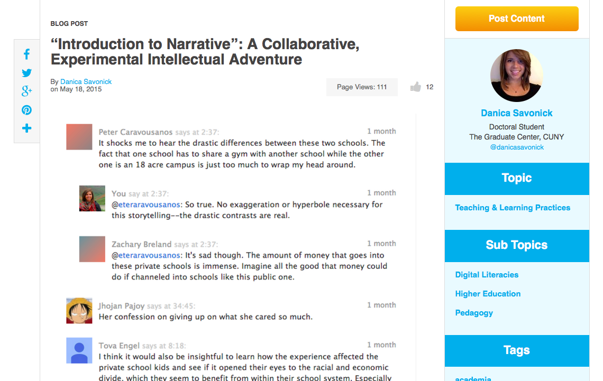

# ASSESSMENT (Draft)
 
### J. Elizabeth Clark
LaGuardia Community College, CUNY

---

##### Publication Status:
* **unreviewed draft**
* draft version undergoing editorial review
* draft version undergoing peer-to-peer review
* published 

--- 

## CURATORIAL STATEMENT

I recently showed the Michael Radform version of _1984_ to students in my utopian fiction course. They were immediately struck by the surveillance in Oceania, remarking on the ways Big Brother perpetually watches. Of course, they were able to draw easy parallels to the world of Oceania and the rise of a surveillance culture in contemporary life afforded by our indiscriminate use of technology. Big Brother is a useful starting point for thinking about assessment and digital pedagogy because it is exactly what everyone fears. Assessment is often seen as an external classroom practice, something done TO faculty and students rather than by them. The word, "assessment," conjures up myriad negative connotations about campus accreditation visits, the use of big data by administration as a weapon against faculty, and the disconnect between classroom practices and assessment measures.

JENTERY: This is a compelling introductory paragraph. I especially appreciate how you underscore common impressions of assessment, including its negative connotations.  

Assessment can also go wrong on the classroom level. K-12 teachers under the yoke of No Child Left Behind legislation lost a great amount of control over their content and pedagogy. When I think about technology and education, David Eggers's _The Circle_ conjures the ultimate educational dystopia. On a tour of the fictional techno giant, The Circle, protagonist Mae Holland shows her viewers a vision of the future of education: "We're inches away from the moment when, by the time a student is ready for college, we have complete knowledge of everything that student has learned. Every word they read, every word they looked up, every sentence they highlighted, ever equation they wrote, ever answer and correction. The guesswork of knowing where all students stand and what they know will be over" (231). Although we have not yet arrived at that point, technology increasingly makes tracking convenient, easy, and transparent. But to what end?

JENTERY: I appreciate how this piece repeatedly returns to examples from literature. Thanks, too, for addressing concerns about tracking and quantification. 

Done badly, digital assessment as a disconnected, automated, and isolated practice is the worst of what technology has to offer us. It can automate the worst elements of traditional pedagogy, where students regurgitate learned information that can be processed quickly and efficiently, compounded by industrial notions of education getting ever faster, ever shallower. Quizzes and tests can be given through the course management system of your choice, offering students immediate feedback and weary instructors less to grade. Savvy users can track how often their students log into the system, how long they spend on particular course units, and how many times they view particular topics. They are an anemic assessment at best, providing only the most rudimentary information about what a student has learned and is learning without context. What is the point of knowing everything if everything does not tell us very much at all? 

JENTERY: This is another compelling paragraph. At the beginning of the paragraph, I wonder if "Done badly" is necessary. Is "badly" implied by the balance of the sentence? Also, would you be willing to reconsider "traditional pedagogy" as a comparison point for "digital pedagogy"? From a social perspective, perhaps "digital pedagogy" can be "traditional," too? Additionally, I feel like the word, "metrics," is running along the margins here. Would you be willing to more directly address metrics here or elsewhere? Finally, I read the question at the end of this paragraph several times. I wonder if the gesture you're making there, with "knowing everything," will be clear to most audiences. Perhaps there is a distinction between knowing things and having data about things? Or, following [Kathleen Fitzpatrick's work](http://dhdebates.gc.cuny.edu/debates/text/7), perhaps there's a difference between measuring access (or use) and measuring engagement (or learning, or knowledge production)? 

In the new learning ecosystem, where digital pedagogues are busy transforming the classroom, s, too are they transforming our notion of assessment. Cathy N. Davidson's discussion of grading in _Now You See It: How Technology and Brain Science Will Transform the Way We Live, Work, and Learn_ is particularly useful. Reflecting on her controversial experiment with crowd-sourced grading, she writes, "in the end, all assessment is circular: It measures what you want it to measure by a standard of excellence that you determine in advance. We too often substitute test results for some basic truth about a whole person, partly because we live in a test-obsessed society giving more tests (and at a younger age) than any other country" (118-199). Progressive digital assessments can take many forms, from games to badges to e-portfolios to multimodal projects.

JENTERY: Here, I like how you shift to some existing research and related work being done within digital pedagogy. At the end of the paragraph, are you suggesting that assessment may assume the form of e-portfolios (i.e., a portfolio of assessment practices) and multimodal projects (e.g., assessment through multimodal composition)? Or are games, badges, portfolios, and multimodal projects examples of what people may produce in their courses? 

In "12 Steps for Creating a Digital Assignment or Hybrid Class," Jesse Stommel asks key questions, such as, "Does this activity need to be assessed? Or does the activity have intrinsic value? We should never assess merely for the sake of assessing"; "Is there a way to build the assessment into the assignment? For example, can I have students reflecting on their process inside the activity itself? Can my assessment arise organically from within, and as part of, the learning activity?"; and, most important, "What is my goal in assessing student work?" (n. pag.).

JENTERY: Would you be willing to contextualize these questions, or Stommel's piece, just a bit more? For instance, perhaps readers would benefit from a sentence or two about what prompted Stommel to write this particular piece. In particular, I'm thinking about ways to unpack the motivations for describing and assessing digital assignments differently than existing (i.e., non-digital) assignments. I imagine there are many motivations at work here, and perhaps this paragraph would be even more persuasive with a mention of one or two of them.   

Asked by pedagogues who are interested in how students make meaning of course material, these questions stem from an interactive classroom that helps students to engage subject matter deeply and critically. When I think about assessment at its best, I think about my Fitbit. In short, I adore my Fitbit. I wear it all the time. I love seeing my real time statistics during the day: heart rate, steps, calories burned. I love syncing that information to the app on my phone where I can further chart long-term trends and places where I can improve. Yet the Fitbit itself is limited. At the end of the day, numbers are just numbers. More effective would be a coach who reviewed the data with me and made targeted suggestions about nutrition and exercise to help me improve. This is the possibility of learning analytics, still in their infancy: a world where students can use assessment information on the go to shape and direct their learning in collaboration with faculty who guide student progress. 

JENTERY: I wonder, too, about student and instructor involvement in how data are produced in the first place, through what mechanisms, and with what assumptions/biases in mind. I feel like this paragraph tends to stress the consumption or receipt of data ("use assessment information"). Would you be willing to address the production of data, too? For instance, how might students and instructors understand and even change the values and rhetoric at work in algorithms and analytics? Is such change even possible at this point? 

In 2005, Madeleine Sorapure wrote, "Examining how student work in new media is currently assessed, it is clear that we are at a transitional stage in the process of incorporating new media into our composition courses. As [Kathleen Blake] Yancey notes, we give multimodal assignments but often draw on what we are far more familiar with--that is, print--to assess student work" (n. pag.). We are assigning the work, but as Cathy N. Davidson explores, we have not yet aligned our assessments with what we are asking students to do. Right now, many faculty still struggle to assess multimodal student work that comes in forms as varied as traditional essays to websites to games to videos to presentations to in-depth experiences such as service learning and travel.

JENTERY: I appreciate how you draw from Sorapure's publication in *Kairos* here. Would you be willing to tighten or clarify the transition between this paragraph and the previous paragraph? I wonder if readers will follow the move from Fitbit and analytics to multimodal composition and assessment. 

At its best, digital assessment offers us new ways to understand what our students our learning. In the humanities, our courses are rarely about a single subject. Sure, a student may have signed up for Spanish 101 to learn the language, but implicit in that journey is a wealth of information about culture, history, politics, and more. In literature classes, students go far beyond the word on the page. A text opens up worlds for interpretation and analysis. How, then, can a simple quiz or test adequately capture all of that learning in a single measure?

JENTERY: I really like where this paragraph is going. Would you be willing to render "new ways" more concrete? As a reader, I'm inclined to ask: "New, when compared with . . .?" Also, is the question at the end of the paragraph intended to be a rhetorical question? Do you believe many (any?) humanities instructors would answer, "yes"?

Good assessment design is predicated on multiple measures. This is where assessment in digital pedagogy excels. Digitally-based assessments allow faculty and students to work together to develop modes of expressing what students have learned that graciously accommodate widely varied content, form, and function. Often, these assessments are more personal than standardized tests or exams; they often privilege collaboration and showcase new ways of working together. These assessments model the way students work and, as important, the way they will be asked to work when they leave the praxis of the classroom. Digital assessments also often include a self-reflective element where students have the opportunity to shape and analyze their own learning. 

JENTERY: This is a compelling paragraph, especially as you shift from observations about assessment toward possibilities for conducting it. How do you feel about the use of "good" (or "bad") in paragraphs such as this one? Also, would you be willing to render "new ways of working together" more concrete? Finally, would you also say that digital assessment may address the various ways people are embodied and learn accordingly (e.g., accessibility)? Perhaps embodiment or embodied learning is included in "content, form, and function," tho. I'm not sure.  

For those readers who have taught with a paper portfolio system, this might sound all too familiar. The roots of digital assessment are anchored in history. What becomes different, then, is both the mode and style of working. Digital assessment design also allows for a greater transparency; instead of the transactional relationship between faculty member and student, work is now crafted for a wider discourse community. Work is often a public product published digitally--on a website or an app--allowing knowledge from the classroom to flow back into the college and local communities. What students learn has a different weight than an assignment produced in isolation. Their knowledge is not only transparent, but also interactive: they learn by doing and also by engaging others. Knowledge becomes again a communal practice. Now, assessment can ask not just what a student learned and how but also what impact that learning had on a local community. 

JENTERY: This is great. I especially appreciate the gesture toward paper portfolios and material histories of assessment. Would you be willing to comment on ways in which students may be vulnerable when contributing to a public project? Or how identity and privacy are articulated in public projects? Or how digital labor works (credit, attribution, reciprocity)? Perhaps these aspects of assessment could also be grounded in existing digital projects or publications? 

Digital assessment also encourages, if not privileges, integration and connections. The transparency of digital assessment galvanizes the portability of skills and concepts from one course to another. Students can document and reflect on their academic trajectory across courses finding connections that faculty may not expect. For example, the English major who takes a required General Education course in Environmental Biology might find connections between science courses and a love of eco-writing. Students' longitudinal learning, instead of being a happy accident, is carefully connected through and across courses and co-curricular experiences. 

JENTERY: I'm really interested in your emphasis on transparency. Would you be willing to elaborate on it a bit, or even define what you mean by it? From the mention of longitudinal learning, I see how learning paths/histories may be documented. Would this also apply to instructors? That is, to what degree is instructor assessment also transparent? Is there some compelling research here? 

Digital assessment also takes risks by finding new ways to teach with new tools that require new assessment measures. Game-based learning, for example, introduces a non-punitive, recursive element to the curriculum, ensuring that students have the opportunity to learn through repeated attempts in engaged, interactive learning. 

JENTERY: Would you be willing to elaborate on this remark?: "Game-based learning, for example, introduces a non-punitive, recursive element to the curriculum." I'm specifically interested what's implied by "non-punitive." Also, here I'll just echo previous remarks about "new." Would you be willing to render these moments more concrete? In general, perhaps this paragraph could be developed a bit, with more detail? 

Research is at the heart of all scholarly work, including teaching. Assessment is simply an intellectual and scholarly investigation into the questions: what are your students learning, and how do you know? How do you create the best assessment measures for the kinds of assignments you want students to create? Digital assessment methods open up many new possibilities for the classroom, the student, and the teacher-researcher. 

JENTERY: Thank you for this curatorial statement, Liz! I enjoyed reading it. At the end here, would you be willing to transition readers into the artifacts that follow your statement? Perhaps just a sentence or two introducing what follows, or telling readers how the artifacts below answer the question of how to create assessment measures? Also, quick question: can (or does) assessment tell us what students are learning? Here, I'm thinking through the tensions between assessing student work and assessing student knowledge (e.g., often students submit the work they have time to produce). Thanks again! 

## CURATED ARTIFACTS 

### Changing the Paradigm for Higher Education: Pedagogy and Assessment

* Source: [https://www.hastac.org/collections/hastac-guide-future-higher-education-chapter-5](https://www.hastac.org/collections/hastac-guide-future-higher-education-chapter-5)
* Copy of Artifact: forthcoming
* Creators: HASTAC, Collaborative Authors 

HASTAC has played a central role in documenting changing notions of pedagogy and a 21st-century classroom. This collection of practices considers assessment from the following perspectives: makerspaces, creative contributions, student leadership, diversity, digital badging, aligning assessments with pedagogy, and focusing on learning and mastery rather than testing. 

JENTERY: Great to see HASTAC, and this project in particular, included among your curated artifacts. Would you be willing to elaborate on the annotation, either pointing readers to specific aspects of this collection or mentioning what from it you've used in your own teaching practices? 

### Introduction to Digital Humanities Syllabus

* Source: [http://dhcu.ca/pages/syllabus](http://dhcu.ca/pages/syllabus)
* Copy of Artifact: forthcoming
* Creator: Shawn Graham

This syllabus is a prime example of structuring digital content with multiple digital assessments. The presentation of the course models the kind of work students will be doing, from a video introduction to the use of digital tools, such as Slack, Github, and Pecha Kucha presentations. Significantly, Graham also addresses the importance of "public-facing" work, articulating a central shift in student work. Here, the public nature of student work is central to both the course design and course outcomes. 

JENTERY: I find this syllabus very compelling, too. Would you be willing to add a sentence or two about how exactly public work is assessed in this course? Not just that it's central, but how it's valued or graded? 

### "Introduction to Narrative": A Collaborative, Experimental Intellectual Adventure

* Source: [https://www.hastac.org/blogs/danicasavonick/2015/05/18/introduction-narrative-collaborative-experimental-intellectual](https://www.hastac.org/blogs/danicasavonick/2015/05/18/introduction-narrative-collaborative-experimental-intellectual)
* Copy of Artifact: forthcoming 
* Creator: Danica Savonick

This syllabus on narrative begins with a very clear relationship between the content of the course, the mode of work production, and assessment. The course engaged students in collaborative projects including crowd-sourced class notes using SoundCloud, public writing in blogs, and collaborative final projects. You can view student examples and reflections on the original source, demonstrating both how students are engaging in highly sophisticated multimodal projects and critique with student-designed evaluations. This syllabus demonstrates several key aspects of the changing nature of assessment: collaborative projects, student leadership in their own assessment and evaluation, and the critical importance of public writing and public work in digital scholarship for both faculty and students. 

JENTERY: Another compelling example. Thanks! Here again, would you be willing to add a sentence or two about how exactly work is assessed in this course?

### Evaluating Digital Humanities Projects: Collaborative Course Assessment

* Source: [http://sites.duke.edu/lit80s_01_f2014/evaluating-digital-humanities-projects-collaborative-course-assessment/](http://sites.duke.edu/lit80s_01_f2014/evaluating-digital-humanities-projects-collaborative-course-assessment/)
* Copy of Artifact: forthcoming 
* Creator: Amanda Starling Gould

This assignment includes multiple measures, collaboration, integration of concepts outside of the classroom, and modeling professional expectations for students in the discipline. Students are not only evaluating digital humanities projects; they are also using digital markup tools to learn how to collaboratively evaluate and respond to digital work. This is a key example of learning by doing: the form and content of the assignment and the assessment work together seamlessly.  

JENTERY: Great to see Gould's work in your list, too. Here, I'll just echo some of my remarks on other artifacts. Would you be willing to address not only the interesting projects students are doing in these classes but also how they are being assessed? Is there a way to point readers to specific assessment techniques, and then underscore why these techniques are persuasive or appropriate for the project at hand? 

### La Mentira

* Source: [http://www.mentira.org/](www.mentira.org)
* Copy of Artifact: forthcoming
* Creators: Chris Holden and Julie Sykes, University of New Mexico, Lead Designers; Linda Lemus, Aaron Salinger, Derek Roff, University of New Mexico, Game Designers

The creators of La Mentira explain, "The backbone of this project is a focus on a natural context, outside the classroom, for the study of Spanish, and the development of materials for use in that context. We chose the Los Griegos neighborhood in Albuquerque/Los Ranchos for its connection to the Spanish language, documented history, diverse use and architecture, and walkability. We used information collected from neighborhood contacts, documentary archives, and a thesis written about the area, as well as multiple site visits from which to build the story and setting for our game." This game offers students a vehicle for practicing language acquisition skills, history, and culture in an interactive digital environment.

JENTERY: This is also great. Thank you for including an artifact anchored in the study of Spanish. Would you be willing to elaborate on its assessment techniques? I also wonder if, for the sake of annotation, the quotation could be either reduced (in length) or paraphrased. That is, it would be great to get more of your perspective here.  

### Notre Dame E2B2 Badge

* Source: [http://eportfolio.nd.edu/directory/badge-directory/](http://eportfolio.nd.edu/directory/badge-directory/)
* Copy of Artifact: forthcoming 
* Creator: Alex Ambrose

The badging project at Notre Dame explores new ways of making learning transparent by quickly identifying the transferable skills connected with each course or co-curricular experience. Badges have a practical application and serve to document student learning in classroom and co-curricular settings. 

JENTERY: I'm glad to see this entry addressing badges, which have also been criticized (for gamification, e.g.). Would you be willing to address such concerns? Also, echoing remarks above, would you be willing to speak more specifically to badges as assessment techniques? Thanks, Liz! 

### Reflection from Emblematica Online

* Source: [https://emblematicaonlineuiuc.wordpress.com/heidi-heim/](https://emblematicaonlineuiuc.wordpress.com/heidi-heim/)
* Copy of Artifact: forthcoming 
* Creator: Heidi Heim

Heim is one of several Emblem Scholars at the University of Illinois at Urbana-Champaign who engaged in undergraduate digital humanities research. Student researchers "create metadata by transcribing emblem mottos and associating this data with their respective emblems in their book for scholarly and pedagogical purposes. This digital humanities project focuses on Renaissance Emblem books." Heim's personal narrative provides a self-assessment of key skills and concepts learned in the context of this collaborative research project. Further, this project is a prime example of modeling professional expectations for students as Heim and her Emblem Scholars cohort worked alongside faculty as participatory researchers. 

JENTERY: Wonderful to see undergraduate research included here. Would you be willing to elaborate on how this participatory research was assessed? 

### Structuring Reflection

* Source: [https://www.hastac.org/blogs/taxomania/2014/01/28/02-using-zines-classroom](https://www.hastac.org/blogs/taxomania/2014/01/28/02-using-zines-classroom)
* Copy of Artifact: forthcoming 
* Creator: Jason Luther

The previous student example of reflection demonstrates how a student might approach narratively describing the skills and concepts learned in connection with a particular project, assignment, course, or series of courses. A key question in reflective assignments is how you get students to reflect meaningfully. Luther's assignment shows the careful use of guiding questions that allow students to consider what they produced (a zine), what they learned, and how they self-assess their learning.

JENTERY: I especially appreciate the last sentence of this annotation. Would you be willing to elaborate on it? How does self-assessment happen, and how is it prompted? 

### Catalyst for Learning ePortfolio Site

* Source: [http://c2l.mcnrc.org/oa/](http://c2l.mcnrc.org/oa/)
* Copy of Artifact: forthcoming 
* Creators: Bret Eynon, Laura Gambino, Randy Bass, Helen Chen, principal investigators and C2L Campus Teams

The Catalyst for Learning site is an extensive resource for learning more about e-portfolios structured in several ways: thematically, via campus stories, and through the lens of a principal investigator. The site provides multiple views of e-portfolios on campuses across the country. The result of a three-year research project, key campuses using e-portfolios studied their own practices and documented them on the site. The principal investigators then studied that work and wrote analyses of each theme. One of those themes is assessment. By following through the assessment portion of the site, e-portfolios demonstrate a rich potential to provide authentic assessment of longitudinal student learning. 

JENTERY: Thanks for this, Liz! Would you be willing to elaborate on how longitudinal student learning is assessed via e-portfolios? Have you used Catalyst for Learning in your own work? If so, then would you be willing to speak to its use for assessment? 

### Holding for Darryl Draper app project
IMAGE FORTHCOMING 

* Source: forthcoming
* Copy of Artifact: forthcoming 
* Creators: forthcoming 

ANNOTATION FORTHCOMING.

JENTERY: Looking forward to reading this one! 

## RELATED MATERIALS 

Bass, Randall and Bret Eynon. _Open and Integrative: Designing Liberal Education for the New Digital Ecosystem_. Washington, D.C.: Association of American Colleges and Universities, forthcoming. Web.

Ifenthaler, Dirk, Deniz Eseryel, and Xun Ge. _Assessment in Game-Based Learning_. New York: Springer-Verlag, 2012. 

Losh, Elizabeth. _The War on Learning: Gaining Ground in the Digital University._  Cambridge, MA: The MIT Press, 2014. Print. 

McKee, Heidi A. and Danielle Nicole DeVoss, Eds. [Digital Writing: Assessment and Evaluation](http://ccdigitalpress.org/dwae/intro.html). Logan, UT: Computers and Composition Digital Press/Utah State University Press, 2013. Web. 

Richard-Schuster, Katie, Mary Ruffle, Kerri Leyda Nicoll, Catherine Distelrath, and Joseph Galura. ""[Using ePortfolios to Assess Program Goals, Integrative Learning and Civic Engagement: A Case Example](http://www.theijep.com/pdf/IJEP150.pdf)." _The International Journal of ePortfolio_ 4.2 (2014): 133-141. Web. 

## WORKS CITED 

Davidson, Cathy N. _Now You See It: How the Brain Science of Attention Will Transform the Way We Live, Work, and Learn_. New York: Viking, 2011. Print.

Eggers, Dave. _The Circle: A Novel_. New York: Alfred A. Knopf, 2013. Print.

Sorapure, Madeleine. "[Between Modes: Assessing Students' New Media Compositions](http://kairos.technorhetoric.net/10.2/binder2.html?coverweb/sorapure/index.html)." _Kairos_ 10:2 (2005). Web.

Stommel, Jesse. "12 Steps for Creating a Digital Assignment or Hybrid Class." [http://jessestommel.com/12-steps-for-creating-a-digital-assignment-or-hybrid-class](http://jessestommel.com/12-steps-for-creating-a-digital-assignment-or-hybrid-class)
