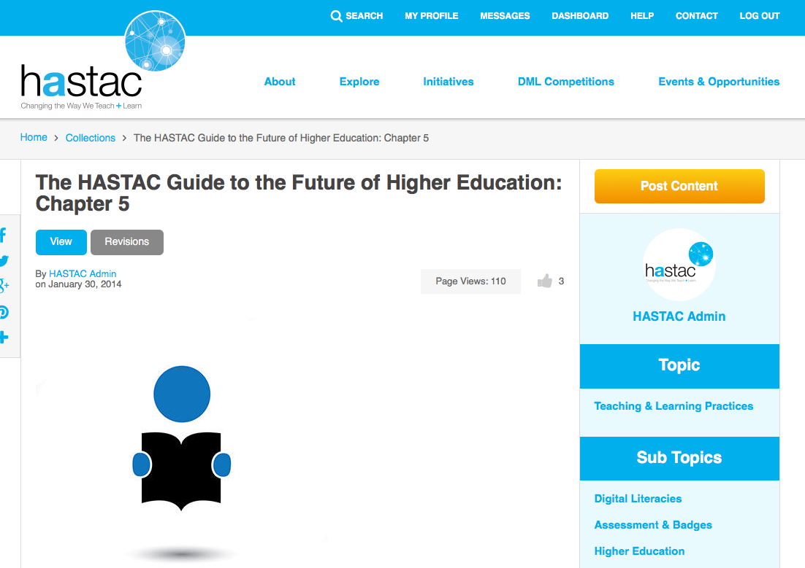
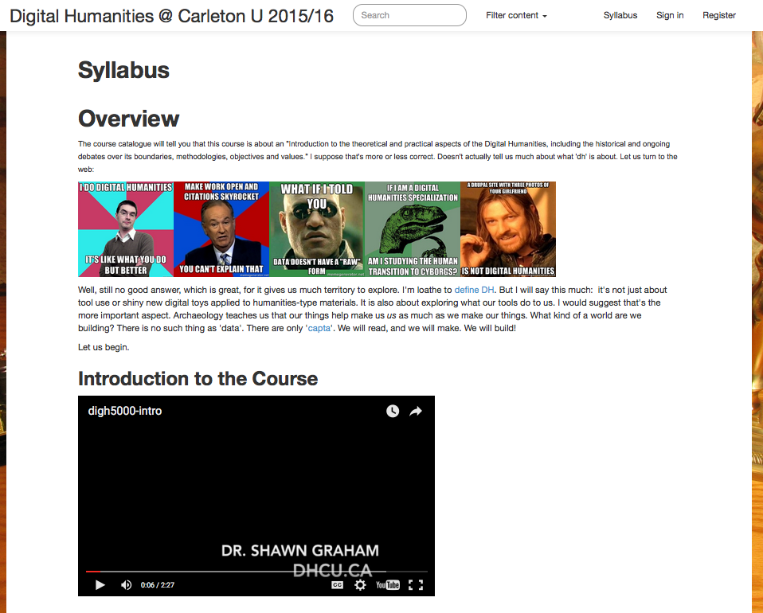
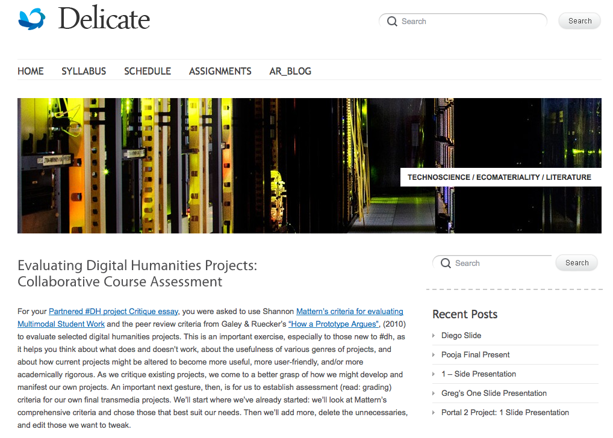
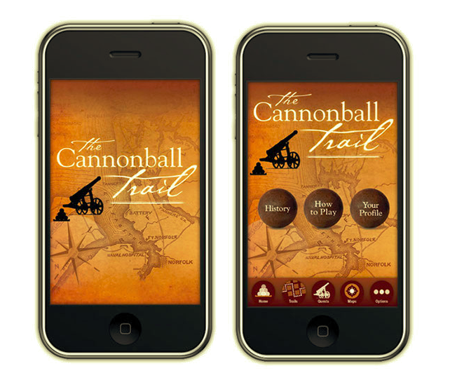
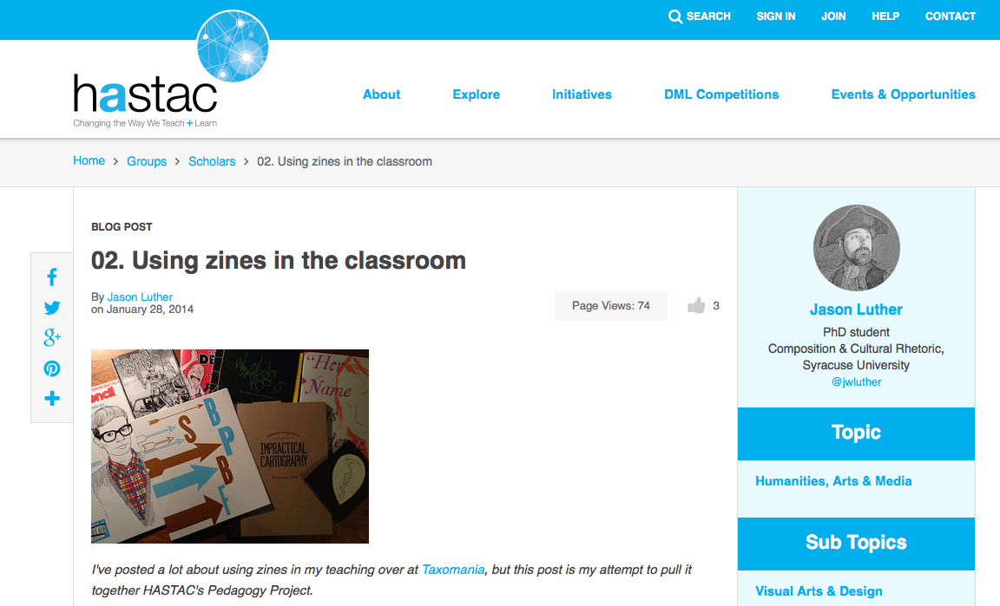
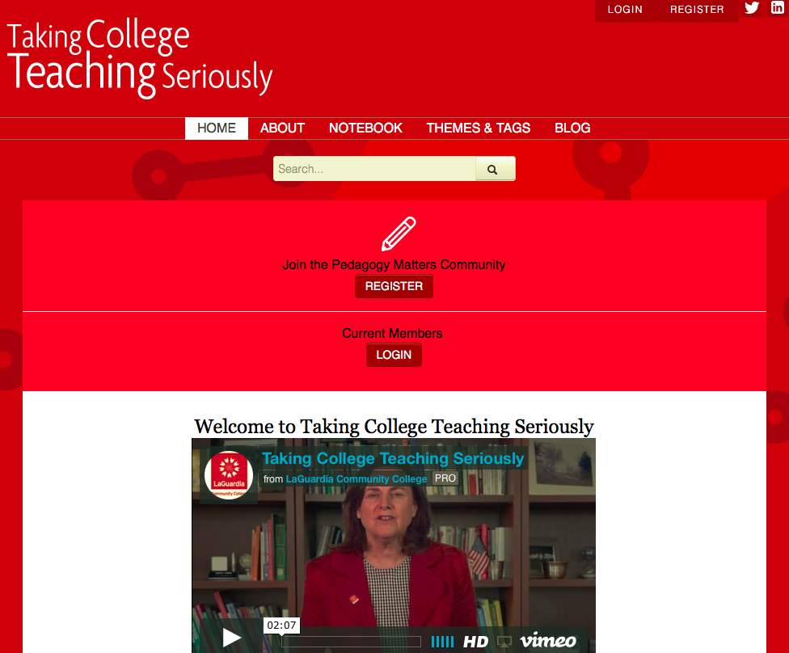

# ASSESSMENT (Draft)
 
### J. Elizabeth Clark
LaGuardia Community College, CUNY

---

##### Publication Status:
* unreviewed draft
* **draft version undergoing editorial review**
* draft version undergoing peer-to-peer review
* published 

--- 

## CURATORIAL STATEMENT

I recently showed the Michael Radform version of *1984* to students in my utopian fiction course. They were immediately struck by the surveillance in Oceania, remarking on the ways Big Brother perpetually watches. Of course, they were able to draw easy parallels to the world of Oceania and the rise of a surveillance culture in contemporary life afforded by our indiscriminate use of technology. Big Brother is a useful starting point for thinking about assessment and digital pedagogy because it is exactly what everyone fears. Assessment is often seen as an external classroom practice, something done *to* faculty and students rather than by them. The word, "assessment," conjures up myriad negative connotations about campus accreditation visits, the use of big data and metrics by administrations as a weapon against faculty, and the disconnect between classroom practices and assessment measures.

When I think about technology and education, David Eggers's *The Circle* describes the ultimate educational dystopia. On a tour of the fictional techno giant, The Circle, protagonist Mae Holland shows her viewers a vision of the future of education: "We're inches away from the moment when, by the time a student is ready for college, we have complete knowledge of everything that student has learned. Every word they read, every word they looked up, every sentence they highlighted, ever equation they wrote, ever answer and correction. The guesswork of knowing where all students stand and what they know will be over" (231). Although we have not yet arrived at that point, technology increasingly makes tracking convenient, easy, and transparent. But to what end? Few of us need a primer on the way in which metrics can go awry. One need only look at the classrooms of K-12 teachers under the yoke of No Child Left Behind legislation to see how almost constant measuring and assessing leads to few concrete learning gains. 

As a disconnected, automated, and isolated practice, digital assessment is the worst of what technology has to offer us. Quizzes and tests can be given through the course management system of your choice, offering students immediate feedback and weary instructors less to grade. Faculty can track how often their students log into the system, how long they spend on particular course units, and how many times they view particular topics. But these are anemic assessments at best, providing only the most rudimentary information about access and usage, not knowledge production and learning. The central question here is what have students actually learned. Automated assessment measures only usage (how often students have accessed material) and memorization.  

The worst of technology and assessment speaks to a lack of process; little about the kinds of assessment described above engage with the transformative potential  of digital technology and the cultural shifts in the last 15 years that have afforded us these possibilities. Instead, these assessment techniques reproduce the poorest paradigms for education. Stripped of any focus on knowledge production or engagement, this assessment approach enabled by technology is an automated banking system, where students regurgitate learned information that can be processed quickly and efficiently into a tidy metric. It supports industrial notions of education getting ever faster, ever shallower. 

The flip side of the new learning ecosystem are the cultural and pedagogical transformations in classrooms that are reshaping our understanding of teaching and learning. So too, are they transforming our notions of assessment. Cathy N. Davidson's discussion of grading in *Now You See It: How Technology and Brain Science Will Transform the Way We Live, Work, and Learn* is a particularly useful starting point. Reflecting on her controversial experiment with crowd-sourced grading, she writes, "in the end, all assessment is circular: It measures what you want it to measure by a standard of excellence that you determine in advance. We too often substitute test results for some basic truth about a whole person, partly because we live in a test-obsessed society giving more tests (and at a younger age) than any other country" (118-199). In "12 Steps for Creating a Digital Assignment or Hybrid Class," Jesse Stommel asks key questions, such as, "Does this activity need to be assessed?"; "Can my assessment arise organically from within, and as part of, the learning activity?"; and, most importantly, "What is my goal in assessing student work?" (n. pag.). Stommel believes, as do I, that teaching is "a recursive process, a constant interplay between building and analyzing what we’ve built" (n. pag.). Asked by pedagogues who are interested in how students make meaning of course material, questions like these stem from learning environments that seek to help students engage subject matter deeply, interactively, and critically. They seek to ensure that what is being measured in the classroom is what needs to be measured and will ultimately help to shape and guide a student's learning process. They are also willing to challenge traditional notions of  the professor's role in the classroom and how that ultimately affects assessment.

In 2005, Madeleine Sorapure wrote, "Examining how student work in new media is currently assessed, it is clear that we are at a transitional stage in the process of incorporating new media into our composition courses. As [Kathleen Blake] Yancey notes, we give multimodal assignments but often draw on what we are far more familiar with--that is, print--to assess student work" (n. pag.). We are assigning the work, but as Cathy N. Davidson explores, we have not yet aligned our assessments with what we are asking students to do. Right now, many faculty still struggle to assess multimodal student work that comes in forms as varied as traditional essays to websites to games to videos to presentations to in-depth experiences such as service learning and travel. This is a process, one that should engage both faculty and students together, shaping our emerging understanding of the new learning ecosystem. 

Progressive digital assessments can take many forms, from games to badges to e-portfolios to multimodal projects in both course projects and as large-scale institutional practices. For example, an institution might measure student learning for accreditation through an e-portfolio and a classroom professor might ask students to keep a course portfolio of work during the semester. Students might add badges to a resume to show the particular skills they learned in a course or set of courses. Digital assessment coupled with digitally enriched curriculum takes risks by finding new ways to teach with new tools that require new assessment measures. Game-based learning, for example, introduces a non-punitive, recursive element to the curriculum, ensuring that students have the opportunity to learn through repeated attempts in engaged, interactive learning. If you fail a course in our traditional academic system, you have to start the course over from the beginning with financial and time penalties. The ability to "restart" a game with prior knowledge learned in the game without penalty, is a radical reconception of our current learning structures, which are limited by the firm start and end dates in a semester. 

When I think about assessment at its best and the current limitations of digital assessment, I think about my Fitbit. I love seeing my real time statistics during the day: heart rate, steps, calories burned. I love syncing that information to the app on my phone where I can further chart long-term trends and places where I can improve. Yet the Fitbit itself is limited. At the end of the day, numbers are just numbers. I wonder what Frank Gilbreth, who famously strove to make his family more and more efficient in *Cheaper by the Dozen*, would make of our consumption of data. My Fitbit would be more effective accompanied by a coach who reviewed the data with me and made targeted suggestions about nutrition and exercise to help me improve. I need the ability to understand and act on what that data is telling me. Second, I am receiving data and analytics that have been preselected for me. I have not had any input in the kind of data I am receiving to make it even more useful for my targeted goals.  

This is still the possibility of learning analytics, still in their infancy: a world where students can use assessment information on the go to shape and direct their learning in collaboration with faculty who guide student progress. It is also a world where, ideally, students and faculty would co-create the metrics and standards by which a student is being assessed instead of plugging into a fabricated ecosystem where those parameters are predetermined and not necessarily useful. 

At its best, digital assessment offers us new ways to understand what our students our learning. In the humanities, our courses are rarely about a single subject. Sure, a student may have signed up for Spanish 101 to learn the language, but implicit in that journey is a wealth of information about culture, history, politics, and more. In literature classes, students go far beyond the word on the page. A text opens up worlds for interpretation and analysis. A simple quiz or test cannot adequately capture all of that learning. Good assessment design has always been predicated on multiple measures. 

This is where assessment in digital pedagogy excels. Digitally-based assessments allow faculty and students to work together to develop modes of expressing what students have learned that graciously accommodate widely varied content, form, and function. Often, these assessments are more personal than standardized tests or exams; they privilege collaboration and showcase new ways of working together. These assessments model the way students work and, as importantly, the way they will be asked to work when they leave the praxis of the classroom. Digital assessments also often include a self-reflective element where students have the opportunity to shape and analyze their own learning. 

That said, however, our notions of what to assess and how to assess are emerging at best. In 2009, David Scobey's "Meaning and Metrics" isolated the problem as he retold the story of evaluating the meaning of the humanities from the perspective of a student studying racial identity and politics. Dissatisfied with his experiences at a particular school, the student transfers and graduates from a second university. Scobey asks, "How do we assess this student’s learning? I mean this in both senses: how successful was his experience, and what tools would we use to measure that success? Should the downward blip on his college’s retention rate, or the low marks that he might have given on a NSSE-style survey, be assessed as tokens of failure?" (n. pag.). You should read Scobey's elegant piece. But for the purposes of this reflection, I will tell you that the student whose education Scobey explores is Barack Obama. It is the perfect example of how limited our current metrics are and how little we actually understand about what a student learns, including the longitudinal and integrative nature of deep learning. Digital assessment is a step in helping students, faculty, and institutions begin to grapple with the "gestalt" of student learning: how we talk about student learning in its many complexities and contexts and progressions over time. 

For those readers who have taught with a paper portfolio system, this might sound all too familiar. The roots of digital assessment are anchored in history. What becomes different, then, is both the mode and style of working. Digital assessment design also allows for a greater transparency; instead of the transactional relationship between faculty member and student, work is now crafted for a wider discourse community. Work is often a public product published digitally--on a website or an app--allowing knowledge from the classroom to flow back into the college and local communities. What students learn has a different weight than an assignment produced in isolation. Their knowledge is not only transparent, but also interactive: they learn by doing and also by engaging others. Knowledge becomes again a communal practice. Now, assessment can ask not just what a student learned and how but also what impact that learning had on a local community. Part of the educational process: learning, producing, and assessing is also about how to navigate the digital world. Part of our work as faculty is to help students understand the vulnerabilities and the risks in public work. 

Digital assessment also encourages, if not privileges, integration and connections. The transparency of digital assessment galvanizes the portability of skills and concepts from one course to another. Students can document and reflect on their academic trajectory across courses finding connections that faculty may not expect. For example, the English major who takes a required General Education course in Environmental Biology might find connections between science courses and a love of eco-writing. Those connections are fostered by the portability of digital tools that allow students to "carry" work from one course to another. Carefully designed reflective assignments also prompt students to make those connections at milestone points in the curriculum. Students' longitudinal learning and integration, instead of being a happy accident, is carefully connected through and across courses and co-curricular experiences. This, however, calls for a redistribution of responsibilities among faculty and departments, understanding a student's education as a shared responsibility. 

Research is at the heart of all scholarly work, including teaching. Assessment is simply an intellectual and scholarly investigation into the questions: what are your students learning, and how do you know? How do you create the best assessment measures for the kinds of assignments you want students to create? Digital assessment methods open up many new possibilities for the classroom, the student, and the teacher-researcher. In the artifacts below, you'll see how digital assignments and digital assessments work together. I like to think of effective and useful assessment design in the same way I think of composing poems: the final product is an organic, symbiotic combination of form and function born of a process. This is a snapshot of our current moment and how the digital has already reshaped education and will continue to help us find new ways to help students share what they are learning. 

## CURATED ARTIFACTS 

### Changing the Paradigm for Higher Education: Pedagogy and Assessment

* Source: [https://www.hastac.org/collections/hastac-guide-future-higher-education-chapter-5](https://www.hastac.org/collections/hastac-guide-future-higher-education-chapter-5)
* Copy of Artifact: forthcoming
* Creators: HASTAC, Collaborative Authors 

HASTAC has played a central role in documenting changing notions of pedagogy and a 21st-century classroom. This collection of practices considers assessment from the following perspectives: makerspaces, creative contributions, student leadership, diversity, digital badging, aligning assessments with pedagogy, and focusing on learning and mastery rather than testing. This collection also exemplifies the examples I spoke about in my curatorial statement: here, you can see assignments and assessments emerging that push the boundaries of digital spaces. For example, two of my favorites in this collection are "Teaching Annotation Using MIT's Annotation Studio Interface" and "Digitally Annotating the Graphic Novel," particularly because, in my own teaching, this is an area I struggle with: how to get my students to be better readers and thinkers about what they read and to learn to annotate the texts they read. I love the collaborative nature of these assignments so that students can work together. Both of them introduced me to new tools I immediately experimented with in my classroom. Seeing a case study by another faculty member helped me to think about how I could adjust and reframe the tool (and or a similar assignment) for my teaching context.

### Introduction to Digital Humanities Syllabus

* Source: [http://dhcu.ca/pages/syllabus](http://dhcu.ca/pages/syllabus)
* Copy of Artifact: forthcoming
* Creator: Shawn Graham

This syllabus is a prime example of structuring digital content with multiple digital assessments. The presentation of the course models the kind of work students will be doing, from a video introduction to the use of digital tools, such as Slack, GitHub, and Pecha Kucha presentations. Significantly, Graham also addresses the importance of "public-facing" work, articulating a central shift in student work. Here, the public nature of student work is central to both the course design and course outcomes. These digital assessments form 80% of the course grade along with a pass/fail requirement for community building in the course. The assignments and assessments here rely on collaboration and the public nature of work in a way that shifts our traditional assessment narrative from the private professor-student narrative to the idea that knowledge should be contributed to a wider community. 

### Evaluating Digital Humanities Projects: Collaborative Course Assessment

* Source: [http://sites.duke.edu/lit80s_01_f2014/evaluating-digital-humanities-projects-collaborative-course-assessment/](http://sites.duke.edu/lit80s_01_f2014/evaluating-digital-humanities-projects-collaborative-course-assessment/)
* Copy of Artifact: forthcoming 
* Creator: Amanda Starling Gould

This assignment includes multiple measures, collaboration, integration of concepts outside of the classroom, and modeling professional expectations for students in the discipline. Students are not only evaluating digital humanities projects; they are also using digital markup tools to learn how to collaboratively evaluate and respond to digital work. This is a key example of learning by doing: the form and content of the assignment and the assessment work together seamlessly. Students are assessed on how they mark up the digital work, how they work in a group collaboratively, and how they respond to digital work. What I particularly like about this assessment is that the task itself models how they will be evaluated, and it is a precursor to how students will work and engage on a professional level after this course. 

### Mentira

* Source: [http://www.mentira.org/](http://www.mentira.org)
* Copy of Artifact: forthcoming
* Creators: Chris Holden and Julie Sykes, University of New Mexico, Lead Designers; Linda Lemus, Aaron Salinger, Derek Roff, University of New Mexico, Game Designers

The creators of La Mentira explain, "The backbone of this project is a focus on a natural context, outside the classroom, for the study of Spanish, and the development of materials for use in that context. We chose the Los Griegos neighborhood in Albuquerque/Los Ranchos for its connection to the Spanish language, documented history, diverse use and architecture, and walkability." Not every student is going to have the opportunity to study abroad. While games cannot replace the experience of travel in a foreign country, they can provide students with a challenging experience of being in an immersive environment that offers a vehicle for practicing language acquisition skills, history, and culture in an interactive digital environment. Students are immediately immersed in the culture and have the opportunity to practice the Spanish in a real life context. Student assessment is focused on how well students navigate that space and the challenges they meet as they interact in Spanish. Student assessment is focused on how well students navigate that space and the challenges they meet as they interact in Spanish. In other words, here, the game and a student's success within the game, are the assessment.

### Cannonball Trail

* Source: http://www.maceandcrown.com/2014/11/21/gaming-hub-interdisciplinary-initiative-social-change/
* Copy of Artifact: forthcoming
* Creators: Tom Chapman, Wie Usuf, Kevin Moberly, Yuzhong Shen, Tim Anderson, and Deri Draper

This project is one of my all time favorites at the moment. Faculty at Old Dominion University have collaborated to bring several courses together for an interdisciplinary project to create a mobile app on the history of Norfolk with historic figures, narratives about each stop on the walking trail, and a look at how Norfolk has changed throughout its history. Students work on particular aspects of the app, related to their courses. For example, Deri Draper's Communication and Technology class the assignments focused on digital media and visual literacy skills. Students in each course in the project produced work that contributed to the larger app project. In this example, students are being assessed on the work they are doing in individual courses and faculty are modeling the integrative work of collaboration across disciplines. The students and faculty together, as co-creators, participate in the production of the app. I love how this project brings together the current moment: integrative learning, technology, the interdependence of knowledge on multiple disciplines, and the resulting app that allows Old Dominion to give back to its local community by contributing a concrete product that is useful to everyone. In addition to the grades students earn on particular pieces of this project, when the app is released, there will be further real-life assessment as the community of users responds to the app when using it. 

### Notre Dame's Evidence-Based Badges for ePortfolios

* Source: [http://eportfolio.nd.edu/directory/badge-directory/](http://eportfolio.nd.edu/directory/badge-directory/)
* Copy of Artifact: forthcoming 
* Creator: Alex Ambrose

The badging project at Notre Dame identifies the transferable skills connected with a course or co-curricular experience. Badges have a practical application and serve to document student learning in classroom and co-curricular settings. While badging has been criticized in some quarters for gamification (and I'm not entirely sure that the critique of gamification is valid; it can prove immensely interactive and useful, as shown above), it is gaining grounds specifically for this reason: it helps people to make sense of students' experiences and/or coursework. A transcript notation for a course like "Liberal Arts Capstone Seminar" (a course I teach) is not immediately transparent for anyone outside of the Liberal Arts program at my college. Particularly when used with other forms of assessment or credentialing, badging can provide an alternative view of a student's skills or knowledge. For example, the immediate usefulness of a semester abroad studying the Amazon can be difficult to communicate on a resume. Badging can provide a way for an institution or employer to see what a student learned and how that translates into a skill or concept. Some institutions also find the verification of particular criteria to earn the badge helpful. Just as students earn a course grade by meeting certain criteria, a thoughtful badging system can provide a similarly structured understanding of a student's progress in demonstrating certain skills or knowledge. 

### Reflection from Emblematica Online

* Source: [https://emblematicaonlineuiuc.wordpress.com/heidi-heim/](https://emblematicaonlineuiuc.wordpress.com/heidi-heim/)
* Copy of Artifact: forthcoming 
* Creator: Heidi Heim

Heim is one of several Emblem Scholars at the University of Illinois at Urbana-Champaign who engaged in undergraduate digital humanities research as they created metadata for Renaissance Emblem books as part of a collaborative research team. Heim's personal narrative provides a self-assessment of key skills and concepts learned in the context of this collaborative research project. Like other assessment examples in this curation, Heim's assessment narrative provides the foundation for understanding what she learned and what she contributed to the project. Reflection, as seen previously, is a key element in participatory assessment. Students are able to articulate their understanding of a project, course, or learning objective and then provide evidence for how they have achieved those goals. Heim comments that "The outcomes from Emblematica Online and the intellectual and practical skills and knowledge attained by its students relate not only to Emblem research in the digital humanities but also individually to our approaches towards our education, relationships, and future. For example, next semester one objective is to advance our knowledge of Iconclass and html indexing. Not only would this enhance our skills as metadata scholars but also in a society becoming ever more technological, coding would advance our potential in whatever industry we chose." She discusses the skills she has learned and how she has showcased them in this project, and she also points to future skills that she now knows she needs to learn. Further, this project is a prime example of modeling professional expectations for students as Heim and her Emblem Scholars cohort worked alongside faculty as participatory researchers. 

### Structuring Reflection

* Source: [https://www.hastac.org/blogs/taxomania/2014/01/28/02-using-zines-classroom](https://www.hastac.org/blogs/taxomania/2014/01/28/02-using-zines-classroom)
* Copy of Artifact: forthcoming 
* Creator: Jason Luther

The previous student example of reflection demonstrates how a student might approach narratively describing the skills and concepts learned in connection with a particular project, assignment, course, or series of courses. A key question in reflective assignments is how you get students to reflect meaningfully. Luther's assignment shows the careful use of guiding questions that allow students to consider what they produced (a zine), what they learned, and how they self-assess their learning. This course relied on the use of student grading contracts as part of the process. At the end of the course, students returned to those contracts, along with a set of reflective questions provided by the instructor, to think about what they had learned. Guiding reflective questions included both the process of creating the zine and the material results in the form of a grade. Students answered questions such as: "What goals did you have for this zine and did you meet them?"; "Talk about the limitations and choices you made with regard to the materials of your zine and the tools required?"; and "What was your vision and how was it compromised by these tool and technologies?" Such reflective questions engage students in a conversation about their own expectations and the results in a helpful analysis of the end product.

### Catalyst for Learning ePortfolio Site

* Source: [http://c2l.mcnrc.org/oa/](http://c2l.mcnrc.org/oa/)
* Copy of Artifact: forthcoming 
* Creators: Bret Eynon, Laura Gambino, Randy Bass, Helen Chen, principal investigators and C2L Campus Teams

The Catalyst for Learning site is an extensive resource for learning more about e-portfolios structured in several ways: thematically, via campus stories, and through the lens of a principal investigator. The site provides multiple views of e-portfolios on campuses across the country. The result of a three-year research project, key campuses using e-portfolios studied their own practices and documented them on the site. The principal investigators then studied that work and wrote analyses of each theme. One of those themes is assessment. By following through the assessment portion of the site, e-portfolios demonstrate a rich potential to provide authentic assessment of longitudinal student learning. Many of the campuses whose work is represented here use the e-portfolio as a space for students to document and reflect on work from their first course through a capstone course at the institution. The student work, coupled with the metacognitive aspects of reflection, provide a powerful multimodal transcript of student development, integration, and learning across the curriculum. We use Catalyst for Learning in our professional development seminars at LaGuardia Community College as a jumping off point for seeing best practice in action and then applying it to our own classroom and departmental/programmatic work. There are varied understandings of e-portfolios as assessment tools. The value of the Catalyst for Learning site is that it offers a wide overview of common practices among power e-portfolio users in the United States higher education community.  

### Taking College Teaching Seriously

* Source: https://takingcollegeteachingseriously.kpublic.net/dev2/
* Copy of Artifact: forthcoming
* Creators: Gail Mellow, Diana D. Woolis, Marisa Klages-Bombich, and Susan C. Restler, lead creators

The Taking College Teaching Seriously public face is the third iteration of a reflective professional development community for faculty to document their teaching. Starting as a project focused on faculty teaching developmental writing and math students, each iteration has become increasingly sophisticated and intuitive based on its community of learners. In the current iteration, participants document their teaching using the online notebook. They use tags to focus on particular aspects of teaching emphasized in a particular lesson or approach. The tags were crowdsourced by faculty in the first two iterations of the project as they explored the categories of teaching that were most important to emphasize in this context. For example, in the teaching of both basic writing and basic math, "affective teaching" is an important component that was highlighted by faculty participants. Their pedagogy circles, a small subset of the larger community, provide feedback and commentary on both the notebook entry and the data that the tags record to help faculty members think about ways to improve the lesson. This is an example of online, longitudinal, and community-based professional development that models engaged learning for faculty. What I particularly like about this project is that it is a professional example of the kind of careful, reflective, digitally enabled assessment work we ask of students. The assessment measures (here, tags and reflective dialogue in pedagogy circles) were co-created by the faculty and their coaches. (Full disclosure: I was a participant in the first iteration of this project and an online coach for other faculty in the most recent iteration.) 

## RELATED MATERIALS 

Bass, Randall and Bret Eynon. _Open and Integrative: Designing Liberal Education for the New Digital Ecosystem_. Washington, D.C.: Association of American Colleges and Universities, forthcoming. Web.

Ifenthaler, Dirk, Deniz Eseryel, and Xun Ge. _Assessment in Game-Based Learning_. New York: Springer-Verlag, 2012. 

Losh, Elizabeth. _The War on Learning: Gaining Ground in the Digital University._  Cambridge, MA: The MIT Press, 2014. Print. 

McKee, Heidi A. and Danielle Nicole DeVoss, Eds. [Digital Writing: Assessment and Evaluation](http://ccdigitalpress.org/dwae/intro.html). Logan, UT: Computers and Composition Digital Press/Utah State University Press, 2013. Web. 

Richard-Schuster, Katie, Mary Ruffle, Kerri Leyda Nicoll, Catherine Distelrath, and Joseph Galura. ""[Using ePortfolios to Assess Program Goals, Integrative Learning and Civic Engagement: A Case Example](http://www.theijep.com/pdf/IJEP150.pdf)." _The International Journal of ePortfolio_ 4.2 (2014): 133-141. Web. 

## WORKS CITED 

Ambrose, Alex. "ePortfolios with Evidence-Based Badges (E2B2)." ePortfolio@ND. Notre Dame University. 2016. Web.

Chapman, Tom, Wie Usuf, Kevin Moberly, Yuzhong Shen, Tim Anderson, and Deri Draper. Cannonball Trail. Old Dominion University and the City of Norfolk. Forthcoming. Digital App. 

Davidson, Cathy N. *Now You See It: How the Brain Science of Attention Will Transform the Way We Live, Work, and Learn*. New York: Viking, 2011. Print.

Eggers, Dave. *The Circle: A Novel*. New York: Alfred A. Knopf, 2013. Print.

Eynon, Bret, Laura Gambino, Randy Bass, and Helen Chen. Catalyst for Learning ePortfolio Site. Making Connections National Resource Center. 2014. Web. 

Gilbreth, Frank B. and Ernestine Gilbreth Carey. *Cheaper By the Dozen*. New York: T.Y. Crowell Co., 1948. Print. 

Gould, Amanda Starling. "Evaluating Digital Humanities Projects: Collaborative Course Assessment." Duke University. 2013. Web. 

Graham, Shawn. Digital Humanities @ Carleton U. Carleton University, 2015-2016. Web. 
 
HASTAC. "The HASTAC Guide to the Future of Higher Education: Chapter 5." HASTAC.org. 30 Jan. 2014. Web.  

Heim, Heidi. "Emblematica Online 2014 LEARNING Assessment." GER 199: Digital Humanities Emblematica Online. University of Illinois at Urbana-Champaign. 2014. Web. 

Holden, Chris, Julie Sykes, Linda Lemus, Aaron Salinger, Derek Roff. "Mentira." University of New Mexico. 2009. Web. 

Luther, Jason. "Using Zines in the Classroom." HASTAC. 28 Jan. 2014. Web.

Mellow, Gail, Diana D. Woolis, Marisa Klages-Bombich, and Susan C. Restler. Taking College Teaching Seriously. KPublic. 2016. Web.

Scobey, David. "Meaning and Metrics." *Inside Higher Ed*. 19 March 2009. Web.

Sorapure, Madeleine. "Between Modes: Assessing Students' New Media Compositions." *Kairos* 10:2 (2005). Web.

Stommel, Jesse. "12 Steps for Creating a Digital Assignment or Hybrid Class." 18 Aug. 2014. Web. 
