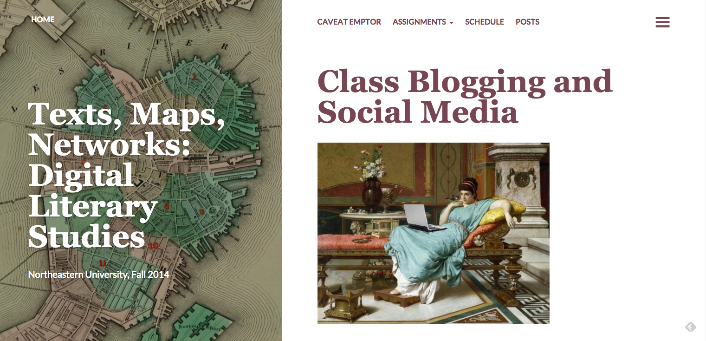
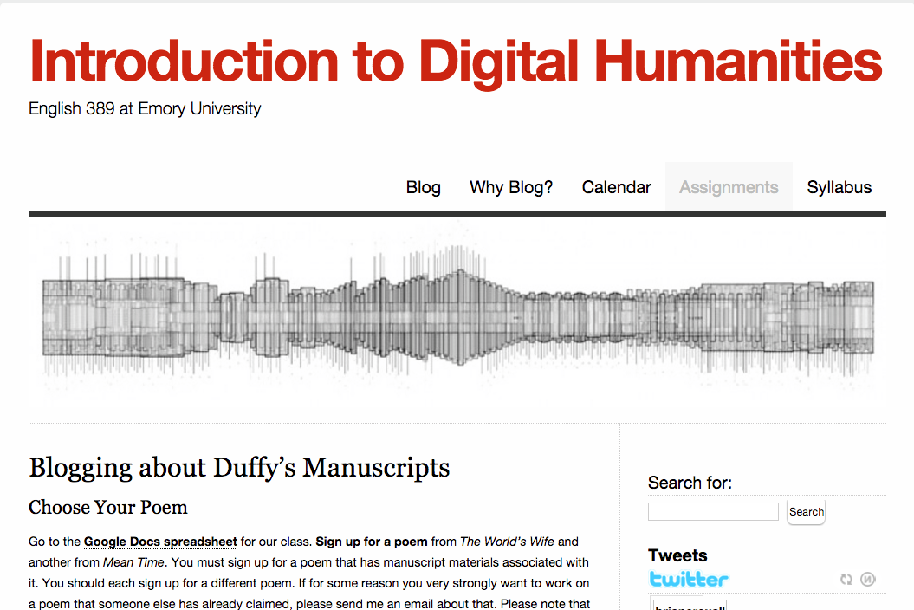
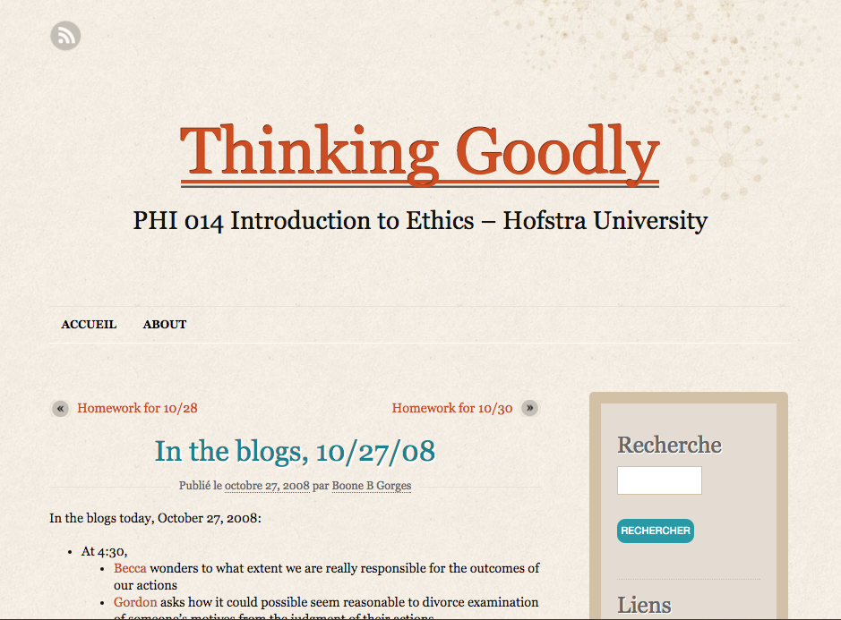
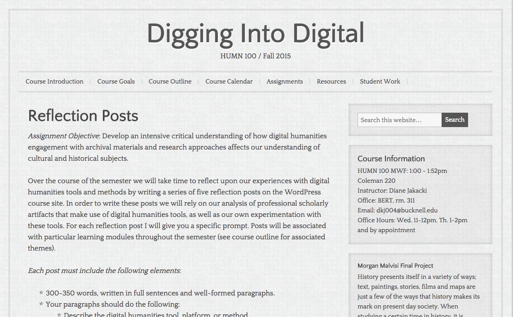
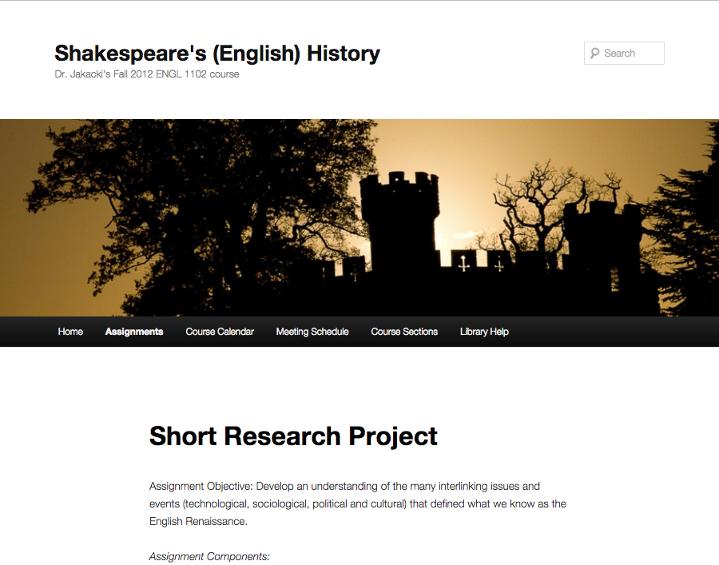
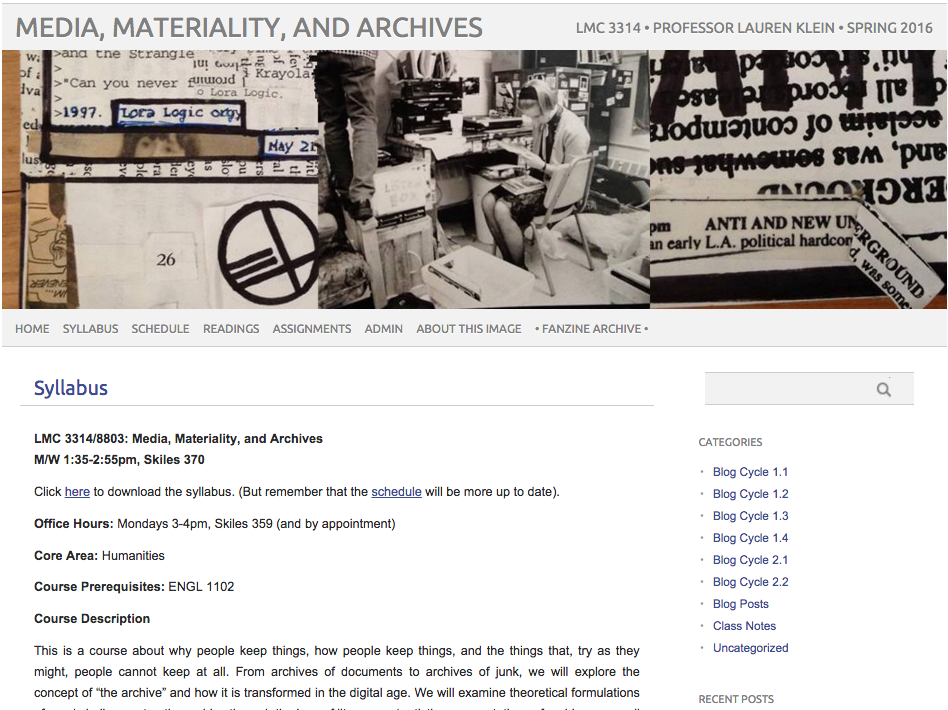
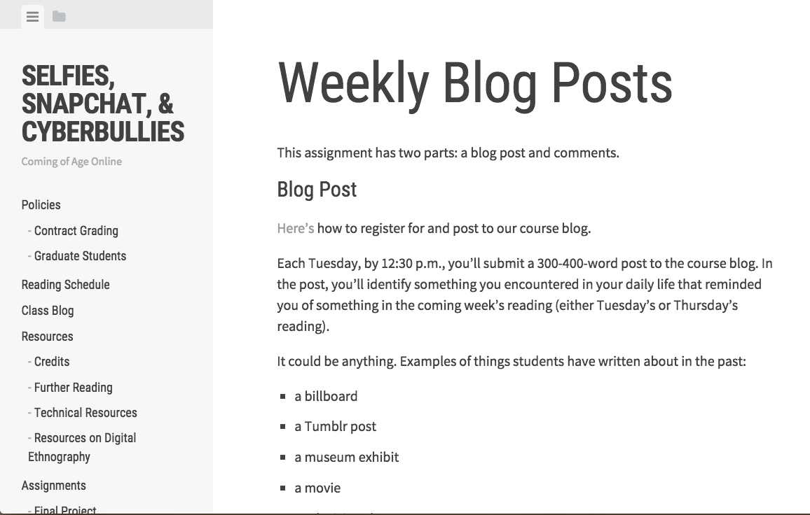
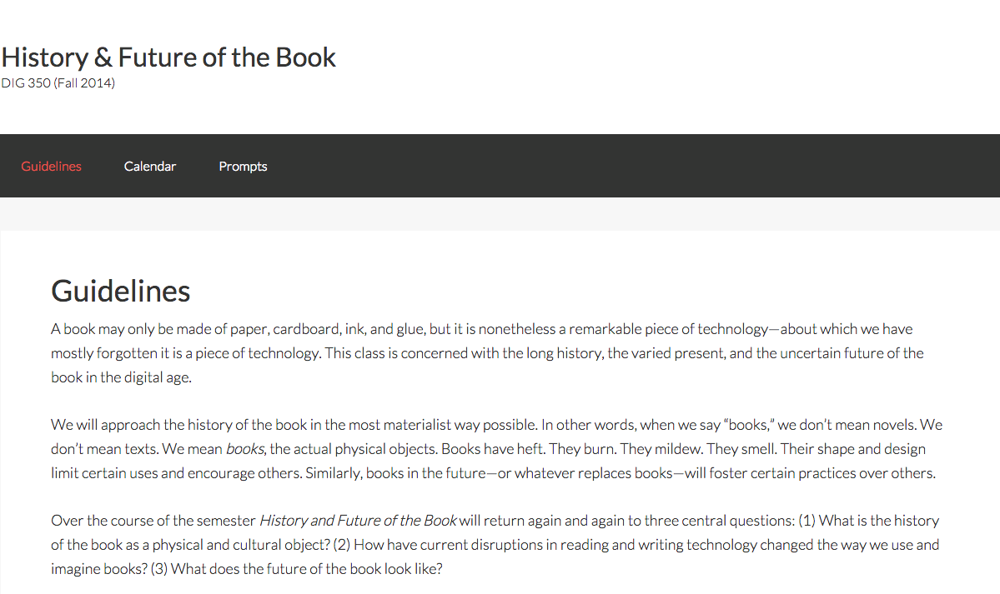
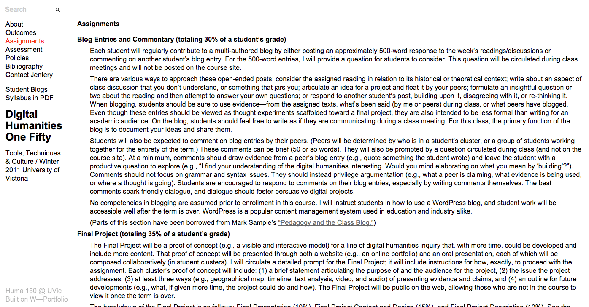
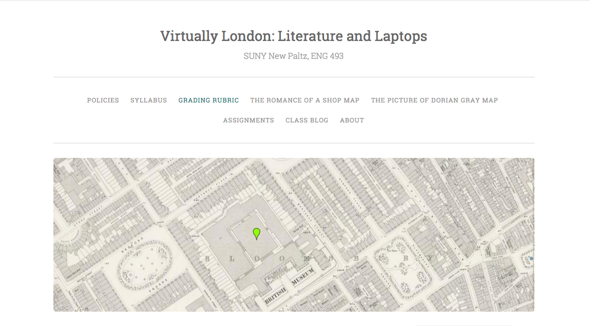

# BLOGGING (Draft)

## Diane K. Jakacki
Bucknell University | http://dianejakacki.net
---
##### Publication Status:
* unreviewed draft
* **draft version undergoing editorial review**
* draft version undergoing peer-to-peer review
* published 

--- 
## CURATORIAL STATEMENT

Blogging offers instructors opportunities to challenge students to write differently. Blogging assignments can help students to better understand the process of writing, develop different rhetorical voices, consider audience and public-facing work, negotiate the intersections of presentation, analysis, and reflection, and strengthen collaboration among classroom peers. By making students uncomfortable in dynamic environments and complicating the writer-reader paradigm, instructors can help to break constraints imposed by high-school-style: the dreaded five paragraph essay with an audience of one (Warner 2016). 

KDH: WHAT’S THE ENGAGEMENT WITH THE WARNER ARTICLE? DO YOU WANT TO ENGAGE WITH IT MORE CRITICALLY HERE IN THE FIRST PARAGRAPH? OR IS IT OUTSIDE THE REALM OF INTRODUCING BLOGGING? 

KDH: FOR THIS OPENING PARAGRAPH, I THINK YOU CAN MAKE THE LANGUAGE TIGHTER. FOR INSTANCE, IN THE FIRST SENTENCE, “DIFFERENTLY” FROM WHAT? YOU ENGAGE THE 5 PARAGRAPH ESSAY AT THE LAST SENTENCE, BUT IT COULD GO UP TOP IF YOU WANT TO ENGAGE THAT PARADIGM. IN THE NEXT SENTENCE, YOU SET UP THE WAYS THAT BLOGGING EFFECTIVELY MAKES STUDENTS UNCOMFORTABLE — GREAT — BUT DOES IT ONLY SERVE THE PURPOSE OF BREAKING THEIR HIGH SCHOOL HABITS? DOES BLOGGING REPRESENT THEIR INTRODUCTION TO COLLEGE-LEVEL CRITICAL THINKING. IN THIS OPENING PARAGRAPH, YOU HIGHLIGHT PROCESS AND PRODUCT AS A RESULT OF BLOGGING — GREAT! DO YOU THINK YOU CAN BE MORE OVERT ABOUT THESE DISTINCTIONS IN THE ENTIRE WRITING PROCESS? 

Blogging assignments also challenge instructors to break their own habits in terms of design and assessment. 
KDH: THIS PARAGRAPH BEGINS BY OFFERING THE BENEFITS/CHALLENGES TO FACULTY WHEN USING BLOGS BUT THE NEXT SENTENCE MOVES TO DISCUSS STUDENTS AGAIN. CAN YOU STAY WITH THE FACULTY MEMBER’S PERSPECTIVE FOR A MOMENT? 

In cases where students post over time, the drafting process changes; the emphasis shifts from revision and submission to cumulative writing improvement. The instructor must focus on how rubrics are articulated in order to help students to succeed in  uncomfortable writing environments. 

This is particularly helpful in composition and introductory literature courses. At first glance, blogging assignments suggest an easily implemented substitute for an otherwise short print-and-submit assignment, and indeed some instructors default to blogs because they think it shows that they "do DH in the classroom." 
KDH: THERE ARE TWO POSITIONS BEING CONTESTED HERE: FORM (BLOGS REPLACING PRINTED ESSAYS) AND FACULTY ENGAGEMENT WITH DH. I’M NOT SO SURE THAT THE SCARE QUOTES ABOUT DH ARE NECESSARY. YOU MIGHT BE PICKING A FIGHT THAT WILL DISTRACT FROM YOUR OTHER IDEAS. 

Indeed, Mark Sample bemoans the seemingly ubiquitous blog component, in which the online environment becomes little more than a technological substitute for otherwise printed essays (Sample 2009). 
KDH: THIS SEEMS TO BE A SALIENT POINT ABOUT BLOGS, THAT THEY AREN’T SIMPLY A DELIVERY MODE TO REPLACE THE PRINTED ESSAY. IT SEEMS THAT WHAT YOU’RE ARGUING IS REALLY ABOUT CONTROLLING VOICE AND TONE IN BLOG ASSIGNMENTS AND ALLOWING STUDENTS TO EXPERIMENT WITH THAT VOICE/TONE. IT ALSO SEEMS THAT YOU’RE GETTING INTO MODALITY HERE — THAT BLOGGING ALLOWS STUDENTS TO MIX TEXTUAL AND VISUAL MEDIA TO REPRESENT A CRITICAL VOICE THAT DIFFERS FROM THE “TRADITIONAL” ESSAY. IF THAT’S SO, PERHAPS A DEEPER DISCUSSION ABOUT THE VALUE OF BLOG ASSIGNMENTS EARLIER IN THE KEYWORD IS NECESSARY SO YOU CAN CRITICALLY ENGAGE WITH THOSE ASSIGNMENTS. 

KDH: SO THIS NEXT PARAGRAPH GOES INTO THE DIFFICULTIES WITH BLOGGING FOR BOTH FACULTY AND STUDENT. I DON’T THINK THERE’S BEEN ENOUGH DISCUSSED ABOUT HOW TO USE BLOGGING, HOW BEING UNCOMFORTABLE FOR BOTH FACULTY AND STUDENT IS BENEFICIAL. THOUGH THE PRIVACY ISSUE IS REALLY IMPORTANT AS ARE THE SCALABILITY AND ASSESSMENT/RUBRIC ISSUES, HOW CAN FACULTY DEAL WITH THESE ISSUES? YOU MENTION FAILURE AS AN IMPORTANT COMPONENT OF CREATING THESE ASSIGNMENTS (IN A COUPLE PARAGRAPHS DOWN); IS DESIGN OF THE ASSIGNMENT POSSIBLE ACROSS A FEW COURSES? PERHAPS WORKING WITH THE FERPA EXPERTS ON CAMPUS A MUST WHEN DESIGNING THE ASSIGNMENT? OR CONSIDERING IF IT’S A LONG TERM PROJECT VS. A SINGLE ASSIGNMENT? WHAT’S THE BENEFIT OF CREATING A PUBLIC-FACING ASSIGNMENT? OR HOW ABOUT PUBLIC JUST TO THE CLASS? ARE THERE ISSUES? DOES THAT FORCE THE DEGENERATION OF COLLABORATION IN THE CLASSROOM? 
Meanwhile, those who commit to robust, intricate, and transformational dynamic writing assignments may not understand at first the requirements of that commitment. Blog assignments are difficult to assess, do not scale well, and can in extreme cases even put students in danger. It is at the point of design - not after submission - that the instructor must think carefully about how public is public-facing writing, and what role she is ready to play if public-facing course work puts students at risk. Katy Crowther has written about ways in which grading-overwhelm can be offset by student engagement in peer review (Crowther 2011, 2012). 

KDH: INSTEAD OF POINTING TO CROWTHER’S WORK, CAN YOU ENGAGE WITH IT? WHY IS IMPORTANT TO CONSIDER WHEN CONTEMPLATING BLOG ASSIGNMENTS? 

Many of the creators of the assignments presented here have struggled to balance qualitative and quantitative assessment (sometimes you <—CAN INSTRUCTOR/FACULTY BE INSERTED HERE? just have to settle for giving a completion mark) or provide generalized rather than granular feedback to 75 or 100 students). Recently, the dark side <—WHAT DOES THIS MEAN? of public-facing writing has caused instructors to anonymize student work, offer students the option to password-protect their writing, or to just <—CAN WE ELIMINATE THE USE OF “JUST”? give up on the idea of public writing entirely. At MLA 2016, Jacque Wernimont and Amy Earhart spoke passionately about the importance of protecting their students from threats of violence against student authors could put them in harm's way. <—CITATION? JAQUE HAS WRITTEN SOME BLOGS ABOUT THIS; IF THIS IS A REAL FEAR, HOW CAN FACULTY USE RESOURCES ON CAMPUS TO PROTECT THEIR STUDENTS? REMEMBER, THIS IS A HOW-TO FOR ANYONE INTERESTED IN ASSIGNMENTS; HELP THEM TO FIGURE OUT SOME OF THESE ISSUES.

The artifacts presented here provide a breadth of approach on the part of instructors who encourage experimentation and encouragement to students as they write and read. All of the examples are from humanities courses, with all but one offered to undergraduates. It should not come as a surprise that six of the courses are identified in some way as being digital humanities in orientation. <—BUT HOW WILL YOU ENCOURAGE THE NON-DHER TO PARTICIPATE OR USE THESE ASSIGNMENTS? ARE THE ASSIGNMENTS TRANSFERRABLE? 

While blogging is not generally considered a DH method, the online format can serve to reinforce the digital in a DH or DH-inflected course. For many of us who identify as digital humanists, blogging occupies a valuable tool in our teaching shed. <—WHY IS THIS IMPORTANT TO NOTE? It should also not come as a surprise that many here have borrowed and reworked blog assignment designs and rubrics from one another. <—OK, BUT WHY IS THIS IMPORTANT TO NOTE? According to these assignments, Mark Sample and Brian Croxall have been the inspiration for many instructors included here. <—WHY IS THIS IMPORTANT TO NOTE? 

KDH: SO, THINK ABOUT YOUR READER AS SOMEONE WHO DOESN’T NECESSARILY IDENTIFY AS DH, BUT WHO IS INTERESTED IN APPLYING THESE ASSIGNMENTS. WITH THIS IN MIND, THE ABOVE PARAGRAPH SEEMS LIKE IT COULD BE CUT COMPLETELY. THE NEXT PARAGRAPH REALLY GETS AT THE HEART OF YOUR CURATED ARTIFACTS.

The decisions made (public/private, analytical/reflective, degree of multimodality) offer the reader of this keyword recipes for how to experiment with their own assignment design, ranging from the most straightforward to the most complex. These assignments were not always successful - in fact, in some cases the pedagogical ambition of the instructor was hampered by an unanticipated problem that required a mid-semester assignment redesign, and it is important to call particular attention to them. It is humbling and invaluable to realize that no matter how comfortable we think we are with a type of assignment, we must prepare for the unexpected when we design nontraditional writing assignments. There will always be tech-fails, and there will always be students who resist and even rebel against the nontraditional. The challenge of creating balance between structure and experimentation in writing remains. Still, these challenges - and sometimes difficult, emotional decisions <—WHY ARE THEY DIFFICULT AND EMOTIONAL? - make us better teachers. <—HOW? WHY? CAN YOU DISPENSE WITH FIRST PERSON PLURAL HERE? When we <—SAME HERE WITH FIRST PERSON design and deploy sophisticated blogging assignments, we can only do so when we are honest with ourselves about our expectations and transparent with our students about why we choose to use blogs and what such assignments can offer to them as learners. <—SO WHY IS THIS IMPORTANT TO MENTION? (I CAN SEE YOUR THINKING, BUT REMEMBER, THERE IS ALSO A NEWBIE USER OF THIS COLLECTION)

KDH: THERE’S ONLY 9 ARTIFACTS. CAN YOU ADD ONE MORE? A LOT OF THESE ARTIFACTS ARE ALSO FROM THE USUAL SUSPECTS (DHERS’ ASSIGNMENTS THAT ARE USED REPEATEDLY AND IN ABUNDANCE THROUGHOUT OUR COLLECTION. HAVE YOU FOUND ANY ARTIFACTS THAT ARE OUTSIDE LITERATURE? YOU HAVE ONE FROM PHILOSOPHY ALREADY.)

## CURATED ARTIFACTS:

### “Texts, Maps, Networks: Digital Literary Studies" 

* Artifact Type: Assignment
* Source URL: http://f14tmn.ryancordell.org/assignments/class-blogging/
* Artifact Permissions: [to come]
* Copy of the Artifact: Course site hosted by the University on the Wordpress platform. As of 2/21/2016 student work is publicly viewable, although several of the student sites have been taken down and some links lead to 404 errors.
* Creator and Affiliation: Ryan Cordell, Northeastern University

This assignment is distinctive in that it is built upon another, in which students are required to set up their own website;(Cordell http://bit.ly/1n68PaP) Cordell then collects site details and aggregates posts into the master course site. Students are expected to write at the end of each course module, posting and commenting upon classmates' posts at least three times. The title for each post appears on the course site and links to the relevant post on the student's site, which is also where comments are posted. 

The rubric is general and evaluation is unclear, but Cordell implies that he will supply more detailed feedback only upon student request. <—IS THIS A CRITIQUE OF THE ASSESSMENT? IT SOUNDS LIKE IT. 

KDH: WHY IS THIS ASSIGNMENT ENGAGING FOR BLOGGING? WHAT DOES IT REPRESENT IN TERMS OF THE WAY YOU HAVE DEFINED BLOGGING ABOVE? 

### Title of Artifact: "Blogging about Duffy's Manuscripts" 

* Artifact Type: Assignment
* Source URL: http://www.briancroxall.net/dh/assignments/blogging-about-duffys-manuscripts/
* Artifact Permissions: [to come]
* Copy of the Artifact: Blog hosted on Croxall's website on the Wordpress platform. As of 2/21/2016 student work is publicly viewable.
* Creator and Affiliation: Brian Croxall, Emory University

This artifact is one element of a larger blogging assignment. The two assigned posts focus on reflection of work done with poem manuscripts at Emory's rare books library (MARBL). Students choose two poems by Carol Duffy, go to MARBL to find the physical manuscript pages, and write about their experience working with manuscript copies of the poem and printed versions they have read for class. Students are free to write about anything that intrigues them. Croxall invites them to write more than twice <—IN REVISION OF A POST OR WRITING 2 POSTS? 

and proposes two choices for adjusting grading of the overall blogging assignment if a student does so. On the course website Croxall gives an explanation about why he assigns blogs (Croxall 2011), and emphasizes the conversational nature of blogging. 
This straightforward assignment could be readily adapted for a literature course with special emphasis on the relationship between manuscript and print. <—GOOD! YES, MORE OF THIS ON ALL OF YOUR JUSTIFICATIONS FOR ARTIFACTS

### Title of Artifact: "Thinking Goodly: Introduction to Ethics" 

* Artifact Type: Course site with blog comments and links <—KDH: IS THIS AN EXAMPLE OF STUDENT WORK?
* Source URL: https://boonebgorges.wordpress.com/2008/11/20/in-the-blogs-11202008/
* Artifact Permission: [to come]
* Copy of the Artifact: Blog hosted by Gorges on a course-specific website on the Wordpress.com platform. As of 2/21/2016 only some student work is publicly viewable (several students have deleted their blogs).
* Creator and Affiliation: Boone Gorges, Hofstra University

While this assignment is "old" by digital pedagogy standards, <—WHAT DOES THIS MEAN “OLD?” BE SPECIFIC 
Gorges's use of the "hub-and-spoke" <—WHAT DOES THIS MEAN? 
blogging system offers an interesting approach to public writing. The mechanisms (prompt, commentary, and links to student posts) are still available, inline with other course assignments on the course site. Post and comment submission deadlines are staggered, giving students time to comment upon one another's work. Gorges reads a selection of posts twice weekly, and aggregates several posts into the course site (the twice weekly "In the blogs" posts), which he notes results in better reading and commenting on specific posts. It is unclear whether Gorges manages grading this way, or just models good posting. Without access to the syllabus it is difficult to determine the number of posts or weight of the assignment. <—NOT SURE THIS LAST SENTENCE IS NECESSARY; IF THIS IS AN EXAMPLE OF SCALABILITY, THAT’S ALL YOU HAVE TO DEAL WITH

This is an ambitious assignment, and Gorges acknowledges that it is not for the faint of heart (Gorges 2009). <—GOOD; THIS IS GREAT INFORMATION FOR ANYONE WANTING TO INCORPORATE THE ASSIGNMENT

### Title of Artifact: "Digging into the Digital" 

* Artifact Type: Assignment and rubric
* Source URL: http://diggingdigital.blogs.bucknell.edu/reflection-posts/
* Artifact Permission: given by author (will either get all student permission or lock off access to student work)
* Copy of the Artifact: Blog hosted by the University in the Wordpress platform. As of 2/21/2016 student work is publicly viewable.
* Creator and Affiliation: Diane Jakacki, Bucknell University

This semester-long assignment (five posts) is a reflection/project presentation exercise, reinforcing the course focus on DH <—SPELL THIS OUT; REMEMBER OUR NEWBIE USERS praxis using a set of archival materials. Students examine scholarly DH resources and read a selection of articles and essays about DH research and methodology, and then reflect upon that scholarly work in context with and presentation of their own work. Within their posts they also embed, link to, or include screenshots of the artifacts they produce for each module (story maps, timeline entries, data visualizations, digital edition). 

The assignment reinforces the idea that student work exists along a spectrum with work produced by established scholars. They experiment with voice and visual rhetoric while they discuss process and product. What it doesn't do well is emphasize how students should critique one another's work or foreground the readings. A revision should focus on incorporating strong peer review and reshaping prompts. <—SO THIS IS AN EXAMPLE OF BREAKING FREE FROM THE ESSAY PARADIGM? ALSO, IS THE CRITIQUE NECESSARY AT THE CONCLUSION? 

### Title of Artifact: "Shakespeare's (English) Histories”

* Artifact Type: Assignment and rubric
* Source URL: http://blogs.iac.gatech.edu/henriad/short-research-project/
* Artifact Permission: given (no access to student work)
* Copy of the Artifact: Course site hosted by the University in the Wordpress platform. As of 2/21/2016 the course site with assignment descriptions is publicly viewable; student work is private.
* Creator and Affiliation: Diane Jakacki, Georgia Institute of Technology

This is one of two blog assignments in the course and is related to a research project. It involves two written augmentations to the formal in-class presentation: 1) a published abstract for each student project, including scholarly sources and media to be used in presentation; 2) a platform for peer feedback. The draft abstract was reviewed by Jakacki and Georgia Tech subject librarian Sherri Brown for revision. At the end of each student's presentation all students employed the comment feature on the presenter's abstract to give immediate feedback. The abstract was marked in draft and revised phases; all students received a completion mark for each comment, and peer feedback was incorporated into the presenter's grade.

This assignment uses the blog to bridge the gap between in-class and written work, and reinforces the importance of constructive peer review.

### Title of Artifact: "Media, Materiality, and Archives" 

* Artifact Type: Syllabus
* http://blogs.iac.gatech.edu/archives16/syllabus/
* Artifact Permission: [to come]
* Copy of the Artifact: Course site hosted by the University in the Wordpress platform. As fo 2/21/2016 student work is visible. 
* Creator and Affiliation: Lauren Klein, Georgia Institute of Technology

Klein's assignment demonstrates how blogs can form complex collaborative writing environments, with different writing tasks assigned over what she calls "cycles". <—GOOD!  YOU OPEN WITH WHY THIS IS A RELEVANT ASSIGNMENT IN RELATIONSHIP TO YOUR CURATORIAL STATEMENT; CAN YOU MAKE SURE YOU’VE DONE THIS WITH ALL OF YOUR ARTIFACT RATIONALE?

Students are broken into four groups; each group has a different task each week of a cycle: they serve as First Readers, Respondents, or Searchers (the fourth group gets a week off). Klein outlines what these tasks consist of, and how each student's work will be assessed per cycle (there are two cycles of 12 possible points each). In reading student work, it appears that blog writing is rooted in weekly readings(11), however the prompts are available only via Georgia Tech's LMS and so not available for review. 

This is a complex assignment, one better suited for an instructor who has experience assigning collaborative online writing. Commitment to explaining different tasks would be crucial for student success for an assignment worth 24% of the course grade.

###Title of Artifact: "Selfies, Snapchat, & Cyberbullies: Coming of Age Online" 

* Artifact Type: Assignment
* Source URL: http://miriamposner.com/dh150w15/assignments/weekly-blog-posts/
* Artifact Permission: [to come]
* Copy of Artifact: Blog hosted on Posner's website on the Wordpress platform. As of 2/21/2016 student work is publicly viewable.
* Creator and Affiliation: Miriam Posner, UCLA

In this clear, straightforward weekly assignment students submit a 300-400 word blog post that brings course readings in line with media that students encounter in daily life. Posts are submitted early in the week in advance of class; Posner instructs students to include some form of media or link that refers to the media item the writer describes, with an explanation of how their experience with the thing relates to the reading. Students post two substantial comments on classmates' work.

The rubric is simple but evaluation is vague<—INTENTIONALLY?: Posner explains what she expects with a link to examples of other students' posts from a previous course. The assignment is tied to her Contract Grading system. Posts apparently are marked as complete.

This assignment would be easy to adapt to many courses, and the focus on student self-evaluation addresses concerns about granular feedback of many blog assignments.

### Title of Artifact: "History & Future of the Book" 

* Artifact Type: Assignment
* Source URL: http://sites.davidson.edu/dig350/guidelines/
* Artifact Permission: [to come]
* Copy of Artifact: Blog hosted on University website on the Wordpress platform. As of 2/21/2016 student work is publicly viewable.
* Creator and Affiliation: Mark Sample, Davidson College

This is a straightforward blogging assignment, with ten 400-500 word posts over the semester. Prompts are simple and rooted in each week's reading. Posts are graded on a four point scale. Sample has developed this rubric over time; his approach to evaluation involves walking the class through examples of exceptional student work, giving periodic feedback via comments, and assigning a self-evaluation via "meta" post halfway through the term.

This type of assignment is easily adaptable to various course environments. The rubric and grading methodology is also one that an instructor new to blogging could adopt with confidence. One thing to consider about any blog, and to which Sample alludes, is that this type of assignment involves a significant amount of writing: ten posts are worth 20% of the grade: approximately 5,000 words over the course of the semester equals a 10-12 page essay.  <—GREAT RATIONALE THAT TIES TO THE STATEMENT

### Title of Artifact: "Tools, Techniques & Culture" 

* Artifact type: Assignment
* Source URL: http://jenteryteaches.com/2011/150/assignments/
* Artifact Permission: [to come]
* Copy of Artifact: Blog hosted by Sayers on a Wordpress platform (unclear if this is hosted on the university's server). As of 2/21/2016 student work is password-protected.
* Creator and Affiliation: Jentery Sayers, University of Victoria

This assignment is included specifically because it keeps student work public and does not offer prompts. The assignment as outlined on the course site is clearly explained as belonging to the class and in many ways offline (prompts are circulated in class but not posted on the site, for example). Sayers explains that students will post and comment in group or clusters, so a very organic form of collaborative writing evolves over the semester. Post expectations are open-ended - Sayers emphasizes that there are different approaches to blogging, and that posts can be reflections upon reading or discussion and should make the writer in some way uncomfortable. 

Entries and commentaries comprise a significant (30%) portion of the student grade, with three grades given over the course of the term: Sayers explains that each grade consists of a minimum of two blog entries and a comment.

### Title of Artifact: "Virtually London: Literature and Laptops" 

 
* Artifact Type: Rubric
* Source URL: https://hawksites.newpaltz.edu/virtuallylondon/grading-rubric/
* Artifact Permission: [to come]
* Copy of Artifact: Blog hosted by the University in the Wordpress platform. As of 2/21/2016 student work is publicly viewable.
* Creator and Affiliation: Annie Swafford, SUNY New Paltz.

There are two blogging assignments in this Literature course: one scaffolded across the semester and one related to the final mapping project. This annotation focuses on the scaffolded "Online Assignments." The blogging assignments are analytical in nature, and in aggregate constitute the largest component of the course grade (36%, or 4 pts. each for nine posts). A preliminary assignment allows students to acclimate to the blogging style and expectations, and then each subsequent prompt offers context and explicit instructions about what the post should include.

The Blogging Rubric is clearly articulated: evaluation is on a four-point scale. Students are expected to comment on one another's posts, but commenting is not broken out in the rubric or given any kind of separate completion mark.

## RELATED MATERIALS

Croxall, Brian. "Assignments and Architecture." Video recording. Penn State Liberal Arts Scholarship and Technology Summit, 2014. 27 February 2016. https://www.youtube.com/watch?v=xHAfQ9fEJiU.

Gorges, Boone. "Hub-and-Spoke Blogging with Lots of Students". 2009. Web. 27 February 2016.  https://teleogistic.net/2009/08/20/hub-and-spoke-blogging-with-lots-of-students/

McClurcken, Jeff and Julie Meloni. "'How Are You Going to Grade This?' Evaluating Classroom Blogs." Profhacker - Chronicle of Higher Education. 21 June 2010. 27 February 2016. http://chronicle.com/blogs/profhacker/how-are-you-going-to-grade-this-evaluating-classroom-blogs/24935

Owens, Trevor. "The Public Course Blog: The Required Reading We Write Ourselves for the Course That Never Ends." Debates in the Digital Humanities. 2013. Web. 27 February 2016. http://dhdebates.gc.cuny.edu/debates/text/6 

Sample, Mark. "Pedagogy and the Class Blog". samplereality.com August 14, 2009. Web. 27 February 2016. http://www.samplereality.com/2009/08/14/pedagogy-and-the-class-blog/

## WORKS CITED

Cordell, Ryan. "Texts, Maps, Networks: Digital Literary Studies." http://f14tmn.ryancordell.org/. Web. Accessed February 2016. 

Crompton, Constance. "Dr. Constance Crompton on Composition and Digital Tools." Digital Communitas: Academic Publics and Digital Spaces. 2012. https://digitalcommunitas.wordpress.com/how-to-videos/dr-constance-crompton-postdoctoral-fellow-university-of-victoria/. Web. Accessed 27 February 2016.

Crowther, Kathryn. "Putting Students to Work: Guest Hosting a "Best Blog" Round-Up." TECHStyle. November 12, 2011. http://techstyle.lmc.gatech.edu/putting-students-to-work-guest-hosting-a-best-blog-round-up/. Web. Accessed. 27 February 2016. 

---. "Punking the Victorians, Punking Pedagogy: Steampunk and Creative Assignments in the Composition Classroom." Journal of Victorian Culture Online. September 6, 2012. http://blogs.tandf.co.uk/jvc/2012/09/06/punking-the-victorians-punking-pedagogy-steampunk-and-creative-assignments-in-the-composition-classroom/. Web. Accessed 27 February 2016. 

Croxall "Introduction to Digital Humanities." http://www.briancroxall.net/dh/. Web. Accessed 27 February 2016. 

---. "Assignments and Architecture." Penn State Liberal Arts Scholarship and Technology Summit, 2014. https://www.youtube.com/watch?v=xHAfQ9fEJiU. Web. Accessed 27 February 2016. 

Gorges, Boone. "Thinking Goodly: Introduction to Ethics." https://boonebgorges.wordpress.com/. Web. Accessed 27 February 2016. 

---. "Hub-and-Spoke Blogging with Lots of Students". https://teleogistic.net/2009/08/20/hub-and-spoke-blogging-with-lots-of-students/. Web. Accessed 27 February 2016. 

Jakacki, Diane. "Digging into the Digital." http://diggingdigital.blogs.bucknell.edu/. Web. Accessed 27 February 2016. 
---. "Shakespeare's (English) Histories." http://blogs.iac.gatech.edu/henriad/. Web. Accessed 27 February 2016. 

Klein, Lauren. "Media, Materiality, and Archives." http://blogs.iac.gatech.edu/archives16/. Web. Accessed 27 February 2016. 

McClurcken, Jeff and Julie Meloni. "'How Are You Going to Grade This?' Evaluating Classroom Blogs." Profhacker - Chronicle of Higher Education. 21 June 2010. http://chronicle.com/blogs/profhacker/how-are-you-going-to-grade-this-evaluating-classroom-blogs/24935. Web. Accessed 27 February 2016.

Owens, Trevor. "The Public Course Blog: The Required Reading We Write Ourselves for the Course That Never Ends." Debates in the Digital Humanities. 2013. http://dhdebates.gc.cuny.edu/debates/text/6. Web. 27 February 2016.

Posner, Miriam. "Selfies, Snapchat, & Cyberbullies: Coming of Age Online." http://miriamposner.com/dh150w15/. Web. Accessed 27 February 2016. 

Salter, Anastasia. "Re-evaluating the Risks of Public Scholarship." ProfHacker - The Chronicle of Higher Education. June 4, 2015. http://chronicle.com/blogs/profhacker/re-evaluating-the-risks-of-public-scholarship/60229. Web. Accessed 27 February 2016.

---. "Revisiting Your Learning Management System." Profhacker - The Chronicle of Higher Education. April 18, 2013. http://chronicle.com/blogs/profhacker/revisiting-your-lms/48441. Web. Accessed 27 February 2016.  

Sample, Mark. "History & Future of the Book." http://sites.davidson.edu/dig350/. Web. Accessed 27 February 2016. 

---. "A Better Blogging Assignment." ProfHacker - The Chronicle of Higher Education. July 3, 2012.  http://chronicle.com/blogs/profhacker/a-better-blogging-assignment/41127. Web. Accessed 27 February 2016.

---. "Pedagogy and the Class Blog". samplereality.com August 14, 2009. http://www.samplereality.com/2009/08/14/pedagogy-and-the-class-blog/. Web. Accessed 27 February 2016. 

Sayers, Jentery. "Tools, Techniques & Culture." http://jenteryteaches.com/2011/150/. Web. Accessed 27 February 2016. 

---. "Huma 150: Intro to Digital Humanities Fall 2011 (28 Students). jenterysayers.com. 2011. http://www.jenterysayers.com/2011/150/. Web. Accessed 27 February 2016.

Schulman, Martha and Gwen Hyman. "In Defense of Essays." Inside Higher Ed. Feb. 19, 2016. 
https://www.insidehighered.com/views/2016/02/19/colleges-should-invest-more-teaching-students-how-write-essay. Web. Accessed 27 February 2016.

Swafford, Annie. "Virtually London: Literature and Laptops." https://hawksites.newpaltz.edu/virtuallylondon/. Web. Accessed 27 February 2016.  

Warner, John. "Kill the 5-Paragraph Essay." Inside Higher Ed. Feb. 22, 2016. https://www.insidehighered.com/blogs/just-visiting/kill-5-paragraph-essay. Web. Accessed 27 February 2016.  
