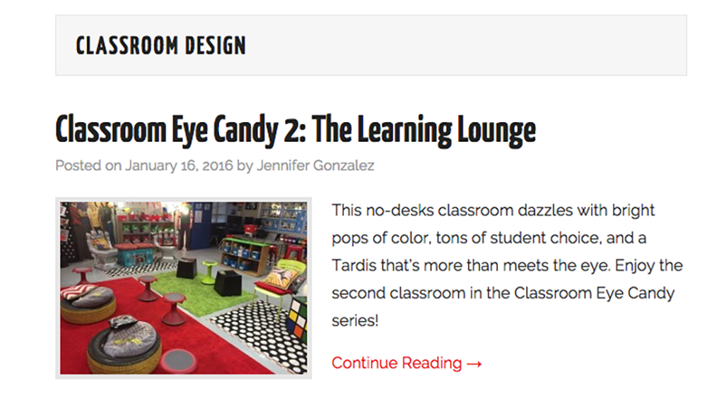
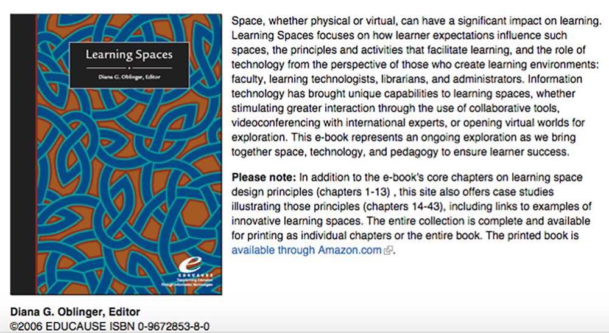
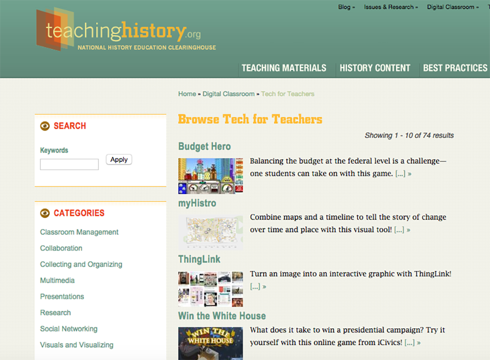

# CLASSROOM (Draft)
 
### Joyce R. Walker
Illinois State University 

---

##### Publication Status:
* **unreviewed draft**
* draft version undergoing editorial review
* draft version undergoing peer-to-peer review
* published 

--- 

## CURATORIAL STATEMENT

As conversations about writing and digital technology began to expand in the 1990s, one of the things that quickly became clear to teachers was that our classrooms had always been multimodal. The spaces in which we teach are necessarily rich with physical objects, sounds, and smells that impact our learning. From a cultural-historical activity theory perspective, our daily interaction with spaces and materials is a critical aspect of any investigation of composing practices (see Prior *et al*.). Rather than a focus on "writing" or "composing" or “learning” as discrete events that happen in the mind of an individual in a particular setting, we need to attend to literate learning practices in all of their complexity, to recognize them as long chains and wide networks of activity where tools, people, and institutions interact over time and space. In my own work as a teacher and a writing program administrator, I have been interested in thinking carefully and specifically about how complex literate activities (the things writers actually do when they are writing) shape both our knowledge and experience as writers and the genres of writing we produce and disseminate.  From this perspective, “classroom” becomes a term that encompasses much more than four walls and some seating in a building somewhere, or the digital interface of a course management system as it shapes the learning in an online-only classroom.

From the point of view of teachers, the classroom, whether real or virtual, is a space where (ideally) learning happens. It is also a space that includes a wide range of objects (both real and virtual) that have much more impact on our teaching practices than we tend to consider. Where and how students sit (or move around) in a classroom can shape learning profoundly, but so can the amount and type of lighting available. The course management system interface of an online class can have profound impact, but so can the physical setting where a student accesses the online environment. Additionally, the divide between our online and face-to-face classrooms has become blurred by the fact that face-to-face classrooms are permeated with digital technologies, while our "distance" learning spaces are digitally mediated in through a wide range of practices that have important-to-consider kinesthetic attributes (for example, instant messaging, video chats, and emails are all digital environments and tools that require specific kinds of kinesthetic activities). This means that as we design or interact with different learning settings, we must consider a range of possible interrelations of tools and people in real and virtual spaces and across different timespans.

From the point of view of this collection, classroom could be a term that connotes not just a "learning space," but a "*school* learning space." But as Ewan MacIntosh notes (see artifact below), "learning doesn't happen only in classrooms" (n. pag.). So if we begin to define "classroom" instead as "a setting where multiple individuals might be teaching or learning over both time and space," then we will need to both reconsider our notion of the real/virtual learning divide and acknowledge the complexity of learning interactions in both online and face-to-face settings. We will also need to move beyond school learning spaces and consider more carefully the complex trajectories of learning activities as they happen in the world. 

For this collection I have brought together a handful of resources that cross boundaries between online and face-to-face classrooms that may help us to think about not just the tools we use when we compose and learn but also how the spaces where we compose and learn (whether in school or outside of it) shape our productions and the ways we understand ourselves as literate learners. I have also organized these resources into the following four broad categories, which might help to situate our thinking about classrooms along a continuum from virtual to face-to-face:

**Classroom Design and Its Impacts on Learning**: This group of resources was interesting to me because it follows mostly K-12 teachers and their understanding of "their" classrooms as spaces that need to have physical attributes that encourage diverse kinds of learning. In post-secondary education settings, teachers usually do not have classroom spaces where they stay all day, so the focus on learning environments becomes much more institutionalized, and the focus on learning technologies across classrooms comes to the forefront.

**Designing Technology Infused Classrooms**: For both K-12 and college settings, new ideas for classroom design almost always need to include some concept of how digital technology will be accommodated, even if it is only how many outlets will be provided and how strong the wireless internet signal will be. So this group of resources focuses specifically on the idea of integrating technology into school learning spaces.

**Learning Beyond the Classroom: Attending to Space and Activity**: It seemed important to me to include some type of resource that could help users think about the bigger picture of attending to space and activity in learning. For me, this moves beyond thinking about just classrooms or learning spaces in academia or about the use of technology in those spaces. It is more about a recognition that, when we compose and learn, we are embedded within complex networks of activity that are widely distributed, both temporally and geographically. So when we think about learning, we need to think about these networks, which reach beyond both classroom walls and digital interfaces.

**Classroom Tools for Learning and Composing**: These types of resources are embedded among many of the other terms in this collection. However, it felt right to me to provide a couple of links to resources that offer lists of digital tools that teachers can use to enhance learning. In my work as a writing program administrator, I have found that often the first mental step instructors need to make when they begin to shift toward a view of the classroom as a hybrid, networked space is to think about daily learning activities that can be enhanced by the use of different kinds of tools and technologies. 

## CURATED ARTIFACTS 

### Section One: Classroom Design and Its Impacts on Learning

This section includes three artifacts. The first is a teacher-resource blog by Jennifer Gonzalez that includes a section on classroom spaces designed by K-12 instructors. I have also included an edited collection of articles, published by Educause, that focuses on learning spaces in higher education. Finally, I included a study on physical classroom environments that found that difference in light, space, color, and other factors had an impact on student learning.

#### The Cult of Pedagogy: Classroom Eye Candy

* Source: [http://www.cultofpedagogy.com/category/classroom-design/](http://www.cultofpedagogy.com/category/classroom-design/)
* Copy of Artifact: forthcoming
* Creators: Jennifer Gonzalez

Classroom Eye Candy is a relatively new section of a teacher-resource blog created by Jennifer Gonzalez. Although there are currently only two entries on classroom design and organization included in this larger blog that focuses on a wide range of K-12 teaching issues, these two examples show how creatively some teachers are able to think about the spaces where their students learn.

#### Learning Spaces

* Source: [http://www.educause.edu/research-and-publications/books/learning-spaces](http://www.educause.edu/research-and-publications/books/learning-spaces)
* Copy of Artifact: forthcoming
* Creators: forthcoming

This edited collection of articles, published by Educause, is available as a free PDF. It offers a look at the issues of the design of learning spaces in university settings. The edited collection includes one section of articles devoted to principles and issues of learning space design, while a second section offers case studies from various educational settings worldwide.

#### The Impact of Classroom Design On Student Learning

* Source: http://www.sciencedirect.com/science/article/pii/S0360132315000700
* Copy of Artifact: forthcoming
* Creators: Peter Barrett, Fay Davies, Yufan Zhang & Lucinda Barrett 

This study found that differences in physical environments had a measurable impact on student learning. The study operationalized components related to aspects of the environment such as air quality and light as well as issues such as available stimulation and flexibility of learning space.

### Section Two: Designing Technology Infused Classrooms

The following artifacts focus on how technology can be used to enhance classroom learning, but the items I have selected do not just focus on technological tools. Instead, they try to get a holistic view of all of the spaces where learning can/might/should happen and what kinds of tools (composing tools, furniture, lighting) impact that learning.

#### Classroom Design Matters

* Source: [http://kerileebeasley.com/2015/08/16/classroom-design-matters/](http://kerileebeasley.com/2015/08/16/classroom-design-matters/)
* Copy of Artifact: forthcoming
* Creators: Keri-Lee Beasley

This blog site by digital literacy coach, Keri-Lee Beasley, includes a post titled, "Classroom Design Matters," which offers a range of links that cross the boundary between digital and physical issues in classroom design.  Although Beasley’s work focuses primarily on K-12 settings, instructors and administrators in university settings might also find these links useful when thinking about the productive design of learning spaces.

#### “Space, The Final Frontier” and “Possible Futures” 

* Sources: https://www.youtube.com/watch?v=kemWMuaHjBs and https://www.youtube.com/watch?v=HpwTV0iTG5k 
* Copy of Artifact: forthcoming
* Creator: Stephen Heppell

These two videos by Stephen Heppell are really thought provoking resources for thinking about the design of learning spaces in ways that move beyond not only the online/face-to-face divide but our basic understanding of classrooms as "four wall" spaces. As Heppell notes, "If you say to a group of students, 'Bring in a piece of furniture from home or from your digs that you think will improve your learning,' not one of them will bring in a hard kitchen chair. You know, they’ll bring in comfortable chairs, they’ll bring in chairs where they can work with others" (n. pag.). Heppell offers both some ideas about how learning spaces are currently evolving and a look at the possible future of learning space design.

#### "Clicks & Bricks: When Digital, Learning and Physical Space Meet" and "The Seven Spaces of Technology in School Environments" 

* Sources:http://edu.blogs.com/edublogs/2010/10/-cefpi-clicks-bricks-when-digital-learning-and-space-met.html and https://vimeo.com/15945912
* Copy of Artifact: forthcoming
* Creator: Ewan McIntosh

In both of these artifacts (but especially the video), Ewan McIntosh expands on the notion of the six spaces of social media, originally developed by Matt Locke. McIntosh adds a seventh component of what he calls "life in digital spaces" and then superimposes these concepts onto an analysis of learning spaces more generally. On his blog, McIntosh develops these ideas further and offers a range of resources for thinking about the interrelation of the physical and virtual spaces where people live, work, and learn. McIntosh's analyses offer an interesting focus on learning activity as the central component around which learning spaces can be designed.

### Section Three: Attending to Space and Activity

#### Learning Spaces Course Plan 

* Source: https://drive.google.com/folderview?id=0B0vrL-DffM_dZ200b1FPYnR5Ujg&usp=sharing
* Copy of Artifact: forthcoming
* Creator: Joyce R. Walker

The following course plan is designed for a course that takes activity theory and learning spaces as its two key themes. The course content is designed for an upper level undergraduate or graduate course, but the readings and projects could be adapted for courses from First Year Writing to various kinds of upper level and graduate level pedagogy courses. The readings for this course offer a much clearer articulation of the connection between activity theory and how it can help us to consider the complex ways people learn in various environments. It also includes an additional reading list.

### Section Four: Classroom Tools for Learning and Composing

Although this topic is also addressed by curators of other keywords in this collection, I wanted to include at least a couple of links to sites that offer different software tools instructors can use to create more technology-infused learning. For many teachers whose classrooms include either school-sponsored computing (desktop, laptop, tablet, or other technologies) or student-driven computing (which can include all of the above as well as cell phones), these digitally mediated learning spaces must be considered as part of their classroom designs. The following sites offer some interesting conceptualization of technology in the classroom, as well as lists of different tools for instructors to consider.

#### There’s No App for Good Teaching: Eight Ways to Think about Tech
 

* Source: http://ideas.ted.com/theres-no-app-for-good-teaching/
* Copy of Artifact: forthcoming
* Creators: Laura Moorhead

This TED article focuses on thinking about technology wisely in the classroom. It is a useful article for instructors because it helps them to consider how to use technologies that will specifically encourage and facilitate learning in areas that will have the most benefit for their students.

#### Free Tech for Teachers 

* Source: http://www.freetech4teachers.com/
* Copy of Artifact: forthcoming
* Creator: Richard Byrne

Once instructors have considered what kinds of learning activities they might want to foster through the use of technology, sites like this one can offer a wide range of choices for technologies that can be used without cost. I find that browsing sites like this one (and the next artifact as well) can help generate ideas about learning activities. In this way the possible tools and the learning goals can move into a more productive synergy.

#### Tech for Teachers

* Source: http://teachinghistory.org/digital-classroom/tech-for-teachers
* Copy of Artifact: forthcoming
* Creators: The Roy Rosenzweig Center for History and New Media at George Mason University

From the National History Education Clearinghouse, this site offers a great range of different computer technologies that instructors can used. When considered within the framework of "how does this technology impact the activity of learning," the various tools become an interesting part of any instructors considerations of the kind of classroom environment they are working to create. 

## RELATED MATERIALS

Handy Jam (for the W.A. Schaffer Pen Company). “The Twenty-six Old Characters.” Original Video, 1947. (made available through the Prelinger Internet Archive).  Feb. 16, 2016. https://archive.org/details/TwentySi1947 

Mitra, Sugata. "Kids Can Teach Themselves." TED: Ideas Worth Spreading. TED Conferences LLC, Feb. 2007. Web. 19 Feb. 2016. <https://www.ted.com/talks/sugata_mitra_shows_how_kids_teach_themselves?language=en>. 

Shalaway, Linda. "Classroom Organization: The Physical Environment."Teachers: Where Teachers Come First. Scholastic, Inc. Web. 19 Feb. 2016. <http://www.scholastic.com/teachers/article/classroom-organization-physical-environment>.

TED Topics: Education (a Channel for TED talks related to education and learning): http://www.ted.com/topics/education 

The Word Bird. "Activity Theory: Because Things Are Actors Too." YouTube. YouTube, 20 Aug. 2014. Web. 19 Feb. 2016. <https://www.youtube.com/watch?v=mb-3ufwK6U0>. 
 
Wright-Dottore, Michelle. "CHAT: How Sweet It Is! Mapping Out the Activity of Writing." YouTube. The Illinois State University Writing Program, 10 Nov. 2015. Web. 19 Feb. 2016. <https://www.youtube.com/watch?v=MJya9zQoMuw>. 

## WORKS CITED 

Barret, Peter, Fay Davis, Yufan Zhang, Lucinda Barrett. “The impact of classroom design on pupils' learning: Final results of a holistic, multi-level analysis.” Building and Environment. Volume 89, July 2015, Pages 118–133. 

Beasley, Keri-Lee. "Classroom Design Matters." Tip of the Iceberg. 16 Aug. 2015. Web. 19 Feb. 2016. <http://kerileebeasley.com/2015/08/16/classroom-design-matters/>.

Byrne, Richard. "Free Technology for Teachers." Free Technology for Teachers. Feb. 2016. Web. 19 Feb. 2016. <http://www.freetech4teachers.com/>. 

Gonzalez, Jennifer. "Classroom Design." Cult of Pedagogy. 19 Nov. 2015. Web. 19 Feb. 2016. <http://www.cultofpedagogy.com/category/classroom-design/>.

Heppell, Stephen. "Stephen Heppell: Possible Futures." 9 Nov. 2011. Web. 19 Feb. 2016. <https://www.youtube.com/watch?v=HpwTV0iTG5k>.

Heppell, Stephen. "Space, The Final Frontier." 17 Apr. 2009. Web. 19 Feb. 2016. <https://www.youtube.com/watch?v=kemWMuaHjBs>.

Locke, Matt. "Six Spaces of Social Media." TEST: Notes on How to Make Culture in the Age of Digital Attention. 10 Aug. 2007. Web. 19 Feb. 2016. <https://test.org.uk/2007/08/10/six-spaces-of-social-media/>.

McIntosh, Ewan. "The Seven Spaces of Technology in School Environments."Vimeo. 18 Oct. 2010. Web. 19 Feb. 2016. <https://vimeo.com/15945912>.

McIntosh, Ewan. "Clicks & Bricks: When Digital, Learning and Physical Space Meet." Design Thinking, Education & Learning. 03 Oct. 2010. Web. 19 Feb. 2016. <http://edu.blogs.com/edublogs/2010/10/-cefpi-clicks-bricks-when-digital-learning-and-space-met.html>. 

Moorehead, Laura. "There's No App for Good Teaching." Ideas.ted.com. 03 Sept. 2014. Web. 19 Feb. 2016. <http://ideas.ted.com/theres-no-app-for-good-teaching/>. 

Oblinger, Diana, ed. Learning Spaces. Louisville, CO: Educause, 2006. Web. 19 Feb. 2016. <http://www.educause.edu/research-and-publications/books/learning-spaces>.

Prior, Paul, Janine Solberg, Patrick Berry, Hannah Bellwoar, Bill Chewning, Karen J. Lunsford, Liz Rohan, Kevin Roozen, Mary P. Sheridan-Rabideau, Jody Shipka, Derek Van Ittersum, and Joyce R. Walker. "Re-situating and Re-mediating the Canons: A Cultural-Historical Remapping of Rhetorical Activity." Kairos 11.3 (2007). Kairos: A Journal of Rhetoric, Technology, and Pedagogy. Karios, 2007. Web. 19 Feb. 2016. <http://kairos.technorhetoric.net/11.3/binder.html?topoi/prior-et-al/index.html>.

"Tech for Teachers." Teaching History.org. The National History Education Clearinghouse, Feb. 2016. Web. 19 Feb. 2016. <http://teachinghistory.org/digital-classroom/tech-for-teachers>. 

Walker, Joyce R. "Classroom_Activity Syllabus and Materials."Classroom_Activity. 1 Feb. 2016. Web. 19 Feb. 2016. <https://drive.google.com/folderview?id=0B0vrL-DffM_dZ200b1FPYnR5Ujg> 
