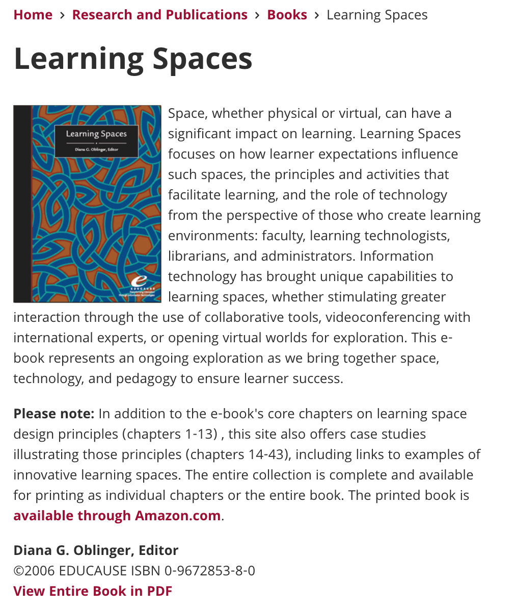
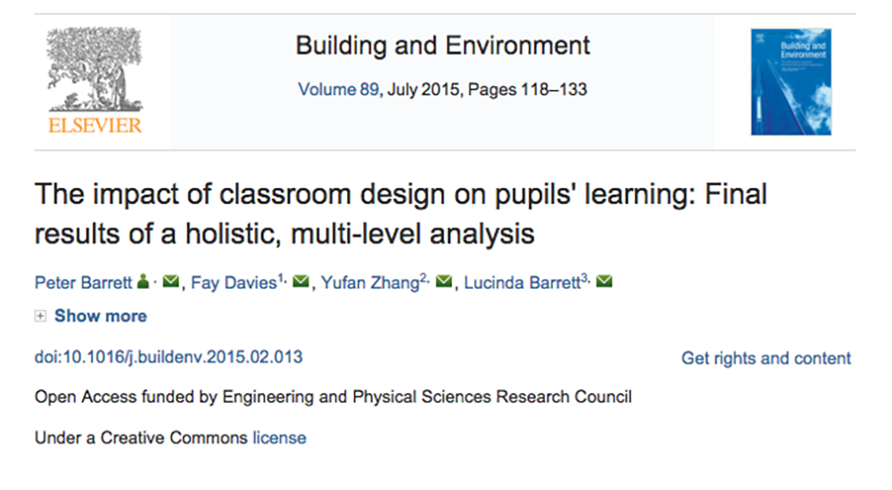
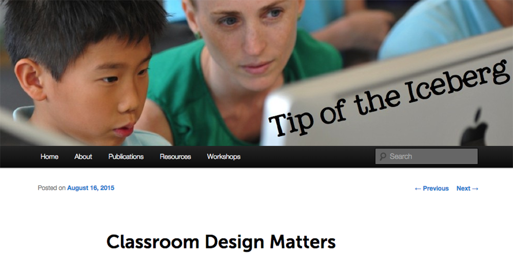
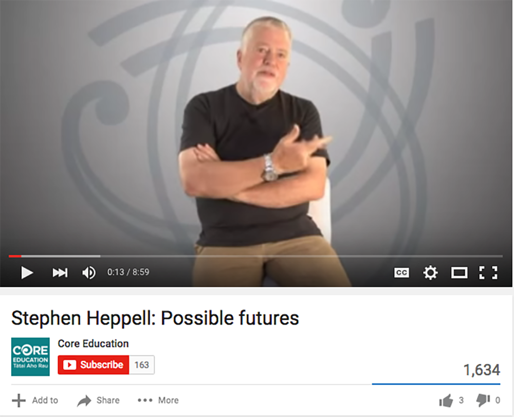
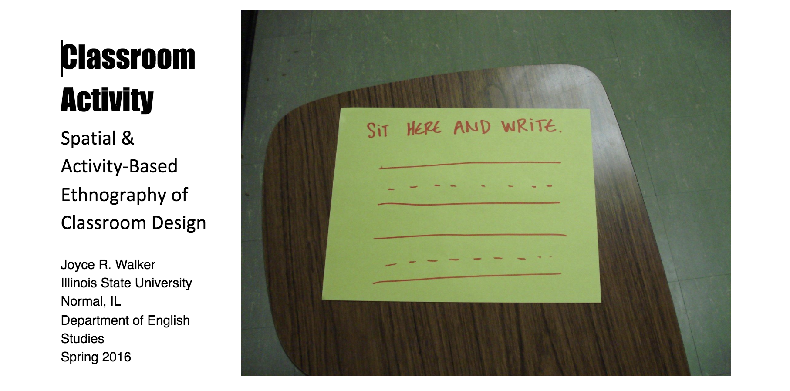
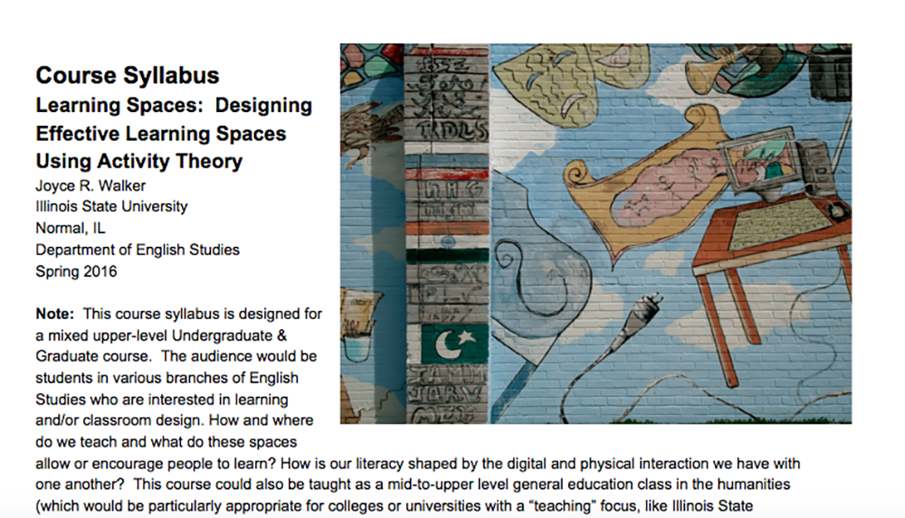
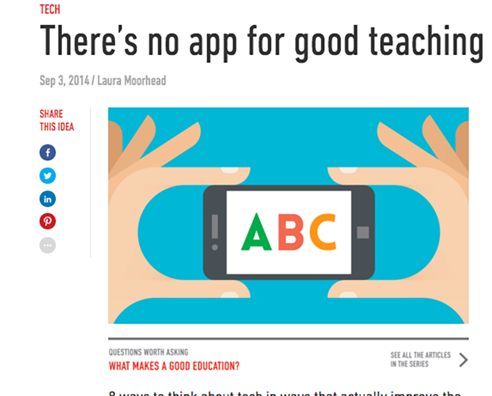
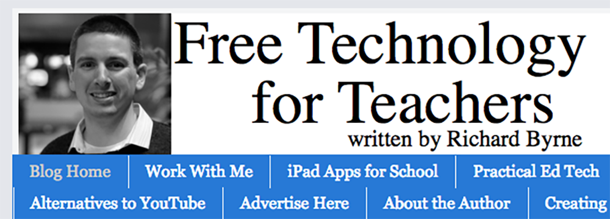
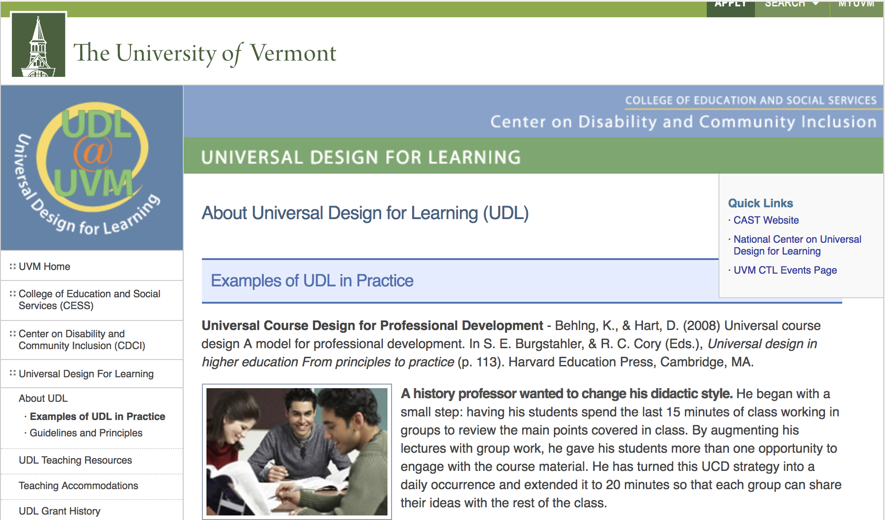

# Classroom
 
### Joyce R. Walker
Illinois State University 

---

##### Publication Status:
* unreviewed draft
* draft version undergoing editorial review
* draft version undergoing peer-to-peer review
* **draft version undergoing MLA copyediting**
* awaiting pre-print copy
* published 

---

### Cross-Reference Keywords: access, design, hybrid, interface

---   

## CURATORIAL STATEMENT

From the point of view of teachers, the classroom, whether real or virtual, is a space where (ideally) learning happens. It is also a space that includes a wide range of objects (both real and virtual) that have much more impact on our teaching practices than we tend to consider. Where and how students sit (or move around) in a classroom can shape learning profoundly, but so can the amount and type of lighting available (Barrett, et al., 119). The course management system interface of an online class can have profound impact, but so can the physical setting where a student accesses the online environment. Additionally, the divide between our online and face-to-face classrooms has become blurred by the fact that face-to-face classrooms are permeated with digital technologies, while our "distance" learning spaces are digitally mediated in through a wide range of practices that have important-to-consider kinesthetic attributes (for example, instant messaging, video chats, and emails are all digital environments and tools that require specific kinds of kinesthetic activities). Using these technologies in different ways also can impact relational activities, according to Schrand, such as reciprocity and cooperation (81). This means that as we design or interact with different learning settings, we must consider a range of possible interrelations of tools and people in real and virtual spaces and across different timespans.

From the point of view of this collection, classroom could be a term that connotes not just a "learning space," but a "*school* learning space." But as Ewan MacIntosh notes, "learning doesn't happen only in classrooms" (n. pag.). If we alter our definition of "classroom" to include "any setting where multiple individuals might be teaching or learning over both time and space," then we will need to both reconsider our notion of the real/virtual learning divide and acknowledge the complexity of learning interactions in both online and face-to-face settings. We will also need to move beyond school learning spaces and consider more carefully the complex trajectories of learning activities as they happen in the world. 

This collection brings together a handful of resources that cross boundaries between online and face-to-face classrooms to help teachers and their students to think intentionally about not just the tools we use when we compose and learn, but also how the spaces where we compose and learn (whether in school or outside of it) shape our productions and the ways we understand ourselves as literate learners. Because, for the humanities classroom, course plans and activities that focus students on the impact of space are not prevalent, many of the artifacts below are instead resources to help teachers to begin to do some of this important thinking -- not so much to make every class a class ABOUT the classroom, but to make sure that we teach with attentiveness to tools and spaces.  These resources move across four different topical categories, which situate thinking about classrooms along a continuum from virtual to face-to-face:

**Classroom Design and Its Impacts on Learning**: In post-secondary education settings, teachers usually do not have classroom spaces where they stay all day (unlike many K-12 instructors), so the focus on learning environments becomes much more institutionalized, and the focus on learning technologies across multiple classrooms comes to the forefront. However, post-secondary teachers can still learn to think (with their students) about classroom spaces, and how the spaces and tools we use can impact our learning.

**Attending to Space and Activity**: Some of the following artifacts can help teachers think about the bigger picture of attending to space and activity in learning. Thinking in this way moves us beyond considering only classrooms or learning spaces in academia and the use of technology in those spaces. Instead, we need to recognize that when we compose and learn, we are embedded within complex networks of activity that are widely distributed, both temporally and geographically. So when we think about learning, we need to think about these networks, which reach beyond both classroom walls and digital interfaces.

**Classroom Tools for Learning and Composing**: There are several artifacts in this list that specifically address the use of technology in classrooms and how thoughtful use of technology is required for these tools to enhance learning. For instructors new to teaching with digital tools or in online environments, the first mental step towards viewing the classrooms as a hybrid, networked space is to think about daily learning activities that can be enhanced by the use of different kinds of tools and technologies. In addition, several of the artifacts, most notably, "Free Tech for Teachers" offer examples and links to specific tools that instructors can use in various types of classroom situations.

**Active Classrooms and Universal Design**: The last artifact introduces the concept of *Universal Design for Learning,* which focuses on how to make learning in classrooms more accessible(in many different ways) for different kinds of learners. This artifact is connected to those introduced under the term [Access](https://github.com/curateteaching/digitalpedagogy/blob/master/keywords/access.md) 

## CURATED ARTIFACTS 

#### Learning Spaces

* Artifact Type: Examples of physical classroom design spaces
* Artifact Permissions: Copyright Educause, Available as a free download
* Source: [http://www.educause.edu/research-and-publications/books/learning-spaces](http://www.educause.edu/research-and-publications/books/learning-spaces)
* Creators: Diana G. Oblinger, Editor

This edited collection, published by Educause, is available as a free PDF. It examines the design of learning spaces in university settings. The collection includes sections devoted to principles and issues of learning space design as well as case studies from various educational settings worldwide. in particular, the 2nd article in the collection, "Challenging Traditional Assumptions and Rethinking Learning Spaces," by Nancy Van Note Chism. This article offers a list of the attributes of "intentionally created spaces" that can be helpful for instructors beginning to think about these issues. In addition, the case studies in the second section of the text are interesting as examples of learning spaces in various educational settings worldwide, but they could also be used as part of a visual/spatial ethnography project where students are asked to report on and analyze how physical spaces or the use of certain kinds of tools shape learning behaviors. 

#### The Impact of Classroom Design on Student Learning

* Artifact Type: Background reading
* Artifact Permissions: CC-BY 4.0 
* Source: [http://www.sciencedirect.com/science/article/pii/S0360132315000700](http://www.sciencedirect.com/science/article/pii/S0360132315000700)
* Creators: Peter Barrett, Fay Davies, Yufan Zhang & Lucinda Barrett 

This study found that differences in physical environments had a measurable impact on student learning. The study operationalized components related to aspects of the environment such as air quality and light as well as issues such as available stimulation and flexibility of learning space. Because we often think of space in terms of furniture and other tools, this article could be used (probably not for student below grade 9) to discuss how all kinds of environmental issues impact learning. Combined with the "Learning Spaces" link (above), this article could be used as part of readings that accompany an ethnographic/observation-based assignment (see example below) which ask students to consider the design of learning spaces.

#### Classroom Design Matters

* Artifact Type: Classroom Design Examples
* Artifact Permissions: unknown	 
* Source: [http://kerileebeasley.com/2015/08/16/classroom-design-matters/](http://kerileebeasley.com/2015/08/16/classroom-design-matters/)
* Creators: Keri-Lee Beasley

This blog site by digital literacy coach, Keri-Lee Beasley, includes a post titled, "Classroom Design Matters," which offers a range of links that cross the boundary between digital and physical issues in classroom design.  Although Beasley’s work focuses primarily on K-12 settings, instructors and administrators in university settings might also find these links useful when thinking about the productive design of learning spaces. The advantage of combining a site like Beasley's with resources that consider learning environments more broadly (like Heppell and McIntosh below) is that many students in the humanities tend to think about reading/writing/language in terms of "thinking" rather than in terms of physical spaces and kinesthetic activity. Sites such as these can be used (especially for students thinking about careers in education or training) to help students better understand the mind/body connections that are critical to supporting learning in a wide range of settings.

#### "Space, The Final Frontier" 

* Artifact Type: video
* Artifact Permissions: Standard YouTube License
* Sources: [https://www.youtube.com/watch?v=kemWMuaHjBs 
* Creator: Stephen Heppell

This video by Stephen Heppell is a thought-provoking resource for thinking about the design of learning spaces in ways that move beyond not only the online/face-to-face divide, but our basic understanding of classrooms as "four wall" spaces. As Heppell notes, "If you say to a group of students, 'Bring in a piece of furniture from home or from your digs that you think will improve your learning,' not one of them will bring in a hard kitchen chair. You know, they'll bring in comfortable chairs, they'll bring in chairs where they can work with others"(n. pag.). Since the video is short, it could be viewed in class to facilitate discussions about how learning happens. Again, especially for students in the humanities, conversations about the kinesthetic aspects of learning can be critical as a way to help students think about how learning spaces impact knowledge.

#### "The Seven Spaces of Technology in School Environments" 

* Artifact Type: video
* Artifact Permissions: CC BY-NC-ND 3.0
* Source: [https://vimeo.com/15945912]
* Creator: Ewan McIntosh

In this video, Ewan McIntosh expands on the notion of the six spaces of social media, originally developed by Matt Locke. McIntosh adds a seventh component of what he calls "life in digital spaces" and then superimposes these concepts onto an analysis of learning spaces more generally. On his blog [http://edu.blogs.com/edublogs/2010/10/-cefpi-clicks-bricks-when-digital-learning-and-space-met.html], McIntosh develops these ideas further and offers a range of resources for thinking about the interrelation of the physical and virtual spaces where people live, work, and learn. McIntosh's analysis offers an interesting focus on learning activity as the central component around which learning spaces can be designed. Both the McIntosh and Heppell videos are great tools for both instructors and college-level students in the humanities to begin thinking about space and learning in more complex ways.

#### "Classroom Activity: Spatial & Activity-Based Ethnography of Classroom Design" 

* Artifact Type: Class Activity Post-Secondary
* Artifact Permissions: CC-BY-NC
*Sources:[https://docs.google.com/document/d/1qN3CpsBfWVlarMeUDR27R747qGuEhJqDJ_6xxAIuuro/edit?usp=sharing]( https://docs.google.com/document/d/1qN3CpsBfWVlarMeUDR27R747qGuEhJqDJ_6xxAIuuro/edit?usp=sharing)
* Creator: Joyce R. Walker

This activity, designed for college-level classrooms, asks students (and teachers) to engage in careful observation of spaces where learning happens. Videos such as Stephen Heppell's "The Final Frontier" and Ewan McIntosh’s "The Seven Spaces" can be used to introduce students to the importance of materiality and design in learning environments, while the activity itself asks students to examine learning activities in a range of different spaces, and attend to spaces, tools, people, texts and how the interactions of all of these elements impact learning. This assignment could be a major class project or unit, or could be scaled down as a 1-2 day activity with class discussion.

#### Learning Spaces Course Plan 

* Artifact Type: Course Plan
* Artifact Permissions: CC-BY-NC
* Source: [https://drive.google.com/folderview?id=0B0vrL-DffM_dZ200b1FPYnR5Ujg&usp=sharing](https://drive.google.com/folderview?id=0B0vrL-DffM_dZ200b1FPYnR5Ujg&usp=sharing)
* Creator: Joyce R. Walker

The following course plan takes activity theory and learning spaces as its two key themes. The course content is designed for an upper level undergraduate or graduate course, where "learning design" is the focus. Such a course might be adapted as part of a "teaching with technology" course, or as a part of a graduate-level training course for instructors. Assignments could also be adapted to a range of teacher-training courses for pre-service K-12 instructors. In addition, assignments from this syllabus could also be adapted for all kinds of courses where the instructor wants participants to think about the wide range of tools and spaces that can impact learning, whether the further object of this kind of discussion is to help participants more carefully consider their own learning or to help participants who are planning to teach different kinds of subject matter in a wide range of learning settings (e.g., history, mathematics, etc.). 

#### There's No App for Good Teaching: Eight Ways to Think about Tech

* Artifact Type: TED article
* Artifact Permissions: "© TED Conferences, LLC"
* Source: [https://ideas.ted.com/theres-no-app-for-good-teaching/](https://ideas.ted.com/theres-no-app-for-good-teaching/)
* Creators: Laura Moorhead

This TED article focuses on thinking about technology wisely in the classroom. It is a useful article for instructors because it helps them to consider how to use technologies that will specifically encourage and facilitate learning in areas that will have the most benefit for their students. While it doesn't include specific activities or technologies, it helps instructors by asking them to think about what their learning goals are, and then to consider how classroom spaces and technologies can have the most impact on these goals. This article would also be useful as a reading in classes designed for teacher-training.

#### Free Tech for Teachers 

* Artifact Type: resource website
* Artifact Permissions: copyright Byrne Instructional Media, LLC
* Source: [http://www.freetech4teachers.com/](http://www.freetech4teachers.com/)
* Creator: Richard Byrne

Once instructors have considered what kinds of learning activities they might want to foster through the use of technology, sites like this one can offer a wide range of choices for technologies that can be used without cost. Browsing sites like this one can help generate ideas about learning activities. In this way, the possible tools and the instructor's learning goals can move into a more productive synergy.  For example, if an instructor is attempting to make classroom explanations, which are often presented as lectures, more interactive, the "Practical Ed Tech" section of the blog offers multiple ideas, often including video tutorials, such as the information on using the free software Ping Pong to help include student responses in real time during class: http://practicaledtech.com/2016/08/14/practical-ed-tech-tip-of-the-week-how-to-create-conduct-image-based-polls/ 

#### Universal Design for Learning: Examples of UDL in Practice

* Artifact Type: UDL Course Plan examples
* Artifact Permissions: ©2017 THE UNIVERSITY OF VERMONT
* Source: [https://www.uvm.edu/~cdci/universaldesign/?Page=about-udl/guidelines-principles.php&SM=about-udl/submenu.html](https://www.uvm.edu/~cdci/universaldesign/?Page=about-udl/guidelines-principles.php&SM=about-udl/submenu.html)
* Creator: University of Vermont, College of Education and Social Services

This website offers a wealth of practical information for post-secondary instructors working to understand and implement universal design for learning principles in their classrooms. The site contains overview materials and general guidelines as well, but the links on this page offer specific examples of how UDL principles can reshape learning environments throughout the university. In particular, these resources can help instructors think about issues of accessibility, but also issues of inclusive learning strategies; ways of making learning more active and offering students multiple ways to demonstrate their learning. Instructors may also want to visit the [Universal Design for Learning website](http://udloncampus.cast.org/page/planning_landing#.WeQGHBNSw0o) for another overview of UDL principles.

## RELATED MATERIALS

Handy Jam (for the W.A. Schaffer Pen Company). "The Twenty-six Old Characters." Original Video, 1947. (made available through the Prelinger Internet Archive).  Feb. 16, 2016. [https://archive.org/details/TwentySi1947](https://archive.org/details/TwentySi1947) 

Mitra, Sugata. "Kids Can Teach Themselves." TED: Ideas Worth Spreading. TED Conferences LLC, Feb. 2007. Web. 19 Feb. 2016. [https://www.ted.com/talks/sugata_mitra_shows_how_kids_teach_themselves?language=en](https://www.ted.com/talks/sugata_mitra_shows_how_kids_teach_themselves?language=en). 

Shalaway, Linda. "Classroom Organization: The Physical Environment."Teachers: Where Teachers Come First. Scholastic, Inc. Web. 19 Feb. 2016. [http://www.scholastic.com/teachers/article/classroom-organization-physical-environment](http://www.scholastic.com/teachers/article/classroom-organization-physical-environment).

Active Learning for the College Classroom. The Department of Chemistry and Biochemistry at Cal State LA. [http://www.calstatela.edu/dept/chem/chem2/Active/main.htm](http://www.calstatela.edu/dept/chem/chem2/Active/main.htm)

Archive of Architectural Projects (includes a range of educational space designs from K-12 through post-secondary): [http://www.archdaily.com/search/projects/categories/elementary-and-middle-school](http://www.archdaily.com/search/projects/categories/elementary-and-middle-school)

## WORKS CITED 

Barret, Peter, Fay Davis, Yufan Zhang, Lucinda Barrett. "The impact of classroom design on pupils' learning: Final results of a holistic, multi-level analysis." Building and Environment. Volume 89, July 2015, Pages 118-133. 

Beasley, Keri-Lee. "Classroom Design Matters." Tip of the Iceberg. 16 Aug. 2015. Web. 19 Feb. 2016. [http://kerileebeasley.com/2015/08/16/classroom-design-matters/](http://kerileebeasley.com/2015/08/16/classroom-design-matters/).

Byrne, Richard. "Free Technology for Teachers." Free Technology for Teachers. Feb. 2016. Web. 19 Feb. 2016. [http://www.freetech4teachers.com/](http://www.freetech4teachers.com/). 

Heppell, Stephen. "Stephen Heppell: Possible Futures." 9 Nov. 2011. Web. 19 Feb. 2016. [https://www.youtube.com/watch?v=HpwTV0iTG5k](https://www.youtube.com/watch?v=HpwTV0iTG5k).

Heppell, Stephen. "Space, The Final Frontier." 17 Apr. 2009. Web. 19 Feb. 2016. [https://www.youtube.com/watch?v=kemWMuaHjBs](https://www.youtube.com/watch?v=kemWMuaHjBs).

Locke, Matt. "Six Spaces of Social Media." TEST: Notes on How to Make Culture in the Age of Digital Attention. 10 Aug. 2007. Web. 19 Feb. 2016. [https://test.org.uk/2007/08/10/six-spaces-of-social-media/](https://test.org.uk/2007/08/10/six-spaces-of-social-media/).

McIntosh, Ewan. "The Seven Spaces of Technology in School Environments."Vimeo. 18 Oct. 2010. Web. 19 Feb. 2016. [https://vimeo.com/15945912](https://vimeo.com/15945912).

McIntosh, Ewan. "Clicks & Bricks: When Digital, Learning and Physical Space Meet." Design Thinking, Education & Learning. 03 Oct. 2010. Web. 19 Feb. 2016. [http://edu.blogs.com/edublogs/2010/10/-cefpi-clicks-bricks-when-digital-learning-and-space-met.html](http://edu.blogs.com/edublogs/2010/10/-cefpi-clicks-bricks-when-digital-learning-and-space-met.html). 

Moorehead, Laura. "There's No App for Good Teaching." Ideas.ted.com. 03 Sept. 2014. Web. 19 Feb. 2016. [http://ideas.ted.com/theres-no-app-for-good-teaching/](http://ideas.ted.com/theres-no-app-for-good-teaching/). 

Oblinger, Diana, ed. Learning Spaces. Louisville, CO: Educause, 2006. Web. 19 Feb. 2016. [http://www.educause.edu/research-and-publications/books/learning-spaces](http://www.educause.edu/research-and-publications/books/learning-spaces).

Prior, Paul, Janine Solberg, Patrick Berry, Hannah Bellwoar, Bill Chewning, Karen J. Lunsford, Liz Rohan, Kevin Roozen, Mary P. Sheridan-Rabideau, Jody Shipka, Derek Van Ittersum, and Joyce R. Walker. "Re-situating and Re-mediating the Canons: A Cultural-Historical Remapping of Rhetorical Activity." Kairos 11.3 (2007). Kairos: A Journal of Rhetoric, Technology, and Pedagogy. Karios, 2007. Web. 19 Feb. 2016. [http://kairos.technorhetoric.net/11.3/binder.html?topoi/prior-et-al/index.html](http://kairos.technorhetoric.net/11.3/binder.html?topoi/prior-et-al/index.html).

Schrand, Tom. "Tapping into Active Learning and Multiple Intelligences with Interactive Multimedia: A Low-Threshold Classroom Approach." College Teaching. vol. 56, no. 2, 2008, pp. 78-84.

Walker, Joyce R. "Classroom Activity Syllabus and Materials." Classroom Activity. 1 Feb. 2016. Web. 19 Feb. 2016. [https://drive.google.com/folderview?id=0B0vrL-DffM_dZ200b1FPYnR5Ujg](https://drive.google.com/folderview?id=0B0vrL-DffM_dZ200b1FPYnR5Ujg). 

Walker, Joyce R. "Classroom Activity: Spatial & Activity-Based Ethnography of Classroom Design." 15 Oct. Web. [https://docs.google.com/document/d/1qN3CpsBfWVlarMeUDR27R747qGuEhJqDJ_6xxAIuuro/edit?usp=sharing](https://docs.google.com/document/d/1qN3CpsBfWVlarMeUDR27R747qGuEhJqDJ_6xxAIuuro/edit?usp=sharing) 
