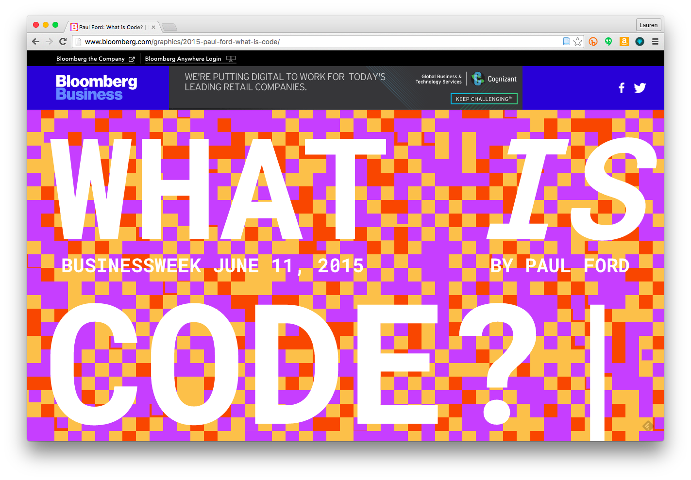
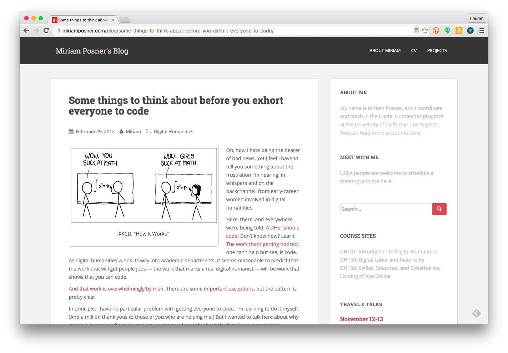
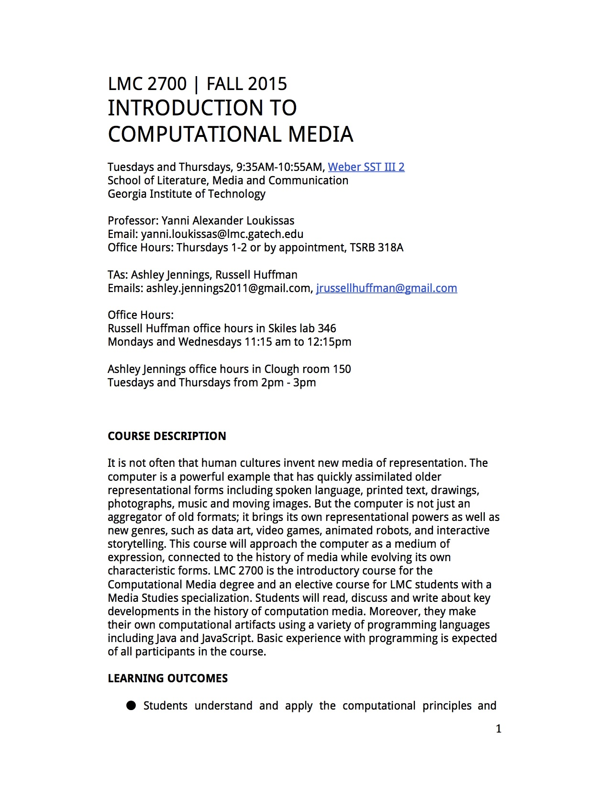
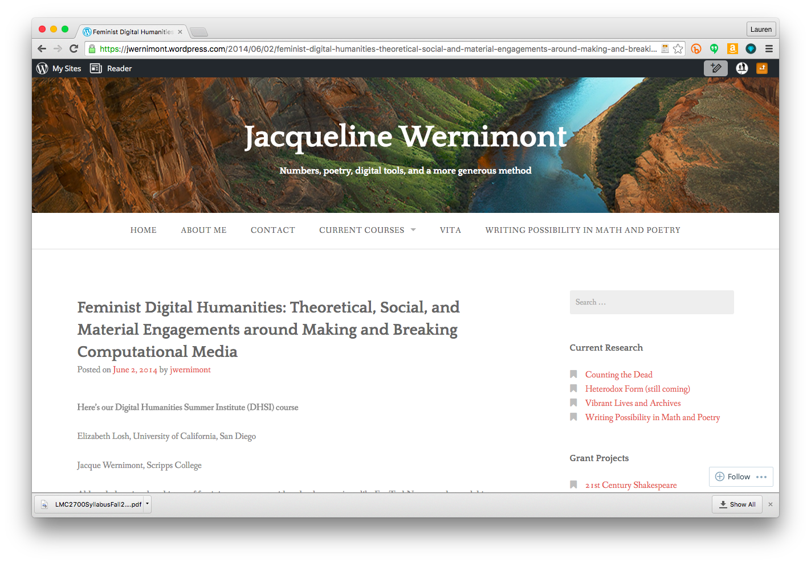
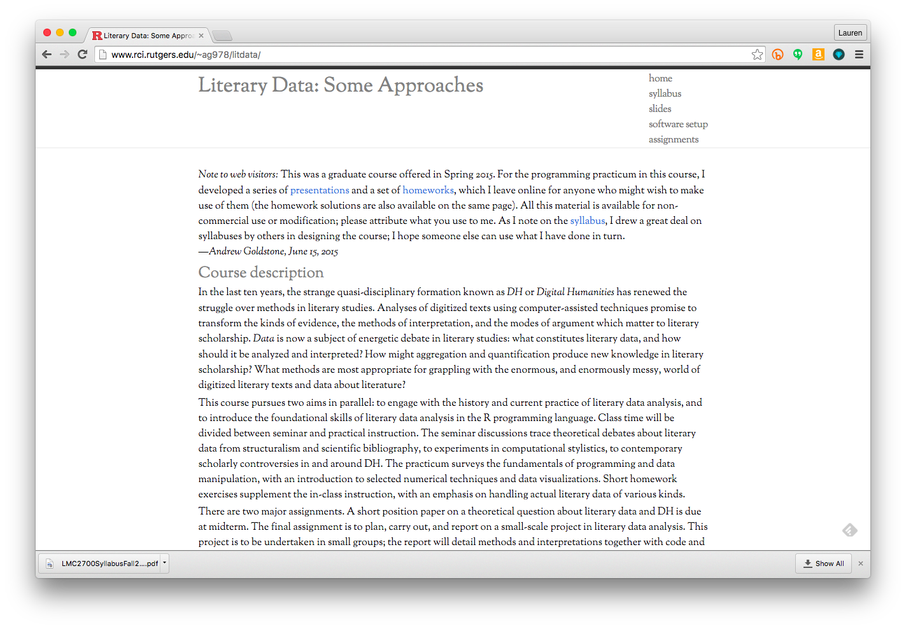
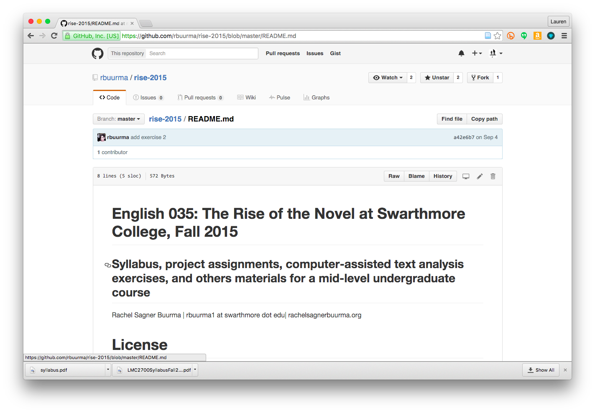
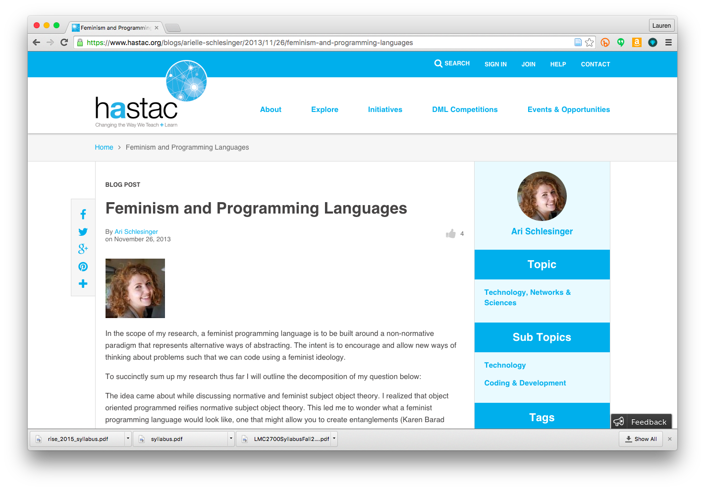
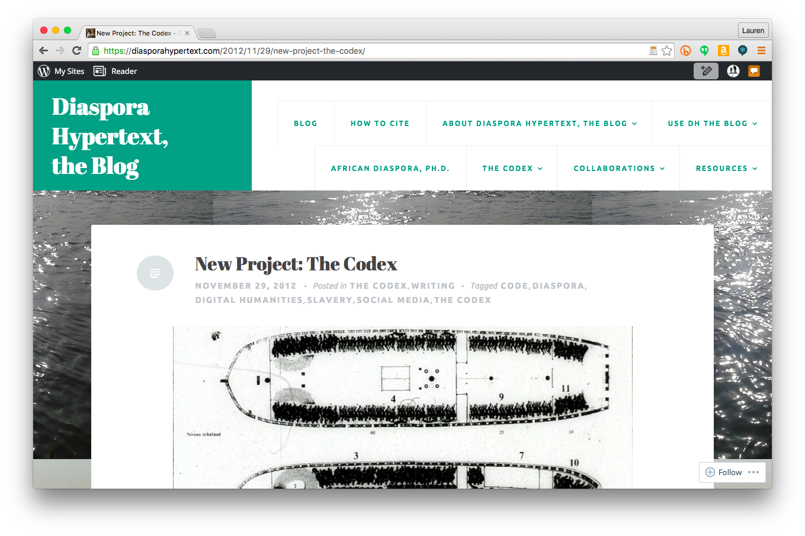
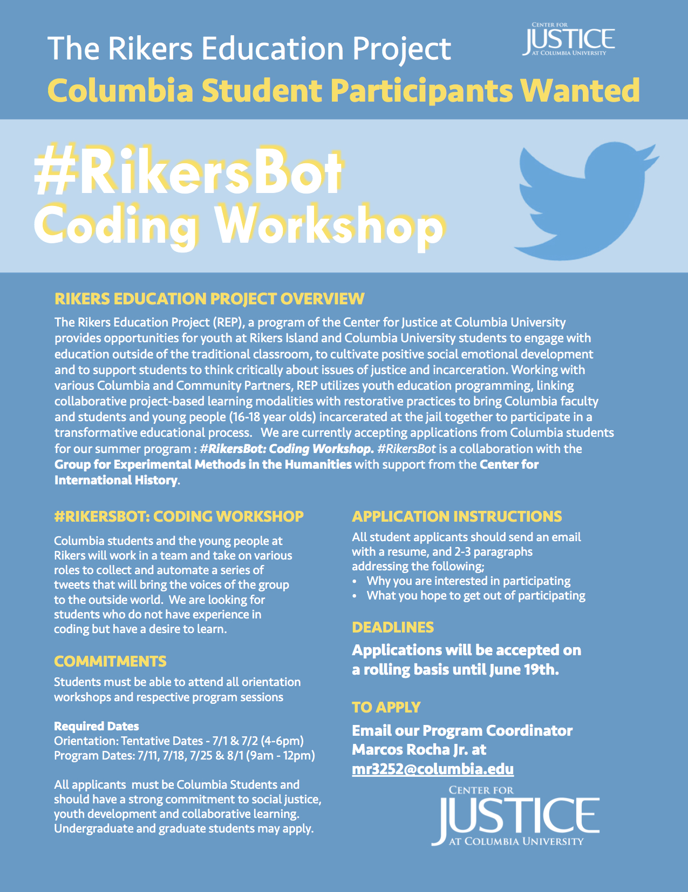
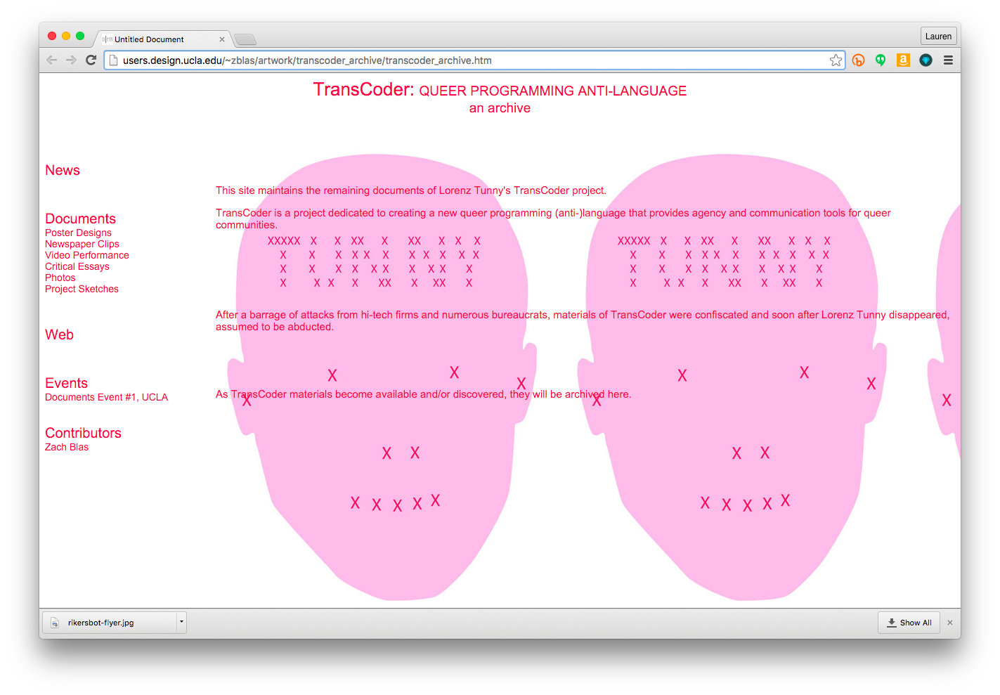

--- 
title: Digital Pedagogy in the Humanities
subtitle: Concepts, Models, and Experiments 
chapter: Code
URL: keywords/code.md
author: 
- family: Klein
  given: Lauren
editor: 
- family: Davis
  given: Rebecca Frost
publisher: Modern Language Association
type: book
---

# Code

### Lauren F. Klein
Georgia Institute of Technology | [http://lklein.com/](http://lklein.com/)

---

##### Publication Status:
* unreviewed draft
* draft version undergoing editorial review
* **draft version undergoing peer-to-peer review** https://digitalpedagogy.commons.mla.org/
* published 

--- 

## CURATORIAL STATEMENT 

Do humanities students need to know how to code? 

What was once [the central question in the digital humanities](http://stephenramsay.us/text/2011/01/11/on-building/) has become [a topic of national conversation](http://www.ed.gov/stem), as concerns about the United States “falling behind” other nations in technological innovation continue to mount (Ramsay; "Science" n.p.). Even President Obama has gone on the record in support of teaching programming at the elementary school level. “It’s got to be everybody,” [he told Re/code’s Kara Swisher](http://recode.net/2015/02/14/obama-everybodys-got-to-learn-how-to-code/). “Everybody’s got to learn how to code early... with the ABCs and the colors” (n.p.).  

A nation in which all students learn how to code in grade school is hardly a terrible thing. The real question, however, isn’t whether or not students should learn how to code; it’s what they should learn by doing so.

It follows, then, that any instructor—-in the humanities or otherwise-—must first ask herself what she hopes her students will accomplish by learning to code. Is it an understanding of how to think algorithmically, so as to better comprehend how certain tasks can be abstracted into a series of steps?  Is it a familiarity with the basic components of programming languages, so as to be able to understand how code is structured and produced? Is it the knowledge of a specialized programming language, one with specific applications in a particular field? Or is it the more experiential knowledge of what it *feels* like to move from defining functions and assigning variables to running executable code? 

These are only some of the many possible outcomes of a course centered on learning to code. But in the humanities, the question of what to teach students when learning to code carries additional pedagogical freight. What can the humanities contribute to the study of code that is not already taught in computer science departments? What *should* the humanities contribute? And, in turn, are there aspects of computer science training that can expand the bounds of what humanities pedagogy, more generally, entails? 

In my view, the study of code in the humanities—-and therefore its pedagogy—-entails a both/and proposition: it must demonstrate *both* theoretical rigor *and* technical expertise. Humanists are perhaps more familiar with how this combination plays out through the questions they ask *about* code—-for instance, how might the production of code be more directly linked to the social and cultural conditions of its making; or how might the practice of programming be made to better account for its political stakes. But a pedagogy of code in the humanities must also explore the intersection of the technical and the theoretical as expressed *in or through* code itself-—for instance, how might certain literary or cultural concepts be located in the structure or syntax of code; or how might code be employed to advance an argument, or otherwise perform humanistic critique. 

Pursuing a pedagogy of code that blends the technical with the theoretical (or the humanistic more generally) makes for a high standard, but it is one commensurate with the complexity of the challenges of twenty-first century life. From police violence to climate change, today’s most pressing concerns, [as Alan Liu reminds us](http://dhdebates.gc.cuny.edu/debates/text/20), are those in which culture, politics, economics, and technology are inextricably intertwined. What a humanistic pedagogy of code can do, then, is to show how software and its various supports-—human as well as material and computational-—are emblematic of this entanglement. Think of the [eighty-five million lines of Objective-C](http://stackoverflow.com/questions/580292/what-languages-are-windows-mac-os-x-and-linux-written-in), written by hundreds if not thousands of programmers, that comprise the Mac OS X operating system (Woolf); or the additional [five million lines of code](http://www.informationisbeautiful.net/visualizations/million-lines-of-code/) in the Google Chrome browser, that allow documents such as this to be displayed (McCandless)-—and that is to say nothing of the algorithms (and underlying business decisions) that determine which ads are displayed when navigating from Web page to Web page; or the numerous technologies, [developed over decades](http://www.computerhistory.org/internethistory/), that enable the transfer of data across the Web as a whole (Computer History Museum). By exposing how the technical and the humanistic converge in the objects and processes of our everyday lives, a both/and pedagogy of code might allow our global problems to be better understood, if not ever to be entirely resolved. 

The artifacts included here adhere to a fairly narrow definition of "code." As such, they show what can be learned from exercises that encourage students to ask questions *through* code as much as about it. Instructors seeking to incorporate these artifacts into more introductory courses should not be dissuaded. Rather, they might consider a longer unit on coding, [beginning with basic principles](http://www.slideshare.net/jcmeloni/introduction-to-programming-well-kind-of), and working towards one of the assignments included below (Meloni). These projects are intended to suggest several possible directions for a more sustained humanities pedagogy of code, one that will only gain in significance as our reliance on code continues to grow. 

## CURATED ARTIFACTS 

#### “What is Code?”

* Artifact Type: Magazine article
* Source URL: [http://www.bloomberg.com/graphics/2015-paul-ford-what-is-code/](http://www.bloomberg.com/graphics/2015-paul-ford-what-is-code/) 
* Artifact Permissions: Article text is licensed under the Creative Commons Attribution-NonCommercial-NoDerivatives 4.0 International license. Embedded graphics and other interactive bits are variously licensed.  
* Copy of the Artifact: Article text is [available on Github](https://github.com/BloombergMedia/whatiscode). 
* Creator and Affiliation: [Paul Ford](http://www.ftrain.com/) and [contributors](https://makerbase.co/p/15js4s/whatiscode), Bloomberg Businessweek 

Businessweek might seem like a paradoxical starting point for a set of resources intended to explore humanistic approaches to code, but Paul Ford's extended exegesis on the meaning of code presents a surprisingly legible overview of how code works, how code is written, and how code is deployed in a range of settings. Embedded in "What is Code?" are a variety of interactive elements-- simulations of circuitry and signal processing, and visualizations of data structures and algorithms, to name only a few-- each of which might be pulled out to enhance a classroom exercise. Students might also be encouraged to consider the implications of the article's placement in a magazine owned by Bloomberg, and what that says about the current media climate, about the power of the finance industry, and about how both relate more closely than one might expect to the long history of computation and code.  

#### “Some Things to Think about before You Exhort Everyone to Code”

* Artifact Type: Blog post
* Source URL: [http://miriamposner.com/blog/some-things-to-think-about-before-you-exhort-everyone-to-code/](http://miriamposner.com/blog/some-things-to-think-about-before-you-exhort-everyone-to-code/) 
* Artifact Permissions: CC BY-NC-SA 3.0 US
* Creator and Affiliation: [Miriam Posner](http://www.miriamposner.com), UCLA 

“Some Things to Think about before You Exhort Everyone to Code,” Miriam Posner's pointed critique of unrestrained learn-to-code boosterism, is essential reading for anyone engaged in a project involving the teaching or learning of code. With references to scientific and sociological studies as well as more concrete examples, Posner clearly identifies the cultural biases and other structural inequalities that preclude a pedagogy of code from unfolding on an equal plane. Rather than act as a deterrent, however, Posner's post should encourage us to envision alternate pedagogical practices that might better account for the full range of student experience. Whether by [rethinking what we teach when we teach students to code](http://earsketch.gatech.edu/landing/) (Freeman et al.), [reimagining how we teach when we teach students to code](http://miriamposner.com/blog/a-better-way-to-teach-technical-skills-to-a-group/) (Posner, "Better"), or [reframing the task of learning to code from the ground up](http://thecomputerboys.com/) (Ensmenger), we can each work towards a more inclusive pedagogical model.
	
#### “Introduction to Computational Media”

* Artifact Type: Syllabus
* Source URL: [https://docs.google.com/document/d/1I2XUqH7d_JDLe3abZglKYnHXd7kgE-ip9qW9Geg689Y/edit](https://docs.google.com/document/d/1I2XUqH7d_JDLe3abZglKYnHXd7kgE-ip9qW9Geg689Y/edit) 
* Artifact Permissions: CC-BY-NC
* Creator and Affiliation: [Yanni Loukissas](http://yloukissas.com/), Georgia Institute of Technology

This syllabus, created by Yanni Loukissas, documents the required introductory course in Georgia Tech's [Computational Media](http://cm.lmc.gatech.edu/) major. The major is designed with a "both/and" pedagogy of code in mind; students take courses in both computer science and the humanities so as to develop a deep and nuanced understanding of the computer as a medium. "Introduction to Computational Media" represents the students' first exposure to this synthesis, and as such, asks students to explore the history and theory of computation through a series of six focused projects. Each employs a different programming language, and each to a different end--among them, a data visualization, a narrative bot, or a procedural poem. Any one of these projects might be incorporated into another course as a capstone element, but the syllabus is most valuable as a whole, for how it leads students towards a syncretic understanding of the computer as an expressive form.  
	
#### “Feminist Digital Humanities”

* Artifact Type: Syllabus
* Source URL: [https://jwernimont.wordpress.com/2014/06/02/feminist-digital-humanities-theoretical-social-and-material-engagements-around-making-and-breaking-computational-media/](https://jwernimont.wordpress.com/2014/06/02/feminist-digital-humanities-theoretical-social-and-material-engagements-around-making-and-breaking-computational-media/) 
* Artifact Permissions: Creative Commons Attribution-NonCommercial-ShareAlike 4.0 International
* Creator and Affiliation: [Jacqueline Wernimont](https://jwernimont.wordpress.com/), Arizona State University, and [Elizabeth Losh](http://losh.ucsd.edu/), College of William and Mary 

This syllabus, created by Jacqueline Wernimont and Elizabeth Losh for a summer course on Feminist Digital Humanities at the [Digital Humanities Summer Institute](http://www.dhsi.org/), provides a second example of how the study of code can bring together technical knowledge with theoretical concerns. Wernimont and Losh employ feminism as both object and method of inquiry, exploring a range of examples of feminist engagements with technology, from video games to digital archives, through an intersectional feminist pedagogical approach. The more conceptually-focused nature of this course demonstrates how students can emerge with a clear sense of how a particular theoretical orientation can be expressed in and through code. In adapting this course for future use, one might consider how other major theoretical schools, such as queer or postcolonial theory, might similarly (or dissimilarly) find expression through the structure of a course, its objects of study, and its methods of inquiry.

#### “Literary Data: Some Approaches”

* Artifact Type: Course website
* Source URL: [http://www.rci.rutgers.edu/~ag978/litdata/](http://www.rci.rutgers.edu/~ag978/litdata/) 
* Artifact Permissions: Creative Commons Attribution-NonCommercial 4.0 International 
* Copy of the Artifact: [syllabus only](files/code-litdata.pdf)
* Creator and Affiliation: [Andrew Goldstone](http://andrewgoldstone.com/), Rutgers University

Andrew Goldstone's syllabus for a graduate course on literary data is explicit about its dual aims: "to engage with the history and current practice of literary data analysis, and to introduce the foundational skills of literary data analysis in the R programming language." Through readings on the history and theory of data, coupled with programming exercises designed to introduce students to basic computational operations and constructs, Goldstone provides a model for how students might apply computational methods to humanistic research questions with historical, theoretical, and technical considerations in mind. Its focus on literary data functions as a valuable illustration of how a disciplinary focus can lead to greater depth of understanding; and its hybrid class structure might present a model for how to teach programming in the context of a humanities seminar.

#### “The Rise of the Novel”

* Artifact Type: Course repository
* Source URL: [https://github.com/rbuurma/rise-2015](https://github.com/rbuurma/rise-2015) 
* Artifact Permissions: Creative Commons Attribution 4.0 International License
* Creator and Affiliation: Rachel Buurma, Swarthmore College

The Github repository that documents Rachel Buurma's digitally-inflected literature course, "The Rise of the Novel," provides an additional example of how a focused humanistic research interest might be explored through computational techniques. Here, Buurma focuses on questions of realism as they relate to the rise of the novel, incorporating exercises that make use of software libraries that assist in various distant reading techniques. Buurma's course design demonstrates how such exercises might be framed conceptually, and anchored in specific texts--evidently to much success. (Student responses to the exercises are [documented on the course blog](http://rise2015.rachelsagnerbuurma.org/) (Buurma, "Rise"). When adapting this model for use in other contexts, one must consider *in advance* what types of questions are best suited to specific computational techniques, and what specific objects of inquiry--textual or otherwise--might serve as the best source for their application. 
	
#### “Feminism and Programming Languages”

* Artifact Type: Blog post
* Source URL: [https://www.hastac.org/blogs/arielle-schlesinger/2013/11/26/feminism-and-programming-languages](https://www.hastac.org/blogs/arielle-schlesinger/2013/11/26/feminism-and-programming-languages) 
* Artifact Permissions: Creative Commons Attribution-NonCommercial-ShareAlike 3.0 
* Creator and Affiliation: [Ari Schlesinger](http://arischlesinger.com/), Georgia Institute of Technology

This student blog post on [HASTAC](https://www.hastac.org/), which documents the early phases of an undergraduate thesis project, demonstrates how a deceptively simple question--"What is a feminist programming language?--can function as an entry point into a deep discussion reliant on both technical and theoretical knowledge. Such discussions are incredibly generative, and ones with which "programming humanists," [to borrow a descriptor from Tara McPherson](http://dhdebates.gc.cuny.edu/debates/text/29), are uniquely positioned to engage (n.p.). This particular post also demonstrates, albeit inadvertently, the political charge with which many humanistic investigations into the nature of code are met; the post was picked up on Reddit, and the student became the subject of significant online harassment. Although those invested in digital pedagogy tend to align themselves with public-facing student work, this example also illustrates the importance of anticipating any potentially negative or hateful feedback for which students (or their professors) may be unprepared.   

#### “The Codex”

* Artifact Type: Digital project
* Source URL: [http://diasporahypertext.com/2012/11/29/new-project-the-codex/](http://diasporahypertext.com/2012/11/29/new-project-the-codex/) 
* Artifact Permissions: Creative Commons Attribution-NonCommercial-ShareAlike 3.0 Unported License
* Creator and Affiliation: [Jessica Marie Johnson](http://jmjohnso.com/), Johns Hopkins University 

"The Codex" was described by its creator, Jessica Marie Johnson, as an "attempt to process Atlantic slavery through application, code, and screen" (n.p.). It consisted of three digital "volumes," each presented in the form of a Tumblr; only one of the volumes, [African Diaspora Ph.D.](http://africandiasporaphd.tumblr.com/) remains live. Here, Johnson employs Tumblr rhetorically, using it to counter the dehumanizing effects of the formal records of the Atlantic slave trade with what she terms "diaspora catalogs" ("Codex," n.p.) (A recent [special issue of *The Black Scholar* on Black Code](http://www.theblackscholar.org/now-available-black-code/) elaborates upon the idea of alternative structuring logics). Johnson's Tumblr could be contextualized by [her introduction to the special issue](http://www.tandfonline.com.prx.library.gatech.edu/doi/full/10.1080/00064246.2017.1329608) (co-authored with Mark Anthony Neal). Students might also be encouraged to create their own "diaspora catalogs," or to consider how other constructs that have been challenged in terms of hierarchy, structure, and control, might lend themselves to a Tumblr-based critique. 

#### “Rikers Bot”

* Artifact Type: Collaborative project
* Source URL: [http://xpmethod.plaintext.in/public-discourse/rikersbot.html](http://xpmethod.plaintext.in/public-discourse/rikersbot.html) 
* Artifact Permissions: GNU GPL 
* Creator and Affiliation: Manan Ahmed, Zeinab Aina, Thomas Brown III, Marjana Chowdhury, Andi Dixon, Janine Ko, Katarzyna Kaczowka, Desmond Patton, Cameron Rasmussen, Dennis Yi Tenen, and the Young People at Rikers.

Rikers Bot names an ongoing project on the part of Columbia's [Group for Experimental Methods in the Humanities](http://xpmethod.plaintext.in/) to teach programming workshops at the Rikers Island Correctional Facility, and the output of the project: a Twitter bot that tells the story of the young adults incarcerated there. As such, it speaks both to the utility of learning to code (as part of the workshop, participants are trained in how to present the project in future job interviews) and to the argumentative force of a bot (forcibly disconnected from the outside world, the inmates require a bot to speak for them). Rikers Bot remains complicated, but in its engagement in the world, and in its attempt to introduce a humanistic overlay onto the teaching and learning of code, it marks a move towards social justice and civic engagement that the field would do well to more fully engage. 

#### “TransCoder: Queer Programming Anti-Language”

* Artifact Type: Project website
* Source URL: [http://users.design.ucla.edu/~zblas/artwork/transcoder_archive/transcoder_archive.htm](http://users.design.ucla.edu/~zblas/artwork/transcoder_archive/transcoder_archive.htm) 
* Artifact Permissions: NEED
* Creator and Affiliation: [Zach Blas](http://www.zachblas.info/), Goldsmiths, University of London. 

Moving from the lived conditions of incarceration to the realm of conceptual art, Zach Blas's TransCoder project, a "queer programming anti-language," provides an example of how theory can be expressed in and through code (n.p.). Styling his project in the tradition of an [esolang](http://esoteric.codes/post/105355658088/esolangs-as-an-experiential-practice), Blas defines a set of basic computational functions that, if implemented, would constitute a programming language that procedurally represents the major concepts of queer theory. (See [his interview with Jacob Gaboury](https://rhizome.org/editorial/2010/aug/18/interview-with-zach-blas/) for a more extended discussion). As a design for, rather than an implementation of a programming language, Blas also models how speculative design can function as a valuable pedagogical method. Asking students to envision rather than implement a computational artifact might open additional creative possibilities for the study of code, as well as invite broader participation. 

## RELATED MATERIALS

Marino, Mark C. "Critical Code Studies." *electronic book review*. 4 December 2006. Web.
[http://www.electronicbookreview.com/thread/electropoetics/codology](http://www.electronicbookreview.com/thread/electropoetics/codology)

Mateas, Michael. "Procedural Literacy: Educating the New Media Practitioner." *Beyond Fun: Serious Games and Media,* ed. Drew Davidson. Pittsburgh: Carnegie Mellon-ETC P, 2008. 80-96. Print. [http://press.etc.cmu.edu/files/BeyondFun-DrewDavidson-etal-web.pdf](http://press.etc.cmu.edu/files/BeyondFun-DrewDavidson-etal-web.pdf) 

Montfort, Nick. *Exploratory Programming for the Arts and Humanities.* Boston: MIT Press, 2016. Print. [https://mitpress.mit.edu/books/exploratory-programming-arts-and-humanities](https://mitpress.mit.edu/books/exploratory-programming-arts-and-humanities)

Nowviskie, Bethany et al. "Speaking in Code: Bibliography." *Scholars's Lab Codespeak Kit.* 1 July 2014. Web.
[https://github.com/scholarslab/codespeakkit/blob/master/bibliography.md](https://github.com/scholarslab/codespeakkit/blob/master/bibliography.md)

*The Programming Historian.* 2017. Web. [https://programminghistorian.org/](https://programminghistorian.org/)

## WORKS CITED

Ahmed, Manan, Zeinab Aina, Thomas Brown III, et al., "Rikers Bot." *Columbia's Group for Experimental Methods in the Humanities* n.d. Web. [http://xpmethod.plaintext.in/public-discourse/rikersbot.html](http://xpmethod.plaintext.in/public-discourse/rikersbot.html)

The Black Scholar, "Now Available: Black Code." 14 August 2017. Web. [http://www.theblackscholar.org/now-available-black-code/](http://www.theblackscholar.org/now-available-black-code/)

Blas, Zach. "TransCoder: A Queer Programming Anti-Language." n.d. Web. [http://users.design.ucla.edu/~zblas/artwork/transcoder_archive/transcoder_archive.htm](http://users.design.ucla.edu/~zblas/artwork/transcoder_archive/transcoder_archive.htm)

Buurma, Rachel. "The Rise of the Novel" (Github repository). n.d. Web. [https://github.com/rbuurma/rise-2015](https://github.com/rbuurma/rise-2015)

Buurma, Rachel. "The Rise of the Novel" (Course blog). n.d. Web. [http://rise2015.rachelsagnerbuurma.org/](http://rise2015.rachelsagnerbuurma.org/)

Computer History Museum. "Internet History, 1962-1992." n.d. Web. [http://www.computerhistory.org/internethistory/](http://www.computerhistory.org/internethistory/)

"Computational Media." n.d. Web. [http://cm.lmc.gatech.edu](http://cm.lmc.gatech.edu)

"Digital Humanities Summer Institute." n.d. Web. [http://www.dhsi.org/](http://www.dhsi.org/)

Gaboury, Jacob. "Interview with Zach Blas." *Rhizome*. 18 August 2010. Web. [https://rhizome.org/editorial/2010/aug/18/interview-with-zach-blas/](https://rhizome.org/editorial/2010/aug/18/interview-with-zach-blas/)

Ensmenger, Nathan. *The Computer Boys Take Over.* Cambridge: The MIT Press, 2010. Print. [http://thecomputerboys.com/](http://thecomputerboys.com/)

Ford, Paul. "What is Code?" *Businessweek*. 11 June 2015. Web. [http://www.bloomberg.com/graphics/2015-paul-ford-what-is-code/](http://www.bloomberg.com/graphics/2015-paul-ford-what-is-code/)

Freeman, Jason, Brian Magerko, Douglas Edwards, et al., "Earsketch." n.d. Web. [http://earsketch.gatech.edu/landing/](http://earsketch.gatech.edu/landing/)

Goldstone, Andrew. "Literary Data: Some Approaches." n.d. Web. [http://www.rci.rutgers.edu/~ag978/litdata/](http://www.rci.rutgers.edu/~ag978/litdata/)

"HASTAC." n.d. Web. [http://www.hastac.org](http://www.hastac.org)

Johnson, Jessica Marie. "African Diaspora Ph.D." n.d. Web. [http://africandiasporaphd.tumblr.com/](http://africandiasporaphd.tumblr.com/)

Johnson, Jessica Marie. "The Codex." n.d. Web. [http://diasporahypertext.com/2012/11/29/new-project-the-codex/](http://diasporahypertext.com/2012/11/29/new-project-the-codex/)

Johnson, Jessica Marie and Mark Anthony Neal. ["Introduction: Wild Seed in the Machine."](http://www.tandfonline.com/doi/full/10.1080/00064246.2017.1329608) *The Black Scholar* 47.3 (2017): 1-2.

Liu, Alan. "Where is Cultural Criticism in the Digital Humanities?" *Debates in the Digital Humanities*. Ed. Matthew K. Gold. Minneapolis: U of Minnesota P, 2012. Web. [http://dhdebates.gc.cuny.edu/debates/text/20](http://dhdebates.gc.cuny.edu/debates/text/20)

Loukissas, Yanni. "Introduction to Computational Media." n.d. Web. [https://docs.google.com/document/d/1I2XUqH7d_JDLe3abZglKYnHXd7kgE-ip9qW9Geg689Y/edit](https://docs.google.com/document/d/1I2XUqH7d_JDLe3abZglKYnHXd7kgE-ip9qW9Geg689Y/edit)

McCandless, David. "Codebases: Millions of Lines of Code" n.d. Web. [http://www.informationisbeautiful.net/visualizations/million-lines-of-code/](http://www.informationisbeautiful.net/visualizations/million-lines-of-code/) 

McPherson, Tara. "Why are the Digital Humanities So White? or Thinking the Histories of Race and Computing" *Debates in the Digital Humanities*. Ed. Matthew K. Gold. Minneapolis: U of Minnesota P, 2012. Web. [http://dhdebates.gc.cuny.edu/debates/text/29](http://dhdebates.gc.cuny.edu/debates/text/29)

Meloni, Julie. "Introduction to Programming (well, kind of.)" n.d. Web. [http://www.slideshare.net/jcmeloni/introduction-to-programming-well-kind-of](http://www.slideshare.net/jcmeloni/introduction-to-programming-well-kind-of)

Posner, Miriam. "Some things to think about before you exhort everyone to code." 29 February 2012. Web. [http://miriamposner.com/blog/some-things-to-think-about-before-you-exhort-everyone-to-code/](http://miriamposner.com/blog/some-things-to-think-about-before-you-exhort-everyone-to-code/)

Posner, Miriam. "A better way to teach technical skills to a group." 9 December 2015. Web. [http://miriamposner.com/blog/a-better-way-to-teach-technical-skills-to-a-group/](http://miriamposner.com/blog/a-better-way-to-teach-technical-skills-to-a-group/)

*The Programming Historian.* n.d. Web. [http://programminghistorian.org/](http://programminghistorian.org/)

Ramsay, Stephen. "On Building." 11 January 2011. Web. [http://stephenramsay.us/text/2011/01/11/on-building/](http://stephenramsay.us/text/2011/01/11/on-building/)

Schlesinger, Arielle. "Feminism and Programming Languages." *HASTAC.* 26 November 2013. Web. [https://www.hastac.org/blogs/arielle-schlesinger/2013/11/26/feminism-and-programming-languages](https://www.hastac.org/blogs/arielle-schlesinger/2013/11/26/feminism-and-programming-languages)

"Science, Technology, Engineering, and Math: Education for Global Leadership." n.d. Web. [http://www.ed.gov/stem](http://www.ed.gov/stem)

Swisher, Kara. "Obama: The Re/Code Interview." n.d. Web. [http://recode.net/2015/02/14/obama-everybodys-got-to-learn-how-to-code/](http://recode.net/2015/02/14/obama-everybodys-got-to-learn-how-to-code/)

Temkin, Daniel. "Esolangs as an Experiential Practice." 16 December 2014. Web. [http://esoteric.codes/post/105355658088/esolangs-as-an-experiential-practice](http://esoteric.codes/post/105355658088/esolangs-as-an-experiential-practice)

Wernimont, Jacque and Elizabeth Losh. "Feminist Digital Humanities: Theoretical, Social, and Material Engagements around Making and Breaking Computational Media." 2 June 2014. Web. [https://jwernimont.wordpress.com/2014/06/02/feminist-digital-humanities-theoretical-social-and-material-engagements-around-making-and-breaking-computational-media/](https://jwernimont.wordpress.com/2014/06/02/feminist-digital-humanities-theoretical-social-and-material-engagements-around-making-and-breaking-computational-media/)

Woolf, Brock. "What Languages are Windows, Mac OS X, and Linux written in?" n.d. Web. [http://stackoverflow.com/questions/580292/what-languages-are-windows-mac-os-x-and-linux-written-in](http://stackoverflow.com/questions/580292/what-languages-are-windows-mac-os-x-and-linux-written-in)
