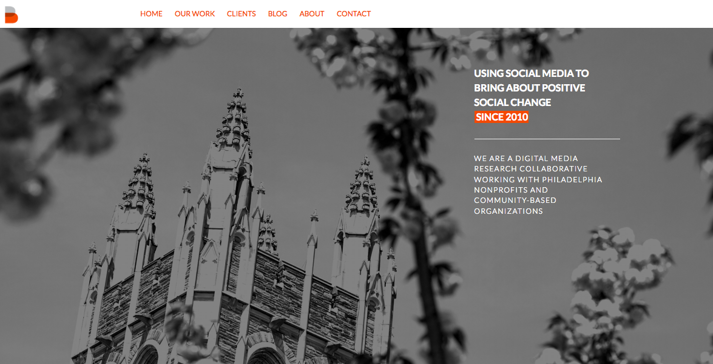
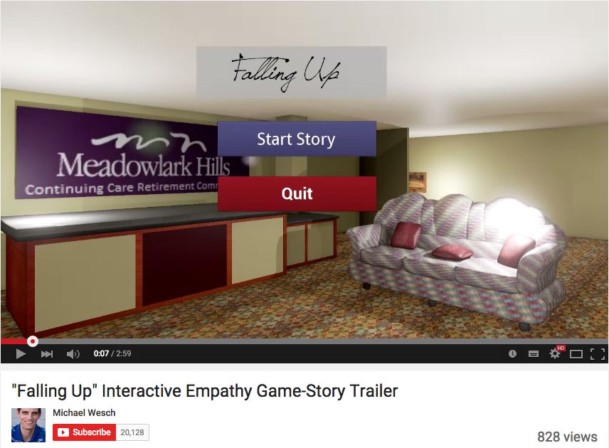
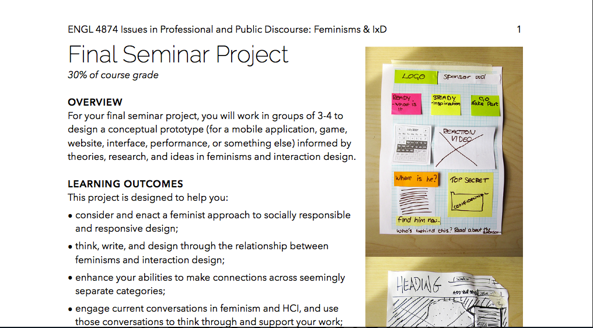
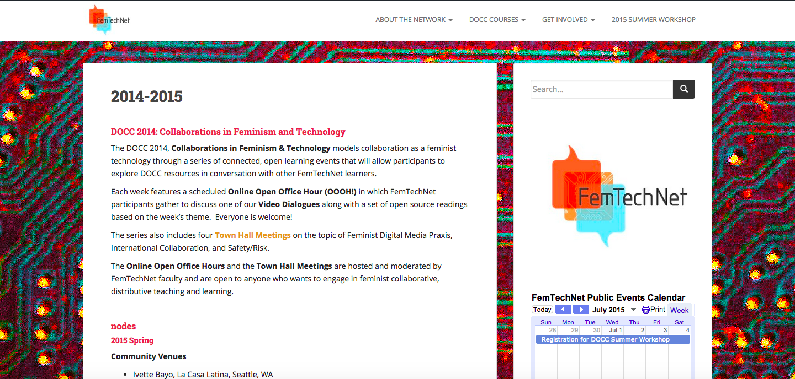
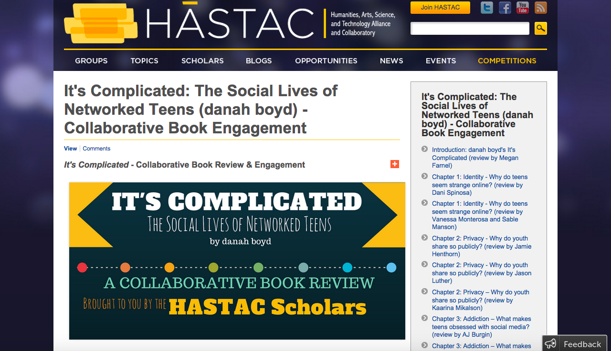
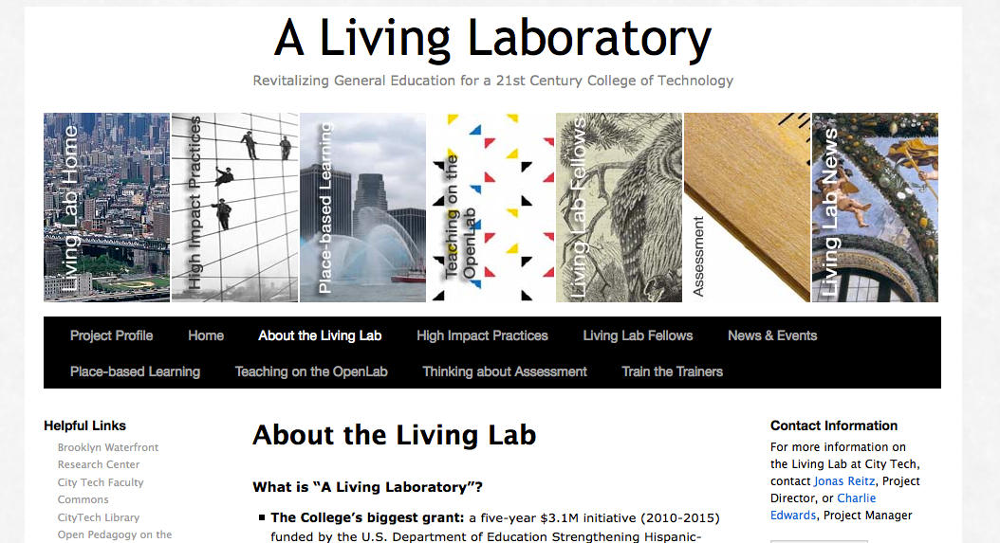
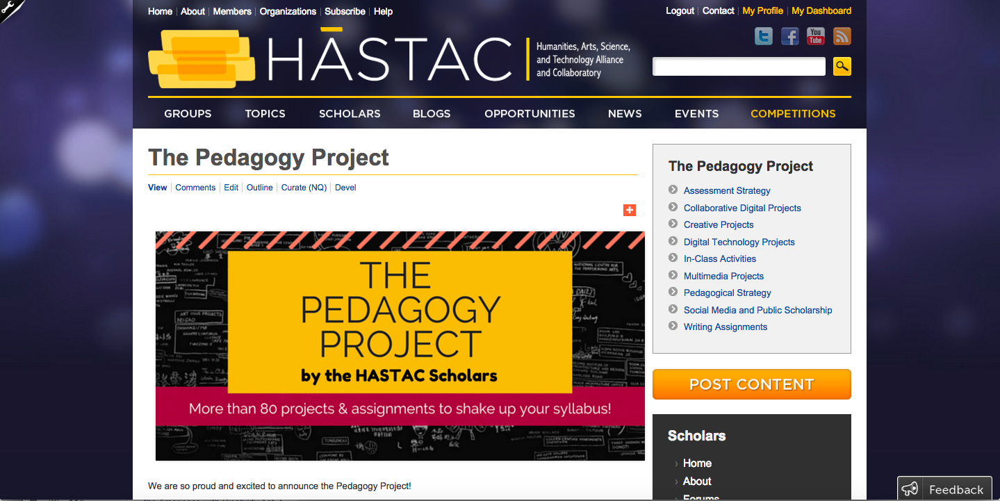
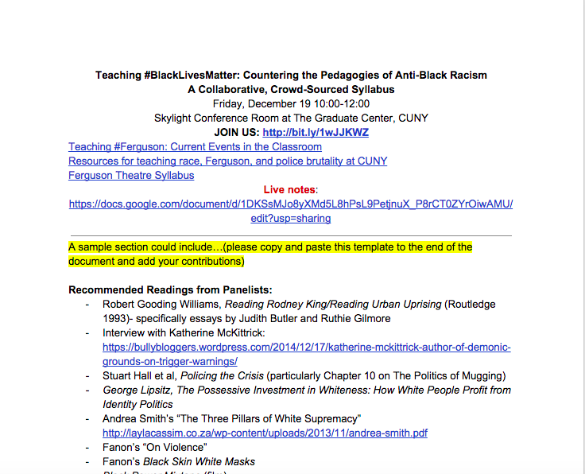

# **Collaboration**

## Amanda Licastro

**Stevenson University | [cuny.is/digitocentrism](http://cuny.is/digitocentrism)**

## Katina Rogers

**The Graduate Center, CUNY | [katinarogers.com](http://katinarogers.com/bio)**

## Danica Savonick

**The Graduate Center, CUNY | [danicasavonick.com](http://danicasavonick.com)**

* * *

##### **Publication Status:**

* unreviewed draft

* draft version undergoing editorial review
* **draft version undergoing peer-to-peer review https://digitalpedagogy.commons.mla.org/**

* published

## CURATORIAL STATEMENT 

In research, writing, and teaching, ideas build on countless others, weaving a complex network of influences. Collaborative work foregrounds this network, celebrating the value that many hands bring to a project. It includes diverse perspectives, flips the dichotomy of expert and novice, and explores alternative ideas—something Cathy Davidson, co-founder of the [HASTAC](http://www.hastac.org/) network, articulates as "[collaboration by difference](https://www.youtube.com/watch?v=zk8mvIYaO3w)". No matter what form collaboration takes—whether crowd-sourced projects, co-authored research, networked learning, or building and gaming—it depends on difference. 

Collaboration by difference is especially valuable in classroom environments. Julia Gergits and James Schramer note that "fruitful collaboration often starts with the recognition that difference is essential if a group wishes to generate truly original ideas" ([190](http://www.jaconlinejournal.com/archives/vol14.1/gergits-collaborative.pdf)). According to Andrea Lunsford and Lisa Ede, assignments that are labor-intensive,  require multiple areas of expertise, or involve synthesis of divergent perspectives are best suited to collaboration (*Singular* 123). These can range from low-stakes, informal, in-class activities to larger long-term projects.

Teaching with an emphasis on collaboration enables the instructor to function less as what Rancière calls a "master explicator" (11) and more as a facilitator. Collaborative pedagogy is closely related to student-centered pedagogy, in which students take greater ownership over learning. Kenneth Bruffee argues that collaborative learning does not negate the space for lecture, but shifts authority so that students learn from their peers as well as the instructor. Collaborative learning environments create “transition communities or support groups that students can rely on as they go through the risky process of becoming new members of the knowledge communities” [(8](http://www.amazon.com/Collaborative-Learning-Education-Interdependence-Authority/dp/0801852323/ref=sr_1_1?s=books&ie=UTF8&qid=1436799019&sr=1-1&keywords=9780801852329#reader_0801852323)).  

As educators ourselves, we integrate these approaches into our courses. For example, Danica Savonick structures [courses](http://www.hastac.org/blogs/danicasavonick/2015/05/18/%E2%80%9Cintroduction-narrative%E2%80%9D-collaborative-experimental-intellectual-adv) around student-centered learning, public writing, and low-stakes group assignments, all leading up to a collaborative, digital, public research project, which students evaluate after designing a rubric. Amanda Licastro scaffolds digital projects into writing courses by adding new tools and techniques slowly throughout the semester. Students begin by posting provocations to a [course blog](https://wp.nyu.edu/licastro_fall14/), sharing "[Digital Literacy Timelines](https://wp.nyu.edu/licastro_fall14/tag/timeline/)," [live-tweeting](https://wp.nyu.edu/licastro_fall14/tag/atwood/) their readings, collectively annotating texts, and posting drafts for peer review. This leads to a collaborative [“Design Fiction](https://wp.nyu.edu/licastro_fall14/category/final_projects/)” project (based on Kari Kraus’s [Bibliocircuitry](http://www.karikraus.com/?p=334) project) in which students design a new reading or writing technology by pitching ideas, voting on proposals, creating group contracts, and executing a prototype together. 

Whether in the classroom or beyond, digital tools can streamline collaboration. Videoconferencing makes it simple for classes discussing similar or complementary topics to connect. Open-source tools like [Commons In A Box](http://commonsinabox.org/), [Omeka](https://www.omeka.net/), [Neatline](http://neatline.org/), [Zotero](https://www.zotero.org/), [Voyant](http://voyant-tools.org/), and others allow scholars to share their work, build on one another's ideas, and leverage different strengths to create projects that are as insightful as they are beautiful. Still, there is nothing magical about the ways tools like these enable people to work together. Some of the most effective collaboration techniques involve nothing more sophisticated than [note cards and pencils](http://www.hastac.org/blogs/cathy-davidson/2012/04/08/single-best-free-way-transform-classroom).

Learning how to work together across differences is essential training for engaged citizenship and a robust democratic society, and is also critical in the professional environments that students will enter after earning their degrees. Teaching collaborative skills in the scaffolded environment of the classroom, then, makes sense not only in terms of improving students' learning outcomes, but also to equip them to succeed beyond the classroom. Educators are increasingly using this pedagogical practice to connect students to broader communities through projects that extend beyond the university to pair with local community-based organizations. 

Evaluating collaborative work can be a significant challenge when working within dominant, individualistic models of knowledge production. Collaboration can also make people feel uncomfortable, as it requires relinquishing control over a project. As Lunsford and Ede note, "collaborative writing offers a strong potential challenge to the hegemony of a single, originary authorship and intellectual property and thus presents a series of challenges to higher education in general and to the teaching of writing in particular" (*Writing* 160). If collaborative scholarship is to thrive, then formal reward structures (such as assignment grading, the dissertation evaluation process, and tenure and promotion) must recognize and appropriately reward that work. The examples we've included model successful ways to design, facilitate, and evaluate generative collaborative experiences.

In curating this section, we pay particular attention to resources that exemplify certain values: 

* **Diversity.** Since collaboration by difference relies on the inclusion of a variety of voices and perspectives, we sought to include projects that foreground feminist, anti-racist, queer, decolonial, or interdisciplinary epistemologies and methodologies, and/or by including collaborators that embody diversity of race, ethnicity, gender, background, and discipline.

* **Equality.** As much as possible, we worked to include non-proprietary digital projects that ensure the broadest possible access, and that give fair credit to each collaborator.

* **Student-Centered Ethos.** While not all of the projects we feature are student-created, they all give special value to the importance of teaching and learning, and the role of the student in shaping their own educational experience.

* **Creativity.** We paid special attention to projects that try something new, beautiful, or risky, thereby sparking new insights and advancing a field.

We hope that these resources will inspire educators to experiment with collaborative pedagogy, and explore its potential to bring about a more just, equitable, and pleasurable future. 

## CURATED ARTIFACTS

### [B-Social](http://beautifulsocial.org/) 

- Type: a Digital Research Collaborative at St. Joseph's University
- Source: http://beautifulsocial.org/
- Copy of artifact: 
- Artifact Permissions: Permission granted by Aimée Knight
- Creator: Aimée Knight
- Affiliation: St. Joseph's University
- Screenshot: images/collaboration_BSocial.png

Directed by Aimée Knight, assistant professor in the Department of Communication Studies, "Beautiful Social" pairs students with local non-profit organizations in inner-city Philadelphia to provide consulting, training, multimedia production, and community research. Students learn about the mission of each community group and design social media resources for the organizations. In “[Into the Wild: when students consult with nonprofits](https://medium.com/@aimeeknight/into-the-wild-when-students-consult-with-nonprofits-ac130578bb54)” Knight writes, “[w]hile working with[ B-Social](http://beautifulsocial.org/) research collaborative we learn how to take social media beyond the personal, beyond entertainment and into places for activism and social change. Working with nonprofits with purpose-driven missions shows us how social media can help make a difference in the world.”

### "Digital Labor, Urban Space, and Materiality"

- Type: Assignment 
- Source:  [http://digitalmateriallabor.org/final-project/](http://digitalmateriallabor.org/final-project/) 
- Copy of artifact: artifact-copies/collaboration_posner_DigitalLabor.pdf 
- Artifact Permissions: Creative Commons license 
- Creator: Miriam Posner
- Affiliation: UCLA
- Screenshot: images/collaboration_posner_DigitalLabor.png 

In [Digital Humanities 150](http://digitalmateriallabor.org/) at UCLA, Professor Miriam Posner asks students to critique the labor and materiality of digital devices already in production. The “device narratives” project is an online publication in which each device featured is a “chapter” written collaboratively by groups of students in the course.  These digital texts include maps, photographs, video, and other media hosted on a WordPress site (using the now-defunct ScrollKit). The structure and key concepts of this project are easily adaptable for any undergraduate or graduate course that focuses on research, writing, and digital literacy. 

### Falling Up

- Type: Final Project Assignment
- Source: [https://www.youtube.com/watch?v=BFuluIy-5QY](https://www.youtube.com/watch?v=BFuluIy-5QY) 
- Copy of artifact:
- Artifact Permissions: Standard YouTube license; permission granted by Mike Wesch
- Creator: Mike Wesch 
- Affiliation: Kansas State University
- Screenshot: images/collaboration_wesch_falling-up.png

Students in Mike Wesch’s "Digital Ethnography" courses move out of the dormitories at Kansas State University and into Meadowlark Hills, a retirement community near campus. Wesch challenges top-down and individualistic modes of learning by [organizing his courses](https://kansasstate.mediasite.com/mediasite/Play/f9f9b2ffa5cc44dc9d7c7eda182bf75c1d) around meaningful collaborative final projects, such as student-designed, directed, and produced [videos](https://kansasstate.mediasite.com/mediasite/Play/04f1d580eb664a068c9a9cebef7522771d). In spring 2015, students created an “Interactive Empathy Game-Story” called “Falling Up.” To produce these digital ethnographies, students spend the semester getting to know the residents and collecting hours of interview footage. Wesch’s classes often meet at Meadowlark, with Wesch guiding the students to reflect on what they’ve achieved, what needs to be done, and how they will divide the labor. The partnership has produced transformative experiences for both students and residents, modeling how collaborative pedagogy can catalyze institutional change within and beyond the classroom. 

###  Feminisms and Interaction Design (IxD)

- Type: Final Project Assignment
- Source: [http://www.jsanofranchini.com/wp-content/uploads/2015/01/ENGL4874-Final-Project-Web.pdf](http://www.jsanofranchini.com/wp-content/uploads/2015/01/ENGL4874-Final-Project-Web.pdf)
- Copy of artifact: artifact-copies/collaboration_sano-franchini-assignment.pdf
- Artifact Permissions: CC BY-NC-SA 4.0
- Creator: Jennifer Sano-Franchini
- Affiliation: Virginia Tech
- Screenshot: images/collaboration_sano-franchini-assignment.png 

This project was designed by Sano-Franchini as the culmination of [Issues in Professional and Public Discourse](http://www.jsanofranchini.com/wp-content/uploads/2015/01/ENGL4874-Syllabus-Web.pdf), a course for English majors at Virginia Tech. This course, which won the [XCaliber](https://tlos.vt.edu/xcaliber_awards/) award for teaching with technology, invites students to investigate "wicked problems," defined by [Jon Kolko](http://www.jonkolko.com) as: “a form of large-scale social or cultural problem that is difficult to solve because of incomplete, contradictory, and changing requirements.” Sano-Franchini writes in an interview with *[The Chronicle of Higher Education*](http://chronicle.com/blognetwork/theubiquitouslibrarian/2015/07/12/feminisms-interaction-design-an-interview-with-jennifer-sano-franchini/), “if we think of sexism and gender inequality as 'wicked problems,' it makes sense to consider if IxD can offer useful and practical approaches for designing experiences that engage these problems.” For the final project, students work in groups to design a conceptual prototype (for a mobile application, game, website, interface, performance, etc.) informed by theories, research, and ideas in feminisms and interaction design.

### Distributed Open Collaborative Course (DOCC)

- Type: Course
- Source: [http://femtechnet.org/docc/nodes/](http://femtechnet.org/docc/nodes/) 
- Copy of artifact:
- Artifact Permissions:
- Creator: FemTechNet
- Affiliation: Multiple Universities
- Screenshot: images/collaboration_FemTechNet-DOCC.png

FemTechNet is an active network of scholars, artists, and students working on, with, and at the borders of technology, science, and feminism. For the past four years, FemTechNet has hosted a Distributed Open Collaborative Course in which instructors teaching courses related to "Feminism and Technology" use online platforms to connect their learning communities. In contrast to the top-down, hierarchical model of the MOOC (Massive Open Online Course) in which one instructor disseminates knowledge to many students, DOCCs are decentralized networks with multiple “nodes,” all of which are hubs of engaged, participatory learning. Based on the feminist praxes of distributed expertise and methods, this experiment in connected learning allows educators to share resources such as readings, video dialogues, and guest lectures, and creates a space for dialogue across institutional and disciplinary divides.

### “It’s Complicated: The Social Lives of Networked Teens (danah boyd)” - Collaborative Book Engagement

- Type: Collaborative Book Review and Engagement
- Source: [http://www.hastac.org/pages/its-complicated-collaborative-book-engagement](http://www.hastac.org/pages/its-complicated-collaborative-book-engagement) 
- Copy of artifact:
- Artifact Permissions: [Creative Commons Attribution-NonCommercial-ShareAlike 3.0 License](http://creativecommons.org/licenses/by-nc-sa/3.0/) 
- Creator: HASTAC Scholars, organized by Megan Farnel, Iskandar ‘izul’ Zulkarnain, and Fiona Barnett
- Affiliation: Humanities, Arts, Science, and Technology Alliance and Collaboratory (HASTAC)
- Screenshot: images/collaboration_boyd_book-review.png

This “book review and engagement” is a collaboratively-authored book review project produced by the [HASTAC scholars](http://www.hastac.org/scholars), a community of students who blog, host online forums, organize events, and develop projects across institutions. The organizers, Megan Farnel and Iskandar ‘izul’ Zulkarnain, worked with Scholars Director Fiona Barnett to solicit contributions from diverse academic communities. They write, “the reviews in this project comprise personal engagements with the chapter in question, a “report” of the chapter’s content, and pedagogical resources that are designed in conversation with the book.” This project is easily replicable in a classroom context, and models how a conventional, single-author genre can be remixed into a collaborative activity. 

### Living Laboratory

- Type: Experiential, community-based learning
- Source: [https://openlab.citytech.cuny.edu/livinglab/](https://openlab.citytech.cuny.edu/livinglab/) 
- Copy of artifact:
- Artifact Permissions: [Creative Commons Attribution-NonCommercial-ShareAlike 3.0 License](http://creativecommons.org/licenses/by-nc-sa/3.0/) 
- Creator: Jonas Reitz, Charlie Edwards, and team
- Affiliation: New York City College of Technology, CUNY
- Screenshot: images/collaboration_livinglab.png

The mission of the undergraduate collaborative at CUNY’s City Tech is to "re-envision General Education as a ‘living laboratory’ using City Tech’s signature strengths—hands-on experiential models of learning and our vibrant Brooklyn Waterfront location." This Title V grant-funded program uses the rich historical and environmental resources of the Brooklyn waterfront to inspire location-based pedagogy across the disciplines. Living Laboratory uses a custom WordPress platform, Open Lab, to create digital interactive projects, support an open teaching and learning space, and to “enhance the intellectual and social fabric of the college community.” 

### Not Your Mama’s Gamer (NYMG)

- Type: Collaborative Blog
- Source: [http://www.nymgamer.com/?page_id=2](http://www.nymgamer.com/?page_id=2) 
- Copy of artifact:
- Artifact Permissions: Creative Commons License 
- Creator: Samantha Blackmon
- Affiliation: Independent Collaboration
- Screenshot: images/collaboration_nymg.png

NYMG is a collaborative blog with a series of regular and featured contributors who critique video games and gaming culture. The site includes podcasts, videos, and and a list of outside content of interest all working towards the mission of "unpacking games from a feminist perspective, and having a good time while we’re at it."  From creator Samantha Blackmon, “NYMG has not only been a tool for social change, but a pedagogical one on a number of levels. The site helps demonstrate how we can work collaboratively with other scholars, industry professionals, and community members to learn from each other and work together as change agents. NYMG also gives us the chance to show people how we, as scholars, might not only write for an academic audience, but also write in such a way as to become a part of a broader conversation.”

### The Pedagogy Project

- Type: Crowd-Sourced Collection of Assignments and Syllabi
- Source: [http://www.hastac.org/pedagogy-project](http://www.hastac.org/pedagogy-project) 
- Copy of artifact:
- Artifact Permissions: [Creative Commons Attribution-NonCommercial-ShareAlike 3.0 License](http://creativecommons.org/licenses/by-nc-sa/3.0/) 
- Creator: HASTAC Scholars
- Affiliation: Humanities, Arts, Science, and Technology Alliance and Collaboratory (HASTAC) 
- Screenshot: images/collaboration_pedagogy-project.png

The Pedagogy Project is a crowd-sourced collection of more than 80 projects and assignments related to digital technologies and collaboration, many contributed by graduate students. It appears on HASTAC (Humanities, Arts, Science, and Technology Alliance and Collaboratory), a free and open network of educators committed to transforming the ways we teach and learn. This collection is organized into nine chapters, which range from "Assessment Strategy" to “Multimedia Projects.” We highly recommend the chapter on “Collaborative Digital Projects,” which includes examples of projects and assignments related to close reading, blogging, game design, collective annotation, digital archives, visualization, and designing assignment sequences. 

### Teaching #BlackLivesMatter: Countering the Pedagogies of Anti-Black Racism, A Collaborative, Crowd-Sourced Syllabus 

- Type: Crowd-Sourced Syllabus
- Source: [https://docs.google.com/document/d/1yjV779VAC2jJpM5-7aJ6OCFS71JiqTr8AToj0VNINRg/edit](https://docs.google.com/document/d/1yjV779VAC2jJpM5-7aJ6OCFS71JiqTr8AToj0VNINRg/edit)
- Copy of artifact: artifact-copies/collaboration_BlackLivesMatter.pdf
- Artifact Permissions: Open, public Google Doc
- Creator: Mentoring Future Faculty of Color
- Affiliation: The Graduate Center, CUNY
- Screenshot: images/collaboration_BlackLivesMatter.png

["Teaching #BlackLivesMatter"](http://www.hastac.org/blogs/danicasavonick/2014/12/10/teaching-blacklivesmatter-countering-pedagogies-anti-black-racism) was an event organized by the Mentoring Future Faculty of Color group at the CUNY Graduate Center that explored “how to address racialization and state power as scholar-teachers, working at the level of both immediately executable plans for teaching/research, and longer term strategies for making the academy accountable to racial violence.” In order to extend this conversation to as many voices as possible, the organizers set up a syllabus template using Google Docs that anyone could contribute to and circulate. Contributors are invited to share resources, activities, discussion questions, and assignments related to teaching anti-racism. As with many of our examples, here technology was used to advance the group’s objectives for the event, and to reach a wider audience.  

## RELATED MATERIALS

* Christie, Alex. "Pedagogy Toolkit for English." Web. 22 July 2015. [http://pedagogy-toolkit.org/resources/](http://pedagogy-toolkit.org/resources/)

* The Futures Initiative. "About The Futures Initiative." The Graduate Center, City University of New York. Web. 22 July 2015. [http://futures.gc.cuny.edu/about/](http://futures.gc.cuny.edu/about/)

* Keith, Melissa, and Joy Palmer. “CompFAQs from CompPile | What Is Collaboration?” Web. 22 July 2015. [http://compfaqs.org/BasicWritingCollaboration/Defined](http://compfaqs.org/BasicWritingCollaboration/Defined)

* "Special Issue: Mentorship and Collaboration." *The Journal of Interactive Technology and Pedagogy* 7 (2015). [http://jitp.commons.gc.cuny.edu/category/issues/issue-7/](http://jitp.commons.gc.cuny.edu/category/issues/issue-7/)

* Spiro, Lisa. "Zotero | Groups > Collaborative Scholarship in the Digital Humanities." Web. 22 July 2015. [https://www.zotero.org/groups/collaborative_scholarship_in_the_digital_humanities](https://www.zotero.org/groups/collaborative_scholarship_in_the_digital_humanities) 

## WORKS CITED

Arola, Kristin L., et al. *Writer/Designer: A Guide to Making Multimodal Projects.* New York, NY: Bedford/St. Martin's, 2014. Print.

"B-Social." Communication Studies Department, Saint Joseph's University. Web. 22 July 2015. [http://beautifulsocial.org/](http://beautifulsocial.org/)

Blackmon, Samantha, et al. "Not Your Mama’s Gamer." Web. 22 July 2015. [http://www.nymgamer.com/?page_id=2](http://www.nymgamer.com/?page_id=2) 

Bruffee, Kenneth M. *Collaborative Learning: Higher Education, Interdependence, and the Authority of Knowledge* 2nd edition. Baltimore, Md: Johns Hopkins University Press, 1998. Print.

Christie, Alex. "Pedagogy Toolkit for English." Web. 22 July 2015. [http://pedagogy-toolkit.org/resources/](http://pedagogy-toolkit.org/resources/)

Davidson, Cathy. *Collaboration by Difference*. Harvard Business Review, 2012. Film. [https://www.youtube.com/watch?v=zk8mvIYaO3w](https://www.youtube.com/watch?v=zk8mvIYaO3w)

Farnel, Megan, et al. "It’s Complicated: The Social Lives of Networked Teens (danah Boyd) - Collaborative Book Engagement." *HASTAC*. N.p., n.d. Web. 22 July 2015. [http://www.hastac.org/pages/its-complicated-collaborative-book-engagement](http://www.hastac.org/pages/its-complicated-collaborative-book-engagement)

FemTechNet. "DOCC Courses." Web. 22 July 2015. [http://femtechnet.org/docc/](http://femtechnet.org/docc/)

The Futures Initiative. "About The Futures Initiative." The Graduate Center, City University of New York. Web. 22 July 2015. [http://futures.gc.cuny.edu/about/](http://futures.gc.cuny.edu/about/)

Gergits, Julia M. and James J. Schramer. "The Collaborative Classroom as the Site of Difference’" * Journal of Advanced Composition.* 14.1 (1994). 187-202. Print.

Gold, Matthew K., et al. "Commons In A Box." City University of New York. Web. 22 July 2015. [http://commonsinabox.org/](http://commonsinabox.org/)

"HASTAC." Web. 20 July 2015. [http://www.hastac.org](http://www.hastac.org) 

HASTAC Scholars. "The Pedagogy Project." HASTAC. Web. 22 July 2015. [http://www.hastac.org/pedagogy-project](http://www.hastac.org/pedagogy-project) 

Howard, Rebecca Moore. "Collaborative Pedagogy." *A Guide to Composition Pedagogies*. New York: Oxford University Press, 2001.

Keith, Melissa, and Joy Palmer. “CompFAQs from CompPile | What Is Collaboration?” Web. 22 July 2015. [http://compfaqs.org/BasicWritingCollaboration/Defined](http://compfaqs.org/BasicWritingCollaboration/Defined)

Licastro, Amanda. “Final Projects.” *Thinking and Writing Through New Media*. N.p., 11 Dec. 2014. Web. 22 July 2015. [https://wp.nyu.edu/licastro_fall14/category/final_projects/](https://wp.nyu.edu/licastro_fall14/category/final_projects/)

Lunsford, Andrea A., and Lisa Ede. *Writing Together: Collaboration in Theory and Practice*. Boston, MA: Bedford/St. Martin’s, 2011. 

---. *Singular Texts/Plural Authors: Perspectives on Collaborative Writing*. Carbondale: Southern Illinois UP, 1990.

Mentoring Future Faculty of Color. "Teaching #BlackLivesMatter: Countering the Pedagogies of Anti-Black Racism, A Collaborative, Crowd-Sourced Syllabus." 19 Dec 2014. The Graduate Center, CUNY. Web. 22 July 2015. [https://docs.google.com/document/d/1yjV779VAC2jJpM5-7aJ6OCFS71JiqTr8AToj0VNINRg/edit](https://docs.google.com/document/d/1yjV779VAC2jJpM5-7aJ6OCFS71JiqTr8AToj0VNINRg/edit)

Posner, Miriam. "Final Project : Digital Labor, Urban Space, and Materiality." Web. 20 July 2015. [http://digitalmateriallabor.org/final-project/](http://digitalmateriallabor.org/final-project/)

Roy Rosenzweig Center for History and New Media. "Omeka." George Mason University. Web. 22 July 2015. [http://omeka.org/](http://omeka.org/)

---. "Zotero." George Mason University. Web. 22 July 2015. [http://zotero.org/](http://zotero.org/)

Ranciere, Jacques. *The Ignorant Schoolmaster: Five Lessons in Intellectual Emancipation*. 
Stanford: Stanford UP, 1991.

Reitz, Jonas, and Charlie Edwards. "A Living Laboratory | Revitalizing General Education for a 21st Century College of Technology." New York City College of Technology, City University of New York. Web. 22 July 2015. [https://openlab.citytech.cuny.edu/livinglab/](https://openlab.citytech.cuny.edu/livinglab/)

Sano-Franchini, Jennifer. "Feminisms and Interaction Design (IxD) Final Project Assignment." Virginia Polytechnic Institute and State University. 2015. Web. 22 July 2015. [http://www.jsanofranchini.com/wp-content/uploads/2015/01/ENGL4874-Final-Project-Web.pdf](http://www.jsanofranchini.com/wp-content/uploads/2015/01/ENGL4874-Final-Project-Web.pdf)

Savonick, Danica. "‘Introduction to Narrative’: A Collaborative, Experimental Intellectual Adventure." *HASTAC*. 18 May 2015. Web. 20 July 2015. [http://www.hastac.org/blogs/danicasavonick/2015/05/18/%E2%80%9Cintroduction-narrative%E2%80%9D-collaborative-experimental-intellectual-adv](http://www.hastac.org/blogs/danicasavonick/2015/05/18/%E2%80%9Cintroduction-narrative%E2%80%9D-collaborative-experimental-intellectual-adv)

The Scholars’ Lab. "Neatline." The University of Virginia. Web. 22 July 2015. [http://neatline.org/](http://neatline.org/)

Sinclair, Stéfan, and Geoffrey Rockwell. "Voyant Tools: Reveal Your Texts." Web. 22 July 2015. [http://voyant-tools.org/](http://voyant-tools.org/)

"Special Issue: Mentorship and Collaboration." *The Journal of Interactive Technology and Pedagogy* 7 (2015). [http://jitp.commons.gc.cuny.edu/category/issues/issue-7/] (http://jitp.commons.gc.cuny.edu/category/issues/issue-7/) 

Spiro, Lisa. "Zotero | Groups > Collaborative Scholarship in the Digital Humanities." Web. 22 July 2015. [https://www.zotero.org/groups/collaborative_scholarship_in_the_digital_humanities](https://www.zotero.org/groups/collaborative_scholarship_in_the_digital_humanities) 

