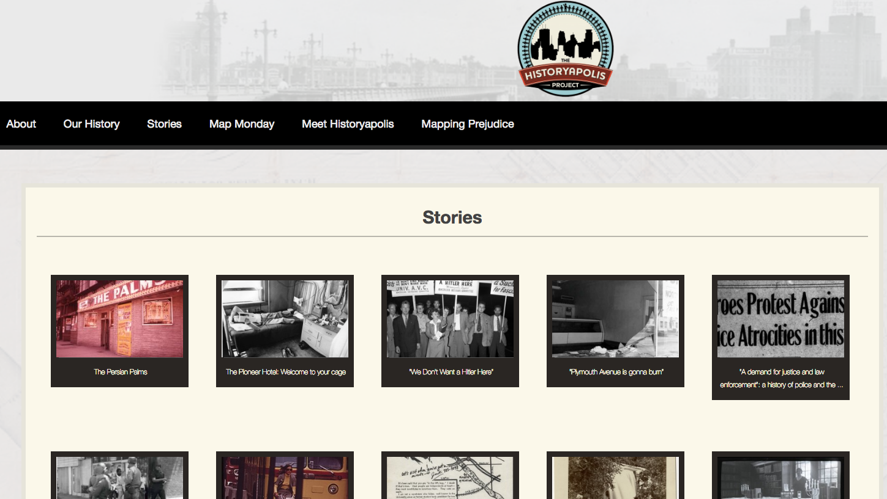
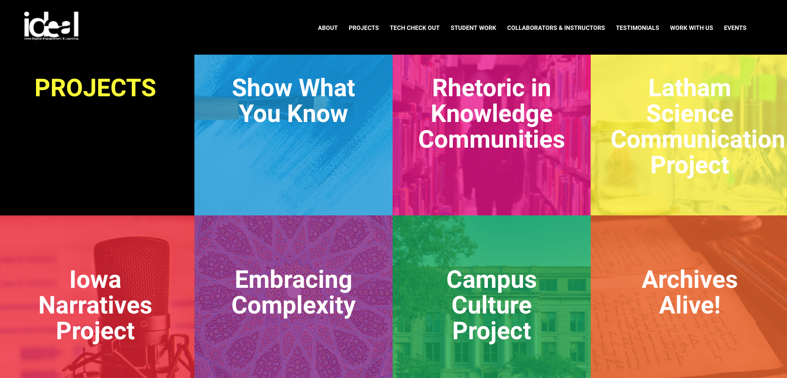
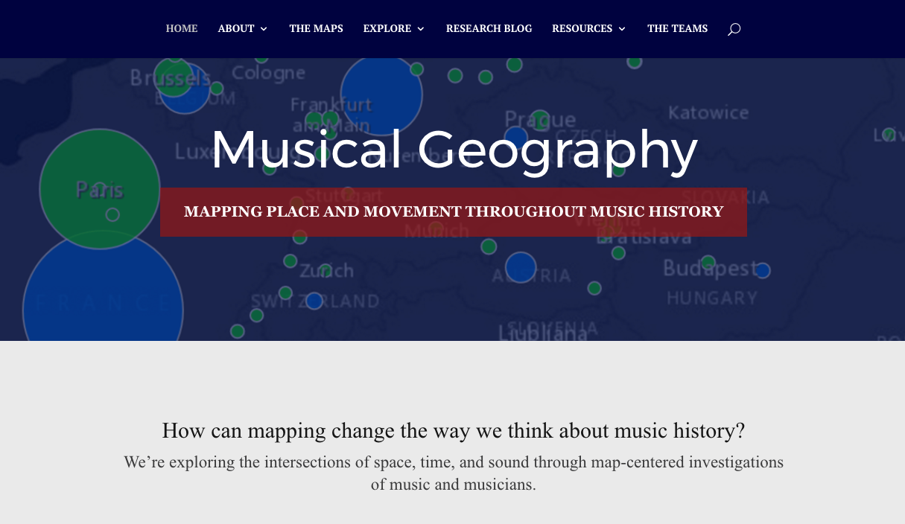
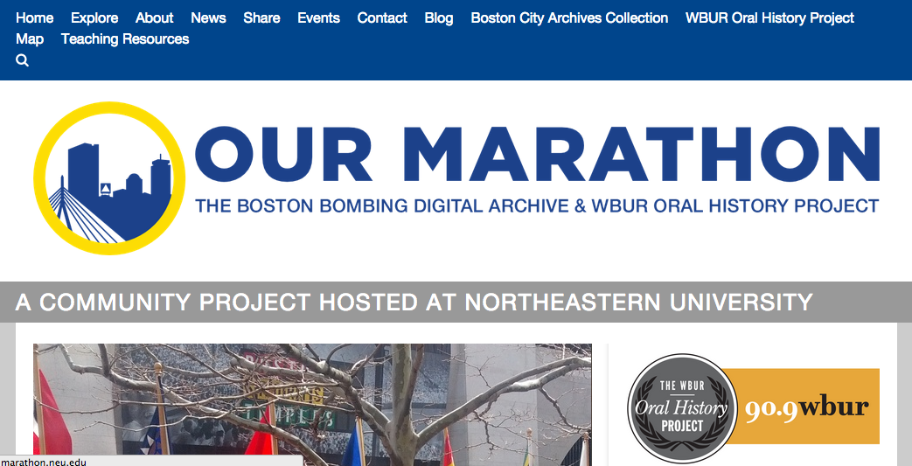
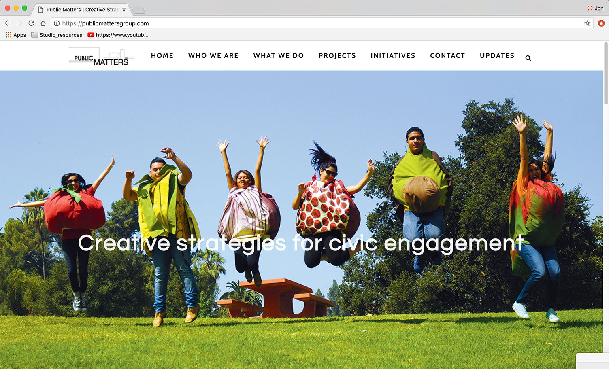
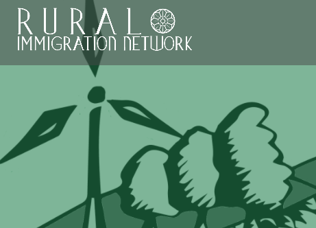
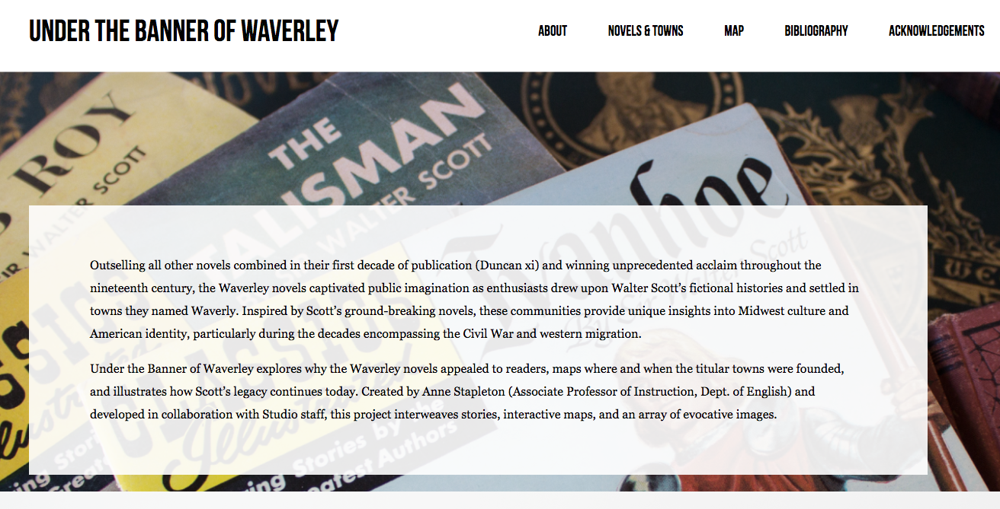

# Community

### Bridget Draxler
St. Olaf College

---

##### Publication Status:

* unreviewed draft
* draft version undergoing editorial review
* draft version undergoing peer-to-peer review
* **draft version undergoing MLA copyediting**
* published

--- 

### Cross-referenced keywords: collaboration, mapping, public 

--- 
 
## CURATORIAL STATEMENT

Community is a term that has suffered from its own niceness. In *Keywords for American Cultural Studies*, Miranda Joseph points out the problems with a term like “community”--a term that is too easily used without critical consideration. She frames the term at best as “nearly meaningless” in its overuse and at worst as a tool of manipulative persuasion in its empty signification of “a sense of belonging, understanding, caring, cooperation, equality.” 

Students need a critical lens to identify the limitations, exclusions, and misapplications of “community,” but they also need to develop meaningful commitments to others, whether in our classroom community, the broader local community, or the communities in which they will find themselves living and working in the future (McTighe Musil). This balance between skepticism and open-mindedness is a hallmark of both critical thinking and information literacy in a digital age ("Framework"). They are developing their voices as critical yet committed citizens, and becoming aware of the potential for communities to either separate insiders from outsiders, or to find common ground between them (Joseph). 

Digital spaces exacerbate this tension in the academy’s relationship to a term like “community.”  Digital tools can undermine traditional notions of community, highlighting the term’s meaninglessness through the apparent detachment of virtual engagement (see Turkle, Carr, Lanier, and Baym).  The idea of “digital community” can seem like an oxymoron, with the fluidity, expansiveness, and disembodiment of online groups. But if digital tools are changing and questioning the constitution of community today, these tools also provide new ways of engaging with community, and new communities to engage with. 

The idea of community, in a digital age, is defined less by shared space than by shared values. Geographically defined communities are increasingly supplanted by online communities, where the ties of shared goals, interests, affiliations and hobbies displace the ties of zip codes through an actively conversational listserves, crowdsourced databases of information, or virtual reality experiences. The notion that community is something to actively and intentionally create, rather than something to inherit, can enrich our commitment to these new communities, but it can also create a false binary between chosen and given communities. 

The best online communities are, in many ways, extensions or enhancements of analog communities, developing local communities in ways otherwise not possible (Taylor). In the same vein, many of the most compelling digital projects and tools are rooted in the values and best practices of civic engagement: collaboration , openness, active learning, and reciprocity (McTighe Musil). Digital pedagogy and civic engagement share a commitment to community, through modes of learning that are deeply connected to space and place. 

The artifacts below highlight this link between digital pedagogy and civic engagement, featuring place-based communities connected in new ways using digital technologies. They reframe academic communities, reimagine the value of student research for and with a broader community, and model scholarly inquiry that is not only public [see Jeff McClurken’s entry on [“Public”](https://digitalpedagogy.commons.mla.org/keywords/public) in this collection] but also collaborative [see the entry on [“Collaboration”](https://digitalpedagogy.commons.mla.org/keywords/collaboration) in this collection], drawing on community expertise alongside academic research.  

These artifacts explore new movements in higher education like digital public history (Owens) or activist digital humanities (Koh), and place-based learning (encompassing [mapping projects](https://digitalpedagogy.commons.mla.org/keywords/mapping), oral histories, public exhibits, interactive tours, internships, problem-based pedagogy and other active-learning methodologies that can make local culture "worthy of inquiry"; see Smith). Experiential learning is being transformed in online spaces, as students both consume and create knowledge through virtual interactive storytelling (Olson & Wagler) and location-based online games (Squire & Jan). Most importantly, these artifacts model ways that digital tools create learning environments that are community-driven and community-generated, undermining the categories of teacher vs. student and expert vs. public. 

For the twenty-first-century teacher, the community is not our audience but our collaborator. Many authors below would agree that their projects are co-authored and their courses are co-taught with many people inside and outside the academy, named and unnamed; indeed, the compilation of this list of artifacts would not have been possible without advice from Jason Paul, Nikki White, and many others on this list. Collaborative community-based work complicates and democratizes traditional notions of authorship and teaching. Rightly so. If it is the role of the humanist to interrogate a term like community, it is also our deeper calling to fortify concepts like community that point to our shared humanity. The stories we tell and the questions we ask as humanists, especially digital humanists, can help us to find new reasons and ways to invest in our communities.

## CURATED ARTIFACTS

### Teaching with 18th Connect 
 

* Type: PowerPoint 
* Source URL: [http://www.18thconnect.org/](http://www.18thconnect.org/) 
* Artifact Permissions: by permission of the author
* [files/community-teachingwith18thconnect.pptx](files/community-teachingwith18thconnect.pptx)
* Creator: Danielle Spratt, California State University - Northridge

[18th Connect](http://www.18thconnect.org/) is a database of eighteenth-century texts driven by values of sharing and service. Along with features typical of online communities (discussions, groups) and scholarly communities (peer review, searchable archives), it offers scholars and advanced students an opportunity to receive plain and TEI-encoded copies of texts from ProQuest and Gale in exchange for correcting any OCR errors in these texts. 

In addition to widening the circle of scholars and readers who have access to eighteenth-century texts through digital preservation and access, 18th Connect is also opening new opportunities for students to work with archival sources and create digital publications. For instance, Danielle Spratt’s graduate students at California State University - Northridge created a digital scholarly edition of Sarah Fielding’s [The Countess of Dellwyn](http://thecountessofdellwyn.weebly.com/), which simultaneously invited students to engage in collaborative research within the classroom community and to contribute to scholarly work within the online community.  

Collaborative editing turns the individual, introspective process of reading into a community practice and conversation. In this way, students develop a sense of community not only with their co-editors but also with imagined, future peer readers of a text. On a smaller scale, the practice of collaborative annotating has become easier with tools like [CommentPress](http://futureofthebook.org/commentpress/). While 18th Connect's platform of creating a digital scholarly edition is best for graduate or advanced undergraduate students in English, the practice of social annotating could be integrated into any course that includes assigned readings. 

### Historyapolis Project

* Type: mapping project
* Source URL: [http://historyapolis.com/](http://historyapolis.com/)
* Creator: Kirsten Delegard, Augsburg University 

This local history project out of Augsburg University confronts a legacy of prejudice and segregation in Minneapolis, MN through multimodal storytelling, driven by the idea that "history is a powerful tool for community-building" and digital tools can give us new ways of interpreting and sharing that history. Topics include immigration, LGBT rights, and perhaps most notably the history of police in the near North Side: "As we grapple with the shooting of Jamar Clark," they write, "this history matters."  [Mapping Prejudice](https://www.mappingprejudice.org/), a spinoff from the main project housed in the Borchert Map Library at the University of Minnesota, uses government documents and GIS technology to trace racially-restrictive deeds. Drawing heavily on student and community researchers, Historyapolis is the winner of the 2015 Alice Smith Prize from the Midwestern History Association. This site's accessible data visualization could be integrated into courses in local history or civil rights, or paired with fiction or non-fiction texts that would complement the numbers with individual narratives. 

### IDEAL
 

* Type: lesson plans
* Source URL: : http://ideal.uiowa.edu/projects/#iowa-narratives-project 
* [files/community-ideal-teachingresources.pdf](files/community-ideal-teachingresources.pdf)
* Creator: Matthew Gilchrist, The University of Iowa

Iowa Digital Engagement and Learning (IDEAL) offers a collection of lesson plans and teaching materials geared towards integrating technology and community engagement across the curriculum at the University of Iowa. Among others, IDEAL projects include the Iowa Narratives Project, which asks students to research and report on a public space in their local community through photography and interviews; Rhetoric of Knowledge Communities, which cultivates an understanding of information and rhetoric as based in communities of practice; and Embracing Complexity, which challenges students to confront stereotypes about Islamic cultures through classroom-community connections and the performing arts. 
 
IDEAL’s site includes lesson plans, class activities, example prompts, student handouts, technology tutorials, sample syllabi, and student projects easily adaptable to a variety of first-year seminar courses.. 

### Intro to Public Arts & Humanities
 

* Type: assignment
* Artifact Permissions: by permission of the author
* [files/community-goodhue-worksheet.pdf](files/community-goodhue-worksheet.pdf)
* Creator: Elizabeth Goodhue, UCLA

In Elizabeth Goodhue’s Intro to Public Arts & Humanities course, undergraduate students spend a week discussing the intersection of community engagement and digital humanities. Students begin by reading Anne Burdick et al.’s [“A Short Guide to Digital Humanities”](https://mitpress.mit.edu/sites/default/files/titles/content/9780262018470_Open_Access_Edition.pdf), emphasizing passages about how digital humanities redefines community and fosters a notion of “citizen scholars,” building on earlier readings like Gregory Jay’s [“The Engaged Humanities: Principles and Practices for Public Scholarship and Teaching”](http://jces.ua.edu/the-engaged-humanities-principles-and-practices-for-public-scholarship-and-teaching/). Goodhue also introduces students to a carefully curated list of scholarly projects that foreground the intersection of digital humanities and public humanities. The worksheet attached here, an adaptation of Brian Croxall’s CC-BY licensed [project evaluation assignment](http://www.briancroxall.net/dh/assignments/digital-humanities-project-evaluation/), guides small and large group discussion, and could be adapted for courses or more informal workshops introducing students to project-based digital scholarship.. 

### Musical Geography 
 

* Type: syllabus
* Source URL: [https://musicalgeography.org/](https://musicalgeography.org/) 
* Artifact Permissions: by permission of the author
* [files/community-musicalgeography-syllabus.pdf](files/community-musicalgeography-syllabus.pdf)
* Creator: Louis Epstein, St. Olaf College

Musical Geography uses digital mapping technology to study music and musicians in particular communities of time and space, inviting students to contribute to crowdsourced topics or develop their own research interests. An example of place-based digital pedagogy that fundamentally changes the research process, it also includes reflective practice through student blogs. 

While musicologists are beginning to "leverage maps as tools for analyzing, organizing, and presenting research," according to the syllabus, this place-based approach to student learning could be adapted to other humanities or social science fields to help students frame their research and arguments within geographical communities. 

### Our Marathon 
  

* Type: mapping project
* Source URL: [http://marathon.neu.edu/](http://marathon.neu.edu/)
* Creator: McGrath, Jim, Alicia Peaker, Ryan Cordell, Elizabeth Maddock Dillon, et al.

Our Marathon is a community-owned project that models the the collaborative and democratic potential of the digital humanities and civic engagement in enriching our communities. Developed in the wake of the Boston Marathon bombings of 2013, Our Marathon invites community contributors to share stories, images, and other media of their experiences. The crowd-sourced storytelling archive is intended explicitly as a tool for community healing, and a means of creating an organic, community-driven memorial. The site also includes teaching resources for a variety of grade levels (http://marathon.neu.edu/teaching-resources).

Similarly, [CurateScape](https://curatescape.org/) is an open-source framework that allows communities across the United States, large [https://clevelandhistorical.org/](https://clevelandhistorical.org/) and small [http://northfieldhistorical.org/](http://northfieldhistorical.org/), to develop place-based stories and collections, allowing local citizens and students to experience digitally enhanced walking tours or create their own multimedia stories, tagging locations with text, images, and video.  See the [CurateScape launch guide](https://curatescape.org/docs/project-launch-guide/) for detailed instructions that could be adapted to a class project. 

### The Passport Project 
 

* Type: syllabus
* Artifact Permissions: by permission of the author
* [files/community-passport-syllabus.pdf](files/community-passport-syllabus.pdf)
* Creator: Jon Winet, The University of Iowa

The Passport Project is an innovative first-year course that asks students to blog about community events representing the arts, humanities, sciences, along with political events and performances in dance, theater, and music. Peer Mentors, recent graduates of the program, lead small group discussions. While geared toward first-year students, the passport model could be easily adapted to a variety of technological platforms and communities or added onto an existing first-year seminar. By encouraging students to identify, early on, not only as members of the campus community but also the broader local community, it could also set up a bookended senior capstone that would engage students more directly in community engagement that complements their disciplinary interests and career goals.

### Public Matters 
 
 
* Type: teaching materials
* Source URL: [http://www.publicmattersgroup.com/](http://www.publicmattersgroup.com/)
* Creator: Mike Blockstein, Public Matters

Public Matters is "an interdisciplinary, social enterprise" dedicated to designing and implementing "innovative programs that build social, creative, and civic capital in communities." By engaging various stakeholders to create "Neighborhood Narratives," and developing young leaders through the [Urban Futures Lab](https://www.youtube.com/watch?v=1HVZ3rX86M4), they offer a model of long-term, project-driven, mutually beneficial partnerships between institutions of higher education and local communities. Though based in L.A., Public Matters serves as a model for creating a networked hub of civic engagement activity that could be replicated in other communities and classrooms. 

More specifically, the [Market Makeover Project](https://publicmattersgroup.com/projects/marketmakeoverseastlaboyleheights/) engaged local high school students "created a multi-faceted, grassroots social marketing campaign to promote healthy food consumption as well as the newly transformed markets, performed hands-on work transforming the selected stores, and served as community health advocates on behalf of the project’s efforts," according to their website. For the Historic Filipinotown project, [Hidden HiFi](http://publicmattersgroup.com/projects/hiddenhifi/), students were trained in media production skills in an afterschool program to create place-based digital narratives about the neighborhood's culture and history. In each of these examples, digital tools give students new voices in their own communities.   
 
### Rural Immigration Network 
 

* Type: online resource  
* Source URL: [https://ruralimmigration.net/](https://ruralimmigration.net/) 
* Creator: Kathy Tegtmeyer Pak , St. Olaf College

The Rural Immigration Network (RIN) is an online hub for people who seek to build community with immigrants to share practical information, particularly in rural communities. From its conception, the project has drawn on students as contributors to the site as researchers and writers. By creating short, readable essays summarizing scholarship and policy, students translate academic and government documents for a general audience. They also contribute "recipes" for activities, events and programs that practitioners can implement in their own communities. While designed for students in social science and history, this unique combination of policy translation and programming could also fit into coursework on non-profit management or advanced research/writing. 

RIN is one of many projects, including the [German Iowa and the Global Midwest](http://germansiniowa.lib.uiowa.edu/), an online archive of Iowa's multicultural history; the [Immigration History Research Center](https://cla.umn.edu/ihrc), a University of Minnesota project dedicating to archiving past and present immigration stories; and [Between Two Worlds](https://pages.stolaf.edu/hmg/), exploring Hmong culture in Minnesota, that involves students in researching and publishing on local immigrant communities through digital media. For teaching materials geared towards k12 students on immigration history, see [Iowa History Connections](http://thestudio.uiowa.edu/iowa_history_connections/lessonplans/). 

### Under the Banner of Waverley

* Type: mapping project
* Source URL: [http://waverly.lib.uiowa.edu/](http://waverly.lib.uiowa.edu/) 
* Creator: Anne Stapleton, The University of Iowa

This mapping project studies the connections between Walter Scott's Waverley novels and the Midwestern towns named after this fictional community, illuminating both the novels and the immigrants who named communities in their honor. While this project is specific to a few dozen namesake towns, it serves as a model of how students can use data, memoirs, photographs and interviews to study naming practices in their own communities.  

### Related Materials

“New Self-Guided Curriculum for Digitization.” Digital Public Library of America. [http://dp.la/info/2015/10/07/new-self-guided-curriculum-for-digitization/](http://dp.la/info/2015/10/07/new-self-guided-curriculum-for-digitization/)

The Digital Studio for the Public Arts & Humanities, The University of Iowa [http://thestudio.uiowa.edu/_wp/](http://thestudio.uiowa.edu/_wp/)

eCollaboration Worksheet (Ned Kock, Texas A&M) [https://docs.google.com/document/d/1J59ki10mKW4eLZoGpvrTbzkEnm0WPo236NdHap3rANk/edit](https://docs.google.com/document/d/1J59ki10mKW4eLZoGpvrTbzkEnm0WPo236NdHap3rANk/edit)

Daniel J. Cohen and Tom Scheinfeldt (editors), Hacking the Academy [http://hackingtheacademy.org/](http://hackingtheacademy.org/) A book that was crowdsourced in the course of one week, Hacking the Academy is itself an innovative example of authoring in community.

NITLE [http://www.nitle.org/](http://www.nitle.org/), which hosts Academic Commons [http://www.academiccommons.org/](http://www.academiccommons.org/), is (like [HASTAC](https://www.hastac.org/)) an online community with a deep interest in the intersection of the digital humanities, pedagogy, and civic engagement, with particular focus on liberal arts education.

### Works Cited

Baym, Nancy K. *Personal Connections in the Digital Age.* Polity Press, 2010. 

Blockstein, Mike. *Public Matters.* [http://www.publicmattersgroup.com/](http://www.publicmattersgroup.com/). 

Burdick, Anne et. al. *Digital_Humanities.* The MIT Press, 2012.

Carr, Nicholas. *The Shallows: What The Internet Is Doing To Our Brains.* W. W. Norton & Co., 2011. 

*CommentPress.* The Institute for the Future of the Book, [http://futureofthebook.org/commentpress/](http://futureofthebook.org/commentpress/). 

Croxall, Brian. "Digital Humanities Project Evaluation." *Introduction to Digital Humanities*, [http://www.briancroxall.net/dh/assignments/digital-humanities-project-evaluation/](http://www.briancroxall.net/dh/assignments/digital-humanities-project-evaluation/).

Delegard, Kirsten. *Historyapolis Project.* Augsburg University, [http://historyapolis.com/](http://historyapolis.com/). 

Dillon, Elizabeth Maddock and Ryan Cordell. "Teaching Resources." *Our Marathon*, [http://marathon.neu.edu/teaching-resources](http://marathon.neu.edu/teaching-resources). 

Ehrstine, Glenn. *German Iowa and the Global Midwest.* University of Iowa, [http://germansiniowa.lib.uiowa.edu/](http://germansiniowa.lib.uiowa.edu/). 

Epstein, Louis. *Musical Geography.* St. Olaf College, [https://musicalgeography.org/](https://musicalgeography.org/). 

"Framework for Information Literacy for Higher Education", American Library Association, February 9, 2015.

Gilchrist, Matthew. *Iowa Digital Engagement and Learning (IDEAL).* University of Iowa, [http://ideal.uiowa.edu/](http://ideal.uiowa.edu/). 

Harshman, Jason. "Lesson Plans." *Iowa History Connections*, University of Iowa, [http://thestudio.uiowa.edu/iowa_history_connections/lessonplans/](http://thestudio.uiowa.edu/iowa_history_connections/lessonplans/). 

Jay, Gregory. "The Engaged Humanities: Principles and Practices for Public Scholarship and Teaching." *Journal of Community Engagement and Scholarship*, vol. 3, no. 1, 2012, pp. 51-63. 

Joseph, Miranda. “Community” in *Keywords for American Cultural Studies*. Ed. Bruce Burgett and Glenn Hendler. 

Koh, Adeline. “Getting Started in Activist Digital Humanities.” July 24, 2015. [http://www.adelinekoh.org/blog/2015/07/24/getting-started-in-activist-digital-humanities/](http://www.adelinekoh.org/blog/2015/07/24/getting-started-in-activist-digital-humanities/)

Lanier, Jaron. *You Are Not A Gadget.* Vintage Books, 2010. 

Lee, Erika. *Immigration History Research Center.* University of Minnesota, [https://cla.umn.edu/ihrc](https://cla.umn.edu/ihrc). 

Mandell, Laura. *18thConnect.* Texas A&M University, [http://www.18thconnect.org/](http://www.18thconnect.org/). 

McGrath, Jim, Alicia Peaker, Ryan Cordell, Elizabeth Maddock Dillon, et al. *Our Marathon: The Boston Bombing Digital Archive.* 2013-2015. [www.northeastern.edu/marathon](www.northeastern.edu/marathon).

McTighe Musil, Caryn. “Educating for Citizenship.” *Peer Review*, Volume 5, Issue 3, 2003, pp. 4-8.

*Northfield Historical.* St. Olaf College, Carleton College, and the Northfield Historical Society, [http://northfieldhistorical.org/](http://northfieldhistorical.org/). 

Olson, Ruth and Mark Wagler. "Afield in Wisconsin: Cultural Tours, Mobile Learning, and Place-Based Games." *Western Folklore*, Volume 70, Issue 3/4, Summer/Fall 2011, pp. 287-310. 

Owens, Trevor. “Becoming Digital Public Historians.” May 9, 2015. [http://www.trevorowens.org/2015/05/becoming-digital-public-historians/?utm_source=feedburner&utm_medium=feed&utm_campaign=Feed%3A+trevorowensblog+%28Trevor+Owens%29 ](http://www.trevorowens.org/2015/05/becoming-digital-public-historians/?utm_source=feedburner&utm_medium=feed&utm_campaign=Feed%3A+trevorowensblog+%28Trevor+Owens%29)

Smith, Gregory A. "Place-Based Education: Learning To Be Where We Are." *The Phi Delta Kappan*, Volume 83, Issue 8, April 2002, pp. 584-94. 

Spratt, Danielle. *The Countess of Dellwyn By Sarah Fielding.* [http://thecountessofdellwyn.weebly.com/](http://thecountessofdellwyn.weebly.com/). 

Souther, Mark. *Cleveland Historical.* Cleveland State University, [https://clevelandhistorical.org/](https://clevelandhistorical.org/). 

Squire, Kurt D. and Mingfong Jan. "Mad City Mystery: Developing Scientific Argumentation Skills with a Place-based Augmented Reality Game on Handheld Computers." *Journal of Science Education and Technology*, Volume 16, Number 1, February 2007, pp. 5-29.

Stapleton, Anne. *Under the Banner of Waverley.* University of Iowa, [http://waverly.lib.uiowa.edu/](http://waverly.lib.uiowa.edu/). 

Taylor, Diana. "Save As... Knowledge and Transmission in the Age of Digital Technologies." *Foreseeable Futures: Position Papers from Imagining America*, Number 10, 2010. 

Tebeau, Mark. *CurateScape.* [https://curatescape.org/](https://curatescape.org/). 

Tebeau, Mark. "Project Launch Guide." *CurateScape*, [https://curatescape.org/docs/project-launch-guide/](https://curatescape.org/docs/project-launch-guide/). 

Tegtmeyer Pak, Kathy. *Rural Immigration Network.* St. Olaf College, [https://ruralimmigration.net/](https://ruralimmigration.net/). 

Turkle, Sherry. *Alone Together: Why We Expect More From Technology And Less From Each Other.* Basic Books, 2011. 

Wong, Ka. *Between Two Worlds.* St. Olaf College, [https://pages.stolaf.edu/hmg/](https://pages.stolaf.edu/hmg/). 