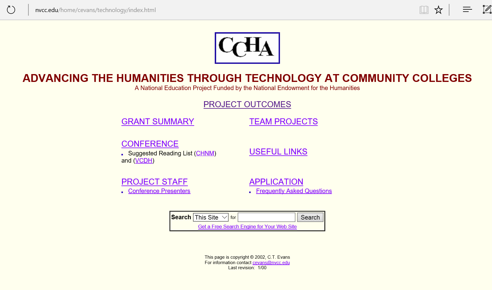
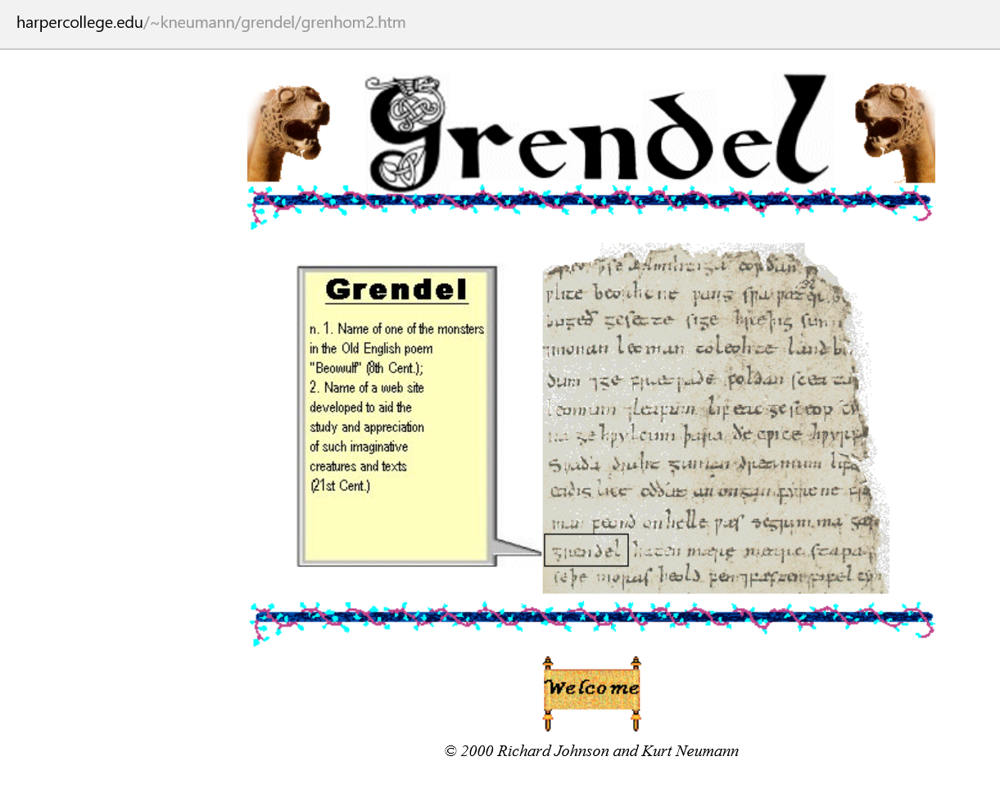
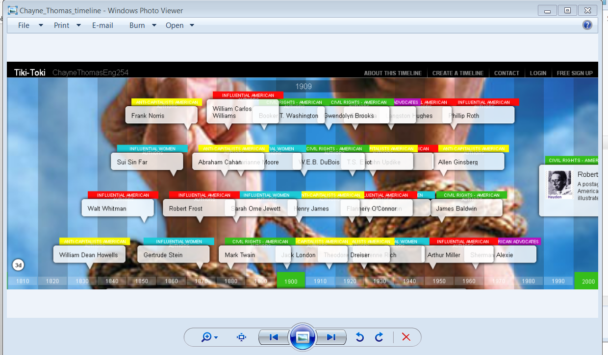
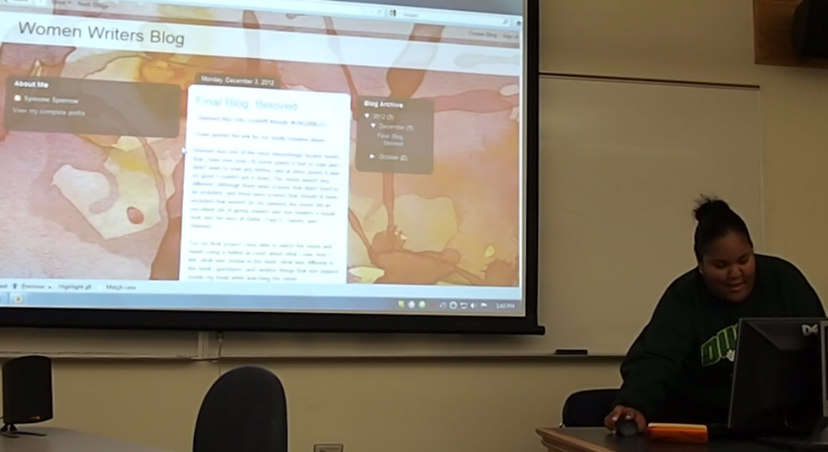
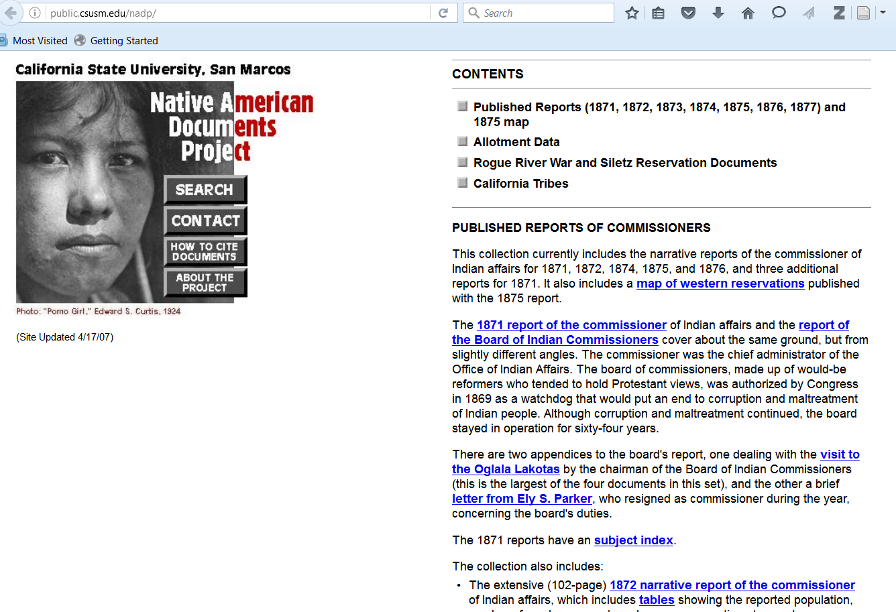
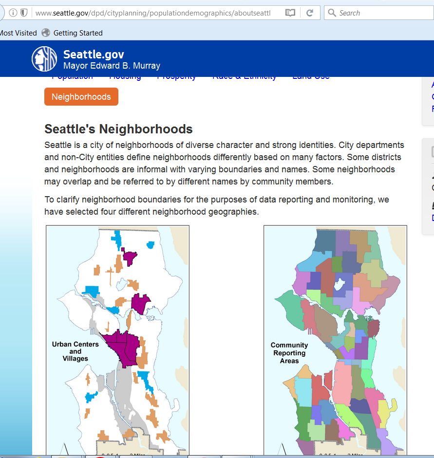
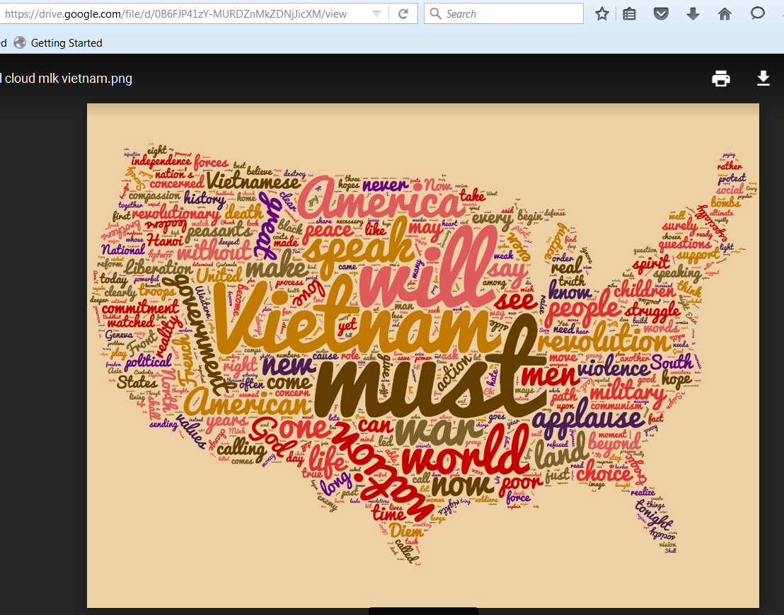
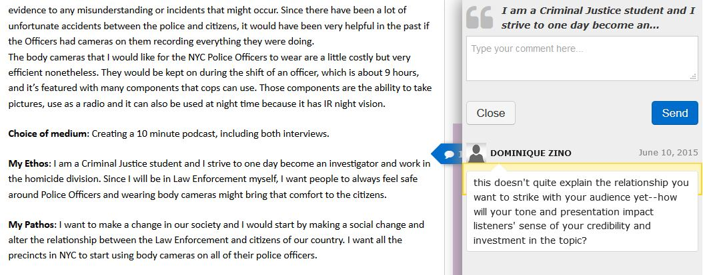
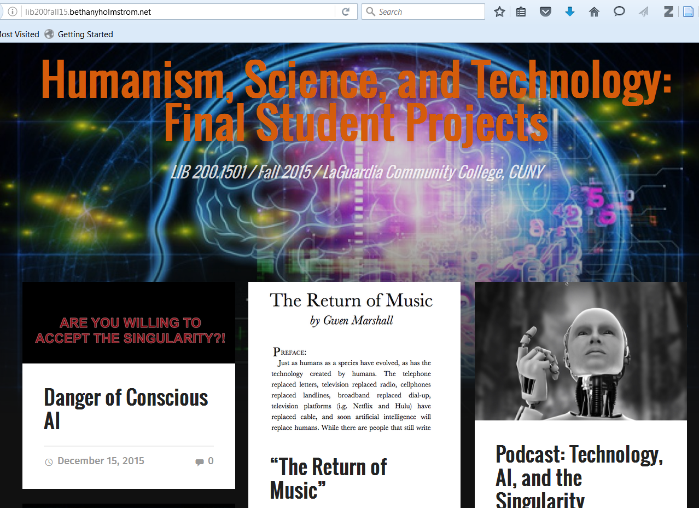

# COMMUNITY COLLEGE

## AUTHOR(S)
Anne B. McGrail, PhD. English Faculty, Lane Community College

Dominique Zino, Assistant Professor of English, LaGuardia Community College

Jaime Cardenas, PhD., Instructor of History (Tenured), Seattle Central College

Bethany Holmstrom, Assistant Professor of English, LaGuardia Community College

##### Publication Status:
* **unreviewed draft**
* draft version undergoing editorial review
* draft version undergoing peer-to-peer review
* published 

--- 

## CURATORIAL STATEMENT

Offering students low-cost, local, and open access to degrees, community colleges are a strength of the American public higher-education system. Community college students are some of the most diverse and also most vulnerable student populations in higher education. Their numbers are impressive: they comprise 46% of all undergraduates in the US; 41% of all first-time freshmen attend one of the more than 1200 community colleges in the country (American Association of Community Colleges "Enrollments"). Their profiles constitute a critical pedagogical context for equity in digital humanities (DH): a majority of Native American, Black, and Hispanic students begin their college careers in community colleges, and 43% of Asian/Pacific Islander students are enrolled there. Fifty-nine percent are women, and students from the lowest socioeconomic quintile are increasingly more likely to begin post-secondary education at community colleges. (American Association of Community Colleges "Fast Facts"). Immigrants, too, make up a significant constituency: one study estimates that about 25% of community college students come from an immigrant background (National Center for Education Statistics). 
 
###Access and Equity 
 
An equitable digital humanities vision should embrace these students and the faculty who teach them. Digital projects offer empowering tools for community college students to represent their communities, to challenge inequalities and to be critical participants in digital culture. Adoption of digital approaches in community colleges is hindered, however, by systemic barriers such as faculty workloads: Community college faculty spend more than two times the number of hours in the classroom teaching than do public doctoral faculty; 67 percent of community college faculty teach from 75 to more than 150 students (Rifkin), and 58% of community college courses are taught by part-time and contingent faculty (Center for Community College Student Engagement). In addition, unreliable facilities and student access to even minimal technology also have slowed commitment to humanities computing in community colleges.

Still, organizations have recently recognized the importance of inclusion in DH if the field is to reach its democratic potential. In 2015, for example, the NEH Office of Digital Humanities supported a summer institute for 29 community college teacher-scholars (see the Online Commons in “Related Materials” below) , and in 2017 a community college perspective will be represented at the MLA Convention’s Digital Humanities Forum (McGrail, “Don’t Minimize DH at Community Colleges”). Even the inclusion of term in this volume signals the field’s developing capacity for and interest in cultivating novice digital humanists from all walks of life and from all strata of higher education.
 
###Curricular Anticipation and Translations 

All 100- and 200-level digital humanities courses are not created equally. Although two-year faculty may teach lower-division courses that mirror those in a university catalog, the unique teaching context of community colleges entails customizing pedagogy and curriculum. Working on digital projects can provide a curricular mechanism for increasing equity at community colleges. But teachers face challenges from resource barriers to differential preparation. For community college courses to be successful, differentiated instructional design is often necessary to teach students with wide-ranging skill levels simultaneously. The American Literature syllabus below, for example,  allows for this differentiation in lab settings. Other widely accepted project management features such as collaboration and tight deadlines need to take account of exigencies of diverse students' lives. Community college digital humanities projects should anticipate the context of working-class and diverse students struggling with lives immersed in precarity. (McGrail, “The Whole Game: Digital Humanities at Community Colleges.”)

Community-college students’ responses to unfamiliarity, experimentation and failure may also differ significantly from middle-class students schooled in an atmosphere of productive challenge and soft landings. As the MLA keyword in this volume makes clear, “fails” and “failure” can play productive roles in innovation and discovery (Croxall and Warnick) . But handled too cavalierly, these signature features of DH practice can translate into student self-doubt and disappearance. The assignments featured here are characterized by an intentionally welcoming and generous instructional design that promotes an  explicitly positive classroom climate.  

One shouldn’t think of community college students only in terms of deficits, however. These students arrive on open-access campuses with unique assets and more maturity than their more traditional-age counterparts. With an average age of 29 (AACC “Students at Community Colleges”) community college students draw on this life experience and abundant tacit knowledge to approach complex and unfamiliar tasks. The assignments that follow illustrate how embedding versions of digital annotation, distant reading, and digital publishing platforms, for example, strengthens traditional curricula in foundational courses. Even without classroom access to computers, students can study digital culture’s larger themes, e.g., the often hidden power of algorithms and databases, rhetorical awareness of interfaces, the changing norms of privacy and publicity, etc. As these artifacts and resources illustrate, with the proper scaffolding and attention to the material conditions of community college students' lives, threshold concepts and signature practices of DH can be taught at entry level. Community college students are immersed in a digital world; DH can help them understand it. 

## CURATED ARTIFACTS 

###Advancing Humanities through Technology
 

Source: http://www.nvcc.edu/home/cevans/technology/index.html

Type: Grant Project Website ca. 1999

Creators: Charles Evans, Roy Rosensweig, David Berry

In 1999 the NEH, the Community College Humanities Association and North Virginia Community College initiated a humanities computing community of practice among seventeen colleges entitled, “Advancing the Humanities through Technology at Community Colleges." [  http://www.nvcc.edu/home/cevans/technology/index.html ]  The institute fostered development of impressive projects, including Harper College’s Grendel website [ http://www.harpercollege.edu/~kneumann/grendel/welcome.htm  ] and North Shore Community College’s Hawthorne in Salem [ http://www.hawthorneinsalem.org/ ], both of which remain relevant community college pedagogical online resources. Projects there demonstrate how early on community college faculty saw the democratic potential of humanities computing. They also anticipate and, in their own way, answer the later definitional debates about what authentically “counts” as digital humanities: projects include website development, electronic portfolios, archival access, cross-disciplinary collaboration and student-generated, public-facing family heritage archives.

###Hawthorne in Salem

Source URL: http://www.hawthorneinsalem.org/

Type: Website

Creator: Terri Whitney

Hawthorne in Salem, a historical resource and pedagogical tool that actively engages with community college students, exemplifies the value of local community college partnerships with cultural assets such as museums, universities and cultural sites. Terri Whitney expanded her work begun with the CCHA/NEH institute in 1999 to provide an interactive archive with photos, audio and video tours and other artifacts that support public access to historical and literary research. Funded by another NEH grant in 2007, Whitney and North Shore Community College have collaborated with the Peabody Essex Museum, the House of Seven Gables and the Salem Maritime to create and maintain the site.

###Harper College’s Grendel

Source: http://www.harpercollege.edu/libarts/hum/dept/grendel/grenhom2.htm

Creators: Professors Richard Johnson and Kurt Neuman, Harper College

Harper College’s Grendel, designed by Richard Johnson and Kurt Neuman as part of the 1999 NEH grant project, is noteworthy for its interactivity in a pre-Web 2.0 context, and is an early instance of community college faculty’s recognition of the value of humanities computing for student engagement and participation. Using email to participate, students can identify and define significant words from Beowulf and have their work included in an online glossary. Ram files play back pronunciations. The same Web-based email system is used to support student annotations and translations of lines.

###American Literature Syllabus with Digital Humanities Labs

Source: http://blogs.lanecc.edu/dhatthecc/teachingnotesfall2012/american-literature-i-and-ii-syllabus-with-dh-labs/

Type: Syllabus and Course Calendar

Creator: Anne B. McGrail, PhD, Lane Community College

This is the syllabus and course calendar for a two-term sequence in American Literature (22 weeks total). The class is taught in a traditional classroom two days a week, and in a computer lab with Web access one day a week (for an hour).  “Digital Humanities Labs” were posted each week in the LMS Moodle. If community college students are going to create DH projects, the best course design embeds both course time and access to technology.  A “studio hour” setting can give students a chance to ask questions and collaborate. Later in the term students who are confident can work at home and post updates during the course hour, functionally creating a hybrid course. Detailed instructions for many student labs are in the Keywords artifact, “Thirteen Ways of Doing DH at the CC” (below) and more in the Keywords resource blog Doing DH at the CC https://blogs.lanecc.edu/dhatthecc/teachingnotesfall2012/
 

###Thirteen Ways of Doing DH at the CC

Source URL: https://blogs.lanecc.edu/dhatthecc/2013/10/21/thirteen-ways-of-doing-dh-at-the-cc/

Type: Classroom assignments

Creator: Anne B. McGrail, PhD, Lane Community College. Adapted from multiple sources.

This collection of digital humanities assignments grew out of curriculum development work I did over several years in my American Literature and Women Writers courses at Lane Community College. Each assignment has proven highly successful for community college students, whether they are English majors or not. The assignments were developed with weekly student access to an hour in the computer lab, using readily available tools such as Tiki Toki timelines, archives such as Emily Dickinson’s papers, and free software such as Google Maps. While introductory in nature, each assignment explicitly engages with key tools and ideas in the field of digital humanities: collaborative text annotation of primary source documents; archival study; concepts such as “glitches” and “de-formation”; word clouds and distant reading; networked communication; spatial organization of narratives and events; the role of media in developing popular cultural epistemic frames. Professor Bridget Marshall’s Digital Document Assignment is a highly successful public research capstone for the class. Examples of student work (filmed and shared with student permission) appear in the “Resources” section of this Keywords entry.

###Public Interventions: A Photographic Record of People of Color and Education

Type: History Assignment

[Source](Photographs.pdf)

Creator: Jaime Cardenas[a][b], PhD, Instructor of History, Tenured, Seattle Central College
Just like the understanding that all young people are “digital natives” is wrong, so is it wrong to assume that they are adroit interpreters of primary visual sources.  This assignment seeks to utilize the interest younger students have of visual culture in order to expand their abilities to interpret the past. In this case, because they are interpreting images of public education, something with which most of them have had direct experience, their interaction with these primary sources will be relatively intimate. Thus, this assignment has two built-in advantages: the use of visuals and a “projected” nostalgia. Students may not initially observe images within the historical context that produced the primary source.  As Barbara Ormond and others recommend, we should guide our students through a detailed process that makes images, initially, less discernible, so that in the end students will become better interpreters of the past.
 
###Mapping Race in Seattle

Type: History Assignment

[Source](Mapping Race.pdf)

Creator: Jaime Cardenas, PhD, Instructor of History, Tenured, Seattle Central College

Pedagogically, spatial understandings of inequality and inequity present a challenge in the USA and beyond (Hammersley et al). Our country has a great deal of geographic unawareness, in part because of the lack of geography education in K-16 educational systems (See “What College-Aged Students Know about the World”).  This assessment aids in the processes of aiding students in locating, literally and figuratively, how power is enacted geographically in Seattle.  The nexus of capital and race in this American city, since the late 1800s and the de facto expulsion of almost all Native people, has brought together anti-Asian and anti-Black spatial ideologies of de jure and de facto residential segregation.

When I’ve used this approach in the past, most students have responded with surprise (and this includes students whose grandparents were racially segregated in Seattle) at how segregated the city has been.  An interesting example comes from the proximity of African American and Asian American neighborhoods. Often students have not considered why the International District (which contains Chinatown and other Asian American neighborhoods) is adjacent to the Central District (the once mostly African American neighborhood of the city). Many of my students have thought it was just coincidence that the two neighborhoods are proximate to one another. When they see their mapping in conjunction to reading the secondary sources, their comprehension is deepened, something that I evaluate by I having simple pre-activity and post-activity quizzes so that I can assess their learning.
 
###Visualizing Discourse: Cloud Mapping Cultural Resistance

 
Type: History Assignment

[Source](Cloud Map.pdf)

Creator: Jaime Cardennas, PhD, Instructor of History, Seattle Central College

Word clouds are relatively commonplace on the Seattle Central College campus (e.g., flyers for workshops or a new course, etc).  Thankfully, what has captured the attention of the students is the actual “content of the content”, or the text that the algorithm presents once it has run in the application.  Of course, they could read the words before using the word cloud app, but the process of quantification and subsequent representation allows students to carefully notice words, words analyzed within the particular social and historical context from which the text (speech, poem, etc.) emerged.  For instance the sermon that Dr. King gave against the U.S. war in southeast Asia, in 1967, is a prime example and one that I’ve used while teaching the US history survey: http://tinyurl.com/mlkandvietnamwordcloud.  In this primary source, tellingly, the words “nation” and “America” are used more often than “God”, but the word “world” occurs more often than all of these.

###Making Podcasts to Support Research-based Writing and Reflection

 
Type: Assignment and Student Work

[Source](files/podcast.pdf)

Creators: Dominique Zino, Assistant Professor of English, LaGuardia Community College; Vilma and Carmen, LaGuardia Community College students

In first-year composition courses at LaGuardia Community College, one learning objective is developing rhetorical awareness. While many students find rhetorical analysis challenging as they practice close reading and writing, building in live speakers and live audiences through a podcasting project makes the concept of a “rhetorical situation” more concrete. Podcasting can be an informal, low-stakes assignment or it can serve as a more in-depth final research assignment. When framing the writing and thinking work related to creating a podcast, one useful resource is the composition textbook Compose, Design, Advocate, which takes a rhetorical approach to creating various kinds of multimedia artifacts and emphasizes the importance of working in recognizable, real-world genres. Authors Anne Wysocki and Dennis Lynch suggest that writers approach any task by outlining the moving rhetorical parts (purpose, audience, context, strategies, medium, arrangement, and testing) through a document they call the “design plan.” The attached Word document includes an outline of a four-stage podcasting process, with the design plan at the center; it also includes two sample student design plans (one created as an early planning document and one amended after the student made her podcast), directions for interviewing and for creating a bibliography, and a grading rubric for a podcasting project.

 
###Capstone Liberal Arts Hybrid Final Digital Media Projects

Type: Website of student work

Source URL: http://lib200fall15.bethanyholmstrom.net/

Creator: Bethany Holmstrom, Assistant Professor of English, LaGuardia Community College

LaGuardia Community College has undertaken an in-house professional development project [ https://docs.google.com/document/d/1hHeCwupjlaJ8MgjSwZSRhgn3f03UVvLdOXSw15DnQRk/edit] to support work such as this capstone site. Bethany Holmstrom’s students in her hybrid liberal arts capstone class created digital media projects in response to their course theme, Artificial Intelligence in sci-fi film/TV shows. Students pitched their projects to the class, wrote research narratives, and chose the platform that best suited their needs. Students were also asked to consider accessibility when designing their project. The projects were shared publicly, along with the research narratives. In this way, students creatively apply research and content encountered during the semester, making projects that speak to their own skills, interests, and connections to the course materials.
 
## RELATED MATERIALS

_Digital Humanities at Community Colleges_. Supported with an NEH Office of Digital Humanities Grant https://dhatthecc.lanecc.edu/
 
Holmstrom, Bethany, et al. _Hybrid and Digital Pedagogy at LaGuardia Community College_. http://hybridenglish.commons.gc.cuny.edu/

Lane Community College Students. _Final Digital Document Presentations_. https://www.youtube.com/playlist?list=PL8i5RdF89ejcbxcz6d91lYLNfuBPZ2jqk

McGrail, Anne. _Doing DH at the CC_ https://blogs.lanecc.edu/dhatthecc/

_National Survey of Digital Humanities in Community Colleges_. Sponsored by an NEH Office of Digital Humanities Start-Up Grant https://blogs.lanecc.edu/dhatthecc/2014/02/03/survey-data-available-from-national-survey-of-digital-humanities-in-community-colleges/

## WORKS CITED

American Association of Community Colleges. "Community College Enrollments." American Association of Community Colleges, 2015. July 8, 2015. Web.
http://www.aacc.nche.edu/AboutCC/Trends/Pages/enrollment.aspx

------. “2015 Community College Fast Fact Sheet.” American Association of Community Colleges. July 8, 2015. Web. http://www.aacc.nche.edu/AboutCC/Pages/fastfactsfactsheet.aspx

------. “Students at Community Colleges.” 2016. Web.
http://www.aacc.nche.edu/AboutCC/Trends/Pages/studentsatcommunitycolleges.aspx

Center for Community College Student Engagement. “Contingent commitments: Bringing part-time faculty into focus. A special report from the Center for Community College Student Engagement.” Austin, TX: The University of Texas at Austin, Program in Higher Education Leadership, 2014. http://www.ccsse.org/docs/PTF_Special_Report.pdf

Community College Research Center. "Community College FAQs." Teachers College, Columbia University http://ccrc.tc.columbia.edu/Community-College-FAQs.html
 
Council on Foreign Relations. "What College-Aged Students Know About the World: A Survey on Global Literacy." Council on Foreign Relations, 13 Sept. 2016. Web. http://www.cfr.org/society-and-culture/college-aged-students-know-world-survey-global-literacy/p38241 
 
Croxall, Brian and Quinn Warnick. “Failure.” _Digital Pedagogy in the Humanities: Concepts, Models and Experiments_. Rebecca Frost Davis, Matthew K. Gold, Katherine D. Harris and Jentery Sayers (eds.). MLA Commons. Web.  https://digitalpedagogy.commons.mla.org/keywords/failure/ 

Hammersley, Laura A., Rebecca H. Bilous, Sarah W. James, Adam M. Trau, and Sandie Suchet-Pearson. 2014. "Challenging ideals of reciprocity in undergraduate teaching: the unexpected benefits of unpredictable cross-cultural fieldwork." _Journal of Geography In Higher Education_ 38, no. 2: 208-218.
 
Marshall, Bridget. "Using Primary Sources in the Classroom." Lowell Teacher Workshop: Dr. Bridget Marshall. Tsongas Industrial History Center, October 9, 2013. Video. Web. https://www.youtube.com/watch?v=ipaXJ3_VVRQ

MLA Committee on Community Colleges. “A Community College Teaching Career.” Modern Language Association.  2006. http://bit.ly/2dO5ide

McGrail, Anne B. "National Survey of Digital Humanities at Community Colleges." Doing DH at the CC. October 2014.
https://blogs.lanecc.edu/dhatthecc/2014/02/03/survey-data-available-from-national-survey-of-digital-humanities-in-community-colleges/
 
------. “The Whole Game: Digital Humanities in Community Colleges.” In Debates in the Digital Humanities 2016. Eds Matthew K. Gold and Lauren F. Klein. University of Minnesota Press, 2016.
 
------. “Don’t Minimize DH at Community Colleges.” Modern Language Association Convention, Philadelphia, Pennsylvania, January 7, 2017.
 
National Center for Education Statistics, “Profile of Undergraduates in U.S. Postsecondary Education Institutions: 2003–04, With a Special Analysis of Community College Students.” U.S. Department of Education, 2006. http://nces.ed.gov/pubsearch/pubsinfo.asp?pubid=2006184

Rifkin, Troni. "Public Community College Faculty." American Association of Community Colleges. n.d. Web. http://www.aacc.nche.edu/Resources/aaccprograms/pastprojects/Pages/publicccfaculty.aspx

Wysocki, Anne and Dennis Lynch. _Compose, Design, Advocate: a Rhetoric for Integrating Written, Oral and Visual Communication_. Pearson: 2013.
 
 
 