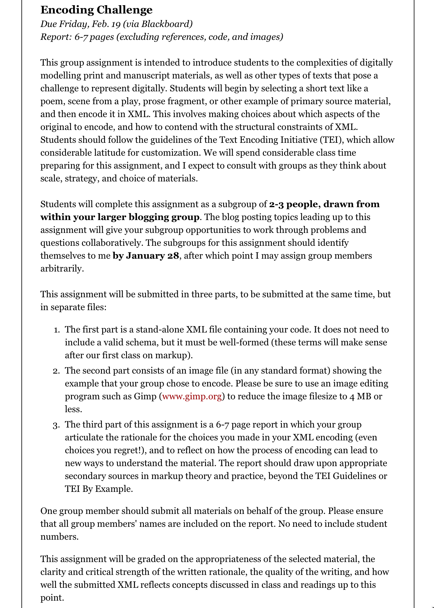
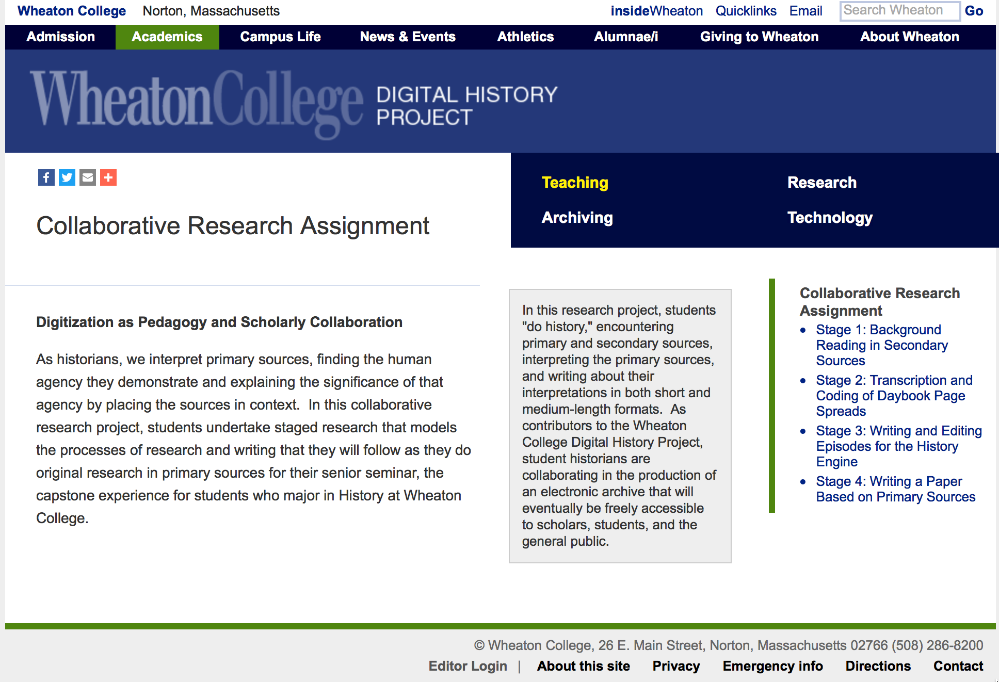
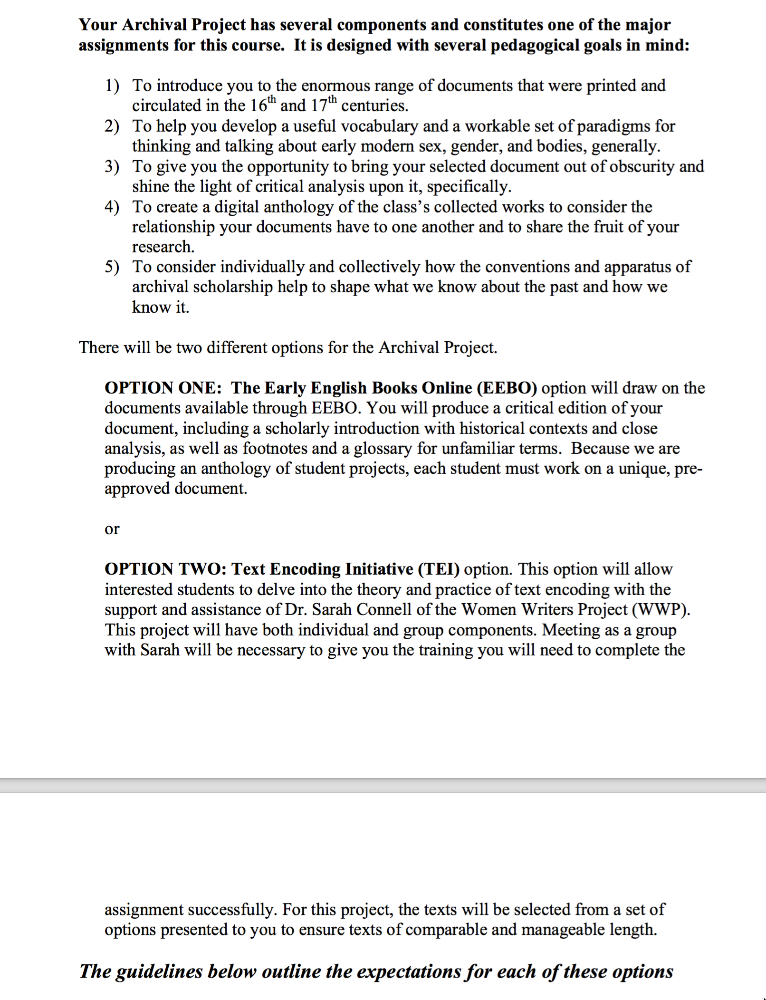
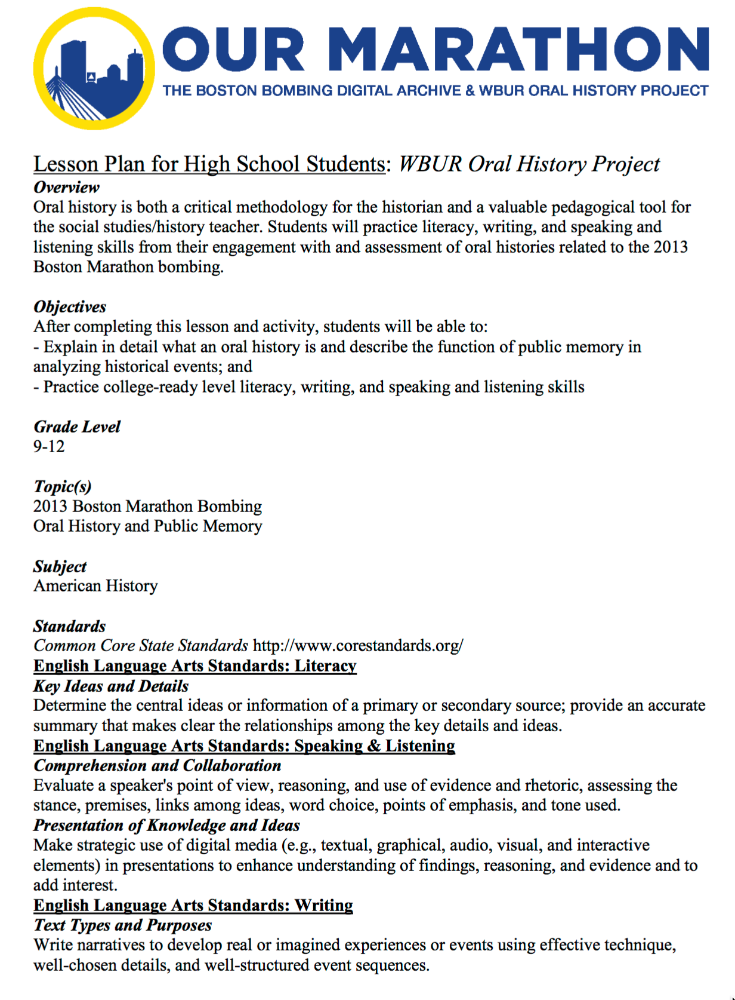
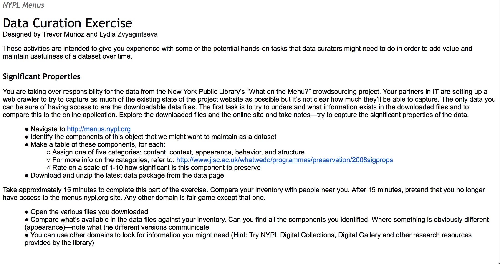
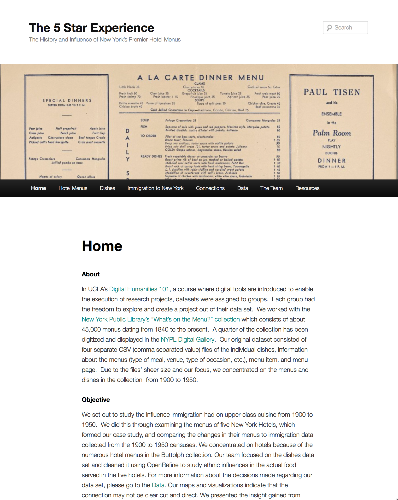
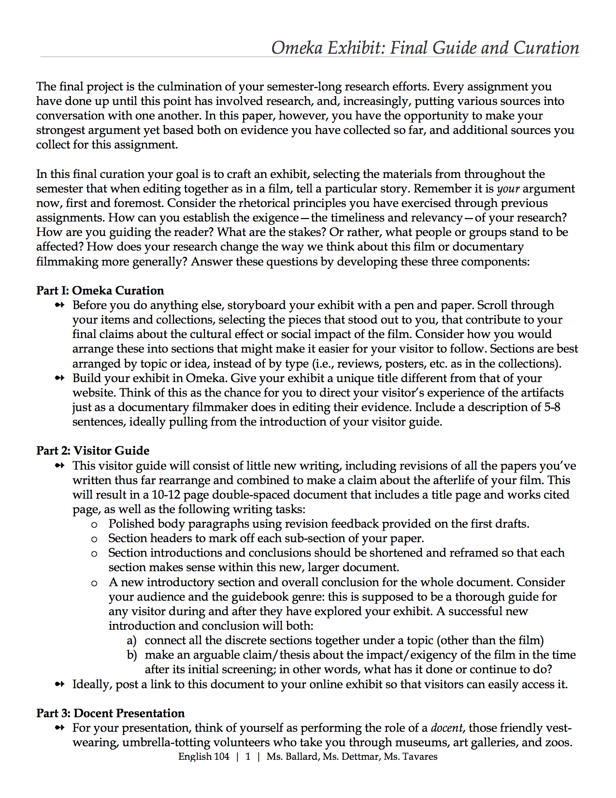
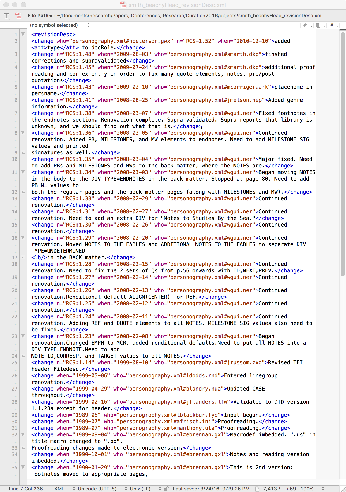

--- 
title: Digital Pedagogy in the Humanities
subtitle: Concepts, Models, and Experiments 
chapter: Curation
URL: keywords/curation.md
author: 
- family: Flanders
  given: Julia
editor: 
- family: Davis
  given: Rebecca Frost
publisher: Modern Language Association
type: book
---

# Curation

## Julia Flanders

Northeastern University | [http://www.northeastern.edu/cssh/faculty/julia-flanders](http://www.northeastern.edu/cssh/faculty/julia-flanders)

---

##### Publication Status:
* unreviewed draft
* draft version undergoing editorial review
* draft version undergoing peer-to-peer review
* **draft version undergoing MLA copyediting**
* awaiting pre-print copy
* published 

---

### Cross-Reference Keywords: Annotation, Archive, Collaboration, Community, Design, Fieldwork, Play

---  

## CURATORIAL STATEMENT

Curation is visible in the museum and library world as a way of both preserving cultural materials and information and also reinterpreting and recontextualizing them. It is also evident in humanities practices such as literary and historical editing, where curation brings documents and cultural objects into broadly intelligible circulation. In a digital humanities context, curation practices have extended steadily backward from an engagement with finished objects to an engagement with the processes of inception and development, seeking to embed knowledge about principles of sustainability into the very creation of digital information and artifacts. This engagement is particularly important in the digital context because digital information operates as a working system rather than a static object: maintaining its viability means endowing it with ongoing relevance rather than simply preserving it in its original state. 

Curation helps bridge an experiential gap between students and the things we ask them to study: a strong example of “authentic learning” (see Lombardi 2007). Curation assumes that the artifact thrives on inquiry and supplementation, and suggests a relationship of partnership rather than audience. It positions students to intervene actively in the artifact’s fortunes (in some cases to assist in its very survival, as in the case of the [Data Refuge Project](http://www.ppehlab.org/datarefuge/) at the University of Pennsylvania) it reminds students that their interventions will also have an impact on other participants, and it introduces potent questions concerning the cultural politics of these interventions. Curation activities are situational and pose questions about how objects circulate and signify in different contexts. For instance, creating a digital edition of a document establishes a framework for the meaning and interpretation of a specific textual object. The creation of metadata for that same document, as part of a collection, establishes a different usage context focused on discovery, relationality, and information extraction.

In a pedagogical context, several forms of curation are particularly prominent:

* **Data capture**: the remediation of the physical or informational world. Data capture has direct curatorial impact and can be built into thoughtful assignments and activities. Students can work with archivists to select and digitize archival materials, and learn techniques such as framing, cropping, color correction, and other factors that affect how the digital version can function as a surrogate in different contexts. Textual transcription is an especially rich form of curation and fits equally well into curricula in history, literary and cultural studies, and a variety of more specific topic areas. Transcribing a text requires attention to its minute details and puts the student in the role of decision-maker. Encoding the transcription using an XML markup language (which embeds codes representing document structure and content) adds a further layer of thoughtful curation. The [Text Encoding Initiative (TEI) Guidelines](http://www.tei-c.org/release/doc/tei-p5-doc/en/html/index.html) are a markup language designed specifically with curation in mind. For non-textual media, analogous curation activities—such as keywording or marking regions of topical significance—offer similar opportunities for engagement. Curation of this kind prompts class discussion about historicity, audience, materiality and information, and cultural value. 

* **Collection enhancement**: enriching an existing collection of digital data by augmenting or correcting the information it contains. This enhancement might include adding metadata or keywords, adding or enhancing markup, enriching the data (e.g., by adding geolocation information or identifying names), or creating links with external data resources.  Activities like these allow students to work within a substantial existing information ecology: they can observe and learn from good existing practices, and can have the satisfaction of seeing the impact of their work on a real-world resource. In a classroom context, collection enhancement naturally leads to discussion of how the collection is being used, how the added data might make it more intelligible (and to whom), and how specific data values are formalized and constrained, as well as more advanced questions about the overall politics of collection-building and the constructed nature of metadata terms and categories. 

* **Remix and recontextualization**: excerpting or “quoting” objects within a new context such as an exhibit, anthology, or creative artifact. The genre of the exhibit has become visible both through curation and publishing tools like Omeka and also as a feature of large public collections such as [NINES](http://www.nines.org) (the Networked Infrastructure for Nineteenth-Century Electronic Scholarship) or [DPLA](https://dp.la) (the Digital Public Library of America). The act of remixing might be as simple as selection and ordering (for instance, to put two images into dialogue) or as complex as constructing an entire anthology or collection complete with headnotes and annotations in Omeka, or creating new metadata to reorient the selected objects towards a new context of usage. 

Any of these forms of curation might be conducted as a contributory activity. Transcription is a common crowdsourced activity and collection enhancement even more so, with services like the [Zooniverse](https://www.zooniverse.org) crowdsourcing platform offering rich opportunities for contributory curation. Contributing to public resources is among the most rewarding forms of curation in pedagogy, since it provides a direct, genuine public benefit and offers students a real-world framework for their work. This kind of curation also gives students valuable exposure to a variety of work processes—transcription, classification, metadata creation, writing, editing—and to the supporting tools and systems through which that work is done. It also offers a behind-the-scenes understanding of how public data resources are developed and supported, which can both demystify the resources themselves and also empower the students as participants. The examples given below focus largely on the curation of textual sources, but the techniques and learning outcomes apply across media.

From its association with institutional work and responsibility, the term “curation” may seem like a dry term—and also an ambitious one—to use in the classroom. But the curatorial work that many digital humanities courses already undertake may benefit from being framed explicitly as such. For one thing, describing the work of annotation, transcription, digitization, and so forth as “curation” helps to establish the continuities between that work when done by students in a classroom context, and that same work when undertaken as part of a “real” digital project or institutional work environment. These continuities help establish the stakes of the effort and also the larger horizon of relevance for the skills involved. And for another, understanding these activities as “curation” may remind students that they are in a position of responsibility and that these activities are neither artificial nor self-serving, but that they have to be framed towards some productive end.

## CURATED ARTIFACTS

### Data Capture

#### Encoding Challenge, INF 2331H: The Future of the Book (Winter 2016)

* Artifact Type: assignment
* Source URL: [http://galeyinf2331-w2016.blogspot.ca/p/assignments.html](http://galeyinf2331-w2016.blogspot.ca/p/assignments.html) 
* Artifact Permissions: CC-BY-NC
* Copy of the Artifact: [INF2331H Assignments](files/curation-galeyencodingchallenge.pdf) 
* Creator and Affiliation: Alan Galey, University of Toronto

This assignment teaches XML text encoding as a curatorial practice in which the remediation of a text yields insight into the text’s structure, meaning, and material form. In the context of the course as a whole, this curatorial experiment helps students understand how specific formats serve as “conceptual frameworks for knowledge,” and also illuminates the relationship between artifacts and the meaning they carry. Students are given freedom to make interpretive and representational choices, but are asked to explain and justify those choices. This assignment could be easily adapted to a wide variety of courses and would work equally well with archival materials, literary and historical documents, manuscripts, and other artifacts that invite discussion of the relation between the physical carrier and the text.

#### HISP 355: Voyages, Navigations and Shipwrecks

, 

* Artifact Type: course project
* Source URL: [http://dledezma.webspace.wheatoncollege.edu/Oviedo/index.html](http://dledezma.webspace.wheatoncollege.edu/Oviedo/index.html) 
* Artifact Permissions: CC-BY-NC
* Copy of the Artifact:  [Project Summary: Exploring New Worlds in Old Texts](files/curation-hisp355.html)
* Creator and Affiliation: Domingo Ledezma, Wheaton College

This course centers on the transcription, TEI encoding, editing, and annotation of a 16th-century Spanish text on shipwrecks. Students in successive years of the course contributed chapters to a growing digital edition of the text, and added maps and other contextual information. This work of curation brings students into an intensive relationship with the text, moving from basic decipherment to articulating the larger frames of reference—linguistic, historical, cultural—through which it can be understood. The assignment is a model of how to build curatorial activities onto one another so that the work of interpretation and contextualization depends on prior work of transcription. It could readily be adapted to work with any text of cultural significance; some initial work would be needed to create the framework for publishing the text as it accumulates but this could be done via Omeka or WordPress if a TEI workflow poses challenges.

#### Wheaton College Digital History project

* Artifact Type: lesson plan
* Source URL: [http://wheatoncollege.edu/digital-history-project/teaching/collaborative-research-assignment/](http://wheatoncollege.edu/digital-history-project/teaching/collaborative-research-assignment/) 
* Artifact Permissions: CC-BY-NC
* Copy of the Artifact: [Collaborative Research Project](files/curation-wheatondigitalhistory.pdf)
* Creator and Affiliation: Kathryn Tomasek, Wheaton College

This sequence of classroom activities describes an intensive pedagogical engagement between history faculty, archives staff, and library IT staff to involve students in historical research using digital tools, with a central focus on the curation of archival source material. Students transcribe and encode materials from the Wheaton College archival collections using TEI/XML, developing what amount to digital documentary editions of documents which are then published online as part of the Wheaton College Digital History Project. This example is part of an evolving series of assignments and student activities that take advantage of a long-term institutional project. The collaborative project design exposes students to a variety of professional roles (including archivists, librarians, and information technology staff) and thus emphasizes the real-world nature of the work. Students understand that they are contributing to a significant public effort that has established practices and visibility, but that also continues to evolve as a result of their work.

#### Archival Project Assignment for Gender, Sex, and Renaissance Bodies

* Artifact Type: assignent
* Source URL: [http://www.wwp.northeastern.edu/outreach/seminars/emdp_2016-03/ArchivalAssignmentRenaissanceBodies.pdf](http://www.wwp.northeastern.edu/outreach/seminars/emdp_2016-03/ArchivalAssignmentRenaissanceBodies.pdf)
* Artifact Permissions: CC-BY-NC
* Copy of the Artifact: [Archival Project Guidelines](files/curation-LeslieConnellanthology.pdf) 
* Creator and Affiliation: Marina Leslie and Sarah Connell, Northeastern University

This assignment explores editing, transcription, markup, and anthologizing as a set of  curatorial activities in which remediation and interpretation are mutually illuminating. It offers two options: the EEBO option asks students to prepare a scholarly edition of a text including glossing, explanatory notes, and a textual introduction, while the text encoding option asks students to transcribe and encode a text using the TEI Guidelines, and to prepare documentation of the encoding decisions made. For the class as a whole, the different textual perspectives offered by these differing approaches could launch a discussion of the nature of textual evidence and the roles of editor, encoder, and interpreter. 

### Collection Enhancement

#### Shakespeare’s World

* Artifact Type: curation site
* Source URL: [https://www.shakespearesworld.org/](https://www.shakespearesworld.org/)
* Artifact Permissions: screenshot only
* Copy of the Artifact:  N/A
* Creator and Affiliation: Folger Shakespeare Library

Shakespeare’s World provides an interactive, collaborative framework for teaching paleographic skills and the transcription of early modern manuscripts. It situates these activities within a larger curatorial mission: after review by Folger staff, the resulting transcriptions are added to the Folger’s Early Modern Manuscripts Online collection, and newly discovered words are added to the OED. Using Shakespeare’s World in a classroom setting, students can transcribe a document as a group and discuss their results, prompting discussions about the decipherment and interpretation of individual letters and words. Curation is thus understood as involving both an individual encounter with an artifact, and also the negotiation of meaning within a community. 

#### Our Marathon Lesson Plan for High School Students: WBUR Oral History Project

* Artifact Type: lesson plan
* Source URL: [http://marathon.neu.edu/files/original/7568780807da2db87bf4eb693ec135a8.pdf ](http://marathon.neu.edu/files/original/7568780807da2db87bf4eb693ec135a8.pdf) 
* Artifact Permissions: CC-BY 4.0
* Copy of the Artifact: [Our Marathon Lesson Plan](files/curation-ourmarathon.pdf)  
* Creator and Affiliation: Claudia Willett, Simmons College

This lesson plan seeks to empower students as curators of oral histories that bear witness to a significant cultural event. It helps them identify their own relation to the event (in this case, the 2013 Boston Marathon bombing) through journal-writing and discussion, and then asks them to transcribe and reflect on an oral history from the Our Marathon archive. The assignment is given consequence by the fact that the transcriptions and analysis are contributed back to the Our Marathon archive. Students encounter the complexity of curation—the interpretive work it requires, the diversity of perspectives it elicits, and also the routine labor—through direct experience. This lesson plan could be used unmodified in an American History or social studies course. It could also be modified to work with other collections of oral histories, and could be extended to include having the students themselves gather the original oral histories.

#### NYPL Menus: Data Curation Exercise

* Artifact Type: in-class exercise
* Source URL: [https://docs.google.com/document/d/1OGa8l3ubL8zNJ9eoTe-WdxCQ0YVTaSZmxe6ClWUbcvA/pub](https://docs.google.com/document/d/1OGa8l3ubL8zNJ9eoTe-WdxCQ0YVTaSZmxe6ClWUbcvA/pub)
* Artifact Permissions: CC-BY-NC
* Copy of the Artifact: [Data Curation Exercise](files/curation-MunozDHDCExercise.html) 
* Creator and Affiliation: Trevor Muñoz, University of Maryland

This exercise was developed for an advanced institute on data curation in digital humanities, as a provocative thought experiment to prompt participants to explore the full implications of data curation as a work of cultural preservation. It asks us to think about what makes data meaningful in a specific context of usage, and how much of that meaning is recoverable (and what curatorial activities would be required) once the context is lost. A fuller version of this inquiry is given extended play in Trevor Muñoz and Katie Rawson’s fascinating blog posts [http://www.curatingmenus.org] on curating this data, which also offer some more detailed ideas for constructing specific assignments or classroom activities. This material could provoke a detailed and challenging conversation in a course on data analytics, information design, or data curation, as well as in specific subject areas such as classical studies or history.

### Remix and Recontextualization

#### The 5 Star Experience

* Artifact Type: student work
* Source URL: [http://program.dh.ucla.edu/projects/2015/nydishes/](http://program.dh.ucla.edu/projects/2015/nydishes/) 
* Artifact Permissions: CC-BY-NC
* Copy of the Artifact:  [5 Star Experience](files/curation-5starexperience.html) 
* Creator and Affiliation: Krystal Lam, UCLA; Hee Jae Choi, UCLA; Gabriela Chitwood, UCLA; Tammy Pham, UCLA; Erika Freisen, UCLA; Adam Brownell, UCLA; course instructor: Miriam Posner, UCLA.

This class project documents a sustained curatorial project focused around the New York Public Library’s “What’s on the Menu?” collection, drawing on data downloaded from the NYPL site. As part of this project, students refined and filtered the data and developed visualizations and a detailed cultural analysis of ethnic influences on hotel menus in the early 20th century. (See the [full instructions for the assignment](http://miriamposner.com/dh101f15/index.php/assignments/final-project/).) Curation here is enacted through a complex and ambitious series of engagements with the data that result in new insight into both the data itself as data and also the cultural history to which it bears witness. The general framework of the assignment could be adapted to many different kinds of publicly accessible data, and it could be taught at different levels of technical detail. 

#### Omeka Exhibit: Final Guide and Curation

* Artifact Type: assignment
* Source URL: [http://www.elizabethetavares.com/omeka.html](http://www.elizabethetavares.com/omeka.html) 
* Artifact Permissions: CC-BY-NC-ND (http://creativecommons.org/licenses/by-nc-nd/3.0/deed.en_US)
* Copy of the Artifact: [Omeka Exhibit: Final Guide and Curation](files/curation-OMFinalCuration.pdf) 
* Creator and Affiliation: Elizabeth Tavares, Pacific University

This assignment highlights the intellectual and practical continuities between creation and curation, asking students to select and recontextualize a set of artifacts as an Omeka exhibit, and also to think explicitly about the shaping of that exhibit as an argument with an audience and a rhetoric of its own. This assignment comes out of a course on film, but all of its components would work equally well with any other kinds of artifacts or topic areas. As an added touch, students are asked to remix and recontextualize their own work, taking the best elements from previous assignments in the course and working them into a complete “visitor guide” to the exhibit. 

#### Revision Description from Women Writers Project

* Artifact Type: XML sample
* Source URL: No URL
* Artifact Permissions: CC-BY-NC
* Copy of the Artifact: [Revision Description from Women Writers Project](files/curation-smithbeachyHeadrevisionDesc.xml)
* Creator and Affiliation: Women Writers Project

This revision description, taken from the metadata in a TEI-encoded text from the Women Writers Project collection, summarizes 15 years of curatorial activity. Curation here takes place both in the markup itself (which remediates the source document, an early edition of Charlotte Smith’s _Beachy Head_) and in the revisions to the markup, which reflect the work flow and changes in encoding strategy within a long-term digital humanities project. In the digital humanities classroom, this artifact offers an opportunity to reflect on the archaeology of curation: what we can learn from observing the details of curatorial processes at work. In the context of a text encoding assignment, it would also provide a perspective on how different types of encoded information fare in the life cycle of data.  

## RELATED MATERIALS

Colquohon, Bronwen. “Making Sense of Historic Photographic Collections on Flickr The Commons: Institutional and User Perspectives.” Museums and the Web 2013. 14 September 2017 [http://mw2013.museumsandtheweb.com/paper/making-sense-of-historic-photographic-collections-on-flickr-the-commons-institutional-and-user-perspectives/](http://mw2013.museumsandtheweb.com/paper/making-sense-of-historic-photographic-collections-on-flickr-the-commons-institutional-and-user-perspectives/)

Lombardi, Marilyn M. (2007). *Authentic Learning for the 21st Century: An Overview (ELI White Papers)*. Educause Learning Initiative. 14 September 2017 [http://www.educause.edu/library/resources/authentic-learning-21st-century-overview](http://www.educause.edu/library/resources/authentic-learning-21st-century-overview)

Palmer, Carole, Nicholas Weber, Trevor Muñoz, Allen Renear. “Foundations of Data Curation: The Pedagogy and Practice of ‘Purposeful Work’ with Research Data.” *Archive Journal* 3 (Summer 2013). 14 September 2017 [http://www.archivejournal.net/issue/3/archives-remixed/foundations-of-data-curation-the-pedagogy-and-practice-of-purposeful-work-with-research-data/](http://www.archivejournal.net/issue/3/archives-remixed/foundations-of-data-curation-the-pedagogy-and-practice-of-purposeful-work-with-research-data/)

Rawson, Katie, and Trevor Muñoz. "Against Cleaning". *Curating Menus*. July 7, 2016. 14 September 2017 [http://www.curatingmenus.org/articles/against-cleaning/](http://www.curatingmenus.org/articles/against-cleaning/)

Tomasek, Kathryn, Scott P. Hamlin, Zephorene L. Stickney, Megan Wheaton-Book. “Discipline-Specific Learning and Collaboration in the Wheaton College Digital History Project.” 14 September 2017 [http://www.academiccommons.org/2014/08/25/discipline-specific-learning-and-collaboration-in-the-wheaton-college-digital-history-project/](http://www.academiccommons.org/2014/08/25/discipline-specific-learning-and-collaboration-in-the-wheaton-college-digital-history-project/)

## WORKS CITED

Colquohon, Bronwen. “Making Sense of Historic Photographic Collections on Flickr The Commons: Institutional and User Perspectives.” Museums and the Web 2013 (conference web site). 14 September 2017 [http://mw2013.museumsandtheweb.com/paper/making-sense-of-historic-photographic-collections-on-flickr-the-commons-institutional-and-user-perspectives/](http://mw2013.museumsandtheweb.com/paper/making-sense-of-historic-photographic-collections-on-flickr-the-commons-institutional-and-user-perspectives/)

Data Refuge. University of Pennsylvania. 14 September 2017 [http://www.ppehlab.org/datarefuge/](http://www.ppehlab.org/datarefuge/)

Digital Public Library of America (DPLA). 14 September 2017 [https://dp.la](https://dp.la)

Folger Shakespeare Library. “Shakespeare’s World.”  14 September 2017 [https://www.shakespearesworld.org/.](https://www.shakespearesworld.org/)

Galey, Alan. “Encoding Challenge, INF 2331H: The Future of the Book.” University of Toronto. 14 September 2017 [http://individual.utoronto.ca/alangaley/courses/INF2159_2015/syllabus.html.](http://individual.utoronto.ca/alangaley/courses/INF2159_2015/syllabus.html)

Lam, Krystal, Hee Jae Choi, Gabriela Chitwood, Tammy Pham, Erika Freisen, Adam Brownell. “The 5-Star Experience.” University of California, Los Angeles. 14 September 2017 [http://program.dh.ucla.edu/projects/2015/nydishes/.](http://program.dh.ucla.edu/projects/2015/nydishes/)

Ledezma, Domingo. “HISP 355: Voyages, Navigations and Shipwrecks.” Wheaton College. 14 September 2017 [http://wheatoncollege.edu/hispanic-studies/hisp-355-voyages-navigations-shipwrecks/](http://wheatoncollege.edu/hispanic-studies/hisp-355-voyages-navigations-shipwrecks/)

Leslie, Marina, and Sarah Connell. “ENGL3150: Topics in Early Literature Gender, Sex, and Renaissance Bodies: Archival Project Guidelines.” 2016. Northeastern University. 14 September 2017 [http://www.wwp.northeastern.edu/outreach/seminars/emdp_2016-03/ArchivalAssignmentRenaissanceBodies.pdf](http://www.wwp.northeastern.edu/outreach/seminars/emdp_2016-03/ArchivalAssignmentRenaissanceBodies.pdf)

Lombardi, Marilyn M. (2007). *Authentic Learning for the 21st Century: An Overview (ELI White Papers)*. May 2007. Educause Learning Initiative. 14 September 2017 [http://www.educause.edu/library/resources/authentic-learning-21st-century-overview](http://www.educause.edu/library/resources/authentic-learning-21st-century-overview)

Muñoz, Trevor, “NYPL Menus: Data Curation Exercise.” 14 September 2017 [https://docs.google.com/document/d/1OGa8l3ubL8zNJ9eoTe-WdxCQ0YVTaSZmxe6ClWUbcvA/pub.](https://docs.google.com/document/d/1OGa8l3ubL8zNJ9eoTe-WdxCQ0YVTaSZmxe6ClWUbcvA/pub)

Muñoz, Trevor, and Katie Rawson. *Curating Menus*. 14 September 2017 [http://www.curatingmenus.org](http://www.curatingmenus.org)

NINES: Nineteenth-century Scholarship Online. 14 September 2017 [http://www.nines.org](http://www.nines.org).

Palmer, Carole, Nicholas Weber, Trevor Muñoz, Allen Renear. “Foundations of Data Curation: The Pedagogy and Practice of ‘Purposeful Work’ with Research Data.” *Archive Journal* 3 (Summer 2013).  14 September 2017 [http://www.archivejournal.net/issue/3/archives-remixed/foundations-of-data-curation-the-pedagogy-and-practice-of-purposeful-work-with-research-data/.](http://www.archivejournal.net/issue/3/archives-remixed/foundations-of-data-curation-the-pedagogy-and-practice-of-purposeful-work-with-research-data/)

Tavares, Elizabeth Elaine. “Omeka Exhibit: Final Guide and Curation.” *Omeka and Film*. 2016. University of Illinois, Urbana-Champaign. 14 September 2017 [http://www.elizabethetavares.com/downloads_files/OM%20Final%20Curation.pdf.](http://www.elizabethetavares.com/downloads_files/OM%20Final%20Curation.pdf)

TEI Consortium, eds. *Guidelines for Electronic Text Encoding and Interchange*. Version 3.2.0. 10 July 2017. Text Encoding Initiative Consortium. 14 September 2017 [http://www.tei-c.org/release/doc/tei-p5-doc/en/html/index.html.](http://www.tei-c.org/release/doc/tei-p5-doc/en/html/index.html)

Tomasek, Kathryn. “Wheaton College Digital History project.” Wheaton College. 14 September 2017 [http://wheatoncollege.edu/digital-history-project/teaching/collaborative-research-assignment/](http://wheatoncollege.edu/digital-history-project/teaching/collaborative-research-assignment/)

Tomasek, Kathryn, Scott P. Hamlin, Zephorene L. Stickney, Megan Wheaton-Book. “Discipline-Specific Learning and Collaboration in the Wheaton College Digital History Project.” *The Academic Commons*. August 24, 2015.  14 September 2017 [http://www.academiccommons.org/2014/08/25/discipline-specific-learning-and-collaboration-in-the-wheaton-college-digital-history-project/.](http://www.academiccommons.org/2014/08/25/discipline-specific-learning-and-collaboration-in-the-wheaton-college-digital-history-project/)

Women Writers Project. Revision Description. “Beachy Head”. Women Writers Online, 1999–2016.

Zooniverse. 14 September 2017 [https://www.zooniverse.org](https://www.zooniverse.org)

