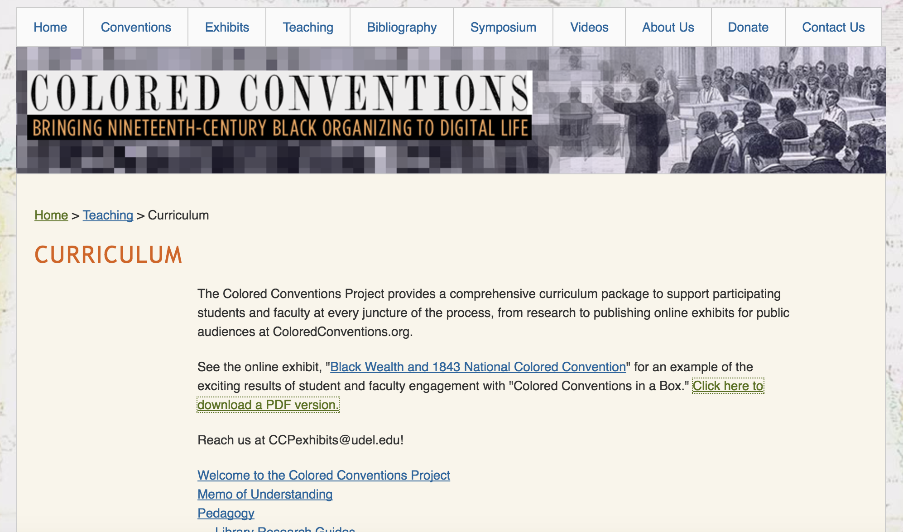
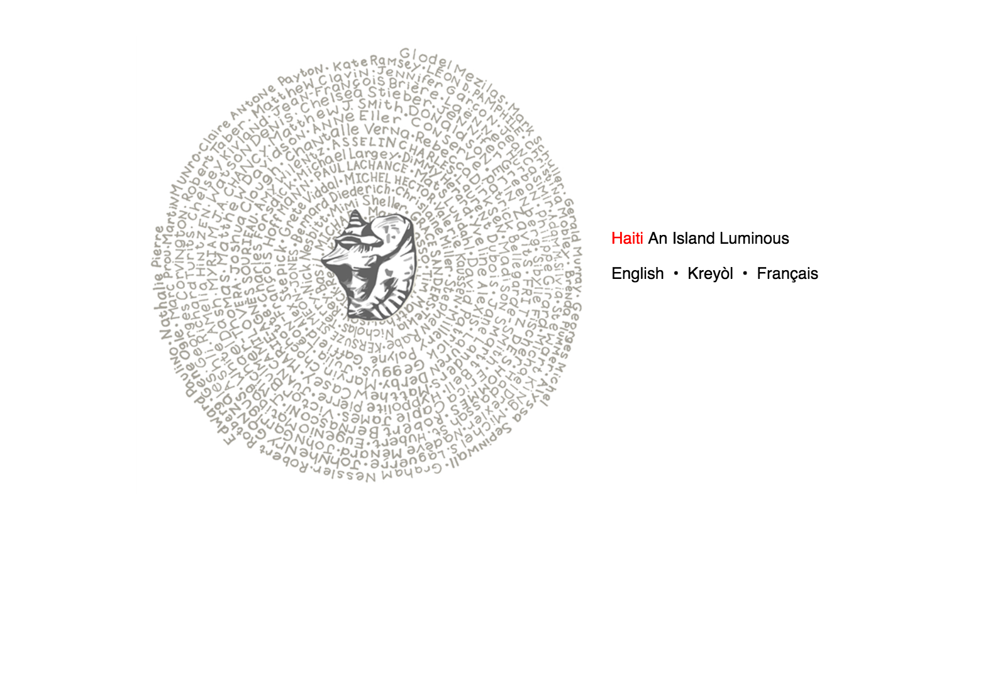
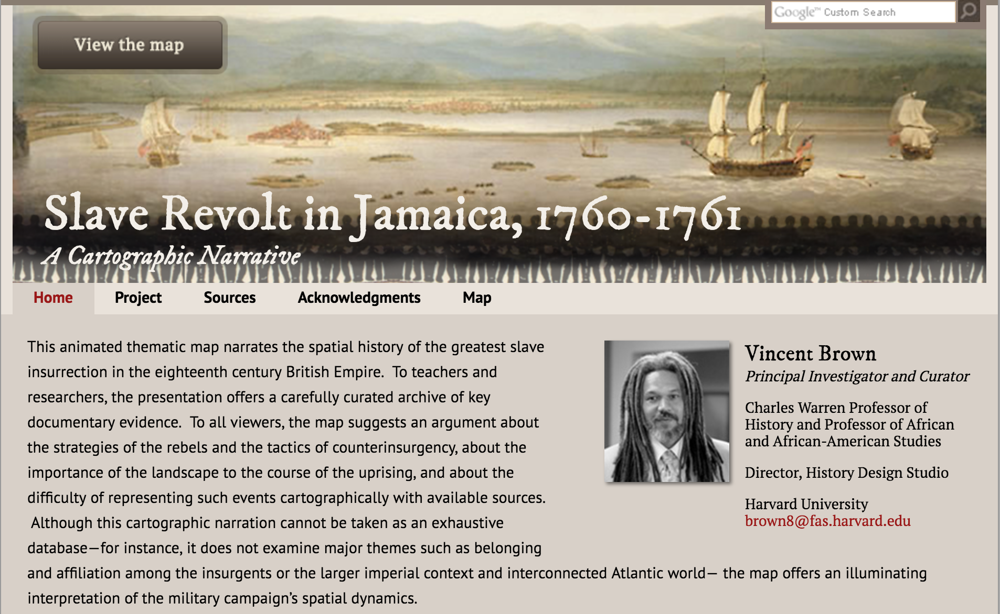
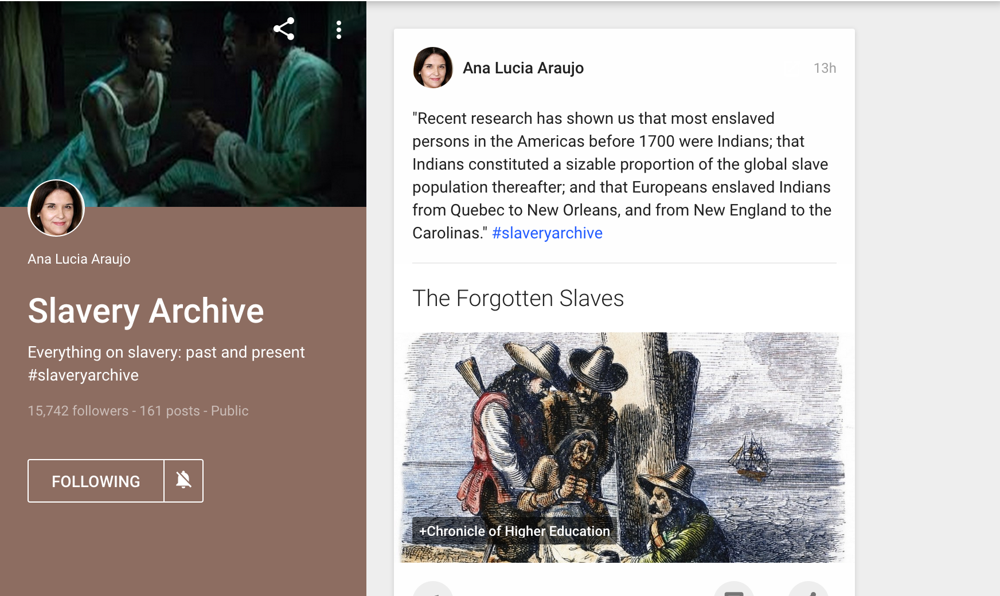
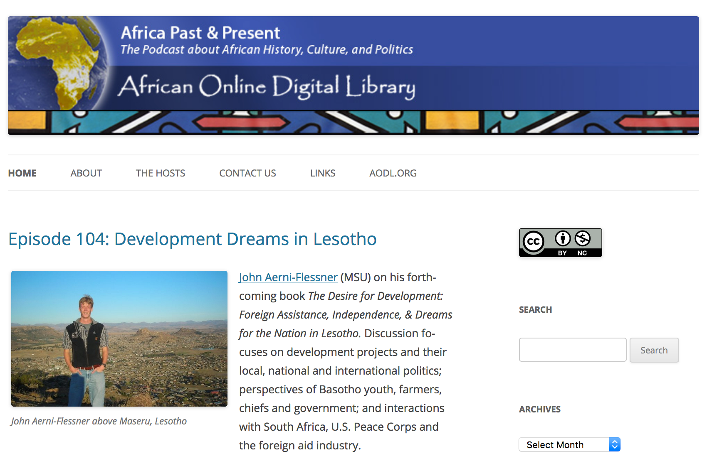
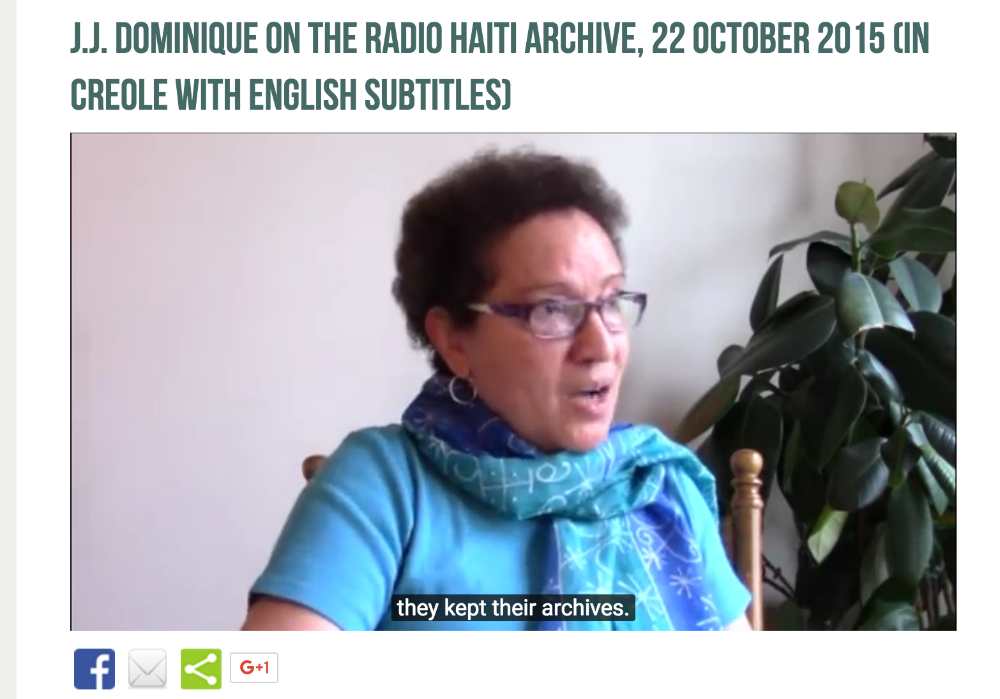
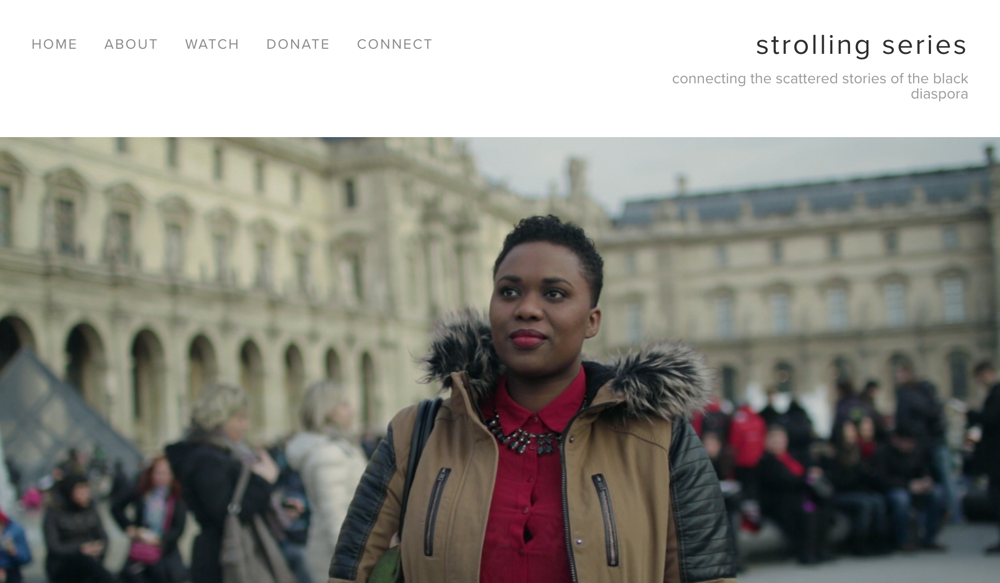

# DIASPORA (Draft)

## [Jessica Marie Johnson](http://jmjohnso.com)
Johns Hopkins University 

---

##### Publication Status:
* unreviewed draft
* draft version undergoing editorial review
* **draft version undergoing peer-to-peer review**
* published 

--- 

## Curatorial Statement

In 2001, African diaspora historian and Brazilianist/South Atlanticist Kim Butler described diaspora study as addressing five elements. The first element concerned the reasons for and conditions of dispersal, with an emphasis on the forced (structural or literal) dispersal of peoples from a place they identified as their homeland. The second and third elements concerned the relationship (fictive, biological, or otherwise articulated) between the diaspora and its homeland and hostland. The fourth and fifth elements concerned relationships internal to and between diaspora communities. Butler's goal, at the time, was to "identify categories of analysis relevant to all diasporas, regardless of size or type" To be certain, these five elements still have the potential to guide, disrupt, and cohere diaspora study, methodology, and thought in productive and generative ways. Omise'eke Tinsley, discussing the black queer diasporas of the Caribbean, brings much of this to life in her appropriation of Deleuze and Guattari's exposition of the _rhizome_ : "What vocabulary works for African diaspora grammars of gender and sexuality in the English-, French- and Dutch-based creoles that spread rhizomatically through the Americas' (former) slave societies?" 

To be explicit, however, as [this is not the moment for ambiguities](http://aswadiaspora.org/aswad-post-election/), diaspora means more than to spread, network, or engage multiple complexities. To draw on Edouard Glissant describing the "subterraneous convergence of histories" revealed by the Caribbean archipelago, diaspora also evokes things hidden, trailing, and drowned. Diasporas exist and come into existence out of power and violence. Diasporic subjects, as a result, take on many forms, from liberated beings who, as Scottish-Zambian singer Emeli Sandé crooned,  thrive by ["breathing underwater"](http://genius.com/Emeli-sande-breathing-underwater-lyrics) to metahumans who, as Somali-Canadian poet K'Naan [mused](http://genius.com/Knaan-snow-tha-product-riz-mc-and-residente-immigrants-we-get-the-job-done-lyrics), find themselves "sailing on graves," brave but caught between and amid waves of migration. Diaspora is not seduced by the promise of a home/hostland, never stops seeing the missing, the dead, or the dispersed ("don't think I didn't notice those tombstones disguised as waves"), is incessant in its longing. Attuned always to those lost beneath the sea, silenced in archives, or disappeared behind electrified carceral fences, diaspora work means working with the living and the dead without knowing who is here, who is gone for now or gone forever. 

How to capture these diverse and dispersed elements of diasporic life and thought online? What do digital tools, media, or technology offer in opening up thinking around diaspora, histories of dispersed communities, and cultures created from dispersion? 

Darlene Clark Hine describes the five characteristics of a black studies mind as intersectionality, non-linear thinking, diasporic perspectives and comparative analyses, oppression and resistance, and solidarity (Hine). These likewise describe key elements of diaspora study and can be helpful in how diaspora study can translate into the digital. Non-linear thinking is especially important to those doing work on diaspora and the digital lends itself well to elucidating this. Non-linearity captures elements of fluidity, dispersal, mobility, and resilience/resistance, alongside violence and the embodiment of violence (structural, personal, and intimate); force (involuntariness) and non-consent on macro as well as micro levels; loss and hauntings (echoes); and the themes of heartbreak, absence and silence that appear and reappear in diaspora work. 

In curating artifacts for the keyword diaspora, it is easy to become lost in minutiae. In the end, instead of diverting into and through the history of the many diasporas that have existed and continue to exist in human history, this list holds one diaspora experience constant--the African diaspora. The historical content of each of the artifacts emerges out of the historic and centuries long displacement of people of African descent, most notably during the period of Atlantic slavery from the mid-fifteenth century into the second half of the nineteenth century. Each artifact was also chosen facing fully the reality that there is no mainstream baseline for the study of Africa or its diaspora. When it comes to the study of the African continent, subjects of African descent, or histories of slavery, race and empire, students enter the (digital) classroom or encounter (digital) texts with preconceived notions of what they will find. Whether it means confronting Gone With the Wind generated fantasies of U.S. slavery populated by hoop skirts and black servants; myths of pathology and underdevelopment in places like Haiti; or the pernicious and persistent interpretation of Africa as a country and not a diverse and massive continent with many complex histories, teachers will find that students do not often agree on what "Africa" means, much less have a handle on how to understand "diaspora." The artifacts chosen were chosen with an eye toward confronting this lack of understanding head on through a range of material from first-person testimonies, to data-rich archives and image visualizations of social and political histories, to audiovisual media capturing a wide-range of historical and cultural experiences. 

However, although each artifact is specific to the African diaspora experience, each artifact was also chosen for the way it elaborates on those five elements of diaspora as described by Butler. In other words, while the subject each artifact tackles is one specific to peopof African descent over time and place, each artifact's method, theory, and praxis illuminates something beyond the needs of one diaspora community. Each artifact demonstrates how the digital informs the study and formation of diasporic communities, and the practice of being diasporic. Each artifact engages in diasporic processes and the range of procedures is quite diverse. Once again, there can be no single, linear mode of engaging diaspora, no single definition of what diaspora is as a whole. Indeed, whether describing Jewish, Irish, or South Asian diasporas and diasporic formulations, the constituent elements of diaspora require multinodal thinking, non-linear humanistic formations, and a political praxis that is attuned to what has been pushed out, what has been deemed whole/canon/legitimate, what is silenced, and the violence inherent in making and breaking each of these as historical events. Diaspora, as these artifacts show, can be neither innocent nor voluntary. Diaspora suggests state, imperial, and therefore structural violence alongside beautiful and defiant resistance to dehumanization. How pedagogy grapples with the tension between these must be a crucial part of any digital diaspora practice today.

## Curated Artifacts 

### PEDAGOGY

#### Colored Conventions Curriculum

* Source URL: http://coloredconventions.org/curriculum#set
* Creator: The Colored Conventions Project Executive Committee  at the University of Delaware comprised of P. Gabrielle Foreman, Jim Casey, and Sarah Patterson

Described by the creators as "Colored Conventions in a Box," the aim of the curriculum materials of the Colored Conventions Project is to serve as a "curricular package that supports instructors as they engage in teaching that transforms the minutes of the convention they've chosen to teach into a rich and engaging series of cultural biographies and visual artifacts." The curriculum documents include memos of understanding for students and teachers, lesson plans, sample exercises and syllabi, and strategies for grading work using the convention material. The Colored Conventions Project is a digital archive and exhibit space documenting the "Colored Conventions," or the state and national conventions organized by free and fugitive people of African descent in the United States between 1830 and into the post-emancipation era. The project materials highlight a moment in history when the African diaspora in the United States fought for civil rights, to end chattel slavery, and over the meaning of freedom and citizenship. However, more than classroom exercises and pedagogy, the curriculum material is also corpus of best practices for students interested in engaging archival material, doing public history, using digital tools, and engaging in and with diverse subjects and sensitive topics. The members of the Colored Conventions team demonstrate the importance of reproduction, recreation, and innovation is to this project and satellite endeavors. Offering the project "in a box" exemplifies generosity and reproduction as political praxis, key elements of digital diaspora subjectivity.   
	
#### Decoloniality Sandbox

* Source URLs: http://www.yomairafigueroa.com/#/new-page-2/, readings at https://github.com/jmjafrx/diaspora/tree/master/Decoloniality%20Sandbox, and Twitter account at https://twitter.com/YFWoke
* Creator: Yomaira C. Figueroa, Michigan State University

The Decoloniality Sandbox is a collection of supplemental material created by Yomaira C. Figueroa to concide with the course she designed: Decoloniality, Diaspora, the Human. The course was first taught at Michigan State University as graduate seminar. Since then, Figueroa has made the promotional material for the course and the primary readings available online, and continues to discuss issues of decoloniality, diaspora, and the human using her Twitter account (@YFWoke). As a curated repository of readings, the Decoloniality Sandbox is useful to all those interested in what decolonial theory is and how it is used. In conjunction with Figueroa's offerings on decoloniality and Afrxdiasporic political thought online via Twitter, Figueroa provides and is an example of deconstructed/decolonial diaspora practices at work. Students will find the reading useful and important, graduate student will find Figueroa's broader practice useful as a model.

#### Haiti: An Island Luminous

* Creator: Created by Adam M. Silva, hosted by the Digital Library of the Caribbean

Haiti: An Island Luminous is a digital project that functions as a learning activity for users interested in learning about the history of the island of Haiti. The site is available in English, Kreyòl, and French. A guided tour moves users through the prehistory and colonization of the island by Spanish and then the French, across time and space to the present moment (circa 2013). Links on the site guide users to archival materials and reference articles by scholars from around the world. As an in-class activity or outside of class assignment, Haiti: An Island Luminous is an excellent use of digital tools to provide an overview of a nation with a complex history. It is also an important example of how digital can be used as a form of public history to introduce those unfamiliar to people and places often left out of mainstream, Western historical narratives--a key preoccupation of diaspora praxis and political thought. 

### RESOURCES 

#### Slave Revolt in Jamaica, 1760-1761: A Cartographic Narrative

* Source URL: http://revolt.axismaps.com/
* Creator: Vincent Brown, Principal Investigator and Curator, Harvard University

The Slave Revolt in Jamaica Project is an "animated thematic map" that "narrates the spatial history of the greats slave insurrection in the eighteenth century British Empire." In 1760, Africans in St. Mary's Parish of Jamaica, led by Tacky, rose up against their owners. The revolt set off a chain reaction of events which the project outlines. The project is relevant as a tool highlighting a critical event in African diaspora history, but, again, this project does more than narrate history. Slave Revolt in Jamaica uses an 18th century map of the island to capture the geospatial politics of the island and the massive impact of the uprising, as well as capture the micropolitics of resistance by highlighting treacherous terrain crossed. The animation likewise brings both the macro and micro together by articulating the flow of rebels and military response. It is crucial to teach the history of African diasporic resistance and revolt during the period of slavery, but it is often difficult to capture and express to students with little reference or foundational knowledge. This project could be used in an Atlantic slavery, Caribbean history or British empire course.

#### #SlaveryArchive

* Source URL: https://plus.google.com/collection/M-nyXB
* Creator: Ana Lucia Araujo, Founder/Curator, Howard University

The #slaveryarchive hashtag was created by Ana Lucia Araujo around 2014 to follow "news and initiatives related to the study of slavery in the past and the present." Since then, the #slaveryarchive hashtag has evolved into a community of historians, activists, teachers, and students from around the world sharing news items, primary sources, events, and other material related to the study of human bondage on social media (Twitter, Facebook, and Tumblr). The material ranges across time and space, and is truly global in nature, with links shared from across multiple continents and in several languages (English, French, Spanish, and Portuguese being the most common). In 2016, Araujo created the Slavery Archive collection on Google Plus as a digital home for material being shared. It is an excellent example of African diaspora scholarship at work using a digital diasporic tool for dissemination of information and intellectual engagement. Teachers can access the #slaveryarchive for resources and course material, encourage students to engage in public history and engagement by sharing material on the hashtag or doing research on topics under discussion.

#### Africa Past & Present

* Source URL: http://afripod.aodl.org/
* Creator: Peter Alegi and Peter Limb, Michigan State University

Since 2008, Alegi and Limb have hosted academics, activists, artists, and more for their forty minute podcast on "history, culture, and politics in Africa and the diaspora." The podcast is the longest running podcast entirely devoted to African history and culture, recently celebrating its 100th podcast in April 2016. Each episode features an invited guest, providing listeners with a range of material rooted in historical research, rigorous critique, and recent news on cutting edges of issues specific to the African continent. For students with little to no exposure or access to news about Africa, the podcast series can serve as an introduction to the wide and broad diversity of issues related to the African continent. Africa Past & Present might serve as a resource for students, or teachers may assign specific episodes to students as a "reading" or part of an assignment. The podcast is also part of the [African Online Digital Library](http://aodl.org/), a library of several African history and culture related digital projects teachers and students may find useful to browse.

#### J.J. Dominique on the Radio Haiti archive, 22 October 2015 (in Creole with English subtitles)
 

* Source URL: http://radiohaitilives.com/j-j-dominique-on-the-radio-haiti-archive-22-october-2015/
* Creator: J. J. Dominique interviewed by Laura Wagner. Radio Haiti Archive was created by the Forum for Scholars and Publics at Duke University. The FSP is Laurent DuBois, Meagan Bonnell, and Margaret L. Brown.

This artifact is a video featuring J. J. Dominique discussing the important of the Radio Haiti archive, and the intentional archiving conducted by Jean Dominique and Michèle Montas during the years Radio Haiti broadcast. Radio Haiti offered a voice for political insurgency from its founding in the 1970s through Dominique's assassination in 2000, to its final broadcast in 2002. Dominique's description of how Dominque and broadcasters understood the importance of archives and making history, and their role in the same, is important pedagogical note for all studying diaspora. The video notes the lack of institutional structures to support archives and history in Haiti, and the political nature of documenting histories deemed illegitimate or insurgent by different political regimes. Dominique's testimony is also important as it outlines the methodology and praxis behind the Radio Haiti digitization and circulation itself. Radio Haiti's accessibility on YouTube and Soundcloud, and in multiple languages, are key elements of its accountability to the original broadcasters, Haiti's history, and present-day Haitians across the diaspora.

#### Anne and Cecile Emeke of the #StrollingSeries

* Source URL: http://www.strollingseries.com/theseries/
* Creator: Cecile Emeke, documentarian, director, writer, and artist; Interviewee: Anne (@frenchheaux), conducted in Paris

The #Strolling series is a series of short video documentaries created by documentarian, director, writer, and artist Cecile Emeke. In each video, Emeke interviews people of African descent about their experiences "strolling" through their respective locations. Cities featured include France, England, Italy, United States, Jamaica, and the Netherlands. The video picked for this artifact is of a woman named Anne describing her experience as a woman of African descent (French Caribbean descent) in Paris. This is an important artifact because it offers students a different perspective on diaspora and what it means, how racism and diaspora appear in different places in the present-day, and ways the constitutive elements of antiblackness and empire remain salient even in the present-day. Students will find Anne's description of le périphérique (the poor and largely non-white area of Paris) will be a reminder that diaspora is not just about spread and dispersal, it is also about forced migration and imposed boundaries as well. The series as a whole is an artifact and should be browse thoroughly.

### READING DIGITAL DIASPORA

#### Mapping Caribbean Cyberfeminisms
[!Mapping Caribbean Cyberfeminisms](images/MappingCaribbeanCyberfeminisms.png)

* Source URL: http://smallaxe.net/sxarchipelagos/issue01/haynes-mapping.html
* Creator: Tonya Haynes, Institute for Gender and Development Studies: Nita Barrow Unit, founder of Code Red for Gender Justice! and CatchAFyah Caribbean Feminist Network

Tonya Haynes is founder of one of the most important digital Caribbean feminist networks operating today: [the Red for Gender blog](https://redforgender.wordpress.com/) as well as the CatchAFyah Caribbean Feminist Network. Haynes, as someone operating in digital and diaspora activist spaces, offers an illuminating read of the development and reach of Caribbean feminism online. Students will find the essay useful as an overview of how digital diaspora operates, forms, and agitates on political issues (such as ending violence against women). The essay is part of the inaugural issue of the born-digital publication, [sx:archipelagos](http://smallaxe.net/sxarchipelagos/issue01/). sx:archipelagos aims to provide an independent space for peer-review, digital artifacts and research. Teachers can use Haynes, the Caribbean networks described in her essay, and sx:archipelagos more broadly as examples of how forming institutions and  self-determination remain crucial to diaspora subjectivity and retranslate online, as well as the role networks, networking, and circulation play in forming and creating division among diasporic subjects.

#### Black Haunts in the Anthropocene

* Source URL: http://blackhaunts.mp285.com/ 
* Creator: Marisa Parham, Amherst College and Director of Five Colleges Digital Humanities

This exhibit and pedagogical tool ends with Parham's digital essay "Black Haunts in the Anthropocene" as a challenge and exemplar of what diaspora does and is online. Parham's describes "Black Haunts in the Anthropocene" as a "pocket microsite" meant to coincide with a lecture, an analog book project, and as an introduction to interactivity. The pocket began with [an essay in response to a visualization of the slave trade by Ben Schmidt](http://mp285.com/black-anthropocene/) the visualization is [here](http://io9.com/a-map-of-19th-century-shipping-routes-and-nothing-else-1495012998) and developed into an interactive, multinodal site exploring diaspora, hauntings and rememory, and black subjectivity across the past and present. Several texts are utilized including the short film Pumzi, Toni Morrison's _Beloved_, as well as Scandal memes, and Facebook feeds. The range of texts and interdisciplinarity engaged is promiscuous and delicious. As a diaspora project, it captures the hypertextuality and multiplicity of diaspora endeavors. Black Haunts in the Anthropocene rebukes linearity; it is impossible to follow a single thread through the project and capture every image, post, and reflection. The hidden nodes in the project evoke maroon logics of placement, displacement, and Simone Browne's theory of "dark sousveillance." In doing so, the project also reveals much about what the digital can do for diaspora work, how diaspora does, does not, and chooses not to operate online, and suggests it may not be the straight line but the crooked that holds the richest possibility for escaping modality of technology and the humanities canon.
	
## RELATED MATERIALS

Association for the Study of the Worldwide African Diaspora," Post-Election Statement. November 28, 2016. http://aswadiaspora.org/aswad-post-election/

Brown, Vincent. “Podcast: ‘Designing Histories of Slavery for the Database Age.’” MIT Comparative Media Studies/Writing, February 27, 2016. http://cmsw.mit.edu/podcast-vincent-brown-designing-histories-of-slavery-for-the-database-age/.

Butler, Kim D. “Defining Diaspora, Refining a Discourse.” 10.2 (2001): 189-219.

Glover, Kaiama L., Alex Gil, and Kelly Baker Josephs. “Editors’ Introduction: The Caribbean Digital.” Sx Archipelagos, no. 1 (May 1, 2016). doi:10.7916/D81J99TR.

Parham, Marisa. Haunting and Displacement in African American Literature and Culture. Reprint edition. New York: Routledge, 2008.

## WORKS CITED

Africa is a Country. http://africasacountry.com/

African Online Digital Library. http://aodl.org/

Alegi, Peter and Peter Limb. Africa Past & Present Podcast. http://afripod.aodl.org/

Araujo, Ana Lucia. Slavery Archive. https://plus.google.com/collection/M-nyXB

Browne, Simone. Dark Matters: On the Surveillance of Blackness. Durham: Duke University Press, 2015.

Brown, Vincent. Slave Revolt in Jamaica, 1760-1761: A Cartographic Narrative. http://revolt.axismaps.com/

Colored Conventions Project. http://coloredconventions.org/curriculum#set.

Dash, J. Michael. The Other America: Caribbean Literature in a New World Context. University of Virginia Press, 1998.

Emeke, Cecile. The Strolling Series. http://www.strollingseries.com/theseries/

Figueroa, Yomaira C. http://www.yomairafigueroa.com/

Gilroy, Paul. The Black Atlantic: Modernity and Double Consciousness. New York: Verso, 1993.

Glissant, Edouard. Carribbean Discourse: Selected Essays. Charlottesville: University of Virginia Press, 1999.

Haiti: An Island Luminous. http://islandluminous.fiu.edu/

Haynes, Tonya. “Mapping Caribbean Cyberfeminisms.” sx:archipelagos, no. 1 (May 1, 2016). 

Hine, Darlene Clark. “A Black Studies Manifesto: Characteristics of a Black Studies Mind.” The Black Scholar 44.2 (2014): 11-15.

Johnson, E. Patrick, ed. No Tea, No Shade: New Writings in Black Queer Studies. Duke University Press, 2016.

K'naan, Snow Tha Product, Riz MC & Residente. “Immigrants (We Get The Job Done).” 2016. By Trooko. The Hamilton Mixtape. Atlantic Record Co, CD/MP3.

Matory, J. Lorand. Black Atlantic Religion: Tradition, Transnationalism, and Matriarchy in the Afro-Brazilian Candomblé. Princeton, N.J.: Princeton University Press, 2005.

McKittrick, Katherine. “I Entered the Lists‚ Diaspora Catalogues: The List, the Unbearable Territory, and Tormented Chronologies‚ Three Narratives and a Weltanschauung.” 17 (2007): 7-29.

McKittrick, Katherine and Clyde Woods, eds. Black Geographies and the Politics of Place. New York, NY: South End Press, 2007.

Parham. Black Haunts in the Anthropocene. http://blackhaunts.mp285.com/

Philip, Marlene Nourbese. “A Genealogy of Resistance”.” A Genealogy of Resistance: And Other Essays. Mercury Press, 1997.

Radio Haiti Archives. http://radiohaitilives.com/

Sandé, Emeli. “Breathing Underwater.” 2016. By Chris Loco. Long Live the Angels. Virgin Records, CD/MP3.

Spillers, Hortense J. “Mama’s Baby, Papa’s Maybe: An American Grammar Book.” Diacritics 17.2 (1987): 65-81.

sx:archipelagos. http://smallaxe.net/sxarchipelagos/

Tinsley, Omise’eke Natasha. Thiefing Sugar: Eroticism Between Women in Caribbean Literature. Duke University Press, 2010.

Weheliye, Alexander G. Habeas Viscus: Racializing Assemblages, Biopolitics, and Black Feminist Theories of the Human. Durham: Duke University Press Books, 2014.

Wynter, Sylvia. “On How We Mistook the Map for the Territory, and Reimprisoned Ourselves in Our Unbearable Wrongness of Being, of Desêtre: Black Studies toward the Human Project.” A Companion to African-American Studies, 2006, 107–118.
