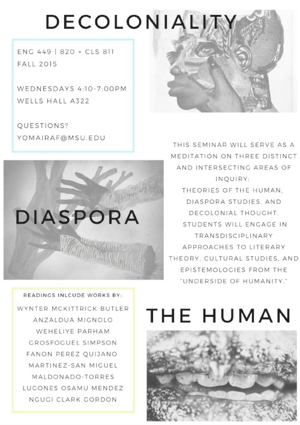
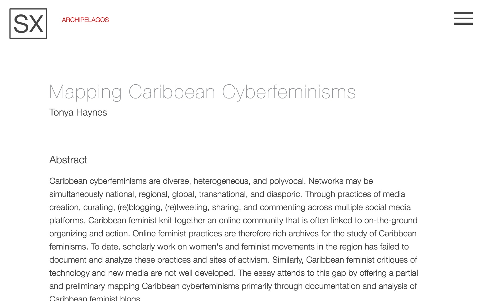

## Update April 1, 2020 - WE'RE LIVE!
*Digital Pedagogy in the Humanities* has emerged on its Modern Language Association platform in a beta form and being corrected live through June 2020. In light of the widespread move to online education at most universities, both the MLA staff and editors Davis, Gold, and Harris agreed that opening up the project in its post-peer review, copyedited state would be beneficial for everyone. Please join us in welcoming this long-standing project in its final platform into the world: [*Digital Pedagogy in the Humanities*(https://digitalpedagogy.hcommons.org/)

***************************

# Diaspora

### Jessica Marie Johnson

Johns Hopkins University | [http://jmjohnso.com](http://jmjohnso.com)

---

##### Publication Status:
* unreviewed draft
* draft version undergoing editorial review
* draft version undergoing peer-to-peer review
* draft version undergoing MLA copyediting
* awaiting pre-print copy
* **published** see [*Digital Pedagogy in the Humanities* MLA 2020](https://digitalpedagogy.hcommons.org/)

---

## CURATORIAL STATEMENT

This list holds one diaspora experience constant: the African diaspora. In 2001, African diaspora historian and Brazilianist/South Atlanticist Kim Butler described diaspora study as addressing five elements. The first element concerned the reasons for and conditions of dispersal, with an emphasis on the forced (structural or literal) dispersal of peoples from a place they identified as their homeland. The second and third elements concerned the relationship (fictive, biological, or otherwise articulated) between the diaspora and its homeland and hostland. The fourth and fifth elements concerned relationships internal to and between diaspora communities. 

However, Butler’s goal, at the time, was to “identify categories of analysis relevant to all diasporas, regardless of size or type” because to use the keyword diaspora means more than to spread, network, or engage multiple complexities (Butler 194). Diasporas exist and come into existence out of power and violence. To draw on Edouard Glissant and the “subterraneous convergence of histories” revealed by the Caribbean archipelago, diaspora also evokes things hidden, trailing, and drowned. Diasporic subjects, as a result, take on many forms, from liberated beings who, as Scottish-Zambian singer Emeli Sandé crooned, thrive by [“breathing underwater”](http://genius.com/Emeli-sande-breathing-underwater-lyrics) to metahumans who, as Somali-Canadian poet K’Naan [mused](http://genius.com/Knaan-snow-tha-product-riz-mc-and-residente-immigrants-we-get-the-job-done-lyrics), find themselves “sailing on graves,” brave but caught between and amid waves of migration. Diaspora is not seduced by the promise of a home/hostland; never stops seeing the missing, the dead, or the dispersed (“don’t think I didn’t notice those tombstones disguised as waves”); is incessant in its longing. Attuned always to those lost beneath the sea, silenced in archives, or disappeared behind electrified carceral fences, diaspora work means working with the living and the dead without knowing who is here, who is gone for now or gone forever. 

The artifacts below deepen students understanding of African and African diaspora history and present. When it comes to the study of the African continent, subjects of African descent, or histories of slavery, race, and empire, students often enter digital spaces and their physical classrooms with preconceived notions of what they will find. The artifacts below appear in a range of media, allowing instructors at all levels to choose artifacts for different kinds of learning experiences. Whether it means confronting the role of Confederate monuments in the United States, discussing disaster capitalism and underdevelopment in Haiti's history, or debunking stereotypes of Africa as a country as opposed to a diverse and massive continent with many complex histories, these artifacts offer rich historical context in a range of formats: from first-person testimonies, to digitized primary sources, to audiovisual online exhibits, to data visualizations, to YouTube videos and music. 

The artifacts below also use digital tools in fluid and non-linear ways, as well as more stable and traditional (analog) ways. It was crucial to include social media as both a digital tool and a digital praxis mirroring diaspora methods and experience of dispersal and kinship. It was also crucial to include artifacts that require more traditional reading practices and minimal computing acknowledging that a) bigger (data) doesn't necessarily mean more effective data, and that b) there are still parts of the global African diaspora where access to the internet is difficult or prohibitively expensive. Attuned to global accessibility, each of these artifacts can be accessed on readily available platforms, making this list useful to instructors in the global North and the global South.  

Diaspora evokes state, imperial, and therefore structural violence alongside beautiful and defiant resistance to dehumanization. How classrooms grapple with the tensions between these elements should be a crucial part of any digital pedagogy today. The artifacts below engage the centuries long displacement of people of African descent, most notably during the period of Atlantic slavery from the mid-fifteenth century into the second half of the nineteenth century, as one possible framework for teaching the tensions. 

## CURATED ARTIFACTS

### Pedagogy

#### Colored Conventions in a Box

* Source URL: [http://coloredconventions.org/items/show/316](http://coloredconventions.org/items/show/316)
* Artifact Permissions: CC BY-NC 4.0 International
* Copy of the Artifact: [Colored Conventions in a Box](https://github.com/jmjafrx/diaspora/blob/master/ColoredConventionsinaBox.pdf)
* Creator: The Colored Conventions Project Executive Committee at the University of Delaware comprised of P. Gabrielle Foreman, Jim Casey, and Sarah Patterson

Described by the creators as “Colored Conventions in a Box,” the aim of the curriculum materials of the Colored Conventions Project is to serve as a “curricular package that supports instructors as they engage in teaching that transforms the minutes of the convention they’ve chosen to teach into a rich and engaging series of cultural biographies and visual artifacts.” The curriculum includes memos of understanding for students and teachers, lesson plans, sample exercises and syllabi, and strategies for grading work using the convention material. Along with classroom exercises and pedagogy, the curriculum material models best practices for instructors interested in using the archival material on the site and teaching  diverse subjects or sensitive topics. Instructors can use the curriculum as-is alongside the Colored Conventions Project or adapt elements (like the "memo of understanding") to guide students developing their own projets.
	
#### Decoloniality Sandbox

* Source URLs: [http://www.yomairafigueroa.com/#/new-page-2/](http://www.yomairafigueroa.com/#/new-page-2/)
* Artifact Permissions: Forthcoming
* Copy of the Artifact: [Decoloniality Sandbox](https://github.com/jmjafrx/diaspora/tree/master/Decoloniality%20Sandbox)
* Creator: Yomaira C. Figueroa, Michigan State University

The Decoloniality Sandbox is a collection of supplemental material created by Yomaira C. Figueroa to coincide with the course she designed: Decoloniality, Diaspora, the Human. The course was first taught at Michigan State University as graduate seminar. Figueroa made  certain material for the course available online via Dropbox. As a curated repository of readings on Dropbox, students or instructors can draw from the Decoloniality Sandbox for readings in decolonial theory. Instructors can also use the "sandbox" model to create their own public repositories using Dropbox. Figueroa also taught from the sandbox on Twitter. A sample exercise might be for students to host a public Twitter chat on a reading from the sandbox. Students would advertise the chat, circulate flyers online for it, solicit guest speaker-Tweeters, and then engaging with each other and a broader public during the chat as a practice of decolonial pedagogy.

#### #SlaveryArchive

* Source URL: [http://analuciaaraujo.tumblr.com/](http://analuciaaraujo.tumblr.com/)
* Artifact Permissions: Forthcoming
* Copy of the Artifact: N/A
* Creator: Ana Lucia Araujo, Founder/Curator, Howard University

The #slaveryarchive hashtag was created by Ana Lucia Araujo around 2014 to follow “news and initiatives related to the study of slavery in the past and the present.” Since then, the #slaveryarchive hashtag has evolved into a community of historians, activists, teachers, and students from around the world sharing news items, primary sources, events, and other material related to the study of human bondage. The material ranges across time and space, is global in context, and links are shared from across multiple continents and in several languages (English, French, Spanish, and Portuguese being the most common). Students can follow the #slaveryarchive for resources and course material, or participate by sharing material on it or doing research on topics under discussion. Instructors in courses on slavery, public history, and memory can list the #slaveryarchive hashtag on their syllabus as a resource and ask students to report back each week on what they've found.

### Readings 

#### Mapping Caribbean Cyberfeminisms

* Source URL: [http://smallaxe.net/sxarchipelagos/issue01/haynes-mapping.html](http://smallaxe.net/sxarchipelagos/issue01/haynes-mapping.html)
* Artifact Permissions: CC by 4.0
* Copy of the Artifact: [Haynes Article](https://github.com/jmjafrx/diaspora/blob/master/haynes-mapping.pdf)
* Creator: Tonya Haynes, Institute for Gender and Development Studies: Nita Barrow Unit, founder of Code Red for Gender Justice! and CatchAFyah Caribbean Feminist Network

Tonya Haynes is founder of one of the most important digital Caribbean feminist networks operating today: [the Red for Gender blog](https://redforgender.wordpress.com/) as well as the CatchAFyah Caribbean Feminist Network. Haynes, as someone operating in digital and diaspora activist spaces, offers an illuminating read of the development and reach of Caribbean feminism online. The essay is part of the inaugural issue of the born-digital publication, [sx:archipelagos](http://smallaxe.net/sxarchipelagos/issue01/). sx:archipelagos provides an independent space for peer review, digital artifacts, and research. Instructors can assign it as a reading in digital humanities, Caribbean, and communications courses and students will find the essay useful as an overview of how digital diasporas operate, form, and organize around political issues (like ending violence against women). 

#### Black Haunts in the Anthropocene

* Source URL: [http://blackhaunts.mp285.com/](http://blackhaunts.mp285.com/)
* Artifact Permissions: Forthcoming
* Copy of the Artifact: N/A
* Creator: Marisa Parham, Amherst College and Director of Five Colleges Digital Humanities

Parham’s describes “Black Haunts in the Anthropocene” as a “pocket microsite” that accompanies  a lecture, an analog book project, and a series of blog posts. The pocket began with [an essay in response to a visualization of the slave trade by Ben Schmidt](http://mp285.com/black-anthropocene/) and developed into an interactive, multinodal site exploring diaspora, hauntings, and black subjectivity across the past and present. Several texts are discussed including the short film, *Pumzi* and Toni Morrison’s *Beloved*, and varied digital media is explored (memes, Facebook feeds). This artifacts is also a Scalar project, a platform that allowed Parham to create non-linear reading flows. Instructors using Scalar can assign the site to students as a model. Instructors might also assign students the task of following the narrative and documenting their ability or inability to follow a single thread through the text and capture each image, post, or reflection. 
	
### Resources/Exercises
#### Haiti: An Island Luminous

* Source URL: [http://islandluminous.fiu.edu/](http://islandluminous.fiu.edu/)
* Artifact Permissions: Checking on the CC license
* Copy of the Artifact: N/A
* Creator: Created by Adam M. Silva, hosted by the Digital Library of the Caribbean

Haiti: An Island Luminous is a digital project that functions as a learning activity for users interested in learning about the history of the island of Haiti. The site is available in English, Kreyòl, and French. A guided tour moves users through the prehistory and colonization of the island by Spanish and then the French, across time and space to the present moment (circa 2013), with links to archival materials and reference articles by scholars from around the world. It is an example of how digital pedagogy and public history come together to introduce student-users to people and places often left out of mainstream, Western historical narratives. This artifact functions as an in-class activity or outside of class assignment for instructors looking to provide an overview of a nation with a complex history. 

#### Slave Revolt in Jamaica, 1760–1761: A Cartographic Narrative

* Source URL: [http://revolt.axismaps.com/](http://revolt.axismaps.com/)
* Artifact Permissions: Forthcoming
* Copy of the Artifact: N/A
* Creator: Vincent Brown, Principal Investigator and Curator, Harvard University

The Slave Revolt in Jamaica Project is an “animated thematic map” that “narrates the spatial history of the greats slave insurrection in the eighteenth century British Empire.” In 1760, Africans in St. Mary’s Parish of Jamaica, led by Tacky, rose up against their owners. The revolt set off a chain reaction of events which the project outlines. It uses an 18th century map of the island to capture the geospatial politics of the island and the massive impact of the uprising, and animation to highlight the treacherous terrain rebels crossed. Students can explore the site to learn more about the rebellion or about African diasporic resistance during the period of slavery more broadly. Instructors can assign it as a "reading" by itself or in conjunction with other texts. This project could be used in an Atlantic slavery, Caribbean history, or British empire courses.

#### Africa Past & Present

* Source URL: [http://afripod.aodl.org/](http://afripod.aodl.org/)
* Artifact Permissions: CC BY-NC 3.0 US
* Copy of the Artifact: N/A
* Creator: Peter Alegi and Peter Limb, Michigan State University

Since 2008, Alegi and Limb have hosted academics, activists, artists, and more for their forty minute podcast on “history, culture, and politics in Africa and the diaspora.” The podcast is the longest running podcast entirely devoted to African history and culture, recently celebrating its 100th podcast in April 2016. For students with little to no exposure or access to news about Africa, the podcast series can serve as an introduction to the wide and broad diversity of issues related to the African continent. The podcast is also part of the [African Online Digital Library](http://aodl.org/), a library of several African history and culture related digital projects teachers and students may find useful to browse. Instructors may choose to assign specific episodes to students as a “reading” or part of a larger assignment. Students can also be assigned research projects, comparing podcasts on different countries in the podcast archive itself.

#### J.J. Dominique on the Radio Haiti archive, 22 October 2015 (in Creole with English subtitles)

 

* Source URL: [http://radiohaitilives.com/j-j-dominique-on-the-radio-haiti-archive-22-october-2015/](http://radiohaitilives.com/j-j-dominique-on-the-radio-haiti-archive-22-october-2015/)
* Artifact Permissions: Forthcoming
* Copy of the Artifact: N/A
* Creator: J. J. Dominique interviewed by Laura Wagner. Radio Haiti Archive was created by the Forum for Scholars and Publics at Duke University. The FSP is Laurent DuBois, Meagan Bonnell, and Margaret L. Brown.

This artifact is a YouTube video featuring J. J. Dominique discussing the Radio Haiti archive, from tapes kept by Jean Dominique and Michèle Montas, the original broadcasters through the Soundcloud archive being digitized at Duke University. Radio Haiti offered a voice for political insurgency from its founding in the 1970s through Jean Dominique’s assassination in 2000, to its final broadcast in 2002. J. J. Dominique notes the lack of institutional support for archives in Haiti and the danger of documenting history as political regimes changed. Dominique also outlines the methodology and praxis behind Radio Haiti's digitization and circulation, noting the ways Radio Haiti’s accessibility on YouTube and Soundcloud, and in multiple languages, is part of the digital project's accountability to the original broadcasters. Dominique’s oral history of the Radio Haiti archive can be assigned as a reading to students in digital history, archive, and library courses. 

#### flâner | ep 4 | le périphérique, beauty school, fake deep, sexual expression, religion & more

* Source URL: [https://www.youtube.com/watch?v=Q5qyXZ46qBw&list=PLpwJsNR8PZ6OA49TdKBgjA1iFALTfzJih&index=4](https://www.youtube.com/watch?v=Q5qyXZ46qBw&list=PLpwJsNR8PZ6OA49TdKBgjA1iFALTfzJih&index=4)
* Artifact Permissions: Forthcoming
* Copy of the Artifact: N/A
* Creator: Cecile Emeke, documentarian, director, writer, and artist; Interviewee: Anne (@frenchheaux), conducted in Paris

This artifact is an interview with a woman named Anne describing her experience as a woman of African descent (French Caribbean descent) in Paris. The #Strolling series is a series of short video documentaries created by documentarian, director, writer, and artist, Cecile Emeke. In each video, Emeke interviews people of African descent about their experiences “strolling” through their respective locations. This is artifact offers students a different perspective on diaspora and what it means, how racism and diaspora appear in different places in the present-day, and ways the constitutive elements of antiblackness and empire remain salient even in the present-day. Students assigned this artifact in a course on Europe, communications, or African diaspora can watch it as a reading alone or alongside other readings on race in Europe. 

## RELATED MATERIALS

Association for the Study of the Worldwide African Diaspora,” Post-Election Statement. November 28, 2016. [http://aswadiaspora.org/aswad-post-election/](http://aswadiaspora.org/aswad-post-election/)

Brown, Vincent. “Podcast: ‘Designing Histories of Slavery for the Database Age.’” MIT Comparative Media Studies/Writing, February 27, 2016. [http://cmsw.mit.edu/podcast-vincent-brown-designing-histories-of-slavery-for-the-database-age/.](http://cmsw.mit.edu/podcast-vincent-brown-designing-histories-of-slavery-for-the-database-age/.)

Butler, Kim D. “Defining Diaspora, Refining a Discourse.” *Diaspora* 10.2 (2001): 189–219.

Glover, Kaiama L., Alex Gil, and Kelly Baker Josephs. “Editors’ Introduction: The Caribbean Digital.” Sx Archipelagos, no. 1 (May 1, 2016). [doi:10.7916/D81J99TR](http://smallaxe.net/sxarchipelagos/issue01/editors-introduction.html_)

Parham, Marisa. *Haunting and Displacement in African American Literature and Culture.* Reprint edition. New York: Routledge, 2008.

## WORKS CITED

Africa is a Country. [http://africasacountry.com/](http://africasacountry.com/)

African Online Digital Library. [http://aodl.org/](http://aodl.org/)

Alegi, Peter and Peter Limb. Africa Past & Present Podcast. [http://afripod.aodl.org/](http://afripod.aodl.org/)

Araujo, Ana Lucia. Slavery Archive. [https://plus.google.com/collection/M-nyXB](https://plus.google.com/collection/M-nyXB)

Browne, Simone. *Dark Matters: On the Surveillance of Blackness*. Durham: Duke University Press, 2015.

Brown, Vincent. Slave Revolt in Jamaica, 1760–1761: A Cartographic Narrative. [http://revolt.axismaps.com/](http://revolt.axismaps.com/)

Colored Conventions Project. [http://coloredconventions.org/curriculum#set.](http://coloredconventions.org/curriculum#set.)

Dash, J. Michael. *The Other America: Caribbean Literature in a New World Context*. University of Virginia Press, 1998.

Emeke, Cecile. The Strolling Series. [http://www.strollingseries.com/theseries/](http://www.strollingseries.com/theseries/)

Figueroa, Yomaira C. [http://www.yomairafigueroa.com/](http://www.yomairafigueroa.com/)

Gilroy, Paul. *The Black Atlantic: Modernity and Double Consciousness*. New York: Verso, 1993.

Glissant, Edouard. *Carribbean Discourse: Selected Essays*. Charlottesville: University of Virginia Press, 1999.

Haiti: An Island Luminous. [http://islandluminous.fiu.edu/](http://islandluminous.fiu.edu/)

Haynes, Tonya. “Mapping Caribbean Cyberfeminisms.” *sx:archipelagos*, no. 1 (May 1, 2016). 

Hine, Darlene Clark. “A Black Studies Manifesto: Characteristics of a Black Studies Mind.” *The Black Scholar* 44.2 (2014): 11–15.

Johnson, E. Patrick, ed. *No Tea, No Shade: New Writings in Black Queer Studies*. Duke University Press, 2016.

K’naan, Snow Tha Product, Riz MC & Residente. “Immigrants (We Get The Job Done).” 2016. By Trooko. *The Hamilton Mixtape.* Atlantic Record Co, CD/MP3.

Matory, J. Lorand. *Black Atlantic Religion: Tradition, Transnationalism, and Matriarchy in the Afro-Brazilian Candomblé*. Princeton, N.J.: Princeton University Press, 2005.

McKittrick, Katherine. “I Entered the Lists‚ Diaspora Catalogues: The List, the Unbearable Territory, and Tormented Chronologies‚ Three Narratives and a Weltanschauung.” *XCP: Cross Cultural Poetics* 17 (2007): 7–29.

McKittrick, Katherine and Clyde Woods, eds. *Black Geographies and the Politics of Place*. New York, NY: South End Press, 2007.

Parham. Black Haunts in the Anthropocene. [http://blackhaunts.mp285.com/](http://blackhaunts.mp285.com/)

Philip, Marlene Nourbese. “A Genealogy of Resistance.” *A Genealogy of Resistance: And Other Essays*. Mercury Press, 1997.

Radio Haiti Archives. [http://radiohaitilives.com/](http://radiohaitilives.com/)

Sandé, Emeli. “Breathing Underwater.” 2016. By Chris Loco. *Long Live the Angels.* Virgin Records, CD/MP3.

Spillers, Hortense J. “Mama’s Baby, Papa’s Maybe: An American Grammar Book.” *Diacritics* 17.2 (1987): 65–81.

*sx:archipelagos* [http://smallaxe.net/sxarchipelagos/](http://smallaxe.net/sxarchipelagos/)

Tinsley, Omise’eke Natasha. *Thiefing Sugar: Eroticism Between Women in Caribbean Literature*. Duke University Press, 2010.

Weheliye, Alexander G. *Habeas Viscus: Racializing Assemblages, Biopolitics, and Black Feminist Theories of the Huma*. Durham: Duke University Press Books, 2014.

Wynter, Sylvia. “On How We Mistook the Map for the Territory, and Reimprisoned Ourselves in Our Unbearable Wrongness of Being, of Desêtre: Black Studies toward the Human Project.” *A Companion to African-American Studies* 2006, 107–118.
