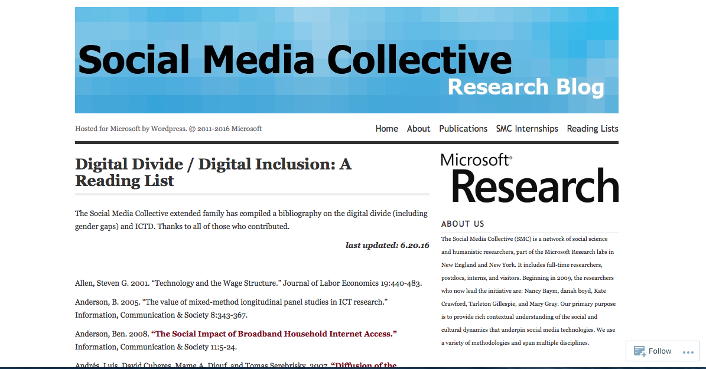
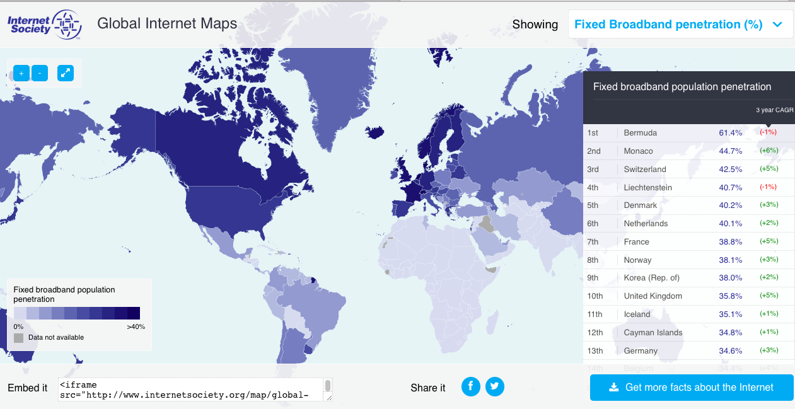

# DIGITAL DIVIDES

## Annemarie Perez
California State University-Dominguez Hills | [Website](Website)

---

##### Publication Status:
* unreviewed draft
* **draft version undergoing editorial review**
* draft version undergoing peer-to-peer review
* published 

--- 

REBECCA: Editorial comments by Rebecca Frost Davis are included inline below following "REBECCA:" for each paragraph of feedback. I begin with overall feedback before the curatorial statement, then add more inline comments mostly following the paragraph to which the feedback applies.

## CURATORIAL STATEMENT

REBECCA:  This keyword provides a good introduction to the concept of digital divides, models, and resources.  In your artifacts, there is a clear trend towards experiential learning and helping students reflect on then move past their own experience of the digital.  You might highlight that as a theme.  You might also discuss why digital divides lends itself to problem-solving and service learning. You also might consider the order of your artifacts.  The [template](https://github.com/curateteaching/digitalpedagogy/blob/master/keywords/!template.md) asks that you "order the artifacts purposefully -- either alphabetically (according to title or author) or in an order that denotes a different taxonomy (e.g., from beginner to expert level use).”  It seems that for this keyword it might be helpful to think about an order from beginning to advanced student and speak to that order in the curatorial statement.

 
In January of 2015, President Obama made the statement "Today highspeed broadband is not a luxury, it's a necessity." Yet as he said this and in the Council of Economic Advisors Issue Brief, it is clear that high speed broadband is not available to all people either on the planet or in the United States. The term "digital divide," in its singular form, is generally used to denote divides in access and usage of technology, especially information technology / the Internet for reasons such as poverty, disability, age and / or rural lack of access. This divide is discussed in global terms as the divide between the so-called "developed" or "first" world and "developing" or "third" worlds and within and between specific countries. It is used within countries to discuss this same division of access to information technology caused by economic, educational, age, racial and regional urban / rural access issues. The term came into widespread usage in the mid to late 1990s following a report titled "Falling Through the Net: A Survey of the 'Have Nots' in Rural and Urban America" by the National Telecommunications & Information Administration. The term "digital divides" was not explicitly used in the report, but through discussion of the subject, "digital divides" was coined and entered into political and then popular discourse (Graham).

REBECCA: The paragraph above provides a good introduction and history of a term that may be unfamiliar to many.

When I first started teaching and discussing ”digital divide" in its singular form I focused on issues of global and United States-based national economic and racial disparity and how these related to conceptions of and access to the Internet and its usage. The course was one in digital rhetoric taught at a predominantly white private Jesuit college in California concerned with social justice on a global and local level. However, general thinking and my own specifically can be said to have evolved into one of intersecting “digital divides” (plural). The importance of understanding "digital divides" as a multitude of intersecting circumstances became all the clearer to me when I moved to teaching at a majority minority state university campus that served primarily first generation college students in urban Los Angeles and realized for many of my students, their mobile phone’s data plan represented their only off campus access to the Internet. It became clear to me that the causes for each divide are not discrete, but overlap creating situations where specific groups, for example, those who live in rural poverty without a high school diploma or any college education are far less likely to have high speed Internet access and / or the ability to use the Internet than a person who is urban, affluent and college educated (Pew). Digital divides also represent a space where race, ethnicity and class intersect (Grabill). These intersections create similar divides across differences, for example, a situation where a student in urban Detroit is unable to access the Internet to do their homework, in a similar way to one from rural south Texas.  

REBECCA: The template directs, "Unless it draws upon your first-person experience in the classroom, please limit the use of first person." While you are drawing on your first-hand experience, I'm not sure that you need to go into as much detail here--can you summarize the key point--the different ways that students at different types of institutions may or may not experience digital divides.

The topic of digital divides is vital to university education in the digital humanities in several respects. First because for most college students of traditional college age, especially those who live in the United States in the middle class or above, the privilege of available high-speed Internet access has been throughout their lives as present and invisible as their access to clean drinking water. In order to discuss problems as well as opportunities created by global technology's move to online environments, students must first become aware that this access is not universal on international, national or local levels (Schradie). Service learning where students work with communities with low Internet access is especially fruitful as classes specifically work on solving the multiple layers of problems both caused by and creating lack of Internet access (Tan). Service learning on issues of digital divides allows for practical learning outcomes in terms of digital skills learned and used and theoretical outcomes as students study and work with issues of intersecting oppressions across race, class and age relative to digital access and use. This adds to the learning outcome the teaching of social justice and the value of working in and with communities in order to experience and facilitate community learning.

REBECCA: It seems like your material points to how the topic of digital divides is vital to university education in general, not just in the digital humanities. Since this collection is focused around digital pedagogy, you do not need to limit yourself to the digital humanities classroom, though this topic does seem especially relevant there.

REBECCA: You cite multiple works in this paragraph; you might consider using signal phrases to introduce the authors/works.

These artifact selections were made with the undergraduate classroom and especially with work in service learning in mind. Five of them are syllabi created at colleges and universities for courses from first year composition to senior level capstone. They are all interdisciplinary, variously combining journalism, sociology, technology studies, communication, critical race studies and composition studies. The other resources: Pew survey data, maps, a reading list and video are meant to supplement course material. Because this is a subject where the divides are continually evolving as connectivity changes, it is expected that these resources are to be examples and ones which would require updating each time the material is taught.

REBECCA: In this final paragraph, you might include a sentence on the order of your artifacts.  Also, why does digital divides lend itself so readily to service learning?

## CURATED ARTIFACTS

REBECCA: Several of your artifacts might instead belong on the list of related works:
* Pew resources
* TED talk
* Digital Divide reading lists

REBECCA: Acceptable "pedagogical artifacts may include (but are not limited to) syllabi, teaching guidelines, assignments, lesson plans, course sites, learning objective, collaborative projects, and even student work. A balanced variety of artifacts types is optimal." --[Template](https://github.com/curateteaching/digitalpedagogy/blob/master/keywords/!template.md#curated-artifacts-ten-artifacts-each-with-metadata-a-screenshot-and-a-150-word-annotation)

REBECCA: I appreciate that you are pulling material from multiple instructors and don’t want to repeat two artifacts from the same instructor, but some of these seem rich, e.g., would love to see the service learning assignment that goes along with the technology autobiography.  What about examples of student work in response to some of these prompts, e.g., the Scalar books mentioned as part of "Race and the Digital".  Since so much digital divides work is intrinsically linked to demographics are there examples of courses or assignments working with data?  Any of students doing mapping?

REBECCA: Consider ordering your artifacts deliberately--the order isn't discussed in the curatorial statement and isn't clearly evident to me.

###  Access and the Digital Divide

* Artifact Type: Assignment
* Source URL: [https://canvas.instructure.com/courses/910884/assignments/3304735](https://canvas.instructure.com/courses/910884/assignments/3304735) 
* Artifact Permissions: Copyright Ingrid Sturgis
* Copy of the Artifact:  author is sending a revision
* Creator and Affiliation: Ingrid Sturgis, Howard University

This artifact is an assignment appropriate for undergraduate students as an introduction to the ideas of digital divides as related to access to the Internet and digital technology in the United States and to an understanding of what the divides are and their effects. The assignment encourages students to explore the topic and start to consider what is possible, what could and/or should be done to bridge these divides. This assignment is important because it has students read and use current journalism and online sources to start their research on digital divides. This is significant because for students on the fortunate sides of the digital divides, high speed Internet may be as taken for granted as a basic utility in first world spaces. This assignment could be used early in a discussion of digital divides as a way to both understand what some specific divides are, and also explore their intersections. It is an assignment that can and should be updated with current information from, for example, current survey information from the Pew Research Center and examples of recent journalism. 

REBECCA: This annotation offers good details, e.g., level of use, learning outcome, and advice on reuse and updating it. Could you revise to shorten it from 180 words to 150 or less?

### Decreasing the Digital Divide Through Local Composition

* Artifact Type: Collaborative lesson site
* Source URL: [http://www.rhetcomp.gsu.edu/~mhocks/technology/digital_divide2.htm](http://www.rhetcomp.gsu.edu/~mhocks/technology/digital_divide2.htm ) 
* Artifact Permissions: Copyright Carrie Vogel 
* Copy of the Artifact:  
* Creator and Affiliation: Carrie Vogel, Georgia State University

This artifact is a multi-part, semester-long series of assignments to go along with service learning as part of a first year composition course. Digital divides as a subject deals with a "have" and "have not" split, with a multitude of reasons for different access, reasons which intersect across race, class, age and other issues of demographics. While classroom study of the subject of digital divides is important, working on the issues surrounding it from the service learning position of trying to understand the problems that both create lack of access and also caused by them, and then attempt to solve some part of these problems can further reveal the issue's complexity. The course sequence has students starting with themselves by writing a technical autobiography in order to understand the position of information technology in their lives. The students move from this self-positioning into a service learning component that shifts focus to underserved people through the use of interviews. The course culminates with a reflection on the students' experiences and those of the people they worked with discussing how their work shrinks the digital divide.  

REBECCA: In the phrase "that both create lack of access and also caused by them”—unclear antecedent for “them”.  Consider adding punctuation to this complex compound sentence to clarify it.

REBECCA: This offers the second example with reflection. I like the  linking to student’s personal experience. It would be nice if any of the results (the actual reflections were available).  You might flip the annotation with description of assignment sequence first then the analysis of its effects.

### Digital Diversity Syllabus

* Artifact Type: Syllabus
* Source URL: [http://www.jasonfarman.com/wsb3566636401/index.html](http://www.jasonfarman.com/wsb3566636401/index.html) 
* Artifact Permissions: Copyright Jason Farman
* Copy of the Artifact:  [Digital Diversity Syllabus](files/digital_divides-Farman_418b_2012_Syllabus.pdf)  
* Creator and Affiliation: Jason Farman, University of Maryland, College Park

This artifact is the syllabus of a semester length course examining the social and cultural impact of electronic media. Students accomplish this examination by spending a significant part of the semester exploring and participating in an electronic community while keeping a weekly journal and drawing connections between their experiences in this online community and assigned course readings. The assigned readings for the class include foundational texts about relationships between digital technology and demographic issues of race, gender and class, and current works of journalism. Along with and following on their community experiences, students will then design and create websites for their assigned groups to share and display their journal content. In addition to these journal and website assignments, the course also calls for a traditional research paper looking at academic research on the subject. The course is significant in its combining of digital divides study with the exploration of online communities and the creation of digital research content. 

REBECCA: This artifact provides another compelling example of experiential learning.

### Digital Divide / Digital Inclusion: A Reading List

* Artifact Type: Reading List
* Source URL: [https://socialmediacollective.org/reading-lists/digital-divide-digital-inclusion-a-reading-list/](https://socialmediacollective.org/reading-lists/digital-divide-digital-inclusion-a-reading-list/)
* Artifact Permissions: Copyright Microsoft 
* Copy of the Artifact:  
* Creator and Affiliation: Social Media Collective, Microsoft Research Labs

This reading list is a useful source for scholarly research on the subject of digital divides and how these ideas have evolved over time. The list includes publications going back to the late 1990s up through the present -- though the reading list is strongest up through 2010. There is a diversity of content on the issue with many of the resources discussing digital divides on a global level, thereby breaking out of the topic's frequently United States-centric sources. This collected and list of scholarly books and articles could be used as a resource in constructing a syllabus and further in a course setting. While individual sources could be integrated into the class as assigned readings, another use of the materials would be to share the list with students and encourage them to add to the list by annotating some of the sources. It could also be used in conjunction with works of journalism to explain to students the differences between scholarly and popular sources.

REBECCA: I’m concerned about the permissions issue for this list—are you confident you can get it?  An alternate approach might be an actual assignment that uses this list as you describe in your annotation.  You could then move this list to your related works list.

### The Digital Divide as Cultural Practice

* Artifact Type: Syllabus
* Source URL: [https://courses.ceu.edu/sites/courses.ceu.hu/files/attachment/course/2114/dafinger-syllabus-digital-divide-2013.pdf](https://courses.ceu.edu/sites/courses.ceu.hu/files/attachment/course/2114/dafinger-syllabus-digital-divide-2013.pdf)
* Artifact Permissions: Copyright Andreas Dafinger
* Copy of the Artifact:  
* Creator and Affiliation: Andreas Dafinger, Central European University

This syllabus by Andreas Dafinger, teaching at a European university, examines the issue of digital divide for issues of inclusion and exclusion and how they function in social, cultural and political practice in terms of both access and control of digital networks. It is significant in its exploration of the ideas surrounding digital community and governance within and across political and industrial boundaries. Because the term “digital divides” originated in the United States and due to U.S. cultural hegemony, much of the work and perspective on the subject is from the U.S. This syllabus is important both because of it its diverse disciplinary content but also because it offers a more global perspective. This syllabus would be helpful in constructing a course focusing on "digital divides" including perspectives outside a U.S. social, cultural and political hegemony.

REBECCA: Can you eliminate one of the instances of "issue" in the first sentence?

### Digital Divides 2016

* Artifact Type: Slide Show
* Source URL: [http://www.slideshare.net/PewInternet/digital-divides-2016-internet-governance-forum?ref=http://www.pewinternet.org/2016/07/14/digital-divides-2016/](http://www.slideshare.net/PewInternet/digital-divides-2016-internet-governance-forum?ref=http://www.pewinternet.org/2016/07/14/digital-divides-2016/)
* Artifact Permissions: CC Attribution-NonCommercial-ShareAlike License; 
* Copy of the Artifact:  
* Creator and Affiliation: Lee Rainie, Pew Research Center

This artifact, a slide show based on the demographic information from the Pew Research Center, is included here to represent all visual and statistical demographic material from the Pew Research Center. The Pew's demographic information is vital to a clear understanding of the issues surrounding digital divides as they exist in the United States. Pew demographic data on digital divides goes back to the late 1990s and shows the development and changes in Internet use (including broadband vesus smartphone adoption) and usage based on income, education, race and ethnicity, age, community type (urban, suburban, rural), disability, language preference, and measures of "digital skill and readiness." This information and its analysis are vital to classroom discussions of digital divides for traditional college-aged undergraduates in the U.S. Students' own demographics make it likely that they have grown up in communities with widespread use of the Internet through broadband and smartphone connectivity. The information from Pew presented with excellent charts and graphs can allow students to consider the difference for people who live in communities where demographic factors limit access to the Internet.

REBECCA: Pew certainly provides valuable material, but I would love to see an assignment or results of an assignment using this material.  I might be tempted to place this on the related works list, but can you point to examples using this data?
	

### Digital Media Capstone

* Artifact Type: Syllabus
* Source URL: [https://communication.fiu.edu/wp-content/uploads/2015/08/DIG4552_SPRING_2016.pdf](https://communication.fiu.edu/wp-content/uploads/2015/08/DIG4552_SPRING_2016.pdf)
* Artifact Permissions: Copyright Moses Shumow
* Copy of the Artifact:  
* Creator and Affiliation: Moses Shumow, Florida International University

This syllabus is for a senior level capstone service learning project on digital divides. This project is a model for having students work through the problem of providing network connectivity, a project website, and working with community members and local high school students to create instructional videos and an ebook library. This project is significant in part because it has students look at a digital divide issue, understand that issue from the perspective of those on the low access side, and provide layered solutions to the problem. Students involved in this project use digital skills to solve a social problem. While in the case of this syllabus, the project is the basis of a semester-long course, this project could also be used as the foundation of a capstone independent study project for a group of students.  

REBECCA: This artifact is a nice project-based, service learning approach—is the project website available?  I love this learning outcome: "use digital skills to solve a social problem."  Is there something about digital divides that offers a particularly apt opportunity for students to practice problem-solving?

### Global Internet Map

* Artifact Type: Interactive Map
* Source URL: [https://www.internetsociety.org/map/global-internet-report/#fixed-broadband-penetration](https://www.internetsociety.org/map/global-internet-report/#fixed-broadband-penetration)
* Artifact Permissions: Copyright Internet Society
* Copy of the Artifact:  
* Creator and Affiliation: Internet Society

This artifact is a scalable map by the Internet Society which shows a global view of country-by-country fixed broadband penetration. On its own the map is moderately useful in showing the distribution of broadband access across the developed versus developing world. However, it becomes even more useful when paired with individual countries' broadband maps, such as those for the United States at broadband.gov. What this pairing makes clear is that even in a country with highly developed broadband access, like the U.S., geographically the majority of the country is without highspeed Internet. This can provide a good basis for a discussion of urban versus rural access, what options are available to rural users, what are the costs of those options and what are the costs of not having access to high speed Internet. These discussions make for more grounded and realistic discussions of the barriers to connectivity facing people in the developing world. 

### The Internet of Civil Rights: the New Digital Divide

* Artifact Type: Video
* Source URL: [https://www.youtube.com/watch?v=I3X4l3S-O70](https://www.youtube.com/watch?v=I3X4l3S-O70) 
* Artifact Permissions: Copyright Tedx
* Copy of the Artifact:  
* Creator and Affiliation: Brigitte Daniel, Tedx Talks

This artifact is a 2015 Tedx Talk by Brigitte Daniel who reframes the digital divide as a discussion about the "served and underserved" in terms of how the Internet is being used and not used by people who are pushed outside digital access and use by variables such as age and/or income. She makes a case for the need for small flexible service providers who are able to accept multiple forms of payment and provide flexible services. This video is significant because it sets out the issues surrounding digital divides in an engaged way. It could be used early in a class on digital divides to discuss the problems and costs of providing more widespread service. It might be paired with 1990s and early 2000s readings on digital divides to discuss how the problem has both changed and remained the same over time. It is also significant in its discussion of underrepresented minority entrepreneurism and its role in creating bridges across digital divides.

REBECCA:  Another one for the related works list, but these are valuable pedagogical suggestions.  

### Race and the Digital

* Artifact Type: Course site
* Source URL: [http://scalar.usc.edu/works/race-and-the-digital/index](http://scalar.usc.edu/works/race-and-the-digital/index) 
* Artifact Permissions: Copyright Genevieve Carpio
* Copy of the Artifact:  [Race and the Digital](files/digital_divides-Race_Digital-2.pdf)
* Creator and Affiliation: Genevieve Carpio, University of California, Los Angeles

This artifact, a Scalar site, is several different objects. First it is a digital book of a course taught at the University of California Los Angeles in the Chicano studies department exploring issues surrounding race and the digital. As such it connects to a course syllabus on racial formation and digital studies. The course looks at digital divides through issues such as freeway building in Los Angeles and artistic movements such as Judith Baca's Wall of Los Angeles. Through its directly addressing digital studies through a cultural lens, the artifact then unfolds further to allow a reading of student projects, which looked at various types of social media through a cultural studies lens. This artifact could form the basis for other digital humanities courses that center issues of race, ethnic and cultural studies and also a creative use of Scalar in the digital studies classroom. 

REBECCA: It might be interesting to focus in more closely on the student examples of a scalar book for this artifact.

REBECCA: Related works list would go here.

## WORKS CITED

Clark, Christine, and Paul Gorski. "Multicultural education and the digital divide: Focus on race, language, socioeconomic class, sex, and disability." Multicultural Perspectives 3.3 (2001): 39-44.

Grabill, Jeffrey T. "On Divides and Interfaces: Access, Class and Computers." Computers and Composition 20.4 (2003): 455-72. Print.

Graham, Mark. "Time machines and virtual portals The spatialities of the digital divide." Progress in Development Studies 11.3 (2011): 211-227.

"Mapping the Digital Divide." Council of Economic Advisors Issue Brief. Washington D.C. July 2015.

McConnaughey, James, Cynthia Ann Nila, and Tim Sloan. "Falling through the Net: A Survey of the "Have Nots" in Rural and Urban America." (DOC), National Telecommunications and Information Administration. Washington D.C. 1995. Print.

Schradie, Jen. "The Trend of Class, Race, and Ethnicity in Social Media Inequality: Who Still Cannot Afford to Blog?." Information, Communication & Society 15.4 (2012): 555-571.

Stanford Computer Science Department. "Digital Divide." Web. 10/1/2016 2016. http://cs.stanford.edu/people/eroberts/cs201/projects/digital-divide/start.html

Tan, Joo, and John Phillips. "Incorporating service learning into computer science courses." Journal of Computing Sciences in Colleges 20.4 (2005): 57-62.
