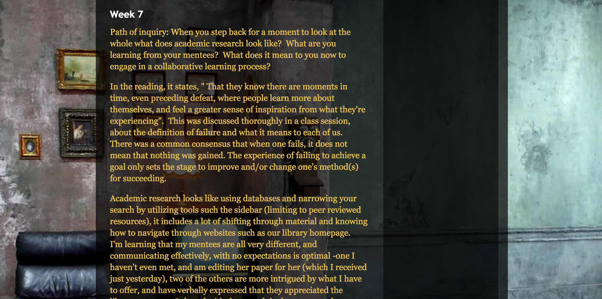
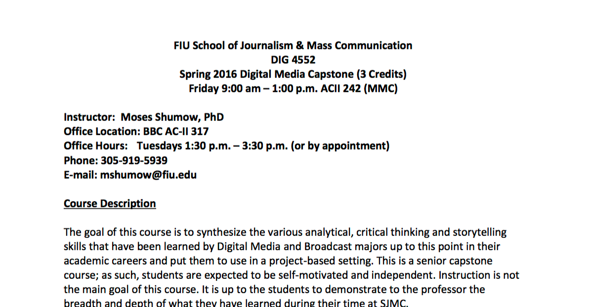
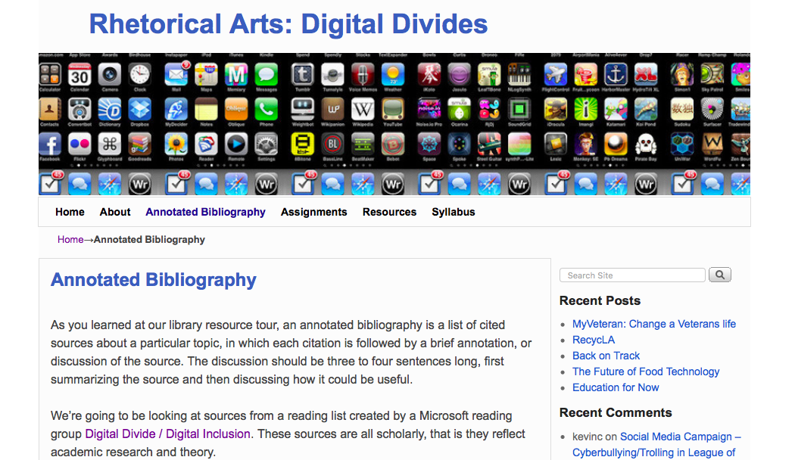
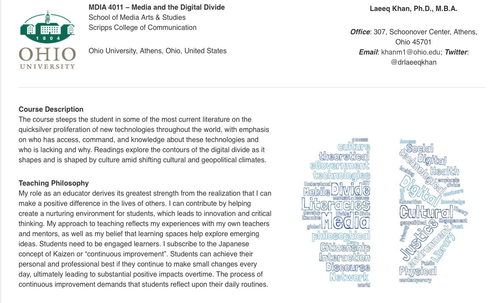
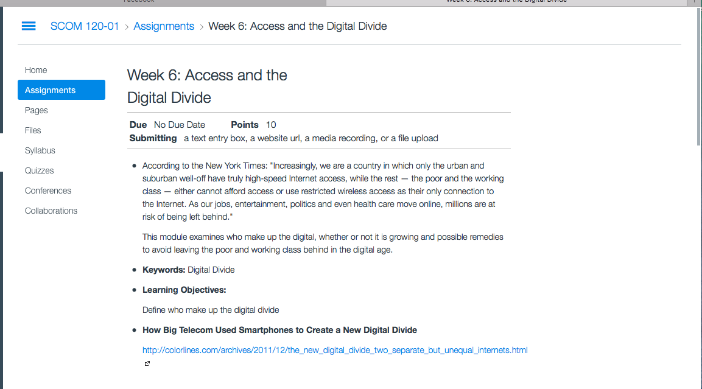
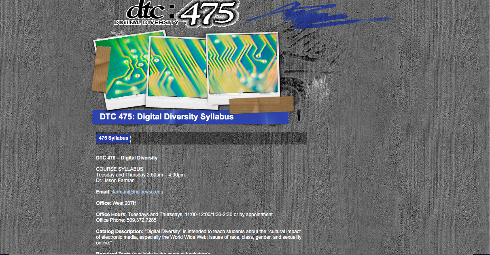
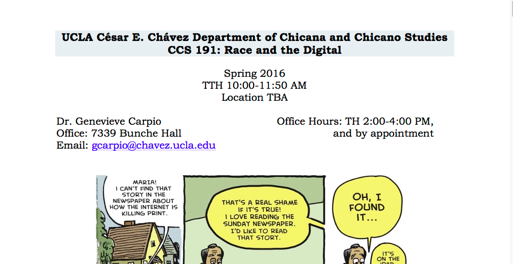
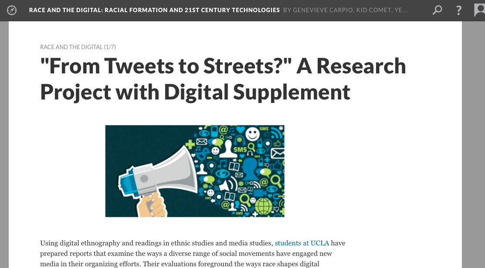
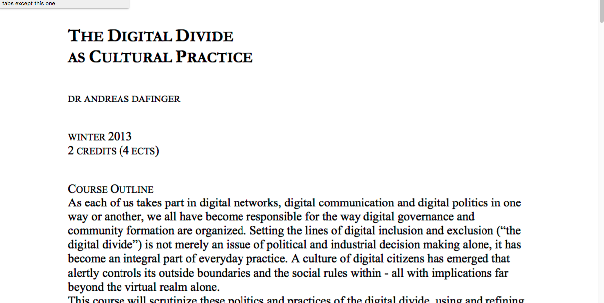
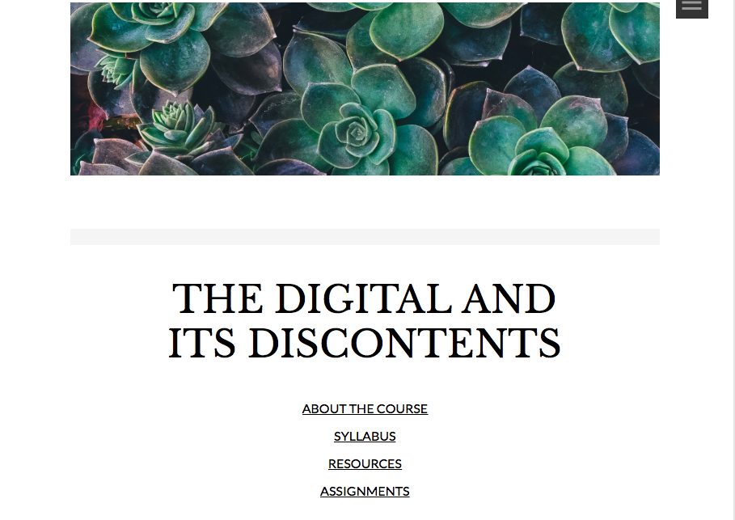

--- 
title: Digital Pedagogy in the Humanities
subtitle: Concepts, Models, and Experiments 
chapter: Digital Divides
URL: keywords/digital_divides.md
author: 
- family: Perez
  given: Annemarie
editor: 
- family: Davis
  given: Rebecca Frost
publisher: Modern Language Association
type: book
---

# Digital Divides

### Annemarie Perez

California State University-Dominguez Hills

##### Publication Status:
* unreviewed draft
* draft version undergoing editorial review
* draft version undergoing peer-to-peer review
* **draft version undergoing MLA copyediting**
* awaiting pre-print copy
* published 

---

### Cross-Reference Keywords: access, intersectionality, race, social justice

---  

## CURATORIAL STATEMENT

In January of 2015, President Obama made the statement, “Today highspeed broadband is not a luxury, it’s a necessity” (Council of Economic Advisors Issue Brief). Yet, high speed broadband is available neither to all people on the planet nor in the United States. Digital divides is a case of "haves" and "have nots." The term "digital divide" came into widespread usage in the 1990s following a report titled “Falling Through the Net: A Survey of the ‘Have Nots’ in Rural and Urban America” by the National Telecommunications & Information Administration. Though the term was not explicitly used in the report, it emerged through discussion of the subject and entered into political and popular discourse, first referring to internet access and more recently access to highspeed internet (Graham 213-214). The term “digital divide,” in its singular form, is generally used to denote divides in access and usage of technology, especially information technology/the Internet for reasons such as poverty, education, disability, age and geographical lack of access. In global terms this "divide" may be between so-called “developed” or “first” world and “developing” or “third” worlds. The term entered into popular usage through its use in the media.

While “digital divide” in its singular form denotes issues of global and United States-based national economic and racial disparity and how these relate to conceptions of and access to the Internet and its usage, general thinking has evolved into one of intersecting “digital divides” (plural). These digital divides, as Jeffrey T. Grabill’s article pointed out more than ten years ago, represent a space where race, ethnicity, and class intersect and create similar divides across differences, for example, a situation where a student in urban Detroit is unable to access the Internet to do their homework, in a similar way to one from rural south Texas. Pew Research data demonstrates the importance of understanding “digital divides” as a multitude of intersecting circumstances; the causes for each divide are not discrete but overlap, creating situations where specific groups—for example, those who live in rural poverty without a high school diploma or any college education—are far less likely to have high speed Internet access or the ability to use the Internet than a person who is urban, affluent and college educated.

The topic of digital divides is vital to university education using digital pedagogy in several respects. Central principles for addressing digital divides, which have implications for pedagogy, are technology (Internet and/or broadband) availability, affordability, inclusive design, and access (Building Digital Communities). Understanding of these divisions is not native to many students, because for most students of traditional college age, especially those who live in the United States in the middle class or above, the privilege of available high-speed Internet access has been throughout their lives as present and invisible as their access to clean drinking water. In order to discuss problems and opportunities created by global technology’s move to online environments, students must first become aware, as Jen Schradie’s research demonstrates, that this access is not universal on international, national or local levels. Pedagogy surrounding this connects to the issues of intersectionality and the theories surrounding it (Schradie 555-556). The study of digital divides offers students the opportunity to become aware of their own privilege and gain understanding of other perspectives. They may also see their own technological expertise.

Joo Tan and John Phillips take the topic of pedagogy and digital divides further, discussing how the use of experiential learning, where students work with communities with low Internet access, is especially fruitful. Students in these classes specifically work on solving the multiple layers of problems both caused by and creating lack of Internet access. The service learning based study of digital divides and students' various positions of relative privilege allows for practical learning outcomes in terms of digital skills used and learned, and theoretical outcomes as students study and work with issues of intersecting oppressions across race, class, and age relative to digital access and use, experiences that appear to be valuable across all types of higher education institutions. Service learning practice as part of a study of digital divides adds to the learning outcomes the teaching of social justice and the value of working in and with communities in order to experience and facilitate student and community learning.
These artifact selections are ordered moving from service/experiential learning into courses based on more theoretical work. All of the artifacts are interdisciplinary, variously combining journalism, sociology, technology studies, communication, critical race studies, and composition studies. Some artifacts focus on the study of the intersectionality of digital divides as a course topic, while others look at the divides as a an unscripted problem for students to solve. The related materials, including Pew survey data, maps and video, are meant to supplement courses. Because this is a subject where the divides are continually evolving as connectivity evolves and changes, these informational resources are presented as examples which would require updating each time the material is taught.

## CURATED ARTIFACTS

### Teaching the Digital Divide

* Artifact Type: Students Course Blogs
* Source URLs: 
[http://ingac397.blogspot.com](http://ingac397.blogspot.com)
[http://deiro9.blogspot.com](http://deiro9.blogspot.com)
[http://wwutroy.blogspot.com](http://wwutroy.blogspot.com)
[http://jamie-marine.blogspot.com](http://jamie-marine.blogspot.com)
* Artifact Permissions: Copyright Rebecca M. Marrall, Inga C, Jamie Marine, Nick Cordeiro, Troy
* Creator and Affiliation: Rebecca M. Marrall, Western Washington University

This artifact is a group of student blogs produced for a library science service learning course on library research mentoring in area public libraries, while as a class they studied a range of concepts connecting digital participation and citizenship. The professor, Rebecca M. Marrall, wrote about the course for the journal *Library Philosophy and Practice*, discussing the course's ten week structure and how the service learning and course content were connected. The blogs, taken together, are a glimpse into the reflections of the students who took part in the course and offer a fascinating compliment to the Marrall's research and writing. Through their reflections, the students' growth in understanding of the concept of "digital divides" is evident. This artifact offers a useful case study for constructing a service learning course around the theme of digital divides.  

#### Digital Media Capstone

* Artifact Type: Syllabus
* Source URL: [https://communication.fiu.edu/wp-content/uploads/2015/08/DIG4552_SPRING_2016.pdf](https://communication.fiu.edu/wp-content/uploads/2015/08/DIG4552_SPRING_2016.pdf)
* Artifact Permissions: Copyright Moses Shumow
* Copy of the Artifact:  
* Creator and Affiliation: Moses Shumow, Florida International University

This syllabus is for a senior level capstone service learning project on digital divides. This project is a model for having students work through the problem of providing network connectivity, a project website, and working with community members and local high school students to create instructional videos and an ebook library. This project is significant in part because it has students look at a digital divide issue, understand that issue from the perspective of those on the low access side, and provide layered solutions to the problem. Students involved in this project use digital skills to solve a social problem. While in the case of this syllabus, the project is the basis of a semester-long course, this project could also be used as the foundation of a capstone independent study project for a group of students.  

####  Digital Divides: Annotated Bibliography Assignment

* Artifact Type: Reference and citation assignment
* Source URL: [http://citedatthecrossroads.net/rasp15/annotated-bibliography/](http://citedatthecrossroads.net/rasp15/annotated-bibliography/)
* Artifact Permissions: CC-BY-NC
* Artifact Copy: [Annotated Bibliography Assignment](files/digitaldivides-annotatedbibassignment.pdf)
* Creator and Affiliation: Annemarie Perez, California State University-Dominguez Hills

This artifact has students use materials about digital divides published on a research group’s website to collectively construct an annotated bibliography. This assignment teaches library database research as students locate and retrieve scholarly books and articles, read them and create summary annotations relative to course discussion on digital divides. This assignment is particularly appropriate for first year university students learning to use library research databases and scholarly citation styles. It also is significant in asking students to determine and reflect on the differences between scholarly and popular publications. This reflection could lead to a discussion of the paywall digital divide that separates people who are not part of the university community from being able to access peer reviewed research.  

#### Media and the Digital Divide

* Artifact Type: Course Website
* Source URL: [http://digitaldivide.professorkhan.com](http://digitaldivide.professorkhan.com) 
* Artifact Permissions: Copyright Laeeq Khan 
* Creator and Affiliation: Laeeq Khan, Ohio University

This artifact is a course website for a seven week media studies course on digital divides. The course looks at digital divides from a global and economic perspective, focusing on inequalities in new media and emerging technologies, especially social media and the skills needed to use and control them. In addition to the syllabus, the site includes a detailed group project for the course, with the students divided into teams investigating their choice of a series of digital divides subjects. The site is significant in its depth, with detailed assignments, reading and viewing links and blogged comments from the students on each weeks' work, meaning that a significant amount of the class featured public student writing.   

####  Access and the Digital Divide

* Artifact Type: Assignment
* Source URL: [https://canvas.instructure.com/courses/910884/assignments/3304735](https://canvas.instructure.com/courses/910884/assignments/3304735) 
* Artifact Permissions: CC-BY-NC-SA 4.0
* Copy of the Artifact:  [Access and the Digital Divide](files/digital-divides_Access-and-the-Digital-Divide.pdf) 
* Creator and Affiliation: Ingrid Sturgis, Howard University

This artifact has students use current journalism and online sources in their research. It is an assignment appropriate for lower division undergraduate students as an introduction to the ideas of digital divides as related to access to the Internet and digital technology in the United States. This assignment could be used early in a discussion of digital divides as a way to understand both what some specific divides are and their intersections. The assignment encourages students to explore the topic and consider what is possible, what could and/or should be done to bridge these divides. This is significant because for students on the fortunate sides of the digital divides, high speed Internet may be as taken for granted in first world spaces.  It is an assignment that should be updated with current information from, for example, current survey information from the Pew Research Center and examples of recent journalism. 

#### Digital Diversity Syllabus

* Artifact Type: Syllabus
* Source URL: [http://www.jasonfarman.com/wsb3566636401/index.html](http://www.jasonfarman.com/wsb3566636401/index.html) 
* Artifact Permissions: CC-BY-NC
* Copy of the Artifact:  [Digital Diversity Syllabus](files/digital-divides-digital-diversity-syllabus.pdf)  
* Creator and Affiliation: Jason Farman, University of Maryland, College Park

This artifact is the syllabus of a semester-length course examining the social and cultural impact of electronic media. Students accomplish this examination by spending a significant part of the semester exploring and participating in an electronic community while keeping a weekly journal and drawing connections between their experiences in this online community and assigned course readings. The assigned readings for the class include foundational texts about relationships between digital technology and demographic issues of race, gender, and class, and current works of journalism. Along with and following on their community experiences, students will then design and create websites for their assigned groups to share and display their journal content. In addition to these journal and website assignments, the course also calls for a traditional research paper looking at academic research on the subject. The course is significant in its combining of digital divides study with the exploration of online communities and the creation of digital research content. 

#### Race and the Digital

* Artifact Type: Course site
* Source URL: [http://scalar.usc.edu/works/race-and-the-digital/index](http://scalar.usc.edu/works/race-and-the-digital/index) 
* Artifact Permissions: CC-BY-NC
* Copy of the Artifact:  [Race and the Digital](files/digital_divides-Race_Digital-2.pdf)
* Creator and Affiliation: Genevieve Carpio, University of California, Los Angeles

This artifact, a Scalar site, is several different objects. First it is a digital book of a course taught at the University of California Los Angeles in the Chicano studies department exploring issues surrounding race and the digital. As such it connects to a course syllabus on racial formation and digital studies. The course looks at digital divides through issues such as freeway building in Los Angeles and artistic movements such as Judith Baca’s Wall of Los Angeles. Through its directly addressing digital studies through a cultural lens, the artifact then unfolds further to allow a reading of student projects, which looked at various types of social media through a cultural studies lens. This artifact could form the basis for other digital humanities courses that center issues of race, ethnic and cultural studies and also a creative use of Scalar in the digital studies classroom. 

#### “From Tweets to Streets?” A Research Project with Digital Supplement

* Artifact Type: Course assignment
* Source URL: [http://scalar.usc.edu/works/race-and-the-digital/from-tweets-to-streets-a-research-project?path=index](http://scalar.usc.edu/works/race-and-the-digital/from-tweets-to-streets-a-research-project?path=index)
* Artifact Permissions: CC-BY-NC
* Creator and Affiliation: Genevieve Carpio, University of California, Los Angeles

This artifact is a term assignment (7–9 pages) asking students to evaluate a new media (Web 2.0) platform as a site for critical engagement with race and ethnicity. Students are asked to look at ways race and ethnicity shape digital formation and experience. As part of a more traditional research paper, which for this course was posted to a course Scalar site, the project asks students to create a multimedia supplement linking to sources on a specific social movement. This project, appropriate for either a lower or upper division class in critical race studies, combines new media literacy with teaching traditional research skills. It encourages students to engage with the digital divide by creating a bridging resource. This page also contains an index linking to student projects from the course.

#### The Digital Divide as Cultural Practice

* Artifact Type: Syllabus
* Source URL: [https://courses.ceu.edu/sites/courses.ceu.hu/files/attachment/course/2114/dafinger-syllabus-digital-divide-2013.pdf](https://courses.ceu.edu/sites/courses.ceu.hu/files/attachment/course/2114/dafinger-syllabus-digital-divide-2013.pdf)
* Artifact Permissions: Copyright Andreas Dafinger
* Copy of the Artifact:  
* Creator and Affiliation: Andreas Dafinger, Central European University

This syllabus by Andreas Dafinger, teaching at a European university, examines digital divides for issues of inclusion and exclusion and how they function in social, cultural and political practice in terms of both access and control of digital networks. It is significant in its exploration of the ideas surrounding digital community and governance within and across political and industrial boundaries. Because the term “digital divides” originated in the United States and due to U.S. cultural hegemony, much of the work and perspective on the subject is from the U.S. This syllabus is important both because of its diverse disciplinary content but also because it offers a more global perspective. This syllabus would be helpful in constructing a course focusing on “digital divides” including perspectives outside of U.S. social, cultural, and political hegemony.

#### The Digital and Its Discontents 

* Artifact Type: Course Website
* Source URL: [https://iiitbcourses.wordpress.com/digitaldiscontents2017/](https://iiitbcourses.wordpress.com/digitaldiscontents2017/)
* Artifact Permissions: Copyright Janaki Srinivasan
* Creator Affiliation: Janaki Srinivasan, International Institute of Information Technology Bangalore

This course website website by Janaki Srinivasan, teaching at a South Asian university, examines digital spaces and their influence on social, economic, political and cultural inequalities, with particular focus on so called developing countries.  The course looks at digital divides through the lens of development looking especially at parts of Asia, South America and Africa. The course assignments work in a sequence, asking students to choose a country that the World Bank lists as low or middle income. Through a series of essay assignments, the students explore the background of the country, ultimately discussing a World Bank Information and Communication Technologies project underway in the country. This syllabus offers an innovative way to teach and discuss technology projects of the "developing" world and how these projects may redefine ideas about digital divides.    

## RELATED MATERIALS

Digital Divides 2016 Slide Show: Pew Research Center
[http://www.slideshare.net/PewInternet/digital-divides-2016-internet-governance-forum?ref=http://www.pewinternet.org/2016/07/14/digital-divides-2016/](http://www.slideshare.net/PewInternet/digital-divides-2016-internet-governance-forum?ref=http://www.pewinternet.org/2016/07/14/digital-divides-2016/)

Digital Divide / Digital Inclusion: A Reading List
[https://socialmediacollective.org/reading-lists/digital-divide-digital-inclusion-a-reading-list/](https://socialmediacollective.org/reading-lists/digital-divide-digital-inclusion-a-reading-list/)

Global Internet Map
[https://www.internetsociety.org/map/global-internet-report/#fixed-broadband-penetration](https://www.internetsociety.org/map/global-internet-report/#fixed-broadband-penetration)

The Internet of Civil Rights: the New Digital Divide - Tedx Talk by Brigitte Daniel
[https://www.youtube.com/watch?v=I3X4l3S-O70](https://www.youtube.com/watch?v=I3X4l3S-O70)

What is Service Learning or Community Engagement?
[https://cft.vanderbilt.edu/guides-sub-pages/teaching-through-community-engagement/](https://cft.vanderbilt.edu/guides-sub-pages/teaching-through-community-engagement/)

## WORKS CITED

Carpio, Genevieve. “Race and the Digital.” University of California, Los Angeles. Spring 2016. http://scalar.usc.edu/works/race-and-the-digital/index

--——. ”From Tweets to Streets?" A Research Project with Digital Supplement” University of California, Los Angeles. Spring 2016.  http://scalar.usc.edu/works/race-and-the-digital/from-tweets-to-streets-a-research-project?path=index

Clark, Christine, and Paul Gorski. “Multicultural Education and the Digital Divide: Focus on Race, Language, Socioeconomic Class, Sex, and Disability.” Multicultural Perspectives 3.3 (2001): 39–44. Print.

Definer, Andreas. “The Digital Divide as Cultural Practice.” Central European University. Winter 2013.  https://courses.ceu.edu/sites/courses.ceu.hu/files/attachment/course/2114/dafinger-syllabus-digital-divide-2013.pdf

Farman, Jason. “Digital Diversity Syllabus.” University of Maryland, College Park. Spring 2012. http://www.jasonfarman.com/wsb3566636401/index.html

Grabill, Jeffrey T. “On Divides and Interfaces: Access, Class and Computers.” Computers and Composition 20.4 (2003): 455–72. Print.

Graham, Mark. “Time Machines and Virtual Portals: The Spatialities of the Digital Divide.” Progress in Development Studies 11.3 (2011): 211–227. Print. 

Helbig, Natalie, J. Ramón Gil-García, and Enrico Ferro. "Understanding the Complexity of Electronic Government: Implications from the Digital Divide Literature." Government Information Quarterly 26.1 (2009): 89-97. Web. 

The Institute of Museum and Library Services. "Building Digital Communities." Washington D.C. 2011. Web.

Khan, Laeeq. “Media and the Digital Divide.” Ohio University. Spring 2017. http://digitaldivide.professorkhan.com

Kvasny, Lynette. "The Role of the Habitus in Shaping Discourses About the Digital Divide." Journal of Computer‐Mediated Communication 10.2 (2005). Web.

“Mapping the Digital Divide.” Council of Economic Advisors Issue Brief. Washington D.C. July 2015. Print.

McConnaughey, James, Cynthia Ann Nila, and Tim Sloan. “Falling through the Net: A Survey of the “Have Nots” in Rural and Urban America.” (DOC), National Telecommunications and Information Administration. Washington D.C. 1995. Print.

Marrall, Rebecca M. "Teaching the Digital Divide: Connecting Students to Community, Knowledge, and Service Learning." Library Philosophy and Practice (2014). Web.

Perez, Annemarie. “Digital Divides: Annotated Bibliography.” Loyola Marymount University. Spring 2015, http://citedatthecrossroads.net/rasp15/annotated-bibliography

Schradie, Jen. “The Trend of Class, Race, and Ethnicity in Social Media Inequality: Who Still Cannot Afford to Blog?.” Information, Communication & Society 15.4 (2012): 555–571.

Shumow, Moses.”Digital Media Capstone.” Florida International University. Spring 2016. https://communication.fiu.edu/wp-content/uploads/2015/08/DIG4552_SPRING_2016.pdf

Srinivasan, Janaki. “The Digital and Its Discontents.” International Institute of Information Technology Bangalore. Spring 2017. https://iiitbcourses.wordpress.com/digitaldiscontents2017/

Stanford Computer Science Department. “Digital Divide.” Web. 10/1/2016 2016. [http://cs.stanford.edu/people/eroberts/cs201/projects/digital-divide/start.html](http://cs.stanford.edu/people/eroberts/cs201/projects/digital-divide/start.html)

Sturges, Ingrid. “Access and the Digital Divide.” Howard University. Fall 2015. https://canvas.instructure.com/courses/910884/assignments/3304735

Tan, Joo, and John Phillips. “Incorporating Service Learning into Computer Science Courses.” Journal of Computing Sciences in Colleges 20.4 (2005): 57–62. Web.