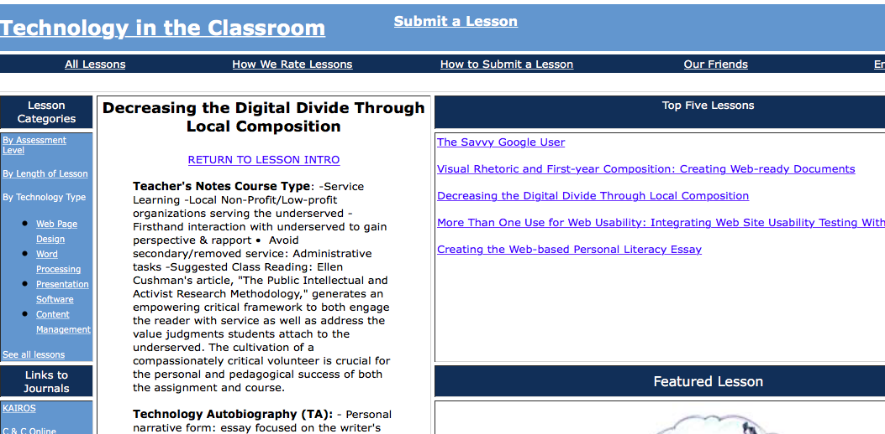
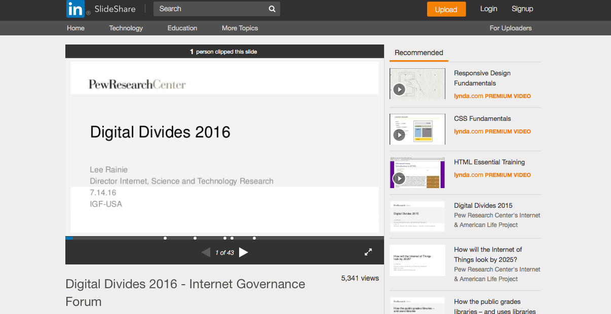
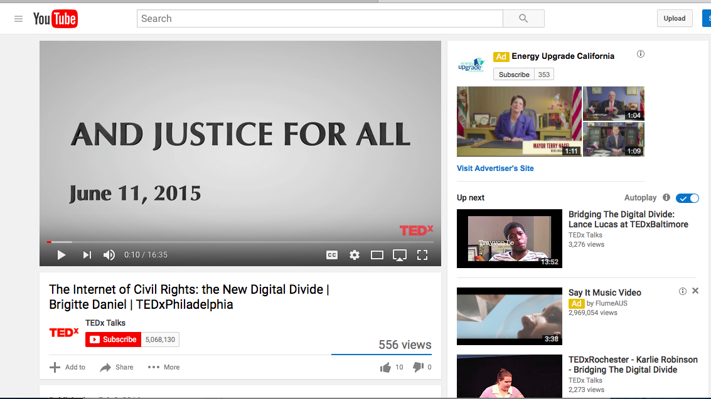

# Digital Divides

### Annemarie Perez

California State University-Dominguez Hills

## CURATORIAL STATEMENT

In January of 2015, President Obama made the statement “Today highspeed broadband is not a luxury, it’s a necessity.” Yet as he said this and in the Council of Economic Advisors Issue Brief, it is clear that high speed broadband is not available to either all people either on the planet or in the United States. The term “digital divide,” in its singular form, is generally used to denote divides in access and usage of technology, especially information technology/the Internet for reasons such as poverty, disability, age and/or rural lack of access. This divide is discussed in global terms as the divide between the so-called “developed” or “first” world and “developing” or “third” worlds and within and between specific countries. It is used within countries to discuss this same division of access to information technology caused by economic, educational, age, racial, and regional urban/rural access issues. The term came into widespread usage in the mid to late 1990s following a report titled “Falling Through the Net: A Survey of the ‘Have Nots’ in Rural and Urban America” by the National Telecommunications & Information Administration. The term “digital divides” was not explicitly used in the report, but through discussion of the subject, “digital divides” was coined and entered into political and then popular discourse (Graham).

When I first started teaching and discussing ”digital divide” in its singular form I focused on issues of global and United States-based national economic and racial disparity and how these related to conceptions of and access to the Internet and its usage. The course was one in digital rhetoric taught on the freshman level However, general thinking can be said to have evolved into one of intersecting “digital divides” (plural). Pew Research data demonstrates the importance of understanding “digital divides” as a multitude of intersecting circumstances, the causes for each divide are not discrete, but overlap creating situations where specific groups—for example, those who live in rural poverty without a high school diploma or any college education—are far less likely to have high speed Internet access and/or the ability to use the Internet than a person who is urban, affluent and college educated. This data, these digital divides, as Jeffrey T. Grabill’s article pointed out more than ten years ago, also represent a space where race, ethnicity, and class intersect. These intersections create similar divides across differences, for example, a situation where a student in urban Detroit is unable to access the Internet to do their homework, in a similar way to one from rural south Texas.  

The topic of digital divides is vital to university education using digital pedagogy in several respects. First because for most college students of traditional college age, especially those who live in the United States in the middle class or above, the privilege of available high-speed Internet access has been throughout their lives as present and invisible as their access to clean drinking water. In order to discuss problems as well as opportunities created by global technology’s move to online environments, students must first become aware that this access is not universal on international, national or local levels, as Jen Schradie’s research demonstrates. Joo Tan and John Phillips take this topic further, discussing how the use of experiential learning, where students work with communities with low Internet access, is especially fruitful as classes specifically work on solving the multiple layers of problems both caused by and creating lack of Internet access. Service learning on issues of digital divides allows for practical learning outcomes in terms of digital skills learned and used and theoretical outcomes as students study and work with issues of intersecting oppressions across race, class, and age relative to digital access and use. This practice adds to the learning outcomes the teaching of social justice and the value of working in and with communities in order to experience and facilitate community learning.

These artifact selections are roughly ordered based on service / experiential learning and then move into courses based on more theoretical work. The first artifact is for a lesson website with work suitable for a freshman writing class, while later projects are suitable for use as honors or senior capstone projects. One, “From Tweets to Streets?” a project prompt, connects to examples of student work based on the artifact. All of the artifacts are interdisciplinary, variously combining journalism, sociology, technology studies, communication, critical race studies, and composition studies. The other resources: Pew survey data and a video are meant to supplement courses, as are the maps linked under the list of related works. Because this is a subject where the divides are continually evolving as connectivity changes, it is expected that these resources are to be examples and ones which would require updating each time the material is taught.

## CURATED ARTIFACTS

#### Decreasing the Digital Divide Through Local Composition

* Artifact Type: Collaborative lesson site
* Source URL: [http://www.rhetcomp.gsu.edu/~mhocks/technology/digital_divide2.htm](http://www.rhetcomp.gsu.edu/~mhocks/technology/digital_divide2.htm ) 
* Artifact Permissions: Copyright Carrie Vogel 
* Copy of the Artifact:  
* Creator and Affiliation: Carrie Vogel, Georgia State University

This artifact is a multi-part, semester-long series of assignments to go along with service learning as part of a first year composition course. While classroom study of the subject of digital divides is important, working on the issues surrounding it from the service learning position of trying to understand the problems that both cause lack of access and then attempt to solve some part of these problems can further reveal the issue’s complexity. The course sequence has students starting with themselves by writing a technical autobiography in order to understand the position of information technology in their lives. The students move from this self-positioning into a service learning component that shifts focus to underserved people through the use of interviews. The course culminates with a reflection on the students’ experiences and those of the people they worked with, discussing how their work shrinks the digital divide. 

####  Digital Divides: Annotated Bibliography Assignment

* Artifact Type: Reference and citation assignment
* Source URL: [http://citedatthecrossroads.net/rasp15/annotated-bibliography/](http://citedatthecrossroads.net/rasp15/annotated-bibliography/)
* Artifact Permissions: Copyright Annemarie Perez
* Creator and Affiliation: Annemarie Perez, California State University-Dominguez Hills

This artifact has students use materials about digital divides published on a research group’s website to collectively construct an annotated bibliography. This assignment teaches library database research as students locate and retrieve scholarly books and articles, read them and create summary annotations relative to course discussion on digital divides. This assignment is particularly appropriate for first year university students learning to use library research databases and scholarly citation styles. It also is significant in asking students to determine and reflect on the differences between scholarly and popular publications. This reflection could lead to a discussion of the paywall digital divide that separates people who are not part of the university community from being able to access peer reviewed research.    

####  Access and the Digital Divide

* Artifact Type: Assignment
* Source URL: [https://canvas.instructure.com/courses/910884/assignments/3304735](https://canvas.instructure.com/courses/910884/assignments/3304735) 
* Artifact Permissions: Copyright Ingrid Sturgis
* Copy of the Artifact:  author is sending a revision
* Creator and Affiliation: Ingrid Sturgis, Howard University

This artifact has students use current journalism and online sources in their research. It is an assignment appropriate for lower division undergraduate students as an introduction to the ideas of digital divides as related to access to the Internet and digital technology in the United States. This assignment could be used early in a discussion of digital divides as a way to understand both what some specific divides are and their intersections. The assignment encourages students to explore the topic and consider what is possible, what could and/or should be done to bridge these divides. This is significant because for students on the fortunate sides of the digital divides, high speed Internet may be as taken for granted in first world spaces.  It is an assignment that should be updated with current information from, for example, current survey information from the Pew Research Center and examples of recent journalism. 

#### Digital Diversity Syllabus

* Artifact Type: Syllabus
* Source URL: [http://www.jasonfarman.com/wsb3566636401/index.html](http://www.jasonfarman.com/wsb3566636401/index.html) 
* Artifact Permissions: Copyright Jason Farman
* Copy of the Artifact:  [Digital Diversity Syllabus](files/digital_divides-Farman_418b_2012_Syllabus.pdf)  
* Creator and Affiliation: Jason Farman, University of Maryland, College Park

This artifact is the syllabus of a semester-length course examining the social and cultural impact of electronic media. Students accomplish this examination by spending a significant part of the semester exploring and participating in an electronic community while keeping a weekly journal and drawing connections between their experiences in this online community and assigned course readings. The assigned readings for the class include foundational texts about relationships between digital technology and demographic issues of race, gender, and class, and current works of journalism. Along with and following on their community experiences, students will then design and create websites for their assigned groups to share and display their journal content. In addition to these journal and website assignments, the course also calls for a traditional research paper looking at academic research on the subject. The course is significant in its combining of digital divides study with the exploration of online communities and the creation of digital research content. 

#### Digital Media Capstone

* Artifact Type: Syllabus
* Source URL: [https://communication.fiu.edu/wp-content/uploads/2015/08/DIG4552_SPRING_2016.pdf](https://communication.fiu.edu/wp-content/uploads/2015/08/DIG4552_SPRING_2016.pdf)
* Artifact Permissions: Copyright Moses Shumow
* Copy of the Artifact:  
* Creator and Affiliation: Moses Shumow, Florida International University

This syllabus is for a senior level capstone service learning project on digital divides. This project is a model for having students work through the problem of providing network connectivity, a project website, and working with community members and local high school students to create instructional videos and an ebook library. This project is significant in part because it has students look at a digital divide issue, understand that issue from the perspective of those on the low access side, and provide layered solutions to the problem. Students involved in this project use digital skills to solve a social problem. While in the case of this syllabus, the project is the basis of a semester-long course, this project could also be used as the foundation of a capstone independent study project for a group of students.  

#### Race and the Digital

* Artifact Type: Course site
* Source URL: [http://scalar.usc.edu/works/race-and-the-digital/index](http://scalar.usc.edu/works/race-and-the-digital/index) 
* Artifact Permissions: Copyright Genevieve Carpio
* Copy of the Artifact:  [Race and the Digital](files/digital_divides-Race_Digital-2.pdf)
* Creator and Affiliation: Genevieve Carpio, University of California, Los Angeles

This artifact, a Scalar site, is several different objects. First it is a digital book of a course taught at the University of California Los Angeles in the Chicano studies department exploring issues surrounding race and the digital. As such it connects to a course syllabus on racial formation and digital studies. The course looks at digital divides through issues such as freeway building in Los Angeles and artistic movements such as Judith Baca’s Wall of Los Angeles. Through its directly addressing digital studies through a cultural lens, the artifact then unfolds further to allow a reading of student projects, which looked at various types of social media through a cultural studies lens. This artifact could form the basis for other digital humanities courses that center issues of race, ethnic and cultural studies and also a creative use of Scalar in the digital studies classroom. 

#### “From Tweets to Streets?” A Research Project with Digital Supplement

* Artifact Type: Course assignment
* Source URL: [http://scalar.usc.edu/works/race-and-the-digital/from-tweets-to-streets-a-research-project?path=index](http://scalar.usc.edu/works/race-and-the-digital/from-tweets-to-streets-a-research-project?path=index)
* Artifact Permissions: Copyright Genevieve Carpio
* Creator and Affiliation: Genevieve Carpio, University of California, Los Angeles

This artifact is a term assignment (7–9 pages) asking students to evaluate a new media (Web 2.0) platform as a site for critical engagement with race and ethnicity. Students are asked to look at ways race and ethnicity shape digital formation and experience. As part of a more traditional research paper, which for this course was posted to a course Scalar site, the project asks students to create a multimedia supplement linking to sources on a specific social movement. This project, appropriate for either a lower or upper division class in critical race studies, combines new media literacy with teaching traditional research skills. It encourages students to engage with the digital divide by creating a bridging resource. This page also contains an index linking to student projects from the course.

#### The Digital Divide as Cultural Practice

* Artifact Type: Syllabus
* Source URL: [https://courses.ceu.edu/sites/courses.ceu.hu/files/attachment/course/2114/dafinger-syllabus-digital-divide-2013.pdf](https://courses.ceu.edu/sites/courses.ceu.hu/files/attachment/course/2114/dafinger-syllabus-digital-divide-2013.pdf)
* Artifact Permissions: Copyright Andreas Dafinger
* Copy of the Artifact:  
* Creator and Affiliation: Andreas Dafinger, Central European University

This syllabus by Andreas Dafinger, teaching at a European university, examines digital divides for issues of inclusion and exclusion and how they function in social, cultural and political practice in terms of both access and control of digital networks. It is significant in its exploration of the ideas surrounding digital community and governance within and across political and industrial boundaries. Because the term “digital divides” originated in the United States and due to U.S. cultural hegemony, much of the work and perspective on the subject is from the U.S. This syllabus is important both because of its diverse disciplinary content but also because it offers a more global perspective. This syllabus would be helpful in constructing a course focusing on “digital divides” including perspectives outside of U.S. social, cultural, and political hegemony.

#### Digital Divides 2016

* Artifact Type: Slide Show
* Source URL: [http://www.slideshare.net/PewInternet/digital-divides-2016-internet-governance-forum?ref=http://www.pewinternet.org/2016/07/14/digital-divides-2016/](http://www.slideshare.net/PewInternet/digital-divides-2016-internet-governance-forum?ref=http://www.pewinternet.org/2016/07/14/digital-divides-2016/)
* Artifact Permissions: CC Attribution-NonCommercial-ShareAlike License; 
* Copy of the Artifact:  
* Creator and Affiliation: Lee Rainie, Pew Research Center

This artifact, a slide show based on the demographic information from the Pew Research Center, is included here to represent all visual and statistical demographic material from the Pew Research Center. The Pew’s demographic information is vital to a clear understanding of the issues surrounding digital divides as they exist in the United States. Pew demographic data on digital divides goes back to the late 1990s and shows the development and changes in Internet use (including broadband vesus smartphone adoption) and usage based on income, education, race and ethnicity, age, community type (urban, suburban, rural), disability, language preference, and measures of “digital skill and readiness.” This information and its analysis are vital to classroom discussions of digital divides for traditional college-aged undergraduates in the U.S. Students’ own demographics make it likely that they have grown up in communities with widespread use of the Internet through broadband and smartphone connectivity. The information from Pew presented with excellent charts and graphs can allow students to consider the difference for people who live in communities where demographic factors limit access to the Internet.

#### The Internet of Civil Rights: the New Digital Divide

* Artifact Type: Video
* Source URL: [https://www.youtube.com/watch?v=I3X4l3S-O70](https://www.youtube.com/watch?v=I3X4l3S-O70) 
* Artifact Permissions: Copyright Tedx
* Copy of the Artifact:  
* Creator and Affiliation: Brigitte Daniel, Tedx Talks

This artifact is a 2015 Tedx Talk by Brigitte Daniel who reframes the digital divide as a discussion about the “served and underserved” in terms of how the Internet is being used and not used by people who are pushed outside digital access and use by variables such as age and/or income. She makes a case for the need for small flexible service providers who are able to accept multiple forms of payment and provide flexible services. This video is significant because it sets out the issues surrounding digital divides in an engaged way. It could be used early in a class on digital divides to discuss the problems and costs of providing more widespread service. It might be paired with readings on digital divides from the 1990s and early 2000s to discuss how the problem has both changed and remained the same over time. It is also significant in its discussion of underrepresented minority entrepreneurism and its role in creating bridges across digital divides.

## RELATED MATERIALS

Digital Divide / Digital Inclusion: A Reading List
[https://socialmediacollective.org/reading-lists/digital-divide-digital-inclusion-a-reading-list/](https://socialmediacollective.org/reading-lists/digital-divide-digital-inclusion-a-reading-list/)

Global Internet Map
[https://www.internetsociety.org/map/global-internet-report/#fixed-broadband-penetration](https://www.internetsociety.org/map/global-internet-report/#fixed-broadband-penetration)

## WORKS CITED

Clark, Christine, and Paul Gorski. “Multicultural education and the digital divide: Focus on race, language, socioeconomic class, sex, and disability.” Multicultural Perspectives 3.3 (2001): 39–44.

Grabill, Jeffrey T. “On Divides and Interfaces: Access, Class and Computers.” Computers and Composition 20.4 (2003): 455–72. Print.

Graham, Mark. “Time machines and virtual portals The spatialities of the digital divide.” Progress in Development Studies 11.3 (2011): 211–227.

“Mapping the Digital Divide.” Council of Economic Advisors Issue Brief. Washington D.C. July 2015.

McConnaughey, James, Cynthia Ann Nila, and Tim Sloan. “Falling through the Net: A Survey of the “Have Nots” in Rural and Urban America.” (DOC), National Telecommunications and Information Administration. Washington D.C. 1995. Print.

Schradie, Jen. “The Trend of Class, Race, and Ethnicity in Social Media Inequality: Who Still Cannot Afford to Blog?.” Information, Communication & Society 15.4 (2012): 555–571.

Stanford Computer Science Department. “Digital Divide.” Web. 10/1/2016 2016. [http://cs.stanford.edu/people/eroberts/cs201/projects/digital-divide/start.html](http://cs.stanford.edu/people/eroberts/cs201/projects/digital-divide/start.html)

Tan, Joo, and John Phillips. “Incorporating service learning into computer science courses.” Journal of Computing Sciences in Colleges 20.4 (2005): 57–62.
