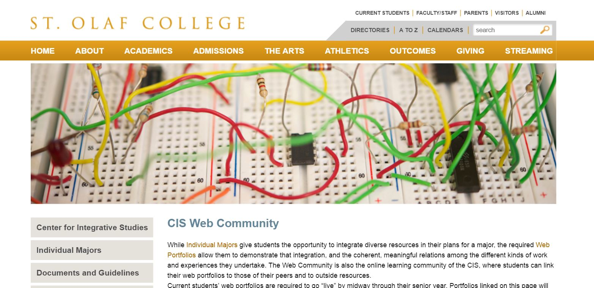
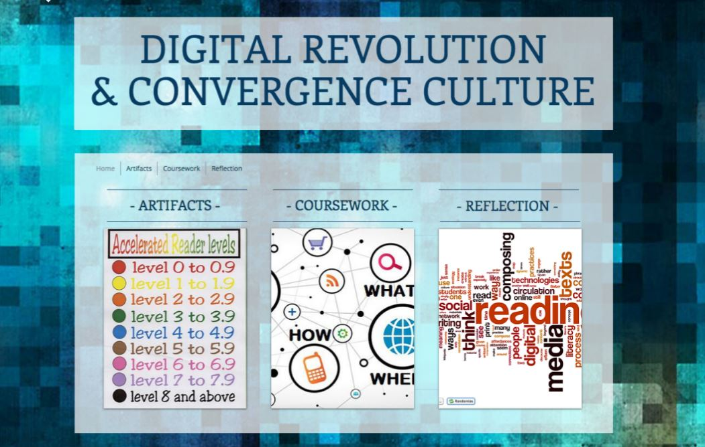
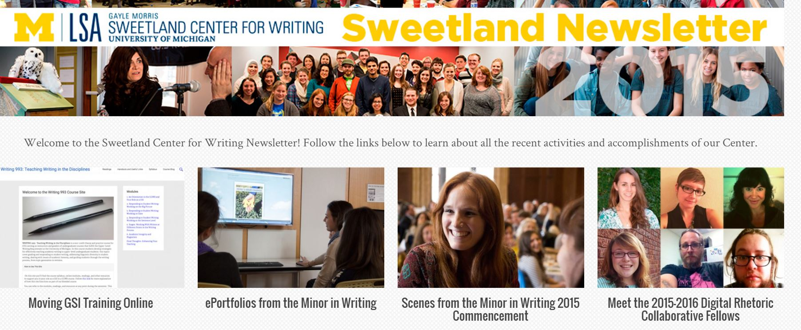
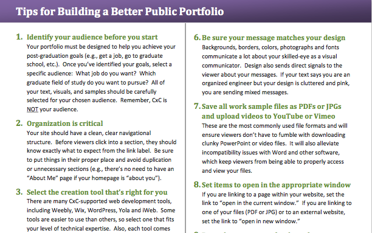
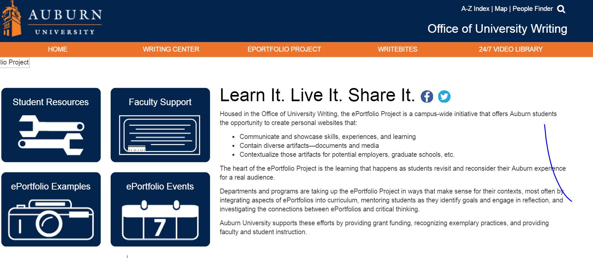
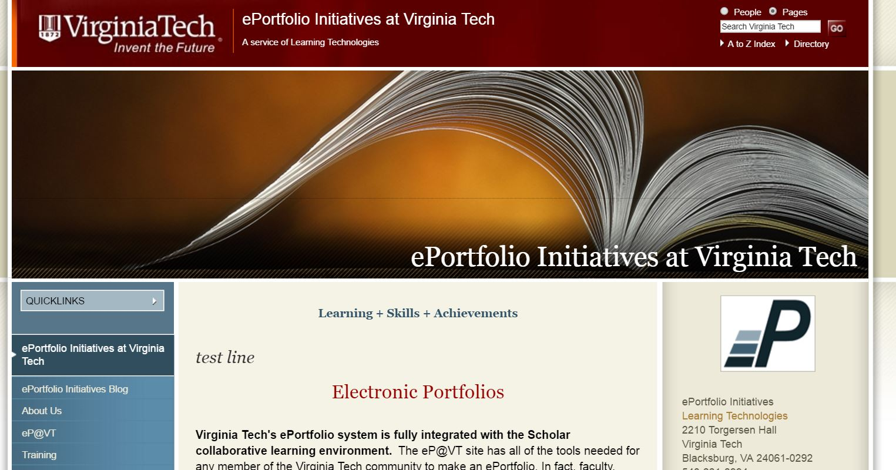
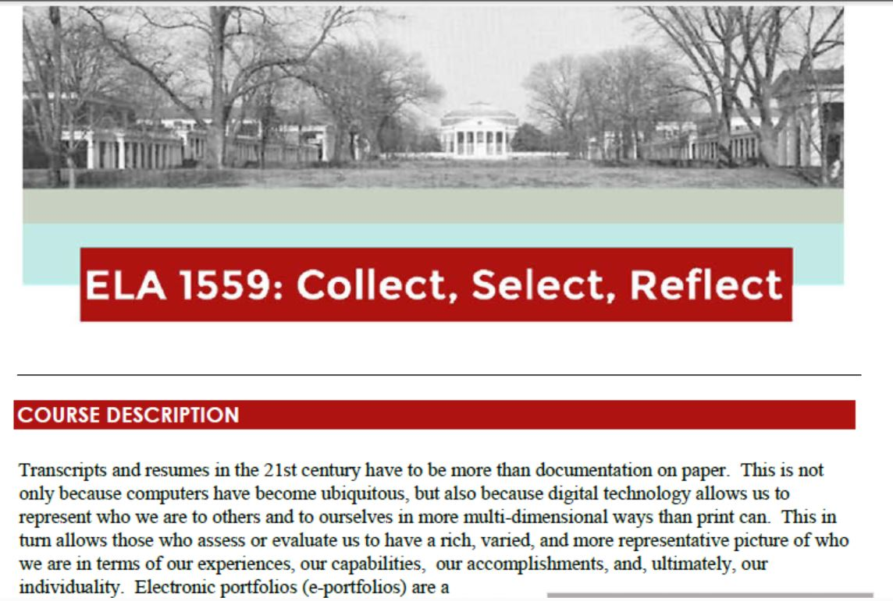
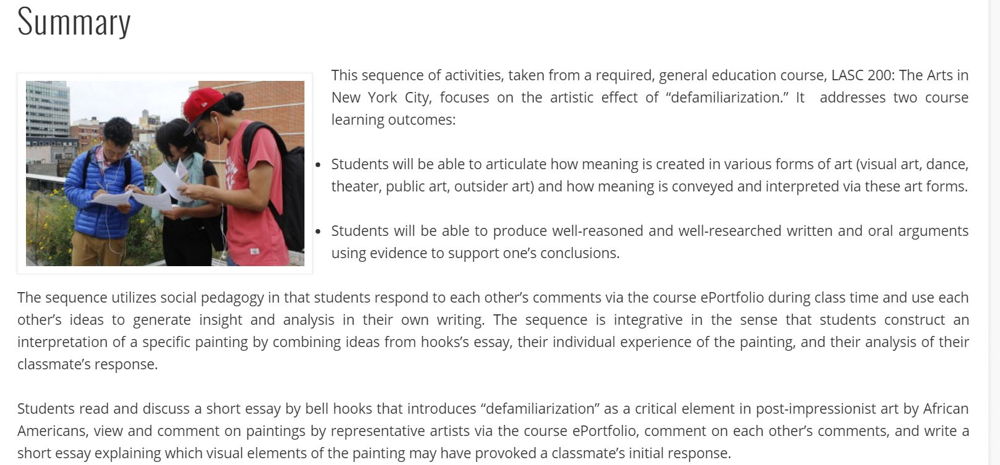
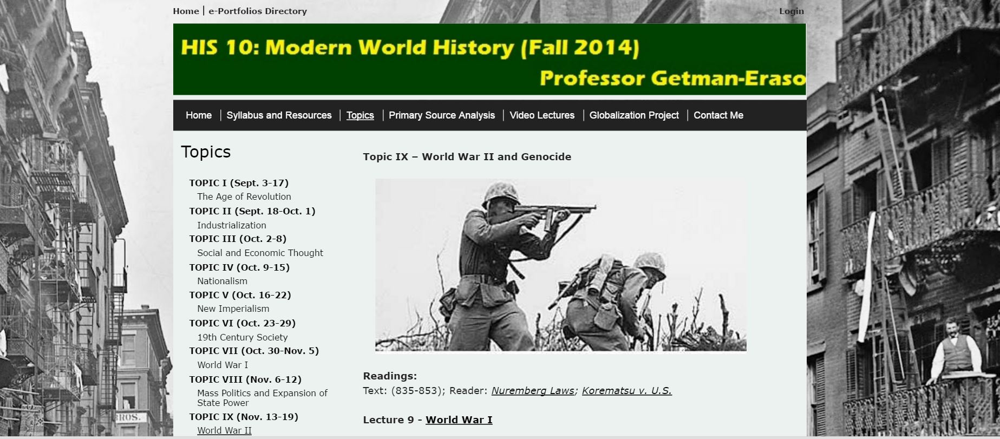
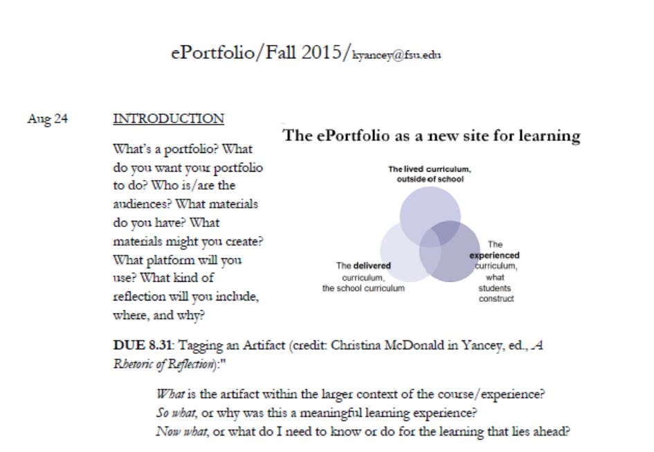

# ePortfolio

### Kathleen Blake Yancey
Florida State University | [http://www.english.fsu.edu/faculty/kyancey.htm](http://www.english.fsu.edu/faculty/kyancey.htm)

---

### Publication Status:
* unreviewed draft
* draft version undergoing editorial review
* draft version undergoing peer-to-peer review
* **draft version undergoing MLA copyediting**
* awaiting pre-print copy
* published

---
### Cross-Reference Keywords:  
---
## CURATORIAL STATEMENT

Electronic portfolios, collections of student work selected from a larger archive of work and contextualized by student reflection, began developing in the 1990s. In part, they developed from print portfolios that were so popular in the 1980s and 1990s, especially in writing programs. In part, they provided a  response to the need to provide a different kind of host  for the new texts students were  creating, including  photo essays, videos, slide shows, and audio podcasts. Given multimedia texts, it felt  natural, necessary--and exciting--to migrate to electronic portfolios. 

Electronic portfolios are both like and unlike print portfolios. Both print and electronic portfolios (ePortfolios) involve  processes of collecting artifacts, selecting from them from for the portfolio, and reflecting on them to provide accounts of learning.  Both are also designed for a given purpose and audience, though their audiences typically differ. The audience for print has usually been the teacher; for the electronic the teacher and  external audiences available on the web. They also differ as genres. While print portfolios are modeled on a book format with a narrative arc keyed to closure, ePortfolios, hosting a much wider array of texts and links (internal and external) in a “web-sensible” format, are modeled on a gallery with multiple spaces (Yancey 2004).  Likewise, the reader is positioned differently in the two kinds of portfolios: print portfolios invite a linear reading;  ePortfolios invite a hypertextual reading.

Institutionally, ePortfolios in the United States are ubiquitous: a recent survey indicates that over 50% of United States institutions of higher education engage students in ePortfolio practices (Batson). Because ePortfolios host authentic work often keyed to student learning outcomes (SLOs), campuses understand them as helpful for program assessment and for student employability. 

Faculty have often preferred a  different model of portfolio, one more capacious and less governed by externally generated outcomes. Such faculty often start small, beginning with free website applications—such as WIX, Weebly, and GoogleSites—and student interest.  Within a classroom and/or a program, students are encouraged to archive their work, including drafts, and to begin creating the shell of the portfolio early in the course so that any technological difficulties can be adequately addressed. In other words, while there are many platforms--ranging from institutionally supported web platforms like WordPress to commercial ePortfolio-specific platforms--faculty assigning electronic portfolios in their classrooms don’t need them. Indeed, an important advantage of the free website application is that students have more freedom to design the specifics of their own portfolio, including choosing and designing color, visuals/themes, font style and size, navigational scheme, and so on, and this freedom often accounts for student enthusiasm. Initially, faculty may find that students include only print documents; such portfolios tend to be first-generation ePortfolios. But to the extent that the curriculum includes other kinds of work, from blog posts to audio casts, the electronic portfolio will become more richly multimodal and richly digital, especially in cases where ePortfolio models are shared and students review each other’s work--in face-to-face settings; synchronously online; and asynchronously online.
Last, but perhaps most important, is reflection, which is identified by four characteristics:  
* (1) It is a meaning-making process; 
* (2) It is systematic, rigorous, and disciplined
* (3) It occurs in community; and 
* (4) It values the personal and intellectual (Rodgers 845). 

Electronic portfolios often are introduced by way of a reflective letter or essay contextualizing and introducing the contents;  students provide a personal account of their own learning that can extend beyond and connect classroom learning to learning taking place elsewhere--in other courses, cocurriculars, worksites, and life itself.  Before composing this text, students frequently engage in other kinds of reflective writing throughout the term so that reflection becomes both a habit of mind and a social practice: for example articulating prior knowledge situating their learning; synthesizing their learning within a course and connecting it to learning in other contexts; and assessing how well they are doing in the course. In such cases, the learning from a given course or program can be reflectively integrated with learning from other contexts, with students speaking with authority as “agents of their own learning” (Yancey 1998). 
Both faculty and program leaders continue to design methods of assessing ePortfolios, but two resources provide useful places to begin: Yancey’s "Electronic Portfolios and Writing Assessment: A Work in Progress" contrasts a media-inflected set of criteria for ePortfolios with a media-absent set developed by the Association of American Colleges and Universities (AAC&U), while Danielle DeVoss and Heidi McKee’s edited collection [*Digital Writing Assessment and Evaluation*](http://ccdigitalpress.org/dwae/) showcases specific examples of ePortfolios and ways of reading and reviewing them.  

The artifacts open with ePortfolios themselves and then continues with artifacts showcasing different aspects of ePortfolios and syllabi demonstrating how they inform teaching and learning. 

## CURATED ARTIFACTS 

#### St Olaf Center for Integrative Learning Web Community

* Artifact Type: Undergraduate Student ePortfolios
* Source URL: [http://wp.stolaf.edu/cis/web-community/](http://wp.stolaf.edu/cis/web-community/)
* Creator and Affiliation: Multiple students at St. Olaf College

At St. Olaf College, undergraduate ePortfolios are housed at the Center for Integrative Studies (CIS), where students design their own majors, many of which operate at the intersection of two fields; thus, a student interested in scene design created a major emerging from the intersection of theater and architecture. The gallery of student ePortfolios hosted at the CIS site, which change as students graduate and a selection are archived for a longer period, displays highly creative portfolios and the majors they represent. Students find reviewing galleries of ePortfolios like this one, given its wide range of models, very helpful, both to define ePortfolios and to see many possibilities for design, contents, arrangement, and the visual. Likewise, a faculty-led review of such portfolios can explore defining characteristics of ePortfolios, the kinds of artifacts and reflective texts they can include, and the multiple ways that students incorporate their own interests into them. 

#### Digital Revolution and Convergence Culture

* Artifact Type: Graduate Student ePortfolio
* Source URL: [http://amb14m.wix.com/digirevo](http://amb14m.wix.com/digirevo)
* Creator and Affiliation: Amanda Brooks, Florida State University

Amanda Brooks, an MA student at Florida State University from 2014-2016, created an ePortfolio for her Digital Revolution and Convergence Culture graduate classfocusing on the relationship between literacy and technology and the changes in literacies motivated by digital technologies. Amanda divides her portfolio into three major sections. The first, artifacts, includes one artifact from inside the course and a second from outside the course, the latter allowing her to make a connection to other experience. The second, coursework, draws on several class assignments, including a map of circulation. And the third, reflection, accounts for her learning through a definition of what she has identified as the major vocabulary of the course; thus, in this text, she synthesizes her learning. In sharing what she has learned, Amanda includes many kinds of artifacts—including print homework assignments, videos, and graphics—with a clear navigational system and a rhetorically effective visual design.

#### ePortfolios: Core Activities & Basic Elements

* Artifact Type: ePortfolio instructions
* Source URL: [https://lsa.umich.edu/content/dam/sweetland-assets/sweetland-documents/teachingresources/TeachingwithEportfolios/Supplement1_CoreActivitiesAndBasicElements.pdf](https://lsa.umich.edu/content/dam/sweetland-assets/sweetland-documents/teachingresources/TeachingwithEportfolios/Supplement1_CoreActivitiesAndBasicElements.pdf)
* Creator and Affiliation: Gayle Sweetland Center, University of Michigan

The Sweetland Center hosts a minor in writing for students across the curriculum; to support this minor, which requires an electronic portfolio, the Sweetland Center has developed a set of materials explaining the ePortfolio model for the minor, outlining reflective activities, and showcasing student work. Addressing students,“ePortfolios: Core Activities & Basic Elements”explains three basic ePortfolio practices. Beginning with (1) selection of artifacts, the document advises students to choose their selections carefully. It then turns to (2) evidence-based reflection, divided into two kinds, one speaking to the entire portfolio, and another speaking to individual artifacts. Revision (3)  constructs ePortfolios as living documents worthy of multiple drafts. This guide thus points to some of the principal decisions that students  make in creating their portfolios; especially valuable for both faculty and students are the sections on interactive navigation for the ePortfolioand the role of visual design collectively emphasizing main menus, links, and images,.

#### Tips for Building a Better Public Portfolio

* Artifact Type: Instructions
* Source URL: [https://sites01.lsu.edu/wp/cxc/files/2014/07/2014-DCHandbook_TipsBetterPort.pdf](https://sites01.lsu.edu/wp/cxc/files/2014/07/2014-DCHandbook_TipsBetterPort.pdf)
* Creator and Affiliation: Communication across the Curriculum Program, Louisiana State University

Louisiana State University offers a Distinguished Communicator (DC) certificate program: students in all majors have the opportunity to demonstrate their communicative proficiency in multiple modes, including the written, the oral, and the visual;  they also create a culminating electronic portfolio. In addition to hosting a gallery of student ePortfolios, the Communication across the Curriculum site sponsoring the DC certificate offers several handouts that guide students in creating ePortfolios. Among these is  “Tips for Building a Better Public Portfolio” identifying 11 tips attending especially to the public nature of ePortfolios. Distinctive in this handout  are two features. First is advice about  verbal correctness: Tip 11 advises students to “Proofread, and proofread again,” observing that textual correctness isn’t a print-only standard. Second,is the tip sheet’s recommendations for developing a web-sensible portfolio, including re-formatting documents for the web and including links. Importantly, students are alsoadvised to exclude  personal information.

#### ePortfolio Project: Reflective Writing

* Artifact Type: Instructions
* Source URL: [http://wp.auburn.edu/writing/ePortfolio-project/]( http://wp.auburn.edu/writing/wp-content/uploads/Reflective-Writing-8-17.pdf)
* Creator and Affiliation: Auburn University ePortfolio Program, Amber Simpson and Heather Stuart, adapted from J. Driscoll

Auburn University offers an ePortfolio program,organized departmentally, oriented to employment for undergraduates. Its website hosts a variety of resources, including materials on artifact selection and reflection and a gallery of student portfolios. This artifact is a guide for reflection, identifying the kinds of experiences and artifacts appropriate for reflection and asking students to think of them in a three-part heuristic that has also been used productively at Virginia Military Institute (McDonald) and Florida State University. The first question—What?—asks students to define and analyze an artifact or experience; the second question—So what?—asks students to explain why the artifact or experience is important; and the last question—Now what?—asks students to connect the earlier understanding to their sense of how they now might move forward; especially valuable in this heuristic is using reflection not only as a window into the past but also as a prompt for the future. 

#### eP Initiatives: Choosing an eP Platform

* Artifact Type: Assessment Rubric
* Source URL: [https://atel.tlos.vt.edu/wp-content/uploads/2013/03/Technology_Handout_Students.pdf](https://atel.tlos.vt.edu/wp-content/uploads/2013/03/Technology_Handout_Students.pdf)
* Creator and Affiliation: Mark Zaldivar and Teggin Summers, Virginia Tech

Although electronic portfolios are pedagogical tools and not technologies, there’s no question but that ePortfolios require some kind of platform. Often schools offer a platform inside a learning management system; Blackboard, for instance, has an ePortfolio tool. There are also ePortfolio-specific platforms, which institutions tend to adopt for assessment purposes and which are often designed as online assessment systems rather than spaces where ePortfolios can be created; that is, students upload work samples but are not invited to make the portfolios their own or to include extracurricular work. The individual faculty member who either doesn’t have or want a system will find this guide helpful: it focuses on four website editors-- WordPress; Google Sites; Weebly; and Scholar--and identifies their affordances and limitations according to five dimensions: user-friendliness; collaborative capacity; multimedia; blog; and design options. Faculty new to ePortfolios/digital technologies will find the comments in the user-friendly category very helpful.

#### ELA 1559: Collect, Select, and Reflect

https://collab.its.virginia.edu/access/content/group/945c022a-1f9d-4d0f-86b6-0210552de123/Syllabus/E.pdf

* Artifact Type: Syllabus
* Creator and Affiliation: Yitna Firdyiwek, University of Virginia

This one-credit ePortfolio course is available to undergraduate students at the University of Virginia. Initially taught as a free-standing elective course, “ELA 1559: Collect, Select, and Reflect” is now part of a suite of “Engaging the Liberal Arts” electives students can take as part of their undergraduate experience. Distinctive features of this course include the focus on portfolio-makingness as students create three separate portfolios—" a learning eportfolio (created for personal educational and reflective purposes), a presentational e-portfolio (targeting audiences such as prospective employers, instructors, peers, or others), and an exploratory e-portfolio (based on any creative topic of interest to you)." Students are advised to think capaciously in identifying potential artifacts and juxtapositionally in arranging them. Working with the instructor,students articulate criteria for assessing  each portfolio; sample criteria include selection of artifacts, reflection, layout and readability, and navigation. As a culminating activity, students present their ePortfolios to a f2f audience

#### Social Pedagogy: Using Comment Streams to Analyze Visual Art Guttman Community College

* Artifact Type: Syllabus/teaching guidelines
* Source URL: [http://c2l.mcnrc.org/wp-content/uploads/sites/8/2014/05/gcc-soc-practice-2.pdf](http://c2l.mcnrc.org/wp-content/uploads/sites/8/2014/05/gcc-soc-practice-2.pdf)
* Creator and Affiliation: Nate Mickelson, Guttman Community College

Electronic portfolios often seek to promote a social pedagogy (Bass), which, defined briefly, intends to "engage students with ...an “authentic audience” (other than the teacher), where the representation of knowledge for an audience is absolutely central to the construction of knowledge in a course": such is the case for this course-based portfolio. Contextualized by bell hooks' concept of defamiliarization, this ePortfolio provides a site for students to analyze complex visual art, especially art intended to defamiliarize students' common assumptions. Students begin by reading and discussing the hooks' essay, then use the portfolio as a site for three activities: (1) commenting on paintings they viewed; (2) commenting on their peers' comments; and (3) writing a short essay explaining which visual elements of the painting may have provoked a classmate’s initial response The portfolio thus provides a collaborative site of synthesis for three activities: responses to the art, responses by peers, and an instructor's theoretical framing. 

#### Modern World History

https://bcc-cuny.digication.com/HIS10Spring2015/ePortfolios

* Artifact Type: Syllabus
* Creator and Affiliation: Professor Getman-Eraso, Bronx Community College

The electronic portfolio in this general education history class is the centerpiece of the class. Because many students in the course may be unfamiliar with ePortfolios, a definition is provided: “ePortfolios are online spaces for teachers and students to communicate, share, reflect and collaborate in and outside of the classroom. As a student, your ePortfolio is a way for you to show an audience (family, employer, school, teachers, fellow students) who you are and what you have accomplished. It is a way for you to express your identity and aspirations.” The portfolio hosts two activities, one iterative and a second cumulative: (1) weekly synthetic reflective essays responding to a given prompt on readings; and (2) a final project on globalization, responding to a scholarly article and including personal insights as documented in the eportfolio. Reflection in this model of ePortfolio is thus bothan iterative and a cumulative practice of synthesis. 

#### The ePortfolio as a New Site for Learning 

* Artifact Type: Syllabus
* Creator and Affiliation: Kathleen Blake Yancey, Florida State University

This one-credit pass/fail course is available to graduate students in Florida State University’s Rhetoric and Composition program. Students enroll in the course to create one of many kinds of ePortfolios, among them: a career portfolio for a writing job after completing the MA; a career portfolio for an academic job after completing the PhD; a teaching-showcase portfolio to accompany an application for a teaching award; and an integrative learning portfolio as a site for documenting and reflecting upon various kinds of intellectual development. Distinctive features of this course are four. First,the  course introduces students to the concept and the practice of ePortfolios, including by asking students to review ePortfolios from several contexts. Second, the course requires that  students create two different potential navigational structures for their ePortfolios. Third, specific attentionto visual  design is provided. Fourth, students are engaged in an extended curatorial process putting artifacts in dialogue with each other. 

## RELATED MATERIALS

Conference on College Composition and Communication. “CCCC Position Statement on Electronic Portfolios.” [http://www.ncte.org/cccc/resources/positions/electronicportfolios](http://www.ncte.org/cccc/resources/positions/electronicportfolios)

FIPSE ePortfolio Project: LaGuardia Community College Lead PI. Catalyst for Learning: ePortfolio Resources and Research. [http://c2l.mcnrc.org/](http://c2l.mcnrc.org/)

Final Reports. Inter/National Coalition for Electronic Portfolio Research. ncepr.org

Wills, Katherine V., and Richard Aaron Rice. ePortfolio Performance Support Systems: Constructing, Presenting, and Assessing Portfolios. Parlor Press, 2013. [http://wac.colostate.edu/books/ePortfolios/.](http://wac.colostate.edu/books/ePortfolios/.)

Yancey, Kathleen Blake, ed. A Rhetoric of Reflection. Utah State UP, 2016. 

## WORKS CITED

Auburn University. “ePortfolio Project: Reflective Writing.” [http://wp.auburn.edu/writing/ePortfolio-project/](http://wp.auburn.edu/writing/ePortfolio-project/)

Bass, Randy. Social Pedagogies: https://blogs.commons.georgetown.edu/bassr/social-pedagogies/
Batson, Trent. "ePortfolios: Finally!" Campus Technology. April 7, 2010. https://campustechnology.com/articles/2010/04/07/eportfolios-finally.aspx

Brooks, Amanda. Digital Revolution and Convergence Culture. amb14m.wix.com/digirevo 
Communication across the Curriculum, Louisiana State University. 

Tips for Building a Better Public Portfolio. [https://sites01.lsu.edu/wp/cxc/files/2014/07/2014-DCHandbook_TipsBetterPort.pdf ](https://sites01.lsu.edu/wp/cxc/files/2014/07/2014-DCHandbook_TipsBetterPort.pdf )

Conference on College Composition and Communication. “CCCC Position Statement on Electronic Portfolios.” [http://www.ncte.org/cccc/resources/positions/electronicportfolios](http://www.ncte.org/cccc/resources/positions/electronicportfolios)

Dànielle DeVoss and Heidi, McKee, eds., Digital Writing Assessment and Evaluation. Computers and Composition Digital Press/Utah State UP, 2013.

FIPSE ePortfolio Project: LaGuardia Community College Lead PI. Catalyst for Learning: ePortfolio Resources and Research. [http://c2l.mcnrc.org/ ](http://c2l.mcnrc.org/ )

Final Reports. Inter/National Coalition for Electronic Portfolio Research. ncepr.org

Firdyiwek, Yitna. “ELA 1559: Collection, Selection, Reflection.” 
Getman-Eraso, Jordi. “Modern World History.” [https://bcc-cuny.digication.com/HIS10Fall2014/ePortfolios](https://bcc-cuny.digication.com/HIS10Fall2014/ePortfolios)

McDonald, Christina. " Toward Defining a Social Reflective Pedagogy for ePortfolios." In Kathleen Blake Yancey, ed., A Rhetoric of Reflection. Utah State UP, 2016: 203-226.

Mickelson, Nate. “Social Pedagogy: Using Comment Streams to Analyze Visual Art.” Guttman Community College. [http://c2l.mcnrc.org/wp-content/uploads/sites/8/2014/05/gcc-soc-practice-2.pdf](http://c2l.mcnrc.org/wp-content/uploads/sites/8/2014/05/gcc-soc-practice-2.pdf)

St Olaf College Center for Integrative Study. CIS Web Community. [http://wp.stolaf.edu/cis/web-community/](http://wp.stolaf.edu/cis/web-community/)

Rodgers, Carol. “Defining Reflection: Another Look at John Dewey and Reflective Thinking.” Teachers College Record 104. (2002): 842-66. Print.

Sweetland Center. TEACHING WITH EPORTFOLIOS: SUPPLEMENT 1 ePortfolios: Core Activities & Basic Elements. [https://lsa.umich.edu/content/dam/sweetland-assets/sweetland-documents/teachingresources/Supplement1_CoreActivitiesAndBasicElements.pdf](https://lsa.umich.edu/content/dam/sweetland-assets/sweetland-documents/teachingresources/Supplement1_CoreActivitiesAndBasicElements.pdf)

Wills, Katherine V., and Richard Aaron Rice. ePortfolio Performance Support Systems: Constructing, Presenting, and Assessing Portfolios. Parlor Press, 2013. [http://wac.colostate.edu/books/ePortfolios/.](http://wac.colostate.edu/books/ePortfolios/.)

Yancey, Kathleen Blake. Reflection in the Writing Classroom. Utah State UP, 1998. 

———. Postmodernism, Palimpsest, and Portfolios: Theoretical Issues in the Representation of Student Work. College Composition and Communication. 55.4 (2004): 738–61. 

———. Electronic Portfolios and Writing Assessment: A Work in Progress. In Paretti, Marie C. and Katrina Powell, eds. Assessment in Writing. Assessment in the Disciplines Series, Volume 4. Tallahassee: Association of Institutional Research, 2010: 183-205. 

———. ePortfolio Fall 2015. Print.

———, ed. A Rhetoric of Reflection. Utah State UP, 2016. 

Zalidvar, Mark and Teggin Summers. “EP Initiatives: Choosing an eP Platform.” [https://atel.tlos.vt.edu/wp-content/uploads/2013/03/Technology_Handout_Students.pdf](https://atel.tlos.vt.edu/wp-content/uploads/2013/03/Technology_Handout_Students.pdf)

