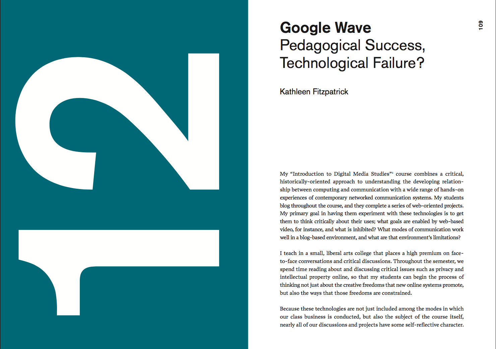
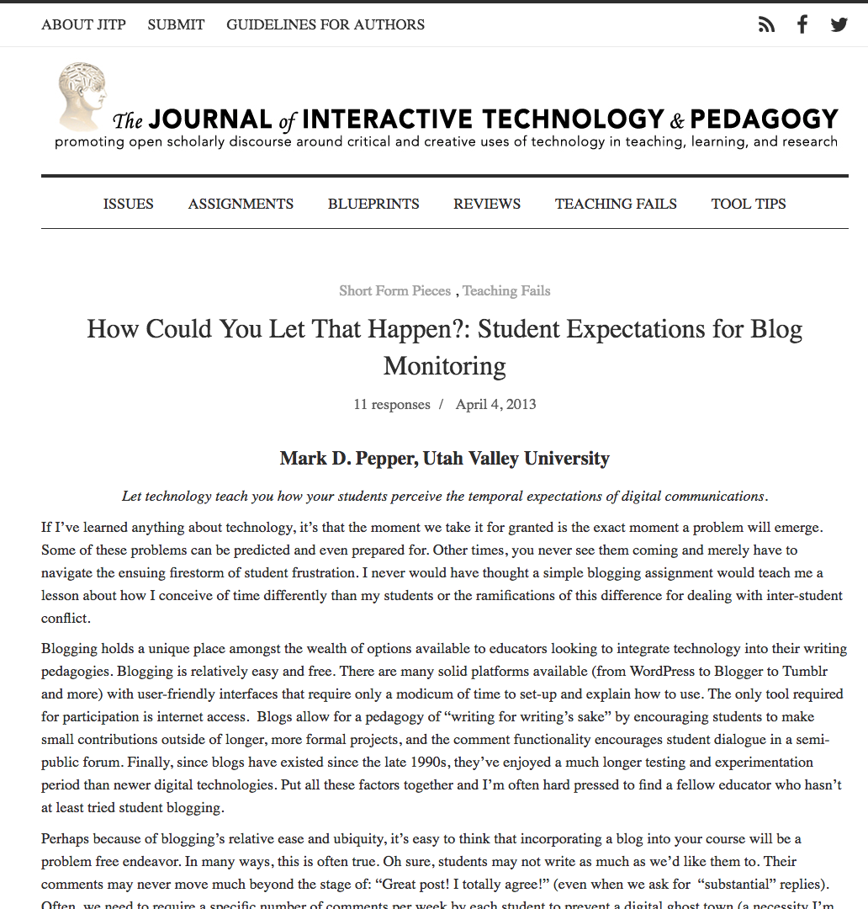
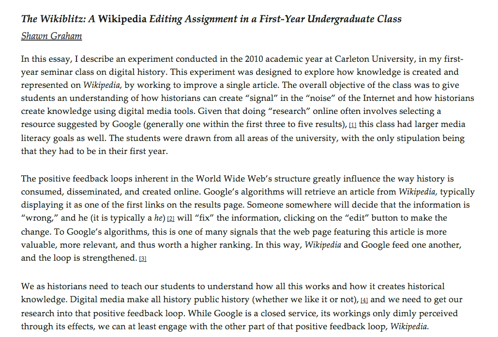
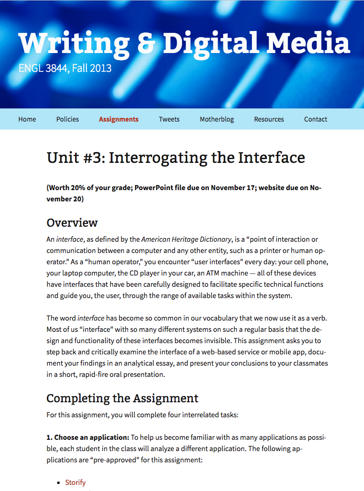
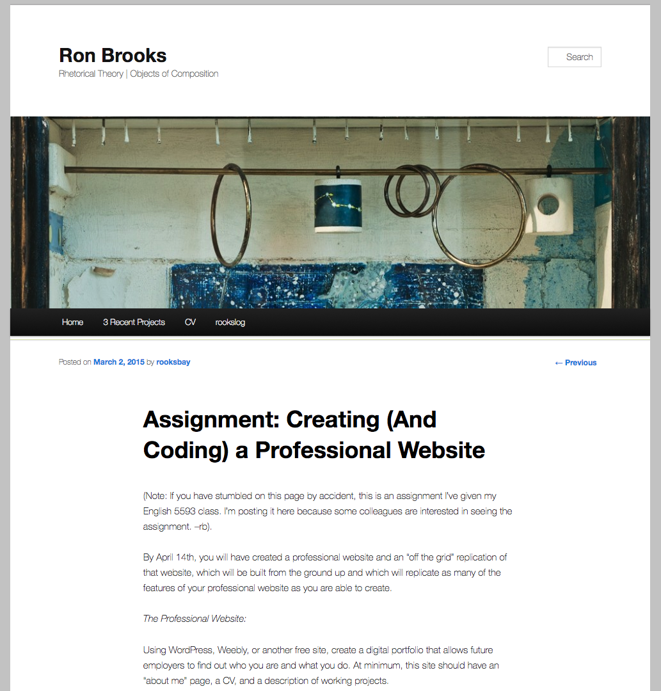
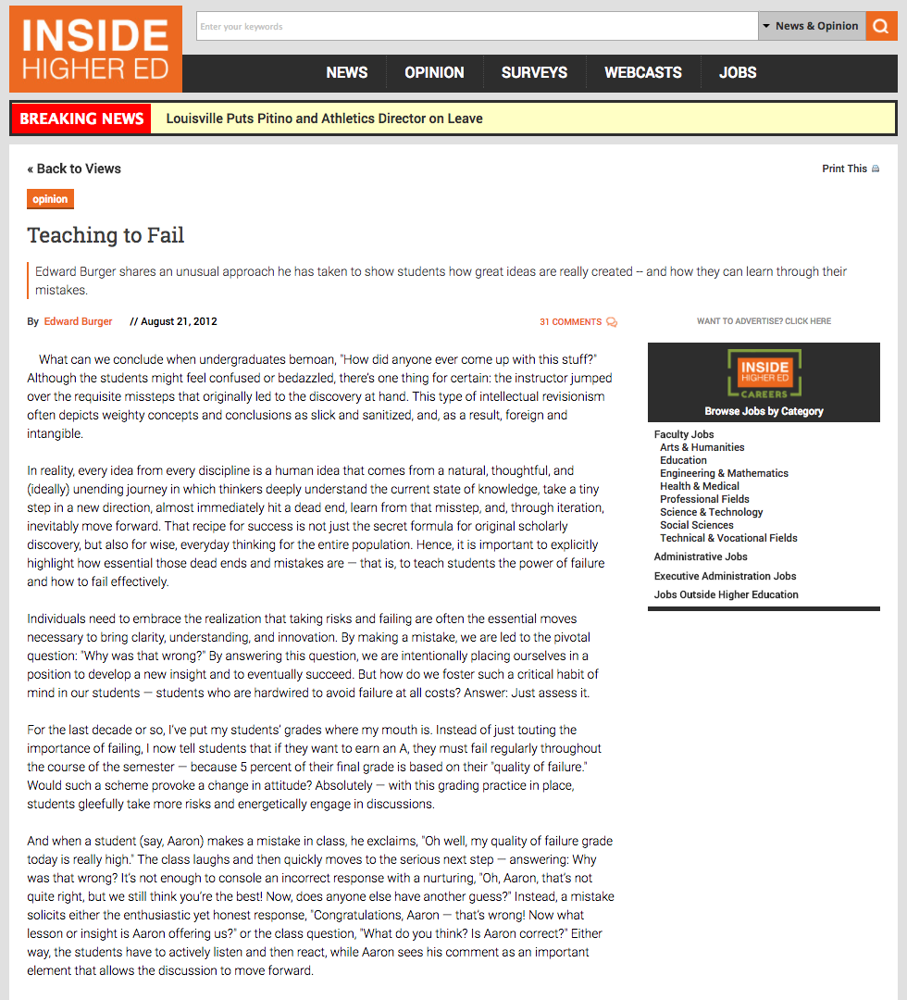
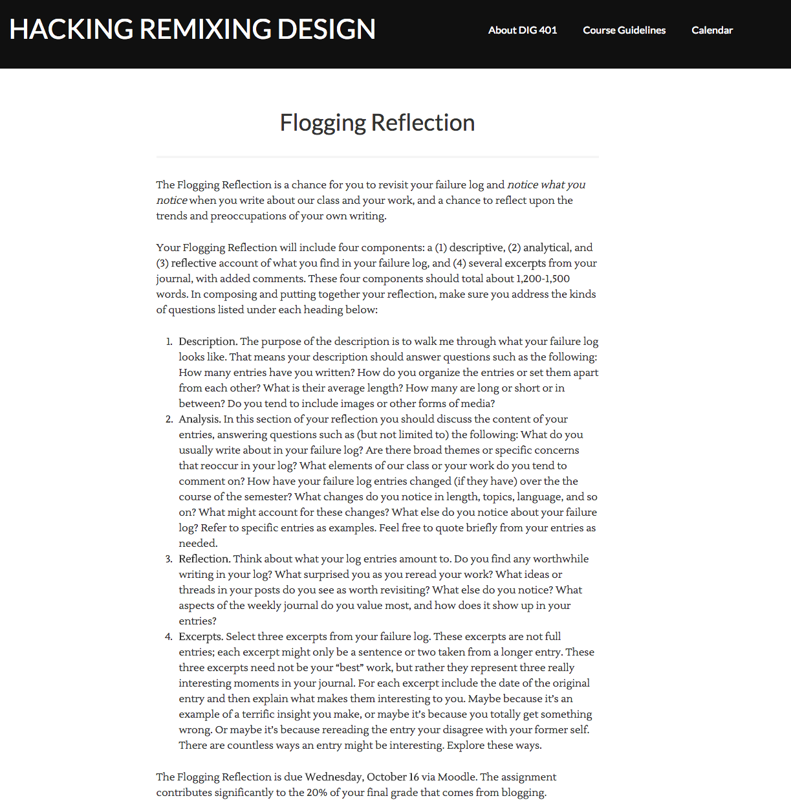
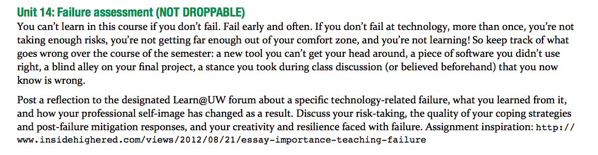
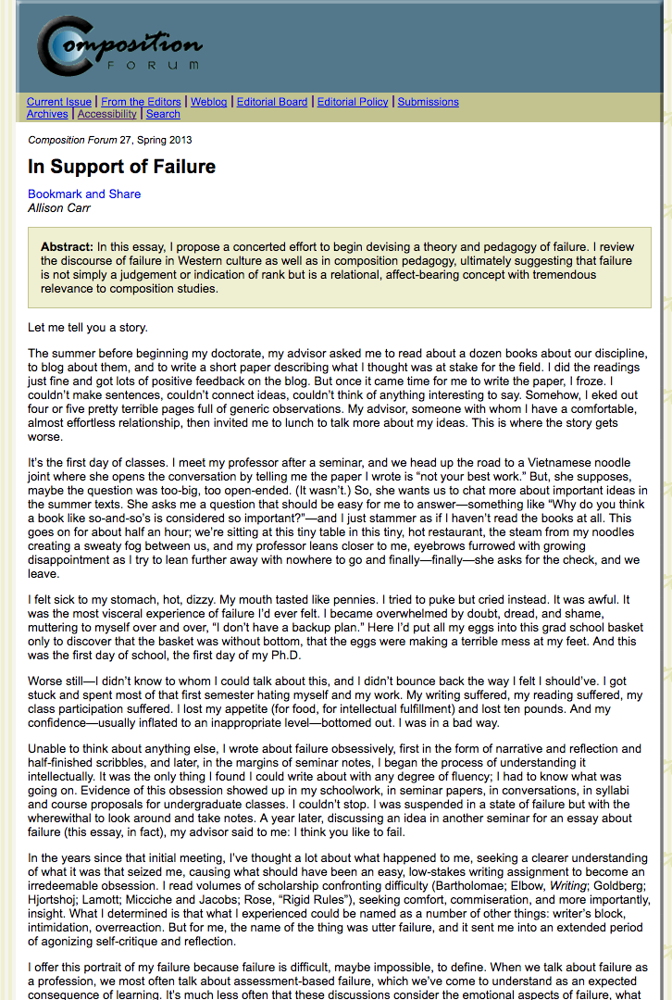

# FAILURE

## Brian Croxall and Quinn Warnick
Brigham Young University | [http://briancroxall.net](http://briancroxall.net)

Virginia Tech | [http://quinnwarnick.com](http://quinnwarnick.com)

---

##### Publication Status:
* unreviewed draft
* draft version undergoing editorial review
* draft version undergoing peer-to-peer review
* **draft version undergoing MLA copyediting**
* published 

---

### Cross-Reference Keywords: Assessment; Blogging; Code; Collaboration; Community; Digital Divides; Hacking; Iteration; Play; Praxis; Remix

---

## CURATORIAL STATEMENT
"Failure" may seem a strange word to include in a volume that examines professional praxes. Although no one wants to "fail," failing takes on new meaning in pedagogical contexts. Teachers know, through long experience, that failure is intertwined with learning (Blackburn and Cushman; Hjortshoj; Kapur; Kapur and Bielaczyc; Myers et al.). Classroom failures can include students' difficulties grasping a concept or instructors' inability to present material effectively to a particular set of personalities. In either case, such a failure can position individuals to subsequently teach others. As such, failure is an important feature of learning *and* teaching. Yet even when students or teachers know this, their affective response to failure can still be negative. As such, the artifacts below speak to and create experiences of both frustration and illumination.

Although failure is fundamental to the craft of teaching in any discipline, it perhaps has special significance within digital pedagogy. Just as many forms of digital play like video games depend on repeated failures (Juul), teaching with digital tools all too often results in the iteration of the unexpected outcome. This keyword suggests considering four tiers of failure within a classroom praxis that incorporates technology. The first tier is "technological failure." When a class session or assignment depends on web services, specialized software, or even projectors, there will inevitably be moments when the teacher or her students cannot do what was intended. The possibility of such failures, which increase whenever new digital tools are introduced, requires a willingness to take risks on the part of the digital pedagogue. 

Beyond this baseline of technological mishaps, three additional tiers of "failure" complicate its traditional connotations. The second level is "human failure," where technology functions as intended but individuals encounter difficulties either deploying it or grasping how it might shift their understanding. For example, asking students to map a novel with Google Earth could fail if a) they do not learn how Google's virtual globe works or b) they do not draw new conclusions about the narrative based on the spatial relationships of characters. In both cases, the cause of students' failure is not the technology itself but their framework for encountering it. It is worth observing, of course, that these failures could arise from either a teacher not providing appropriate scaffolding *or* students refusing to work through technical difficulties or to revise their perspective.

The third and fourth tiers represent a metacognitive approach to failure. At these levels, students and teachers shift from seeing failure as a roadblock—if a productive one, as Manu Kapur's work would describe it (see Kapur; Kapur and Bielaczyc)—and instead treat it as either an opportunity or, better yet, an epistemology. At the third tier—"failure as artifact"—students seek out and examine others' failures. For example, students in a course on web-based communication could evaluate the user experience of several websites, focusing on how the interfaces fail to meet users' needs. In a sense, this might be seen as a corollary to a peer-review workshop within process writing pedagogy. Such analysis of others' failures can help students identify and correct or avoid similar problems in their own designs.   

The highest tier of failure in digital pedagogy proposes "failure as epistemology" and occurs when students are actively encouraged to fail. Such a pedagogy might entail students producing objects that are intentionally "broken," as is the case with glitch art. In a way, such work purposefully exploits technical errors from the first tier. Another fourth-tier option might assign students to reflect on their own failures with the materials or processes of a digital pedagogy. In this case, students consider their second-tier failings and discuss what they learned through failing. In either case, such a pedagogy depends on making the stakes of failure clear: that it is both expected and should be productive; that the grading environment for such a failure is low (or even no) stakes; and that they will receive both immediate feedback and a chance to try again (see Croxall). Clear communication about the pedagogical purpose of purposive failure helps reassure a range of students, each of whom will differ in resilience and affective response to "failure." That same clear communication can also protect those who teach in precarious circumstances and therefore might have concerns about how colleagues or students treat admissions of or invitations to failure.

In each of the four tiers outlined here, failure may prove productive and engaging. While teachers should not be "unduly optimistic" about failure or the feelings that it may engender, they should also remember Jack Halberstam's suggestion that they need not be a "dead end": "Under certain circumstances failing [...] may in fact offer more creative, more cooperative, more surprising ways of being in the world" (24; 2-3). Ultimately, it is only the fear of failure that one should always avoid.

## CURATED ARTIFACTS

### Tier One

#### "Google Wave: Pedagogical Success, Technological Failure?"

* Artifact Type: collaborative projects
* Source URL: [https://archive.org/details/LearningThroughDigitalMedia](https://archive.org/details/LearningThroughDigitalMedia)
* Permissions: CC BY-NC-ND
* Creator and Affiliation: [Kathleen Fitzpatrick](http://www.plannedobsolescence.net), Michigan State University
* Tags: reflective essay; Google Wave; defunct technology; class notes; getting started; writing

Google Wave was billed as "what email would look like if it were invented today" when it was announced in 2009 (Pash). But Kathleen Fitzpatrick saw the real-time, group-writing space of Wave as an opportunity for her students to collaboratively create class notes. Along with providing the details of the assignment, she considers the web services (e.g., Google accounts) and classroom infrastructure (e.g. laptops available to students) that the assignment depended on. Fitzpatrick relates that the assignment worked well and that she had hoped to continue working with Wave in the future, but that the platform itself was discontinued due to its instability and Google's inability to market it appropriately as "extremely powerful groupware." As such, Wave is an example of a first-tier failure. Similar capabilities exist within Google Docs, but the too-familiar environment of word processing might constrain what students would do with it.

### Tier Two 

#### "How Could You Let That Happen?: Student Expectations for Blog Monitoring"

* Artifact Type: assignments
* Source URL: [http://jitp.commons.gc.cuny.edu/how-could-you-let-that-happen-student-expectations-for-blog-monitoring/](http://jitp.commons.gc.cuny.edu/how-could-you-let-that-happen-student-expectations-for-blog-monitoring/)
* Permissions: CC BY-NC-SA 3.0
* Creator and Affiliation: Mark D. Pepper, Utah Valley University
* Tags: reflective essay; blogging; getting started; writing

*The Journal of Interactive Technology & Pedagogy* features a section on "[teaching fails](http://jitp.commons.gc.cuny.edu/category/teaching-fails/)," and in this one Mark D. Pepper discusses what happened when a controversial image was shared on his class's blog. When the comment thread "got ugly," students wanted to know why their teacher had not intervened---not noticing that it was 11pm at night. Pepper considers this a teaching fail because he did not meet his student expectations nor did he help them understand how a blog functions differently from a class discussion. This experience is a second tier failure since the issue stems from people's expectations of technologies rather than the tool itself. The essay closes by discussing how Pepper now prepares students to interact with the blog and to establish ground rules, and is a useful site for those who include similar public assignments.

#### The Wikiblitz: A *Wikipedia* Editing Assignment in a First-Year Undergraduate Class

* Artifact Type: collaborative projects
* Source URL: [http://quod.lib.umich.edu/d/dh/12230987.0001.001/1:5/--writing-history-in-the-digital-age?g=dculture;rgn=div1;view=fulltext;xc=1#5.3](http://quod.lib.umich.edu/d/dh/12230987.0001.001/1:5/--writing-history-in-the-digital-age?g=dculture;rgn=div1;view=fulltext;xc=1#5.3)
* Permissions: CC BY-NC-ND 3.0
* Creator and Affiliation: [Shawn Graham](http://electricarchaeology.ca/), Carleton University
* Tags: reflective essays; wikis; Wikipedia; getting started; writing

In a order to teach his students "how historians create knowledge using digital tools," Shawn Graham's students collectively edited a single *Wikipedia* entry within one class session. They then watched over the following days to see how the community would accept or reject the edits. This work was preceded by several days of discussion about Wikipedia style and editorial policies. The assignment successfully taught the conservative nature of both the discipline of history and the web. But what surprised him was the reluctance of the history majors in his class (who made up a minority) to participate. Many of them expressed a desire for an authoritative voice (as opposed to that of the crowd), and several skipped the in-class project. This artifact suggests that teachers who employ digital pedagogy should prepare for resistance from those who are most closely tied to their domain and is accordingly a human-based, tier-two failure.

### Tier Three

#### "Interrogating the Interface"

* Artifact Type: assignments
* Source URL: [http://3844f13.quinnwarnick.com/unit3/](http://3844f13.quinnwarnick.com/unit3/)
* Permissions: CC BY-NC-SA 3.0
* Creator and Affiliation: [Quinn Warnick](http://quinnwarnick.com/), Virginia Tech
* Tags: user interface; user experience; UI/UX; evaluation; getting started; PowerPoint; writing

To help students understand digital artifacts as a product of both intentional design choices and the unintentional side effects of those choices, I ask students to "step back and critically examine the interface of a web-based service or mobile app." While working with a particular tool, class members need to consider both its affordances—what it allows one to do—and its constraints—what it prevents one from doing. The assignment actively encourages students to find moments where the website crashes or otherwise fails. Finished projects include an essay and an [Ignite](http://www.ignitetalks.io/)-style presentation. By focusing on the specificities—including the failures—of a site made by others, this project encourages students to work within the third tier of failure. Teachers could adopt this project for any course that examines digital media, and they could easily adapt it for peer review of multimodal composition or for evaluating user interfaces and experiences.

#### Creating (And Coding) a Professional Website

* Artifact Type: assignments
* Source URL: [http://www.rooksbay.com/2015/03/creating-and-coding-a-professional-website/](http://www.rooksbay.com/2015/03/creating-and-coding-a-professional-website/) 
* Permissions: Permissions form
* Creator and Affiliation: [Ron Brooks](http://www.rooksbay.com), Montclair State University
* Tags: reverse engineering; CSS; HTML; coding; getting started; portfolio

After students have created professional online portfolios using simple, free tools like [WordPress](http://wordpress.com) and [Weebly](http://www.weebly.com/), Ron Brooks asks them to re-create, or "reverse engineer," their websites from scratch using HTML and CSS. Given that most of his students have little to no experience with web design, Brooks acknowledges that "many of us are going to fail"; indeed, "failure is part of the point." A key aspect of the assignment, then, is for students to carefully document and reflect on the failures they encounter. By completing a series of short exercises that stretch their technical skill to (and beyond) the breaking point, students gain an appreciation for the complexity of professional websites and develop strategies for helping themselves and their classmates overcome—and sometimes accept—failure. Ultimately, the process of replicating a website helps students weigh the costs and benefits of using templates versus writing markup by hand. 

### Tier Four

#### "Teaching to Fail"

* Artifact Type: learning objective
* Source URL: [http://www.insidehighered.com/views/2012/08/21/essay-importance-teaching-failure](http://www.insidehighered.com/views/2012/08/21/essay-importance-teaching-failure)
* Permissions: Permissions form
* Creator and Affiliation: [Edward Burger](http://www.southwestern.edu/president/), Southwestern University
* Tags: reflective essay; getting started; writing; grading

Mathematician and Southwestern University President Edward Burger suggests teachers are prone to providing a too-neat, re-written version of intellectual history within their subjects and that the corrective is "to teach students the power of failure and how to fail effectively." To accomplish this, he makes 5% of his students' grades dependent on their "quality of failure." Fostering a culture of failure helps students speak up in class and for the class to identify if, how, and where they were wrong—and how they can learn from those missteps. Students evaluate themselves based on how they have grown from their failures during the semester. Although it is perhaps easy to understand how students are regularly wrong in math classes, Burger's methods can be easily adapted in the humanities. 

#### "Flogging Reflection"

* Artifact Type: assignments
* Source URL: [http://web.archive.org/web/20150822212436/sites.davidson.edu/hacking/course-guidelines/flogging-reflection](http://web.archive.org/web/20150822212436/sites.davidson.edu/hacking/course-guidelines/flogging-reflection)
* Permissions: Permissions form
* Creator and Affiliation: 
* Creator: [Mark Sample](http://samplereality.com), Davidson College
* Tags: writing; blogging; reflective essay; getting started

As part of a new Digital Studies program at Davidson College, Mark Sample's *Hacking Remixing Design* course asked students to investigate all three terms as both creative and critical practices. Since students will be working with unfamiliar technologies and new vocabularies, they are asked to keep a "failure log" or "flog" to help individuals "reflect on things that don't work for you in this class" [Sample, "Course Guidelines"](http://web.archive.org/web/20150822212431/http://sites.davidson.edu:80/hacking/course-guidelinesxtweb.archive.org/web/20150822212431/http://sites.davidson.edu:80/hacking/course-guidelines). As a mid-semester assignment, the "Flogging Reflection" leads students to describe, analyze, and reflect upon their failures to that point. As Sample makes clear, "flogging" is very similar to the blogging that he assigns in other classes but focusing solely on moments of confusion or technical difficulty. Although he does not directly invite his students to fail, this assignment fits into the fourth tier due to its reconfiguring of success within the class.

#### "Failure Assessment"

* Artifact Type: syllabi
* Source URL: [http://files.dsalo.info/644syllsum2014.pdf](http://files.dsalo.info/644syllsum2014.pdf)
* Permissions: CC0 US
* Creator: [Dorothea Salo](http://dsalo.info/), University of Wisconsin--Madison
* Tags: writing; reflective essay; getting started

Taking inspiration from Edward Burger's "Teaching to Fail" (mentioned above), Dorothea Salo requires her library science students to "fail early and often." As one of the final assignments for the course, her students are asked to discuss their risk-taking and how they coped with their failures. The course has a number of highly technical requirements, as might be expected in an LIS program, and the inclusion of this assignment helps alleviate any potential concern students might have in approaching the subject matter. That said, the assignment allows for students to consider more than just technology fails but also "blind alley[s]" within their research and previously held viewpoints that they now know to be wrong. The students must also assess how failing changed their "professional self-image." This last requirement makes it a useful model for graduate education, where students are often presumed to already know what they are being taught.

#### "Micro-Project VI: Glitched Aberrations"

* Artifact Type: assignments
* Source URL: [http://oss.adm.ntu.edu.sg/2014-da9003/micro-project-vi-glitched-abberations/](http://oss.adm.ntu.edu.sg/2014-da9003/micro-project-vi-glitched-abberations/)
* Permissions: Permissions form
* Creator: [Randall Packer](http://www.randallpacker.com/), Nanyang Technological University
* Tags: art; getting started; Photoshop; text editor; blogging; images; code; hacking

In a class focusing on "Internet Art & Culture," Randall Packer provides his students with hands-on exercises to produce glitch art—a style produced when artists intentionally corrupt the underlying data of sound, video, or image files to produce unexpected results. Students select images to transform and take one of two paths: 1) using a text editor to alter the stream of characters that make up the image or 2) altering the metadata about the file in the RAW format. Both approaches produce altered images, but the results are impossible to predict. By investigating the aesthetic of these "failed" images, this assignment qualifies as tier four. Instructors looking to provide a short tutorial to glitch art could reliably use this tutorial as well as draw on the [resources collected by Phillip Stearns](http://phillipstearns.wordpress.com/glitch-art-resources/).

#### "In Support of Failure"

* Artifact Type: assignments
* Source URL: [http://compositionforum.com/issue/27/failure.php](http://compositionforum.com/issue/27/failure.php)
* Permissions: CC BY-SA 3.0
* Creator: Allison Carr, Coe College
* Tags: reflective essay; affect; emotion; graduate school; pedagogy; writing

Drawing on personal experiences with failure early in her graduate program, Allison Carr explores the "emotional rollercoaster of intellectual work" and questions why the idea of failure is "strikingly absent" from disciplinary conversations. Carr, who curates two *Tumblr* sites dedicated to the topic—[The Failure Project](http://thefailureproject.tumblr.com) and [failspace](http://doingfailure.tumblr.com)—argues that we must move past overly simplistic views of failure, which treat mistakes as something to learn from and then overcome, and take failure seriously, as a "_deeply felt_, transformative process that incorporates feelings of anxiety, desperation, confusion, and shame" (original emphasis). Carr then outlines a "pedagogy of failure" that treats it as an object of study, a learning outcome, and a cause for celebration. To help instructors interested in adopting this pedagogical approach she describes six activities designed to "[make] failure—and failure's feltness—more visible and present in the writing classroom."

## RELATED MATERIALS

* Bond, Richard E. "Failing Lessons: Tales of Disastrous Assignments." www.historians.org/publications-and-directories/perspectives-on-history/january-2013/failing-lessons-tales-of-disastrous-assignments.

* Croxall, Brian. "Tired of Tech: Avoiding Tool Fatigue in the Classroom." *Writing & Pedagogy*.

* "Failure" issue. *Harvard Business Review*. hbr.org/archive-toc/BR1104. 

* Harris, Katherine D. "Play, Collaborate, Break, Build, Share: ‘Screwing Around' in Digital Pedagogy. The Debate to Define Digital Humanities...Again." ojcs.siue.edu/ojs/index.php/polymath/article/view/2853/884.

* Unsworth, John. "Documenting the Reinvention of Text: The Importance of Failure." dx.doi.org/10.3998/3336451.0003.201.

## WORKS CITED

Automattic. *WordPress.com*, wordpress.com. Accessed 22 Sept. 2017.

Blackburn, Lorelei, and Ellen Cushman. "Assessing Sustainability: The Class That Went Terribly Wrong." *Unsustainable: Re-imagining Community Literacy, Public Writing, Service-Learning and the University*, edited by Jessica Restaino and Laurie JC Cella, Lexington Books, 2013, pp. 161–77.

Bond, Richard E. "Failing Lessons: Tales of Disastrous Assignments." *Perspectives on History*, vol. 51, no. 1, Jan. 2013, www.historians.org/publications-and-directories/perspectives-on-history/january-2013/failing-lessons-tales-of-disastrous-assignments. Accessed 21 Sept. 2017.

Brooks, Ron. "Assignment: Creating (And Coding) a Professional Website." *Ron Brooks*, 2 Mar. 2015, www.rooksbay.com/2015/03/creating-and-coding-a-professional-website/. Accessed 21 Sept. 2017.

Burger, Edward. "Teaching to Fail." *Inside Higher Ed*, 21 August 2012, www.insidehighered.com/views/2012/08/21/essay-importance-teaching-failure. Accessed 21 Sept. 2017.

Carr, Allison. *Failspace*. *Tumblr*, doingfailure.tumblr.com. Accessed 21 Sept. 2017.

---. "In Support of Failure." *Composition Forum*, 27, Spring 2013, compositionforum.com/issue/27/failure.php. Accessed 21 Sept. 2017.

---. *The Failure Project*. *Tumblr*, thefailureproject.tumblr.com. Accessed 21 Sept. 2017.

Croxall, Brian. "Tired of Tech: Avoiding Tool Fatigue in the Classroom." *Writing & Pedagogy*, vol. 5, no. 2, 2013, pp. 250-268.

"Failure" issue. *Harvard Business Review*, Apr. 2011, hbr.org/archive-toc/BR1104. Accessed 22 Sept. 2017.

Fitzpatrick, Kathleen. "Google Wave: Pedagogical Success, Technological Failure?" *Learning Through Digital Media: Experiments in Technology and Pedagogy*, edited by R. Trebor Scholz, The Institute for Distributed Creativity, 2011, pp. 109-15. *Internet Archive*, archive.org/details/LearningThroughDigitalMedia. Accessed 21 Sept. 2017.

Graham, Shawn. "The Wikiblitz: A *Wikipedia* Editing Assignment in a First-Year Undergraduate Class." *Writing History in the Digital Age*, edited by Kristen Nawrotzki and Jack Dougherty, University of Michigan Press, quod.lib.umich.edu/d/dh/12230987.0001.001/1:5/--writing-history-in-the-digital-age?g=dculture;rgn=div1;view=fulltext;xc=1#5.3. DigitalCultureBooks. Accessed 21 Sept. 2017. 

Halberstam, Judith (Jack). *The Queer Art of Failure*. Duke UP, 2011.

Harris, Katherine D. "Play, Collaborate, Break, Build, Share: ‘Screwing Around' in Digital Pedagogy. The Debate to Define Digital Humanities...Again." *Polymath*, vol. 3, no. 3, 2013, ojcs.siue.edu/ojs/index.php/polymath/article/view/2853/884. Accessed 21 Sept. 2017.

Hjortshoj, Keith. *Understanding Writing Blocks*. Oxford UP, 2001.

Ignite Talks PBC. *Ignite*, www.ignitetalks.io/. Accessed 22 Sept. 2017.

Juul, Jesper. *The Art of Failure: An Essay on the Pain of Playing Video Games*. MIT P, 2013.

Kapur, Manu. "Productive Failure." *Cognition and Instruction*, vol. 26, no. 3, 2008, pp. 379-424. *Taylor & Francis Online*, dx.doi.org/10.1080/07370000802212669. Accessed 21 Sept. 2017.

Kapur, Manu and Katerine Bielaczyc. "Designing for Productive Failure." *Journal of the Learning Sciences*, vol. 21, no. 1, 2012, pp. 45-83. *Taylor & Francis Online*, dx.doi.org/10.1080/10508406.2011.591717. Accessed 21 Sept. 2017.

Myers, Christopher G., et al. "‘My Bad!' How Internal Attribution and Ambiguity of Responsibility Affect Learning from Failure." Harvard Business School Working Paper, 14-104, 18 Apr. 2014, citeseerx.ist.psu.edu/viewdoc/download?doi=10.1.1.1025.7355&rep=rep1&type=pdf. Accessed 22 Sept. 2017. 

Packer, Randall. "Micro-project VI: Glitched Aberrations." *Internet Art & Culture*, Open Source Studio, Nanyang Technological University, oss.adm.ntu.edu.sg/2014-da9003/micro-project-vi-glitched-abberations. Accessed 21 Sept. 2017.

Pash, Adam. "Google Wave ‘Is what Email would Look Like if it was Invented Today.'" *Lifehacker*, 28 May 2009, lifehacker.com/5272048/google-wave-is-what-email-would-look-like-if-it-were-invented-today. Accessed 21 Sept. 2017.

Pepper, Mark D. "How Could You Let That Happen?: Student Expectations for Blog Monitoring." *The Journal of Interactive Technology & Pedagogy*, 4 Apr. 2013, jitp.commons.gc.cuny.edu/how-could-you-let-that-happen-student-expectations-for-blog-monitoring. Accessed 21 Sept. 2017.

Salo, Dorothea. "LIS 644: Digital Trends, Tools, and Debates." *Dorothea Salo*, Summer 2014, files.dsalo.info/644syllsum2014.pdf. Accessed 22 Sept. 2017.

Sample, Mark. "Flogging Reflection." *Hacking Remixing Design*,  Fall 2013, web.archive.org/web/20150822212436/sites.davidson.edu/hacking/course-guidelines/flogging-reflection. Accessed 22 Sept. 2017.

Sample, Mark. "Course Guidelines." *Hacking Remixing Design*, Fall 2013, web.archive.org/web/20150822212431/http://sites.davidson.edu:80/hacking/course-guidelines. Accessed 22 Sept. 2017.

Shaughnessy, Mina. *Errors & Expectations: A Guide for the Teachers of Basic Writing*. Oxford UP, 1977. 

Stearns, Phillip. "Glitch Art Resources." *Phillip Stearns*, phillipstearns.wordpress.com/glitch-art-resources/. Accessed 21 Sept. 2017.

"Teaching Fails." *The Journal of Interactive Technology & Pedagogy*, jitp.commons.gc.cuny.edu/category/teaching-fails. Accessed 21 Sept. 2017.

Unsworth, John. "Documenting the Reinvention of Text: The Importance of Failure." *The Journal of Electronic Publishing*, vol. 3, no. 2, Dec. 1997, dx.doi.org/10.3998/3336451.0003.201. Accessed 22 Sept. 2017.

Warnick, Quinn. "Unit #3: Interrogating the Interface." *Writing & Digital Media*, Fall 2013, 3844f13.quinnwarnick.com/unit3. Accessed 22 Sept. 2017.

Weebly, Inc. *Weebly*, www.weebly.com. Accessed 22 Sept. 2017.
