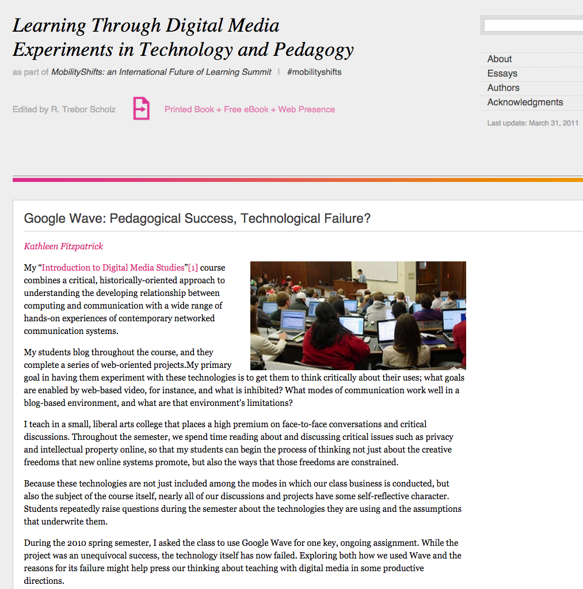
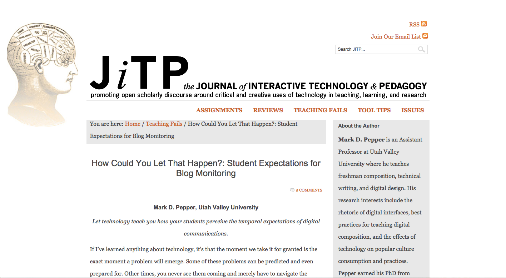
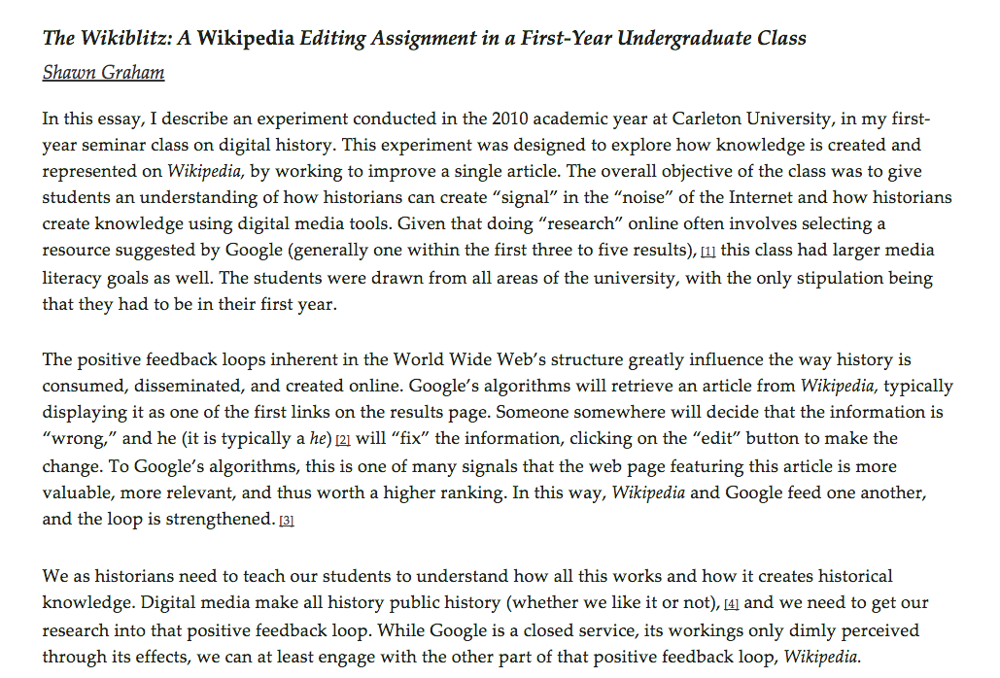
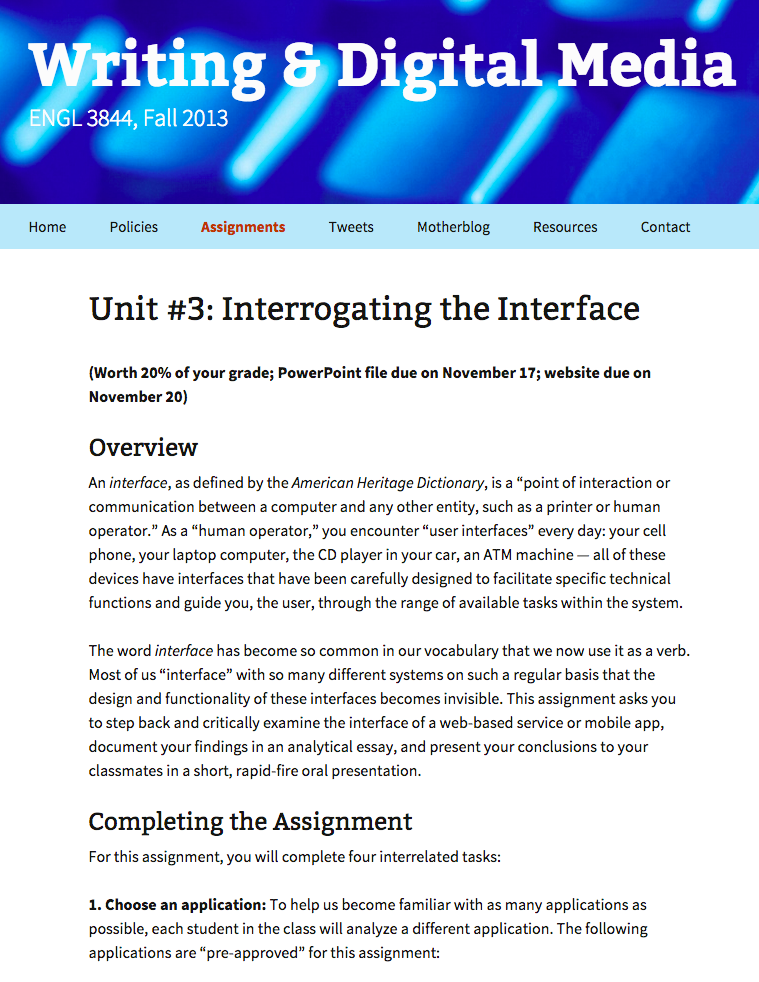
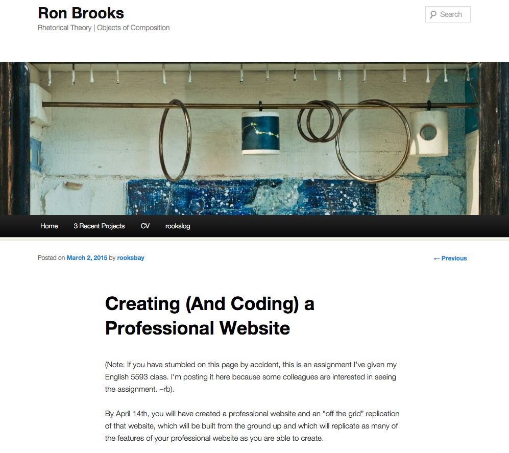
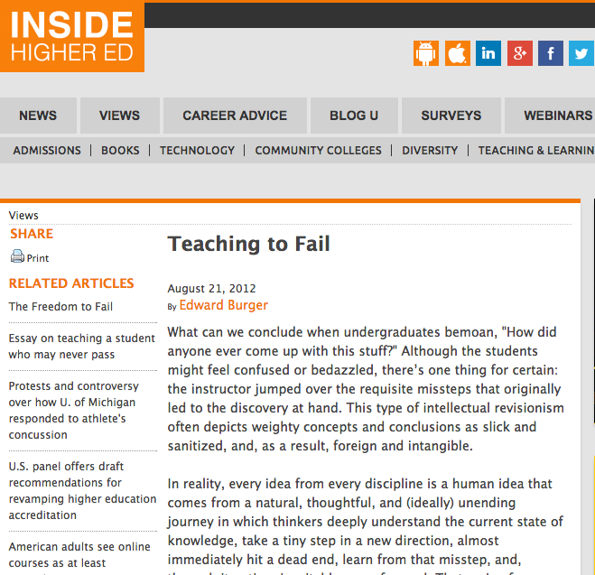
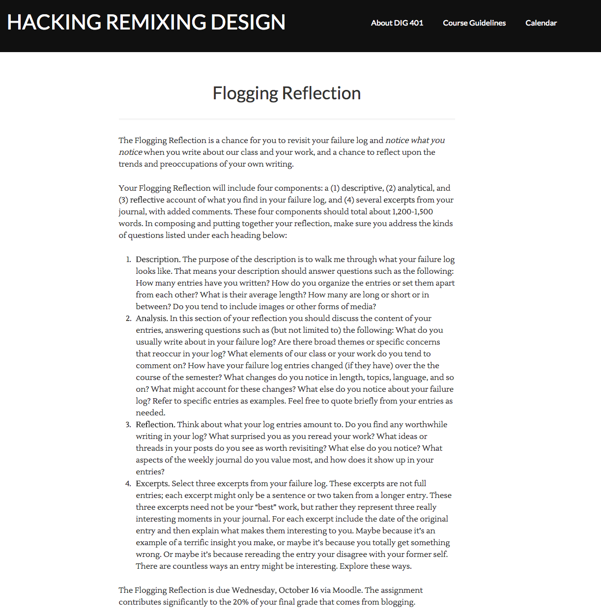
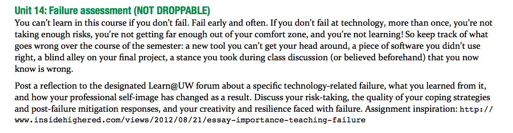
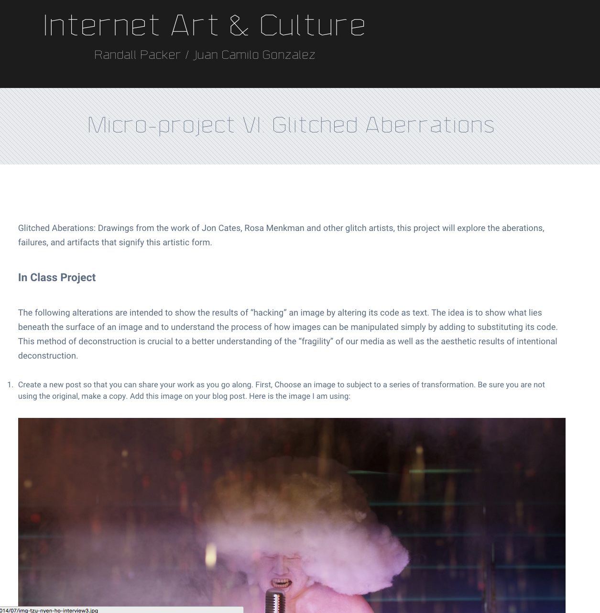
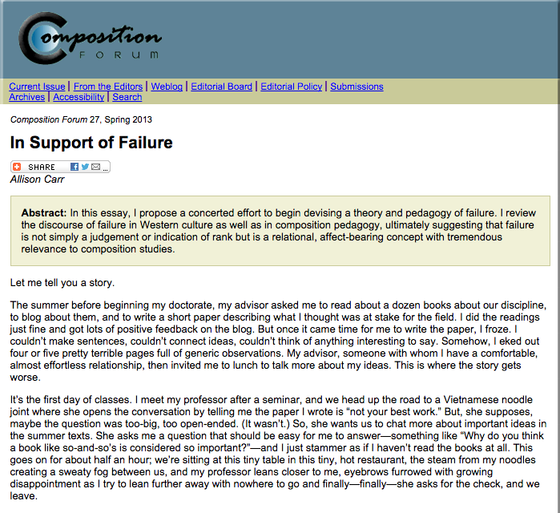

# FAILURE (Draft)

## Brian Croxall and Quinn Warnick
Brown University | Brown University Library and the Brown Center for Digital Scholarship | [Website](http://briancroxall.net)

Virginia Tech | The Center for Applied Technologies in the Humanities| [Website](http://quinnwarnick.com)

##### Publication Status:
* unreviewed draft
* draft version undergoing editorial review
* **draft version undergoing peer-to-peer review**
* published 

## CURATORIAL STATEMENT
"Failure" is a complicated word to include in a volume that examines and highlights professional praxes. Although no one wants to be "a failure" in her work, failing takes on a different meaning when it happens in the context of pedagogy. Teachers know, through long experience in the classroom, that failure is intertwined with learning (Blackburn and Cushman; Hjortshoj; Myers, Staats, and Gino; Shaughnessy). These failures can include difficulties students have in grasping a concept as well as our own failures to present the material effectively to a particular set of personalities. Moreover, a failure to immediately grasp a concept often positions our students—or ourselves—to better teach the concept to others who might have similar difficulties. As such, failure is not only a prerequisite to learning but also to teaching. 

Although failure is fundamental to the craft of teaching, regardless of one's discipline, it takes on special significance within digital pedagogy. We suggest considering four different tiers of failure within a classroom that depends upon technology. The baseline level of failure consists of technical glitches. While failure is always a possibility in the classroom—and, as mentioned, a potentially productive one at that—the likelihood of failure increases any time a new digital tool is introduced. When a class session or assignment depends on web services, specialized software, or even the classroom projector, there will inevitably be some instances when it is impossible for the teacher or the students to do what she had intended. Hence, an instructor should prepare a contingency plan for any class session that depends on technologies that are not completely within her control. The possibility of such baseline failures suggests a willingness to take risks on the part of the digital pedagogue. Although it can be disruptive and stressful to lose control of the classroom, these moments of failure create opportunities for engaged learning. The students learn to see us as fallible and discover that such problems can be overcome.

Beyond this baseline of failing technologies, we propose three additional tiers of failure within digital pedagogy that complicate traditional connotations of the word. At the second level, the tools function as intended, but students encounter difficulties either in deploying them or in understanding how the tools might shift their analysis of the humanistic text. In both cases, the cause of the students' failure is not the tool itself but their framework for encountering the tool. By the time students reach a college literature classroom, for example, they have likely had years of experience writing essays that call upon the skills of close reading and literary interpretation. The technical tools they use to accomplish this work (e.g., a word processor) are likewise familiar. Presenting the students with a new method for engaging with familiar material could result in failure due to unfamiliarity with a tool—as might be the case when asking students to map a novel in Google Earth when they have never used it before—or with the methodology—as might happen if students fail to draw effective conclusions about the characters based on their movements in and through space. It is worth observing, of course, that these failures might be attributed to a teacher not providing appropriate scaffolding for students *or* to a student who refuses to get out of his comfort zone or to push through technical difficulties.

The third and fourth tiers represent "higher thinking" about failure. By this, we mean that students and teachers shift from seeing failure as a roadblock—if a productive one—and instead conceive of failure as either an opportunity or, better yet, an epistemology. The third tier asks students to seek out failure in others' work. In a sense, this might be seen as a corollary to a peer review workshop within a process-based writing pedagogy. Students in a course on web-based communication could be tasked with evaluating the user interface and experience (UI / UX) of a website, focusing on how sites fail to anticipate or meet users’ needs. Such analysis of others’ failures can help students avoid similar problems in their own designs.   

We suggest that the highest plateau of failure in digital teaching is when students are actively encouraged to fail or when assignments require students to “break” digital tools. Such a pedagogy of failure might entail a class producing objects that are flawed in one sense or another, as is the case with glitch art, which depends on corrupting sound, video, or image data to produce an unexpected result. In this way, the technical glitch that occurs at the first tier is exploited purposively. Another option might encourage students to push software tools or computer hardware to the point at which they can no longer function appropriately, such as trying to parse a too-large data set with a computer with too little memory. A third option might be to encourage student reflection on their own failures with the appurtenances of digital pedagogy; in this manner, this fourth tier of failure brings the students back to the second tier and asks them to discuss what they have learned in the process of failing. 

In short, there are many ways to fail when engaged in digital pedagogy:
1. Technological Failure
2. Human Failure
3. Failure as Artifact
4. Failure as Epistemology
In each of these cases, failure may well prove to be productive and engaging. In the end, it is only the fear of failure that one should always avoid.

#### Selection Criteria
The artifacts selected below represent objects from the different tiers of failure within digital pedagogy. These range from statements from practitioners about broken assignments—failure recollected in tranquility, to repurpose Wordsworth—to assignments that actively encourage failure of one sort or another from students. 

## CURATED ARTIFACTS

## Tier One

### “Google Wave: Pedagogical Success, Technological Failure?”
* Artifact Type: Reflective essay and assignment

* Source URL: [http://learningthroughdigitalmedia.net/google-wave-pedagogical-success-technological-failure](http://learningthroughdigitalmedia.net/google-wave-pedagogical-success-technological-failure)
* Copy of Artifact:
* Creator: [Kathleen Fitzpatrick](http://www.plannedobsolescence.net) (Modern Language Association)

Google Wave was billed as “what email would look like if it were invented today” when it was announced in 2009 (Pash). But Kathleen Fitzpatrick saw the real-time, group-writing space of Wave as an opportunity for her students to collaboratively create class notes. Along with providing the details of the assignment, she considers the web services (e.g., Google accounts) and classroom infrastructure (e.g. laptops available to students) that the assignment depended on. Fitzpatrick relates that the assignment worked well and that she had hoped to continue working with Wave in the future, but that the platform itself was discontinued due to its instability and Google’s inability to market it appropriately as “extremely powerful groupware.” As such, Wave is an example of a first-tier failure. Similar capabilities exist within Google Docs, but the too-familiar environment of word processing might constrain what students would do with it.

## Tier Two 

### “How Could You Let That Happen?: Student Expectations for Blog Monitoring”
* Artifact Type: Reflective essay

* Source URL: [http://jitp.commons.gc.cuny.edu/how-could-you-let-that-happen-student-expectations-for-blog-monitoring/](http://jitp.commons.gc.cuny.edu/how-could-you-let-that-happen-student-expectations-for-blog-monitoring/)
* Copy of Artifact:
* Creator: [Mark D. Pepper](http://markdpepper.com/) (Utah Valley University)

*The Journal of Interactive Technology & Pedagogy* features a section on “[teaching fails](http://jitp.commons.gc.cuny.edu/category/teaching-fails/),” and in this one Mark D. Pepper discusses what happened when a controversial image was shared on his class’s blog. When the comment thread “got ugly,” students wanted to know why their teacher hadn’t intervened---not noticing that it was 11pm at night. Pepper considers this a teaching fail because he did not meet his student expectations nor did he help them understand how a blog functions differently from a class discussion. This experience is a second tier failure since the issue stems from people’s expectations of technologies rather than the tool itself. The essay closes by discussing how Pepper now prepares students to interact with the blog and to establish ground rules, and is a useful site for those who include similar public assignments.

### The Wikiblitz: A *Wikipedia* Editing Assignment in a First Year Undergraduate Class
* Artifact Type: Reflective essay and assignment

* Source URL: [http://quod.lib.umich.edu/d/dh/12230987.0001.001/1:5/--writing-history-in-the-digital-age?g=dculture;rgn=div1;view=fulltext;xc=1#5.3](http://quod.lib.umich.edu/d/dh/12230987.0001.001/1:5/--writing-history-in-the-digital-age?g=dculture;rgn=div1;view=fulltext;xc=1#5.3)
* Copy of Artifact:
* Creator: Shawn Graham

In a order to teach his students “how historians create knowledge using digital tools,” Shawn Graham’s students collectively edited a single *Wikipedia* entry within one class session. They then watched over the following days to see how the community would accept or reject the edits. This work was preceded by several days of discussion about Wikipedia style and editorial policies. The assignment successfully taught the concepts conservative nature of both history and the web. But what caught his surprise was the reluctance of the history majors in his class (who made up a minority). Many of them expressed a desire for an authoritative voice (as opposed to that of the crowd), and several skipped the in-class project. This artifact suggests that teachers who employ digital pedagogy should prepare for resistance from those who are most closely tied to their domain and is accordingly a human-based, tier-two failure.

## Tier Three

### “Interrogating the Interface”
* Artifact Type: Assignment description

* Source URL: [http://3844f13.quinnwarnick.com/unit3/](http://3844f13.quinnwarnick.com/unit3/)
* Copy of Artifact:
* Creator: [Quinn Warnick](http://quinnwarnick.com/)

To help students learn to see digital media as a product of design and choices, Quinn Warnick asks students to “step back and critically examine the interface of a web-based service or mobile app.” While working with a particular tool, class members need to consider both its affordances--what it allows one to do--and its constraints--what it prevents one from doing. The assignment actively encourages students to find moments where the website crashes or otherwise fails. Finished projects include an essay and an [Ignite](http://igniteshow.com/)-style presentation. By focusing on the specificities--including the failures--of a site made by others, this project encourages students to work within the third tier of failure. Teachers could adopt this project for any course that examines digital media, and they could easily adapt it for peer review of multimodal composition or for evaluating user interface and experience (UI / UX). 

### Creating (And Coding) a Professional Website
* Artifact Type: Assignment description and student responses

* Source URL: [http://www.rooksbay.com/2015/03/creating-and-coding-a-professional-website/](http://www.rooksbay.com/2015/03/creating-and-coding-a-professional-website/) 
* Copy of Artifact: 
* Creator: [Ron Brooks](http://www.rooksbay.com)

After students have created professional online portfolios using simple, free tools like [WordPress](http://wordpress.com) and [Weebly](http://www.weebly.com/), Ron Brooks asks them to re-create, or "reverse engineer," their websites from scratch using HTML and CSS. Given that most of his students have little to no experience with web design, Brooks acknowledges that "many of us are going to fail"; indeed, "failure is part of the point." A key aspect of the assignment, then, is for students to carefully document and reflect on the failures they encounter. By completing a series of short exercises that stretch their technical skill to (and beyond) the breaking point, students gain an appreciation for the complexity of professional websites and develop strategies for helping themselves and their classmates overcome—and sometimes accept—failure. Ultimately, the process of replicating a website helps students weigh the costs and benefits of using templates versus writing markup by hand. 

## Tier Four

### “Teaching to Fail”
* Artifact Type: Reflective essay and assignment description

* Source URL: [http://www.insidehighered.com/views/2012/08/21/essay-importance-teaching-failure](http://www.insidehighered.com/views/2012/08/21/essay-importance-teaching-failure)
* Copy of Artifact: 
* Creator: [Edward Burger](http://www.southwestern.edu/president/) (Southwestern University)

Mathematician Edward Burger suggests that teachers are prone to providing a too-neat version of intellectual history within their subjects and that the corrective is “to teach students the power of failure and how to fail effectively.” To accomplish this, he makes 5% of his students’ grades dependent on their “quality of failure.” Privileging failure like this helps students speak up in class and for the class to identify if, how, and where they were wrong. Students evaluate themselves at the semester’s end based on how they have grown from their failures within the class. Although it is perhaps easy to understand how students are regularly wrong in math classes, Burger’s methods can be easily adapted in the humanities and represent the fourth tier of failure. He does not provide the exact language from his syllabus, so those looking to take this approach would have to create that up front.

### “Flogging Reflection”
* Artifact Type: Assignment

* Source URL: [http://sites.davidson.edu/hacking/course-guidelines/flogging-reflection/](http://sites.davidson.edu/hacking/course-guidelines/flogging-reflection/)
* Copy of Artifact:
* Creator: [Mark Sample](http://samplereality.com) (Davidson College)

As part of a new Digital Studies program at Davidson College, Mark Sample’s *Hacking Remixing Design* course asks students to investigate all three terms as both creative and critical practices. Since students will be working with unfamiliar technologies and new vocabularies, they are asked to keep a “failure log” or “flog” to help individuals “reflect on things that don’t work for you in this class” [link](http://sites.davidson.edu/hacking/course-guidelines/). As a mid-semester assignment, the “Flogging Reflection” leads students to describe, analyze, and reflect upon their failures to that point. As Sample makes clear, “flogging” is very similar to the blogging that he assigns in other classes but focusing solely on moments of confusion or technical difficulty. Although he does not directly invite his students to fail, this assignment fits into the fourth tier due to its reconfiguring of success within the class.

### “Failure Assessment”
* Artifact Type: Assignment

* Source URL: [http://files.dsalo.info/644syllsum2014.pdf](http://files.dsalo.info/644syllsum2014.pdf)
* Copy of Artifact:
* Creator: [Dorothea Salo](http://dsalo.info/) (University of Wisconsin–Madison)

Taking inspiration from Edward Burger’s “Teaching to Fail” (mentioned above), Dorothea Salo requires her library science students to “fail early and often.” As one of the final assignments for the course, her students are asked to discuss their risk-taking and how they coped with their failures. The course has a number of highly technical requirements, as might be expected in an LIS program, and the inclusion of this assignment helps alleviate any potential concern students might have in approaching the subject matter. That said, the assignment allows for students to consider more than just technology fails but also “blind alley[s]” within their research and previously held viewpoints that they now know to be wrong. The students must also assess how failing changed their “professional self-image.” This last requirement makes it a useful model for graduate education, where students are often presumed to already know what they are being taught.

### “Micro-Project VI: Glitched Aberrations”
* Artifact Type: Assignment

* Source URL: [http://oss.adm.ntu.edu.sg/2014-da9003/micro-project-vi-glitched-abberations/](http://oss.adm.ntu.edu.sg/2014-da9003/micro-project-vi-glitched-abberations/)
* Copy of Artifact:
* Creator: [Randall Packer](http://www.randallpacker.com/) and [Juan Camilo González](http://juancgonzalez.com/) (Nanyang Technological University)

In a class focusing on “Internet Art & Culture,” Randall Packer and Juan Camilo González ask their students to tackle glitch art with hands-on exercises. Students select images to transform and take one of two paths: 1) using a text editor to alter the stream of characters that make up the image or 2) altering the metadata about the file in the RAW format. Both approaches produce altered images, but the results are impossible to predict. By investigating the aesthetic of these “failed” images, this assignment qualifies as tier four. Instructors looking to provide a short tutorial to glitch art could reliably use this tutorial (see also Stearns).

### “In Support of Failure”
* Artifact Type: Reflective essay and assignment description

* Source URL: [http://compositionforum.com/issue/27/failure.php](http://compositionforum.com/issue/27/failure.php)
* Copy of Artifact:
* Creator: [Allison Carr](http://www.artsci.uc.edu/departments/english/profiles/allison_carr.html) (Coe College)

Drawing on personal experiences with failure early in her graduate program, Allison Carr explores the "emotional rollercoaster of intellectual work" and questions why the idea of failure is "strikingly absent" from disciplinary conversations. Carr, who curates two *Tumblr* sites dedicated to the topic—[The Failure Project](http://thefailureproject.tumblr.com) and [failspace](http://doingfailure.tumblr.com)—argues that we must move past overly simplistic views of failure, which treat mistakes as something to learn from and then overcome, and take failure seriously, as a "_deeply felt_, transformative process that incorporates feelings of anxiety, desperation, confusion, and shame" (original emphasis). Carr then outlines a "pedagogy of failure" that treats it as an object of study, a learning outcome, and a cause for celebration. To help instructors interested in adopting this pedagogical approach she describes six activities designed to "[make] failure—and failure’s feltness—more visible and present in the writing classroom."

## RELATED MATERIALS

* Bond, Richard E. “Failing Lessons: Tales of Disastrous Assignments.” *Perspectives on History* (January 2013): n.p. Web. 2 March 2015. \<http://www.historians.org/publications-and-directories/perspectives-on-history/january-2013/failing-lessons-tales-of-disastrous-assignments\>
* Croxall, Brian. “Tired of Tech: Avoiding Tool Fatigue in the Classroom.” *Writing & Pedagogy* 5.2 (2013): 250-268. Print.
* Harris, Katherine D. “Play, Collaborate, Break, Build, Share: ‘Screwing Around’ in Digital Pedagogy. The Debate to Define Digital Humanities...Again.” *Polymath* 3.3 (2013): n.p. Web. 28 February 2015. \<https://ojcs.siue.edu/ojs/index.php/polymath/article/view/2853/884\>
* *Harvard Business Review*. Special Issue on Failure. (April 2011) Web. 2 March 2015. \<https://hbr.org/archive-toc/BR1104\>
* Unsworth, John. “Documenting the Reinvention of Text: The Importance of Failure.” * The Journal of Electronic Publishing* 3.2 (December 1997): n.p. Web. 26 February 2015. \<http://dx.doi.org/10.3998/3336451.0003.201\>

## WORKS CITED

Blackburn, Lorelei, and Ellen Cushman. "Assessing Sustainability: The Class That Went Terribly Wrong." *Unsustainable: Re-imagining Community Literacy, Public Writing, Service-Learning and the University*. Ed. Jessica Restaino and Laurie JC Cella. Lanham, MD: Lexington Books, 2013, 161–77. Print.

Bond, Richard E. “Failing Lessons: Tales of Disastrous Assignments.” *Perspectives on History* (January 2013): n.p. Web. 2 March 2015. \<http://www.historians.org/publications-and-directories/perspectives-on-history/january-2013/failing-lessons-tales-of-disastrous-assignments\> 

Brooks, Ron. “Creating (And Coding) a Professional Website.” *Ron Brooks*. 2 March 2015. Web. 2 March 2015. \<http://www.rooksbay.com/2015/03/creating-and-coding-a-professional-website/\> 

Burger, Edward. “Teaching to Fail.” *Inside Higher Ed* 21 August 2012. Web. 23 February 2015. \<https://www.insidehighered.com/views/2012/08/21/essay-importance-teaching-failure\> 

Carr, Allison. “In Support of Failure.” *Composition Forum* 27 (Spring 2013): n.p. Web. 2 March 2015. \<http://compositionforum.com/issue/27/failure.php\>   

Croxall, Brian. “Tired of Tech: Avoiding Tool Fatigue in the Classroom.” *Writing & Pedagogy* 5.2 (2013): 250-268. Print.

*The Failure Project*. Web. 2 March 2015. \<http://thefailureproject.tumblr.com/\> 

Fitzpatrick, Kathleen. “Google Wave: Pedagogical Success, Technological Failure?” *Learning Through Digital Media: Experiments in Technology and Pedagogy*. 8 March 2011. Web. 24 February 2015. \<http://learningthroughdigitalmedia.net/google-wave-pedagogical-success-technological-failure\> 

Graham, Shawn. “The Wikiblitz: A *Wikipedia* Editing Assignment in a First-Year Undergraduate Class.” *Writing History in the Digital Age*. Eds. Kristen Nawrotzki and Jack Dougherty. DigitalCultureBooks. Ann Arbor: University of Michigan Press, 2013. Web. 28 February 2015. \<http://quod.lib.umich.edu/d/dh/12230987.0001.001/1:5/--writing-history-in-the-digital-age?g=dculture;rgn=div1;view=fulltext;xc=1#5.3\> 

Harris, Katherine D. “Play, Collaborate, Break, Build, Share: ‘Screwing Around’ in Digital Pedagogy. The Debate to Define Digital Humanities...Again.” *Polymath* 3.3 (2013): n.p. Web. 28 February 2015. \<https://ojcs.siue.edu/ojs/index.php/polymath/article/view/2853/884\> 

*Harvard Business Review*. Special Issue on Failure. (April 2011) Web. 2 March 2015. \<https://hbr.org/archive-toc/BR1104\> 

Hjortshoj, Keith. *Understanding Writing Blocks*. New York: Oxford UP, 2001. Print.

O’Reilly Media. *Ignite*. Web. 2 March 2015. \<http://igniteshow.com/\>

Myers, Christopher G., Bradley R. Staats, and Francesca Gino. “‘My Bad!’ How Internal Attribution and Ambiguity of Responsibility Affect Learning from Failure.” Harvard Business School Working Paper. 14-104 (18 April 2014). Web. 2 March 2015. \<http://www.hbs.edu/faculty/Publication%20Files/14-104_59aab8f4-6050-403c-bb0e-c91728b95f02.pdf\> 

Packer, Randall and Juan Camilo González. “Micro-project VI: Glitched Aberrations.” *Internet Art & Culture*. Web. 2 March 2015. \<http://oss.adm.ntu.edu.sg/2014-da9003/micro-project-vi-glitched-abberations/\> 

Pash, Adam. “Google Wave ‘is what Email would Look Like if it was Invented Today” *Lifehacker* 28 May 2009. Web. 24 February 2015. \<http://lifehacker.com/5272048/google-wave-is-what-email-would-look-like-if-it-were-invented-today\> 

Pepper, Mark D. “How Could You Let That Happen?: Student Expectations for Blog Monitoring.” *The Journal of Interactive Technology & Pedagogy* (4 April 2013): n.p. Web. 26 February 2015. \<http://jitp.commons.gc.cuny.edu/how-could-you-let-that-happen-student-expectations-for-blog-monitoring/\>

Salo, Dorothea. “LIS 644: Digital Trends, Tools, and Debates.” Syllabus. Web. 24 February 2015. \<http://files.dsalo.info/644syllsum2014.pdf\> 

Sample, Mark. “Flogging Reflection” *Hacking Remixing Design*. Web. 23 February 2015. \<http://sites.davidson.edu/hacking/course-guidelines/flogging-reflection/\>

Shaughnessy, Mina. *Errors & Expectations: A Guide for the Teachers of Basic Writing*. New York: Oxford UP, 1977. Print.

Stearns, Phillip. “Illuminated Errors: Create Visual Glitch Art.” *Skillshare*. 28 March 2013. Web. 26 February 2015. \<http://www.skillshare.com/classes/design/Illuminated-Errors-Create-Visual-Glitch-Art/663009154\>

“Teaching Fails.” *The Journal of Interactive Technology & Pedagogy*. Web. 2 March 2015. \<http://jitp.commons.gc.cuny.edu/category/teaching-fails/\> 

Unsworth, John. “Documenting the Reinvention of Text: The Importance of Failure.” *The Journal of Electronic Publishing* 3.2 (December 1997): n.p. Web. 26 February 2015. \<http://dx.doi.org/10.3998/3336451.0003.201\>

Warnick, Quinn. “Unit #3: Interrogating the Interface.” *Writing & Digital Media*. Fall 2013. Web. 2 March 2015. \<http://3844f13.quinnwarnick.com/unit3/\> 
