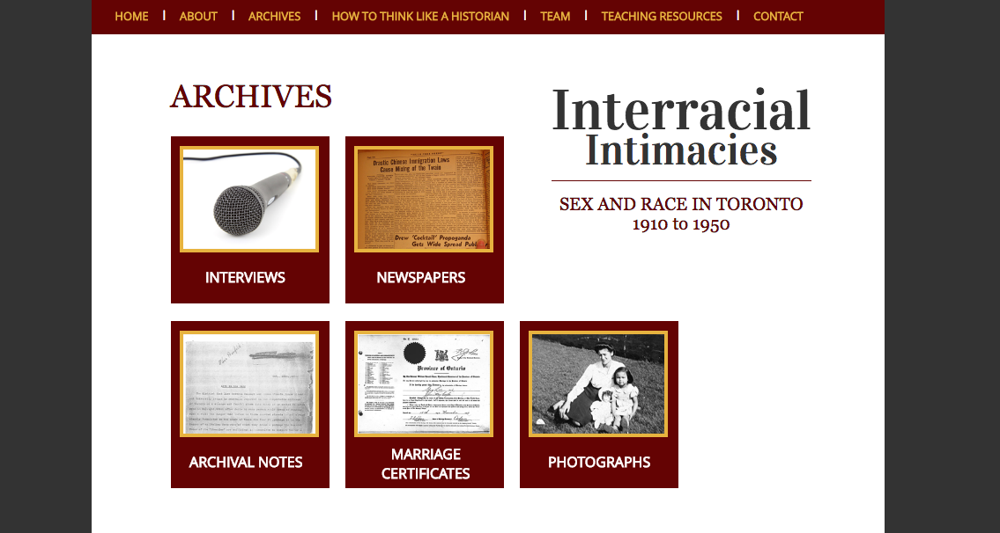
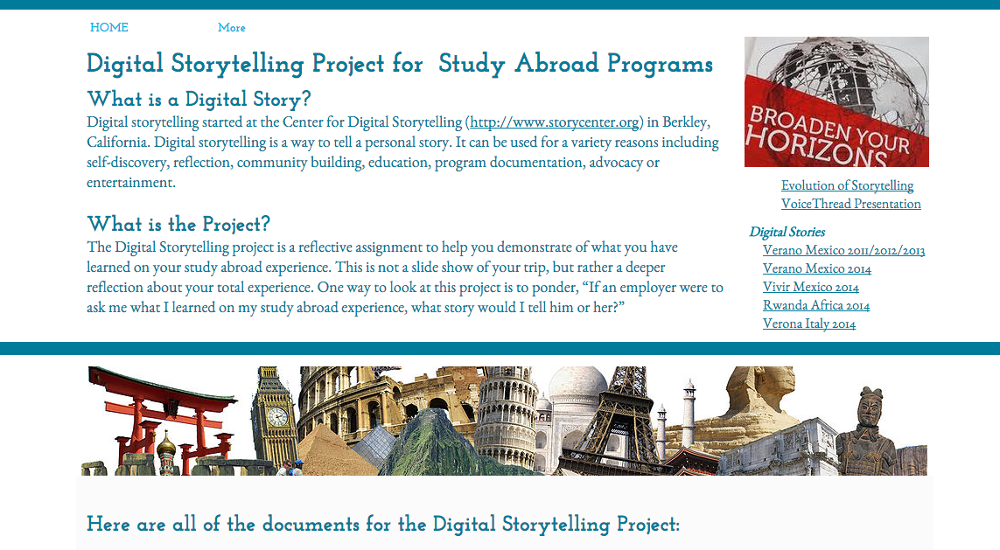
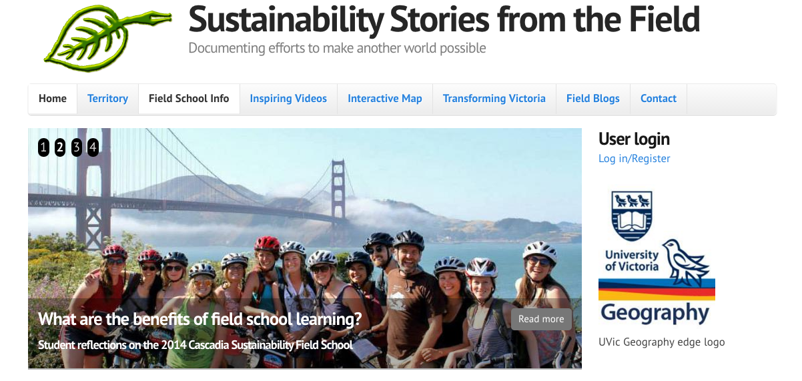
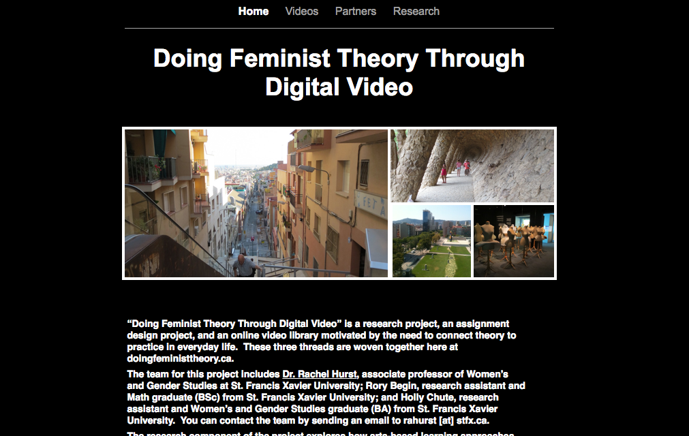
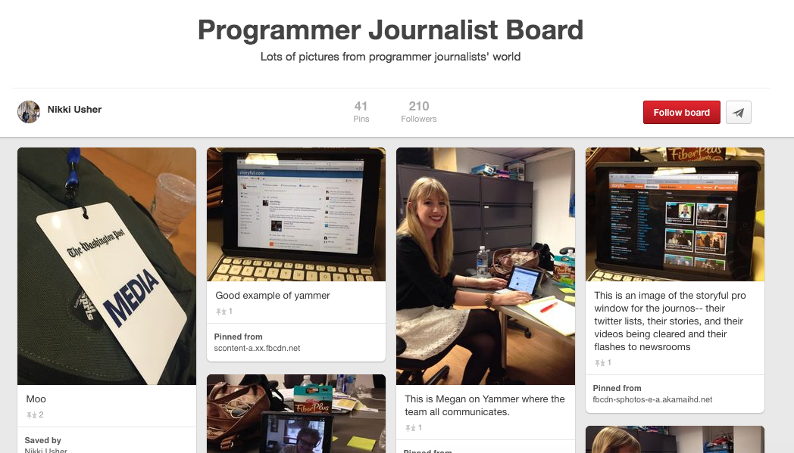
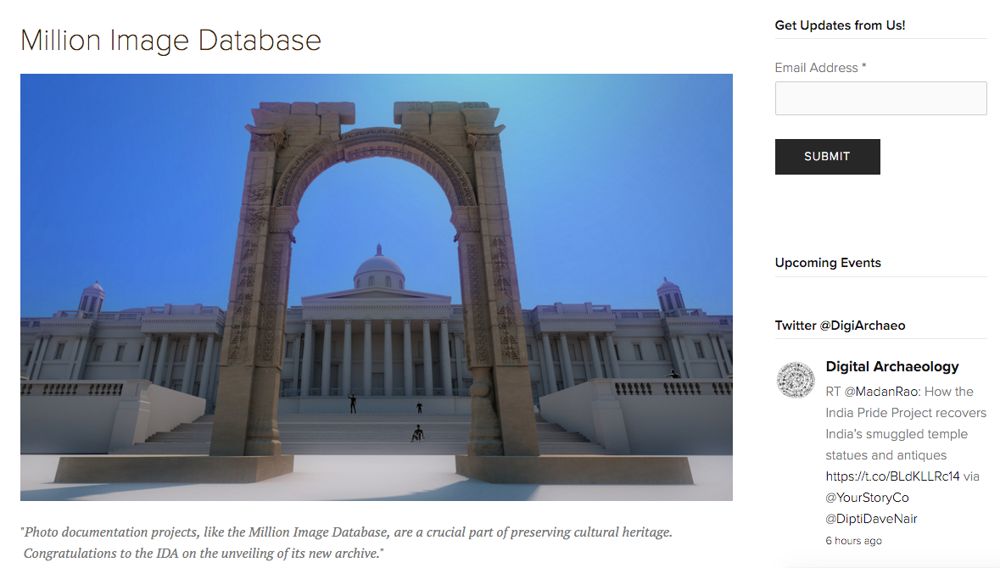
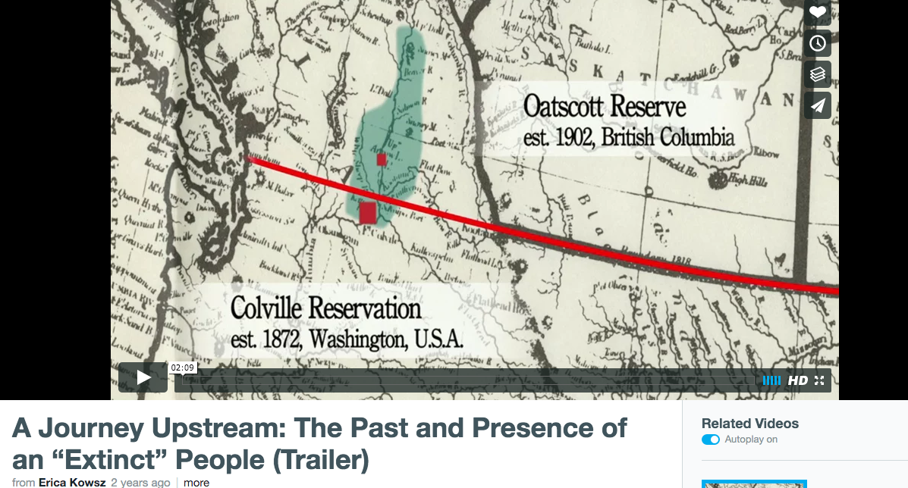
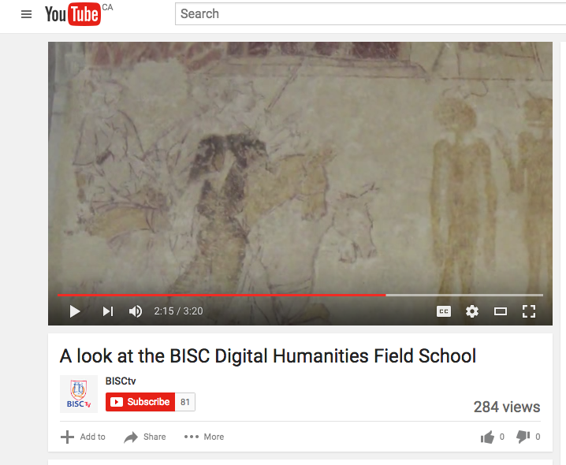
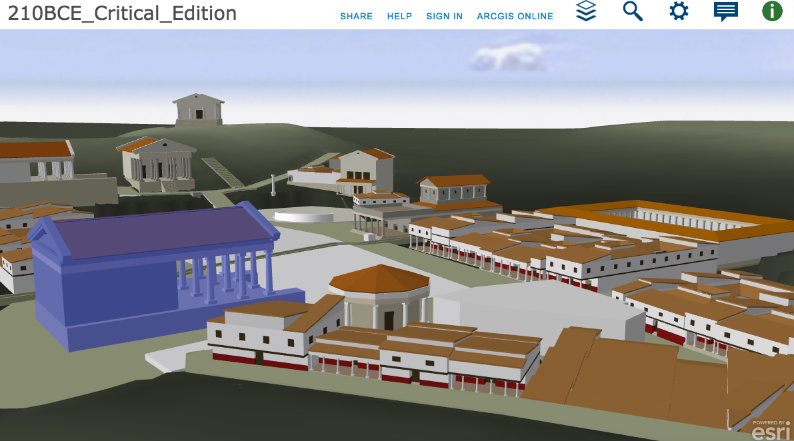
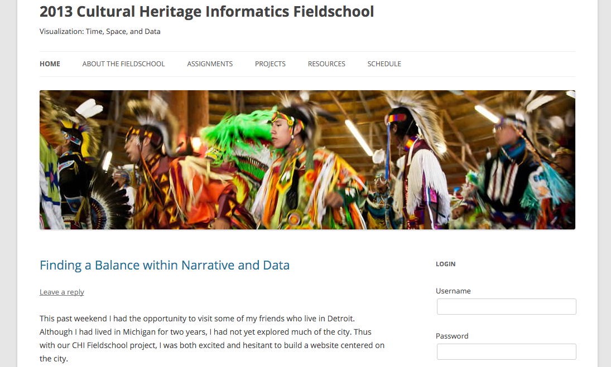

# FIELDWORK (Draft)
 
### Colette Coolligan and Michelle Levy
Simon Fraser University

---

##### Publication Status:
* **unreviewed draft**
* draft version undergoing editorial review
* draft version undergoing peer-to-peer review
* published 

--- 

## CURATORIAL STATEMENT 

Fieldwork has always been central to pedagogy in many scholarly disciplines. Archaeological digs, geographical surveys, and ethnographic interviews readily come to mind, but the proliferation of international general education and study abroad programs has also introduced new disciplines to fieldwork. Fieldwork as a pedagogical practice has two central components: learning by doing through an immersive encounter with research in action and learning by travelling and dwelling in a spatially-demarcated field. We think that digital culture, and the new methods and tools it is introducing, are transforming the practice of fieldwork, for scholars and students alike. 

Many of the digital artifacts we curate exemplify how fieldwork is undergoing a remediation of form, pushing the boundaries of academic inquiry and communication. As digital technology frees fieldwork from the traditional confines of a spatially demarcated “field,” it introduces new expressive forms of fieldwork practice and pedagogy. Among the curated artifacts are digital assignments and projects that allow students to experiment with creative forms of storytelling, such as blogging, video production, and scrap-booking, while immersed in fieldwork. These artifacts also leverage social media and digital connectivity to engage community groups and diverse publics in fieldwork, shifting towards more public-facing interactivity. Digital forms are changing the ways in which fieldwork can be taught, practiced, and communicated, and at the same time garnering new interest in empirical methodology. The turn to applied methodologies of knowledge production in digital humanities, combined with traditional humanities interest in the critique and exploration of diverse forms of expression and communication, converge in the new and experimental forms of digital fieldwork exemplified by these artifacts. 

In adopting pedagogical practices that promote creativity and enable experimentation, the digital artifacts we gather also expand the limits of what counts as knowledge production in the humanities. Students script, direct and shoot videos that demonstrate their engagement with community groups and exploration of critical ideas relevant to their field. The emphasis remains on development over product as a necessary part of the learning process. As fieldwork shifts to the web and goes live more readily at earlier stages of collection and analysis, it is modelled for students as interactive, iterative, and ultimately as a process of inquiry and discovery. This philosophy of making or building as a way of knowing leverages the digital in the artifacts we have assembled, finding shape in critical reconstructions of field sites, media-making, and project-driven fieldwork. 

As a pedagogical research practice, fieldwork already has a collaborative ethos, but our artifacts show how digital fieldwork is rescaling these collaborations. Drawing on citizen science and wikipedia movements to engage communities from all over the world in the collection of data and the production of knowledge, these artifacts are attempting to engage a wide and varied public to participate in data gathering and commentary. As the scale of data collection is unprecedented, so too is the role of researcher democratized. New social configurations also emerge around these artifacts, whether a loosely connected network of citizen fieldworkers, a devoted network of Pinterest or social-media followers, or supportive kinship networks commenting on student fieldwork. The hierarchical roles of teacher and student, and researcher and subject are in the process of being reconfigured through more open and networked models of fieldwork collaboration.

Finally, the digital fieldwork represented by our artifacts involve a critical rethinking of site-specific inquiry. Fieldwork has traditionally been invested in attention to place as a source of meaning and knowledge; a researcher (or group of researchers) travels to a site, and returns with data for analysis. Digital fieldwork can, however, break down the perceived distance between field and home. It can do so through the virtual reconstruction of an archeological site, which collapses the distinction between there and here, then and now, opening students to an immersive experience in a three-dimensional world. Data collection can be accelerated through simple and widely accessible mobile tools like smart phones. Perhaps even more importantly, results can be shared and disseminated almost immediately. With digital mediation, information and expressive content can travel more quickly from home to field and back again, and the boundaries between them can become more porous. At the same time, site sensitivity remains with awareness that digitization of fieldwork sites and artifacts can distort. 

The curatorial vision informing our selection of fieldwork artifacts presents this revitalization of fieldwork as (I) a remediation of creative and critical practice (1,2,3), as (II) a turn toward process-driven models of knowledge production (4,5) as (III) an engagement with open social research (6,7); and as (IV) a critical rethinking of site-specific inquiry (8,9,10). These categories come together, with some overlap, in our chosen artifacts. 

## CURATED ARTIFACTS 

### Interracial Intimacies: Sex and Race in Toronto: 1920-1950

* Source: http://interracialintimacies.org/how_to.html
* Copy of Artifact: forthcoming
* Creators: Elise Chenier, Department of History, Simon Fraser University; Stacey Makortoff, Department of Education, Simon Fraser University 

Interracial Intimacies is an interactive website and pedagogical tool that follows a historian on her journey from research question to published article. With detailed descriptions narrating every step of the process, historian Elise Chenier describes the process of historical fieldwork for students. Chenier begins with a question on Lesbian Bar Culture in Toronto in the 1950s and 60s, and navigates the circuitous path—through oral interviews, archival collection and analysis of primary sources including maps, newspaper reports, census data, marriage certifications, and photographs—towards the final published paper, on interracial relationships between men of Chinese Heritage and women of Non-Asian Heritage in Toronto, between 1910 and 1950. An example of oral history as fieldwork, and a how-to-guide for aspiring historians, the interactive site demonstrates to students the various twists and turns involved in historical inquiry: “The thing about oral history is you never really know what you are going to find out.”

### Digital Storytelling Project for Study Abroad Programs

* Source: http://www.melodybuckner.com/#!studyabroad/cx4z
* Copy of the Artifact: forthcoming
* Creator: Melody Buckner, Director of Digital Learning and Online Education, University of Arizona

This website outlines a student assignment for designing digital stories within study abroad programs. It brings a popular genre of personal storytelling, spearheaded by the Berkeley Centre of Digital Storytelling, to the field, situating the digital story as the capstone project. Drawing on the emotional power of this genre, it encourages self-expression, self-discovery, and interactive narrative within a reflective fieldwork practice. Instructional support is provided in the form of assignment timelines, grading rubrics, storytelling tips, sample digital stories, and suggested story-making platforms. It designs its assignment around VoiceThread -- a free and easy to use web-based storytelling platform that accommodates text, images, and audio-visual recordings, and incorporates social media functionality that brings student work in the field to larger networks of family, friends, and peers. While based on a six-week study abroad trip, it could be adapted for shorter or longer periods. Other free digital storytelling platforms could also be incorporated into the assignment.

### Sustainability Stories from the Field

* Source: http://fieldschools.geog.uvic.ca
* Copy of the Artifact: forthcoming
* Creator: Cam Owens, Department of Geography, University of Victoria

This website showcases student digital fieldwork undertaken since 2012 on field courses centred on sustainability run by the University of Victoria’s geography department. Its purpose is to discuss and share “inspiring examples of sustainability, resilience, regeneration” relevant to local and international fieldwork. These examples find expression in a range of student digital stories, including short videos, travel blogs, and interactive maps on topics like the creation of biking networks in Victoria and urban efforts to battle climate change. What makes this website pedagogically useful is the curatorial vision it brings to digital fieldwork. Year by year, it compiles work by different students, at different stages of progress, and on different field courses, promoting a work-in-progress, team-based curatorial practice. Curation typically happens at one point; this website shows its integration in fieldwork, giving students a site for shared learning and expression, and instructors a model for collecting student fieldwork and giving value to work at various stages of development.

### Doing Feminist Theory through Digital Video

* Source: http://www.doingfeministtheory.ca/
* Copy of the Artifact: forthcoming
* Creators: Rachel Hurst, Department of Women’s and Gender Studies, St. Francis Xavier University; Rory Begin, Department of Math, St. Francis Xavier University; and Holly Chute, Department of Women’s and Gender Studies, St. Francis Xavier University  

Students of a feminist theory course at St. Francis Xavier University were asked to consult with community groups out in the field to create short, non-documentary digital videos (3-5 minutes in length) on a concept relevant to the study of feminist theory, such as decolonization, power or sexual violence. ‘Inspired by the literatures on digital storytelling, participatory video, and creative feminist pedagogies,’ students met with community groups and organizations, and scripted and directed their documentaries with their community partners in mind. This detailed assignment sheet provides students with step-by-step instructions for every stage of the process: from conceptualizing and planning; to strategies for meeting and working with community partners; from providing a curated list of videos students could use for inspiration; to technical information about filming and editing. In addition to the assignment, the website also includes links to the student videos produced in the course and research outcomes.

### Why We Like Pinterest for Fieldwork

* Source: https://socialmediacollective.org/2014/07/14/why-we-like-pinterest-for-fieldwork/
* Copy of the Artifact: forthcoming
* Creators: Phil Howard and Nikki Usher, George Washington University 

Developing an efficient data-collection system during intensive fieldwork is challenging. Notes scribbled on paper and mistyped on devices are illegible or confusing, while photographs and videos quickly fill up cell phone storage. As data accumulates across platforms, it demands metadata to remain meaningful for inquiry and retrieval. This blog -- produced by The Social Media Research Collective -- proposes Pinterest boards as a solution: an easy-to-use web-based tool for archiving, annotating, and sharing digital image artifacts collected during fieldwork. Available as a mobile app, Pinterest integrates the process of data capture and storage. It is linkable to social media feeds for immediate sharing and presentation. As a digital image archive of fieldwork artifacts gathered on the go, it also allows for ongoing review of fieldwork observations and practices. In clear language and via links to Pinterest boards used for fieldwork, this blog post lays out the potential value of this digital platform in fieldwork.

### The Million Image Database

* Source: http://www.millionimage.org.uk/
* Copy of the Artifact: forthcoming
* Creators: The Institute for Digital Archaeology

The Million Image Database is an open-access web portal into photographic documentation of cultural heritage materials gathered from around the world, particularly from regions whose heritage is at risk. Inspired by the collaborative work of Wikipedia to accumulate the world’s knowledge, the Institute of Digital Archaeology launched this open social fieldwork project in collaboration with UNESCO and other academic partners. Volunteer photographers from around the world, equipped with “lightweight, discreet, and easy-to-use 3D cameras,” gather images of objects, architecture and places to capture and preserve “humanity’s history as represented by the things we build” for now and the future. By clicking on interactive maps, users gain access to high-quality anaglyph images of sites like Jebel Hafit Tombs in United Arab Emirates, which do-it-yourself three-dimensional glasses make a fully immersive visual experience. Though still in development, this database will be an essential resource for virtual fieldwork and leverages the power of citizen fieldwork for digital pedagogy.

### A Journey Upstream: The Past and Presence of an “Extinct” People (Trailer)

* Source: https://vimeo.com/78530205
* Copy of the Artifact: forthcoming
* Creators: Directed and Produced by Erica Kowsz, Department of Anthropology, University of Massachusetts, Amherst; Co-Produced by Dr. Nathan Goodale, Department of Anthropology, Hamilton College

This is a trailer for a documentary entitled “A Journey Upstream: The Past and Presence of an 'Extinct' People” directed by archeology graduate student Erica Kowsz, and part of SEARCH, a multidisciplinary and multi-institutional archaeology, cultural heritage, and linguistics project. The project aims to document the history and continued presence of the Sinixt Nation in British Columbia, despite it having been pronounced extinct in 1956 by the Canadian Government. As an example of digital fieldwork, the short video demonstrates the crucial role that technology brings to documentation, with interviews of the supposedly "extinct" members of Sinixt Nations. Although currently in the data collection stage, the video is an example of project staging, providing the public with some access to the historical context and aims of the project in advance of completion. The project also demonstrates how students use multimedia to create and disseminate archeological and anthropological research.

### A Look at the BISC Digital Humanities Field School

* Source: https://youtu.be/PCSzXG536BU
* Copy of the Artifact: forthcoming
* Creators: BISCtv (Bader International Study Centre Youtube Channel)

In this promotional video, visiting fellow Dr. Chris Jones describes the Field School in Digital Humanities, offered in 2015, where students visit two medieval parish churches in Surrey containing historical objects Dr. Jones is digitizing: a 1615 King James Bible and medieval wall paintings. The aim of the field school is to investigate what digitizing technologies are appropriate for the artifacts. Jones advocates for site-specific research, to assess historical artifacts in the sites in which they would have been viewed and experienced and to understand their social and material significance. With the wall paintings, for example, he notes that simply creating high-resolution digital photos may distort online users’ experience of these paintings, as the paintings would historically have been viewed by candlelight, and were obscured for reasons of censorship for much of their history. The need for site-specific sensitivity demands a fieldwork approach to the work of the digital humanities.

### Rome Lab

* Source: http://www.arcgis.com/apps/CEWebViewer/viewer.html?3dWebScene=6bfc7de39700434bbc9c1df48fed8b52
* Copy of the Artifact: forthcoming
* Creators: Christopher Johanson, Department of Classics, UCLA

Using the analogy of a text-based critical edition, RomeLab recreates three critical editions of the Roman Forum, for 210 BCE, 160 BCE, 44 BCE. Developed within ArcGIS online using ArcMap shapefiles in Esri CityEngine, the project virtually reconstructs the Roman Forum at historical moments within interactive three-dimensional interfaces. The interface allows the user to navigate within the reconstruction and to view it from different three-dimensional perspectives. A form of virtual fieldwork that reconstitutes an archeological site, the researchers’ aim is to create  “digital laboratories” where individuals can have a virtual world experience. These digital laboratories enable students and scholars to bring the field home, with digital technology enhancing what can be seen on site, opening up new spatial perspectives and virtually reconstructing buildings that no longer exist. A built-in comparison tool uses a split-screen function to visualize different possible reconstructions, where data sources are uncertain or conflicting.

### 2013 Cultural Heritage Informatics Fieldschool: Visualization: Time, Space, and Data

* Source: http://anthropology.msu.edu/2013chifieldschool/
* Copy of the Artifact: forthcoming
* Creators: Ethan Watrall, Department of Anthropology, Michigan State University

The 2013 Cultural Heritage Informatics Fieldschool website has everything instructors need for thinking about how fieldwork can happen locally in the digital age. Students build digital skills related to the field of cultural heritage, concentrating on visualizing cultural data and undertaking data-intensive fieldwork on a range of sites.  In conceptualizing fieldwork as a critical-making practice of “building as a way of knowing” rather than as a spatial practice of exotic displacement, the course (and the fieldschool entire) prioritizes the development of work over going out into the field. Instead of a team of student researchers leaving home for a 6-week period for a foreign locale, the group comes together in an immersive and intensive work setting to engage in digital research around cultural heritage, using and aggregating existing data for projects on, for example, “Endangered African Heritage.” The potential for cultural fieldwork to distance itself from its exoticist colonial legacies thus emerges with digitally-oriented research practices, described in depth on this course site through course objectives, assignments, schedules, projects, and resource lists.

## RELATED MATERIALS

Clifford, James. Routes: Travel and Translation in the Late Twentieth Century. Cambridge,  Massachusetts, London: Harvard University Press, 1997. Print. 

Colligan, Colette, Michelle Levy, and Paul Yoder, ed. “Study Abroad in the Lake District and Beyond.” Romantic Circles Pedagogies (Forthcoming 2016).

Ramsay, Stephen and Geoffrey Rockwell. “Developing Things: Notes toward an Epistemology of Building in the Digital Humanities.” Debates in the Digital Humanities. Ed. Matthew K. Gold. Minneapolis: University of Minnesota Press, 2012. Web. 75-84. 

Ratto, Matt and Megan Boler, ed. DIY Citizenship: Critical Making and Social Media. Cambridge, Massachusetts: The MIT Press, 2014. Print.

Selfe, Cynthia L, ed. Multimodal Composition: Resources for Teachers. Cresskill, New Jersey: Hampton Press, 2007. Print.

## WORKS CITED

N/A
