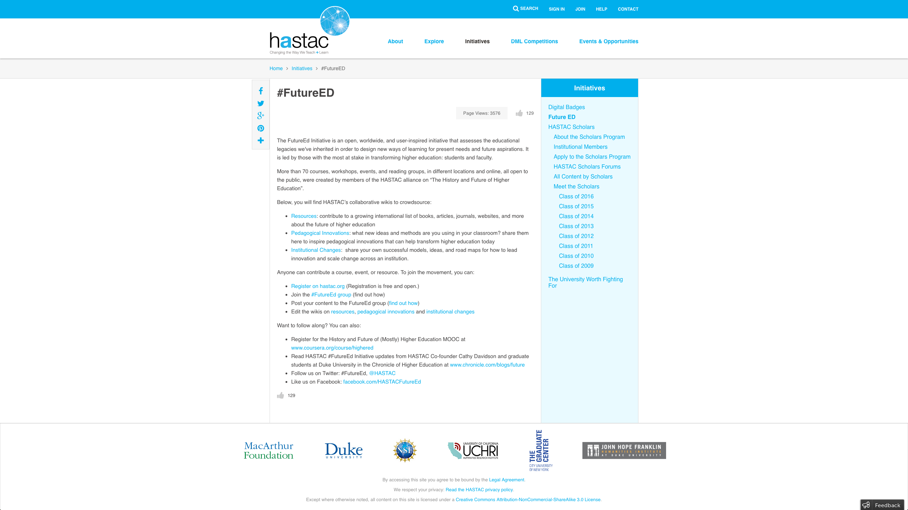
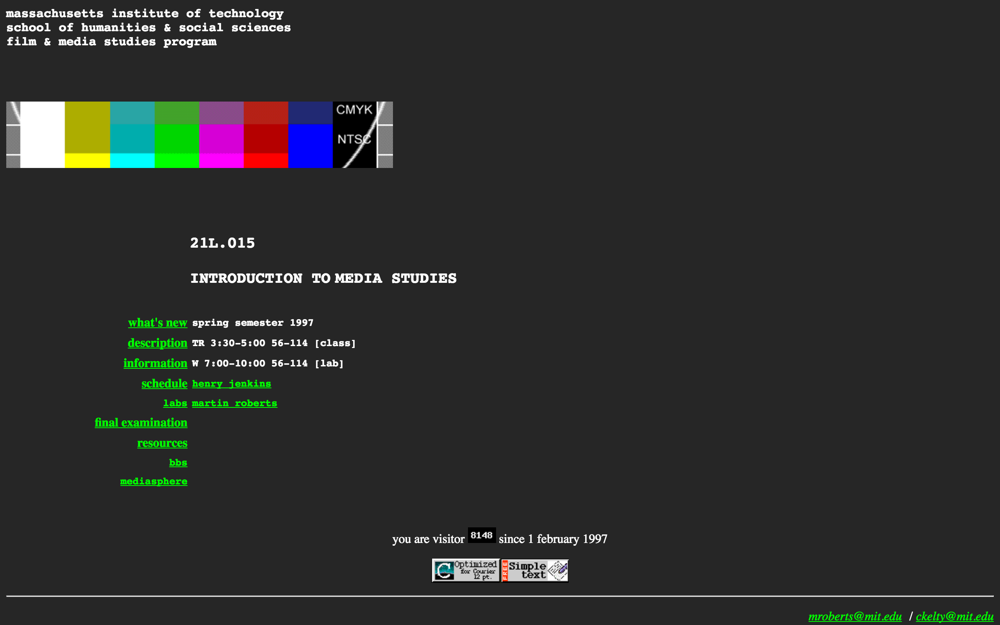
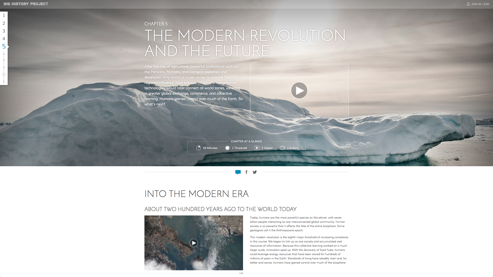
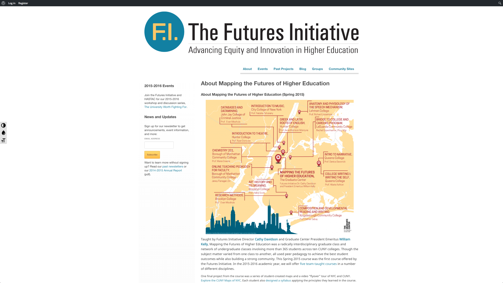
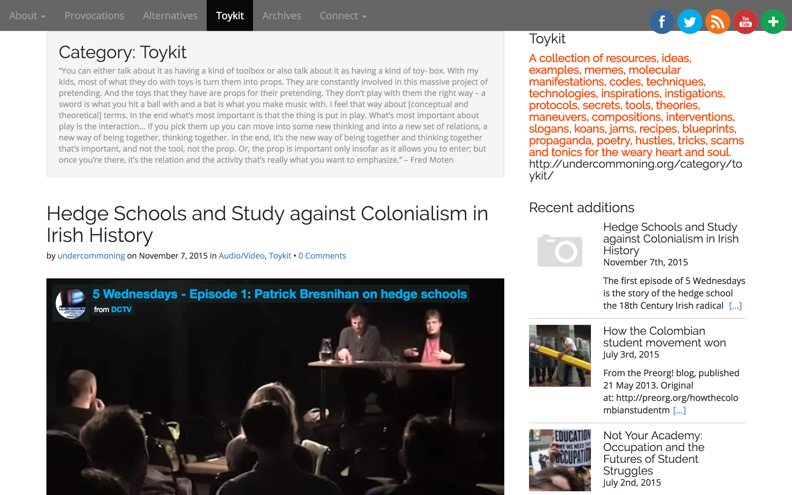
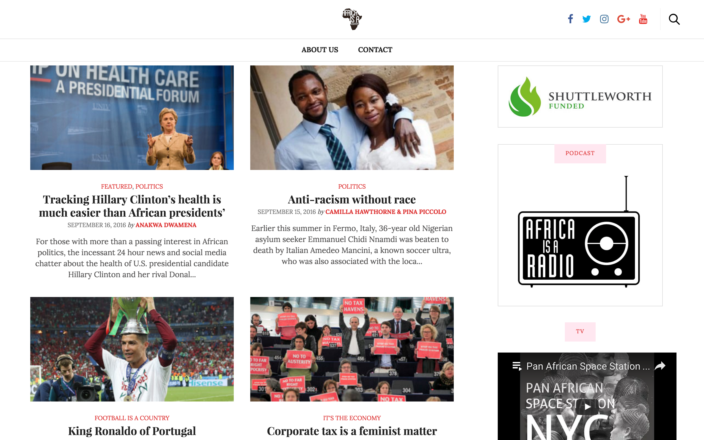
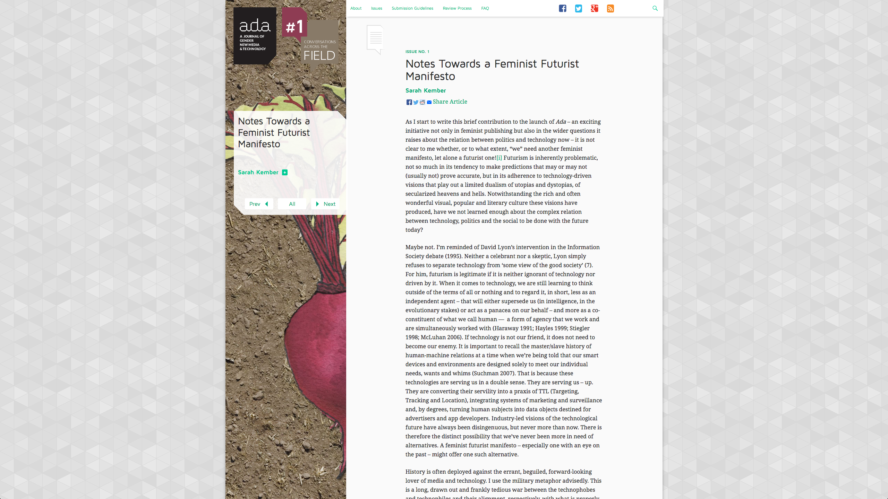
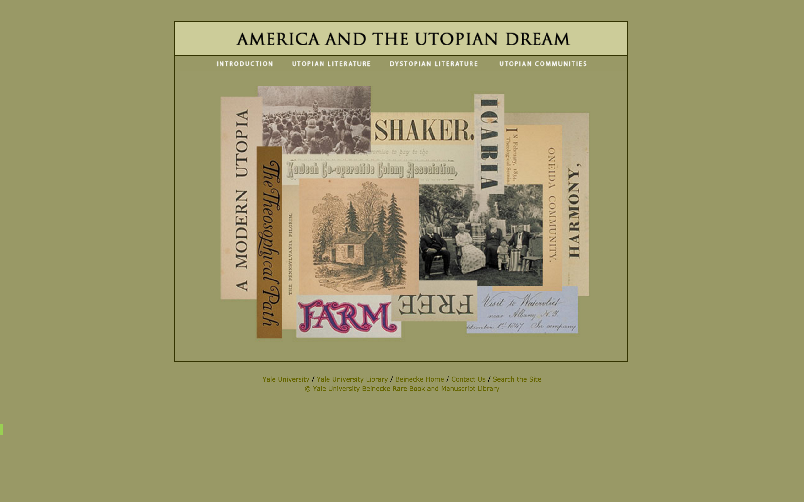
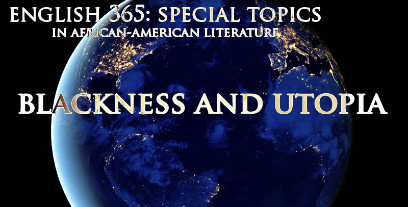
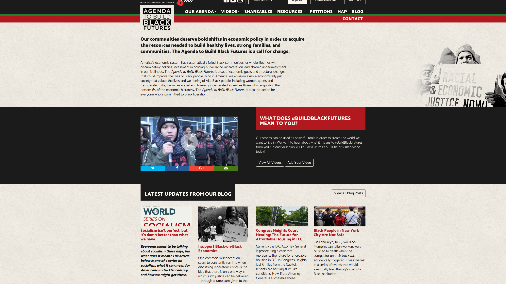

# Future(s)

### André Carrington

Drexel University | [<http://www.andrecarringtonphd.com>](http://www.andrecarringtonphd.com)

## CURATORIAL STATEMENT

The first artificial satellite to enter the Earth’s orbit, Sputnik, inaugurated the space age in 1957. It expanded the frontiers of human knowledge forever. In its aftermath, the United States founded an agency with the mission to “prevent technological surprise” in the future. That agency, which is now called DARPA, fostered the invention of the internet, and its mission has grown in the information age with the additional aim “to create technological surprise for [U.S.] enemies” (DARPA 1). The humanities have always played their part in mapping zones of encounter, and the rhetoric of the American state echoes the humanities’ role in defining the antagonisms that drive historical progress. In the digital age, scholarship models the circumstances under which technological surprise takes place and anticipates its possible implications. Digital pedagogy in the humanities can recontextualize information technologies with the aim of understanding and overcoming the problems for which they were originally designed, placing them in the service of humanistic understanding rather than using them to sharpen the enmities of the moment.

Humanities instruction raises fundamental questions about what knowledge is desirable and how to attain it, and taking hold of the educational tools and methods of the future equips today’s thinkers with the knowledge that “the only lasting truth is Change” (Butler 3). The work of pedagogy in the humanities already encompasses envisioning and cultivating dispositions toward the future; incorporating advancing technologies into this challenge brings that future closer. Rather than setting up an opposition between the practical and the ideal, learners can conceptualize the future as the dawning horizon on which applications for cutting-edge theories and newly-fashioned tools will appear.

Anxiety and opportunity alike characterize the future of humanities pedagogy. The turn toward “born digital” resources for the rising generation of "digital natives" promises to sustain continuity between educational and social spaces in students' lives, but the constantly-renewed demand for up-to-date skills runs the risk of displacing experienced educators and increasing turnover in the professoriate. The broader transformation of learning and labor via technology also holds the potential to forge solidarity between learners and members of learned professions, however. For example, utilizing the inchoate media literacies that students bring to digital texts positions educators to act as their partners in negotiating the shifting boundaries between the contexts of work and play, giving scholars at different career stages the power to turn "tools" into "toys" and back again. Rather than internalizing the sense that their skills will inevitably become obsolete, instructors engaged in digital pedagogy in the humanities can articulate a shared value system that informs how new materials, instruments, and capacities will be used.

Studying cultural works grounded in a panoply of continually changing human experiences entails questioning the ways of knowing propagated in modernity: “the gridding of time and space, the proliferation of registers, filing and listing systems, the making and remaking of categories, the identification of populations, and the invention of logistics” (Lury, et al 8). Affording students a hands-on role in the evolution of modes of knowledge acquisition by allowing them to test out newly-invented tools can encourage them to remain lifelong learners. Instead of inculcating a sense that their accumulated knowledge will insulate them from unpredictable developments, digital pedagogies in the humanities can encourage graduates to maintain an experimental orientation toward the pursuit of knowledge. As Keguro Macharia writes, “Training in the humanities teaches how to ask difficult, necessary questions: How does the past influence the future? How can we live together? What is the good life? What is an ethical life? What values are worth promoting?” These questions are just as urgent to decolonizing societies across the globe as they are pertinent in the everyday speculation that makes education a utopian endeavor, because “education creates opportunities beyond what’s envisioned for it” (Macharia). As academic institutions increasingly prioritize innovation, they can also promote approaches to technology that encourage students to treat their education as the point of departure for an as-yet uncatalogued array of applications rather than a guarantee.

The materials associated with this keyword have been assembled by scholars, artists, activists, and public intellectuals working within and sometimes against the university in its present form, but they all  converge on a critique of the present in which higher education plays a decisive role. The artifacts herein represent the ongoing transformation of theory into practice that pedagogy entails. In the humanities, this involves subjecting notions of the public good such as social mobility, literacy, and progress to the scrutiny demanded by unforeseen conditions. These selections will stimulate discussions, introduce “possibility models” (Cox), demonstrate modes of dissemination, and inspire changes in the way learning takes place. They illustrate how pedagogies concerned with the future(s) in and of the humanities can turn toward digital options out of a curiosity that encourages experimentation, rather than a sense of technological determinism that forecloses it. Pedagogies that embrace opportunities without mistaking them for guarantees temper the modern imperative to “make it new” with the provocative questions that inspire speculative fiction: “What if…? If only…?” and “If this goes on…” (Gaiman xi). Rather than preparing them to experience progress on terms that are not of their own making, educational strategies that employ technology to interrogate the unmet needs of the present enable students to reinvent the means and ends of learning in accordance with the futures they want to create. Surprise.

## CURATED ARTIFACTS

#### #FutureED

* Artifact Type: Bibliography
* URL: [https://www.hastac.org/initiatives/futureed](https://www.hastac.org/initiatives/futureed)
* Creator: [HASTAC](https://www.hastac.org/about-hastac)
* Downloadable resource: [#FutureED Initiative: Bibliography of Resources ](files/futures-FutureEd-Initiative_-Bibliography-of-Resources-_-HASTAC.pdf)
* Artifact Permissions: [Creative Commons Attribution-NonCommercial-ShareAlike 3.0](http://creativecommons.org/licenses/by-nc-sa/3.0/)

Participants in the **Humanities, Arts, Science, and Technology Alliance and Collaboratory ([HASTAC](http://www.hastac.org/about-hastac))** gather in person and virtually on a regular basis to share ideas for the advancement of humanistic education in the digital era. The **#FutureED** initiative translates efforts that began with questions about the place of the Humanities “in the contemporary university” into the questions about the place of the Humanities in the future (Davidson and Goldberg). **#FutureED** builds on “courses, workshops, events, and reading groups, in different locations and online, all open to the public… created by members of the HASTAC alliance on ‘The History and Future of Higher Education.’” The initiative’s online presence includes a crowdsourced bibliography annotated with keywords (funding, assessment, peer learning), reflections on ongoing changes to institutional structures, and innovations in teaching, all of which are open to further contributions in wiki format.

#### Syllabus as Cultural Artifact: MIT Introduction to Media Studies

* Artifact Type: Syllabus
* URL: [<http://henryjenkins.org/blog/2016/03/syllabi-as-cultural-artifacts-mits-introduction-to-media-studies-part-one.html>](http://henryjenkins.org/blog/2016/03/syllabi-as-cultural-artifacts-mits-introduction-to-media-studies-part-one.html)
* Creator: [Henry Jenkins](http://www.annenberglab.com/users/hjenkins) (University of Southern California), [Florence Klink](http://cmsw.mit.edu/profile/flourish-klink/) (Massachusetts Institute of Technology)

Appropriately for a pedagogical conversation initiated by the author of [Convergence Culture](http://nyupress.org/books/9780814742952/), this artifact represents the convergence of multiple iterations of a syllabus: as text, analytical object, and archive. In 1999, the Comparative Media Studies program at **MIT**, for which this course was a cornerstone, began with a mission “that was humanistic to its core and expansive in its understanding of what constituted media.” Two years later, that university introduced [Open CourseWare](https://ocw.mit.edu/about/index.htm) as a comprehensive effort to publicize its curriculum online. Then and now, the methods and materials used for instruction inflect the syllabus with the priorities of the moment as well as unpredictable implications for the future. This colloquy provides a genealogy of critical vocabularies in the field and rehearses perspectives on teaching with technology. The reflexive approach to framing the subjects of humanistic inquiry and assessing instructional approaches modeled here will prove useful in a variety of disciplines as well as extramural locations. Contemporary learners can comprehend how the relationship of education and technology has changed between then and now by comparing a current syllabus to the precedent set at MIT. They can speculate about the future that their education will make possible by tracing their current understanding of media back to the syllabus, treating it as evidence of how the subject matter was presented in the past.

#### Big History Project: The Future

* Artifact Type: Multimedia Instructional Resource
* URL: [<https://www.bighistoryproject.com/chapters/5#>](https://www.bighistoryproject.com/chapters/5#)
* Creator: [Big History Project](https://www.bighistoryproject.com/about)
* Downloadable resource: [Crash Course: The Deep Future](https://school.bighistoryproject.com/media/bhp3video/BHP_CC10_The-Deep-Future.mp4)
* Artifact Permissions: [Some materials under copyright](https://www.bighistoryproject.com/credits)

The notion of “deep time” cuts across disciplinary boundaries to enable Humanities scholars and teachers to conceptualize the thousands-of-years duration of human species being unfolding against the backdrop of the planet: a time and place situated by the natural sciences on scales that are many orders of magnitude larger than history as we know it (Dimock 6). A similar approach animates **Big History** as a pedagogical intervention that puts astronomical, geological, and ecological processes into narrative and other forms that modern technology makes accessible to individual learners. Video, interactive data visualizations, and quizzes that accrue credit toward [Digital Badges](https://www.hastac.org/collections/digital-badges) engage the user with the aggregate subjects that characterize modernity and focus contemporary intellectual and technological efforts to project human habits into the future. Whereas other **Big History** lessons might serve as prerequisites for understanding particular texts, periods, places, and practices, the contemporary and future dilemmas invoked by this setting lend themselves to speculation and problem-solving exercises.

#### Mapping the Futures of Higher Education

* Artifact Type: Instructional Experiment
* URL: [<http://futures.gc.cuny.edu/about-mapping-futures/>](http://futures.gc.cuny.edu/about-mapping-futures/)
* Creator: [Deborah Greenblatt](http://futuresinitiative.org/members/deborah22/) and [Janey Oliphint Flanagan](http://futuresinitiative.org/members/jflanagan/), [The Futures Initiative](http://futuresinitiative.org/who-we-are/) (City University of New York)
* Downloadable resource: [Final Report on the Mapping the Futures of Higher Education project](http://www.andrecarringtonphd.com/wp-content/uploads/2016/09/Mapping-Futures-FINAL_REPORT.pdf)
* Artifact Permissions: [Creative Commons Attribution Noncommercial Share-Alike](http://creativecommons.org/licenses/by-nc-sa/3.0/)

**Mapping the Futures of Higher Education** at the City University of New York supplements the cultural and political geography of the metropolis with student-centered timelines and genealogies. The course “emphasized student-centered pedagogies and digital innovation and its practical application within diverse undergraduate classrooms at CUNY.” Crucial to its success, and integral to its potential implications for future projects that use digital tools to enhance and represent spatial knowledge, were measures meant to empower undergraduates and graduate student instructors. Evaluators noted that workshops on mapping software and data management would have enhanced the course by enabling students to produce more technically sophisticated maps; for courses of study that have the objective of imparting or refining those technical skills, mapping their institutions in accordance with local, community-sourced concerns like those of the **MFHE** students is an ideal summative assessment. Instructors and students interested in mapping their settings can employ the insights of the final report in order to outline what student-centered, technology-assisted learning means in their courses, e.g., by reporting the balance of anxiety and motivation ascribed to their respective responsibilities, maintaining an inventory of their skills and needs, and collaborating to [design future courses](http://futuresinitiative.org/blog/category/syllabus/) that use the maps they create and the information represented therein as resources.

#### Undercommoning—Toykit

* Artifact Type: Online Resource
* URL: [http://www.undercommoning.org/category/toykit](http://www.undercommoning.org/category/toykit)
* Creator: [The Undercommoning Collective](http://www.undercommoning.org/)
* Downloadable resource: [The Undercommons: Fugitive Planning and Black Study, by Fred Moten and Stefano Harney](http://www.andrecarringtonphd.com/wp-content/uploads/2016/09/undercommons-web.pdf)
* Artifact Permissions: [Open-access](http://www.minorcompositions.info/?p=516) via [http://www.minorcompositions.info](http://www.minorcompositions.info)

The **Undercommoning** Collective looks forward to the unwinding of institutional arrangements that make professional careers in academia anxious and exploitative. The [Toykit](http://www.undercommoning.org/category/toykit) combines pedagogy with play by deploying academic words, spaces, and methods as both tools and toys: “If you pick them up you can move into some new thinking and into a new set of relations, a new way of being together, thinking together” (Moten 106). Though its language derives from a book by radical critical theorists Stefano Harney and Fred Moten, the Undercommons [is not a group, a tendency, a party, or a platform](http://undercommoning.org/join/). The site aims to [instigate](http://undercommoning.org/category/provocations/) and draw attention to subversive teaching and learning practices that steal (away) from the university, rather than critiques that all too easily become institutionalized as professional achievements. Like the open-access book from which it emerges, the Toykit aggregates pedagogical modules—mixtape, do-it-yourself guide, manifesto, choreography—that arise in the learning spaces between the university as such and the alternatives that are taking its place.

#### Africa Is The Future

* Artifact Type: Media Gallery
* URL: [http://africaisthefuture.com/](http://africaisthefuture.com/)
* Creator: [Nicolas Premier and Patrick Ayamam](http://africaisthefuture.com/#about-4)
* Downloadable resource: [AITF Magazine](http://aitfmagazine.tumblr.com/)
* Artifact Permissions: [All covers created by Nicolas Premier. All Rights Reserved.](http://aitfmagazine.tumblr.com/)

Africa Is The Future uses the [communication tools](http://africaisthefuture.com/#section-about-4) of corporate brands, including “Multimedia websites, merchandise, sponsoring, product placement, social networking, video or photography,” to reposition African peoples in the global cultural imaginary. In so doing, it engages “consumers” of the brand, i.e., people wearing limited-edition Africa Is The Future t-shirts, pasting its stickers, and spreading its slogan virally, in rethinking the prevailing relationships of existing nations, places, and economies to one another. Though the project ceased producing new content in 2014, the *AITF* magazine covers that commemorate its ten-year duration remain available online. Each cover for the fictitious publication juxtaposes LIFE magazine iconography with provocative cover stories to generate an irresistible conversation piece. As the point of departure for acts of speculative storytelling, remixing photography and fashion, and finding new uses for the language of lifestyle branding, the *AITF* covers inform utopian pedagogical exercises. The artistic project as a whole exemplifies the ambition of decolonial theorists (Enrique Dussel, Walter Mignolo): to work through “a spatialization in which the whole planet is involved at every stage in history,” rather than organizing knowledge and meaning through unreconstructed concepts of nation and language that recapitulate the legacy of colonialism (Alcoff 84).

#### Notes Towards a Feminist Futurist Manifesto

* Artifact Type: Published Article
* URL: [<http://adanewmedia.org/2012/11/issue1-kember/>](http://adanewmedia.org/2012/11/issue1-kember/) 
* Creator: [Sarah Kember](http://adanewmedia.org/author/sarahkember/) (Goldsmiths, University of London)
* Downloadable Resource: [Notes Towards a Feminist Futurist Manifesto](http://www.andrecarringtonphd.com/wp-content/uploads/2016/09/Kember-Feminist-Futurist-Manifesto.pdf)
* Artifact Permissions: [Creative Commons-Attribution-NonCommercial-NoDerivs 3.0](http://creativecommons.org/licenses/by-nc-nd/3.0/deed.en_US) 

Sarah Kember marks the moment for the launch of *Ada: A Journal of Gender, New Media, and Technology* by unsettling readers who might think existing scholarship has exhausted “the complex relation between technology, politics and the social.” Taking gender as one axis in a multidimensional rendering of “a future that isn’t (and never was) all about technology,” the article returns issues of desire, intelligence, consciousness, and objecthood to the agenda of humanistic inquiry. It raises questions that would occasion lively debate during any course or module on gender, knowledge production, or subjectivity—To what ends do we submit ourselves to emergent surveillance practices? How are the priorities of academic journals shaped by attitudes toward technology and the mediation of scholarly persona? Kember also models the manifesto as a form amenable to presenting a synopsis of the movement from previous to current intellectual colloquies and outlining distinct points for elaboration through further inquiry, a task that can be uniquely instructive for graduate students learning how to articulate the main concerns within a field of scholarship.

#### America and the Utopian Dream

* Artifact Type: Online Exhibit
* URL: [<http://brbl-archive.library.yale.edu/exhibitions/utopia/>](http://brbl-archive.library.yale.edu/exhibitions/utopia/)
* Creator: [Beinecke Rare Book & Manuscript Library](http://beinecke.library.yale.edu/about/staff?field_department_tid=10) (Yale University)
* Downloadable resource: [Finding Aid to the Paul Kagan Utopian Communities Collection](http://www.andrecarringtonphd.com/wp-content/uploads/2017/10/Kagan-Utopia-FindingAid.pdf)
* Artifact Permissions: [Copyright 2014 by the Yale University Library](http://beinecke.library.yale.edu/research/permissions-copyright)

**America and the Utopian Dream** presents an overview of utopian communities in North America as well as the utopian tradition in political philosophy and literature, along with scans from primary documents and published texts to bring users in classrooms or online into virtual contact with sources in utopian studies. Perusing the exhibit online via timelines of literary texts along with photographs and scans from the historical documents produced by utopian communities enables students to rehearse the work of engaging in archival research. The [downloadable Finding Aid](http://drs.library.yale.edu/fedora/get/beinecke:utopia/PDF) to the Paul Kagan Utopian Communities collection, one of the two main sources for the artifacts exhibited in [America and the Utopian Dream](http://brbl-archive.library.yale.edu/exhibitions/utopia/intro.html), provides in-depth information and context for the documents and images. Students can learn to appreciate the relationship between collections and virtual modes of dissemination by reverse-engineering the exhibit: using its organization and form as the basis for a thematic presentation along the same lines, showcasing materials from their own archives, libraries, and communities that illustrate another philosophical, political, literary, or anthropological phenomenon.

#### Blackness & Utopia

* Artifact Type: Syllabus & Sample Assignment
* URL: [<http://www.andrecarringtonphd.com/syllabus-blackness-utopia/>](http://www.andrecarringtonphd.com/syllabus-blackness-utopia/)
* Creator: [andré carrington](http://www.andrecarringtonphd.com/) (Drexel University)
* Downloadable Resource: [Infrastructure & Society: Assignment](http://www.andrecarringtonphd.com/wp-content/uploads/2017/10/utopia-assignment.pdf)
* Artifact Permissions: [Creative Commons Attribution-NonCommercial 3.0](http://creativecommons.org/licenses/by-nc/3.0/us/)

Blackness & Utopia is designed as an undergraduate course in African American Literature that encompasses imaginative literature, film and video, and historical documents from movements for social transformation. The course materials, all of which are available in electronic formats (many of them for free) represent the utopian tradition in African American writing as well as the role of a utopian outlook in cultural criticism. The collaborative assignment on access to electricity is an interdisciplinary exercise in argumentation that draws on literature and [documentary film](https://archive.org/details/gov.fdr.352.2a.3) to engage students in the practice of presenting community-level responses to structural changes in society. 

#### The BYP100 *Agenda to Build Black Futures*

* Artifact Type: Agenda/Report
* URL: [<http://agendatobuildblackfutures.org/>](http://agendatobuildblackfutures.org/)
* Creator: [BYP100/The Black Youth Project](http://byp100.org/about/)
* Downloadable resource: [Agenda to Build Black Futures](http://www.andrecarringtonphd.com/wp-content/uploads/2016/10/BYP_AgendaBlackFutures.pdf)
* Artifact Permissions: [Copyright 2016 Black Youth Project](http://byp100.org/about/)

The Black Youth Project is a US-based membership organization for Black people ages 18–35 committed to a transformative, intersectional agenda for racial justice. The hashtag #BuildBlackFutures articulates an imperative to redirect our society’s shared resources, e.g. city and state spending, space, planning, away from incarceration and surveillance and toward the reparation and self-determination for Black communities. While [direct actions](http://agendatobuildblackfutures.org/map/) that disrupt the status quo are an instrumental part of the BYP strategy, the Agenda to Build Black Futures marshals data, speculation, and narratives toward a powerful declaration of what is necessary to make Black communities thrive in the 21st century. The agenda is meant to inspire informed action. Some of the resources you can use inside or outside the classroom, for teach-ins, and online include videos about what #BuildBlackFutures means and invitations to [add your own content](http://agendatobuildblackfutures.org/add-your-video/), editorials, shareable graphics for social media, and links to the intertexts that dialogue with the Agenda.

## RELATED MATERIALS

Gaskins, Nettrice. *Techno-vernacular creativity, innovation, and learning in underrepresented ethnic communities of practice*. Disssertation. Georgia Institute of Technology, 2014. [http://hdl.handle.net/185363163](http://hdl.handle.net/185363163).

Muñoz, José Esteban. *Cruising Utopia: The Then and There of Queer Futurity*. NYU Press, 2009.

Tuck, Eve, and K. Wayne Yang, “Decolonization is Not A Metaphor,” *Decolonization: Indigeneity, Education, and Society* vol. 1, no. 1, 2012, pp. 1–40.

Von Ruff, Al. Internet Speculative Fiction Database. [www.isfdb.org](http://www.isfdb.org).

Womack, Ytasha. *Afrofuturism: The World of Black Sci-Fi and Fantasy Culture*. Chicago Review Press, 2013. [www.iafrofuturism.com/book](http://www.iafrofuturism.com/book).

## WORKS CITED

Alcoff, Linda. “Mignolo’s Epistemology of Coloniality.” *CR: The New Centennial Review*, vol. 7, no. 3, 2007, pp. 79–101.

Butler, Octavia. *Parable of the Sower*. Warner, 2000.

Black Youth Project. *Agenda to Build Black Futures*. [agendatobuildblackfutures.org](http://agendatobuildblackfutures.org).

Cox, Laverne. “Interview with Katie Couric.” *Katie*. ABC, 6 Jan. 2014.

Davidson, Cathy and David Theo Goldberg. “A Manifesto for the Humanities in a  Technological Age.” *Chronicle of Higher Education*, vol. 50, no. 23, 13 Feb. 2004, pp. B7-B9.

Defense Advanced Research Projects Agency (DARPA). *Bridging the Gap Powered by Ideas*. DARPA, 2005.

Dimock, Wai Chee. *Through Other Continents: American Literature Across Deep Time*. Princeton University Press, 2006.

Gaiman Neil. “Introduction,” in Ray Bradbury, *Fahrenheit 451*. 60th Anniversary Edition. Simon & Shuster, 2013.

Grant, Sheryl. “Digital Badges.” HASTAC. 6 Mar. 2013. [www.hastac.org/collections/digital-badges](http://www.hastac.org/collections/digital-badges). 

Jenkins, Henry. *Convergence Culture: Where Old and New Media Collide*. NYU Press, 2008.

———. Syllabi as Cultural Artifacts: MIT’s Introduction to Media Studies (Part One). USC Annenberg Innovation Lab. 8 Mar. 2016. [www.annenberglab.com/blogs/hjenkins/2016/03/syllabi-cultural-artifacts-mit-s-introduction-media-studies-part-one](http://www.annenberglab.com/blogs/hjenkins/2016/03/syllabi-cultural-artifacts-mit-s-introduction-media-studies-part-one).

Kember, Sarah. “Notes Towards a Feminist Futurist Manifesto.” *Ada: A Journal of Gender, New Media, and Technology*, no. 1, 2012.

Klink, Flourish and Kim Vaeth. Flourish Klink, and Kim Vaeth. CMS 100 Introduction to Media Studies. Massachusetts Institute of Technology: MIT OpenCourseWare, [ocw.mit.edu/courses/comparative-media-studies-writing/cms-100-introduction-to-media-studies-fall-2014](http://ocw.mit.edu/courses/comparative-media-studies-writing/cms-100-introduction-to-media-studies-fall-2014).

Lury, Celia, Luciana Parisi, and Tiziana Terranova. “Introduction: The Becoming Topological of Culture.” *Theory, Culture, and Society*, vol. 19, no. 4/5, 2012, pp. 3–35. 

Macharia, Keguro. “Humanities and Higher Education in Kenya.” *Gukira*. 25 Feb. 2016. [gukira.wordpress.com/2016/02/25/humanities-higher-education-in-kenya](http://gukira.wordpress.com/2016/02/25/humanities-higher-education-in-kenya).

Moten, Fred and Stefano Harvey. *The Undercommons: Fugitive Planning and Black Study*. Minor Compositions, 2013.

Premier, Nicolas and Patrick Ayama. [Africa is the Future](http://www.africaisthefuture.com).

Undercommoning Collective. Undercommoning: Revolution Within, Against, and Beyond the University. [undercommoning.org](http://undercommoning.org).
