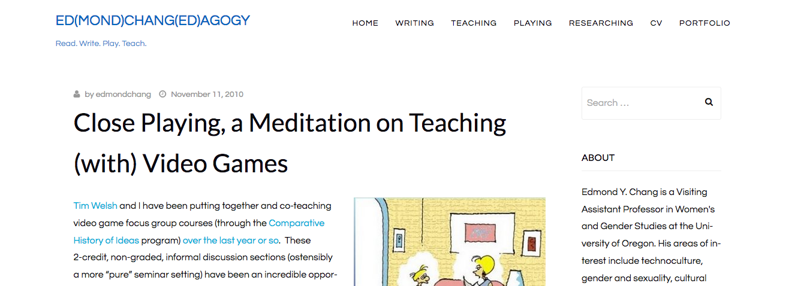
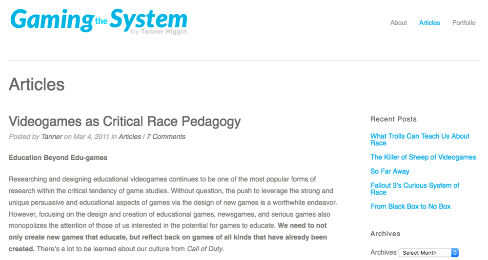

# GAMING

## Amanda Phillips
Georgetown University | [Website](Website)

---

##### Publication Status:
* **unreviewed draft**
* draft version undergoing editorial review
* draft version undergoing peer-to-peer review
* published 

--- 

## CURATORIAL STATEMENT

“Gaming” describes a practice of structured play that may be analog, but which has popularly come to refer to the digital form of this activity. Games have been called the defining medium of the twenty-first century by a variety of industry and academic professionals (Hersemann; Schell; Spector; Zimmerman), owing to their widespread popularity and their emergence as a format that leverages the technological boom of the twentieth century in the name of art. 

In defining what he calls our new “Ludic Century,” Eric Zimmerman argues that games capture the increasingly complex systematicity of our world, and that gaming is the new literacy that will help us navigate the meanings that such systems produce. Successful gamers are able to decode the processes that govern their activities. Gaming is an act of reverse engineering, requiring the participant to intimately understand the systems of rules, representation, narrative, and technology in which they become embedded. Gamers continuously optimize their behaviors based on system feedback, and the neoliberal connotations of such a practice are an important part of understanding the role of gaming within society. We might think of the gamification of education, the diffuse disciplining of a population increasingly reliant on digital tools, or even the ways in which people bend rules to their advantage in everyday life. While such activities carry negative connotations, the root of this behavior is precisely the type of understanding that cultural studies instructors hope to instill in their students: competent deciphering and deconstruction of systems of power.

Mark Sample's keyword on "[Play](https://github.com/curateteaching/digitalpedagogy/blob/master/keywords/play.md)" in this collection covers many of the advantages that gaming brings into the classroom. However, engaging with gaming as a “medium” (as controversial as that might be given the lack of formal coherence in this category) does require a certain facility with software and hardware studies, analyzing rules of play, applying fan and audience reception studies, and more. All of these skills are within reach of any student with humanities training; the challenge is bringing them together coherently. Game studies is a true interdiscipline, with all of the contradictions and challenges that come with it. For this reason, I have curated this list to help instructors think about the complexities of games and how they fit into a humanities classroom.

Just as many instructors teach courses entirely dedicated to digital texts, games can easily fit into the context of any topical or survey humanities course. What we understand now as video games descended from multiple media lineages: analog strategy and board games like chess, roleplaying tabletop games like Dungeons and Dragons, electronic games like OXO, simulations of war or other activities, and a variety of narrative formats ranging from drama to the novel. True to these diverse origins, games remediate an impressive array of genres and representations of historical periods from medievalism to cyberpunk. 

Curating games that are accessible for a wide range of students can be a challenge. Video games in the classroom come with similar accessibility concerns as other digital media: computers privilege vision and are expensive, and it is difficult to find media that has been appropriately captioned or otherwise made accessible for a wide range of people. Some games are specific to particular technological platforms that cost hundreds of dollars each, and they frequently require a time investment several times more than one might expect to spend reading a book. There is also the question of skill and experience, which is easy to overlook in a world where "most" students are playing games. Many games demand proficiency in specific types of problem-solving, attention, and reflexes that make them difficult for some students to complete. 

Collaborative play sessions and careful curation can get around many of these problems. There are many small and freely available games that succinctly demonstrate a particular mechanic or representational feature. Sometimes it’s sufficient to assign a particular episode of a game, or to allow students to watch a playthrough on YouTube or Twitch, a gameplay streaming site. Allowing students to work together on playing a game can take the pressure off of any one individual to complete or fully understand the game, and this can encourage students to take advantage of resources like computer or gaming labs, if you are able to set one up at your institution.

In addition to games, adding a game design activity to your humanities classroom can help students grasp the mechanisms that operate within complex systems. Like other digital humanities disciplines, theory and praxis go hand-in-hand in game studies, and many instructors prefer to integrate both modes into their classes. Here, game studies pedagogues intuitively understanding what Zimmerman’s manifesto explicitly demands: “We should think like designers” (21). There is no need for students to produce great works of procedural art, but rather to get a sense of what goes into the mechanics of games and gamemaking so that they can better understand the aesthetic output. We do a similar kind of teaching when we ask students to perform exercises with meter and rhyme in poetry. 

These resources are intended for instructors who are looking to supplement their classes with gaming, and should be helpful both to game studies newcomers and experienced practitioners in the field. They are divided into three categories that are useful at different stages of building a syllabus: Games Pedagogy, Game Objects, and Game Design. In order to work against the tendency of both academia and gaming culture to gloss over the specific concerns of marginalized groups, this list also takes an intentional orientation toward social justice critique in its choice of objects.

## CURATED ARTIFACTS

## Games Pedagogy

### Close Playing, a Meditation on Teaching (With) Video Games

* Artifact Type: Methodology
* Source URL: [http://www.edmondchang.com/2010/11/11/close-playing-a-meditation/](http://www.edmondchang.com/2010/11/11/close-playing-a-meditation/) 
* Artifact Permissions: Public blog
* Copy of the Artifact: 
* Creator and Affiliation: Edmond Chang (University of Oregon)

Ed Chang’s reflection on the concept of “close playing” is an important and thorough articulation of a practice that should be central to any study of games in a humanities classroom. Close playing, while evoking the literary practice of close reading, is a cyborg analytical practice that holds multiple threads and viewing angles in tension. It is difficult to do well. In Chang’s words, close playing lays at “the intersection of form, function, meaning, and action,” – an important formulation to keep in mind when students are frequently tempted to linger on representation while academics might emphasize form. This blog post is a reminder that the best game studies work can deftly shift between different registers of analysis to provide a comprehensive understanding of these complicated multimedia texts, and it stands up even years after its publication. Close playing exercises in the classroom can bridge the gap between traditional literary studies and the study of video games, promoting the attention to detail that is the hallmark of close reading and the breadth of analysis that is required to understand complex systems. 

### Talkthroughs: Bioshock’s Fort Frolic

* Artifact Type: Assignment
* Source URL: [https://youtu.be/3h7iHD-lI0g](https://youtu.be/3h7iHD-lI0g) 
* Artifact Permissions: Public video
* Copy of the Artifact:  
* Creator and Affiliation: Lily Zhu (University of Texas at Austin) and Casey Sloan (University of Texas at Austin)

While close playing assignments often take the form of blogs or papers, Zhu and Sloan’s Talkthrough model takes the popular form of the “Let’s Play,” in which gamers record gameplay footage and live commentary for an audience, and gives it an academic spin. While Let’s Play videos emphasize the virtuosity and entertaining commentary of the recorded player, a Talkthrough is a critical approach to recorded game footage, providing historical background, useful vocabulary, and in-depth analysis of particular scenes. 

With the rising popularity of gameplay streaming and YouTube channels and decreased technological barrier to production, a talkthrough is a useful assignment for allowing students to showcase their analytical skills and gain literacy in a popular contemporary mode of communication.

### Video Games as Critical Race Pedagogy

* Artifact Type: Lesson Plan
* Source URL: [http://www.tannerhiggin.com/2011/03/videogames-as-critical-race-pedagogy/ ](http://www.tannerhiggin.com/2011/03/videogames-as-critical-race-pedagogy/) 
* Artifact Permissions: Public blog
* Copy of the Artifact: 
* Creator and Affiliation: Tanner Higgin (Common Sense Education)

This blog post by Tanner Higgin provides concrete ways to teach race beyond representation in video games. Higgin makes the crucial observation that much intervention in gaming culture is tied to diversity politics and representation, wherein inclusion becomes a marker for equality. This, however, masks the deeper structural workings of power. High fantasy genres, for example, may not explicitly engage with contemporary racial identities, but they are intensely bound up in racial logics. In fantasy video games, these logics might present themselves, for example, in base character statistics that differ by race. Games are an essential and unique medium to discuss race and culture, and the least interesting point they have to offer is that of reprsentation. Higgin urges instructors to push their students to think about how other procedures and mechanics structure the racial politics of gameplay.

### Video Games as Feminist Pedagogy

* Artifact Type: Lesson Plan
* Source URL: [http://journals.sfu.ca/loading/index.php/loading/article/viewArticle/135](http://journals.sfu.ca/loading/index.php/loading/article/viewArticle/135)
* Artifact Permissions: Open-access journal
* Copy of the Artifact:  
* Creator and Affiliation: Samantha Allen 

In this article, Samantha Allen details two specific lesson plans using video games to teach feminist concepts and makes an argument that using video games in the classroom can disrupt hierarchical power structures and promote community in ways that align with feminist pedagogical practices. Her exploration of feminist pedagogy, in particular, is useful for instructors to think about how to construct a classroom with digital texts that offer many promising structural possibilities while simultaneously seeming to foreclose feminist politics due to their content. 

## Game Objects

### Small Worlds 

* Artifact Type: Game
* Source URL: [http://jayisgames.com/games/small-worlds/](http://jayisgames.com/games/small-worlds/) 
* Artifact Permissions: Free-to-play game
* Copy of the Artifact:  
* Creator and Affiliation: David Shute

David Shute’s Small Worlds is an exploration game in which a figure navigates a series of moody, pixelated worlds that are shrouded in darkness. Each scene begins zoomed closely on the avatar, and exploration reveals more of the background while the camera gradually zooms out. Uncovering these small worlds reveals a minimalist environmental narrative – an elegant example of narrative architecture with dystopic science fiction undertones. In the context of a  humanities class, Small Worlds is an excellent game to use for conversations about the fundamentalproperties of games, including the centrality of space and movement to narrative in games and how simple mechanics (such as the widening field of view) can encourage the gamer to perform specific tasks without explicit instructions. Understanding the unique aesthetic and rhetorical properties of games can lead to discussions about how other media use different representational and persuasive strategies.

### Mainichi

* Artifact Type: Game
* Source URL: [http://www.mattiebrice.com/mainichi/](http://www.mattiebrice.com/mainichi/) 
* Artifact Permissions: Free-to-play game
* Copy of the Artifact: 
* Creator and Affiliation: Mattie Brice

Mattie Brice’s Mainichi is a short and simple roleplaying game that catalogues the microaggressions and outright hostility faced by Black transwomen on a day-to-day basis. Mainichi provides an introduction to the RPG genre without the considerable time investment required of most of these types of games. The question of user agency and cause and effect may be explored with multiple playthroughs, as different decisions in getting dressed result in different interactions with people on the street. 

As an example of Black trans art, Mainichi has an important place in a digital qpoc canon. The game’s emphasis on repetition, everyday temporality, and microaggressions also brings to mind constructions of queer time and failure that are omnipresent in gaming. Mainichi, therefore, demonstrates some of the ways that games can enact theoretical concepts.

### HUGPUNX

* Artifact Type: Game
* Source URL: [https://a-dire-fawn.itch.io/hugpunx](https://a-dire-fawn.itch.io/hugpunx) 
* Artifact Permissions: Free-to-play game
* Copy of the Artifact: 
* Creator and Affiliation: merrit k 

Merritt Kopas’s HUGPUNX is a browser-based, free-to-play game whose bouncy soundtrack and neon colors work together to create a queer fantasyland of informed consent. Flowers slowly grow in the background as people (and cats!) walk down the street and signal their willingness to hug by changing color and making flirtatious eyes. If the player chooses to take them up on the invitation, each hug produces an explosion of cheerful graffiti and a flower sprouting in the background. There is no pressure to perform here – the game proceeds at its own pace, culminating in a shower of sparks from the street lamps overhead.

This game is simple and quick to play, but can open up conversations about communication (in games and in real life), consent, and queer modes of play that offer affirming alternatives to the grim narratives so often reserved for transgender lives. Any course interested in feminist and queer relationality, cultures of (and alternatives to) violence, or affect would find this a useful and easy conversation starter in the classroom.

## Game Making

### GameCamp! by ModLab

* Artifact Type: Workshop
* Source URL: [https://ucdavisgamecamp.wordpress.com/archive/workshop-2015/](https://ucdavisgamecamp.wordpress.com/archive/workshop-2015/)
* Artifact Permissions: CC BY-SA 3.0
* Copy of the Artifact: 
* Creator and Affiliation: Josef Nguyen (University of Texas at Dallas) and Amanda Phillips (Georgetown University)

Inspired in part by Molleindustria’s “Designing Revolutionary Video Games With Verbs” workshop, GameCamp! is a series of seminars that introduces students of all levels to the principles of game design. It emphasizes paper prototyping and creativity exercises, but also includes technical tutorials for platforms such as Unity. For example, one workshop introduces non-programmers to the concept of procedural thinking by playing an analog version of the swap-three game Candy Crush. Students learn how to read flowcharts that guide them through the step-by-step processes by which a computer might execute the game. The flow charts make the activity laborious and repetitive for a human user that might otherwise simply scan the board and move pieces around accordingly. However, this frustration is a useful teaching mechanism that can help students think about how they might translate a paper game prototype into something resembling code. Other workshops focus on topics like genre, rapid prototyping, and board game remixing.

The GameCamp! website hosts Creative Commons-licensed annotated lecture slideshows that can be adapted for a variety of classroom purposes, as well as printout files for their corresponding activities. For example, one instructor used these workshops to teach English majors how to make arguments about Shakespeare plays.

### Understanding Intersectionality Through Critical Game Design

* Artifact Type: Workshop (description and slides)
* Source URL: N/A
* Artifact Permissions: Correspondence with author (pending)
* Copy of the Artifact: [Teaching Intersectionality through Critical Game Design](files/gaming-Intersectionality-and-Game-Design.pdf)
* Creator and Affiliation: Bonnie Ruberg (University of California at Irvine) and Vicki Callahan (University of Southern California)

Game design encourages people to think in terms of systems. This workshop, presented at the 2016 HASTAC Conference, takes advantage of the way games easily represent systems to help students (and their instructors!) work through intertwined oppressions. Theories of intersectionality attempt to describe how phenomena like racism and sexism, for example, mutually reinforce and alter each other. However, this can be difficult to capture in words. Instead, this workshop tasks participants with creating a set of rules that simulate how different oppressions interact with one another.

This activity is useful for talking about the theoretical concept of intersectionality, and its emphasis on designing games will require students to think about power and identity in systematic terms rather than representational ones.

### Power to the People: Anti-Oppressive Game Design

* Artifact Type: Design Framework
* Source URL: https://www.metrac.org/resources/power-to-the-people-anti-oppression-game-design-essay/ 
* Artifact Permissions: Free download from METRAC
* Copy of the Artifact: 
* Creator and Affiliation: Andrea Gunraj (METRAC), Susana Ruiz (University of California, Santa Cruz; Take Action Games), Ashley York (University of Southern California; Take Action Games)

This chapter is a primer for how to apply anti-oppressive principles to game design. It is useful for designers at many levels, including the beginners that are likely to inhabit a humanities class. The authors combine instruction, case studies, and best practices to offer a comprehensive guide for students looking to improve their design practice. While there are many resources available for introducing game design into the classroom, this particular article offers a solid foundation to avoid many of the missteps that mainstream game designers make.

## RELATED MATERIALS

AbleGamers Foundation. Includification. N.p., n.d. Web. 8 Dec 2016.

Molleindustria. "A Computerless Videogame Modding Workshop." La Molleindustria, 9 Aug 2012. Web. 8 Dec 2016.

Phillips, Amanda. ENGL 165GS: Gaming the System. Wordpress, n.d. Web. 8 Dec 2016.

Let's Play Social Justice. Tumblr, n.d. Web. 8 Dec 2016.

Welsh, Tim. "How NOT To Teach Video Games." N.p., 26 Oct 2010. Web. 8 Dec 2016.

## WORKS CITED

Hersemann, Ross. “Video Games: The Artistic Medium of the 21st Century.” Ohio Game Developer Expo, 7 November 2015, Center of Science and Industry, Columbus, Ohio. Talk.

Schell, Jesse. “Will Video Games Be The Defining Medium of the 21st Century?” Online video clip. Big Think. The Big Think, Inc., n.d. Web. 26 August 2016.

Spector, Warren. “Video Games: Becoming the Medium of the 21st Century.” Faculdade de Ciências e Tecnologia Universidade Nova de Lisboa, 13 May 2014, Lisbon, Portugal. Lecture.

Zimmerman, Eric. “Manifesto for a Ludic Century” in Waltz and Deterding, eds. *The Gameful World: Approaches, Issues, Applications*. Cambridge, MA: MIT P. 19-22.
