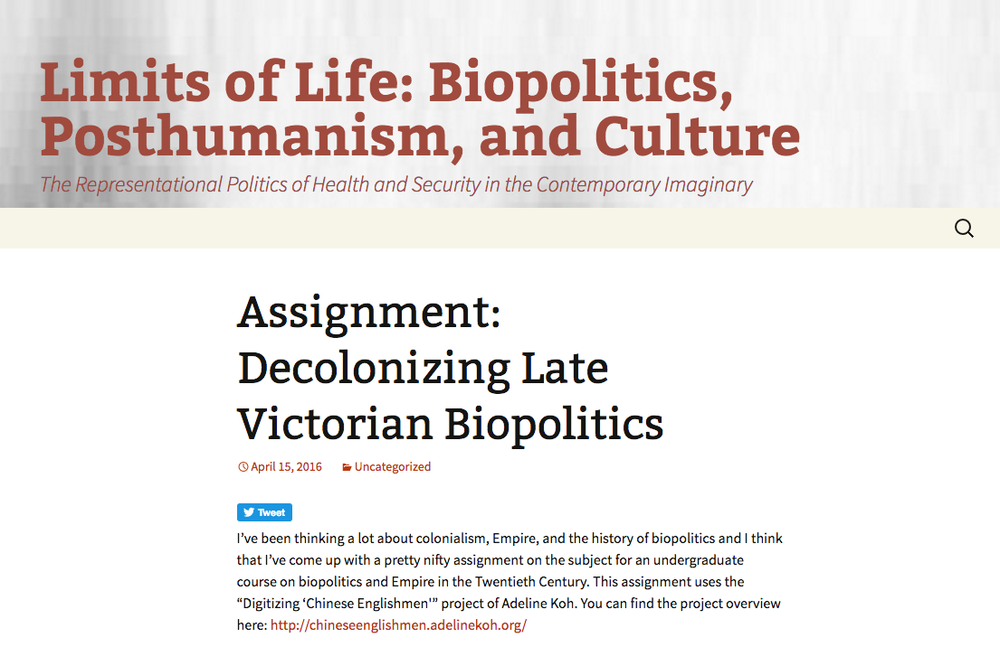
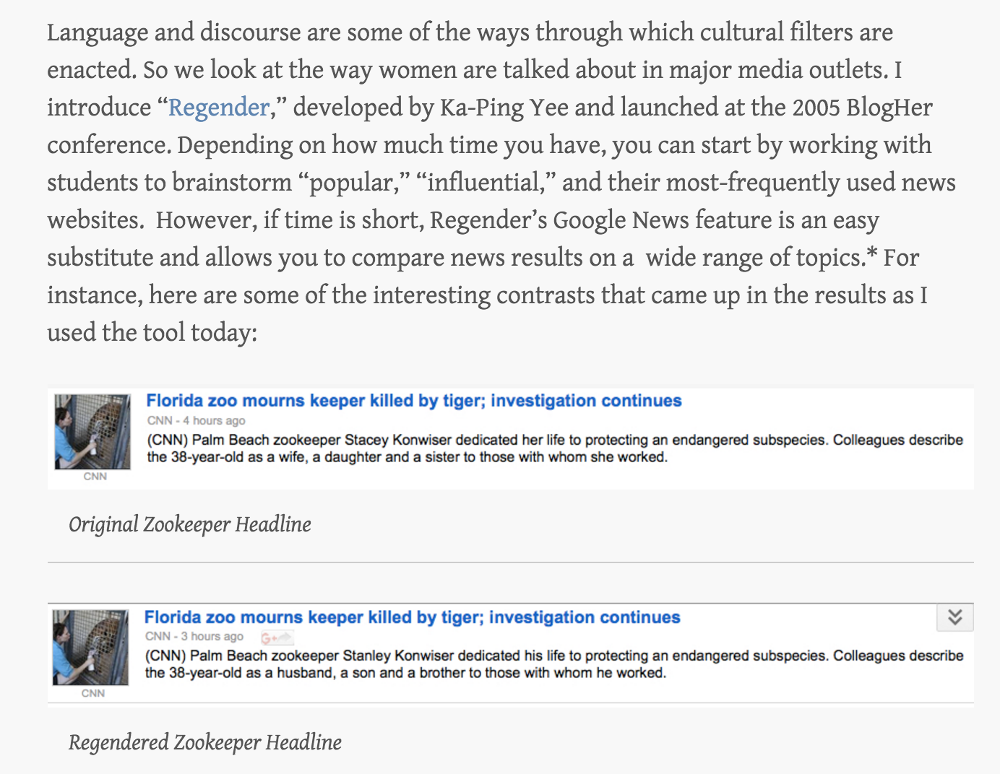
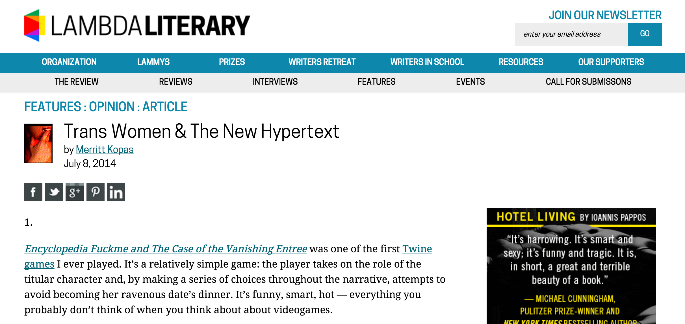
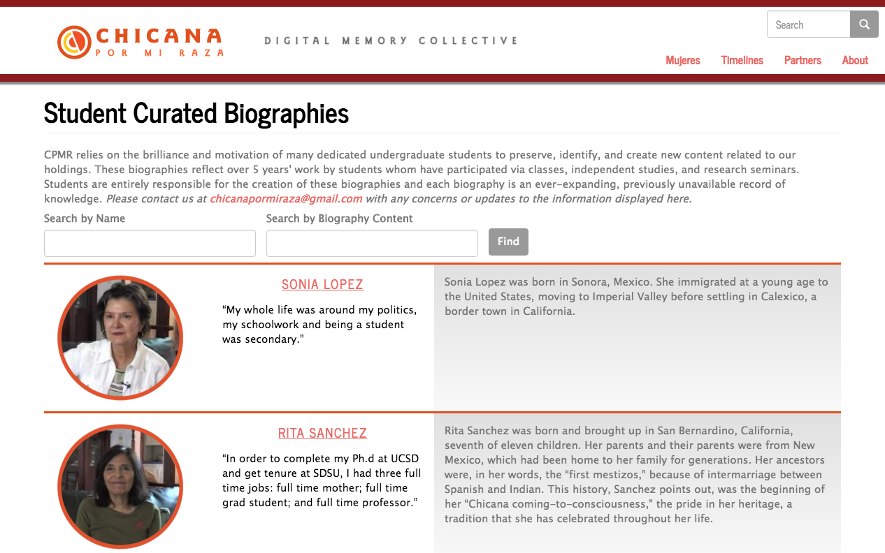
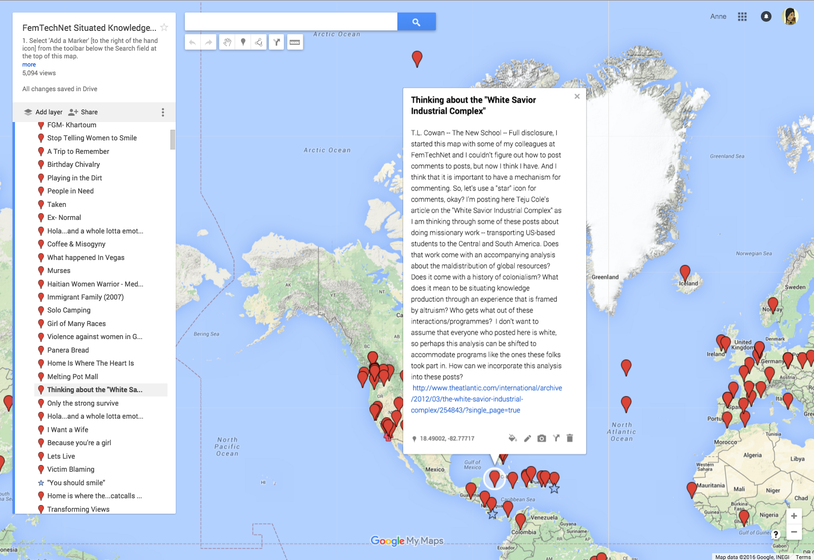
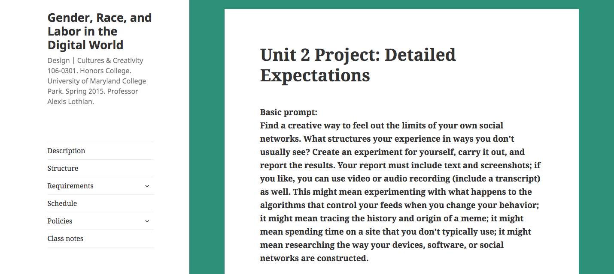
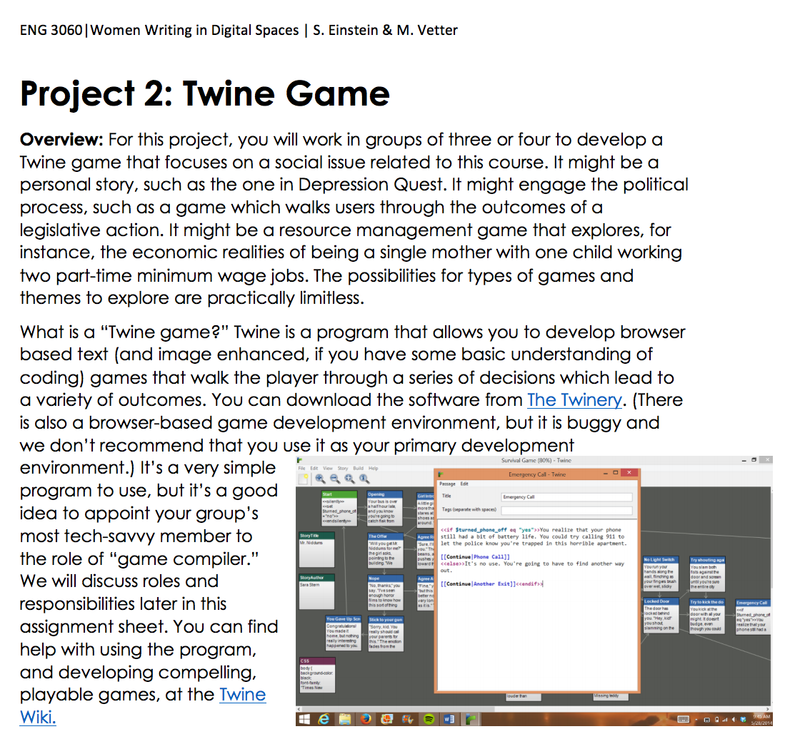
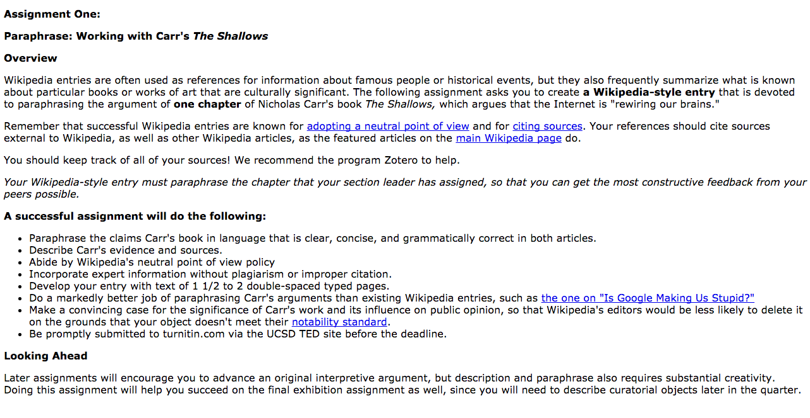
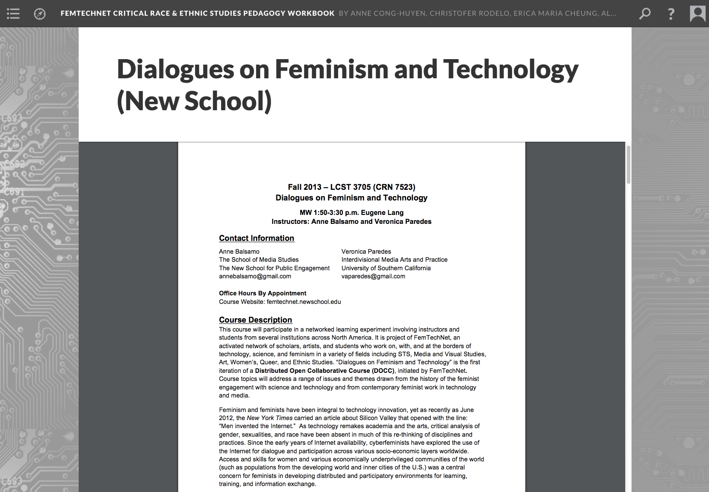
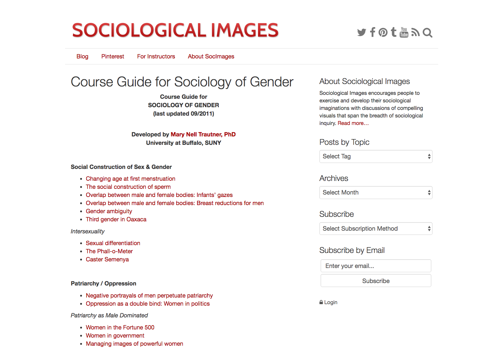

# GENDER (Draft)

## ANNE CONG-HUYEN
Whittier College | [anitaconchita.org](http://anitaconchita.org)

---

##### Publication Status:
* unreviewed draft
* draft version undergoing editorial review
* **draft version undergoing peer-to-peer review**
* published 

--- 

## CURATORIAL STATEMENT 

At its most basic, the term “gender,” as evidenced by the definition in the Oxford English Dictionary, which defines gender as “kind, sort,” and “sex, quality of being male or female,” is used to categorize and differentiate: that which is male, and that which is other (“Gender”). More than just a marker of essentialist difference, however, gender is a significant factor for developing affinity, forming alliances, and building community. It also marks bodies as targets of violence, whether female-presenting avatars in online spaces, or queer and trans bodies in physical spaces. 

“Gender,” as it is used in gender and sexuality studies, comes from the mid 20th-century work of psychologist John Money, who theorized gender as social and enacted sex roles, as opposed to biological sex roles assigned at birth. Money’s use of the term emphasizes difference, but recognizes the constructed and reinforced nature of that difference. Since then, this conception of gender has been developed, problematized, critiqued, and developed to move beyond gender binaries and include discussions of power (Ahmed, Davis), norms (Irigiray, Kristeva), queerness (Wittig, Halberstam, Edelman), performativity (Butler), racialization (Crenshaw, Anzaldua, Spillers, Mercer), labor (Boris, Parreñas, Nakamura, Haraway), and capital (Braidotti, Hennessy). Considering this breadth of scholarship, and the massive body of work associated with it, this keyword will not attempt to offer an exhaustive overview of digital pedagogy as it can be used to teach gender studies. Rather, this curatorial statement points out major concerns for teaching about gender in the contemporary networked context, while the curated list offers sample activities and methods to incorporate feminist praxis and gender critique into humanities courses. 

A digital pedagogy attuned to gender must be reflexive. It must be reflexive of our own genders, our gendered practice, the genders of our students, and the gendering that happens in the classroom. Both embodied gender and gendered practice dictate and create a structure within which the politics of the classroom community play out. As with the tools and texts integrated into a class, none of these are neutral. Using digital pedagogy, in many ways, makes assumptions of students, assumptions about access, education, and inclination. Such a practice is fraught with doubled expectations, exceptions, and imperatives for all parties involved. As Alexis Lothian notes in her curatorial statement of the keyword “Sexuality,” “Classes in gender and sexuality bring together students for whom the recognition of hard-won identities feels like a matter of life and death, along with those who think that their normative gender and heterosexual identifications mean that a class on sexuality will teach them much about others and little about themselves.” Such a process, though, as Lothian points out, is a difficult and fraught one, and few people ever feel “safe” in such spaces, no matter how hard instructors may work to provide such a space. 

In my own classes, whether I am teaching Asian American literature, or digital textuality, I purposefully weave gender studies analysis into the study of history, literature, canon formation, or broader interdisciplinary humanities topics through the careful selection of primary texts for analysis and through in-class activities. This gives students a more nuanced understanding of specific contexts, of situated knowledge that comes from different experiences, and are informed by disparate subject positions. At the same time, I ask students to be conscious of their own identities, privileges, expectations, and to question where these come from. Such questions ask students to interrogate their long-held beliefs, question how those beliefs were formed, and puts pressure on assumptions about the neutrality of text or tool. Are their texts really epitomes of genius regardless of gender, race, and class? What privilege does the very act of writing, of coding, of tinkering speak to? Such questions are common to the humanities, but digital practices can expand scope of examination to tools, texts, and environments that students are immersed in on a daily basis. 

With this wide-ranging capacity in mind, the artifacts brought together here offer a series of resources, from simpler drop-in exercises with low time commitment and prep, to larger modules exploring gender, to extensive semester-long experiments in distributed feminist pedagogy, a pedagogy that strives to be emancipatory, non-hierarchical, transparent - one that advances social justice. Each artifact is, or has been, the labor of feminists committed to addressing the historical phallogocentricism and heteronormativity of our disiplines. 

## CURATED ARTIFACTS 

## Drop-In Activities 

### ”Decolonizing Late Victorian Biopolitics"

* Artifact Type: Assignment / Decolonizing the Archive
* Source URL: [http://limitsoflife.spokorn.com/blog/uncategorized/decolonizinglatevictorianbiopoliticsassignment/](http://limitsoflife.spokorn.com/blog/uncategorized/decolonizinglatevictorianbiopoliticsassignment/)
* Artifact Permissions: CC BY 4.0
* Creator and Affiliation: Steven Pokornowski, Rio Hondo College

[http://chineseenglishmen.adelinekoh.org/](Digitizing Chinese Englishmen) is an early-stage digital archive project by Adeline Koh (Stockton University), which digitizes the Straits Chinese Magazine, a journal published by diasporic Chinese in Southeast Asia at the turn of the 20th century. Steven Pokornowski here offers an example of how teachers can use this repository of primary texts to teach about gender, race, colonial politics, and biopolitics in the late Victorian Era. Juxtaposing the archive alongside the canonical text, *Dracula*, he provides context and theoretical framing to situate the novels ias it relates to colonialism, imperialism, and race, as the “Victorian Chinesemen” at the heart of the publication present a complex portrait of precarious power in Imperial Britain. This  exercise builds on skills students are already learning in their class, but it broadens the canon and thus allows students to interrogate the production of gender and race within the British Empire. 

### “Gender Bias Exercise”

* Artifact Type: In-class Exercise
* Source URL: [http://kimknight.com/?p=2385](http://kimknight.com/?p=2385)
* Artifact Permissions: Copyright kimknight.com 
* Creator and Affiliation: Kim Knight, UT Dallas

One difficulty of gender studies classes is in rendering visible the invisibility of gender bias. Kim Knight (UT Dallas) asks students to perform a gender hack using two digital tools--[http://regender.com/](Regender) and [https://chrome.google.com/webstore/detail/jailbreak-the-patriarchy/fiidcfoaaciclafodoficaofidfencgd?hl=en-US](Jailbreak the Patriarchy Chrome Extension), two web-based tools that swap gender pronouns on existing websites and  publications--to reveal gender bias in language, open up space to unpack gender binaries, and to reflect upon other forms of bias. Knight asks students link the results of their gender hacking to the work of Jill Walker Rettberg, Anne Balsamo, and others and pushes students to evaluate the "implicit ideologies" embedded in our technologies. These tools reveal how code can be used to challenge built-in assumptions of the web and the cultural values expressed in web content. Knight also offers recommendations for expanding upon the assignment with a gender remixing activity using the [http://www.genderremixer.com/about/](Gendered Advertising Remixer), which uses humor to highlight binary gender norms, and shares recommendations for connecting these activities to experiments done by women and women of color online (Twitter avatar swap, performing gender in online dating, etc.).

###“Trans Women and the New Hypertext” 

* Artifact Type: Article
* Source URL: [http://www.lambdaliterary.org/features/07/08/trans-women-the-new-hypertext/](http://www.lambdaliterary.org/features/07/08/trans-women-the-new-hypertext/]
* Artifact Permissions: Copyright Lambda Literary
* Creator and Affiliation: Merrit Kopas, in Lambda Literary

Merritt Kopas, multimedia artist and game designer, writes about independent games with trans narratives. Kopas argues, “hypertext and digital games are totally trans genres”, and she offers a sampling of games produced by trans women who trouble binary gender constructions. The games shared in this article are diverse in subject matter, form, and genre, offering nuanced, first person narratives that interrogating the themes of family, embodiment, love, sex, pleasure and pain. Whether incorporated in literature or gender studies courses, these games broaden the canon of women’s fiction, science fiction, games studies, or electronic literature. In addition, these texts ask students and teachers to engage with texts in a different manner, by immersing themselves in the role of another by making choices that can change the outcome of the narrative. The subtle effects, the excitement or poignancy elicited can be profoundly effective for communicating the trans experience, or complicating the heteronormative one.

### Modules

### "Biography/Digital Curation Assignment"

* Artifact Type: digital archive curation
* Source URL: [http://chicanapormiraza.org/mujeres](http://chicanapormiraza.org/mujeres)
* Artifact Permissions: Anyone may use the archive and ancillary materials so long as they agree to join the Chicana por mi Raza Digital Memory Collective. According to the site, “Members of the collective are granted access to the materials in the collection with the understanding that they will contribute in some way to the goals of the Chicana por mi Raza project.”
* Creator and Affiliation: María Cotera, University of Michigan

Chicana Por Mi Raza is a digital archive of Chicana feminism spanning 1965 to 1985. The collective has recorded over fifty-nine oral histories and gathered roughly 2500 documents, 60 percent of which have been digitized and cataloged. The collection includes a range of materials chronicling Chicana feminist theory, literature, ephemera, and timelines. Though significant as an archive, it also serves as a useful site for advanced feminist pedagogy. In her "Biocuration" assignment, Maria Cotera, one of the founders of the archives, asks students to engage directly with the archive and create new content for the collection. As part of the project, students conduct original research, listen to oral histories, collect data, and write biographical and historical content that eventually populates the archive. Students then become important contributors to a public digital history project and have examples of their scholarship accessible to larger communities and publics.

### “Situated Knowledges Map"

* Artifact Type: In-class Activity
* Source URL: [http://femtechnet.org/docc/feminist-mapping/situated-knowledge-map/](http://femtechnet.org/docc/feminist-mapping/situated-knowledge-map/)
* Artifact Permissions: Open Access
* Creator and Affiliation: FemTechNet: TL Cowan, K. Surkan, and Laura Wexler

According to FemTechNet the "Situated Knowledges Map is an experiment in thinking about the relationship between space, place, mobility and knowledge production and circulation. By marking locations of significance to ourselves, we hope to get a sense of where we are coming from across the FemTechNet world." The assignment page includes a bibliography and uses Google Maps Engine to create a collaborative map where students drop annotated pins with reflections about the place with particular emphasis to how the place helped the individual come to understand keywords such as "power, class, gender, sex, assigned sex, race" or "migrant knowledges". The mapping activity hacks a commercial mapping platform for transformative and collective knowledge production works to link learning that is occurring in geographically disparate locations, while the collective mapping encourages participants to engage with the situated of knowledge of others. 

### “Hack Your Digital Sphere"

* Artifact Type: Project prompt
* Source URL: [http://dcc106sp15.queergeektheory.org/requirements/projects/unit-2-project-detailed-expectations/](http://dcc106sp15.queergeektheory.org/requirements/projects/unit-2-project-detailed-expectations/)
* Artifact Permissions: Copyright Alexis Lothian
* Creator and Affiliation: Alexis Lothian, University of Maryland College Park

For individuals who may already be immersed in digital life, it can be very difficult objectively evaluate their social networks, let alone the role gender plays in that social network. In the "Social Media and Social Justice" unit of her Gender, Race, and Labor in the Digital Worlds course, Alexis Lothian asks her students to test the limits and boundaries of their social networks, document their experiments, and reflect upon their digital activities within larger social structures. Designed as a larger research project where students must determine their research topics, questions, and methods, students were given enormous freedom to evaluate their relationship to social media. Depending on the course, this project could be used to evaluate online gaming networks such as Fat, Ugly or Slutty [http://fatuglyorslutty.com/](http://fatuglyorslutty.com/), a blog that documents the very gender-specific harassment that women gamers tend to receive. The site is a user-created platform for community building, raising awareness, and it offers a store of primary materials for everyday analysis. A sample pedagogical use of this site includes asking students to choose a post category (e.g.“Crudely Creative” to “Unprovoked Rage”) and perform rhetorical analysis of the collected posts for recurring tropes, language, images.

### Twine Game

* Artifact Type: Assignment Prompt
* Source URL: [http://www.digitalrhetoriccollaborative.org/wp-content/uploads/2015/05/Einstein-Vetter-Twine-Game-Assignment-.pdf](http://www.digitalrhetoriccollaborative.org/wp-content/uploads/2015/05/Einstein-Vetter-Twine-Game-Assignment-.pdf)
* Artifact Permissions: 
* Creator and Affiliation: Sarah Einstein and Matthew Vetter

This assignment was designed as a capstone to a larger unit on the politics and rhetoric of the #Gamergate controversy. It asked students to create their own choose-your-own adventure game that engaged "gender politics, identity, and narrative in the writing classroom" using the open-source Twine gaming engine. Students are asked to propose a game that addresses a social issue related to the course, perform research and produce an annotated bibliography, then to develop a game in groups. The purpose of the assignment is to create a narrative that revealed the complexity of a gender related issue (the students in Einstein and Vetter's course tackled street harassment, coming out as queer, and campus sexual assault) in the text where the player could make choices and reach differnt outcomes that can be negative, positive, or neutral. The assignment forces students to evaluate and inform their own understandings of the chosen topics and the surrounding social environment, reflect on potential dangers or opportunities, and determine how to present these to a general audience.

### "Feminist Wiki-storming"

* Artifact Type: Activity
* Source URL: [http://losh.ucsd.edu/courses/assignmentone.html](http://losh.ucsd.edu/courses/assignmentone.html)
* Artifact Permissions: CC BY-NC 2.0
* Creator and Affiliation: Adrianne Wadewitz

Feminist Wikipedians, led initially by Adrianne Wadewitz, have been organizing edit-a-thons to train women, queer communities, and people of color to edit Wikipedia to address gender and racial bias. Wadewitz worked with the WikiEd Foundation and FemTechNet to develop a collection of assignments and teaching materials collected as part of the [http://femtechnet.org/docc/feminist-wiki-storming/](Feminist Wikistorming Key Learning Project). Here, we have an example of a smaller assignment focused around a course text. The assignment asks students to become familiar with Wikipedia as a platform, become proficient in writing in an encyclopedic style, and learn to author an entry that passes Wikipedia standards, while also being critical of Wikipedia's flaws. Elsewhere, the assignment has been adapted by FemTechNet to include critical questions about gender bias, inclusion and deletion debates in Wikipedia. Other artifacts in the  collection include learning objectives, sample assignments, an assignment builder, and tutorials. 

## Semester-long Feminist Pedagogical Experiments

### "FemTechNet DOCC: Dialogues on Feminism and Technology"

* Artifact Type: Syllabus
* Source URL: [http://scalar.usc.edu/works/ftn-ethnic-studies-pedagogy-workbook-/dialogues-on-feminism-and-technology-new-school](http://scalar.usc.edu/works/ftn-ethnic-studies-pedagogy-workbook-/dialogues-on-feminism-and-technology-new-school)
* Artifact Permissions: Creative Commons licensed
* Creator and Affiliation: Anne Balsamo and Veronica Paredes

FemTechNet describes itself as “an activated network of scholars, artists, and students working on, with, and at the borders of technology, science, and feminism in a variety of fields including Science & Technology Studies (STS), Media and Visual Studies, Art, Gender, Queer, and Ethnic Studies.” The network’s biggest accomplishment includes a Distributed Open Collaborative Course (DOCC), developed as a critique of MOOCs (Massive Open Online Course). The Balsamo and Paredes syllabus from the New School is one of the early iterations (more sample syllabi can be found in the FTN Critical Race and Ethnic Studies Pedagogy Workbook). This syllabus is an example of a nodal DOCC course and offers an example of ways to incorporate digital learning activities in a semester-long course about gender, feminism and technology. The syllabus exemplifies a connected course that uses the networks materials: video dialogues and networked learning activities including keyword videos and Wikistorming.

 
### “Course Guide for Sociology of Gender”

* Artifact Type: Web page, teaching resources, Pinterest collections
* Source URL: [https://thesocietypages.org/socimages/for-instructors/](https://thesocietypages.org/socimages/for-instructors/)
* Artifact Permissions: CC Attribution Non-Commercial Share Alike
* Creator and Affiliation: Lisa Wade, The Society Pages

The Sociological Images is a section of The Society Pages, an open-access social science project from the Department of Sociology at the University of Minnesota, curated by Lisa Wade (Occidental College). In Sociological Images, Wade shares a collection of resources to help teach and build analytical skills, in particular “sociological imagination.” The materials gathered include a sociological blog; a Pinterest board that curates over 14,500 images from advertisements, pop culture, and other visual culture with blog-length analyses and discussions; course guides; and more. Amongst these resources, Mary Nell Trautner's expansive "Course Guide for Sociology of Gender" is an especially helpful resource that collects important Society Pages posts that can help teach gender studies. The collection follows the general structure of a sociology course on gender and includes pages organized thematically around such topics as the social construction of gender or intersexuality and current topics such as gender in sports and white privilege.

## RELATED MATERIALS

* Bailey, Moya. “All the Digital Humanists Are White, All the Nerds Are Men, but Some of Us Are Brave.” Journal of Digital Humanities. 1.1 (2011) Web. http://journalofdigitalhumanities.org/1-1/all-the-digital-humanists-are-white-all-the-nerds-are-men-but-some-of-us-are-brave-by-moya-z-bailey/

* Barnett, Fiona, HASTAC Scholars, et al. The Pedagogy Project. HASTAC. 1 April 2014. Web. https://www.hastac.org/pedagogy-project

* Crunk Feminist Collective. “Percussive Pedagogies with Crunk Feminist Collective.” Feminist Digital Pedagogies Conference at Rutgers. 9 April 2015. https://www.youtube.com/watch?v=aciIBnl2K-E 

* Rodriguez, Cecilia. “Designing Critically: Feminist Pedagogy for Digital Real/Life.” Hybrid Pedagogy. 6 November 2014. Web. http://www.digitalpedagogylab.com/hybridped/designing-critically-feminist-pedagogy-digital-real-life/

* Wernimont, Jacqueline. “Whence Feminism?” Digital Humanities Quarterly. 7.1 (2013). Web. http://www.digitalhumanities.org/dhq/vol/7/1/000156/000156.html

## WORKS CITED

Ahmed, Sara. Queer Phenomenology: Orientations, Objects, Others. Duke University Press: Durham, NC, 2006.

Anzaldua, Gloria. Borderlands/La Frontera: The New Mestiza. San Francisco: Aunt Lute Books, 2007.

Balsamo, Anne. Technologies of the Gendered Body: Reading Cyborg Women. Durham: Duke University Press, 1995.
 
Barlow, John Perry. “A Declaration of Independence of Cyberspace.” Electronic Frontier Foundation. 8 February 1996. Web. https://www.eff.org/cyberspace-independence

Boris, Eileen. Home to Work: Motherhood and the Politics of Industrial Homework in the United States. Cambridge UK: Cambridge University Press, 1994.

Braidotti, Rosi. Metamorphoses: Towards a Materialist Theory of Becoming. Cambridge, UK: Polity, 2002. 

Butler, Judith. Gender Trouble: Feminism and the Subversion of Identity. New York, NY: Routledge, 2006.
 
Chicana Por Mi Raza. María Cotera and Linda Garcia Merchant, The Institute for Computing in Humanities Arts and Sciences, University of Illinois, Urbana-Champaign, 2015. Web. http://www.chicanapormiraza.org
 
Chun, Wendy. Control and Freedom: Power and Paranoia in the Age of Power Optics. Cambridge: MIT Press, 2008.

Crenshaw, Kimberle. On Intersectionality: Essential Writings. New York, NY: The New Press, 2016.

Davis, Angela. Women, Race, and Class.  New York: Vintage Books, 1983.
 
Digitizing Chinese Englishmen. Adeline Koh. 2016. Web. http://chineseenglishmen.adelinekoh.org/
 
Edelman, Lee. Homographesis: Essays in Gay Literary and Cultural Theory. New York, NY: Routledge, 1994. 

English Broadside Ballad Archive. The Early Modern Center, University of California, Santa Barbara. 2016. Web.  http://ebba.english.ucsb.edu/
 
Everett, Anna. Digital Diaspora: A Race for Cyberspace. Albany: SUNY Press, 2009.
 
Halberstam, Jack. “Gender.” Keywords for American Cultural Studies. New York: NYU Press, 2014.

Halberstam, Judith. Female Masculinity. Durham, NC: Duke University Press Durham, NC, 1998. 

Haraway, Donna. Simians, Cyborgs, and Women: The Reinvention of Nature. New York: Routledge, 1990.

Hennessy, Rosemary. Profit and Pleasure: Sexual Identities in Late Capitalism. New York: Routledge, 2000. 

Irigiray, Luce. This Sex Which Is Not One. Ithaca, NY: Cornell University Press 1,985.

Kristeva, Julia. “Women's Time.” New Maladies of the Soul.  Columbia University Press: New York, 1993.
 
Fat, Ugly or Slutty. 2016. Web. http://fatuglyorslutty.com/
 
FemTechNet. FemTechNet 2016. Web. http://femtechnet.org/
 
“Gender Bias.” Wikipedia. Wikimedia Foundation. 2016.  https://en.wikipedia.org/wiki/Gender_bias_on_Wikipedia
 
Kopas Merritt. “Trans Women and the New Hypertext.” Lambda Literary. 8 July 2014. Web. http://www.lambdaliterary.org/features/07/08/trans-women-the-new-hypertext/
 
Lothian, Alexis. “Sexuality.” Digital Pedagogy in the Humanities. Modern Language Association.
 
McPherson, Tara. “Why are the Digital Humanities So White? Or Thinking the Histories of Race and Computation.” Debates in the Digital Humanities. Minneapolis: University of Minnesota Press, 2012.

Mercer, Kobena. Welcome to the Jungle: New Positions in Black Cultural Studies. New York: Routledge, 1994.
 
Nakamura, Lisa. Cybertypes: Race, Ethnicity, and Identity on the Internet. New York: Routledge, 2002.

Parreñas, Rhacel. Servants of Globalization: Women, Migration, and Domestic Work. Stanford, CA: Stanford University Press, 2001.
 
Regender. Ka-Ping Yee. 2005. Web. http://regender.com/
 
Sociological Images. The Society Pages. W.W. Norton & Company, 2016. Web. https://thesocietypages.org/socimages/

Spillers, Hortense J. "Mama's Baby, Papa's Maybe: An American Grammar Book." Black, White, and in Color: Essays on American Literature and Culture. Chicago: University of Chicago Press, 2003.
 
Turkle, Sherry. Life on the Screen: Identity in the Age of the Internet. New York: Simon & Schuster, 1995.
 
Visual History Archive. USC Shoah Foundation. 2007-2016. Web. https://sfi.usc.edu/vha

Wittig, Monique. The Straight Mind and Other Essays. Boston: Beacon Press, 1992.
 
