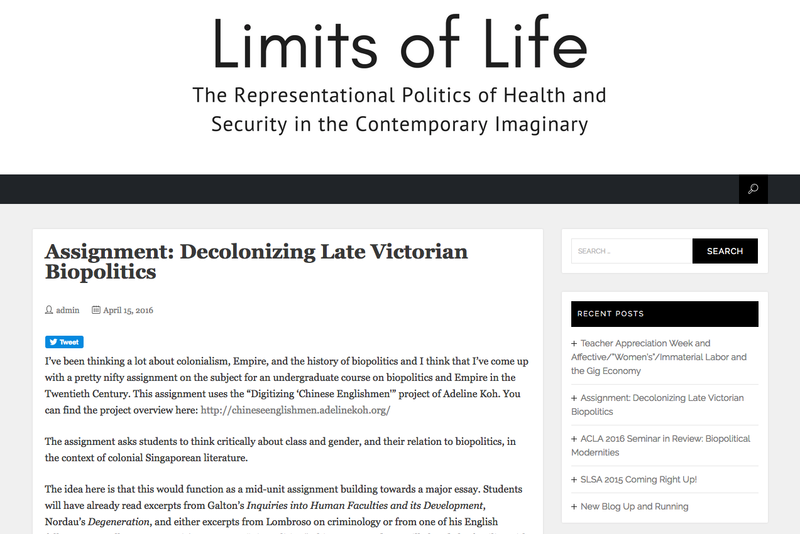
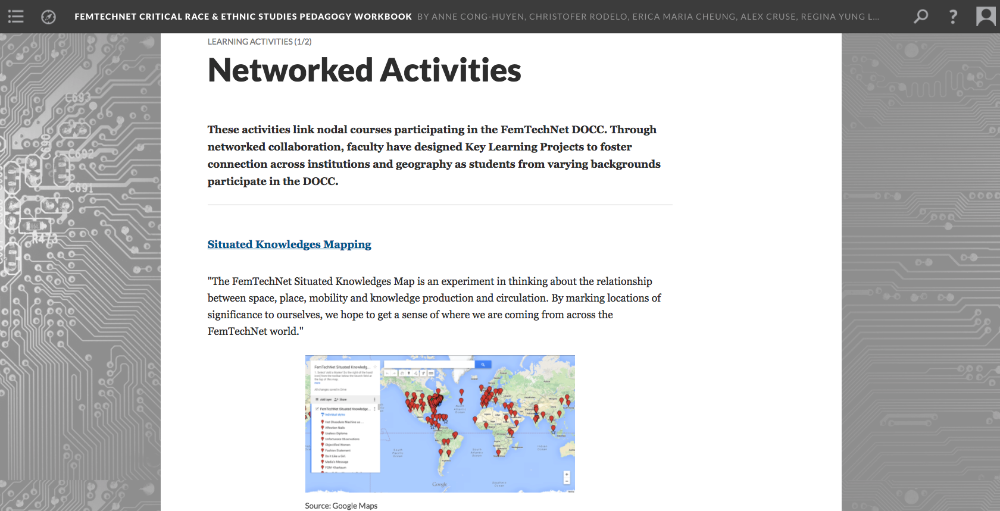
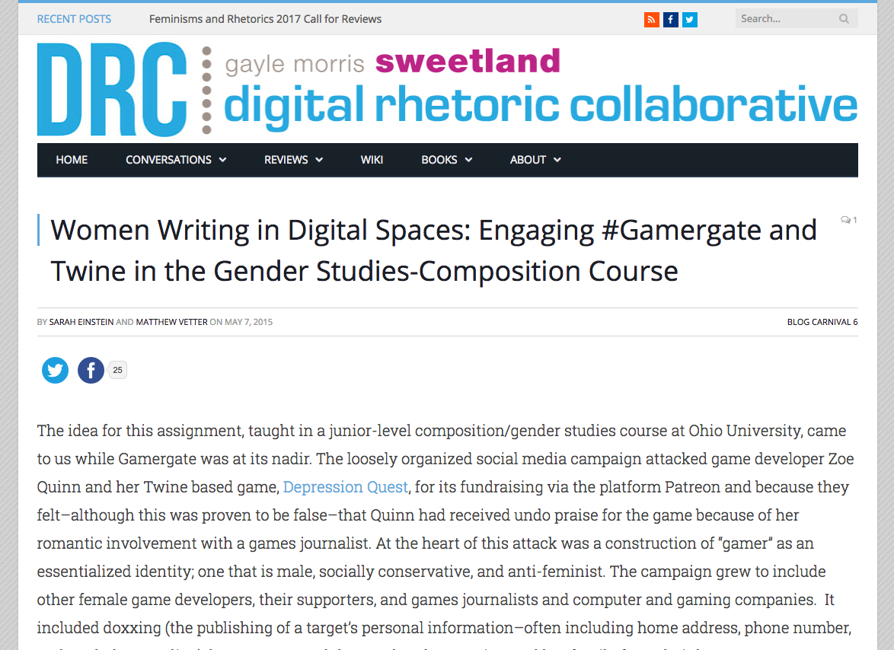
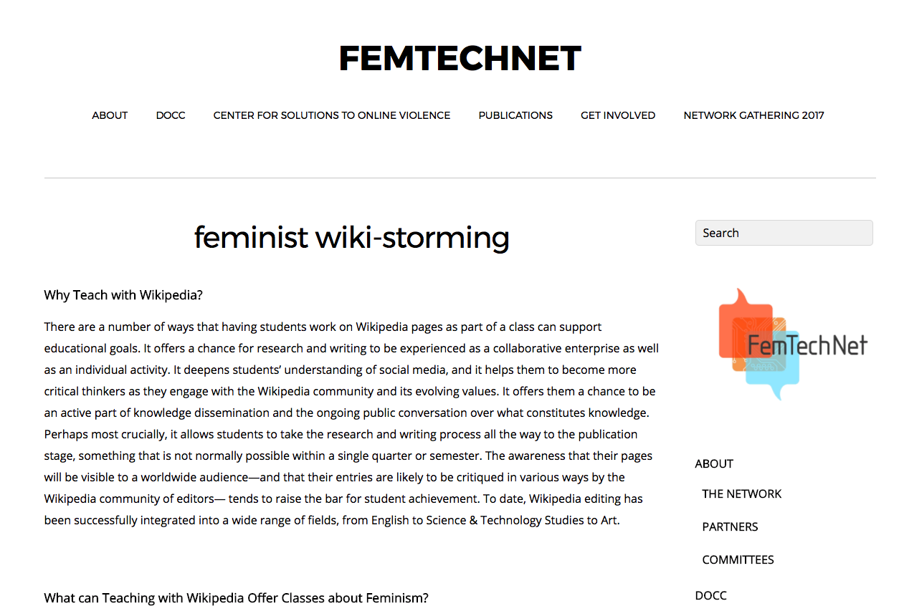
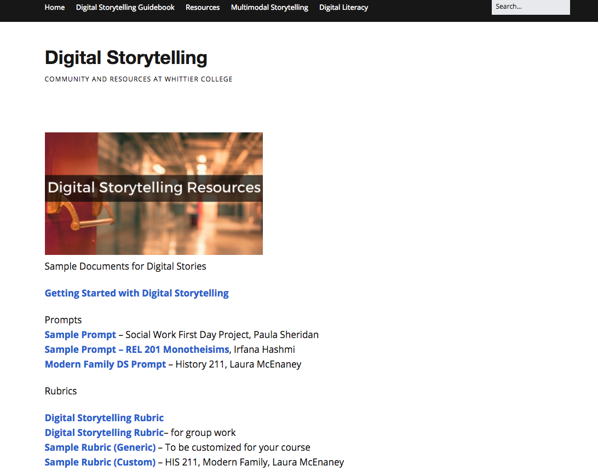
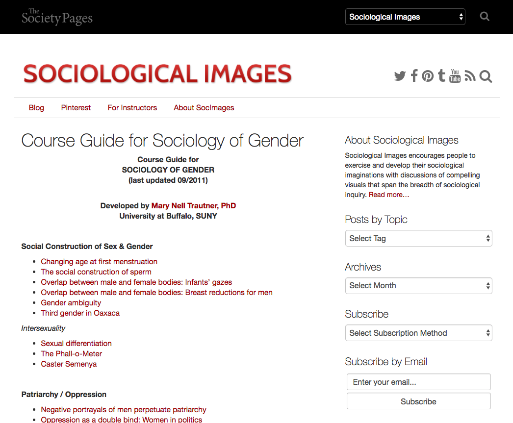

# Gender

### Anne Cong-Huyen
Whittier College | [anitaconchita.org](http://anitaconchita.org)

---

##### Publication Status:
* unreviewed draft
* draft version undergoing editorial review
* draft version undergoing peer-to-peer review
* **draft version undergoing MLA copyediting**
* published 

--- 

## CURATORIAL STATEMENT 

The term "gender" is commonly used to categorize and differentiate along binary lines: that which is male from that which is other. The Oxford English Dictionary defines it as “kind, sort,” and “sex, quality of being male or female” (“Gender”). More than just a marker of essentialist difference, however, gender is a significant factor for developing affinity, forming alliances, and building community. It also marks bodies as targets of violence, whether female-presenting avatars in online spaces, or non-binary queer and trans bodies in physical spaces. 

“Gender,” as it is used in gender and sexuality studies, comes from the mid 20th-century work of psychologist John Money, who theorized gender as social and enacted sex roles, as opposed to biological sex roles assigned at birth. Money’s use of the term emphasizes difference, but recognizes the constructed and reinforced nature of that difference. Since then, this conception of gender has been developed, problematized, critiqued, and developed to move beyond gender binaries and include discussions of power (Ahmed, Davis), norms (Irigiray, Kristeva), queerness (Wittig, Halberstam, Edelman), performativity (Butler), racialization (Crenshaw, Anzaldua, Spillers, Mercer), labor (Boris, Parreñas, Nakamura, Haraway), and capital (Braidotti, Hennessy). Considering this breadth of scholarship, and the massive body of work associated with it, this keyword will not attempt to offer an exhaustive overview of digital pedagogy as it can be used to teach gender studies. Rather, this curatorial statement endeavors to point out major concerns for teaching about gender in the contemporary networked context, while the curated artifacts offer sample activities and methods to incorporate feminist praxis and gender critique into humanities courses. 

At its heart, a digital pedagogy attuned to gender must be reflexive. It must be reflexive of our own genders, our gendered practice, the genders of our students, and the gendering that happens in the classroom. Both embodied gender and gendered practice dictate and create a structure within which the politics of the classroom community play out. As with the tools and texts integrated into a class, both embodied gender and classroom communities are never neutral. Using digital pedagogy can often heighten this fact. It makes assumptions of students, assumptions about access, education, and inclination. Such a practice is fraught with doubled expectations, exceptions, and imperatives for all parties involved. As Alexis Lothian notes in her curatorial statement of the keyword “Sexuality,” “Classes in gender and sexuality bring together students for whom the recognition of hard-won identities feels like a matter of life and death, along with those who think that their normative gender and heterosexual identifications mean that a class on sexuality will teach them much about others and little about themselves.” Such a process, though, as Lothian points out, is a difficult and fraught one, and few people ever feel “safe” in such spaces, no matter how hard instructors may work to provide such a space. 

In my own classes, whether I am teaching Asian American literature, or digital labor, I purposefully weave gender studies analysis and methods into the study of history, literature, canon formation, or broader interdisciplinary humanities topics through the careful selection of primary texts for analysis and through in-class activities. This provides students a more nuanced understanding of specific contexts, of situated knowledge that comes from different experiences, and are informed by disparate subject positions. At the same time, I ask students to be conscious of their own identities, privileges, expectations, and to question where these come from. Such questions ask students to interrogate their long-held beliefs, question how those beliefs were formed, and puts pressure on assumptions about the neutrality of text or tool. Are their texts really paradigmatic of genius regardless of gender, race, and class? What privilege does the very act of writing, of coding, of tinkering speak to? Such questions are common to the humanities, but digital practices can expand the scope of examination to tools, texts, and environments that students encounter on a daily basis. 

With this wide-ranging capacity in mind, the artifacts brought together here offer a series of resources, from simpler drop-in exercises with low time commitment and prep, to larger modules exploring gender, to extensive semester-long experiments in distributed feminist pedagogy, a pedagogy that strives to be emancipatory, non-hierarchical, transparent - one that advances social justice. Each artifact is, or has been, the labor of feminists committed to addressing the historical phallogocentrism and heteronormativity of their disciplines. 

## CURATED ARTIFACTS 

### Drop-In Activities 

#### "Decolonizing Late Victorian Biopolitics"

* Artifact Type: Assignment 
* Source URL: [http://limitsoflife.spokorn.com/blog/uncategorized/decolonizinglatevictorianbiopoliticsassignment/](http://limitsoflife.spokorn.com/blog/uncategorized/decolonizinglatevictorianbiopoliticsassignment/)
* Artifact Permissions: CC BY 4.0
* Creator and Affiliation: Steven Pokornowski (Rio Hondo College)
* Copy of Artifact: [gender-decolonizing-biopolitics-assignment.pdf](files/gender-decolonizing-biopolitics-assignment.pdf)

[Digitizing Chinese Englishmen](http://chineseenglishmen.adelinekoh.org/) is an early-stage digital archive project by Adeline Koh (Stockton University), which digitizes the Straits Chinese Magazine, a journal published by diasporic Chinese in Southeast Asia at the turn of the 20th century. Steven Pokornowski here offers an example of how teachers can use this repository of primary texts to teach about gender, race, colonial politics, and biopolitics in the late Victorian Era. Juxtaposing the archive alongside the canonical text, *Dracula*, he provides context and theoretical framing to situate the novels as it relates to colonialism, imperialism, and race, as the “Victorian Chinesemen” at the heart of the publication present a complex portrait of precarious power in Imperial Britain. This  exercise builds on skills students are already learning in their class, but it broadens the canon and thus allows students to interrogate the production of gender and race within the British Empire. 

#### “Gender Bias Exercise”

* Artifact Type: In-class Activity
* Source URL: [http://kimknight.com/?p=2385](http://kimknight.com/?p=2385)
* Artifact Permissions: Copyright kimknight.com 
* Creator and Affiliation: Kim Knight (UT Dallas)
* Copy of Artifact: none

One difficulty of gender studies classes is in rendering visible the invisibility of gender bias. Kim Knight (UT Dallas) asks students to perform a gender hack using two digital tools--[Regender](http://regender.com/) and [Jailbreak the Patriarchy](https://chrome.google.com/webstore/detail/jailbreak-the-patriarchy/fiidcfoaaciclafodoficaofidfencgd?hl=en-US), two web-based tools that swap gender pronouns on existing websites and  publications--to reveal gender bias in language, open up space to unpack gender binaries, and to reflect upon other forms of bias (Ka Ping Yee, Sucher). Knight asks students link the results of their gender hacking to the work of Jill Walker Rettberg, Anne Balsamo, and others and pushes students to evaluate the "implicit ideologies" embedded in our technologies. These tools reveal how code can be used to challenge built-in assumptions of the web and the cultural values expressed in web content. Knight also offers recommendations for expanding upon the assignment with a gender remixing activity using the [http://www.genderremixer.com/about/](http://www.genderremixer.com/about/), which uses humor to highlight binary gender norms, and shares recommendations for connecting these activities to experiments done by women and women of color online (Twitter avatar swap, performing gender in online dating, etc.).

#### “Situated Knowledges Map"

* Artifact Type: In-class Activity
* Source URL: [http://femtechnet.org/docc/feminist-mapping/situated-knowledge-map/](http://femtechnet.org/docc/feminist-mapping/situated-knowledge-map/)
* Artifact Permissions: CC BY-NC 4.0
* Creator and Affiliation: TL Cowan (University of Toronto), K. Surkan (MIT), and Laura Wexler (Yale)
* Copy of Artifact: none

According to FemTechNet the "Situated Knowledges Map is an experiment in thinking about the relationship between space, place, mobility and knowledge production and circulation. By marking locations of significance to ourselves, we hope to get a sense of where we are coming from across the FemTechNet world." The assignment page includes a bibliography and uses Google Maps Engine to create a collaborative map where students drop annotated pins with reflections about the place with particular emphasis to how the place helped the individual come to understand keywords such as "power, class, gender, sex, assigned sex, race" or "migrant knowledges". The mapping activity hacks a commercial mapping platform for transformative and collective knowledge production works to link learning that is occurring in geographically disparate locations, while the collective mapping encourages participants to engage with the situated of knowledge of others. 

### Modules

#### "Biography/Digital Curation Assignment"

* Artifact Type: Assignment 
* Source URL: [http://chicanapormiraza.org/mujeres](http://chicanapormiraza.org/mujeres)
* Artifact Permissions: Copyright María Cotera used with permission
* Creator and Affiliation: María Cotera, University of Michigan
* Copy of Artifact: [gender-biocuration-assignment.pdf](files/gender-biocuration-assignment.pdf)

A major hurdle for digital humanities projects, especially those documenting marginal communities and using feminist and community-centered practices, is sustainability. María Cotera, the director of the Chicana Por Mi Raza digital archive of Chicana feminism, tackles this problem by incorporating the archive into her class in the form of a Biography and Digital Curation Assignment. In the "Biocuration" assignment, Cotera asks students to engage directly with the archive and create new content based on its collections. As part of the project, students conduct research in the closed archive and then create biographical and historical content for a website that publically represents the archive. According to Cotera, the public site therefore acts as a "staging zone for knowledge produced using materials from the archive." Students therefore become important contributors to a public digital history project and produce public scholarship accessible to larger communities and publics.

#### “Hack Your Digital Sphere"

* Artifact Type: Project prompt
* Source URL: [http://dcc106sp15.queergeektheory.org/requirements/projects/unit-2-project-detailed-expectations/](http://dcc106sp15.queergeektheory.org/requirements/projects/unit-2-project-detailed-expectations/)
* Artifact Permissions: Copyright Alexis Lothian
* Creator and Affiliation: Alexis Lothian (University of Maryland College Park)
* Copy of Artifact: none

For individuals already immersed in digital life, it can be very difficult to objectively evaluate their social networks, let alone the role gender plays in that social network. In the "Social Media and Social Justice" unit of her Gender, Race, and Labor in the Digital Worlds course, Alexis Lothian asks her students to test the limits and boundaries of their social networks, document their experiments, and reflect upon their digital activities within larger social structures. Designed as a larger research project where students must determine their research topics, questions, and methods, students were given enormous freedom to evaluate their relationship to social media. This project could be remixed to evaluate online gaming networks such as [Fat, Ugly or Slutty](http://fatuglyorslutty.com/), a blog that documents the very gender-specific harassment that women gamers tend to receive, or communities such as those cohering around Facebook groups.

#### Twine Game

* Artifact Type: Assignment 
* Source URL: [http://www.digitalrhetoriccollaborative.org/2015/05/07/women-writing-in-digital-spaces-engaging-gamergate-and-twine-in-the-gender-studies-composition-course/](http://www.digitalrhetoriccollaborative.org/2015/05/07/women-writing-in-digital-spaces-engaging-gamergate-and-twine-in-the-gender-studies-composition-course/)
* Creator and Affiliation: Sarah Einstein (University of Tennessee at Chattanooga) and Matthew Vetter (Indiana University of Pennsylvania)
* Copy of Artifact: [gender-twinegame-project.pdf](files/gender-twinegame-project.pdf)

This group project asks students to create a choose-your-own adventure game that engages "gender politics, identity, and narrative in the writing classroom" using [Twine](http://twinery.org/). Students propose an original game addressing a gender studies issue, perform research, then develop a game. The purpose of the assignment is to create a narrative that reveals the complexity of potential danger of gender related issues in a navigable text where players can make choices and reach different outcomes. This assignment can also be adapted to a range of gender studies topics including trans narratives, which are exemplified in the work of Merritt Kopas, who curated such a selection in ["TransWomen & the New Hypertext"](https://www.lambdaliterary.org/features/07/08/trans-women-the-new-hypertext/), or genre narratives as anna anthropy has demonstrates with her own queer horror and science fiction twine games [http://www.auntiepixelante.com/games/](http://www.auntiepixelante.com/games/).

#### "Feminist Wiki-storming"

* Artifact Type: Activity
* Source URL: [http://femtechnet.org/docc/feminist-wiki-storming/](http://femtechnet.org/docc/feminist-wiki-storming/)
* Artifact Permissions: CC BY-NC 2.0
* Creator and Affiliation: Elizabeth Losh (William & Mary)
* Copy of Artifact: [gender-FTNwikistorming-assignment.docx](files/gender-FTNwikistorming-assignment.docx)

Feminist Wikipedians, led initially by Adrianne Wadewitz, have been organizing edit-a-thons to train women, queer communities, and people of color to edit Wikipedia to address gender and racial bias. Wadewitz worked with the WikiEd Foundation and FemTechNet to develop a collection of assignments and teaching materials collected as part of the [http://femtechnet.org/docc/feminist-wiki-storming/](http://femtechnet.org/docc/feminist-wiki-storming/). Here, we have an example of a smaller assignment focused around a course text. The assignment asks students to become familiar with Wikipedia as a platform, become proficient in writing in an encyclopedic style, and learn to author an entry that passes Wikipedia standards, while also being critical of Wikipedia's flaws. Elsewhere, the assignment has been adapted by FemTechNet to include critical questions about gender bias, inclusion and deletion debates in Wikipedia. Other artifacts in the  collection include learning objectives, sample assignments, an assignment builder, and tutorials. 

### Semester-long Feminist Pedagogical Experiments

#### "FemTechNet DOCC: Collaborations in Feminism and Technology"

* Artifact Type: Syllabus
* Source URL: [http://scalar.usc.edu/works/ftn-ethnic-studies-pedagogy-workbook-/networked-activities](http://scalar.usc.edu/works/ftn-ethnic-studies-pedagogy-workbook-/networked-activities)
* Creator and Affiliation: Sharon Irish (University of Illinois Urbana-Champaign)
* Copy of Artifact: [gender-FTNDOCC Syllabus-Irish.docx](files/gender-FTNDOCC Syllabus-Irish.docx)

FemTechNet describes itself as “an activated network of scholars, artists, and students working on, with, and at the borders of technology, science, and feminism in a variety of fields including Science & Technology Studies (STS), Media and Visual Studies, Art, Gender, Queer, and Ethnic Studies.” The network’s biggest project is its Distributed Open Collaborative Course (DOCC). Sharon Irish’s syllabus is a graduate iteration (more syllabi can be found in the [FTN Critical Race and Ethnic Studies Pedagogy Workbook](http://scalar.usc.edu/works/ftn-ethnic-studies-pedagogy-workbook-/)) taught at UIUC and exemplifies the nodal DOCC course which incorporates connected digital learning activities about gender, feminism and technology. Most importantly it models feminist flexibility and situated knowledge by linking students to another node (here, a course taught by Dr. Maria-Belén Ordóñez at OCADU), which allows geographically disparate students to interact and co-learn using the network's collaboratively created and curated materials, such as video dialogues and networked learning activities.

#### "Digital Storytelling Assignment"

* Artifact Type: Assignment
* Source URL: [http://teaching.diglibarts.whittier.domains/wp-content/uploads/2017/09/Final-Project-Guidelines3.pdf](http://teaching.diglibarts.whittier.domains/wp-content/uploads/2017/09/Final-Project-Guidelines3.pdf)
* Creator and Affiliation: Laura McEnaney (Whittier College), Sonia Chaidez (Whittier College)
* Copy of Artifact: [gender-digitalstorytelling-assignment.pdf](files/gender-digitalstorytelling-assignment.pdf)

Professor of US history, Laura McEnaney, in collaboration with Sonia Chaidez and Kathy Filatreau, adapted [StoryCenter’s](https://www.storycenter.org/) digital storytelling framework to  to develop a critical self-reflexive multimedia course assignment for a gender studies and history course on the Modern Family. This assignment asks students to connect course content (around courtship, marriage, and birthing practices) to personal experience to produce a critical video essay. An exercise in research, contextualization, feedback , and revision, this project can be adapted to produce content for archival projects, oral history projects, museum exhibits, or other community-based digital collections. Most importantly, this project is included here because of its potential value in creating a non-hierarchical and democratic feminist classroom, accomplished through feedback sessions, or story circles. 

#### “Course Guide for Sociology of Gender”

* Artifact Type: Teaching Guide
* Source URL: [https://thesocietypages.org/socimages/course-guide-for-sociology-of-gender/](https://thesocietypages.org/socimages/course-guide-for-sociology-of-gender/)
* Artifact Permissions: Attribution-NonCommercial-ShareAlike 3.0 United States
* Creator and Affiliation: Mary Nell Trautner (University at Buffalo, SUNY)
* Copy of Artifact: none

Sociological Images is an open-access social science project curated by Lisa Wade (Occidental College. In it Wade shares a collection of resources to help teach and build analytical skills, particularly to develop the “sociological imagination.” The materials gathered include a sociological blog; a Pinterest board that curates over 14,500 images from advertisements, pop culture, and other visual culture with blog-length analyses and discussions; course guides; and more. Amongst these resources, Mary Nell Trautner's expansive "Course Guide for Sociology of Gender" is an especially helpful resource that collects important Society Pages posts that can be used to teach gender studies. The collection follows the general structure of a sociology course on gender and includes pages organized thematically around such topics as the social construction of gender and current topics such as gender in sports, which can be used and inserted in gender studies courses or units as needed.

## RELATED MATERIALS

Bailey, Moya. “All the Digital Humanists Are White, All the Nerds Are Men, but Some of Us Are Brave.” Journal of Digital Humanities. 1.1 (2011) Web. [http://journalofdigitalhumanities.org/1-1/all-the-digital-humanists-are-white-all-the-nerds-are-men-but-some-of-us-are-brave-by-moya-z-bailey/](http://journalofdigitalhumanities.org/1-1/all-the-digital-humanists-are-white-all-the-nerds-are-men-but-some-of-us-are-brave-by-moya-z-bailey/)

Barnett, Fiona, HASTAC Scholars, et al. The Pedagogy Project. HASTAC. 1 April 2014. Web. [https://www.hastac.org/pedagogy-project](https://www.hastac.org/pedagogy-project)

Crunk Feminist Collective. “Percussive Pedagogies with Crunk Feminist Collective.” Feminist Digital Pedagogies Conference at Rutgers. 9 April 2015. [https://www.youtube.com/watch?v=aciIBnl2K-E](https://www.youtube.com/watch?v=aciIBnl2K-E) 

Rodriguez, Cecilia. “Designing Critically: Feminist Pedagogy for Digital Real/Life.” Hybrid Pedagogy. 6 November 2014. Web. [http://www.digitalpedagogylab.com/hybridped/designing-critically-feminist-pedagogy-digital-real-life/](http://www.digitalpedagogylab.com/hybridped/designing-critically-feminist-pedagogy-digital-real-life/)

Wernimont, Jacqueline. “Whence Feminism?” Digital Humanities Quarterly. 7.1 (2013). Web. [http://www.digitalhumanities.org/dhq/vol/7/1/000156/000156.html](http://www.digitalhumanities.org/dhq/vol/7/1/000156/000156.html)

## WORKS CITED

Ahmed, Sara. Queer Phenomenology: Orientations, Objects, Others. Duke University Press: Durham, NC, 2006.

Anzaldua, Gloria. Borderlands/La Frontera: The New Mestiza. San Francisco: Aunt Lute Books, 2007.

Balsamo, Anne. Technologies of the Gendered Body: Reading Cyborg Women. Durham: Duke University Press, 1995.
 
Barlow, John Perry. “A Declaration of Independence of Cyberspace.” Electronic Frontier Foundation. 8 February 1996. Web. [https://www.eff.org/cyberspace-independence](https://www.eff.org/cyberspace-independence)

Boris, Eileen. Home to Work: Motherhood and the Politics of Industrial Homework in the United States. Cambridge UK: Cambridge University Press, 1994.

Braidotti, Rosi. Metamorphoses: Towards a Materialist Theory of Becoming. Cambridge, UK: Polity, 2002. 

Butler, Judith. Gender Trouble: Feminism and the Subversion of Identity. New York, NY: Routledge, 2006.
 
Chicana Por Mi Raza. María Cotera and Linda Garcia Merchant, The Institute for Computing in Humanities Arts and Sciences, University of Illinois, Urbana-Champaign, 2015. Web. [http://www.chicanapormiraza.org](http://www.chicanapormiraza.org)
 
Chun, Wendy. Control and Freedom: Power and Paranoia in the Age of Power Optics. Cambridge: MIT Press, 2008.

Crenshaw, Kimberle. On Intersectionality: Essential Writings. New York, NY: The New Press, 2016.

Davis, Angela. Women, Race, and Class. New York: Vintage Books, 1983.
 
Digitizing Chinese Englishmen. Adeline Koh. 2016. Web. [http://chineseenglishmen.adelinekoh.org/](http://chineseenglishmen.adelinekoh.org/)
 
Edelman, Lee. Homographesis: Essays in Gay Literary and Cultural Theory. New York, NY: Routledge, 1994. 
 
Everett, Anna. Digital Diaspora: A Race for Cyberspace. Albany: SUNY Press, 2009.
 
Halberstam, Jack. “Gender.” Keywords for American Cultural Studies. New York: NYU Press, 2014.

Halberstam, Judith. Female Masculinity. Durham, NC: Duke University Press Durham, NC, 1998. 

Haraway, Donna. Simians, Cyborgs, and Women: The Reinvention of Nature. New York: Routledge, 1990.

Hennessy, Rosemary. Profit and Pleasure: Sexual Identities in Late Capitalism. New York: Routledge, 2000. 

Irigiray, Luce. This Sex Which Is Not One. Ithaca, NY: Cornell University Press 1,985.

Kristeva, Julia. “Women's Time.” New Maladies of the Soul.  Columbia University Press: New York, 1993.
 
FemTechNet. FemTechNet 2016. Web. [http://femtechnet.org/](http://femtechnet.org/)
 
“Gender Bias.” Wikipedia. Wikimedia Foundation. 2016.  [https://en.wikipedia.org/wiki/Gender_bias_on_Wikipedia](https://en.wikipedia.org/wiki/Gender_bias_on_Wikipedia)
 
Kopas Merritt. “Trans Women and the New Hypertext.” Lambda Literary. 8 July 2014. Web. [http://www.lambdaliterary.org/features/07/08/trans-women-the-new-hypertext/](http://www.lambdaliterary.org/features/07/08/trans-women-the-new-hypertext/)

Kristeva, Kristeva. Powers of Horror: An Essay on Abjection. New York: Columbia University Press, 1982.
 
Lothian, Alexis. “Sexuality.” Digital Pedagogy in the Humanities. Modern Language Association.
 
McPherson, Tara. “Why are the Digital Humanities So White? Or Thinking the Histories of Race and Computation.” Debates in the Digital Humanities. Minneapolis: University of Minnesota Press, 2012.

Mercer, Kobena. Welcome to the Jungle: New Positions in Black Cultural Studies. New York: Routledge, 1994. 

Nakamura, Lisa. Cybertypes: Race, Ethnicity, and Identity on the Internet. New York: Routledge, 2002.

Parreñas, Rhacel. Servants of Globalization: Women, Migration, and Domestic Work. Stanford, CA: Stanford University Press, 2001.
 
Ka-Ping Yee. Regender. 2005. Web. [http://regender.com/](http://regender.com/)
 
Sociological Images. The Society Pages. W.W. Norton & Company, 2016. Web. [https://thesocietypages.org/socimages/](https://thesocietypages.org/socimages/)

Sucher, Danielle. “Jailbreak the Patriarchy.” Chrome, 2014. Web. [https://chrome.google.com/webstore/detail/jailbreak-the-patriarchy/fiidcfoaaciclafodoficaofidfencgd?hl=en-US](https://chrome.google.com/webstore/detail/jailbreak-the-patriarchy/fiidcfoaaciclafodoficaofidfencgd?hl=en-US)

Spillers, Hortense J. "Mama's Baby, Papa's Maybe: An American Grammar Book." Black, White, and in Color: Essays on American Literature and Culture. Chicago: University of Chicago Press, 2003.
 
Turkle, Sherry. Life on the Screen: Identity in the Age of the Internet. New York: Simon & Schuster, 1995.
 
Visual History Archive. USC Shoah Foundation. 2007-2016. Web. [https://sfi.usc.edu/vha](https://sfi.usc.edu/vha)

Wittig, Monique. The Straight Mind and Other Essays. Boston: Beacon Press, 1992.
 

