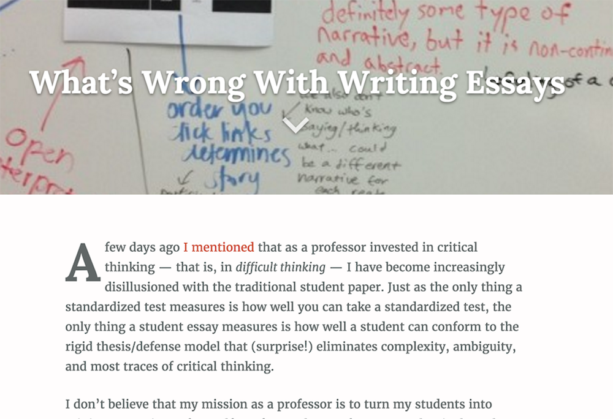
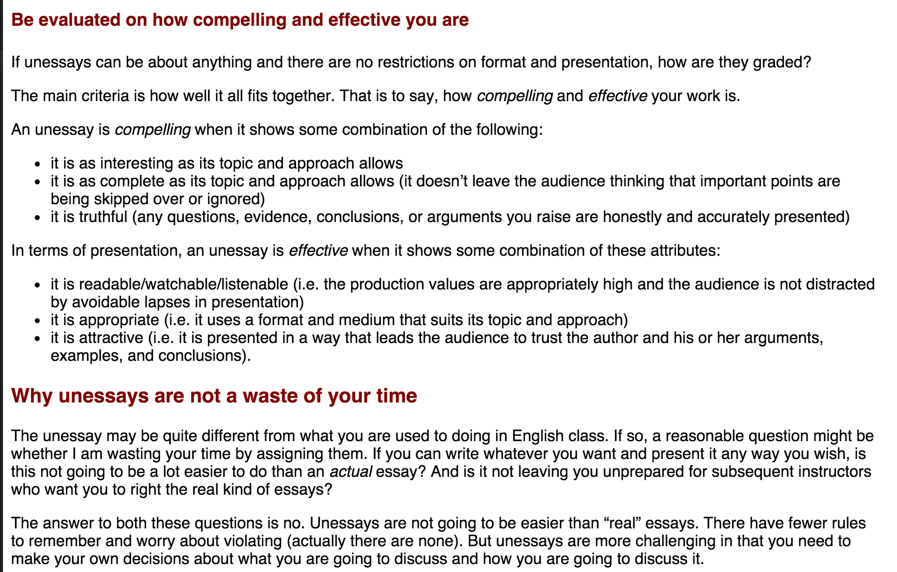
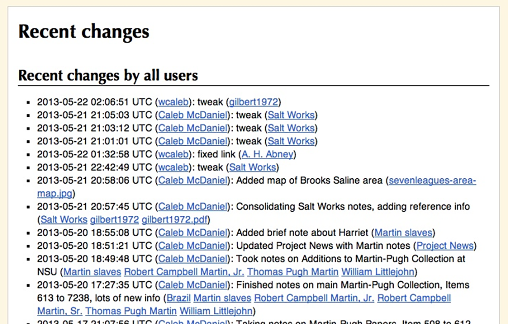
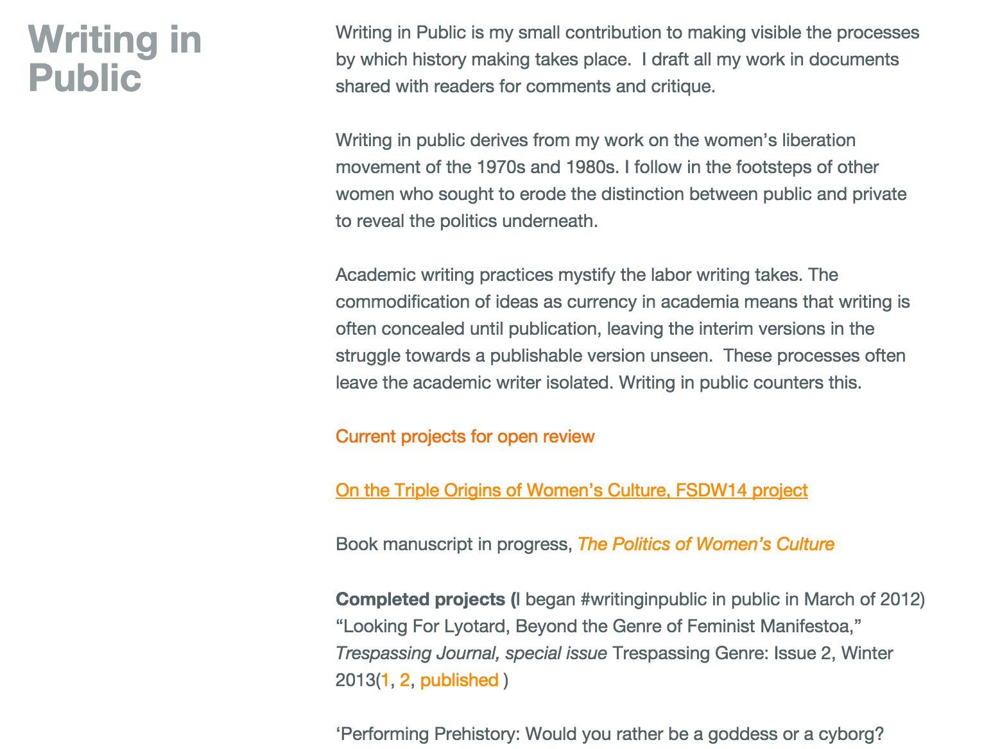
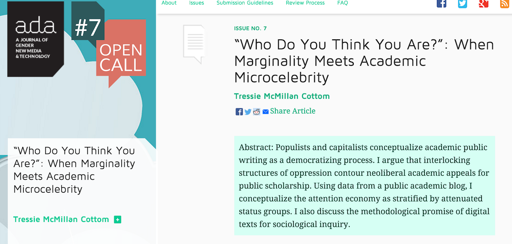
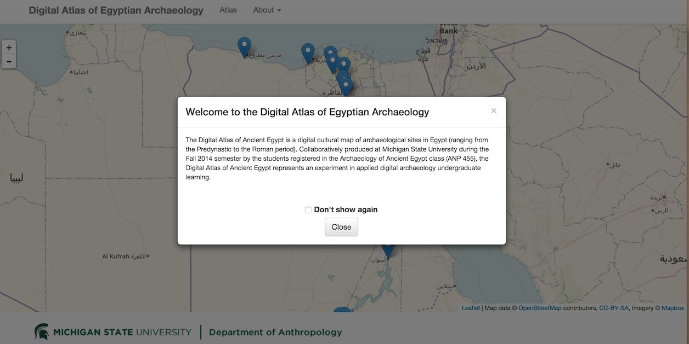
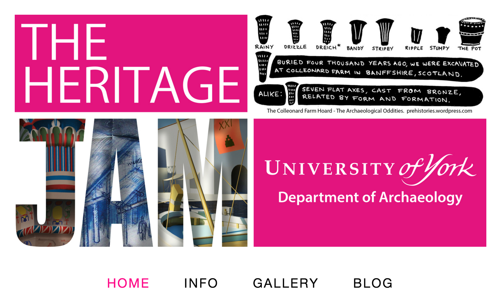
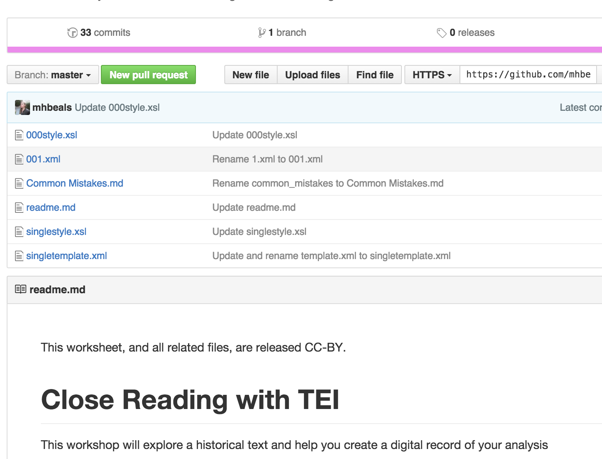
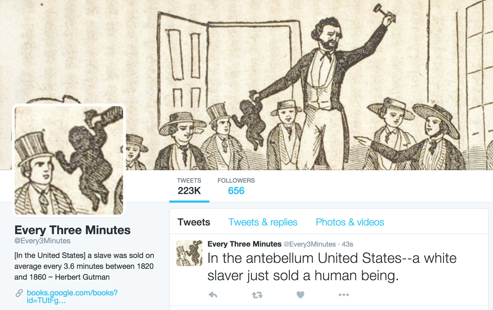
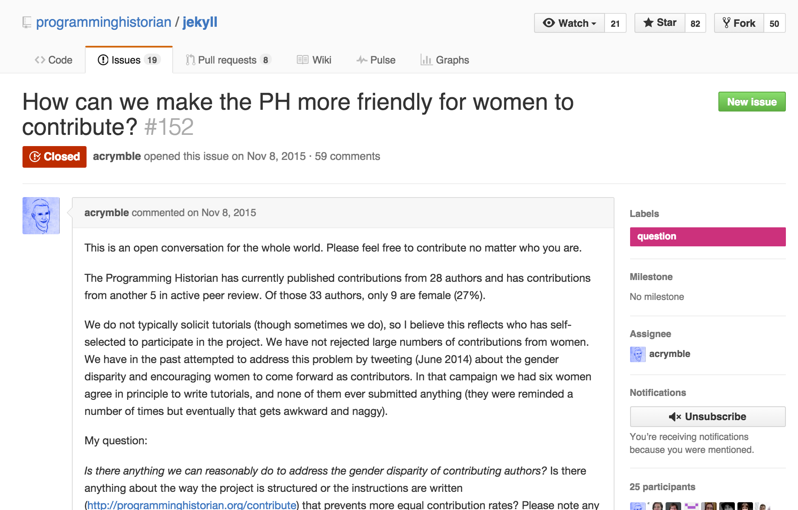

--- 
title: Digital Pedagogy in the Humanities
subtitle: Concepts, Models, and Experiments 
chapter: History
URL: keywords/history.md
author: 
- family: Graham
  given: Shawn
editor: 
- family: Davis
  given: Rebecca Frost
publisher: Modern Language Association
type: book
---

# HISTORY (Draft)

## SHAWN GRAHAM
Carleton University, Ottawa | http://electricarchaeology.ca

---

##### Publication Status:
* **unreviewed draft**
* draft version undergoing editorial review
* draft version undergoing peer-to-peer review
* published

---

## CURATORIAL STATEMENT

The essay looms large in the minds of our students as the thing above all else that historians _do_. "How many pages? How many words? How many sources?" They know the game. If it isn't an essay, students balk, students resist. With good reason: the status quo signifier for historical seriousness, for scholarship, is indeed the essay (and its longer cousin, the monograph) (cf Blevins and Mullen 2015, p39). Digital work that transgresses this 'compulsory figure' (O'Donnell, 2012) is only slowly being recognized (Gibbs 2016; Robertson 2016; but see also the posts by Sheila Brennan listed below on reviews of digital work in academic scholarship). Since how we practice our scholarship informs our teaching, this transgression is what marks the difference between a digital pedagogy and mere online learning.  Online education is about the compulsory figures of academia, of recreating a controllable, observable classroom through a system that watches and monitors everything.  Essays are easy to track, easy to turn-it-in. Compulsory figures lend themselves well to instrumentalization. If we think of being a student as a kind of game with a clear end goal in mind (credentialism), then complete the compulsory figures to win.

Digital pedagogy by its transgressive nature cannot easily fit inside the systems that manage our learning. A digital pedagogy (however instantiated) pushes beyond compulsory figures and breaks the game, whilst online learning merely reinforces them. Students will understandably resist. But we must make the case, otherwise we risk undermining the very project of the university.

Here, I have selected artifacts that plot a way forward for expanding the realm of the possible, for showing how an expanded universe of historical writing can be folded into one's digital pedagogy in a way that transgresses the replicated-classroom model of online education.  My vision of what history means as a keyword in digital pedagogy is to remember what the _spirit_ of the essay ( _essayer_, to try) entails. It was a public exercise, a kind of dialogue. To write an essay was to sketch out an experience, an argument, a world where things might be different than they are here: that is, a simulation. Simulations and games, playful experiences, in public: digital pedagogy in history expands and reinvents the essay in a form fitting for the age. Indeed, this vision is very public facing and helps to turn our teaching inside-out; the teaching of history becomes a kind of public history in this model.

The artifacts collected below represent key moments/movements/examples that lay a pathway for us to employ this vision of a digital pedagogy of history, whether that teaching takes place in a classroom or in public, online or off. Many universities have a course called the Historian's craft or something similar on the catalogue: so let us stop writing and start crafting. A digital pedagogy is a pedagogy of making, a pedagogy of playing to see what happens next, whether the resulting object is digital or analogue. Digital; digits; fingers; play.

The artifacts are arranged in an order that should facilitate the integration of digital pedagogies into one's teaching and research.

## CURATED ARTIFACTS

## What's Wrong with Writing Essays?

+ Artifact Type: description of an assignment that imagines 'writing' to be more akin to 'making'
+ Source URL:http://www.samplereality.com/2009/03/12/whats-wrong-with-writing-essays/
+ Artifact Permissions: no license appears.
Copy of the Artifact (in HTML, PDF, DOCX, TXT, MD, RTF, MP3, MP4, MOV, PNG, or JPG), if possible
+ Creator and Affiliation: Mark Sample, Davidson College

This piece crystalizes the issue around essays: we are too much concerned with 'form' and forgetting about 'content'. Sample points out that 'text' derives from the Latin 'to weave', and uses that metaphor to suggest expanding the range of possibilities. Accordingly, Sample offers an example of an assignment designed to 'take the words out of writing', a prompt to create an 'abstract mapping' of a videogame's underlying complexity and representation of the world. A similar prompt could be devised for domains beyond the representation of history in videogames, for instance, the organization of an archival fonds.

## The Unessay

+ Artifact Type: assignment prompt
+ Source Url: http://people.uleth.ca/~daniel.odonnell/Teaching/the-unessay
+ Artefact Permissions: CC BY-NC-SA 3.0
+ Creator and Affiliation: Daniel Paul O'Donnell, University of Lethbridge

This piece similarly documents problems with 'essays' as they have come to be in the modern undergraduate classroom. What's more, it provides a framework for re-situating them as digital pedagogy, returning agency to the student, and an entirely useful set of criteria for assessing work that does not look like traditional forms. The criteria provided can be transformed into a rubric with two criteria, that the work is 'compelling' and 'effective'.

## Open Notebook History

+ Artifact Type: blog reflection
+ Source Url: http://wcm1.web.rice.edu/open-notebook-history.html
+ Artefact Permissions: CC BY-SA 3.0
+ Creator and Affiliation: W. Caleb McDaniel, Rice University

McDaniel opens a dialogue with proponents of so-called 'open notebook science', and situates it within practices familiar to historians (a process similar to what Chad Black has called, ['Hacking the Papers of You'](https://parezcoydigo.wordpress.com/2010/05/28/the-individual-research-archive-hacking-the-papers-of-you/)). McDaniel argues that we cannot know the full value of what we have until we allow others to see it; if we did so, while the work was in progress, "we also open new avenues of interpretation, uncover new linkages between things we would otherwise have persisted in seeing as unconnected, and create new opportunities for collaboration with fellow travelers." He outlines the use of Gitit, a personal wiki program combined with Git versioning control, for maintaining such a notebook. Gitit has a steep learning curve; others might want to use a combination of text editor and github repository to achieve the same effect.

## Writing in Public

+ Artifact Type: web page
+ Source Url: http://michellemoravec.com/michelle-moravec/
+ Artefact Permissions: no license provided
+ Creator and Affiliation: Michelle Moravec, Rosemont College

This page is a landing page for Moravec's writing projects; her goal in writing in public is to demystify the processes of academic labour. She situates this goal within her research on women's liberation movements, as part of a tradition of work that breaks down the boundaries between public and private 'to reveal the politics underneath'. Moravec provides links to projects in progress, and projects completed. She uses a combination of google docs, twitter hashtags, and curated shortlinks to keep track of her readers' engagement with her work.

## Who do you think you are?

+ Artefact Type: journal article
+ Source Url: http://adanewmedia.org/2015/04/issue7-mcmillancottom/
+ Artefact Permissions: CC BY-SA 4.0
+ Creator and Affiliation: Tressie McMillan Cottom, Virginia Commonwealth University

It can be dangerous when we break down the walls of our teaching and research, and expose these processes to the wider world. In "Who do you think you are?", Tressie McMillan Cottom analyzes the sociology of the performative attention economy of online work. She exposes the ways that if you don't look like a white man online, what can or cannot be done in terms of a public-facing digital work becomes much more complicated and  dangerous. The piece serves as a counterbalance to the artefacts discussed above.

## Digital Atlas of Egyptian Archaeology (DAEA)

+ Artefact Type: class project
+ Source Url: https://matrix-msu.github.io/daea/ (Source code at [https://github.com/matrix-msu/daea-fs14](https://github.com/matrix-msu/daea))
+ Artefact Permissions: GNU General Public License
+ Creator and Affiliation: Students in the Fall 2014 semester in the Archaeology of 

Ancient Egypt class (ANP 455) at Michigan State University, led by Ethan Watrall and supported by Brian Geyer.
The DAEA as a work of collaborative scholarship exemplifies many of the ideas that the previous artefacts point towards. Moreover, the act of putting the source code online allows this student scholarship to be leveraged by other students, expanded, and transmogrified. Christina Ross forked this and repurposed it to become a microhistory of St. John's, Newfoundland http://xtina-r.github.io/daea/, which was then repurposed and extended by Rob Blades (in progress: http://pembrokesoundscapes.ca). Ross's version is on the syllabus in Jeffery McClurken's 'Adventures in Digital History'. http://courses.mcclurken.org/adh/syllabus/). The DAEA shows ways that student work can have impact beyond the classroom.

## The HeritageJam

+ Artefact Type: website
+ Source Url: http://heritagejam.org
+ Artefact Permissions:
+ Creator and Affiliation: Andrew Masinton, Sarah Perry, Tara Copplestone, Izzy Bartley. University of York.

Having just gone through its second iteration, the Heritage Jam is an annual two-day event, where participants collaborate to make something along a particular theme, from a particular collection, with a decidedly public-facing inflection. It brings together participants both live (in a kind of camp-out) and online. Aside from the wonderful things participants make, the Jam rules require them to document the _paradata_ that supports the work. The paradata document draws on a long history in archaeological research of visualizations and making (there is an entire subfield, 'experimental archaeology', which has strong affinities to digital humanities pedagogy and deformance) as codified in the 2009 London Charter of Heritage Visualization (http://www.londoncharter.org/) . Paradata "provide the space through which we communicate ambiguity and transparency, and account for our practices". In this way, the viewers learn how to think critically about the construction of the past.

## TEI Close Reading Exercise

+ Artefact Type: exercise
+ Source Url: https://github.com/mhbeals/TEI-Close-Reading
+ Artefact Permissions: CC-BY
+ Creator and Affiliation: Melodee Beals, Loughborough University

While marking up text and annotation has long been a staple of digital humanities work, Beal's exercise does the necessary heavy lifting to make it clear how one could teach TEI, and the pedagogical value of a digitally informed close reading. This exercise demonstrates how exposing our research and teaching to the world (in this case, via a repository on Github) builds teaching capacity for the rest of us.

## Every Three Minutes

+ Artefact Type: twitter robot
+ Source Url: https://twitter.com/every3minutes, associated post detailing why 3 minutes, and the source research at http://wcm1.web.rice.edu/slave-sales-on-twitter.html
+ Artefact Permissions:
+ Creator and Affiliation: W. Caleb McDaniel, Rice University

Our teaching and research, when freed from the confines of an essay, can literally have a kind of algorithmic agency (what Mark Sample calls a ['bot of conviction']( https://medium.com/@samplereality/a-protest-bot-is-a-bot-so-specific-you-cant-mistake-it-for-bullshit-90fe10b7fbaa#.k7zhd3p6e)). Such a creature directly confronts the public with the past. Originally devised as a backdrop to a classroom lecture, the affordances of the online medium, of twitter-as-platform-for-building, are used to devastating effect in the regular monotony of an update, every three minutes. Zach Whalen has an excellent tutorial on how to make simple twitter bots at [http://www.zachwhalen.net/posts/how-to-make-a-twitter-bot-with-google-spreadsheets-version-04/](http://www.zachwhalen.net/posts/how-to-make-a-twitter-bot-with-google-spreadsheets-version-04/)

## The Programming Historian, issue #152

+ Artefact Type: issues thread
+ Source Url:https://github.com/programminghistorian/jekyll/issues/152)
+ Artefact Permissions: presumably CC-BY
+ Creator and Affiliation: Adam Crymble, Miriam Posner, et al.

[The Programming Historian team](http://programminghistorian.org) has long sought to make the processes of publication, peer review, of digital work in History, transparent and accountable. This thread in particular, with its thoughtful and wide-ranging discussion, which does not shy away from some hard truths shows a community of practice around digital pedagogy and capacity building wrestling with an issue in a way that is collegial, humble, and open. At the end of the thread, the discussion will continue with a workshop <https://digitalhistorymentorship.wordpress.com/>.

Digital pedagogy in history changes not just how we teach, but how we _do_, history - how we work on our own, with colleagues, with students, and with the public. All of these pieces are essays in the sense of _essayer_ to try, to experiment, to change the world a little bit.

## RELATED MATERIALS

Elliot, Devon, Robert MacDougall, and William Turkel. "New Old Things: Fabrication, Physical Computing, and Experiment in Historical Practice." _Canadian Journal of Communication 37.1_ (2012). Web. <http://www.cjc-online.ca/index.php/journal/article/view/2506>.

Kelly, Mills. _Teaching History in the Digital Age_. Ann Arbor, MI: U of Michigan Press, 2013. Web. <http://quod.lib.umich.edu/cgi/t/text/text-idx?cc=dh;c=dh;idno=12146032.0001.001;rgn=full text;view=toc;xc=1;g=dculture>.

Lutz, John, Ruth Sandwell, et. al. "We Need Your Help!" _Great Unsolved Mysteries in Canadian History._ Canadian Heritage / University of Victoria, 1997. Web. 24 Feb. 2016. <http://canadianmysteries.ca/en/index.php>.

Nowviskie, Bethany. “Ludic Algorithms.” In _Pastplay: Teaching and Learning History with Technology_, edited by Kevin Kee, 139-71. Ann Arbor: University of Michigan Press, 2014. Web. <http://quod.lib.umich.edu/d/dh/12544152.0001.001/1:5/--pastplay-teaching-and-learning-history-with-technology?g=dculture;rgn=div1;view=fulltext;xc=1#5.3>

Terras, Melissa. "A Virtual Tomb for Kelvingrove: Virtual Reality, Archaeology and Education." _Internet Archaeology_ 7. Department of Archaeology, York University, 1 Dec. 1999. Web. 24 Feb. 2016. <http://intarch.ac.uk/journal/issue7/terras/>.

## WORKS CITED

### Criteria

Blevins, Cameron, and Lincoln Mullins. "Jane, John ... Leslie? A Historical Method for Algorithmic Gender Prediction." _DHQ: Digital Humanities Quarterly_ 9.3 (2015). <http://www.digitalhumanities.org/dhq/vol/9/3/000223/000223.html>

Brennan, Sheila (@sherah1918). "RE: lack of regular professional review of digital history projects, since 2001, Journal of Am History has reviwed ~275 web projects." February 18, 2016, 10:56 am <https://twitter.com/sherah1918/status/700363335078903809>

Brennan, Sheila (@sherah1918). "Additional 100s were done for History Matters, starting in '99, http://historymatters.gmu.edu/browse/wwwhistory/" February 18, 2016, 11:01 am. <https://twitter.com/sherah1918/status/700364507747590144>

Brennan, Sheila (@sherah1918). "The Public History Resource Center started in 2000, and published digital project reviews for a few years: http://www.publichistory.org/reviews/ " February 18, 2016, 11.03 am. <https://twitter.com/sherah1918/status/700365148251410437>

Brennan, Sheila (@sherah1918). "Also digital history reviews have appeared in Common-Place, The Public Historian. W&M Quarterly started in '99 http://oieahc.wm.edu/wmq/openwmq_digital.cfm" February 18, 2016, 11:08 am. <https://twitter.com/sherah1918/status/700366222832041984>

Sample, Mark. "What's Wrong With Writing Essays?" Weblog post. _Sample Reality_. N.p., 12 Mar. 2009. Web. <http://www.samplereality.com/2009/03/12/whats-wrong-with-writing-essays/>.

Gibbs, Frederick W. "New Forms of History: Critiquing Data and Its Representations." _The American Historian._ Organization of American Historians, Issue 7, Feb. 2016. Web. 24 Feb. 2016. <http://tah.oah.org/february-2016/new-forms-of-history-critiquing-data-and-its-representations/>.

O'Donnell, Daniel Paul. "The Unessay." Weblog post. _Daniel Paul O'Donnell_. 4 Sept. 2012. Web. 24 Feb. 2016. <http://people.uleth.ca/~daniel.odonnell/Teaching/the-unessay>.

Robertson, Stephen. "Reviewing Digital History: An Exchange on Digital Harlem in the American Historical Review." Web log post. _Dr Stephen Robertson_. N.p., 11 Feb. 2016. Web. 24 Feb. 2016. <http://drstephenrobertson.com/article/reviewing-digital-history-digital-harlem-in-the-american-historical-review/>

### Artefacts

ANP 455. "Digital Atlas of Egyptian Archaeology." Digital Atlas of Egyptian Archaeology. _MATRIX_, Michigan State University, Fall 2014. Web. 24 Feb. 2016. <https://matrix-msu.github.io/daea/>

Beals, Melodee. "TEI Close Reading." _GitHub.com/mhbeals_. 30 Dec. 2014. Web. 24 Feb. 2016. <https://github.com/mhbeals/TEI-Close-Reading>.

Cottom, Tressie McMillan. ""Who Do You Think You Are?": When Marginality Meets Academic Microcelebrity." _Ada: A Journal of Gender, New Media, & Technology_ 7 (2015). Web. <http://adanewmedia.org/2015/04/issue7-mcmillancottom/>.

Crymble, Adam, Miriam Posner, et. al. "How Can We Make the PH More Friendly for Women to Contribute? · Issue #152" _GitHub.com/programminghistorian_. 8 Nov. 2015. Web. 24 Feb. 2016. <https://github.com/programminghistorian/jekyll/issues/152>

Masinton, Anthony, Sarah Perry, Tara Copplestone, and Izzy Bartley. "The Heritage Jam." _The Heritage Jam_. Department of Archaeology, York University, 2014. Web. 24 Feb. 2016. <http://www.heritagejam.org/>.

McDaniel, W. Caleb. "@Every3Minutes." _Twitter_, 15 Nov. 2014. Web. 24 Feb. 2016. <https://twitter.com/every3minutes>.

McDaniel, W. Caleb. "Open Notebook History." Weblog post. _W. Caleb McDaniel_. 22 May 2013. Web. 24 Feb. 2016. <http://wcm1.web.rice.edu/open-notebook-history.html>

Moravec, Michelle. "Writing in Public." _Michelle Moravec_. 11 Jan. 2013. Web. 24 Feb. 2016. <http://michellemoravec.com/michelle-moravec/>.

O'Donnell, Daniel Paul. "The Unessay." Weblog post. _Daniel Paul O'Donnell_. 4 Sept. 2012. Web. 24 Feb. 2016. <http://people.uleth.ca/~daniel.odonnell/Teaching/the-unessay>

Sample, Mark. "What's Wrong With Writing Essays?" Weblog post. _Sample Reality_. N.p., 12 Mar. 2009. Web. <http://www.samplereality.com/2009/03/12/whats-wrong-with-writing-essays/>.
