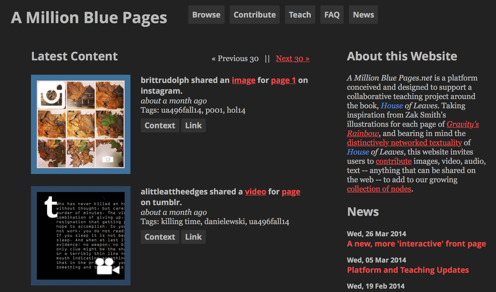
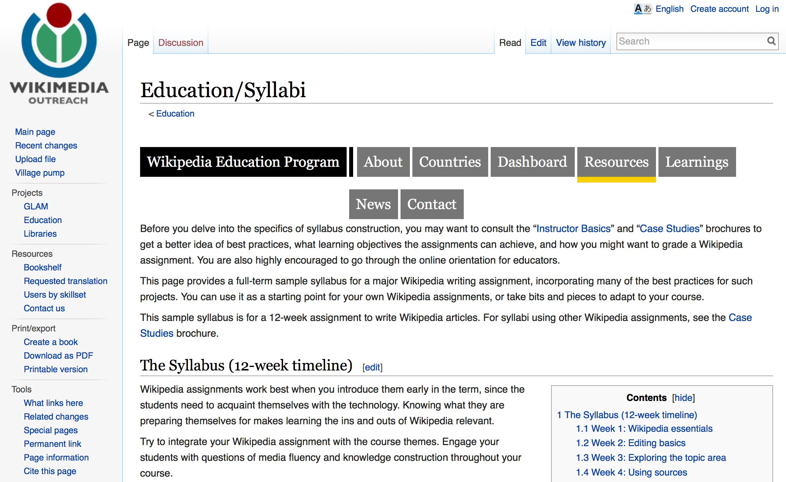
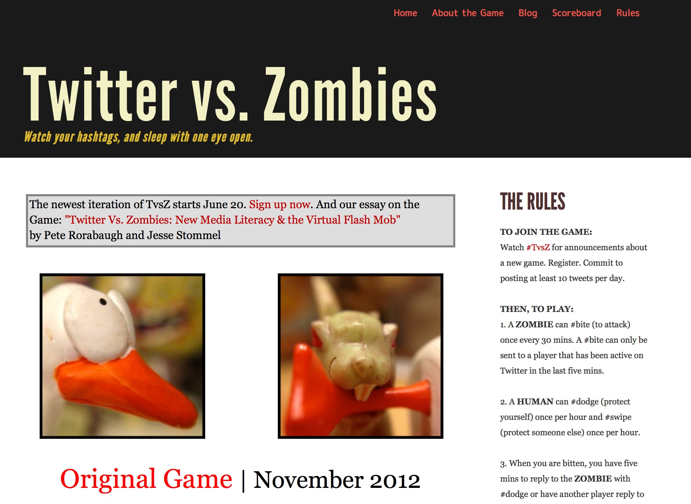
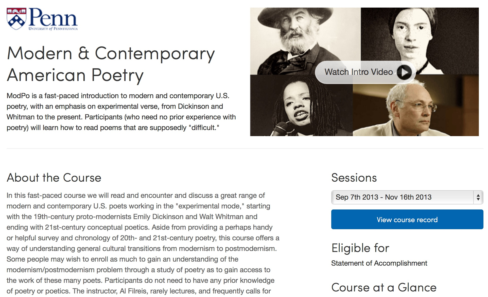
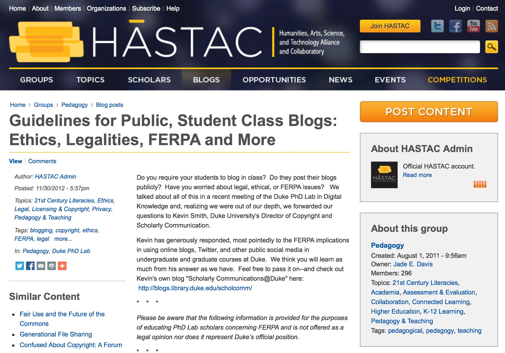

# HYBRID (Draft)

### [Jesse Stommel](http://www.jessestommel.com)
Assistant Professor, University of Wisconsin-Madison

---

##### Publication Status:
* unreviewed draft
* draft version undergoing editorial review
* **draft version undergoing peer-to-peer review** https://digitalpedagogy.commons.mla.org/
* published 

--- 

## CURATORIAL STATEMENT

There is an important way in which our roles as teachers and learners are bound up in who we are as humans (including our life experience, cultural background, race, gender, and sexuality). In *Hybridity*, Marwan M. Kraidy writes, “hybridity has proven a useful concept to describe multipurpose electronic gadgets, designer agricultural seeds, environment-friendly cars with dual combustion and electrical engines, companies that blend American and Japanese management practices, multiracial people, dual citizens, and postcolonial cultures” (1). For Kraidy, and for me, the term is powerful exactly because it resists easy signification.

In a broad sense, my own scholarly work is about the (sometimes wondrous, sometimes horrifying) relationship between bodies and technology. I’ve taught in various disciplines since 1999, including literature, rhetoric and composition, education, film, and new media. Thinking about how we occupy physical and increasingly digital spaces has been the thread that connects my work across these disciplines. In 2011, I founded [*Hybrid Pedagogy*](http://www.hybridpedagogy.com): a digital journal of learning, teaching, and technology. My hypothesis is that all learning is necessarily hybrid. In classroom-based pedagogy, it is important to engage the digital selves of students. And, in online learning environments, it is equally important to engage students' physical selves. With digital pedagogy and online education, our challenge is not to merely replace (or offer substitutes for) face-to-face instruction, but to find new and innovative ways to engage students in the practice of learning.

At a philosophical level, my own thinking about hybridity is influenced, in part, by the heated discussion of hybridity among postcolonial theorists. In “The Commitment to Theory,” from *The Location of Culture*, Homi Bhabha describes “the space of hybridity” as “the construction of a political object that is new, neither the one nor the other.” In [“A Cyborg Manifesto,”](http://www.egs.edu/faculty/donna-haraway/articles/donna-haraway-a-cyborg-manifesto/) Donna Haraway makes an explicit connection between postcolonial theory and what she describes as the colonizing work of machines: “By the late twentieth century, our time, a mythic time, we are all chimeras, theorized and fabricated hybrids of machine and organism, in short, we are cyborgs.”

At its most basic level, the term “hybrid,” as I’m using it here, refers to learning that happens both in a classroom (or other physical space) and online. In this respect, hybrid does overlap with another concept that is often used synonymously: "blended." I would make a careful distinction between these two terms. Blended learning describes a process or practice; hybrid pedagogy is a methodological approach that helps define a series of varied processes and practices. (Blended learning is tactical, whereas hybrid pedagogy is strategic.) When people talk about “blended learning,” they are usually referring to the place where learning happens, a combination of the classroom and online. The word “hybrid” has deeper resonances, suggesting not just that the place of learning is changed but that a hybrid pedagogy fundamentally rethinks our conception of place. So, hybrid pedagogy does not just describe an easy mixing of on-ground and online learning, but is about bringing the sorts of learning that happen in a physical place and the sorts of learning that happen in a virtual place into a more engaged and dynamic conversation.

This kind of learning is intensely social. It also turns on their head the traditional roles of student and teacher. In [“Rhizomatic Education: Community as Curriculum,”](http://davecormier.com/edblog/2008/06/03/rhizomatic-education-community-as-curriculum/) Dave Cormier argues that “curriculum is not driven by predefined inputs from experts; it is constructed and negotiated in real time by the contributions of those engaged in the learning process.” The hybrid learning environment is synchronous and asynchronous, on-ground and online, localized and dispersed. And it isn’t this and then that, but all these things simultaneously. Simply put, in a hybrid learning environment, there is no *front of the classroom*.

The resources I’ve curated here support this ethic. Each recognizes the ways hybrid learning environments empower students as full collaborators in the enterprise of education. These resources offer examples of hybrid strategies that are about more than replacing seat time with digital activities. Rather, the examples show how digital tools can be used to extend the classroom beyond its own bounds: continuing discussion outside scheduled class time; connecting a classroom in one geographical place with communities elsewhere; creating genuine audiences for student work; and defending the right of students to be teachers. While I’ve included a couple examples from my own teaching, I do so not to champion my work but to champion the work of the students that ultimately owned these experiments. The best hybrid learning environments are built not as a convenience for teachers or institutions but in order to set a new kind of stage for students (both officially registered for a course but sometimes not) to improvise upon.

The keyword "hybrid" suggests a methodology for teachers to employ in constructing classes; however, I would  advocate strongly that teachers also think about "hybrid" as a topic for students to investigate. I frequently begin my classes by having us talk about what Rebekah Sheldon has called "the rhetoric of the room," the specific architecture of the space of learning we occupy. We learn better in environments when we think critically and at a meta-level about how the design of those environments influences the learning that happens within them. This is true of classrooms and libraries, but also learning management systems and social media platforms. So, each of the resources represented here is as much a tool for teachers as it is a potential text for students to use in beginning this investigation.

## CURATED ARTIFACTS

### "A Million Blue Pages"

* Source URL: <http://amillionbluepages.net/>
* Copy of Artifact: forthcoming
* Creator: Zach Whalen (University of Mary Washington)

*House of Leaves* has produced an extensive network of digital marginalia. In 2011, Zach Whalen, Erin Templeton, Paul Benzon, Mark Sample, and Brian Croxall taught the novel together and [coauthored a collaborative assignment](http://www.briancroxall.net/dh/assignments/sharing-and-re-networking-house-of-leaves/) that bridged work done at each of their institutions. The resource I’m including here is a 2014 follow-up, which also connected classes at multiple institutions. *A Million Blue Pages* is a multimedia annotation of *House of Leaves*. It serves as an example of students and teachers using digital tools to work together outside the constraints of geography and institutional affiliation. And the contributions to the site have continued well after the various courses ended. This is one of the key components of a well-designed hybrid assignment—its ability to engage a community beyond its own bounds—to create learning spaces without a clear end.

### "A 12-week Assignment to Write a Wikipedia Article"

* Source URL: <http://outreach.wikimedia.org/wiki/Education/Syllabi>
* Copy of Artifact: forthcoming
* Creator: Wikimedia Foundation

This assignment offers a guide to having students contribute to Wikipedia. Orienting students to the back-end of Wikipedia helps them think critically about networked communities and knowledge construction on the Web. In Fall 2014, Adeline Koh incorporated this activity into her hybrid [Feminist Theory Seminar](http://www.adelinekoh.org/blog/2014/08/20/syllabus-draft-gis-3614-seminar-in-feminist-theory-fall-2014/) as a major project aimed at improving “conceptual skills, critical thinking, and oral and written communication.” She contextualized the assignment within a discussion of how women are represented within the Encyclopedia, and how this representation is driven (or exactly not driven) by the dearth of female contributors. Asking students to write and rewrite Wikipedia encourages them to engage directly in public scholarship. Even if their revisions don’t *stick*, this work invites a critical discussion of agency that moves well beyond the too often closed space of a physical classroom.

### "Twitter vs. Zombies"

* Source URL: <http://twittervszombies.com/>
* Copy of Artifact: forthcoming
* Creators: Pete Rorabaugh (Southern Polytechnic State University) and Jesse Stommel (University of Wisconsin-Madison)

“Twitter vs. Zombies” is a game that aims at building networked communities, introducing new users to Twitter, and developing new media literacies. The initial rules were incredibly simple, a catalyst for play and improvisation. The outcomes were emergent with participants reflecting upon their learning in process on blogs, Storify, Twitter, and elsewhere. The game depends on a self-governing community and has been hacked in at least 5 subsequent versions. In February 2013, students in Pete Rorabaugh’s GSU class and Janine DeBaise’s SUNY class developed and ran the second iteration. Since then, students and teachers as far as Cairo, Egypt have forked and remixed the game. While this experiment happened on Twitter, my interest is ultimately less in advocating for a specific platform and more in how a hybrid teaching strategy asks us to think critically about the tools we use and how they can connect students to each other via the web.

### "Occupy Class"

* Source URL: <http://occupyclass.org/>
* Copy of Artifact: forthcoming
* Creator: Pete Rorabaugh (Southern Polytechnic State University)

“Occupy Class” is a site designed by the students in Pete Rorabaugh’s Spring 2012 course in Electronic Writing and Publishing at Georgia State University. According to Rorabaugh’s [description of the class](http://mediacommons.futureofthebook.org/imr/2013/03/07/building-context-occupy-class-and-media-res), the goal was to “document the unfolding narrative of Occupy.” Pedagogy is not ideologically neutral, and a hybrid teaching strategy can’t be about merely moving students from a closed physical space (the classroom) to a closed digital one (the learning management system). The work illustrated here is deeply connected to Critical Pedagogy, which aims at helping learners understand how they are situated—actively, politically, and with agency—inside much larger local and global communities. This is about not only having students do work for an authentic audience, but also having teachers and learners alike show up as full (and ethical) participants in those communities.

### "Note Tweeting"

* Source URL: <http://chuckrybak.com/tweeting-class-discussions-and-notes>
* Copy of Artifact: forthcoming
* Creator: Chuck Rybak (University of Wisconsin-Green Bay)

Chuck Rybak offers an excellent example of how students can use a tool like Twitter to extend an otherwise face-to-face discussion. Rybak uses social media in his courses to build a literal and figurative *open-door* classroom. Students turn “oral discussions into usable texts,” a set of dialogic (as opposed to monologic) notes for a discussion, both for students to review and as a way of allowing outsiders to eavesdrop. Students [Storify](http://www.hybridpedagogy.com/journal/how-to-storify-why-to-storify/) their tweets, which makes a more permanent curated collection of tweets than their experience of the discussion. The students move through several recursive layers: ideas in their brains, discussion in a physical room, tweets that act as a sort of Greek chorus, a Storify that curates those thoughts further, and feedback to the Storify, which can be used to prompt future face-to-face discussions.

### "A Public Literary Twitter Role-Play"

* Source URL: <http://shelleysfrankenstein.wordpress.com/frankenstein-a-public-literary-twitter-role-play-on-twitter/>
* Copy of Artifact: forthcoming
* Creator: Petra Dierkes-Thrun (Stanford University)

Petra Dierkes-Thrun has run several iterations of the Public Literary Twitter Role-play, having students re-enact and inhabit texts like *The Portrait of Dorian Gray*, *Lolita*, and *Frankenstein*. Each experiment has had a different prompt used to engage students in her physical class and also virtual participants around the world. Her [larger goals](http://www.fhi.duke.edu/events/petra-dierkes-thrun-lecture) focus on “close-reading, critical thinking, and critical writing,” allowing students to comment on the text and also put their readings to use, drawing non-scholars into animated language-play and literary discussion. Dierkes-Thrun does not “make” students participate openly online but “invites” them to. When asking students to work on the open Web, it’s important to give thought to student privacy, data, and FERPA, but what is most important is that students be given space to make informed choices about how they will occupy the Web.

### "Social Media Design and Build"

* Source URL: <http://kathiiberens.com/teaching/sample-syllabi/design-build/>
* Copy of Artifact: forthcoming
* Creator: Kathi Inman Berens (USC Annenberg)

In her hybrid USC Annenberg course, Kathi Inman Berens works with students face-to-face, but also using synchronous video platforms. The course focuses on how we engage one another via digital media, and the students work in teams on projects for real-world clients. From the syllabus: “I expect you to be on your laptops and smartphones during class. Connectivity is essential to our work.” She asks students to keep a “Distraction Log” to “make observations about their own media consumption habits.” The course spans media, geography, and traditional/non-traditional learning environments. Helping students understand how to move within and between these spaces is a key literacy for working in digital space. [She writes of her teaching philosophy,](http://kathiiberens.com/teaching/philosophy/) "It doesn’t matter to me if my classroom is a little rectangle in a building or a little rectangle above my keyboard. Doors are rectangles; rectangles are portals. We walk through."

### "Spine Poetry"

* Source URL: <http://spinepoetry.com/>
* Copy of Artifact: forthcoming
* Creator: Kathi Inman Berens (USC Annenberg), Lans Pacifico, Carrie Padian, Ken Schultz, Jesse Stommel (University of Wisconsin-Madison), Jessica Zisa

A hybrid learning environment deconstructs hierarchies, giving students a fuller sense of their own agency. In winter 2013, I co-taught with Kathi Inman Berens a small seminar with four non-traditional undergraduate students. Together, the students worked with the Library of Congress in Washington D.C. to build a social media campaign promoting the LOC's first exhibit of electronic literature. The students also coordinated a physical event at the Lake Oswego Library outside Portland, OR. Their goal was to bring the Library of Congress to Portland and the Web—and to bring Portland and the Web to the Library of Congress, using digital technology to connect physical work happening at two remote locations. From the [artist statement](http://spinepoetry.com/about): “Spine poems bridge the physical world of books with stories that are born digitally.” The project was the course, designed and developed by the students from the start with the teachers participating as co-learners.

### "Modern and Contemporary American Poetry"

* Source URL: <https://www.coursera.org/course/modernpoetry>
* Copy of Artifact: forthcoming
* Creator: Al Filreis (University of Pennsylvania)

A truly "Hybrid" Massive Open Online Course that Al Filreis began offering in 2012. The course experiments with the MOOC format and hacks the Coursera platform to create opportunities for students to have a central role in both their own learning but also in the teaching of the course. Instead of focusing on video lectures at the head of each unit, Filreis hosts live discussions at the Kelly Writers House that feature himself, University of Pennsylvania students, as well as students from around the world that call in (and sometimes make visits to PA). The physical place of the Kelly Writers house becomes the fulcrum around which the online course pivots. The success of the course has less to do with inherent potentials of the MOOC platform and more to do with the way Filreis uses the platform to realize the mission and pedagogies of the Kelly Writers House.

### "Guidelines for Public, Student Class Blogs: Ethics, Legalities, FERPA and More"

* Source URL: <http://www.hastac.org/blogs/cathy-davidson/2012/11/30/guidelines-public-student-class-blogs-ethics-legalities-ferpa-and-mo>
* Copy of Artifact: forthcoming
* Creator: Kevin Smith (Duke University)

I’ve said elsewhere that [Ferpa is not an excuse for bad pedagogy](https://twitter.com/Jessifer/status/441755367924436992). In this set of guidelines, Kevin Smith, Duke University’s Director of Copyright and Scholarly Communication, offers information (not a legal opinion, as noted) on the ethics and legalities of having students doing public work. Specifically, he tackles various methods for addressing FERPA concerns when having students working on public blogs. In short, inform students of the requirement from the start, offer the option of anonymity, remind them not to post private information, and offer alternatives if a student has major concerns about doing public work even under an alias. FERPA is in place to protect students, not to put artificial limits on their learning. As with any pedagogical decision, I suggest our first concern be on protecting student agency—learners not teachers should make the critical choices about what, when, how, and where they learn.

## RELATED MATERIALS

Bali, Maha. [*REFLECTING ALLOWED: Maha Bali's blog about education.*](http://blog.mahabali.me/blog/)

Friend, Chris. ["On Vocabulary: 'Blended Learning' vs. 'Hybrid Pedagogy.'"](chrisfriend.us/Blog/files/blended-vs-hybrid.php) chrisfriend.us/Blog/files/blended-vs-hybrid.php

Davidson, Cathy N. ["10 Things I've Learned (so far) From Making a Meta-MOOC"](http://www.hybridpedagogy.com/journal/10-things-learned-from-making-a-meta-mooc/) www.hybridpedagogy.com/journal/10-things-learned-from-making-a-meta-mooc/

Morris, Sean Michael and Jesse Stommel. ["The Discussion Forum is Dead; Long Live the Discussion Forum."](www.hybridpedagogy.com/journal/the-discussion-forum-is-dead-long-live-the-discussion-forum/) www.hybridpedagogy.com/journal/the-discussion-forum-is-dead-long-live-the-discussion-forum/

Rheingold, Howard. [*Net Smart*](rheingold.com/books/net-smart/) rheingold.com/books/net-smart/

## WORKS CITED

Bali, Maha. *REFLECTING ALLOWED: Maha Bali's blog about education.* <http://blog.mahabali.me/blog/>

Bhabha, Homi. "The Commitment to Theory." *The Location of Culture*. Routledge: London, 2004.

Cormier, Dave. "Rhizomatic Education: Community as Curriculum." <http://davecormier.com/edblog/2008/06/03/rhizomatic-education-community-as-curriculum/>

Dierkes-Thrun, Petra. "A Public Literary Twitter Role-play." <http://shelleysfrankenstein.wordpress.com/frankenstein-a-public-literary-twitter-role-play-on-twitter/>

Friend, Chris. "On Vocabulary: 'Blended Learning' vs. 'Hybrid Pedagogy.'" <http://chrisfriend.us/Blog/files/blended-vs-hybrid.php>

Haraway, Donna. "A Cyborg Manifesto." <http://www.egs.edu/faculty/donna-haraway/articles/donna-haraway-a-cyborg-manifesto/>

Inman Berens, Kathi. "The New Learning is Ancient." <http://kathiiberens.com/teaching/philosophy/>

Inman Berens, Kathi. "Social Media Design and Build." <http://kathiiberens.com/teaching/sample-syllabi/design-build/>

Inman Berens, Kathi, Lans Pacifico, Carrie Padian, Ken Schultz, Jesse Stommel, and Jessica Zisa. "Spine Poetry." <http://www.spinepoetry.com>

Koh, Adeline. "Seminar in Feminist Theory" <http://www.adelinekoh.org/blog/2014/08/20/syllabus-draft-gis-3614-seminar-in-feminist-theory-fall-2014/>

Kraidy, Marwan M. *Hybridity*.

Morris, Sean Michael and Jesse Stommel. "The Discussion Forum is Dead; Long Live the Discussion Forum." <http://www.hybridpedagogy.com/journal/the-discussion-forum-is-dead-long-live-the-discussion-forum/>

Rheingold, Howard. *Net Smart*.

Rio, Rick and Mark Sample. "Twitter Adoption Matrix." <http://chronicle.com/blogs/profhacker/a-framework-for-teaching-with-twitter/26223>

Rorabaugh, Pete. "Occupy Class." <http://occupyclass.org.>

Rorabaugh, Pete and Jesse Stommel. "Twitter vs. Zombies." <http://www.twittervszombies.com >

Rybak, Chuck. "Note Tweeting." <http://chuckrybak.com/tweeting-class-discussions-and-notes>

Smith, Kevin. "Guidelines for Public, Student Class Blogs: Ethics, Legalities, FERPA and More." *HASTAC*. <http://www.hastac.org/blogs/cathy-davidson/2012/11/30/guidelines-public-student-class-blogs-ethics-legalities-ferpa-and-mo>

University of Central Florida. "Blended Learning Toolkit." <http://blended.online.ucf.edu>

Whalen, Zach. "A Million Blue Pages." <http://amillionbluepages.net>

Wikimedia Foundation. "A 12-week assignment to write a Wikipedia article." <http://outreach.wikimedia.org/wiki/Education/Syllabi>

*Some language in the Curatorial Statement is drawn directly from:*

Stommel, Jesse. "Hybridity, pt. 2: What is Hybrid Pedagogy?" *Hybrid Pedagogy*. <http://www.hybridpedagogy.com/Journal/hybridity-pt-2-what-is-hybrid-pedagogy/>
