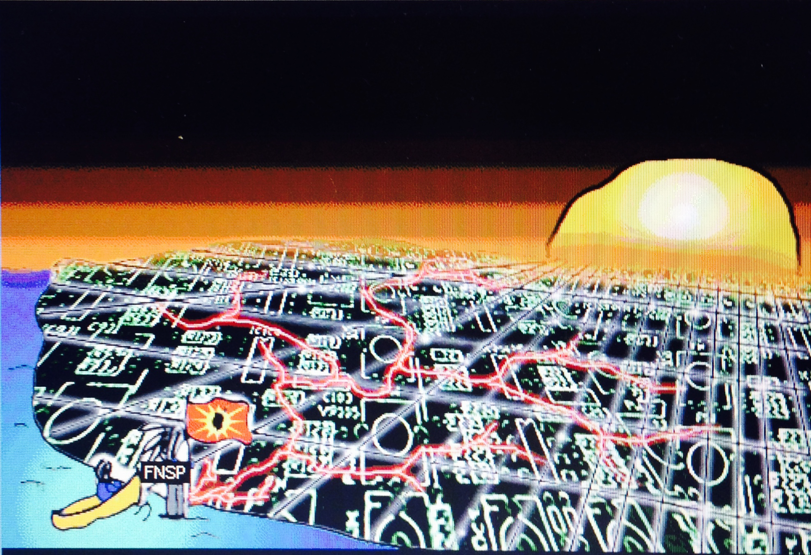

# Indigenous (Draft)

### David Gaertner 
University of British Columbia ([First Nations and Indigenous Studies Program](http://fnis.arts.ubc.ca))

### Karyn Recollet
University of Toronto ([Women and Gender Studies Institute](http://www.wgsi.utoronto.ca)) 

### with Elizabeth LaPensée
Michigan State University (Media & Information and Writing, Rhetoric, and American Cultures)

---

##### Publication Status:
* unreviewed draft
* **draft version undergoing editorial review**
* draft version undergoing peer-to-peer review 
* published

--- 

## CURATORIAL STATEMENT 

"Indigenous," in the context of digital studies, is understood in relation to Indigenous lands, bodies, and futures. Traditionally framed as a "landless territory," Western conceptions of cyberspace or the internet risk eliding the core principles of critical Indigenous studies, which are founded in place-based pedagogies. Evoking "Indigenous" in digital environments thus raises vital questions about our relationships to cosmologies and space and compels us to question if Indigenous lands and life can be repatriated through creative intimacies formulated as acts of cyber-justice.  

The pedagogical resources gathered here connect with "Indigenous" as an opportunity to:

* Conceive of new relationships to land and cyberspace through the digital,
* Envision new ways of conceptualizing land as multiscalar, 
* Reconceive extractivism in digital spaces,
* Explore and critique the unique intimacies and connections available through cyberspace, 
* Reorient cyberspace in relation to colonialism and Indigenous histories,
* Critique the colonial history of digital studies, and 
* Imagine and practice radical relationality.

In the classroom, Indigenous perspectives on digital studies promote critical understanding of and engagement with the colonial foundations of media analysis and the whiteness (McPherson) of the field through critical analysis and place-based learning. *Too often Indigenous peoples and knowledges are seen as mutually exclusive to modernity and technology.* Our pedagogy pushes for nuanced understanding of "traditional innovation" (Glaskin), the crossroads at which Indigenous pasts, presents, and futures meet and expand into new worlds. Dillon's notion of the slipstream provides such opportunities to embrace and activate future ancestors, and what is traditional in futurity: "Gestures of futurity are choreographies of possibilities and hope," new media and futurisms scholar, Karyn Recollet writes, "not residing so much in an unattainable dreamscape, but rather they are in constant figuration and reconfiguration all around us" (PAGE NUMBER). Our pedagogy also asks students to think critically about the ways in which cyberspaces have been conceived, theorized, and populated through metaphors of homesteading and frontiersmanship. It is our hope that these activations will illuminate how (un)settlement is a "reworlding" praxis. We can, of course, be Indigenous in cyberspace. But can cyberspace also be Indigenous? We argue, "Yes." 

Engagement with Indigenous new media technologies also encourages students to find spaces of safety, love, and breath within a digital environment that has traditionally been alienating and even hostile for Indigenous peoples, particularly Indigenous women and non-gender conforming peoples. We take seriously the possibility of radical decolonial love as proffered by Anishinaabe artist, activist, and scholar, Leanne Simpson, especially the glitching effects it can have in the colonial machinery of technology. The glitch provides spaces for rematriative sonic, visual, and embodied sovereignties and thus imagines, designs, and activates new futurisms that are anything but frontier spaces.    

We take our lead here from Anishinaabe scholar and video game designer, Elizabeth LaPensée, who has been at the front lines pushing back against the colonialism that pervades digital space.  In 2014 YouTube videos surfaced announcing a remake of the 1982 Atari game, *Custer's Revenge*, which allows players to engage as the perpetrator, performing brutal technologies of gender violence against Indigenous women's bodies. Accompanied by Chickasha Nation game journalist, Daniel Starkey, LaPensée spoke out publicly against the game and had the videos removed (Deerchild). LaPensée then created the singing game, *Honour Water*, a sonic and visual mapping of Anishinaabe languages, territories, and future imaginings. As well, in 2015, LaPensée released the arcade-style shooter, *Invaders*, addressing colonization and invasion through the medicine of laughter. Games such as *Honour Water* literally create space for Indigenous people to breathe in the colonized environments of new media, putting Anishinaabemowin words and songs into users' mouths and breaths and bringing code to bear on land and water. Spatially mapping bodies of water becomes a way to gesture toward futurities through Indigenous scales. This gesturing is also achieved through the aural kinaesthetic (Johnston, Imani Kai) strategies and embodied technologies of singing love songs to water.  

Videogames only represent one small segment of the digital, but, in the ways in which they explicitly expose the colonial and patriarchal attitudes that are allowed to surface in the digital, they are vital sites of activation for critiquing the oftentimes more subtle or repressed violences that are happening in many digital spaces. As Chickasaw theorist and videogame scholar scholar Jodi Byrd points out, videogames are "structured through the aesthetic, literary, cultural, and historical legacies derived from the deeper intimacies produced through the racial and biopolitical trifecta of capitalism, colonialism, and imperialism" (426). As such videogames are important sites of activation to consider the intersections of colonialism, Indigeneity, and technology in all virtual environments. LaPensée's interest in self-determined representations in games drew attention to violent colonial attitudes that continue to pervade URL even as they are denounced and repressed IRL. Her work as a game designer generated vital spaces to imagine the digital from within alternative traditions of technology. Our pedagogy aims to hold up and continue that tradition.

#### Our Own Pedagogy

We have compiled these resources from both Indigenous and non-Indigenous perspectives and engagements with Indigenous new media and Indigenous futurism. The pieces we have selected offer Indigenous critiques of settler colonial structuring, namely their erasures in a project of Indigenous dispossession. We begin from the idea that cyberspace and the digital are not Western phenomena. It is our belief that VR is ancient; our elders have always worlded through spacetime travel. Cyberspace has always existed for Indigenous people. Mohawk new media scholar, Steven Loft, argues "that hardware technology has made it accessible through a tactile regime in no way diminishes its power as a spiritual, cosmological, and mythical 'realm'" (PAGE NUMBER). Angela Haas, for instance, has convincingly argued that Wampum is an early, Indigenous example of hypertext: "both Western and wampum hypertexts employ digital rhetoric to communicate non-linear information" (84). 

Understanding cyberspace as a notional environment that Indigenous peoples have conceptualized in parallel to Western technology, provides new depth to understanding the limitations and possibilities of that space. Indigenous folks have enacted what is traditional into the future through activating the "slipstream" as a platform, portal space to dream up new possibilities of the future (Dylan; Justice; Belcourt), where "imagining otherwise" (Crawly) is the glitch. The slipstream represents creases in time/space to produce radical constellatory genealogies and connectivities to land spaces. Relationships to human and non human, the not yet and the already present, are activated within and through breath in LaPensée's *Honour Water*. The coming up for air, the breath itself is the worlding processes and these futuristically-ancient activations have always been multiscalar. Radical relationality does this; it activates all that is underneath, above, and around. Indigenous digital commons is a radical mapping exercise of love and futurity building. 

Our pedagogy also functions in direct relation to Eve Tuck and Wayne Yang's insistence that decolonization is not a metaphor: "decolonization brings back the repatriation of land and life," Tuck and Yang suggest. We argue that this statement should be as true in digital environments as in the material. In what ways are digital spaces made into environments? And how has colonialism shaped the ways we engage these environments? How can we rethink digital spaces in relation to Indigenous lands?

An Indigenous digital pedagogy highlights dispossessions of Indigenous lands and body spaces, but also reimagines and reconfigures complex, digitally situated Indigeneities as those doing the dispossessing. For instance, the digital short, AlieNation, by electronic music group, A Tribe Called Red, is the epitome of extractivism, posing Indigeneity as alien --- Alien Nations, as those from above --- looking down, reimagining scales, codeÕs of the city and of technology through formulaic means of urban glyphing (Recollet). These forms of Indigenous futuristic counter maps (visual and sonic) reconfigure the landscape using cyber-technologies, activating digital codes as vehicles for Indigenous reclamations of lands, territories, and bodies through assertions of sonic and visual sovereignties. Indigenous new media can also be interpreted as forms of futuristic fantasy sci-fi, which reconfigure the borders of "the nation" codifying back into existence what is underground the concrete, rescaling the layers of Indigenous relationalities through coding practices as another form of resurgence that extends itself into the cyber --- thus new forms of extractivisms that are in fact re-surfacing those ancestral knowledges --- plants, animals, waterways. 

#### Rationale and Criteria

We have selected the following resources according to four broad principles, which both authors see as applying to both their teaching and research:

First, we chose resources that were created by Indigenous artists, authors, programmers, and media makers, simply to highlight the cutting-edge work Indigenous media makers are doing and to push back against the persistent settler colonial notion that indigeneity and digital technologies are incompatible. In this sense we resist the word "artifact" in the way it connotes historical interest. The pieces we have chosen are all connected to living moments, places, peoples, and cultures and they evoke continued conversation and the projection of Indigenous peoples and knowledges real and imagined futures. 

Second, we wanted to include a range of projects that explore and expand the range of digital studies, Indigenous new media, and Indigenous futurisms, and the multifarious ways in which these works connect users to places and bodies or ask them to engage in critical thinking about place and body. As such, we have included works that engage users visually, sonically, and haptically, blurring the distinctions between the digital and the analogue.  

Third, we included resources that both throw into relief the colonial implications of cyberspace, but also recast those spaces for Indigenous peoples to reimagine the possibilities of the digital and imagine Indigenous bodies in future worlds.

Finally, the examples we include all explore, in different ways, what we call kinstillatory relationalities: that is the ways in which kinship is built, maintained, and folded across time and space to produce radical constellatory genealogies and connectivities to community and land spaces. We see cyberspace and digital studies as possible extensions of kinship models developed on the land and developed by Indigenous scholars such as Daniel Heath Justice. Kinship, Justice writes, "is best thought of as a verb rather than a noun, because kinship, in most Indigenous contexts, is something that's done more than something that simply is" (150). We see cyberspace and digital studies as spaces for the work of kinship to be done on new scales of time and place providing new, and powerful constellations of affinity and relationship. 

## CURATED ARTIFACTS 

#### ALie Nation

* Source URL:  https://www.youtube.com/watch?v=WhlKs_3Srj0 
* Creator: A Tribe Called Red

ALie Nation as a site of activation from which students can begin to reflect on the complex relationships between Indigeniety, modernity, and digital space. The urban environment A Tribe Called Red captures, moves through, and writes over, is registered not simply as a space of oppression for Indigenous peoples (although that critique is nonetheless present), but of possible futures, in which modernity, and the gaze itself is captured from a top-down, Indigenous POV. We suggest that the poetics of its title.  A Lie Nation is, of course, an Alien nation, a society of immigrants convinced of their native belonging to stolen land. But the deeper lie may also be the Ally-Nation, a citizenry that loudly asserts its apologies and goodwill while leaving the colonial machinery to run unabated. Instructors inspired by this video might ask students to reflect on poetics of its title and the Jeremy Bentham inspired logo featured within it. What does "alienation" mean within the contexts of the digital? How are ATCR mobilizing those same spaces towards Indigenous resistance and resurgence?

#### Ashes on the Water

* Source URL: http://neworldtheatre.com/portfolio-item/podplays/ 
* Creator: Quelemia Sparrow

Ashes on the Water is a podplay, a piece of interactive theatre that audiences download onto a smartphone and then listen to while walking on a particular piece of land. Ashes is set on Squamish territory in what is now known as CRAB PARK in Vancouver, British Columbia. It tells the story of the Women's Paddle Song, which was written by Squamish people in 1886 as they rowed across the Burrard Inlet to rescue settlers fleeing Vancouver's Great Fire. Instructor's interested in this piece might ask students to consider the ways in which Sparrow's work closes the gap between the digital and the material, or to consider the ways in which storytelling works as an augmentative technology. This piece is best experienced on the land itself, but  for those not in Vancouver it stands as a story on its own. It can also be experienced from a distance using Google Maps.
 
#### Podcast Pedagogy 

* Source URL: https://rebadeguevara.wordpress.com/2015/12/31/podcast-pedagogy-stories-from-the-land/
* Creator: Reba De Guevera 

"Podcast Pedagogy" is an example of a final blog post assignment written by an undergraduate student for FNIS 401F (Indigenous New Media and Digital Storytelling) taught at the University of British Columbia. In the post the author explore the relationships between land, storytelling, and digital technologies via a close reading of Ryan's MacMahon's podcast Stories from the Land. The blog post is an excellent example of close reading practices as applied to podcasting and Indigenous storytelling and can be integrated into syllabi as a prompt for students writing on similar topics. 

#### Where the Red Receives Me

* Source URL: http://www.philome.la/chloerlendson/where-the-red-receives-me/play
* Creator: Chloe Erlendson 

"Where the Red Receives Me" is a digital storytelling assignment written by an undergraduate student for FNIS 401F. For this assignment, the student used Twine (workshopped in class) to remediate a poem written by the student's mother about her Metis identity. The story works well in classrooms as an example of the ways in which family and community stories can be shared and revitalized through digital media. "Where the Red Receives Me" is also a good example of the type of interactive storytelling that can be done using Twine in the classroom.   
 
#### FNIS 454: Indigenous New Media and Digital Storytelling

* Source URL: https://novelalliances.com/2016/10/30/fnis-454-indigenous-new-media-and-digital-storytelling/
* Creator: David Gaertner

FNIS 454 represents an entire upper-level course built around the intersections and divergences of critical Indigenous studies and new media/digital studies. The syllabus provides a number of primary and secondary sources as well as assignments and rationale. FNIS 454 (or portions thereof) can be used and adapted for courses on new media and digital studies contending with Indigenous studies, futurisms, and critical race studies.

#### "Poor Impulse Control": Remediation as a Decolonial Reading Practice

* Source URL: https://novelalliances.com/2016/05/27/poor-impulse-control-remediation-as-a-decolonial-reading-practice/ 
* Creator: David Gaertner

"Poor Impulse Control" is a remediation assignment that compels students to 1. Engage with with Indigenous representation in the history of new media 2. Develop skills in sound design and audio editing and 3. Repurpose colonial text towards Indigenous Futurisms. The assignment asks students to produce, record, and disseminate a remediated portion of Neal Stephenson's classic cyberpunk text, *Snow Crash*, which features an Aleut Man, Raven, as antagonist. The assignment asks students to consider the ways i which "Indigenous" has been historically represented in narratives about technology and to analyze and repurpose those narratives towards Indigenous Futurisms and critical Indigenous studies. 

#### CyberPowWow

* Source URL: http://www.cyberpowwow.net/ 
* Creator: Skawennati

CyberPowWow was the first interactive, online, Indigenous art gallery running from 1997-2004. Using software from the Palace (early graphical chatroom platform owned and operated by Time Warner), Mohawk artist Skawennati curated artworks created by Indigenous artists in a linked, interactive space. Artists then convened in those spaces via avatars (also designed by Indigenous artists) to share and discuss the work. A large part of how CyberPowWow was imagined was in the performativity of the space: participants and their conversations were core to how the art and poetics of the piece functioned. In this sense, the gallery was an early instantiation of Web 2.0 thinking. CyberPowWow went dark in 2004, so it is no longer "live," in the same sense, but students and teachers can still explore some of the visual and written pieces created for it in the curated link. Indeed, sharing what is left of CyberPowWow in the classroom is a great way to bring some of the original intent back to the work: having people come together collectively to view and discuss Indigenous artwork in cyberspace.  

#### *God's Lake Narrows*

* Source URL: http://godslake.nfb.ca/#/godslake
* Creator: Kevin Lee Burton

God's Lake Narrows is an interactive website written and designed by Swampy Cree artist Kevin Lee Burton. The website is based on an installation piece that Burton originally conceived for the Urban Shaman Gallery in Winnipeg, Manitoba. Both the installation and the website were conceived as spaces to introduce non-Indigenous people, who would likely never visit IRL, to life on Burton's reservation and thus disrupt many of the stereotypes about reservation life. What makes Burton's work so provocative is how he uses technology to provide access to home, but also how he brings Internet and Indigenous protocols together to evoke hospitality and guesthood in that space. Teachers can use this piece t initiate conversation about the relationship between Indigenous land and cyberspace and Internet protocol and community protocol.

#### *Honour Water*

* Source URL: http://www.honourwater.com/
* Creator: Elizabeth LaPensée

Elizabeth LaPensée's *Honour Water* app is a methodology of repatriating Indigenous land and life as in motion, in migrations, and in the Indigenous movements of water, sonic waves. *Honour Water* becomes a decolonizing technology repatriating Indigenous intelligence, activating waterways through voicing forms of "sonic intimacies" (Mark Campbell) in digital space/time.

#### We Sing for Healing

* Source URL: http://survivance.org/wesing/ 
* Creator: Elizabeth LaPensée

## RELATED MATERIALS

Aboriginal Territories in Cyberspace. http://www.abtec.org/ 

Loft, Steven and Kerry Swanson. *Coded Territories: Tracing Indigenous Pathways in New Media Art*. http://press.ucalgary.ca/books/9781552387061 

MacMahon, Ryan. *Stories From the Land* (podcast). http://www.indianandcowboy.com/stories-from-the-land-podcast/ 

Recollet, Karyn. "Gesturing Indigenous Futurities Through the Remix." *Dance Research Journal* 48.1. https://muse.jhu.edu/article/617353

Revolutions per Minute (RPM), "Indigenous Futurisms Mixtape," November 22, 2014, http://rpm.fm/music/download-indigenous-futurisms-mixtape/

## WORKS CITED

@spacendn and @culturite. Revolutions per Minute (RPM), "Indigenous Futurisms Mixtape," November 22, 2014. http://rpm.fm/music/download-indigenous-futurisms-mixtape/  

A Tribe Called Red. ALie Nation  Ft. John Trudell, Tanya Tagaq, Lido Pimienta & Northern Voice. Youtube, September 2, 2016. Web.

Burton, Kevin. *God's Lake Narrows*. National Film Board of Canada, 2011. http://godslake.nfb.ca/#/godslake

Byrd, Jodi. "'Do They Not Have Rational Souls?': Consolidation and Sovereignty in Digital New Worlds." *Settler Colonial Studies* 6.4 (2016). 423-437.

Deerchild, Rosanna. "Indigenous Game Designer CHallenges Stereotypes." CBC Radio. March 6, 2016. Web. http://www.cbc.ca/radio/unreserved/unreserved-honours-the-strength-of-indigenous-women-1.3472826/indigenous-game-designer-challenges-stereotypes-1.3476519 

De Guevera, Reba. "Podcast Pedagogy: Stories From the Land" Web. December 31, 2015. https://rebadeguevara.wordpress.com/2015/12/31/podcast-pedagogy-stories-from-the-la
nd/

Dillon, Grace. *Walking the Clouds: An Anthology of Indigenous Science Fiction*. Tuscan: University of Arizona Press, 2012. 

Erlendson, Chloe. "Where the Red Receives Me." Web. 2014. 
http://www.philome.la/chloerlendson/where-the-red-receives-me/play

Gaertner, David. FNIS 454: Indigenous New Media and Digital Storytelling. Web. September 2016. https://novelalliances.com/2016/10/30/fnis-454-indigenous-new-media-and-digital-storytelling/ 

---. "Poor Impulse Control": Remediation As A Decolonial Reading Practice. Web. May 2016. https://novelalliances.com/2016/05/27/poor-impulse-control-remediation-as-a-decolonial-reading-practice/.

Glaskin, Katie. "Innovation and Ancestral Revelation: The Case of Dreams." *Journal of the Royal Anthropological Institute* 11.2 (2009): 297-314.

Haas, M. Angela. "Wampum as Hypertext: An American Indian Intellectual Tradition of Multimedia Theory and Practice." *Studies in American Indian Literatures* 19.4 (2007): 77-100

Justice, Daniel Heath. "'Go Away, Water!' Kinship Criticism and the Decolonization Imperative." *Reasoning Together: The Native Critics Collective*. Eds., Craig S. Womack, Daniel Heath Justice, Christopher B. Teuton. Norman: University of Oklahoma Press, 2008. 147-68. 

Lapensee, Elizabeth. *Honour Water*. 2016. Ipad.

---. *We Sing for Healing*. Web. 2015. 

Loft, Steven. "Mediacosmology." *Coded Territories: Tracing Indigenous Pathways in New Media Art*. Eds. Steven Loft and Kerry Swanson. Calgary: University of Calgary Press, 2014. 169-86.

Loft, Steven and Kerry Swanson, eds. *Coded Territories: Tracing Indigenous Pathways in New Media Art*. Calgary: University of Calgary Press, 2014. 

MacMahon, Ryan. *Stories from the Land*. Web. 2014-Present. 
http://www.indianandcowboy.com/stories-from-the-land-podcast/ 

McPherson, Tara. "Why Are the Digital Humanities so White: Thinking the Histories of Race and Computation." *Debates in the Digital Humanities*. Ed. Matthew K. Gold. Minneapolis: University of Minnesota Press, 2012.

Recollet, Karyn. "Gesturing Indigenous Futurities Through the Remix." *Dance Research Journal* 48.1 (2016): 91-105.

Simpson, Leanne. *Islands of Decolonial Love*. Winnipeg: ARP, 2013.

Skawennati. *CyberPowWow*. Web (decommissioned). 1997-2004. Highlights available at http://www.cyberpowwow.net/  

Sparrow, Quelemia. *Ashes on the Water*. Neworld Theatre. Web. 2011. http://neworldtheatre.com/portfolio-item/podplays/ 

Tuck, Eve and Wayne Yang. "Decolonization Is Not a Metaphor." *Decolonization: Indigeneity, Education & Society* 1.1 (2012). Web. http://decolonization.org/index.php/des/article/view/18630   
