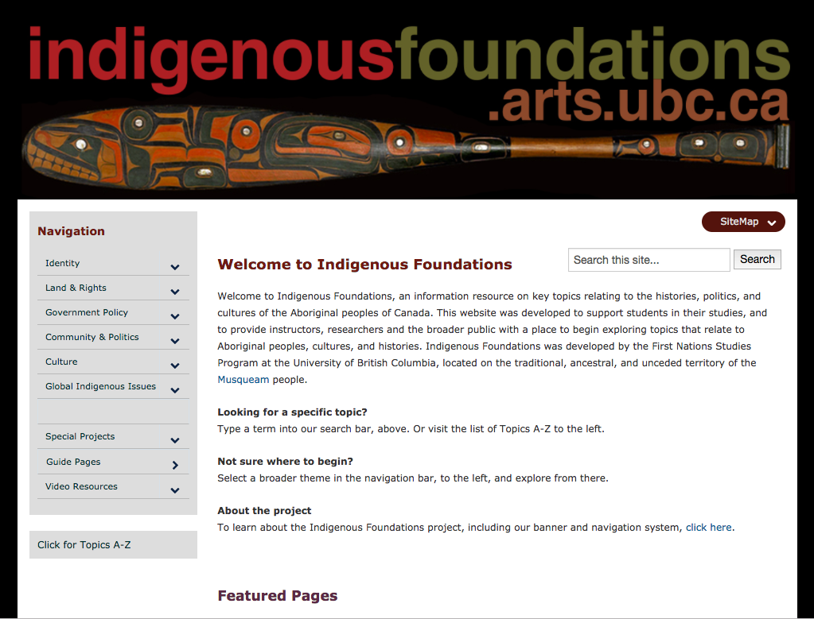
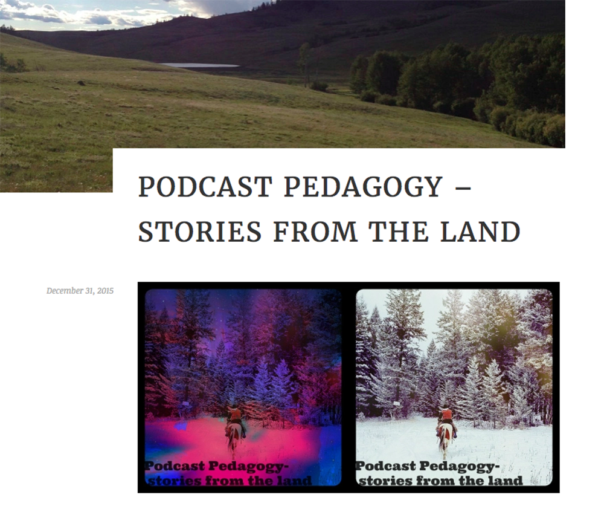
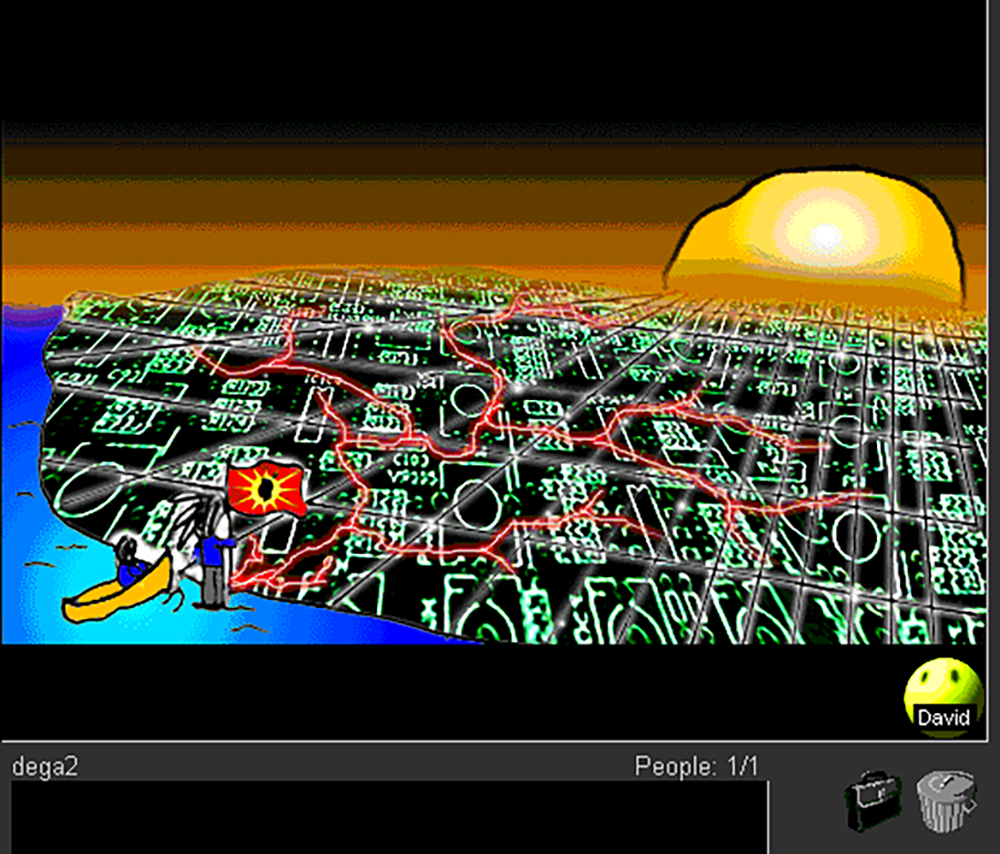
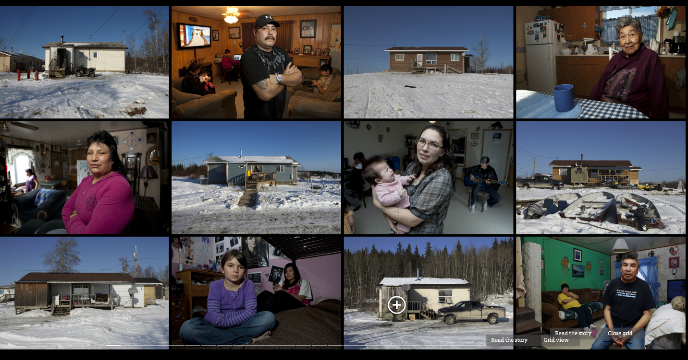
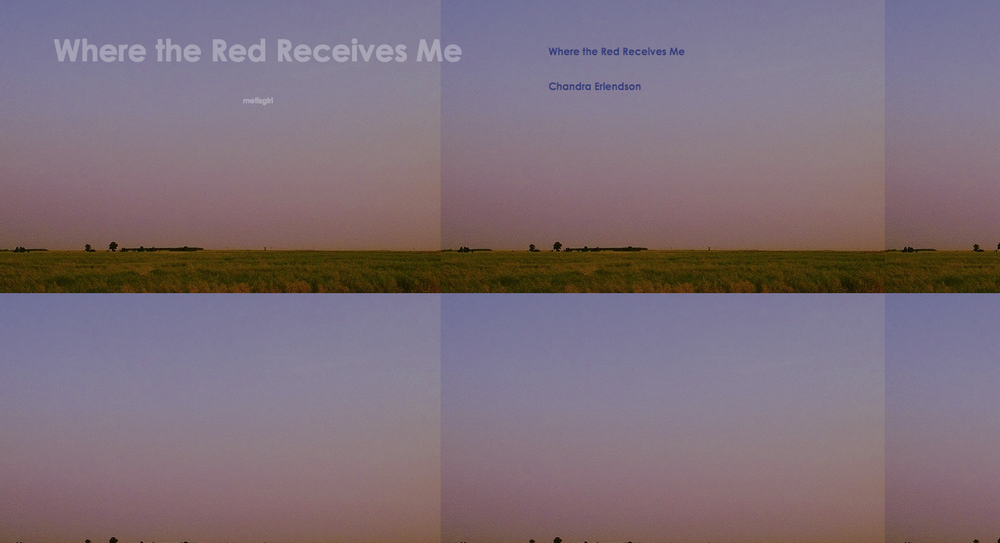
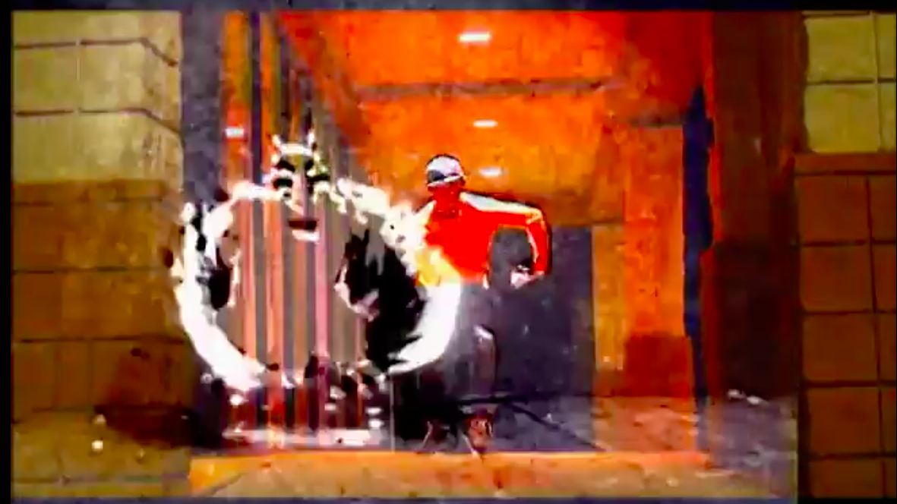
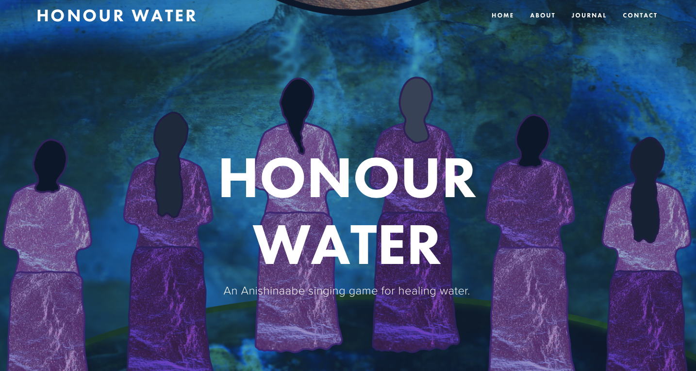

 
# INDIGENOUS
 
### David Gaertner
University of British Columbia ([First Nations and Indigenous Studies Program](http://fnis.arts.ubc.ca))
 
### Karyn Recollet
University of Toronto ([Women and Gender Studies Institute](http://www.wgsi.utoronto.ca))
 
### with Elizabeth LaPensee 
(note: second e has accent over but couldn't encode in GitHub)
Michigan State University (Media & Information and Writing, Rhetoric, and American Cultures)
 
---
 
##### Publication Status:
* unreviewed draft
* draft version undergoing editorial review
* draft version undergoing peer-to-peer review
* **draft version undergoing MLA copyediting**
* awaiting pre-print copy
* published 
 
---
### Cross-Reference Keywords: Community, Digital Divide, Futures, Intersectionality, Race, Social Justice
---

## CURATORIAL STATEMENT
 
In the contexts of technology and digital space, Indigenous must be understood in relation to Indigenous places, bodies, and futures. Traditionally framed as a "landless territory," Western conceptions of cyberspace risk eliding the core principles of critical Indigenous studies, which are founded in land and place-based pedagogies (Simpson, "Land as Pedagogy"). Evoking "Indigenous" in digital environments raises vital questions about relationships to cosmologies and space, digital creative intimacies with cyberspace and lands, and compels students to question if Indigenous lands and life can be repatriated through forms of creative intimacies formulated as cyber justice. The pedagogical resources gathered here connect with Indigenous as an opportunity to:
 
* Foreground Indigenous voices in and around digital spaces
* Conceive of new relationships to land and cyberspace through the digital
* Envision new ways of conceptualizing land as multiscalar
* Explore and critique the unique intimacies and ecologies available through cyberspace, and
* Reorient cyberspaces in relation to colonialism and Indigenous histories
 
Indigenous digital pedagogy begins from the idea that cyberspace and the digital are not Western phenomena. Both conceptually, and in practice, cyberspace has always existed for Indigenous peoples. Mohawk new media scholar Steven Loft argues: "that hardware technology has made it [cyberspace] accessible through a tactile regime in no way diminishes its power as a spiritual, cosmological, and mythical 'realm'" (175). Additionally, Angela Haas (Cherokee) argues that Wampum, beaded belts used by the Haudenosaunee peoples to record history, traditions and laws, is an early, Indigenous, example of hypertext: "both Western and wampum hypertexts employ digital rhetoric to communicate non-linear information" (84). 

In the classroom, Indigenous perspectives on digital ecologies promote critical understanding of and engagement with the colonial foundations of media analysis and the whiteness (McPherson) of digital space through close reading and place-based learning. In all classrooms, engagement with Indigenous digital pedagogy promotes critical reflection on the intersections between place, technology, and kinship and encourages anti-colonial engagement with the digital. Engagement with Indigenous new media technologies encourages Indigenous students to find spaces of safety, love, and breath within an environment (the digital) that has traditionally been alienating and even hostile for Indigenous peoples, particularly Indigenous women, and non-gender conforming peoples. 

The following artifacts were selected according to three broad principles:
 
First, all of the following resources were created by Indigenous artists, authors, programmers, scholars, and media makers. Indigenous digital pedagogy foregrounds Indigenous creators and thinkers. Non-Indigenous audiences should be encouraged to listen and learn. Hence, many of the resources listed below are produced projects. Students should be asked to listen carefully to and think with Indigenous media makers. Questions and assignments are provided to spark engagement along these lines.
 
Second, the included resources throw into relief the colonial implications of cyberspace, but also recast those spaces for Indigenous peoples to reimagine the possibilities of the digital and imagine Indigenous bodies in future worlds.
 
Finally, the included resources all explore, in different ways, kinstillatory relationalities: that is the ways in which kinship is built, maintained, and folded across time and space to produce radical constellatory genealogies and connectivities to community and land spaces. 

## CURATED ARTIFACTS
 
#### Indigenous Foundations

 
* Artifact Type: Course Site/Syllabus
* Source URL: http://indigenousfoundations.arts.ubc.ca/home/
* Permissions: Screenshot
* Creator: First Nations and Indigenous Studies Program, University of British Columbia
* Getting Started
 
The Indigenous Foundations website was developed as a resource for instructors, researchers, and students looking for a place to begin studying issues related to Indigenous peoples, cultures, and knowledges. The site covers a wide range of topics, including terminology, land rights, title, and government policy, amongst others. 

This website can be used as a secondary resource for students exploring Indigenous media. Before requiring students to analyze or engage with the pieces listed below, they, and you, as the instructor, should be familiar with the histories of colonialism and the present contexts of Indigenous resurgence. Require students to reference Foundations as a secondary source when writing analysis of Indigenous new media. As an example, have students write a brief, in-class analysis of ALie Nation (listed below), making specific reference to the Indigenous Foundations entry on the Indian Act (under "Government Policy"). How do students understand ATCR and their success differently in the context of legislation such as the Potlatch ban? 

#### ALie Nation

 
* Assignment
* Source URL:  https://www.youtube.com/watch?v=WhlKs_3Srj0
* Permissions: Screenshot
* Creator: A Tribe Called Red
* Tags: Getting started; Historypin
 
ALie Nation is a site of activation from which students can begin to reflect on the complex relationships between Indigeneity, modernity, and digital and urban spaces. The urban environment that A Tribe Called Red captures, moves through, and writes over, is registered not simply as a space of oppression for Indigenous peoples, but of possible Indigenous futures. Of specific interest for instructors here are the ways in which ATCR use technology to write on and over urban landscapes.

Instructors can use the video to begin conversations on the relationships between technology, land, and colonialism, which students can then share with their communities. Use the following questions to provoke conversation: what does "alienation" mean for Indigenous peoples within the contexts of the city? What does alienation mean for Indigenous peoples within the contexts of the digital? How are ATCR using technology to re-write colonial histories and Indigenous presence in urban and digital spaces? After discussion, have students confront alienation on your own campus and map spaces of Indigenous resurgence on that territory. Students should research the Indigenous histories of the lands they live and study on. What Indigenous territory is your university on? What resources are available to Indigenous students on your campus? Is there Indigenous art or architecture on campus? Where is it and what is its history? Have students upload their research to Historypin or Google maps and share it with the university community via social media.
  
#### Podcast Pedagogy

 
* Type: Student work
* Source URL: https://rebadeguevara.wordpress.com/2015/12/31/podcast-pedagogy-stories-from-the-land/
* Copyright: Screenshot
* Creator: Reba De Guevera
* Tags: Getting Started; wordpress
 
"Podcast Pedagogy" is an example of a final blog post assignment written by an undergraduate student about Indigenous new media. In the post the author explores the relationships between land, storytelling, and digital technologies via a close reading of Anishinaabe media maker RyanÕs McMahonÕs podcast *Stories from the Land*. 

This blog post is an excellent example of close reading practices as applied to podcasting and Indigenous storytelling and can be integrated into syllabi as a prompt for students writing on similar topics. Instructors can ask their students to reflect on the ways in which De Guevera incorporates land into a conversation about technology. Instructors can also ask students to consider the tone and voice De Guevera uses in this piece. How does she connect McMahon's work to her own experiences? What opportunities do blogs, podcasts, and other digital technologies offer for anti-colonial thought?

#### Speaking the Language of Spiders
 
 
* Type: Assignment
* Source URL: http://spiderlanguage.net
* Copyright: Screenshot
* Creator: Ahasiw Maskegon-Iskwew 
* Tags: Getting Started; site map
 
Speaking the Language of Spiders is one of the first interactive, Indigenous websites launched on the world wide web. It was created by Cree artist Ahasiw Maskegon-Iskwew and his collaborator, programmer Shelia Urbanoski in 1997. Spiders is an entirely singular look at Indigenous cosmologies and ecologies as they exist online. The site is constructed as an interactive screenplay and multi-media storyboard (Diamond).

The assignment connected to this website is a reverse site map. A site map is a diagram that plans, visualizes, and organizes the hierarchical structure material of on a webpage (see https://speckyboy.com/collection-inspiring-sitemaps-user-flow-maps/ for examples). For this assignment, using paper, post-it notes, and coloured markers, students should attempt to map out Maskegon-Iskwew's website in the analogue after engaging its content. The learning objective here is to get students thinking about the unique ways in which Maskegon-Iskwew construct time and space and thus, in a McLuhanesque sense, how the medium informs the message. Unpacking the storyboard as a site map also illustrates to students the complex, non-linear, and interactive ways in which stories can be unfolded via hyperlinks. Students should also visit http://lovingthespider.net, a companion site to the original, designed by Ubranoski and Cree artist Archer Pechawis.  

#### CyberPowWow

 
* Type: Assignment
* Source URL: http://www.cyberpowwow.net/
* Creator: Skawennati
* Permissions: screenshot
* Tags: getting started; wordclouds
 
CyberPowWow was the first interactive, online, Indigenous art gallery. Adapting early graphical chatroom software, Mohawk artist Skawennati curated artworks by Indigenous artists in a linked, interactive space. Artists then convened in those spaces via avatars to share and discuss the work. The gallery provides unique access into what Skawennati and Jason Lewis call "Aboriginal Territories in Cyberspace" (Lewis and Skawennati). 

Instructors should encourage students to visit the "library" on the CyberPowWow website, where they will find a collection of critical and creative pieces on Indigenous presence in cyberspace. Of particular interest is Jolene Rickard's essay "First Nation Territory in Cyber Space Declared: No Treaties Needed." Rickard argues that CyberPowWow is a natural extension of Indigenous culture and politics. Archer Pechawis makes similar connections between tradition and innovation in his essay, "Not So Much a Land Claim." Ask students what it means for these writers to be Indigenous in cyberspace. Divide students into small groups and have them construct wordclouds (https://www.jasondavies.com/wordcloud/) out of key terms from the Rickard and Pechawis' essays. Compare and contrast those wordclouds with the entire group. What are the similarities? What are the differences? What is at stake in these essays in defining Indigeneity in cyberspace?

#### *God's Lake Narrows*

 
* Type: Assignment
* Source URL: http://godslake.nfb.ca/#/godslake
* Creator: Kevin Lee Burton
* Permissions: screenshot
* Tags: getting started
 
*God's Lake Narrows* is an interactive website written and designed by Swampy Cree artist Kevin Lee Burton. The website was conceived as a space to introduce non-Indigenous people to life on Burton's home reservation (also called God's Lake Narrows), thus disrupting many of the stereotypes about life on a reservation. What makes Burton's work so provocative is how he uses technology to provide access to his home, but also how he brings Internet and Indigenous protocols together to evoke hospitality and guesthood in that space. 

Before engaging Burton's piece, students should read Students should read David Gaertner's essay, "Indigenous in Cyberspace: CyberPowWow, God's Lake Narrows, and the Contours of Online Indigenous Territory."  Instructors can then use Burton's work piece to initiate conversation about the relationship between Indigenous land and cyberspace as well as Internet protocol and community protocol. Specifically, instructors should focus on the ways in which how Burton uses technology to identify and "look back" at users (see in particular the "about" page). Have students move through the piece carefully, either individually or in small groups. How does Burton use sound, visuals, information, and technology to welcome visitors into the space? What are viewers expected to know before they are granted access to the homes? 
 
#### Where the Red Receives Me

 
* Type: Student work 
* Source URL: http://www.philome.la/chloerlendson/where-the-red-receives-me/play
* Permissions: Screenshot
* Creator: Chloe Erlendson
* Tags: Advanced; Twine
 
"Where the Red Receives Me" is a digital storytelling assignment designed by an undergraduate student for an upper-level course in Indigenous New Media. For this assignment, the student used Twine (interactive storytelling software, work shopped in class) to remediate a poem written by her mother about MŽtis identity. The story works well in classrooms as an example of the ways in which family and community stories can be shared and revitalized through digital media. 

Using Erlendson's work as a model, students can build their own digital stories on Twine (https://twinery.org/). Easy to follow tutorials are available on the site and free hosting is available with a Twitter account. This assignment works best when students are asked to remediate a story that comes from their home, community, or family. In building personal stories into simple websites, the class is encouraged to think about the delicate ecologies that make up digital storytelling and to think critically about how and why these stories generate and extend constellations of affinity and kinship. Have students share their stories with the class and ask how the translation of their story into the web changed the way they understood it.
 
####  Ay I Oh Stomp

 
* Type: Assignment
* Source URL: www.youtube.com/watch?v=FS43pk8Yjos
* Creator: Skookum Sound Systems 
* Permissions: screenshot
* Tags: advanced
 
The video "Ay I Oh Stomp," by Skookum Sound Systems can be read as a sonic map illuminating the time/space collapse mobilized through the remix. After watching the video, Instructors can ask students to create visual/sonic maps to explore the futuristic narratives of lands and territories through layering lands/ territories/ waters, or celestial maps remixed with recorded futurity narratives (this could take the form of spoken word poetry or other narrative devices).  

Students can read the text "Gesturing Indigenous futurity through the remix" (Recollet 2016), considering, in particular, how mapping (visual, choreographic, spatial & sonic) carries potential as sites of reworlding through digitally remixed platforms. This assignment allows students to practice, in their own ways, creative intimacies with the spatial scales of land, bodies, and territories (water, land -terrestrial, or celestial). 
 
#### *Honour Water*

 
* Type: Assignment
* Source URL: http://www.honourwater.com/
* Permissions: screenshot
* Creator: Elizabeth LaPensee, Michigan State University
* Tags: advanced; game
 
Elizabeth LaPansee's *Honour Water* activates Anishinaabemowin songs gifted by Sharon Day, the Oshkii Giizhik Singers, and Elders. Repatriating Indigenous land and life as in-motion, in-migration "through the kinesthetic waves of water" *Honour Water* activates Indigenous intelligence through voicing forms of "sonic intimacies" (Campbell) between bodies and waters in digital space/time. 

After playing *Honour Water,* students should be encouraged to research and travel to the portal sites of underground waterways in respective Indigenous territories, and build sonic intimacies through the act of singing water songs along with the app. Students should also consider the ways in which sound shapes movements, flows and migrations throughout the cities. How might these flows be acknowledge radical alterities? Who are the Indigenous stewards/ caretakers and those visioning futurities in the city within which they are living, and how might these original languages/songs impact the futurities of water?
 
#### Taking it to the People
 
 
* Type: Assignment
* Source URL: from syllabus
* Creator: Daniel Heath Justice, University of British Columbia
* Permissions: Madeson Singh
* Tags: advanced; capstone
 
It's not enough to simply talk about decolonization in class -- part of the work of Indigenous Studies is moving outside of the privileges of the academy to the wider world and other audiences. 

Ask students to choose a venue outside of class, and preferably outside the University, to share some part of their learning about Indigenous issues (for instance from A Tribe Called Red, Elizabeth LaPensee, or Kevin Burton) with friends, family, strangers, etc., and report back with a one-page summary /reflection and some evidence of the activity, such as a photo, screen capture, handouts from the event, etc. Examples might include leading a public screening of Burton or LaPense's work, writing a Wikipedia entry or an online review, writing a blog or posting on an online "comments" section, or participating in an online Indigenous event (see, for instance, the Initiatives for Indigenous Futures website).  
 
## RELATED MATERIALS
 
Conrum, Lou. Jarrett Martineau. "Indigenous Futurisms Mixtape." *Revolutions per Minute (RPM)*, November 20, 2014.   http://rpm.fm/music/download-indigenous-futurisms-mixtape/ 

Duarte, Marisa Elena. *Network Sovereignty: Building the Internet across Indian Country.* http://www.washington.edu/uwpress/search/books/DUANET.html

Igloliorte, Heather, Julie Nagam, and Carla Tauton, editors. Indigenous Art: New Media and the Digital. Public 54 (Winter 2016).

Lewis, Jason. *Initiative for Indigenous Futures.* http://abtec.org/iif/ 

Loft, Steven and Kerry Swanson. *Coded Territories: Tracing Indigenous Pathways in New Media Art*. http://press.ucalgary.ca/books/9781552387061 

## WORKS CITED
 
@spacendn and @culturite. "Indigenous Futurisms Mixtape," November 22, 2014, http://rpm.fm/music/download-indigenous-futurisms-mixtape/ 
 
A Tribe Called Red. ALie Nation  Ft. John Trudell, Tanya Tagaq, Lido Pimienta & Northern Voice. September 2, 2016, https://www.youtube.com/watch?v=WhlKs_3Srj0   
 
Burton, Kevin. *God's Lake Narrows*. National Film Board of Canada. 2011,
http://godslake.nfb.ca/#/godslake
 
Campbell, Mark. "Sonic intimacies: On Djing Better Futures." *Decolonization: Indigeneity, Education, and Society*. March, 25, 2015, https://decolonization.wordpress.com/2015/03/25/sonic-intimacies-on-djing-better-futures/  
 
De Guevera, Reba. "Podcast Pedagogy: Stories From the Land." *Trickster Media,* December 31,  2015, 
https://rebadeguevara.wordpress.com/2015/12/31/podcast-pedagogy-stories-from-the-land/    
 
Diamond, Sara. "Performing Transformations: Ahasiw Maskegon-Iskwew." *Ghost Keeper*. n.d. http://ghostkeeper.gruntarchives.org/essay-performing-transformations-ahasiw-maskegon-iskwew-sara-diamond.html 

Dillon, Grace. *Walking the Clouds: An Anthology of Indigenous Science Fiction*. Tuscan: University of Arizona Press, 2012.
  
Erlendson, Chloe. *Where the Red Receives Me.* 2014.
http://www.philome.la/chloerlendson/where-the-red-receives-me/play
 
Gaertner, David. "Indigenous in Cyberspace: CyberPowWow, God's Lake Narrows, and the Contours of Online Indigenous Territory." *American Indian Culture and Research Journal* 39.4 (2015): 55-76.

Glaskin, Katie. "Innovation and Ancestral Revelation: The Case of Dreams." *Journal of the Royal Anthropological Institute* 11.2 (2009): 297-314.
 
Haas, M. Angela. "Wampum as Hypertext: An American Indian Intellectual Tradition of Multimedia Theory and Practice." *Studies in American Indian Literatures* 19.4 (2007): 77-100.
 
Igloliorte, Heather, Julie Nagam, and Carla Tauton, editors. Indigenous Art: New Media and the Digital. Public 54, Winter 2016.

Lewis, Jason. Initiative for Indigenous Futures. 2017. http://abtec.org/iif/ 

Lapensee, Elizabeth. *Honor Water*. 2016. Ipad.
  
Lewis, Jason. Skawennati. "Aboriginal Territories in Cyberspace." *Cultural Survival Quarterly Magazine*. June 2005. https://www.culturalsurvival.org/publications/cultural-survival-quarterly/aboriginal-territories-cyberspace 

Loft, Steven. "Mediacosmology." *Coded Territories: Tracing Indigenous Pathways in New Media Art*. Eds. Steven Loft and Kerry Swanson. Calgary: University of Calgary Press, 2014. 169-86.
 
Loft, Steven and Kerry Swanson, eds. *Coded Territories: Tracing Indigenous Pathways in New Media Art*. Calgary: University of Calgary Press, 2014.
 
MacMahon, Ryan. *Stories from the Land*. Web. 2014-Present.
http://www.indianandcowboy.com/stories-from-the-land-podcast/
 
McPherson, Tara. "Why are the Digital Humanities so White: Thinking the Histories of Race and Computation." *Debates in the Digital Humanities*. Ed. Matthew K. Gold. Minneapolis: University of Minnesota Press, 2012.
 
Recollet, Karyn. "Gesturing Indigenous Futurities Through the Remix." *Dance Research Journal* 48.1 (2016): 91-105.
 
Simpson, Leanne. "Land as Pedagogy." *Decolonization* 3.3 (2014). Web. 
http://decolonization.org/index.php/des/article/view/22170 
 
Skawennati. CyberPowWow (decommissioned), 1997-2004, highlights available at http://www.cyberpowwow.net/ 
 
Skookum Sound System. "Ay I Oh Stomp & Operator" (ft. Deano & Amphibian14). 2012. https://www.youtube.com/watch?v=FS43pk8Yjos

Urbanoski, Shelia. Archer Pechawis. *Loving the Spider*, 2012, http://lovingthespider.net
