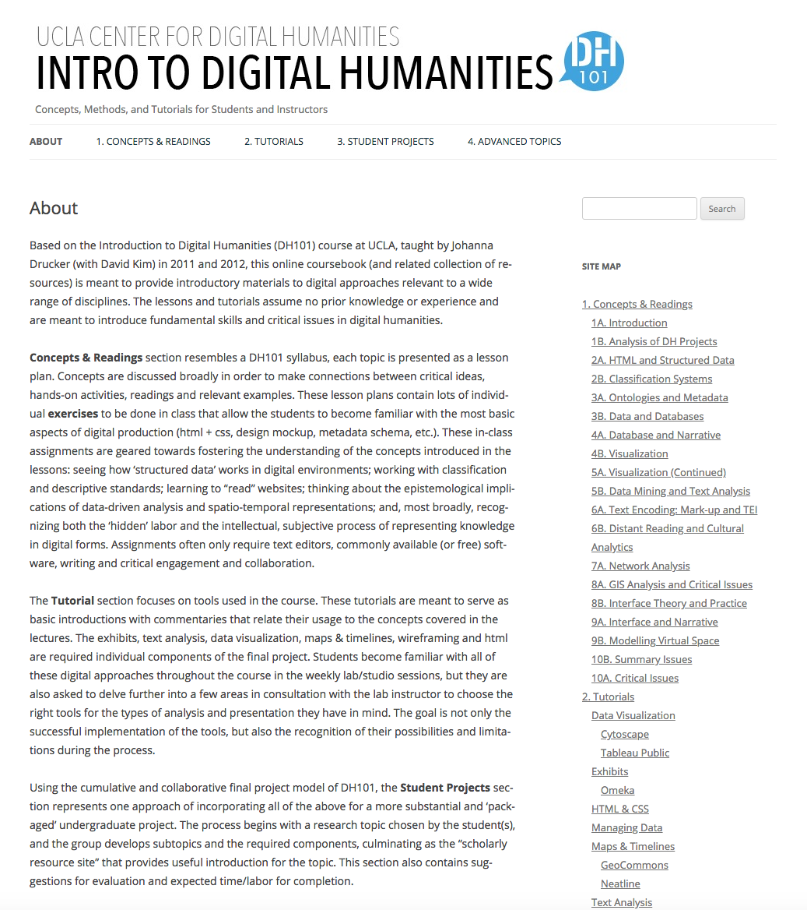
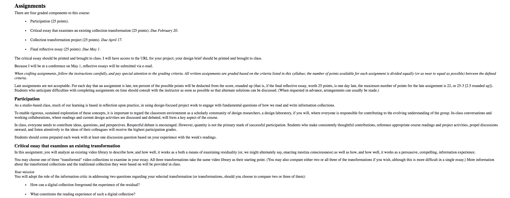
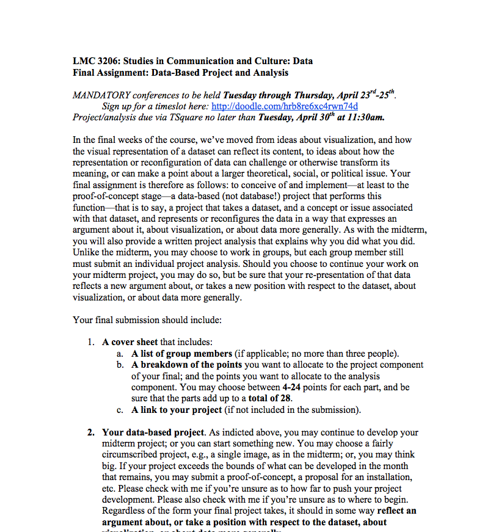
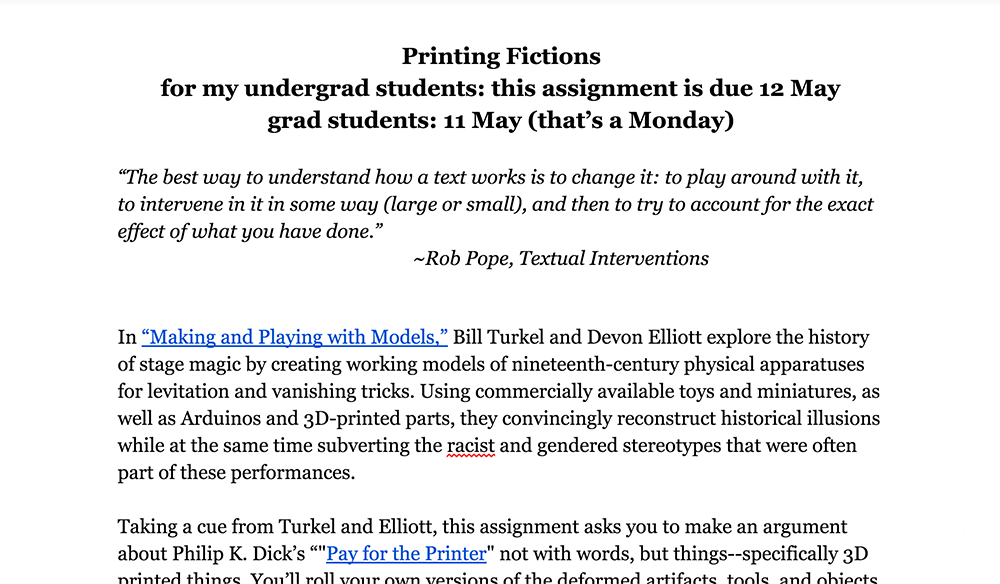
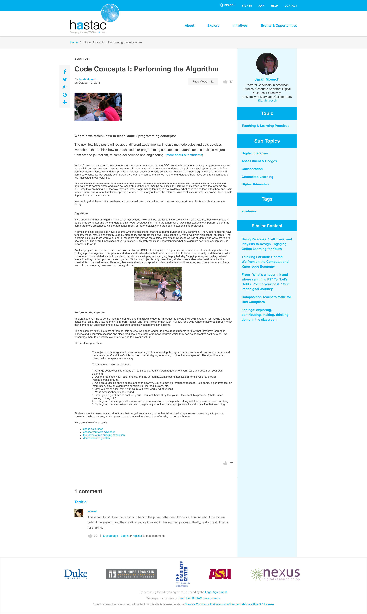
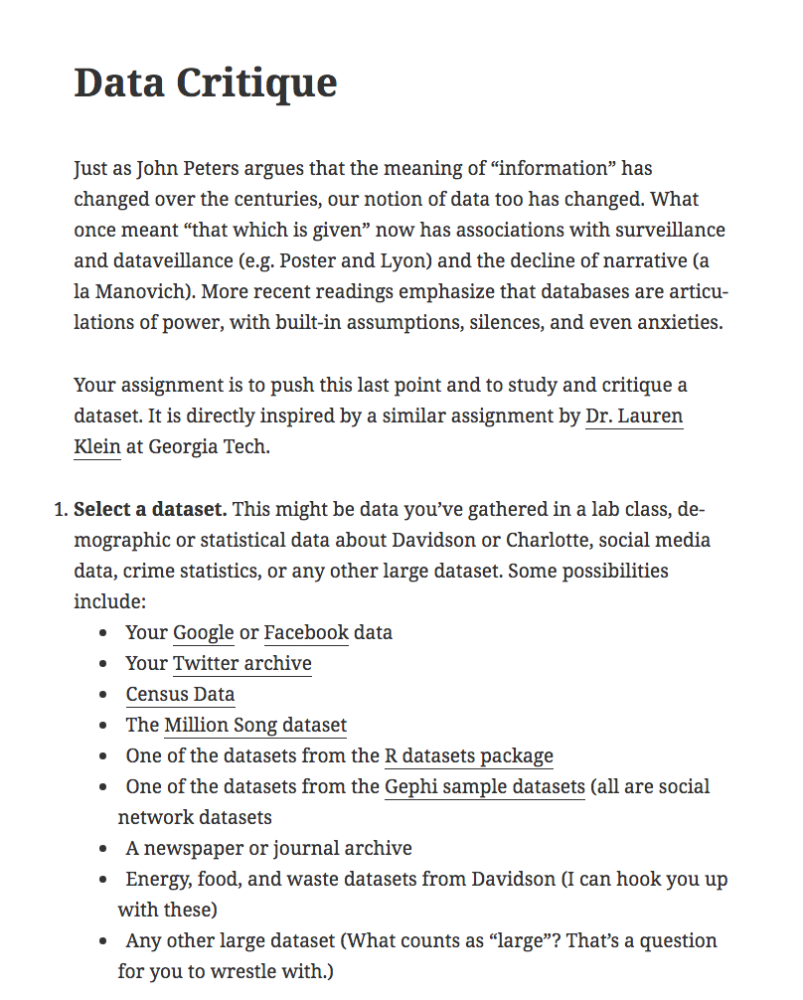
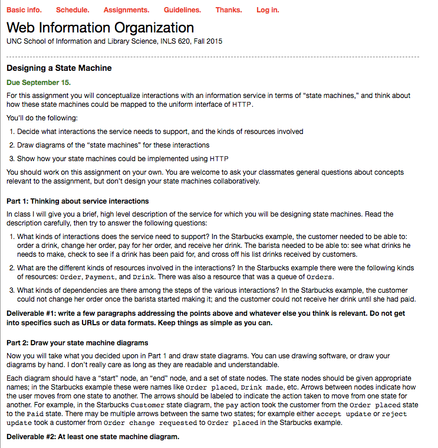
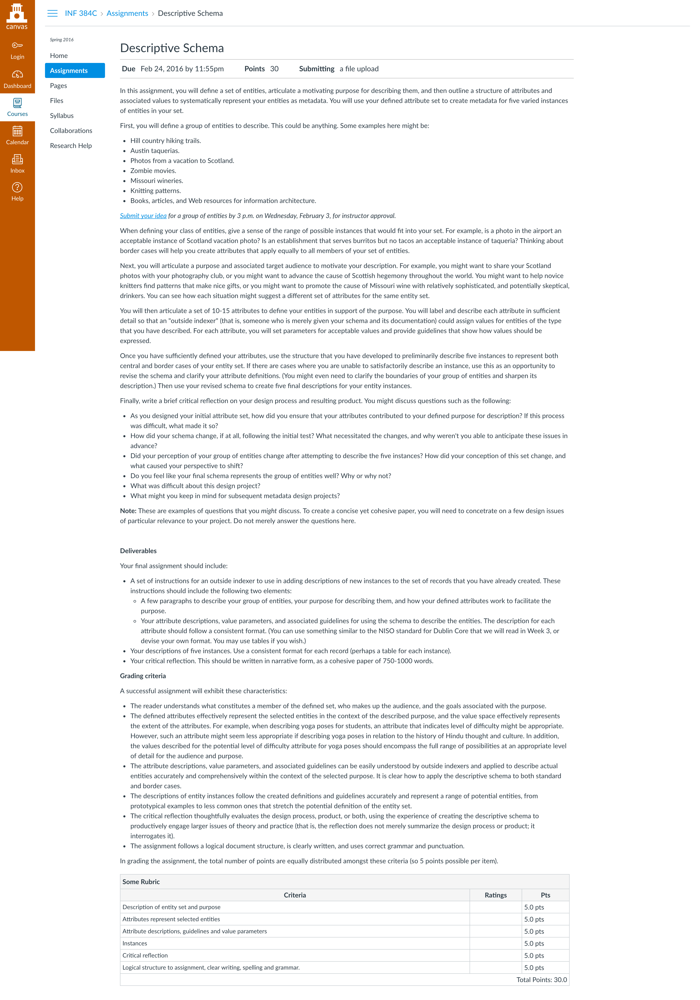

# Information

### Tanya E. Clement
University of Texas at Austin

### Daniel Carter
Texas State University

---

##### Publication Status:
* unreviewed draft
* draft version undergoing editorial review
* draft version undergoing peer-to-peer review
* **draft version undergoing MLA copyediting**
* published

---

## CURATORIAL STATEMENT

In the data, information, knowledge, wisdom (DIKW) hierarchy that circulates through Knowledge Management (KM) and Information Science (IS) discussions, *data* appears at the base of a pyramid of which wisdom is the pinnacle. In this schematic, *data* is “raw” and lacking in meaning, while *information*, the next higher level of the pyramid---just below *knowledge* and then *wisdom*---represents the presence of added links and relationships; *information* is higher up on the wisdom chain because it is *data* made meaningful (Sharma 2008). At the same time, in digital pedagogy in the humanities, discussions that teach students about *data* have typically reflected a more critical understanding of data as *capta* (Drucker 2011). In the humanities, students are taught that data is not found in the “raw” but has rather been cooked all along, taken and constructed and seasoned according to our situated contexts including access issues (*Where* is the data?); media, format, and technology constraints (*How* is the data?); and perspectives (*What* is the data? *Who* is involved in and impacted by its creation and use?).

Learning to think critically about data as *information* means rejecting common illusions about data more generally, including its objectivity, impersonality, atemporality, and authorlessness. To teach students to think about *information* from this more critical perspective means first understanding how a culture tends to understand what is informative. In literary culture, for example, *information* is often viewed as the KM and IS equivalent of "raw data". *Information* becomes an authorless and uninterpretable gush that distracts our attention from more important topics of concern; it is pitted against *the literary*  (Marche 2012). It is a critique in T.S. Eliot’s “The Rock” (1934); in Gertrude Stein’s short piece “Reflection on the Atomic Bomb”(1946), and, more recently, in a discussion on Kenneth Goldsmith’s “uncreative” poetry in *PMLA*, Scott Pound writes that Goldsmith’s poetry is “poetry that treats language as so much data or information, chosen for its quantitative rather than its qualitative allure, prized for its mass and availability rather than its originality or aesthetic value” (317-3-18). The *information* students see in these contexts is represented as so much abstract, autonomous, and objective noise---a massive, raw data dump over which they have very little agency. To the contrary, the lessons presented here teach students that digital, networked information systems reflect cultural contexts and can serve as a means for voicing perspectives.

These lessons show how arguments, thoughts, and creative expressions are asserted through information systems, because these lessons foreground a perspective in which the *informativeness* of data (or its relevance to what is meaningful) is shaped as much by systems of storage and retrieval as it is by situated social contexts, epistemes, and perspectives on understanding the world.

## CURATED ARTIFACTS

#### Introduction to Digital Humanities

* Source: [http://dh101.humanities.ucla.edu/](http://dh101.humanities.ucla.edu)
* Creator: Johanna Drucker, David Kim, Iman Salehian and Anthony Bushong (University of California, Los Angeles)
* Artiface Type: Coursebook

This online coursebook for an undergraduate DH course that is being taught in the context of a School of Information is a useful pedagogical tool because it asks students to consider the relationship between data and information as one that is shaped by the organization of data into a structure. For example, the module “Data and Databases” introduces students to the idea that data are *capta* or phenomena that are considered, by nature, quantifiable and thus, adherent to a prescribed scale or unit or system of measurement, but it is the tutorial “Managing Data” using Google Drive’s Fusion Tables that guides students through the process of considering a series of questions about overarching concepts such as data creation, data management, and data visualization through the process of visualizing a network from a data table they have constructed. While this lesson is achieved using the complex network maintained by the characters of a somewhat outdated television drama (*Lost*), the point of the lesson, that students are organizing information they think they already know in order to structure it and categorize it into types of their own choosing, forces students to reduce complex knowledge into data points and relationships that others would find informative or relevant. Because students are asked to compare their network graph to the information rich spreadsheet they originally created, they are reminded to consider how entities may easily defy labels and how the various relationships could be represented differently. The ultimate benefit of this assignment is that students learn to think critically about how ambiguities that are present in subjective content may be hidden in structured data formats and how they have the agency to change those structures to tell a different story.

#### Design Transformation

* Source: [http://courses.ischool.utexas.edu/feinberg/2014/spring/INF385U/assignments.html](http://courses.ischool.utexas.edu/feinberg/2014/spring/INF385U/assignments.html)
* Creator: Melanie Feinberg (University of North Carolina)
* Artifact Type: Assignment

The central strength of the course in which this assignment appears is its consideration for the active role that students can learn to take in developing information systems. The assignment, "Design Transformation", is particularly useful for its investigation into the transformative possibilities enacted by expressing and representing *residuality*, or the experience of being insufficiently described via a classification system. The assignment is powerful because it shows students how they can actively enact residuality as part of an information collection's metadata or descriptive infrastructure. With this objective in mind, this assignment asks students to revise the descriptive infrastructure (including the metadata and other customizable elements) of an existing digital collection to create an experimental transformation according to their own arguments or perspectives. As a result, students are led to articulate their interpretive understanding of constituent materials, of what collection authorship entails, and to consider how digital collection design environments are also authoring environments.

#### Data-Based Project and Analysis

* Source: [files/information-data-based-project-and-analysis.pdf](files/information-data-based-project-and-analysis.pdf)
* Creators: Lauren Klein (Georgia Tech)
* Artifact Type: Syllabus

Like Feinberg's course, described above, this course usefully engages with information as authored by explicitly asking students to first understand and then to intervene in existing systems or processes in order to create an argument. However, while Feinberg's course focuses on a specific aspect of information systems (metadata) and a specific theoretical concept (residuality), Klein's course asks students to discover and articulate their own interests, which might range from forms of visualization to formats of data and from epistemological issues to the social or political. Whether producing a proof-of-concept or a proposal, students must think about how their critical arguments intersect with real world constraints. Projects such as Nicholas Felton's personal annual reports are especially valuable objects to think alongside, as they represent uses of data that are personal and emerging, open to a variety of arguments and interventions, as well as concrete and specific, realized in specific technologies that are available to students. One of the interesting tensions running through the assignments collected here is between information as crafted by individuals and information as structured by distributed technical systems and tools, and one of the key pedagogical uses of Klein's project is in having students experience and negotiate this tension.

#### Printing Fictions

* Source: [files/information_printing-fictions.pdf](files/information_printing-fictions.pdf)
* Creator: Kari Kraus (University of Maryland, College Park)
* Artifact Type: Assignment

Information is not just about contextualizing data. The machines we use to generate, manage, understand, and share our views of the world are also part of how we think critically about the information landscape. This assignment for graduate and undergraduate students is of note because it asks students to consider how information infrastructure errors may be inspirational and spur innovative design. Using Philip K. Dick’s "Pay for the Printer" story of 3-D printed things as a motivational premise for considering the advantages of machine error, the assignment "Printing Fictions" gives students the opportunity to design their own versions of the deformed artifacts, tools, and objects described in Dick's post-apocalyptic world. Through this assignment, students are introduced to a critical perspective on the value of noticing and interrogating a technology’s "break down" or the moments in which the processes or algorithms of an information system such as a 3-D printer become apparent to the user; more important, they are empowered to use these moments to enact previously unimagined uses for which the machine was not originally intended.

#### Information and Contemplation

* Source: [http://cyborganthropology.com/Infomation_and_Contemplation:_University_of_Washington_Information_School](http://cyborganthropology.com/Infomation_and_Contemplation:_University_of_Washington_Information_School)
* Creator: David Levy (University of Washington)
* Artifact Type: Assignment
* Permissions: Creative Commons Attribution-Noncommercial-No Derivative Works 3.0 Unported License

This assignment is part of a course on information and contemplation designed to investigate contemporary questions of information overload and the fragmentation of attention. Unlike other artifacts collected here, which tend to draw attention to data or the technical systems through which they move, this assignment is valuable for its focus on the individual experience of systems such as email and social media platforms. Students are asked to consider not just what these systems are and how they function but also how they structure the rhythms of life and makes themselves felt on a bodily level. Through the assignment, students are encouraged to understand that invisible practices exist in a wide range social, biological, phenomenological, and technical systems. While the process of reflection that Levy advocates is a simple one, it usefully points out the value of observing the life of data (and of humans) in the wild. Together with Loukissas's project, discussed below, this project begins to introduce students to field methods that can enliven data and information systems, opening them to new modes of interpretation.

#### Performing the Algorithm

* Source: [https://www.hastac.org/blogs/jarah/2011/10/10/code-concepts-i-performing-algorithm](https://www.hastac.org/blogs/jarah/2011/10/10/code-concepts-i-performing-algorithm)
* Creator: Jarah Moesch (University of Maryland, College Park)
* Artifact Type: Activity
* Permissions: Creative Commons Attribution-NonCommercial-ShareAlike 3.0 License

"Performing the Algorithm" is an activity developed for the Digital Cultures and Creativity program at the University of Maryland, College Park. The strength of the activity is in giving students a basic conceptual understanding of algorithms, from which the kinds of critiques asked for by other assignments collected here might build. In the activity, groups of students create algorithms, or sets of instructions, for moving through and engaging space (defined broadly, with physical, virtual and conceptual spaces all given as examples). Examples of algorithms created in this way include instructions to play a game, perform a play, or enact a programming principle. Rather than asking students to directly critique existing information processes, this activity focuses on giving them the conceptual understanding, gained through practice, on which future critiques might build. This understanding is especially important for giving students with less technical backgrounds the opportunity to make arguments that, nevertheless, draw on an accurate (if rudimentary) understanding of information processes. This concrete approach to working toward understanding is especially important for topics like algorithms, which are common in public discourse but can often take the form of vague metaphors or magical black boxes. In the tradition of critical making, Moesch's activity works to move past these popular understandings by giving students a way to experience some of the technical realities that may otherwise be masked. Modifications to the activity, perhaps for students with more technical skills, might include having students create and act out algorithms for information processes such as those dealt with by Shaw's assignment, below.

#### Data Critique

* Source: [http://courses.digitaldavidson.net/dig210/guidelines/data-critique/](http://courses.digitaldavidson.net/dig210/guidelines/data-critique/)
* Creator: Mark Sample (Davidson College)
* Artifact Type: Assignment

This assignment is part of a larger undergraduate course in the Digital Studies interdisciplinary minor at Davidson College. It seeks to teach students to think critically about how an understanding of data and databases ties to the ways in which we understand the world. That the assignment, "Data Critique," had been previously developed by Lauren Klein in her class, "Studies in Communication and Culture: Data" [http://lkleincourses.lmc.gatech.edu/data13/files/2013/01/midterm1.pdf], and later redesigned in Tanya Clement's graduate-level "Introduction to Digital Humanities" class [https://www.ischool.utexas.edu/sites/default/files/images/webform/DHFall2015Syllabus.pdf](https://www.ischool.utexas.edu/sites/default/files/images/webform/DHFall2015Syllabus.pdf) shows its utility as a a means for encouraging students to think more critically about the origins of datasets they are using, but Sample's version is selected here for its inclusion of particular questions for deeper consideration. The questions, influenced by a blog post by Michael Sacasas entitled, "Do Artifacts Have Ethics?", show a keen understanding for the kinds of agency that information systems can afford. The end result is a paper that not only discusses the social and cultural context of the dataset but also considers how we empower dataset designers to incorporate ommitted voices and perspectives. The strength behind this assignment is the extent to which it requires students to consider how we can empower people to consider the nature of what is informative in terms of its implicit claims about the world.

#### Designing a State Machine

* Source: [https://aeshin.org/teaching/inls-620/2015/fa/assignments/](https://aeshin.org/teaching/inls-620/2015/fa/assignments/)
* Creator: Ryan Shaw (University of North Carolina)
* Artifact Type: Assignment

Ryan Shaw’s "Designing a State Machine" assignment, part of a graduate-level course on Web Information Organization, asks students to consider how real-world interactions such as ordering a cup of coffee at Starbucks could be modeled as information systems and implemented using contemporary web technologies such as HTTP. Like others collected here, the assignment is valuable for providing students with a way to engage with technical specificities while simultaneously thinking about the way those specificities structure interactions in the world. Unlike other assignments, however, the level of focus of Shaw's assignment allows students to think about the different protocols or logics that underlie information processes that may otherwise appear distinct. Protocols such as HTTP and standards such as Unicode have consequences similar to those of the organization schemes and data models that other assignments here highlight; however, they are arguably more invisible and easier to elide in analysis. Shaw's assignment is valuable for making explicit the invisible protocols that structure common information processes and for providing students with a way to think about these protocols in relation to their everyday lives. The infrastructural undercurrents of this assignment could be pursued through a reading such as Edwards (2003), which considers the development of the internet in relation to both micro (e.g., individuals and small groups) and macro (e.g., political economies and governments) contexts.

#### Descriptive Schema

* Source: [https://utexas.instructure.com/courses/1160641/assignments/3735626](https://utexas.instructure.com/courses/1160641/assignments/3735626)
* Creators: Karen Wickett (University of Texas at Austin)
* Artifact Type: Assignment

This assignment is part of a larger graduate course on organizing information at the School of Information at the University of Texas at Austin. In the assignment, students are asked to define a set of entities, articulate a motivating purpose for describing them, and then outline a structure of attributes and associated values to systematically represent their entities as metadata. When defining the class of entities, students are required to think critically about the range of possible instances that would fit into their sets and possible "border" cases: "For example, is a photo in the airport an acceptable instance of a Scotland vacation photo? Is an establishment that serves burritos but no tacos an acceptable instance of taqueria?" Students are asked to consider how varied contexts or situations might suggest a different set of attributes for the same entity set. The primary strength of this assignment in the context of information pedagogy is that students learn that how things, places, and people are described in the world impact how they are understood. Students are taught to think critically about designing an initial attribute set that contributes to a defined purpose for description, when and how it does and does not necessitate changes, and how to argue for how these changes reflect shifts in perspectives.

## RELATED MATERIALS

Clement, Tanya. "An Information Science Question in DH Feminism." *Digital Humanities Quarterly* 9.2 (2015): n. pag. Web. 25 Feb. 2016. [http://www.digitalhumanities.org/dhq/vol/9/2/000186/000186.html](http://www.digitalhumanities.org/dhq/vol/9/2/000186/000186.html)

Feinberg, Melanie. "Two Kinds of Evidence: How Information Systems form Rhetorical Arguments." *Journal of Documentation* 66.4 (2010): 491-512.

Galloway, Alexander. "Are Some Things Unrepresentable?" *Theory, Culture & Society* 28.7-8 (2011): 85–102. Web.

Loukissas, Yanni. The Life and Death of Data. metalab at Harvard. 2015. Web.

Ribes, David, and Steven J. Jackson. "Data Bite Man: The Work of Sustaining a Long-Term Study." *Raw Data Is an Oxymoron*. Ed. Lisa Gitelman. Cambridge: MIT Press, 2013. 147–166. Print.

Shaw, Ryan. "Big Data and Reality." *Big Data & Society* 2.2 (2015): 1-4.

## WORKS CITED

Buckland, Michael K. "Information as Thing." *Journal of the American Society for Information Science* 42.5 (1991): 351–360. Print.

Drucker, Johanna. "Humanities Approaches to Graphical Display." *Digital Humanities Quarterly* 5.1 (2011): n. pag. Web. [http://www.digitalhumanities.org/dhq/vol/5/1/000091/000091.html](http://www.digitalhumanities.org/dhq/vol/5/1/000091/000091.html)

Drucker, Johanna et al. Introduction to Digital Humanities. N.p., 2013. Web.

Edwards, Paul. "Infrastructure and Modernity: Force, Time, and Social Organization in the History of Sociotechnical Systems." *Modernity and Technology*. Ed. Thomas J. Misa, Philip Brey, and Andrew Feenberg. MIT Press, 2004. 185–225. Print.

Eliot, T. S. *The Rock; a Pageant Play*. London: Faber & Faber, 1934. Print.

Feinberg, Melanie. "Digital Media Collections." Syllabus. 2014. Web.

Foucault, Michel. *Archaeology of Knowledge*. New York: Routledge, 2002. Print.

Kraus, Kari. "Printing Fictions." Assignment sheet. n.d. Web.

Klein, Lauren. "Final Assignment: Data-Based Project and Analysis." Assignment sheet. n.d. Print.

Levy, David. "Information and Contemplation." Syllabus. 2006. Web.

Marche, Stephen. "Literature is not Data: Against Digital Humanities." *The Los Angeles Times*. 28 October 2012. Retrieved from
[https://lareviewofbooks.org/essay/literature-is-not-data-against-digital-humanities/](https://lareviewofbooks.org/essay/literature-is-not-data-against-digital-humanities/).

Moesch, Jarah. “Code Concepts I: Performing the Algorithm.” HASTAC. 10 Oct. 2011. Web.

Nunberg, G. "Farewell to the Information Age." In Geoffrey Nunberg (Ed.), *The Future of the Book* Berkeley, CA. University of California, 1996: 103-133.

Pound, Scott. "Kenneth Goldsmith and the Poetics of Information." *PMLA* 130.2 (2015): 315–330.

Sacasas, Michael. "Do Artifacts Have Ethics?" *The Frailest Thing*. 29 Nov. 2014. Retrieved from [http://thefrailestthing.com/2014/11/29/do-artifacts-have-ethics/](http://thefrailestthing.com/2014/11/29/do-artifacts-have-ethics/).

Sample, Mark. "Data Critique." Assignment. 2015. Web.

Sharma, Nikhil. "The origin of the data information knowledge wisdom hierarchy." Data Inf. Knowl. Wisdom hierarchy (2008).

Shaw, Ryan. "Web Information Organization." Syllabus. 2015. Web.

Stein, Gertrude. *Reflection on the Atomic Bomb*. Los Angeles: Black Sparrow Press, 1973. Print.

Wickett, Karen. "Descriptive Schema." Assignment. 2016. Web.
