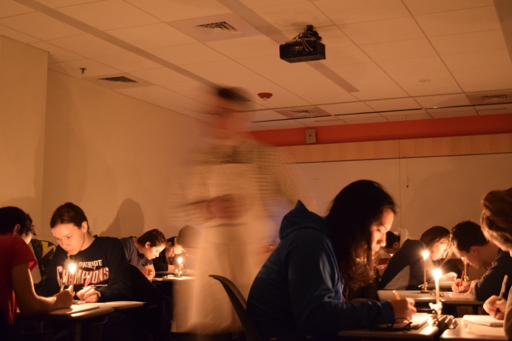
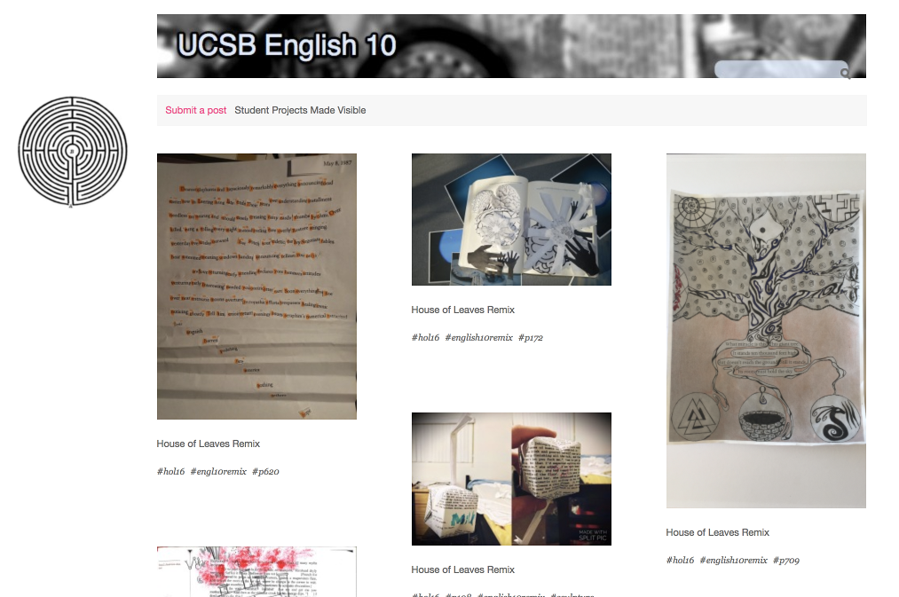
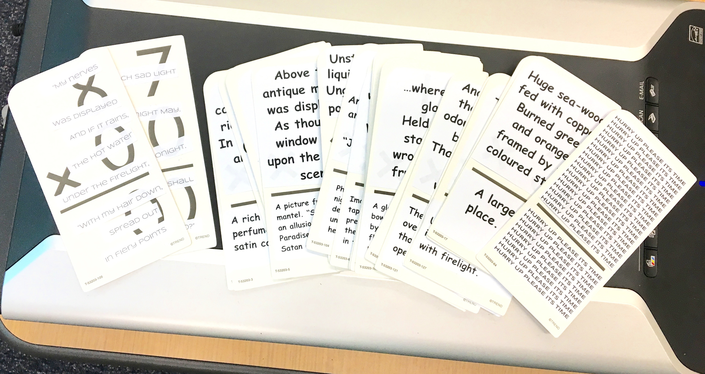
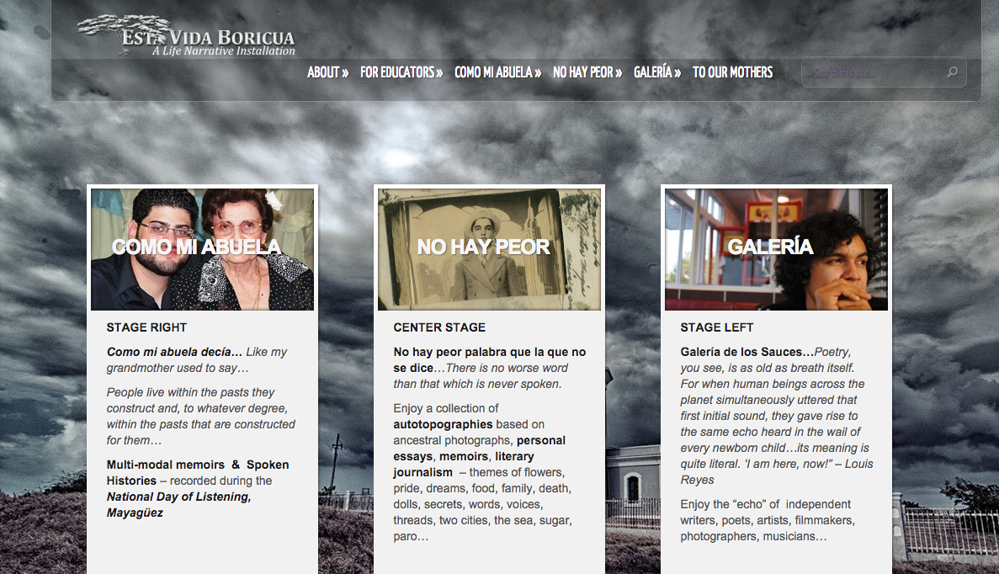
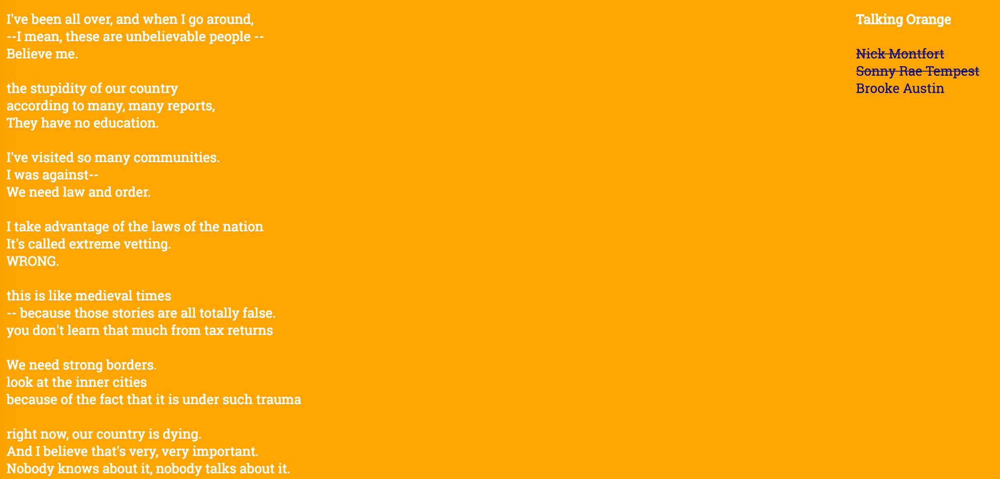
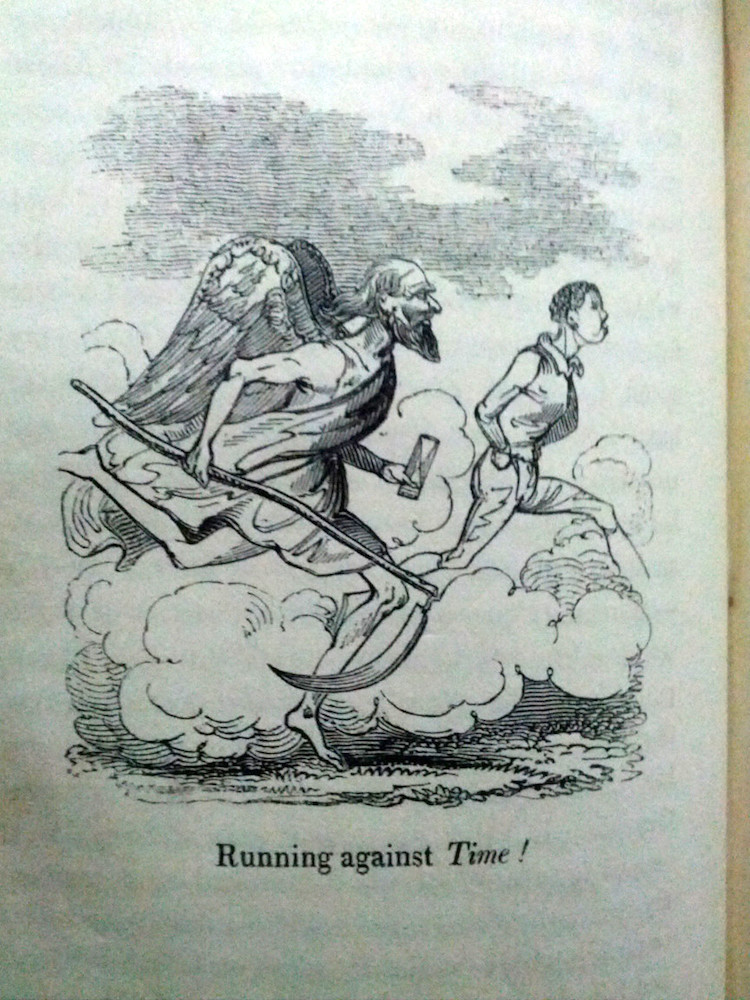
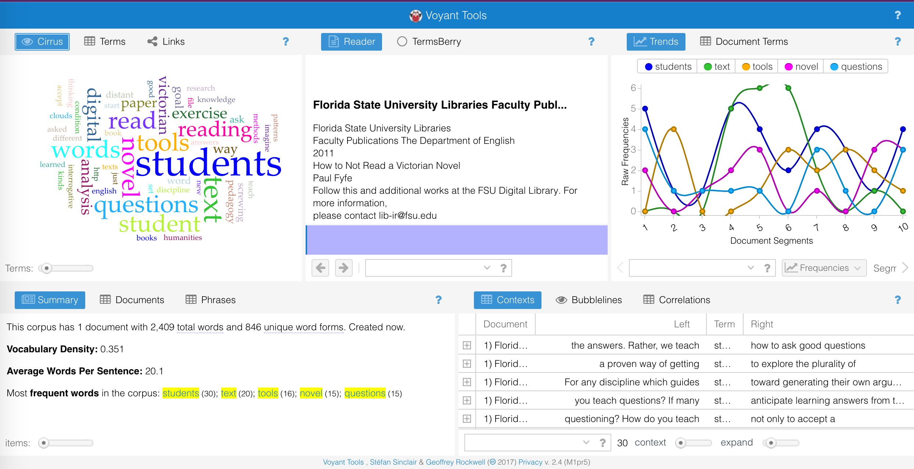
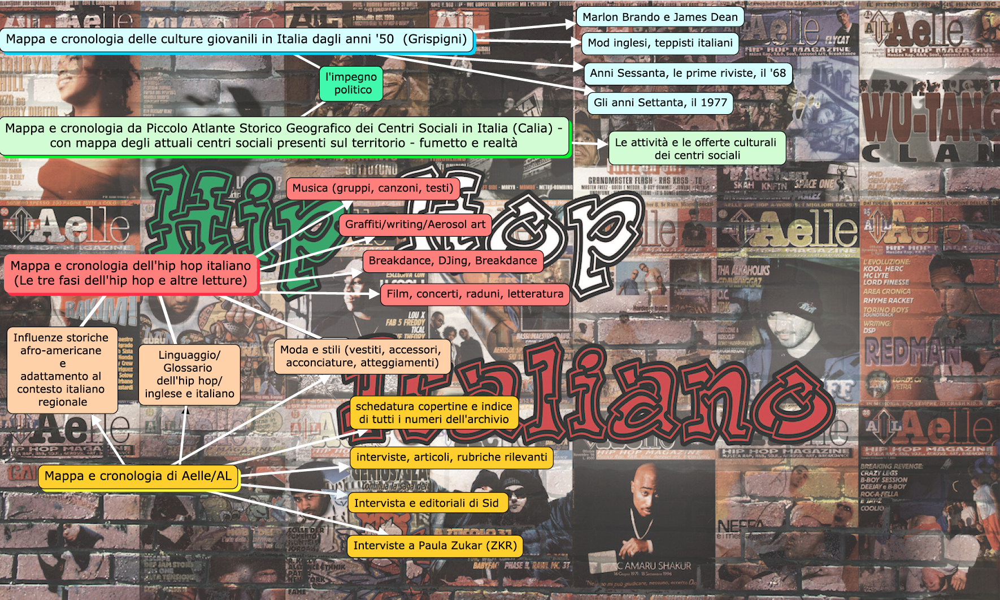
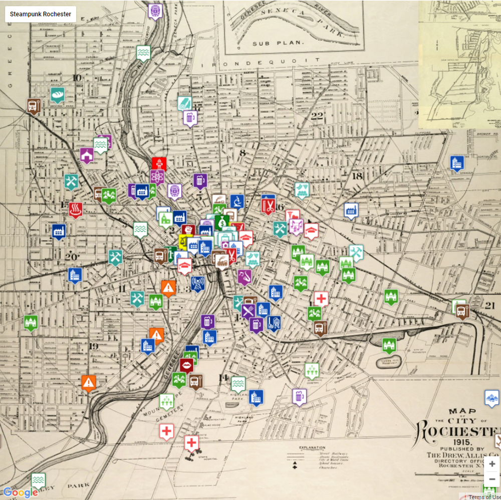

# INTERFACE 

### [Kathi Inman Berens](http://kathiiberens.com)
Portland State University | [English Department - Book Publishing](http://publishing.pdx.edu/faculty/)

---

##### Publication Status:
* unreviewed draft
* draft version undergoing editorial review
* draft version undergoing peer-to-peer review
* **draft version undergoing MLA copyediting**
* awaiting pre-print copy
* published 

---

### Tags: code, classroom, collaboration, praxis, public

--- 

## CURATORIAL STATEMENT

Anyone who has rearranged classroom chairs from rows into a circle knows that a classroom’s physical space shapes students' learning. So, too, computational interfaces materially shape what and how students learn.  Computational interfaces link hardware, software, human users and other sources of data, creating the material contexts through which computing takes shape. Computer source code is the foundational human/computer interface.  Human language structured to be machine legible is "always symbolic, involv[ing] syntactical and symbolic mappings for operations" (Cramer and Fuller, 150).  Such operations are executable, and also culturally inscribed because they are human-authored. 

Peoples’ most common conscious experience of interface is with enterprises (Google, Apple, Facebook, Amazon, Twitter, and the like) that supply information but also extract it, harvesting user "metadata" (information about information).  A Tweet's metadata outmasses the Tweeted content by more than 4:1, notes Peter Wilson, [a developer](https://peterwilson.cc/a-tweets-metadata/) who studied Twitter's API (application programming interface).  This is why something browsed in Safari or mentioned in a gmail might show up, seconds later, embedded as a sponsored ad in a different platform, like a Facebook wall.  Metadata is instantly harvested and auctioned.  Its information fuels inhumanly fast advertisement customization and placement.  These transactions pay for the “free” Web.  Interface encompasses vast swaths of nonhuman and human behavior:  everything from how software apps instruct the machine to constrain its many possible states to function as a calculator, or word processor, or video editor (Cramer and Fuller, 150) to how enterprises extract value from tracking human desires expressed through query.

In the early days of personal computing, the command line was the human/machine interface, where user and programming interfaces were one in the same. Today humans typically engage computers through a “graphical user interface,” GUI (“gooey”).  Opening a directory on a desktop, one clicks an icon of a manila folder and the folder "opens," which means systems software tells the computer to display that directory’s list of content.  GUI interfaces are "intuitive” because the interface's representational schema correspond to familiar objects or routines in the physical world, like emptying the trash.  Emojis, voice command, and autocompletion are read/write interface software: the software reads human inputs and then outputs suggestions, often before humans finish inputting information.  This tradeoff of speed for precision, or speed for privacy, is one that Bruce Schneier notes [humans are historically willing to make](https://news.harvard.edu/gazette/story/2017/08/when-it-comes-to-internet-privacy-be-very-afraid-analyst-suggests/). 

GUI was designed to make computational logic less foreign to humans.  The "invisible" interface is the furthest outpost of this general aim.  Apple's [Human Interface Guidelines](https://developer.apple.com/ios/human-interface-guidelines/overview/themes/), written for mobile app developers, explains the design principle: an app should manifest "Deference," which Apple articulates as "[f]luid motion and a crisp, beautiful interface [to] help people understand and interact with content while never competing with it."  

When curating the keyword "Interface," I pursued the opposite of "deference."  Assignments included here ask students to note how interface "competes" with the output, draws attention to its materiality and constructedness.  These artifacts and related materials prompt students to see the labor and mess of human/computer interaction, giving them occasion to examine interface from technical, material, and cultural perspectives. Study of interface is a contact point for nonhuman/human difference, an "in-betweenness,” as Homi Bhabha says of multiculturalism.  

"Autocomplete poetry" is a simple and fast classroom exercise to prompt critical thinking about interface.  Instruct students to type the same phrase into a commercial search bar, then each student screenshots the suggested autocompletions. (This works less well in [Duckduckgo](https://duckduckgo.com/), which doesn't track query data.)  Students can use phones, laptops, lab computers--device doesn't matter.  They can stack several screenshots of autocomplete and read them as a poem.  Or they can compile screenshots of the same autocompleted phrase into one composit.  Can we find patterns in autocompletions of the same phrase on different machines?  Whose interest might such autocompleted result serve?  Anna Jobin and Frederic Kaplan found a [correlation between autocompletion results and Google's commercial interests](http://dh2013.unl.edu/abstracts/ab-223.html).  

John Cayley and Daniel C. Howe's excellent work on Google data as public commons in the arts-based [The Readers Project](thereadersproject.org) interrogates who owns the information amassed by human activity in the world's largest public repositories, the volunteer labor that builds public commons owned by corporations.  Eli Pariser’s influential *The Filter Bubble* (2011) became freshly and ominously relevant after disclosures of “fake news” during the 2016 U.S. presidential election revealed the extent to which enterprise interface customization comes at the cost of universally shared common information.

Building a webpage in HTML and CSS is a fundamental way to learn about interface, and there are several very good, free-to-use, browser-based resources in Related Materials, below.  To move from being a consumer to a [code](https://github.com/curateteaching/digitalpedagogy/blob/master/keywords/code.md) builder shifts students’ mindsets, giving a hands-on experience of how the open Web started as hand-coded webpages using [remix](https://github.com/curateteaching/digitalpedagogy/blob/master/keywords/remix.md) and [play](https://github.com/curateteaching/digitalpedagogy/blob/master/keywords/play.md), and tolerating [failure](https://github.com/curateteaching/digitalpedagogy/blob/master/keywords/failure.md).

These Interface assignments and Related Materials address a wide spectrum of student readiness and institutional support for digital humanities work. They balance the number of male and female contributors, feature assignments designed for non-English speakers and non-English language learners, and meet the needs of beginning and advanced students.  Income-insecurity is not a barrier to learning about interface, as several of these assignments can be done using a cell phone.  The ten assignments are organized from technically easiest to hardest.  All of them are conceptually rigorous.

## CURATED ARTIFACTS
<!-- #1  -->
### Simulating the Scriptorium

* Artifact Type: Assignment 
* Source URL: <http://f14tot.ryancordell.org/2014/09/16/lab-3-simulating-the-scriptorium/>
* Copy of Artifact: See assignment in Source URL blog post.
* Creator: Ryan Cordell (Northeastern University)

“The candle is a non-textual medium that has profoundly affected the texts we have inherited from previous generations," observes Ryan Cordell.  Undergraduates in his "Technologies of Text" course write for one class period in a windowless, dark room at a table lit by candles. A fire marshal with an extinguisher at his hip monitors the scrivening.  Students discover that bookmaking is a laborious process when they transcribe a text of their choice from the *Norton Anthology.*  Hands cramp.  Eyes strain.  Backs tire. This assignment historicizes the physical labor of writing.  Just as with hand-coding websites, scrivening prompts interface awareness.
<!-- #2  -->
### Close Reading *House of Leaves* using collage and Tumblr

* Artifact Type: Assignment 
* Source URL: <http://english10introductiontolit.tumblr.com>
* Copy of Artifact: [files/interface-Douglass-Pok-ENGL-10-HoL-Remix.pdf](files/interface-Douglass-Pok-ENGL-10-HoL-Remix.pdf)
* Creators: Jeremy Douglass (University of California Santa Barbara) and Steven Pokornowski (University of California Santa Barbara)

It's ambitious to assign *House of Leaves* in an introductory literature class.  Jeremy Douglass and Steven Pokornowski create a two-part interface assignment. The prompt procedurally guides students through making a [remix] (https://github.com/curateteaching/digitalpedagogy/blob/master/keywords/remix.md) of one page--and only one page--in *HoL*. Making their collages, students can work with digital image software or with the other "digits," their fingers, making collage from arts and craft supplies. Handmade remixes are photographed; all remixes are tagged and uploaded to the class's Tumblr site which itself remixes the individual pages into a fragmentary collective reading of the novel. Their heterogeneity, and the accumulation of student work over time, refracts the source text's unfinalizability.
<!-- #3-->
### Deformance as Remix
 

* Artifact Type: Assignment 
* Source URL: <https://tuelit13.wordpress.com/deformation/>
* Copy of Artifact: [interface-deformance-assignment.pdf](files/interface-deformance-assignment.pdf)
* Creator: Paul Benzon (Skidmore College); deformance by Portland State University undergraduate Ivy Knight (above)

Paul Benzon teaches students how altering the materiality of a source text refigures how and why it means something.  Such an interface invokes theories of “deformance” by McGann & Samuels and Sample, which students read in advance of doing this assignment.  Benzon suggests these potential deformances, and encourages students to invent their own:
•	reorder the book’s pages 
•	white out every page and rewrite it 
•	staple in your own writings 
•	make origami out of its pages and scatter them across Philadelphia 
•	encase it within another text 
•	mail its pages to random people 
•	scan it to Google Books and set the hard copy on fire.

I remixed Benzon’s assignment using as my source texts T.S. Eliot’s *The Waste Land* and contemporary poet John Beer’s *The Waste Land*.  These we studied in various medial forms: paper, audio, Poetry Foundation website, Google images.  My students deformed the source texts into: 
•	an RPG game; 
•	a remixable, combinatory poem made of lines pasted onto cardboard multiplication flashcards (by Portland State University undergraduate Ivy Knight, pictured above); 
•	a Twine hypertext story;
•	an interactive, redacted poem; 
•	a video with originally composed music, glitch video and spoken word; 
•	a hand-made zine
•	a hand-drawn spiral of words, photographed and uploaded to a class repository (this by a retiree auditing my class who had never used a smart phone or seen a blog comment).  

The generic diversity of my students’ deformances led to bold and exciting conversation anchored in Jessica Pressman’s assessment of medium-specific close reading in *Digital Modernism: Making it New in New Media* (2014).  
<!-- #4  -->
### Spanish-Language Life Histories Audio Wiki In-Progress

* Artifact Type: Assignment 
* Source URL: <http://estavidaboricua.com/>
* Copy of Artifact: [interface-mongar-multimodal-assignment.pdf](files/interface-mongar-multimodal-assignment.pdf)
* Creator: Sonja S. Mongar (Universidad de Puerto Rico de Mayagüez)

*Esta Vida Boricua* ("This Puerto Rican Life") is a wiki of "ethnically rich” life writing told in spoken word, tying Puerto Rico’s “threads to Cuba, Dominican Republic, South America, England, Germany, Italy, France, China, United States, Israel, Palestine, Egypt and Australia," observes project founder Sonja S. Mongar.  In Spanish and English, the wiki displays just one-third of its collected materials because the project hasn't staff to load its multimodal assets. It seeks volunteers who might edit and post from remote locations.
*Esta Vida Boricua* has a strong pedagogical orientation with a tab specifically for educators: http://estavidaboricua.com/for-educators/ "Notes on Life Narrative," for example, presents fifty-two life writing classifications adapted from Sidonie Smith and Julia Watson's *Reading Autobiography*. 
I chose this interface because, like many digital humanities passion projects, *Esta Vida Boricua* seeks ways to survive after the seed money is gone.  The opposite of YouTube--the world’s largest repository of autobiographical stories--*Esta Vida Boricua* reminds us that interfaces unsupported by advertising can meet the challenge of interface preservation with volunteer labor.
<!-- #5  -->
### Remixed Javascript Poem
 
* Artifact Type: Assignment 
* Source URL: <http://nickm.com/taroko_gorge/ >
* Copy of Artifact: [interface-taroko-remix-how-to.pdf](files/interface-taroko-remix-how-to.pdf)
* Creator: Nick Montfort (Massachusetts Institute of Technology); "Talking Orange" remix (above) by Portland State University Master's candidate Brooke Austin

Nick Montfort wrote the generated poem “Taroko Gorge” on the plane home from Taiwan as a machinic version of British Romantic landscape poems.  Instead of the author-genius crafting memorable verse, Python code instructs the computer to print stanzas randomly selected from words in six variable strings.  The generated poem prints one line at a time for as long as the program is running.  Once a line is pushed up and off the screen by new lines, it’s gone forever.  Montfort ported “Taroko Gorge” to Javascript so that it would run in a brower, and Scott Rettberg was the first to remix it.  My poem “Tournedo Gorge” was my first experience modifying Javascript.  My poem is anthologized, along with several other "Taroko" remixes, in the [Electronic Literature Collection Volume 3](http://collection.eliterature.org/3/collection-taroko.html).

“Taroko Gorge” is a venerable classroom exercise, a high-impact way to teach the culture of code copying/remix, and impart the values of open-access early Web.  “Taroko” accommodates all levels of learners.  In the same class, I’ve taught it to students who’ve never before looked at source code and to professional programmers.  Student remixes have run the gamut from a sophisticated, [Panoptic theme](http://nickm.com/taroko_gorge/take_gonzo/) with jarring soundtrack and auto-redacting words by Anders Gonzo Gaard, to a mashup of the dueling fictions of Scott and Zelda Fitzgerald overlaid on a watercolor painted Zelda by Silje Fossdal, to “Talking Orange” by Brooke Austin pictured here: Trump’s words from the three presidential debates recombined into tercets that resemble, in their jumbled but imperative declarations, Trump’s ordinary sequential speech.
<!-- #6  -->
### Rare Books Collaborative Undergraduate Research Project

* Artifact Type: Assignment 
* Source URL: <http://triproftri.wordpress.com/2012/12/03/collaborative-project-on-19th-century-materials-assignment/#more-1191>
* Copy of Artifact: [interface-harris-collaboration.pdf](files/interface-harris-collaboration.pdf)
* Creator: Katherine D. Harris (San Jose State University)

Lower-division literature majors are new to devising substantial research projects.  Harris's "Collaborative Project on 19th-Century Materials" expertly introduces students to the materiality of textual scholarship, then trains students in project management, a vital skill for any digital humanities collaborative project. Harris uses the Association of American Colleges and Universities rubrics for Teamwork/Collaboration to ground students' attention in specific tasks they must perform to advance the larger project. As they toggle between embodied classroom space and work in Google Docs, students assess the rare book's material attributes and then move to questions of content and interpretation. One resulting research paper, about Louisa Henrietta Sheridan's *The Comic Offering: Satire Without Bite* is seamless, univocal prose.

This assignment allows for interface comparison as students juxtapose the materiality of rare books against the pervasive, on-demand availability of Google Docs.

<!-- #7  -->
### Visualizing Unread Victorian Novels

* Artifact Type: Assignment 
* Source URL: <http://ryancordell.org/personal/grad-proseminar-guest-talk-not-reading/>
* Source URL: open-access pre-print of the original article <http://diginole.lib.fsu.edu/eng_faculty_publications/2/>
* Copy of Artifact: [interface-fyfe-pre-print-not-read.pdf](files/interface-fyfe-pre-print-not-read.pdf)
* Creator: Paul Fyfe (North Carolina State University); forked by Ryan Cordell (Northeastern University)

Paul Fyfe's 4-page field note about teaching senior undergraduate English majors to distantly read Victorian novels they *haven’t* read, "How Not to Read a Victorian Novel," defamiliarizes narrative as the conventional interface of novel interpretation.  Fyfe’s is the best introductory exercise I've found in distant reading techniques. His "interrogative stance" invites students to use the visualized novels’ sometimes-confusing outputs to seek patterns using word frequency, concordance, and collocation.  When I taught these techniques to my students using Wordle and Voyant, they could see how Voyant’s sophisticated visualization capabilities enabled deductive queries. I ran Fyfe's "How Not to Read a Victorian Novel" through Voyant to produce the illustration above.

Fyfe's article is locked in a subscription-fee publication.  Fyfe's university hosts a pre-print .pdf version of the article on Fyfe's faculty website. Hunting for an open access version, I found that Ryan Cordell led a graduate workshop applying Fyfe's techniques, and published the workshop guide on his website. I draw attention to these various versions of Fyfe's "How Not the Read" to highlight two applied aspects of digital humanities interface--forking (Cordell "forked" Fyfe's original), and open-access scholarship.
<!-- #8  -->
### Italian Language Study Using Geospatial Methodology

* Artifact Type: Assignment 
* Source URL: <https://www.arcgis.com/apps/MapJournal/index.html?appid=36d80c623d9a4b4291eea52c9ae279ac>
* Copy of Artifact: [interface-clo-italian-map.pdf](files/interface-clo-italian-map.pdf)
* Creator: Clarissa Cló (San Diego State University)

Students immersed themselves in the target language from the Italian Hip Hop Archive of San Diego State University library, which owns a collection of the 1990s Italian magazine **Aelle/AL**. Selecting articles and creating story map journals using Esri ArcGIS technology, students produced geographical-based narratives with accurate satellite locations, accompanied by pictures, videos and links. Coding was not required for this web-based open source system. Students worked through complex cross-cultural concepts and terminology and located them in time and place. They applied a geospatial methodology to their language learning, showcasing Italy's regional, cultural, and linguistic diversity. The study of Italian was contextual, integrated, and meaningful.
<!-- #9  -->
### Historical Role Playing Game: Interdisciplinary Collaboration

* Artifact Type: Assignment 
* Source URL: <http://steampunkrochester.wikispaces.com/Steampunk+Rochester>
* Copy of Artifact: [interface-Hergenrader-Guidelines.pdf](files/interface-Hergenrader-Guidelines.pdf)
* Creator: Trent Hergenrader (Rochester Institute of Technology)

Three aspects of *Steampunk Rochester* make it an exceptional digital pedagogy interface. It blends real-life history of Rochester, New York 1915-25. Students create fictional characters, making Rochester an open-access playable game space. The result is speculative fiction that relies on the structured archive of wiki, a steampunk vision of the future that finds new technologic aspects in dynamic roleplay of the past.

Created in collaboration among four departments at the Rochester Institute of Technology (English, Fine Arts, Interactive Games and Media, and 3D Digital Design) *Steampunk Rochester* feeds the local community with engaging story even as it also turns the city into a game lab. The large *Steampunk Rochester* wiki is already well populated with the people, places, and things that will become the raw material for the interactive video game to be developed. Trent Hergenrader's students, nimbly moving between play and creative writing, are engaging colleagues across the university in applied creative arts, where interdisciplinary projects make a "classroom" that is equal parts off-campus physical location, embodied imagination, wiki, and game mechanic.
<!-- #10  -->
### Remediated Shakespeare Sonnets

* Artifact Type: Assignment 
* Source URL: <http://helenburgess.com/395sonnets/>
* Copy of Artifact: [files/interface-Burgess-Sonnet_1.pdf](files/interface-Burgess-Sonnet_1.pdf), [files/interface-Burgess-Sonnet_2.pdf](files/interface-Burgess-Sonnet_2.pdf) , [files/interface-Burgess-Sonnet_3.pdf](files/interface-Burgess-Sonnet_3.pdf)
* Creator: Helen Burgess (North Carolina State University)

Burgess teaches her students that each version of the Shakespeare sonnet in this four-part "conversion" assignment attends to different interfaces of the same source text.  Learning outcomes are measured in how well the student articulates poetic interpretation as materialized in the four interface outputs.  The four-part process asks students to remediate the sonnet as 1) visual representation; 2) an object comprised of fourteen parts (each sonnet line is converted into an object; 3) a decomposition someone else's composition; 4) a computer program that builds a sonnet when it's executed. This exercise converts the sonnet into a computational object, building upon the impressionistic reading of the visual remediation and layers it with the procedural thinking to make it, finally, an object that is machine-readable. As Alexander Galloway observes in The Interface Effect, “the edges of art always make reference to the medium itself” (47).  

## RELATED MATERIALS
Anderson, Christian Ulrich and Søren Bro Pold.  *Metainterface: The Art of Platforms, Cities and Clouds*.  Cambridge, MA: The M.I.T. Press, [n.d.: in production, 2019 likely].

Free learn-to-code materials in-browser: a sampling.
--Thimble: <https://thimble.mozilla.org>
--HMTL Dog: <http://htmldog.com/>
--W3 Schools: <https://www.w3schools.com>
--Code Academy: https://www.codecademy.com/

Montfort, Nick and Noah Wardrip-Fruin.  *The New Media Reader*.  Cambridge, MA: The M.I.T. Press, 2003.

Posner, Miriam. "DH 101" <http://miriamposner.com/dh101f15/>

Stommel, Jesse. "12 Steps for Creating a Digital Assignment or Hybrid Class" <http://www.jessestommel.com/blog/files/12-step-digital-assignment-hybrid-class.html> 

## WORKS CITED
Apple Developer Human Interface Guidelines.  https://developer.apple.com/ios/human-interface-guidelines/overview/themes/ Accessed 15 September 2017.

Anderson, Christian Ulrich and Søren Bro Pold. *Metainterface: The Art of Platforms, Cities and Clouds*. Cambridge, MA: The M.I.T. Press, [n.d.: in production, 2018-9 likely].

Austin, Brooke.  “Talking Orange.” http://brookeaustin.com/orange/ 2016.  Accessed 15 September 2017.

Beer, John.  *The Waste Land and Other Poems*.  Canarium Books, 2010.

Benzon, Paul.  “Deformance Assignment.”  https://tuelit13.wordpress.com/deformation/>  Accessed 15 September 2017.

Berens, Kathi Inman.  “Introduction to Digital Humanities: Digital Literary Studies.”  https://mla.hcommons.org/deposits/item/hc:10305/  Accessed 15 September 2017.

Bhaba, Homi.  *The Location of Culture*.  London: Routledge, 1994.

Burgess, Helen. "Shakespeare in Code: Sonnet Conversion." http://helenburgess.com/395sonnets/. Web. Accessed 15 September 2017.

Cayley, John and Daniel C. Howe.  *The Readers Project*.  http://thereadersproject.org/ 

Cló, Clarissa.  “Italian Language Study Using Geospatial Methodology.”  https://www.arcgis.com/apps/MapJournal/index.html?appid=36d80c623d9a4b4291eea52c9ae279ac.  Accessed 15 September 2017.

Code Academy [free learn-to-code site, in-browser].  https://www.codecademy.com/  Accessed 17 September 2017.

Cordell, Ryan. "Grad ProSeminar Guest Talk: Not Reading." http://ryancordell.org/personal/grad-proseminar-guest-talk-not-reading/ Web. Accessed 15 September 2017.

———. "Simulating the Scriptorium." http://f14tot.ryancordell.org/2014/09/16/lab-3-simulating-the-scriptorium/ Web. Accessed 15 September 2017.

Cramer, Florian and Matthew Fuller. "Interface." *Software Studies: a Lexicon*, ed. Matthew Fuller. Cambridge: M.I.T. Press. 2008.

Douglass, Jeremy and Steven Pokornowski. "English 10 Introduction to Lit: House of Leaves Remix Assignment." http://english10introductiontolit.tumblr.com/ Web. Accessed 15 September 2017.

*Electronic Literature Collection Volume 3*.  Editors Stephanie Boluk, Leonardo Flores, Jacob Garbe and Anastasia Salter.  Cambridge, MA: The Electronic Literature Organization, 2016.  http://collection.eliterature.org/3/  Accessed 15 September 2017.

Fyfe, Paul. "How Not to Read a Victorian Novel." *Journal of Victorian Culture.* Vol. 16, No.1, April 2011, 84-88.

Gaard, Anders Gonzo.  “Take Gonzo.”  http://nickm.com/taroko_gorge/take_gonzo/ 2014.  Accessed 15 September 2017.

Galloway, Alexander R.  *The Interface Effect*.  New York: Polity, 2012.

Harris, Katherine D. "Collaborative Assignment on Nineteenth-Century Materials Project." http://triproftri.wordpress.com/2012/12/03/collaborative-project-on-19th-century-materials-assignment/#more-1191 Web. Accessed 15 September 2017.

Hergenrader, Trent. *Steampunk Rochester*. http://steampunkrochester.wikispaces.com/Steampunk+Rochester Web. Accessed 17 September 2017.

HMTL Dog: http://htmldog.com/ [free learn-to-code site, in-browser].  Accessed 17 September 2017.

Jobin, Anna and Frederic Kaplan.  “Are Google's linguistic prosthesis biased towards commercially more interesting expressions? A preliminary study on the linguistic effects of autocompletion algorithms.”  Talk presented at the 2013 Digital Humanities conference in Lincoln, Nebraska.  17 July 2013.  http://dh2013.unl.edu/abstracts/ab-223.html  Accessed 25 September 2017.

Knight, Ivy.  “Combinatory ‘The Waste Land’” [image].  Portland, Oregon, 2016.

McGann, Jerome and Lisa Samuels.  "Deformance and Interpretation."  http://www2.iath.virginia.edu/jjm2f/old/deform.html  Accessed 29 September 2017.

Mineo, Liz.  “On Internet Privacy, Be Very Afraid.” *The Harvard Gazette*.  https://news.harvard.edu/gazette/story/2017/08/when-it-comes-to-internet-privacy-be-very-afraid-analyst-suggests/ Accessed 22 September 2017.

Mongar, Sonja S. *Esta Vida Boricua*. http://estavidaboricua.com Web. Accessed 15 September 2017.

Montfort, Nick.  “Taroko Gorge.”  http://nickm.com/taroko_gorge/  Accessed 15 Sepember 2017.

Montfort, Nick and Noah Wardrip-Fruin.  *The New Media Reader*.  Cambridge, MA: The M.I.T. Press, 2003.

Pariser, Eli.  *The Filter Bubble: How the Personalized Web is Changing What We Read and How We Think*.  New York: Penguin Random House, 2011.  

Posner, Miriam. "DH 101" <http://miriamposner.com/dh101f15/>  Accessed 15 September 2017.  

____.  "How Did They Make That?  The Video." http://miriamposner.com/blog/how-did-they-make-that-the-video/ Web. Accessed 15 September 2017.

Pressman, Jessica.  *Digital Modernism: Making It New in New Media.*  Oxford UP, 2014.

Sample, Mark.  "Notes Toward a Deformed Humanities."  http://www.samplereality.com/2012/05/02/notes-towards-a-deformed-humanities/  Accessed 29 September 2017.

Stommel, Jesse. "12 Steps for Creating a Digital Assignment or Hybrid Class," http://www.jessestommel.com/blog/files/12-step-digital-assignment-hybrid-class.html  Accessed 15 September 2017.

Thimble [free learn-to-code site, in-browser]. https://thimble.mozilla.org  Accessed 15 September 2017.

W3Schools [free learn-to-code site, in-browser]. https://www.w3schools.com  Accessed 15 September 2017.

Wilson, Peter. “What’s in a Tweet’s Metadata.” https://peterwilson.cc/a-tweets-metadata/  Posted August 6, 2014.  Accessed 15 September 2017.

