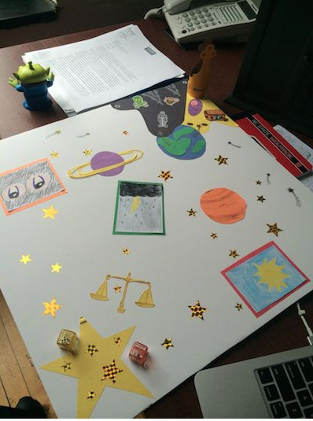
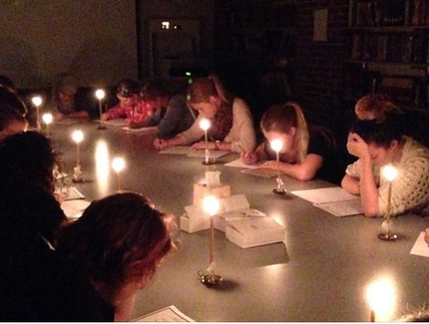
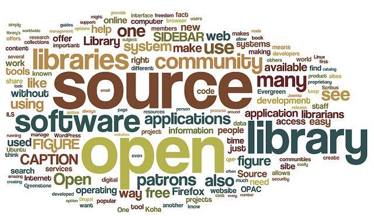
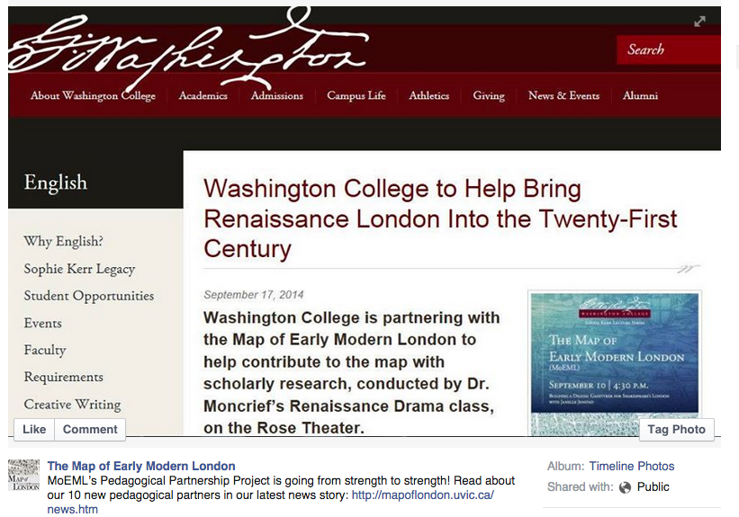
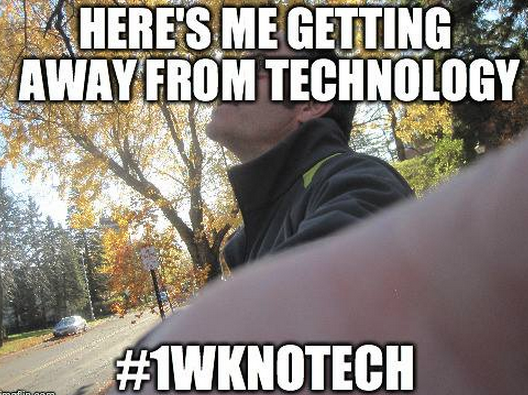

# INTERFACE

## Kathi Inman Berens
[Affiliation] [relevant website]

KATHY: List your affiliation (or non-affiliation?) and your blog URL or any other website

## Resources

* "Shakespeare in Code: Sonnet Conversion," Helen Burgess, http://userpages.umbc.edu/~burgess/442/ (Syllabus)
* "Simulating the Scriptorium," Ryan Cordell, http://f14tot.ryancordell.org/2014/09/16/lab-3-simulating-the-scriptorium/ (Lesson Plan)  
* "English 10 Introduction to Lit: <em>House of Leaves</em> Remix Assignment," Jeremy Douglass and Steven Pokornowski, http://english10introductiontolit.tumblr.com/ (Assignment)
* "How Not to Read a Victorian Novel," Paul Fyfe with open access adaptation by Ryan Cordell, http://ryancordell.org/personal/grad-proseminar-guest-talk-not-reading/ (Essay)
* "Collaborative Project on 19th Century Materials," Katherine D. Harris, http://triproftri.wordpress.com/2012/12/03/collaborative-project-on-19th-century-materials-assignment/#more-1191 (Assignment)
* "Steampunk Rochester," Trent Hergenrader, http://steampunkrochester.wikispaces.com/Steampunk+Rochester (Website)
* "Map of Early Modern London: Pedagogical Partners Project," Janelle Jenstad, https://www.facebook.com/317355293645/photos/a.10151531363828646.547264.317355293645/10152840660533646/?type=1 (Website)
* "Esta Vida Boricua (This Puerto Rican Life)," Sonja S. Mongar, http://estavidaboricua.com/ (Website)
* "The Twitter Essay," Jesse Stommel, http://www.hybridpedagogy.com/journal/the-twitter-essay/ (Assignment)
* "#1WkNoTech" Rob Wittig and Mark C. Marino, http://1wknotech.tumblr.com, (Website)

## Curatorial Statement 
If you've ever moved classroom chairs into a circle rather than rows, you know that the physical design of the classroom shapes student discussion.  In computational terms: you ask students to move their chairs (classroom hardware) into a circle (software) so their attention spreads from the podium to other students (an action) that leads students to talk directly with each other (an output).  In this sense and many others, the classroom is an interface: a point of contact where meaningful actions happen between students, teachers, ideas and technologies, and between our virtual and physical selves. 

I work in virtual environments of all kinds, but physical co-presence remains--for now--my preferred classroom setting because it is rich with information.  On ground, our attention zooms across sense modalities.  Classroom learning is a full-body experience.  It's proprioceptive as our sense of self extends beyond our person to include our chairs and desks, the cluster of people we sit with, and the flows of ambient light and sound responding dynamically to our presence.  Online, the pane of our attention shrinks to a manila envelope.  This is OK if what's inside the pane is constantly moving, as when we surf the Web, check our feeds, or make something.  But inside the virtual classroom, where so much of the screen is static unless the video flits between speakers and the chat bar whirls, there's little at the level of interface to hold our attention.  The user interface is crowded with elements that keep still; this is what a regular classroom may look like when students attend to the professor, but in reality attention is promisucous.  Virtual classrooms are ocular-centric.  They fall short of recreating the multisensory dimensionality, the poly- and sub-vocal soundscapes of a classroom environment.  Haptics are well-developed for games, but not at all for virtual classrooms.  This is the case because virtual classroom software hasn't yet thought outside the conceptual frame of its medial antecedent, the physical classroom.  It's a little too faithful to a (boring) notion of classroom conduct.  Just as in the early days of film, when a stationary camera recorded theatrical performance, so too in virtual classroom software we're still waiting for design that plays to its unique medial strengths.  We're waiting for that "dolly" moment.

As more universities contract with third-party vendors to build online learning environments distributed at massive scale, the standard collegiate experience might become hybrid.  As digital humanists, we should ask ourselves which aspects of our embodied classroom experience are fundamental?  When we talk about "liveness" in a classroom, are we really talking about "synchronicity"--shared, dynamic experiences of time?  Helen Burgess and Ryan Cordell, in separate projects featured here, created conditions where students physically enacted the procedural logics of Shakespearean sonnets (Burgess) and the material conditions of the scriptorium: the physically draining experience of "scrivening" by candlelight.  Could we do these projects in virtual classrooms?  Does it matter if we can't?  (I think it does.)

My goal in curating this chapter is that every reader should find at least one project that makes her think: "I can do that!"  Finding projects that would excite such feeling in a broad range of learners was my challenge and my pleasure.  Other criteria included seeking projects written by and for nonwhite audiences; using creative writing pedagogy to analyze literary texts and analytical insight to enrich creative writing; and identifying best collaboration practices.  Two assignments deserve mention because they address particular audiences even as they also transcend them.  Jesse Stommel's "Twitter Essay" could be adapted into classrooms with heavy writing/grading cycles because the scale and duration of the Twitter Essay is entirely open.  Paul Fyfe's "How to Not Read a Victorian Novel" is printed in a closed access journal and therefore is not freely shareable.  But I found that Ryan Cordell had published on his website his adaptation of Fyfe's assignment, which seems to me even better: an opportunity to watch one practitioner "fork" an assignment, modify it to his setting and target audience.  The image I chose to illustrate Fyfe's essay is a Wordle on the theme of open access.  It is shared via a Creative Commons license.

Does it matter if a classroom is a little rectangle in a building or a little rectangle above one's keyboard?  Doors are rectangles; rectangles are portals.  We walk through.  Our classrooms are defined not by walls or (browser) windows, but by interfaces of human meaning-making: relationships with each other and with the machines that amplify us.

## Curated Pedagogical Resources 

KATHY: would you mind giving each resource a title? e.g., ###Sonnets for this one. 

* Screenshot: 
* Source URL: http://helenburgess.com/395sonnets/
* Copy of the Resource: [files/interface Burgess-Sonnet_1.pdf](files/interface Burgess-Sonnet_1.pdf), [files/interface Burgess-Sonnet_2.pdf](files/interface Burgess-Sonnet_2.pdf) , [files/interface Burgess-Sonnet_3.pdf](files/interface Burgess-Sonnet_3.pdf)
* Name of Creator: Helen Burgess
* Attribution Information: Associate Professor, North Carolina State University Department of English

"You're accustomed to doing 'readings' of literature and producing a specific kind of output: a paper," Helen Burgess tells her students.  "In this exercise the 'input' will be the same . . . but the 'output' will be different.  Thus it will require two sets of skills."  Burgess's four-part "sonnet conversion" process asks students to deform Shakespeare's sonnets materially, and remediate them as: visual representations; an object comprised of fourteen parts; a schema comprised of encoding, composition and decoding (a student decodes someone else's composition); a program that builds a sonnet when it's executed.

This exercise takes "deformance" a step further by reforming ("converting") the sonnet into a computational object.  The progress through the four stages is to strip away the impressionistic and replace it with the procedural.

* Screenshot: 
* Source URL: http://f14tot.ryancordell.org/2014/09/16/lab-3-simulating-the-scriptorium/
* Name of Creator: Ryan Cordell
* Attribution Information: Assistant Professor, Northeastern University Department of English

“The candle is a non-textual medium that has profoundly affected the texts we have inherited from previous generations," observes Ryan Cordell.  Undergraduates in his "Technologies of Text" class write for a class period at a table lit by candles. Cordell reports that a fire marshal with an extinguisher at his hip monitored the entire scrivening, which was held in a windowless, enclosed room.  Students discovered that bookmaking was a laborious process when they transcribed a text of their choice from the Norton Anthology.  Hands cramped.  Eyes strained.  Backs tired.  An aching body is a very interesting classroom interface.  The point of this assignment, Cordell notes, is to "start students thinking about how canons and anthologies come to be, the complex, long textual histories that precede any piece appearing in the *Norton Anthology*'s Table of Contents."

* Screenshot: 
* Source URL: english10introductiontolit.tumblr.com
* Copy of the Resource: [pdf of assignment labeled HoL]
* Name of Creators: Jeremy Douglass and Steven Pokornowski
* Attribution Information: Douglass: Assistant Professor, University of California Santa Barbara; Pokornowski: graduate student, University of California Santa Barbara

It's ambitious to assign <em>House of Leaves</em> in an introductory literature class.  Desultory, evasive and iconic, <em>HoL</em>  will frustrate almost any reader who aims to read this text closely as humanists are trained to do.  Jeremy Douglass and Steven Pokornowski create a two-part assignment interface.  The prompt procedurally guides students through making a remix of one page--and only one page--in <em> HoL</em>.  Making their collages, students can work with digital image tools or work with the other "digital," their fingers, making collage from arts and craft supplies.  Handmade remixes are photographed; all remixes are tagged and uploaded to the class's Tumblr site which itself remixes the individual pages into a fragmentary collective.  Their heterogeneity perfectly complements the source text's unfinalizability.   

* Screenshot: 
* http://ryancordell.org/personal/grad-proseminar-guest-talk-not-reading/
* [pdf of "How Not to Read a Victorian Novel" by Fyfe]
* Fyfe: Assistant Professor, North Carolina State University Department of English; Cordell: Assistant Professor, Northeastern University Department of English

Paul Fyfe's 4-page field note about teaching senior undergraduate English majors to read Victorian novels "distantly" provides the the best introduction I've found to distant reading techniques.  Fyfe's "interrogative stance" invites students to use the sometimes confusing outputs to ask better questions that exploit the "distant" view.  Students can get frustrated by being untethered from what Marcus and Best have called the "symptomatic reading" endemic to close reading.  Fyfe teaches how to parse word frequency, concordance, and collocation to defamiliarize narrative as the primary means of knowing a novel.  Unfortunately Fyfe's article is locked in a subscription-fee publication.  Hunting for resources, I found that Ryan Cordell led a graduate workshop applying Fyfe's techniques, and published his guide on his website.  I offer Cordell's variation on Fyfe's article as a means of framing two aspects of DH interface: forking, and the importance of open-access scholarship.

* Screenshot: 
* http://triproftri.wordpress.com/2012/12/03/collaborative-project-on-19th-century-materials-assignment/#more-1191
* Associate Professor, San Jose State University Department of English
* Lower-division literature majors are new to devising substantial research projects.  To author one collaboratively makes knowledge production more complex, but also radically expands the amount of work the team can accomplish.  Harris' "Collaborative Project on 19th-Century Materials" expertly introduces students to the materiality of textual scholarship, then trains students in project management, a vital skill for any DH collaborative project. Harris makes available the Association of American Colleges and Universities rubrics for Teamwork/Collaboration to ground students' attention in specific tasks they must perform to advance the larger project.  As they toggle between embodied classroom space and work in Google Docs, student writers assess the rare book's material attributes and then move to more complex questions of content and interpretation.  The resulting project, about Louisa Henrietta Sheridan's *The Comic Offering: Satire Without Bite* is seamless, univocal prose.    

* Screenshot: 
* http://steampunkrochester.wikispaces.com/Steampunk+Rochester
* Trent Hergenrader
* Assistant Professor, Rochester Institute of Technology Department of English

Three aspects of <em>Steampunk Rochester</em> make it an exceptional digital pedagogy interface.  Blending history (1915-25), fiction, and speculative fiction, this genre-breaking/defining project is a roleplaying game layer precisely geolocated in settings in and around Rochester, NY.  Created in collaboration among four departments at R.I.T.--English, Fine Arts, Imagine Arts and Interactive Games--<em>Steampunk Rochester</em> will feed the local community with grade-A story even as it also turns the city into a game lab.  The large <em>Steampunk Rochester</em> wiki is already well populated with the people, places and things that will become the raw material for the interactive video game.  Trent Hergenrader's students, nimbly moving between play and creative writing, are engaging colleagues across the university in a highly applicative part of the creative digital humanities, where interdisciplinary projects make a "classroom" that's equal parts off-campus physical location, embodied imagination and game mechanic.  

* Screenshot: 
* https://www.facebook.com/permalink.php?story_fbid=10152947852203646&id=317355293645
* Janelle Jenstad
* Associate Professor, University of Victoria Department of English

Many people have heard of <em>Map of Early Modern London</em>, now in its fifteenth year, but fewer may know about its new “Pedagogical Partners” project which invites scholars and teachers to incorporate a MoEML module into their early modern literature and theatre courses. Reaching a broad audience of potential collaborators via a Facebook group, MoEML bring students into primary research and gives them opportunity to learn by emulating the professional scholars also engaged in annotating the map.  Broad, participatory collaboration fuels MoEML's year-to-year sustainability.  Observes Project Director Janelle Jenstad: "In some cases, the work of one student provides a project for another student. For example, Jennie Butler’s old-spelling text of <em> The Quenes Majesties Progress</em> awaits editorial annotation by another student. Indeed, I hope that the possibilities of the site will never be exhausted, for its pedagogical value lies in the creative process that brings students to link their work to the map."

* Screenshot: 
* http://estavidaboricua.com/
* Sonja S. Mongar
* Professor Emerita, Universidad de Puerto Rico de Mayagüez Department of English

“Consider it not so much a canonic history—-constructed by class—-but a subjective personal history,” declares Sonja S. Mongar on the front door of *Esta Vida Boricua* ("This Puerto Rican Life").  The huge number of life writing stories housed in this wiki are "ethnically rich with threads to Cuba, Dominican Republic, South America, England, Germany, Italy, France, China, United States, Israel, Palestine, Egypt [and] Australia," presents Puerto Rico as a "fertile ground for world Diaspora."  In Spanish and English, this wiki features just one-third of its collected materials because the underfunded project hasn't the staff support to load its multimodal assets.  It seeks volunteers who might edit and post from remote locations.  *Esta Vida Boricua* has a strong pedagogical orientation with a tab specifically for educators. "Notes on Life Narrative," for example, presents fifty-two life writing classifications adapted from Sidonie Smith and Julia Watson's *Reading Autobiography*.

* Screenshot: 
* http://www.hybridpedagogy.com/journal/the-twitter-essay/
* Assistant Professor, University of Wisconsin-Madison, Digital Humanities, English and Continuing Education

In the "Twitter Essay," Jesse Stommel exhorts students to convert their expertise texting and posting status updates into college writing concision.  "Students condense an argument with evidentiary support into 140 characters, which they unleash upon a hashtag (or trending topic) in the Twitterverse," he notes.  Stommel's students hew to the  usual compositional preparation sequence, with the catch that everything is done entirely in Tweets: brainstorming, composing, workshopping, and revising.  An extra layer of interface savvy comes in Stommel's attention to audience, reception and post-publication circulation: a rare opportunity to trace the "afterlife" of a comp/rhet "paper."  One essay prompt about #queer elicited from a Twitter neophyte:  #queer #kwear #qu’eer #ckwewr #QuEeR #qr #kuere #CWEER #qawear #kwier #cawe’re #ckuere #cwear #qwere #chweir #q-u-e-e-r.  In its profusion and perversion, such a Tweet "savvily disrupts how we tag ideas within a discourse."

* Screenshot: 
* http://1wknotech.tumblr.com/
* Rob Wittig, Assistant Professor at the University of Minnesota Duluth Department of Art and Design; Mark C. Marino, Associate Professor of Writing (Teaching), University of Southern California

Netprov, the text/image art game installed in social media platforms, is an ideal interface for teaching visual rhetoric, dramatic irony and mobility.  Created as a collaboration across disciplines (art and writing) and across the country (Duluth and L.A.), Wittig and Marino teach students how to compose images, caption them, and collaborate with a large, crowdsourced group.  Students and faculty author alongside each other.  "Students have passive visual literacy.  They understand natively how to compose shots; a Netprov activates that knowledge," Wittig notes.  Netprov concepts should be immediately apprehensible in one definitive example.  The image of Wittig taking a selfie of himself giving up technology while walking through the woods is a visually arresting, ironic and mobile image.  Netprovs look deceptively simple, but in fact they are literary games that require conceptual planning, image and Tweet build-up before installation, and game challenges issued mid-week to spur participation through the end of the installation.

## Related Materials 
* Miriam Posner, "How Did They Make That? The Video!" *http://miriamposner.com/blog/how-did-they-make-that-the-video/*	
* Electronic Literature Organization, "Showcase of Electronic Literature," *http://eliterature.org/*
* Howard Rheingold, "The Peeragogy Handbook," *http://peeragogy.org/*
* Lori Emerson, *Reading Writing Interfaces: From the Digital to the Bookbound*, 
*https://www.upress.umn.edu/book-division/books/reading-writing-interfaces*
* Alan Liu, "DH Tools Wiki," *http://dhresourcesforprojectbuilding.pbworks.com/w/page/69244319/Digital%20Humanities%20Tools*							

## Works Cited 

Burgess, Helen.  "Shakespeare in Code: Sonnet Conversion." *http://helenburgess.com/395sonnets/*.  Web.  Accessed 15 November 2014.

Cordell, Ryan.  "Grad ProSeminar Guest Talk: Not Reading."  *http://ryancordell.org/personal/grad-proseminar-guest-talk-not-reading/*.  Web.  Accessed 15 November 2014.

-----.  "Simulating the Scriptorium."  *http://f14tot.ryancordell.org/2014/09/16/lab-3-simulating-the-scriptorium/*.  Web.  Accessed 15 November 2014.

Douglass, Jeremy and Steven Pokornowski.  "English 10 Introduction to Lit: *House of Leaves Remix Assignment*.  *http://english10introductiontolit.tumblr.com/*.  Web.  Accessed 15 November 2014.

Electronic Literature Organization.  "Showcase of Electronic Literature."  *http://eliterature.org/*.  Web.  Accessed 18 November 2014.

Emerson, Lori. *Reading Writing Interfaces: From the Digital to the Bookbound*.  Minneapolis: University of Minnesota Press.  2014.  Print.  

Engard, Nicole C.  "Open Source Wordle."  Photograph.  Flickr.  Creative Commons license.  24 May 2011.  *https://www.flickr.com/photos/nengard/5755231642/in/photolist-9Lz4RL-53R7ce-7uXbL4-55ffYS-5nDNfb-5Dgro7-5DgrpW-5DcajT-5Dcana-5nkvGJ-4VqXVU-8djbH5-57YHrp-51emGt-5q6wAg-4YZG7E-5jbNP7-4Wi7Qp-5iQ7ap-5123jf-5nkvzC-4W5TdR-53Vkg3-5nDNff-65Uc9A-4WUKcq-69F2qW-5jyMZe-56NoFi-5YeG25-4ZQfPS-86hLUv-5iQE7c-4XkEyj-5jDeBh-59GNqR-5Y2H8A-4ZWCgc-5biXNd-5jfpZC-6TzvKt-6TDwXU-63re73-8D7BKF-51we2f-4Y81JQ-khtR6X-89Cm4U-5ZeqRv-8Vzj5T.*  Web.  Accessed 18 November 2014.  

Fyfe, Paul.  "How Not To Read a Victorian Novel."  *Journal of Victorian Culture.*  Vol. 16, No.1, April 2011, 84-88.

Harris, Katherine D.  "Collaborative Assignment on Nineteenth-Century Materials Project."  *http://triproftri.wordpress.com/2012/12/03/collaborative-project-on-19th-century-materials-assignment/#more-1191.*  Web.  Accessed 15 November 2014.

Hergenrader, Trent.  *Steampunk Rochester.* *http://steampunkrochester.wikispaces.com/Steampunk+Rochester.*  Web.  Accessed 17 November 2014.

Jenstad, Janelle.  *Map of Early Modern London: Pedagogical Partners Project.*  *https://www.facebook.com/317355293645/photos/a.10151531363828646.547264.317355293645/10152840660533646/?type=1.*  Web.  Accessed 14 November 2014.

Alan Liu.  *DH Tools Wiki.*  *http://dhresourcesforprojectbuilding.pbworks.com/w/page/69244319/Digital%20Humanities%20Tools.*  Web.  Accessed 14 November 2014.

Louisa Henrietta Sheridan's *The Comic Offering: Satire Without the Bite.*  *http://scottfengl56b.wordpress.com/2012/10/11/louisa-henrietta-sheridans-the-comic-offering-satire-without-bite/* Web.  Accessed 18 November 2014.  

Mongar, Sonja S.  *Esta Vida Boricua.*  *http://estavidaboricua.com*  Web.  Accessed 15 November 2014.

Posner, Miriam.  "How Did They Make That? The Video!"  *http://miriamposner.com/blog/how-did-they-make-that-the-video/*  Web.  Accessed 15 November 2014.

Rheingold, Howard.  *The Peeragogy Handbook.* *http://peeragogy.org/*  Web. Accessed 15 November 2014.

Stommel, Jesse.  "The Twitter Essay."  *http://www.hybridpedagogy.com/journal/the-twitter-essay/*  Web.  Accessed 15 November 2014.				

Wittig, Rob and Mark C. Marino. *1WkNoTech.*  *http://1wknotech.tumblr.com/*  Web.  Accessed 14 November 2014.  

