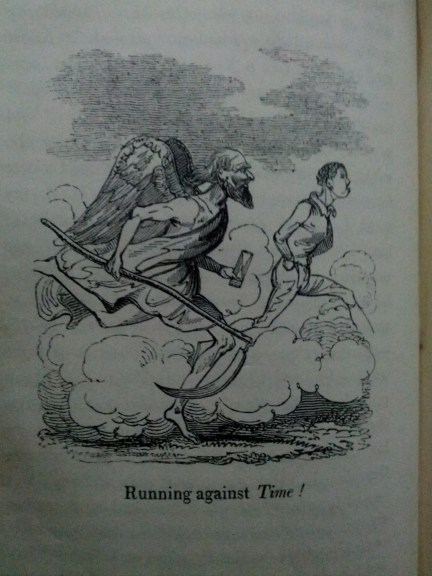

# INTERFACE (Draft)

### [Kathi Inman Berens](http://kathiiberens.com)
Portland State University | [English Department - Book Publishing] (http://publishing.pdx.edu/faculty/)

---

##### Publication Status:
* unreviewed draft
* draft version undergoing editorial review
* **draft version undergoing peer-to-peer review** https://digitalpedagogy.commons.mla.org/
* published 

--- 

## CURATORIAL STATEMENT

Anyone who has rearranged classroom chairs from rows into a circle knows that the physical space of a classroom shapes students' interaction. So too digital interfaces shape student engagement in online learning environments. "The classroom" is a heuristic that manifests itself more variously today than when the classroom was bound by walls and directed student gaze to the lecturn, or around a seminar table. Like “classroom,” "interface" is a heuristic that illuminates the changing ways students encounter learning digitally: synchronously in face-to-face or virtual/embodied blended classrooms; asynchronously in distance learning and open access platforms like iTunes U. or Coursera; or self-paced and -designed courses using YouTube tutorials and other "found" materials. In this keyword, "interface" refers to the meeting points between people and technologies that facilitate learning, from code to books to candlelight.  Preeminently in the digital humanities, "interface" is a function of code and markup, the human-readable language that translates bi-directionally between human command and machine output.

Building a webpage in HTML and CSS remains a core interface literacy. No one today needs to write HTML to build a web presence. Unlike the early days of the Web, where all elements of the user interface (UI) were customized in hand-built webpages, today in social Web interfaces such as Facebook, Twitter, Medium and the like the UI is identical but for the modest customization afforded by user-uploaded images. These corporate interfaces of the social Web remove us further from the do-it-yourself culture of hobbyists and tinkerers who made the Web an open culture of shared resources; see Lori Emerson's second chapter in **Reading Writing Interfaces** to learn more about the implications of such a transformation. Not coding, people miss critical engagement with markup language as the bridge between human expression and nonhuman operations. We also miss the pressing need for and rewards of an open Web, where people teach each other in a gift economy. In "Related Materials," see **DML Central**, funded by the University of California at Irvine, for a great repository of collaboration prototypes, teaching with technology tips, and access to tools. Miriam Posner’s brilliant, easy-to-use “DH 101” tutorials restore critical attention to interface. Her handouts teach students how to build webpages using HTML and CSS, how to clean data, and how to make visualizations and timelines. Alan Liu's more advanced **DH Toychest** is a treasure trove. Janelle Jenstad's fifteen-year-old annotation project **Map of Early Modern London** now offers collaboration opportunities for undergraduate classes outside of the University of Victoria. Anne McGrail, a professor at Lane Community College in Eugene, Oregon, spearheads the new **DH in the CC** commons.

For the ten plug-and-play assignments, I culled work that addresses a wide spectrum of student readiness and support for DH, from elite institutions to income-insecure places where the students' only access to digital tools might be free apps on a cell phone. There's a productive tension between the “task-oriented efficiency” (Drucker, 1) of interface's traditional work, and the more exploratory, metacritical uses of interface in the assignments I feature here. Helen Burgess’ students "translate" a Shakespeare sonnet into various medial forms, for example, building in four iterations of the same sonnet beginning with tactile 3D art to authoring the sonnet as an executable computer program. Ryan Cordell's students in a history of technology course replicate the conditions of the medieval scriptorium. These defamiliarizations of the physical classroom-as-interface let us "see" the classroom as a medium-specific environment where liveness is a unique feature of embodied university instruction.
  
Does it matter if a classroom is a little rectangle in a building or a little rectangle above one’s keyboard? Doors are rectangles; rectangles are portals. We walk through. Our classrooms are defined not by walls or Windows, but by interfaces of networked collaboration critically appraised.

## CURATED ARTIFACTS

### Remediated Shakespeare Sonnets

* Source URL: <http://helenburgess.com/395sonnets/>
* Copy of Artifact: [files/interface-Burgess-Sonnet_1.pdf](files/interface-Burgess-Sonnet_1.pdf), [files/interface-Burgess-Sonnet_2.pdf](files/interface-Burgess-Sonnet_2.pdf) , [files/interface-Burgess-Sonnet_3.pdf](files/interface-Burgess-Sonnet_3.pdf)
* Creator: Helen Burgess (North Carolina State University)

"You're accustomed to doing 'readings' of literature and producing a specific kind of output: a paper," Helen Burgess tells her students. "In this exercise the 'input' will be the same . . . but the 'output' will be different. Thus it will require two sets of skills." Burgess's four-part "sonnet conversion" process asks students to deform Shakespeare's sonnets materially, and remediate them as: visual representations; an object comprised of fourteen parts; a schema comprised of encoding, composition and decoding (a student decodes someone else's composition); a program that builds a sonnet when it's executed. This exercise takes "deformance" a step further by reforming ("converting") the sonnet into a computational object. The progress through the four stages is to strip away the impressionistic and replace it with the procedural.

### Italian Language Study Using Geospatial Methodology

* Source URL: <https://www.arcgis.com/apps/MapJournal/index.html?appid=36d80c623d9a4b4291eea52c9ae279ac>
* Copy of Artifact: forthcoming
* Creator: Clarissa Cló (San Diego State University)

Students immersed themselves in the target language from the Italian Hip Hop Archive of San Diego State University library, which owns a collection of the 1990s Italian magazine **Aelle/AL**. Selecting articles and creating story map journals using Esri ArcGIS technology, students produced geographical-based narratives with accurate satellite locations, accompanied by pictures, videos and links. Coding was not required for this web-based open source system. Students worked through complex cross-cultural concepts and terminology and located them in time and place. They applied a geospatial methodology to their language learning, showcasing Italy's regional, cultural, and linguistic diversity. The study of Italian was contextual, integrated, and meaningful.

### "Simulating the Scriptorium"

* Source URL: <http://f14tot.ryancordell.org/2014/09/16/lab-3-simulating-the-scriptorium/>
* Copy of Artifact: forthcoming
* Creator: Ryan Cordell (Northeastern University)

“The candle is a non-textual medium that has profoundly affected the texts we have inherited from previous generations," observes Ryan Cordell. Undergraduates in his "Technologies of Text" course write for a class period at a table lit by candles. Cordell reports that a fire marshal (with an extinguisher at his hip) monitored the entire scrivening, which was held in a windowless, enclosed room. Students discovered that bookmaking was a laborious process when they transcribed a text of their choice from the *Norton Anthology*. Hands cramped. Eyes strained. Backs tired. An aching body is a very interesting classroom interface. The point of this assignment, Cordell notes, is to "start students thinking about how canons and anthologies come to be, the complex, long textual histories that precede any piece appearing in the *Norton Anthology*'s Table of Contents."

### Close Reading *House of Leaves* via Tumblr

* Source URL: <http://english10introductiontolit.tumblr.com>
* Copy of Artifact: [files/interface-Douglass-Pok-ENGL-10-HoL-Remix.pdf](files/interface-Douglass-Pok-ENGL-10-HoL-Remix.pdf)
* Creators: Jeremy Douglass (University of California Santa Barbara) and Steven Pokornowski (University of California Santa Barbara)

It's ambitious to assign *House of Leaves* in an introductory literature class. Desultory, evasive and iconic, *HoL* will frustrate almost any reader who aims to read this text closely as humanists are trained to do. Jeremy Douglass and Steven Pokornowski create a two-part assignment interface. The prompt procedurally guides students through making a remix of one page--and only one page--in *HoL*. Making their collages, students can work with digital image tools or work with the other "digital," their fingers, making collage from arts and craft supplies. Handmade remixes are photographed; all remixes are tagged and uploaded to the class's Tumblr site which itself remixes the individual pages into a fragmentary collective. Their heterogeneity perfectly complements the source text's unfinalizability.

### Distant Reading Victorian Novels

* Source URL: <http://ryancordell.org/personal/grad-proseminar-guest-talk-not-reading/>
* Source URL: open-access pre-print of the original article <http://diginole.lib.fsu.edu/eng_faculty_publications/2/>
* Copy of Artifact: forthcoming
* Creators: Paul Fyfe (North Carolina State University); forked by Ryan Cordell (Northeastern University)

Paul Fyfe's 4-page field note about teaching senior undergraduate English majors to read Victorian novels "distantly" provides the the best introduction I've found to distant reading techniques. Fyfe's "interrogative stance" invites students to use the sometimes confusing outputs to ask better questions that exploit the "distant" view of novels they *haven't* read. Students can get frustrated by being untethered from what Marcus and Best have called the "symptomatic reading" endemic to close reading. Fyfe teaches how to parse word frequency, concordance, and collocation to defamiliarize narrative as the primary means of knowing a novel. Unfortunately Fyfe's article is locked in a subscription-fee publication. Hunting for resources, I found that Ryan Cordell led a graduate workshop applying Fyfe's techniques, and published his guide on his website. I offer Cordell's variation on Fyfe's article as a means of framing two aspects of Digital Humanities interface: forking and the importance of open-access scholarship.

### Rare Books Collaborative Undergraduate Research Project

* Source URL: <http://triproftri.wordpress.com/2012/12/03/collaborative-project-on-19th-century-materials-assignment/#more-1191>
* Copy of Artifact: forthcoming
* Creator: Katherine D. Harris (San Jose State University)

Lower-division literature majors are new to devising substantial research projects. To author one collaboratively makes knowledge production more complex, but also radically expands the amount of work the team can accomplish. Harris's "Collaborative Project on 19th-Century Materials" expertly introduces students to the materiality of textual scholarship, then trains students in project management, a vital skill for any Digital Humanities collaborative project. Harris makes available the Association of American Colleges and Universities rubrics for Teamwork/Collaboration to ground students' attention in specific tasks they must perform to advance the larger project. As they toggle between embodied classroom space and work in Google Docs, student writers assess the rare book's material attributes and then move to more complex questions of content and interpretation. One resulting project, about Louisa Henrietta Sheridan's *The Comic Offering: Satire Without Bite* is seamless, univocal prose.

### Historical Role Playing Game: Interdisciplinary Collaboration

* Source URL: <http://steampunkrochester.wikispaces.com/Steampunk+Rochester>
* Copy of Artifact: forthcoming
* Creator: Trent Hergenrader (Rochester Institute of Technology)

Three aspects of *Steampunk Rochester* make it an exceptional digital pedagogy interface. It blends real-life history of Rochester, New York 1915-25, site of the host university. Students create fictional characters where Rochester becomes an open-access playable game space. The result is speculative fiction that relies on the structured archive of wiki, a steampunk vision of the future that finds new technologic aspects in dynamic roleplay of the past.

Created in collaboration among four departments at the Rochester Institute of Technology (English, Fine Arts, Interactive Games and Media, and 3D Digital Design) *Steampunk Rochester* will feed the local community with engaging story even as it also turns the city into a game lab. The large *Steampunk Rochester* wiki is already well populated with the people, places, and things that will become the raw material for the interactive video game to be developed. Trent Hergenrader's students, nimbly moving between play and creative writing, are engaging colleagues across the university in applied creative arts, where interdisciplinary projects make a "classroom" that is equal parts off-campus physical location, embodied imagination, wiki, and game mechanic.

### Giving Voice to Spanish-Language Life Histories

* Source URL: <http://estavidaboricua.com/>
* Copy of Artifact: forthcoming
* Creator: Sonja S. Mongar (Universidad de Puerto Rico de Mayagüez)

“Consider it not so much a canonic history—constructed by class—but a subjective personal history,” declares Sonja S. Mongar on the front door of *Esta Vida Boricua* ("This Puerto Rican Life"). The huge number of life writing stories housed in this wiki are "ethnically rich with threads to Cuba, Dominican Republic, South America, England, Germany, Italy, France, China, United States, Israel, Palestine, Egypt [and] Australia," presents Puerto Rico as a "fertile ground for world Diaspora." In Spanish and English, this wiki features just one-third of its collected materials because the underfunded project hasn't the staff support to load its multimodal assets. It seeks volunteers who might edit and post from remote locations. *Esta Vida Boricua* has a strong pedagogical orientation with a tab specifically for educators: http://estavidaboricua.com/for-educators/ "Notes on Life Narrative," for example, presents fifty-two life writing classifications adapted from Sidonie Smith and Julia Watson's *Reading Autobiography*. The project developers invite classes to participate in content creation by taking some of the raw materials (mostly audio interviews) and preparing them for web distribution via the wiki.

### Participatory, Short-Form Critical Essay Writing

* Source URL: <http://www.hybridpedagogy.com/journal/the-twitter-essay/>
* Copy of Artifact: forthcoming
* Creator: Jesse Stommel (University of Wisconsin-Madison)

In the "Twitter Essay," Jesse Stommel exhorts students to convert their expertise texting and posting status updates into college writing concision. This is an ideal assignment for those new to digital interfaces because its instantaneous publication provides the possibility of immediate reception and feedback beyond the classroom. Faculty new to digital pedagogy should practice first on their own to learn firsthand the dynamics of such publication. Stommel's students hew to the usual compositional preparation sequence, with the catch that everything is done entirely in Tweets: brainstorming, composing, workshopping, and revising. An extra layer of interface savvy comes in Stommel's attention to audience, reception and post-publication circulation: a rare opportunity to trace the "afterlife" of a comp/rhet "paper." One essay prompt about #queer elicited from a Twitter neophyte: #queer #kwear #qu’eer #ckwewr #QuEeR #qr #kuere #CWEER #qawear #kwier #cawe’re #ckuere #cwear #qwere #chweir #q-u-e-e-r. In its profusion and perversion, such a Tweet "savvily disrupts how we tag ideas within a discourse."

### Mobile Text-and-Image Collaborative Story: 1WkNoTech

* Source URL: <http://1wknotech.tumblr.com/>
* Copy of Artifact: forthcoming
* Creator: Rob Wittig (University of Minnesota Duluth Department of Art and Design); Mark C. Marino (University of Southern California)

Netprov, the text/image art game installed in social media platforms, is an ideal interface for teaching visual rhetoric, dramatic irony and mobility. Created as a collaboration across disciplines (art and writing) and across the country (Duluth and Los Angeles), Wittig and Marino teach students how to compose images, caption them, and collaborate with a large, crowdsourced group. Students and faculty author alongside each other. "Students have passive visual literacy. They understand natively how to compose shots; a Netprov activates that knowledge," Wittig notes. Netprov concepts should be immediately apprehensible in one definitive example. The image of Wittig taking a selfie of himself giving up technology while walking through the woods is a visually arresting, ironic, and mobile image. Netprovs look deceptively simple, but in fact they are literary games that require conceptual planning, image and Tweet build-up before installation, and game challenges issued mid-week to spur participation through the end of the installation.

## RELATED MATERIALS
Digital Media and Learning Central, <http://dmlcentral.net/>

Janelle Jenstad, "*Early Modern Map of London*: Open Pedagogical Partnerships" <http://mapoflondon.uvic.ca/pedagogical_partnership.htm>

Alan Liu, "DH Toychest" (DH "tools for project building") <http://dhresourcesforprojectbuilding.pbworks.com/w/page/69244319/Digital%20Humanities%20Tools>

Anne McGrail, "Digital Humanities at the Community College: a Commons" <https://dhatthecc.lanecc.edu/>

Miriam Posner, "DH 101" <http://miriamposner.com/dh101f15/>

## WORKS CITED

Burgess, Helen. "Shakespeare in Code: Sonnet Conversion." <http://helenburgess.com/395sonnets/>. Web. Accessed 15 November 2014.

Cordell, Ryan. "Grad ProSeminar Guest Talk: Not Reading." <http://ryancordell.org/personal/grad-proseminar-guest-talk-not-reading/> Web. Accessed 15 November 2014.

———. "Simulating the Scriptorium." <http://f14tot.ryancordell.org/2014/09/16/lab-3-simulating-the-scriptorium/> Web. Accessed 15 November 2014.

Cramer, Florian and Matthew Fuller. "Interface." *Software Studies: a Lexicon*, ed. Matthew Fuller. Cambridge: M.I.T. Press. 2008.

Digital Media and Learning Research Hub.  "Digital Media and Learning Central: The Power of Participation." http://dmlcentral.net/  Web. Accessed 4 April 2016.

Douglass, Jeremy and Steven Pokornowski. "English 10 Introduction to Lit: *House of Leaves* Remix Assignment." <http://english10introductiontolit.tumblr.com/> Web. Accessed 15 November 2014.

Drucker, Johanna. "Humanities Approaches to Interface Theory." *Culture Machine* 12 (2011).  <http://www.culturemachine.net/index.php/cm/article/viewArticle/434> Web. Accessed 4 April 2016.

Emerson, Lori. *Reading Writing Interfaces: From the Digital to the Bookbound.* Minneapolis: University of Minnesota Press. 2014. Print.

Engard, Nicole C. "Open Source Wordle." Photograph. Flickr. Creative Commons license. 24 May 2011. <https://www.flickr.com/photos/nengard/5755231642/in/photolist-9Lz4RL-53R7ce-7uXbL4-55ffYS-5nDNfb-5Dgro7-5DgrpW-5DcajT-5Dcana-5nkvGJ-4VqXVU-8djbH5-57YHrp-51emGt-5q6wAg-4YZG7E-5jbNP7-4Wi7Qp-5iQ7ap-5123jf-5nkvzC-4W5TdR-53Vkg3-5nDNff-65Uc9A-4WUKcq-69F2qW-5jyMZe-56NoFi-5YeG25-4ZQfPS-86hLUv-5iQE7c-4XkEyj-5jDeBh-59GNqR-5Y2H8A-4ZWCgc-5biXNd-5jfpZC-6TzvKt-6TDwXU-63re73-8D7BKF-51we2f-4Y81JQ-khtR6X-89Cm4U-5ZeqRv-8Vzj5T>. Web. Accessed 18 November 2014.

Fyfe, Paul. "How Not To Read a Victorian Novel." *Journal of Victorian Culture.* Vol. 16, No.1, April 2011, 84-88.

Harris, Katherine D. "Collaborative Assignment on Nineteenth-Century Materials Project." <http://triproftri.wordpress.com/2012/12/03/collaborative-project-on-19th-century-materials-assignment/#more-1191> Web. Accessed 15 November 2014.

Hergenrader, Trent. *Steampunk Rochester.* <http://steampunkrochester.wikispaces.com/Steampunk+Rochester> Web. Accessed 17 November 2014.

Jenstad, Janelle. *Map of Early Modern London: Pedagogical Partners Project.* <http://mapoflondon.uvic.ca/pedagogical_partnership.htm> Web. Accessed 14 November 2014.

Liu, Alan. *DH Tools Wiki.* <http://dhresourcesforprojectbuilding.pbworks.com/w/page/69244319/Digital%20Humanities%20Tools> Web. Accessed 14 November 2014.

Louisa Henrietta Sheridan's *The Comic Offering: Satire Without the Bite.* <http://scottfengl56b.wordpress.com/2012/10/11/louisa-henrietta-sheridans-the-comic-offering-satire-without-bite/> Web. Accessed 18 November 2014.

Mongar, Sonja S. *Esta Vida Boricua.* <http://estavidaboricua.com> Web. Accessed 15 November 2014.

Posner, Miriam. "DH 101" <http://miriamposner.com/dh101f15/>. Web. Accessed 4 April 2016.

Stommel, Jesse. "12 Steps for Creating a Digital Assignment or Hybrid Class," <http://www.jessestommel.com/blog/files/12-step-digital-assignment-hybrid-class.html> Web. Accessed 15 November 2014.

———. "The Twitter Essay." <http://www.hybridpedagogy.com/journal/the-twitter-essay/> Web. Accessed 15 November 2014.

Wittig, Rob and Mark C. Marino. *1WkNoTech.* <http://1wknotech.tumblr.com/> Web. Accessed 14 November 2014.
