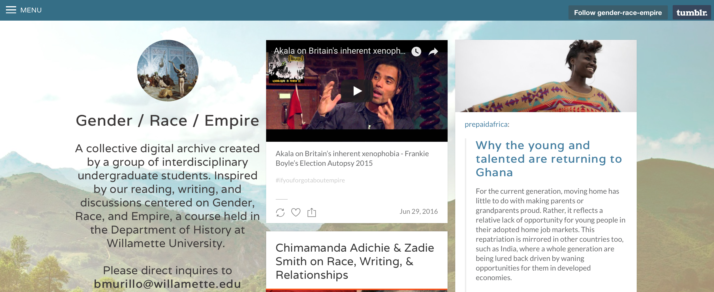
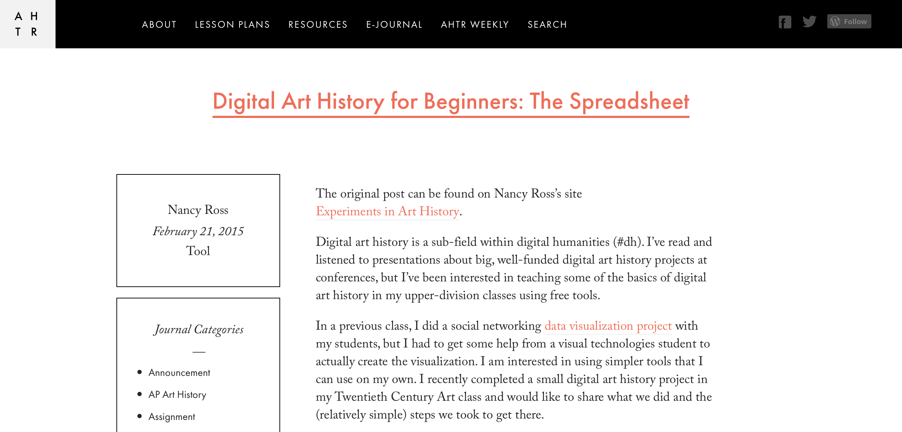
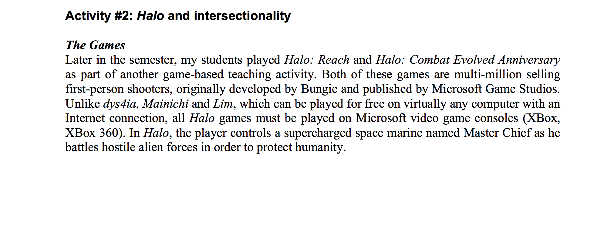

# Intersectionality

### Roopika Risam
Salem State University | Department of English | [Website](http://roopikarisam.com)

##### Publication Status:
* unreviewed draft
* draft version undergoing editorial review
* **draft version undergoing peer-to-peer review**
* published 

--- 

## CURATORIAL STATEMENT

In 1989, critical race scholar and legal theorist Kimberlé Crenshaw coined the term “intersectionality” to address connections between multiple dimensions of oppression that shape lived experience. In her work with women living in domestic violence shelters in Los Angeles, Crenshaw observed that black women were disproportionately affected by the compounding effects of race, gender, and class. At the same time, contemporary discourse on feminism failed to account for the specific needs of women of color, while anti-racist movements failed to attend to the needs of women (1243-4). Crenshaw’s influential formulation has been expanded over time by scholars including Maria Carbin, Sara Edenheim, Bandana Purkayastha, and Kathy Davis to reflect a broader range of intersections of identity categories and axes of oppression that produce and preclude privilege, shaping lived experience around the world. 

Curatorial statements in this collection for keywords such as “Queer,” “Sexuality,” and “Gender” can only be understood in terms of their relationships to each other, as well as to other categories such as race and class. Therefore, intersectionality itself is an essential keyword because it provides language and a theoretical basis for conceptualizing the matrices that shape both lived experience and oppression - and for using this mode of thought to develop digital literacy and critical thinking skills with students. 

In the context of pedagogy, intersectionality asks students to think beyond narrow binaries that overdetermine contemporary discourse on identity and power. It offers them a framework through which they can deconstruct their own subject positions and better understand the privileges and politics that are shaping their lives. Because intersectionality moves beyond single-issue approaches to identity, it promotes development of allyship and counters the effects of public discourse that pits identity categories against each other. Blending intersectionality with digital pedagogy enables students to become critical users and makers of technology in this vein. Through intersectional digital pedagogy, students articulate their own identities and the role of technology and culture in constructing these identities. Additionally, they are better equipped to understand the development of technology in the contexts of culture, history, literature, and art. 

The artifacts collected here include student work, standalone assignments, assignment sequences, and course syllabi that position intersectionality at the heart of inquiry and embody intersectional digital pedagogy. They represent the materials that have influenced my “Race and Cyberspace” course, a first-year seminar that engages students with intersectional approaches to race, gender, class, and other axes of identity within cultures of technology. Attending to a vast range of institutional contexts, these artifacts take advantage of open source, out-of-the-box tools and cheaply available technologies that can be easily incorporated into classes at universities without access to high-powered computing resources, digital humanities centers, or substantial financial resources. They offer students the opportunity to explore a range of intersecting identities, while foregrounding methods that can be adapted for a variety of course topics. These artifacts combine theoretical analysis with hands-on, experiential learning, while demonstrating that digital pedagogy can be integrated across multiple disciplines. As they promote digital literacies, they also foster collaboration. Moreover, they represent the broadest conception of digital methods, from digital cultural mapping, new media analysis, and data visualization to digital storytelling and digital archives to video games and wearables. In doing so, these artifacts demonstrate how an intersectional lens can facilitate a range of approaches to digital pedagogy that take into account the intersections of race, class, gender, sexuality, nation, and other axes of oppression. 

## CURATED ARTIFACTS 

#### “Runaway Quilt Project”

* Artifact Type: student work
* Source URL: [http://runawayquiltproject.org](http://runawayquiltproject.org)
* Artifact Permissions: Copyright
* Copy of Artifact: [files/intersectionality-Runaway-Quilt-Project.pdf](files/intersectionality-Runaway-Quilt-Project.pdf)
* Creator: Deimosa Webber-Bey (Pratt Institute School of Library and Information Science)

Created for an assignment in Chris Alen Sula’s [introductory digital humanities course](http://chrisalensula.org/digital-humanities-spring-2012/) at the Pratt Institute, Deimosa Webber-Bey’s *Runaway Quilt Project* provides an example of how students can draw on their personal experiences at the intersections of their own identities to develop a digital project in the context of a course. Drawing on her work as an African and African American studies scholar and experienced quilter, Webber-Bey explores the claim that quilts served as signs along the Underground Railroad through many forms of digital data analysis: data visualizations in Tableau Public, digital annotations using Digress.it, word frequency analysis through Google N-grams Viewer, a timeline in TimelineJS, geospatial mapping using Leaflet Maps Marker, and network analysis in Cytoscape. Each method used in the project draws on material introduced in Sula’s course. This collection of assignments serves as an exemplar for how students can undertake multiple, small-scale analyses to create a multi-pronged approach to a single research topic. Together, these modular pieces suggest how instructors can assist students in developing substantial projects on the complex intersections of race and gender by revisiting a data set through different research methods.

#### “Teaching Artifact - Assignment: Digital Ethnography”

* Artifact Type: assignment
* Source URL: [http://joglep.com/files/5914/3934/2744/5._Teaching_Artifact-Ostergaard-Digital_Ethnography.pdf](http://joglep.com/files/5914/3934/2744/5._Teaching_Artifact-Ostergaard-Digital_Ethnography.pdf)
* Artifact Permissions: Unknown
* Copy of Artifact: [files/intersectionality-Digital-Ethnography.pdf](files/intersectionality-Digital-Ethnography.pdf)
* Creator: Lori Ostergaard (Oakland University)

The digital ethnography assignment designed by Lori Ostergaard positions intersectionality at the heart of the rhetorical and ethical dimensions of the internet. Among the goals for Ostergaard’s course are “study and apply theories of digital culture and its effects on online communities, especially in relation to ethnicity, gender, class, physical ability, and sexual orientation.” After initial assignments examining students’ own online identities and researching emerging media forms, the digital ethnography assignment requires them to interact with and analyze online communities as participant-observers. In their guided analysis, students apply their understanding of intersectional theories of identity to their study of the online community. They also produce a multimodal final project on the community, composing either a hyperlinked website or article, wiki article, narrated slideshow, or documentary video. This assignment encourages students to understand the relationship between online and offline identities by examining behaviors and language used in online communities. In their applied analysis, students explain their new-found understanding of how the internet is grounded in intersecting axes of oppression. While this assignment is useful for ethnography, I have used it in my own classes for autoethnography - asking students to examine their own interactions with others online through platforms like Twitter, Facebook, Reddit, and Snapchat. Instructors can use this exercise to encourage students to think critically about their own roles as users and creators of online content. This assignment can also be used to help students reflect on how the intersecting dimensions of their own identities shape their experiences online and their attitudes about life offline. 

#### “ENG/GBS/WGS 3298: Women Writing Worldwide Global Focus Mapping Project”

* Artifact Type: assignment
* Source URL: [http://www.highpoint.edu/digiped/files/2014/02/20140331_JennBrandt_0001.pdf](http://www.highpoint.edu/digiped/files/2014/02/20140331_JennBrandt_0001.pdf)
* Artifact Permissions: Unknown
* Copy of Artifact: [files/intersectionality-Women-Writing-Worldwide.pdf](files/intersectionality-Women-Writing-Worldwide.pdf)
* Creator: Jenn Brandt (High Point University)

Through the assignment “Women Writing Worldwide,” Jenn Brandt’s students explore the affordances of digital cultural mapping for understanding the relationship between transnational feminist theory and global contemporary women’s fiction. She contends that mapping engages students from diverse backgrounds and connects them to the issues that affect women’s lives around the globe. Students begin by using the Tour Builder storytelling tool in Google Earth to map their own lives and tell their own stories. After connecting them to the platform through their own experiences, Brandt asks students to map the course material. In the collaborative project, each student is assigned a country and asked to research its context for women’s experiences. This assignment is significant for intersectional digital pedagogy because it challenges students to think critically about the different types of oppression experienced by women around the world and to understand the global as an assemblage of the local. Instructors who wish to connect students' understanding of their own intersecting identities to course content can draw on Brandt's model for class mapping assignments as an exemplar. 

#### “Gender/Race/Empire” 

* Artifact Type: student work 
* Source URL: [http://gender-race-empire.tumblr.com](http://gender-race-empire.tumblr.com)
* Artifact Permissions: Unknown
* Copy of Artifact: [files/intersectionality-Gender-Race-Empire.pdf](files/intersectionality-Gender-Race-Empire.pdf)
* Creator: Bianca Murillo (California State University, Dominguez Hills)

Created by Bianca Murillo’s history students, [“Gender, Race & Empire”](http://gender-race-empire.tumblr.com) offers an example of engaging students with the microblogging platform Tumblr to build an intersectional digital archive. To contribute to the archive, students post short, frequent reflections on course readings and discussions to explore the intersections of empire and sexuality through both historical and contemporary examples of racism. Using Tumblr not only facilitates frequent posting but also aggregates student work in an archive that allows them to work collaboratively, building on each other’s posts throughout the course. These Tumblr posts provide hands-on experience in the constructedness of archives and how both history and archives are shaped by the intersections of race, sexuality, and colonialism. Murillo notes that the assignment poses a challenge for assessment, for which she offers group responses in class, and suggests that students find freedom to experiment in the assignment. Instructors interested in creating collaborative class archives that allow students to explore the intersections of identity such as race, gender, and sexuality can draw on Murillo’s concrete advice for a strict posting schedule, guidelines, and use of hashtags to track discussion topics and connections between themes in the Tumblr archive over time. 

#### “U Stories: Latina Life Stories”

* Artifact Type: video
* Source URL: [https://www.youtube.com/watch?v=bLbh2gw8EsA](https://www.youtube.com/watch?v=bLbh2gw8EsA)
* Artifact Permissions: Standard YouTube License
* Copy of Artifact: [files/intersectionality-Latina-Life-Stories.mp4](files/intersectionality-Latina-Life-Stories.mp4)
* Creator: Rina Benmayor (California State University, Monterey Bay)

Rina Benmayor’s work with students on Latina Life Stories at California State, Monterey Bay connects students with the intersections of race, ethnicity, class, immigration status, sexuality, and technology. After studying writing by Latinas of Mexican, Puerto Rican, Dominican, Cuban, Chicana, and mixed heritage, students produce digital stories exploring their own identities and experiences. In these stories, Benmayor’s students share personal and family histories on themes like bodies, migration, and violence. By encouraging students to produce digital stories, Benmayor helps them find their own voices as writers and to reflect on their own histories, situated at the intersections of their identities. Additionally, the assignment suggests how instructors can facilitate students' experiences as critical makers of technology, blending recorded narrative with visuals to bring their personal stories to life. 

#### “Digital Art History for Beginners: The Spreadsheet”

* Artifact Type: assignment
* Source URL: [http://arthistoryteachingresources.org/2015/02/digital-art-history-for-beginners-the-spreadsheet/](http://arthistoryteachingresources.org/2015/02/digital-art-history-for-beginners-the-spreadsheet/)
* Artifact Permissions: CC-BY-NC 4.0
* Copy of Artifact: [files/intersectionality-Digital-Art-History.pdf](files/intersectionality-Digital-Art-History.pdf)
* Creator: Nancy Ross (Dixie State University)

In this assignment, Nancy Ross describes her approach to teaching at the intersections of gender and class in 20th century art history through data visualization. Drawing on data from the Armory Show of 1913 exhibition catalog, Ross engages her students in finding data, developing data sets, identifying sets of questions intended to promote intersectional inquiry, and digging into the data to begin finding answers for these questions. She also discusses making graphs to visualize the data, then building on them to create more complicated ones. Ross’s approach speaks to the challenges she has experienced while teaching topics about topics like gender and sexuality at a conservative university in Utah and to her success with teaching digital art history through intersectional analysis. Instructors can draw on assignments such as these to give students the opportunity to challenge their own biases, prejudices, and deeply held beliefs about the intersections of identity categories within cultural production, whether in art history or in other disciplines.

#### Teaching Embodiment through Technology

* Artifact Type: assignment
* Source URL: [http://www.culanth.org/fieldsights/682-teaching-embodiment-through-technology](http://www.culanth.org/fieldsights/682-teaching-embodiment-through-technology)
* Artifact Permissions: CC-BY-NC-SA 4.0
* Copy of Artifact: [files/intersectionality-Teaching-Embodiment-through-Technology.pdf](files/intersectionality-Teaching-Embodiment-through-Technology.pdf)
* Creators: Leah Zani (University of California, Irvine) and Marzieh Kaivanara (University of Bristol)

Leah Zani and Marzieh Kaivanara’s modular assignment sequence asks students to think critically about the technologized body. Their goal for this sequence is to encourage students to understand their own bodies in relation to technology and power. They begin the assignment with theoretical discussions of race, gender, and other facets of identity. Students participate in activities intended to connect them with their own bodies and supplement their understanding of embodiment. Then, Zani and Kaivanara introduce students to scholarship on technological embodiment. Finally, the class collectively analyzes images of technologized bodies sourced by students. Zani and Kaivanara then ask their students to consider their own use of bodily technologies, from glasses to cavities to wearable activity monitors. Instructors can directly implement or adapt Zani and Kaivanara's assignment to create space for critical reflection on the relationship between gender, ability, and technology. 

#### “Activity #2: *Halo* and Intersectionality”

* Artifact Type: article
* Source URL: [http://journals.sfu.ca/loading/index.php/loading/article/viewFile/135/166](http://journals.sfu.ca/loading/index.php/loading/article/viewFile/135/166)
* Artifact Permissions: Open access
* Copy of Artifact: [files/intersectionality-Halo-and-Intersectionality.pdf](files/intersectionality-Video-Games-as-Feminist-Pedagogy.pdf)
* Creator: Samantha Allen (Independent Scholar)

In her article positioning video games as feminist pedagogy, Samantha Allen describes two class activities that promote critical inquiry of identity in video games. The second activity, "*Halo* and Intersectionality" guides students through the experience of playing the mass-market military science-fiction first person shooter game *Halo*. Allen intersperses game play with discussion groups to facilitate critical thinking about the game and to examine both non-intersectional and intersectional dimensions of power inherent in games, such as the increased difficulty of game play for characters whose identities converge around multiple axes of oppression. By first asking students to work in groups focused on one axis of identity, then reconfiguring the groups into "intersectional think tanks," Allen facilitates students' understanding of how intersectionality articulates compounded oppression for particular bodies. These assignments take advantage of students’ immersion in technological cultures to introduce theories of intersectionality and challenge them to consider their own experiences in relation to those who may not share them. Instructors interested in using video games in their classrooms can draw on Allen's model for guiding students through video game analysis through intersectional lenses, while her model for promoting intersectional thought through "think tanks" has broader resonance for other approaches to digital pedagogy beyond the video game genre. 

#### “Panama Silver, Asian Gold: Migration, Money, and the Making of the Modern Caribbean & Panama Silver, Asian Gold: Reimagining Diasporas, Archives, and the Humanities”

* Artifact type: syllabi
* Source URL: [http://dloc.com/digital/panamasilver](http://dloc.com/digital/panamasilver)
* Artifact Permissions: All rights reserved
* Copy of Artifact: [files/intersectionality-Panama-Silver-Asian-Gold.pdf](files/intersectionality-Panama-Silver-Asian-Gold.pdf)
* Creators: Leah Rosenberg, Donette Francis, and Rhonda Cobham-Sander (University of Florida)

“Panama Silver, Asian Gold: Reimagining Diasporas, Archives, and the Humanities” is the latest iteration of a collaborative, cross-institutional course taught at Amherst College, University of Florida, University of Miami, and the University of the West Indies, Cave Hill, Barbados. The first iteration, "Panama Silver, Asian Gold: Migration, Money, and the Making of the Modern Caribbean, was taught in 2013 at Amherst, University of Florida, and University of Miami. Students in the course undertake archival research, digital scholarship, and literary studies of the Caribbean through an interdisciplinary lens. Through class assignments, they consider the colonial dimensions of archives, examining how particular facets of identity and subalternity influence Caribbean writers and scholars. The course demonstrates that intersectionality produces a range of interventions that students can make in the archive using the Digital Library of the Caribbean. For example, Yilin Andre Wang’s [“Mapping LGBT Caribbean Literature”](https://queercaribbeanlit.wordpress.com/) explores the queer Caribbean and its intersections of race, sexuality, gender, class, and nation through maps and timelines that illustrate the rise of LGBT representations in Caribbean literature. This student project illuminates this important body of work that is often unrecognized in archives. Whether instructors are working on the Caribbean or not, these syllabi offer multiple points of entry into the study of transnationalism, intersectionality, and cross-institutional collaboration through digital pedagogy. 

#### “Fashioning Circuits” 

* Artifact type: syllabus
* Source URL: [http://fashioningcircuits.com/?page_id=2365](http://fashioningcircuits.com/?page_id=2365)
* Artifact Permissions: Copyright
* Copy of Artifact: [files/intersectionality-Fashioning-Circuits.pdf](files/intersectionality-Fashioning-Circuits.pdf)
* Creator: Kim A. Knight (University of Texas at Dallas)

Kim Knight’s course materials for “Fashioning Circuits” bring together the history of fashion and wearable electronics to explore the effects of media on bodies at the intersections of race, gender, class, ability, and sexuality. After small-scale projects to introduce students to creating wearables as well as class discussions about intersectionality and media culture, students produce social justice-oriented wearable projects intended to provide a solution to a problem, make a statement, or create a social intervention. This hands-on experience in critical making is accompanied by discussion of the affordances and limitations of fashion and its relationship with wearable electronics. While other course materials that blend new media with intersectionality tend to emphasize analysis and multimodal writing to assess student outcomes, “Fashioning Circuits” asks students to perform the critiques they are making by creating digital objects of a different kind - LED safety jackets for dogs, a carbon monoxide sensing hat, or an anti-anxiety bracelet - to demonstrate their understanding of intersectionality and technology. Instructors can incorporate Knight's course materials, whether prototyping or implementation exercises, to offer students hands-on experiences of social justice innovation. 

## RELATED MATERIALS

Davis, Dawn Rae. “Unmirroring Pedagogies: Teaching with Intersectional and Transnational Methods in the Women and Gender Studies Classroom.” *Feminist Formations,* vol. 22, no. 1, 2010, pp. 136-62. [muse.jhu.edu/article/381453](https://muse.jhu.edu/article/381453).

Risam, Roopika. “Beyond the Margins: Intersectionality and Digital Humanities.” *Digital Humanities Quarterly,* vol. 9, no. 2, 2015. [www.digitalhumanities.org/dhq/vol/9/2/000208/000208.html](http://www.digitalhumanities.org/dhq/vol/9/2/000208/000208.html).

Risam, Roopika and micha cárdenas. “De/Post/Colonial Digital Humanities.” *HILT 2015.* [www.dhtraining.org/hilt2015/course/depostcolonial-digital-humanities/](http://www.dhtraining.org/hilt2015/course/depostcolonial-digital-humanities/).

Stern, Danielle. “You Had Me at Foucault: Living Pedagogically in the Digital Age.” *Text and Performance Quarterly,* vol. 31, no. 3, 2011, pp. 249-66. [www.tandfonline.com/doi/abs/10.1080/10462937.2011.573191](http://www.tandfonline.com/doi/abs/10.1080/10462937.2011.573191).

VanGilder, Kirk. “Intersectionality and Disclosure as Pedagogical Tools." *Religious Studies News,* 29 Apr. 2015, [rsn.aarweb.org/spotlight-on/theo-ed/intersectionality/intersectionality-and-disclosure-pedagogical-tools](http://rsn.aarweb.org/spotlight-on/theo-ed/intersectionality/intersectionality-and-disclosure-pedagogical-tools). 

## WORKS CITED

Allen, Samantha. “Video Games as Feminist Pedagogy.” *The Journal of the Canadian Game Studies Association,* vol 8, no. 13, 2014, pp. 61-80. [journals.sfu.ca/loading/index.php/loading/article/viewFile/135/166](http://journals.sfu.ca/loading/index.php/loading/article/viewFile/135/166).

Benmayor, Rina. “Digital Storytelling as a Signature Pedagogy for the New Humanities.” *Arts and Humanities in Higher Education,* vol. 7, no. 2, 2008, pp. 188-204. [ahh.sagepub.com/content/7/2/188.short](http://ahh.sagepub.com/content/7/2/188.short).

Benmayor, Rita. “Latina Life Stories.” *YouTube,* uploaded by calstatemontereybay, 5 Apr. 2010, [www.youtube.com/watch?v=bLbh2gw8EsA](https://www.youtube.com/watch?v=bLbh2gw8EsA).

Brandt, Jenn. “Women Writing Worldwide Global Focus Mapping Project.” 2014, [www.highpoint.edu/digiped/files/2014/02/20140331_JennBrandt_0001.pdf](http://www.highpoint.edu/digiped/files/2014/02/20140331_JennBrandt_0001.pdf).

Carbin, Maria and Sara Edenheim. “The Intersectional Turn in Feminist Theory: A Dream of a Common Language.” *European Journal of Women’s Studies,* vol. 20, no. 3, 2013, pp. 233-48. [ejw.sagepub.com/content/20/3/233.abstract](http://ejw.sagepub.com/content/20/3/233.abstract). 

Crenshaw, Kimberlé. “Mapping the Margins: Intersectionality, Identity Politics, and Violence Against Women of Color.” *Stanford Law Review,* vol. 43, no. 6, 1991, pp. 1241-99. [www.jstor.org/stable/1229039](http://www.jstor.org/stable/1229039).

Davis, Dawn Rae. “Unmirroring Pedagogies: Teaching with Intersectional and Transnational Methods in the Women and Gender Studies Classroom.” *Feminist Formations,* vol. 22, no. 1, 2010, pp. 136-62. [muse.jhu.edu/article/381453](https://muse.jhu.edu/article/381453).

Davis, Kathy. “Intersectionality as Buzzword: A Sociology of Science Perspective on What Makes a Feminist Theory Successful.” *Feminist Theory,* vol. 9, no. 1, 2008, pp. 67-85. [fty.sagepub.com/content/9/1/67.short](http://fty.sagepub.com/content/9/1/67.short).

Knight, Kim. *Fashioning Circuits.* 2014, [fashioningcircuits.com/?page_id=2365](http://fashioningcircuits.com/?page_id=2365).

Murillo, Bianca. *Gender/Race/Empire.* [gender-race-empire.tumblr.com](http://gender-race-empire.tumblr.com).

Murillo, Bianca. “Teaching with Tumblr: Building a Digital Archive of Gender, Race & Empire.” *Notches,* 29 Sept. 2015, [notchesblog.com/2015/09/29/teaching-with-tumblr-building-a-digital-archive-of-gender-race-empire/](http://notchesblog.com/2015/09/29/teaching-with-tumblr-building-a-digital-archive-of-gender-race-empire/).

Ostergaard, Lori. “Teaching Artifact - Assignment: Digital Ethnography.” *Journal of Global Literacies, Technologies, and Emerging Pedagogies,* vol. 3, no. 1, 2015, pp. 422-25. [joglep.com/files/5914/3934/2744/5._Teaching_Artifact-Ostergaard-Digital_Ethnography.pdf](http://joglep.com/files/5914/3934/2744/5._Teaching_Artifact-Ostergaard-Digital_Ethnography.pdf).

Purkayastha, Bandana. “Intersectionality in a Transnational World.” *Gender and Society,* vol. 26, no. 1, 2012, pp. 55-66. [gas.sagepub.com/content/26/1/55.extract](http://gas.sagepub.com/content/26/1/55.extract).

Risam, Roopika. “Beyond the Margins: Intersectionality and Digital Humanities.” *Digital Humanities Quarterly,* vol. 9, no. 2, 2015. [www.digitalhumanities.org/dhq/vol/9/2/000208/000208.html](http://www.digitalhumanities.org/dhq/vol/9/2/000208/000208.html).

Risam, Roopika and micha cárdenas. “De/Post/Colonial Digital Humanities.” HILT 2015. [www.dhtraining.org/hilt2015/course/depostcolonial-digital-humanities/](http://www.dhtraining.org/hilt2015/course/depostcolonial-digital-humanities/).

Rosenberg, Leah, Donette Francis, and Rhonda Cobham-Sander. *Panama Silver, Asian Gold: Reimagining Diasporas, Archives, and the Humanities.* [dloc.com/digital/panamasilver](http://dloc.com/digital/panamasilver). 

Ross, Nancy. “Teaching Twentieth Century Art History with Gender and Data Visualizations.” *Journal of Interactive Teaching and Pedagogy,* vol. 4, 2013. [jitp.commons.gc.cuny.edu/teaching-twentieth-century-art-history-with-gender-and-data-visualizations/](http://jitp.commons.gc.cuny.edu/teaching-twentieth-century-art-history-with-gender-and-data-visualizations/).

Stern, Danielle. “You Had Me at Foucault: Living Pedagogically in the Digital Age.” *Text and Performance Quarterly,* vol. 31, no. 3, 2011, pp. 249-66. [www.tandfonline.com/doi/abs/10.1080/10462937.2011.573191](http://www.tandfonline.com/doi/abs/10.1080/10462937.2011.573191).

Sula, Chris Alen. "LIS 697 Digital Humanities—Spring 2012." *Chris Alen Sula,* 10 Nov. 2011, [chrisalensula.org/digital-humanities-spring-2012/](http://chrisalensula.org/digital-humanities-spring-2012/).

VanGilder, Kirk. “Intersectionality and Disclosure as Pedagogical Tools." *Religious Studies News,* 29 Apr. 2015, [rsn.aarweb.org/spotlight-on/theo-ed/intersectionality/intersectionality-and-disclosure-pedagogical-tools](http://rsn.aarweb.org/spotlight-on/theo-ed/intersectionality/intersectionality-and-disclosure-pedagogical-tools). 

Wang, Yilin Andre. *Mapping LGBT Caribbean Literature.* 2013, [queercaribbeanlit.wordpress.com/](https://queercaribbeanlit.wordpress.com/).

Webber-Bey, Deimosa. *Runaway Quilt Project.* 2017, [http://runawayquiltproject.org](http://runawayquiltproject.org).

Webber-Bey, Deimosa. “Runaway Quilt Project: Digital Humanities Exploration of Quilting During the Era of Slavery.” *The Journal of Interactive Teaching and Pedagogy,* vol. 6, 2014. [jitp.commons.gc.cuny.edu/runaway-quilt-project-digital-humanities-exploration-of-quilting-during-the-era-of-slavery/](http://jitp.commons.gc.cuny.edu/runaway-quilt-project-digital-humanities-exploration-of-quilting-during-the-era-of-slavery/).

Zani, Leah and Marzieh Kaivanara. “Teaching Embodiment through Technology.” *Cultural Anthropology,* 17 May 2015, [www.culanth.org/fieldsights/682-teaching-embodiment-through-technology](http://www.culanth.org/fieldsights/682-teaching-embodiment-through-technology).
