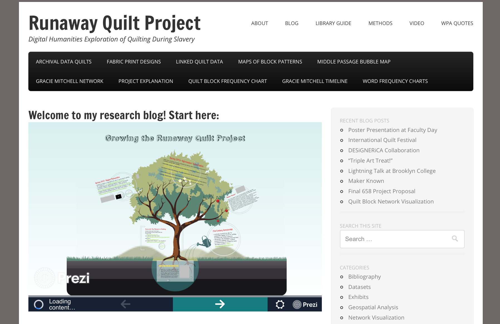
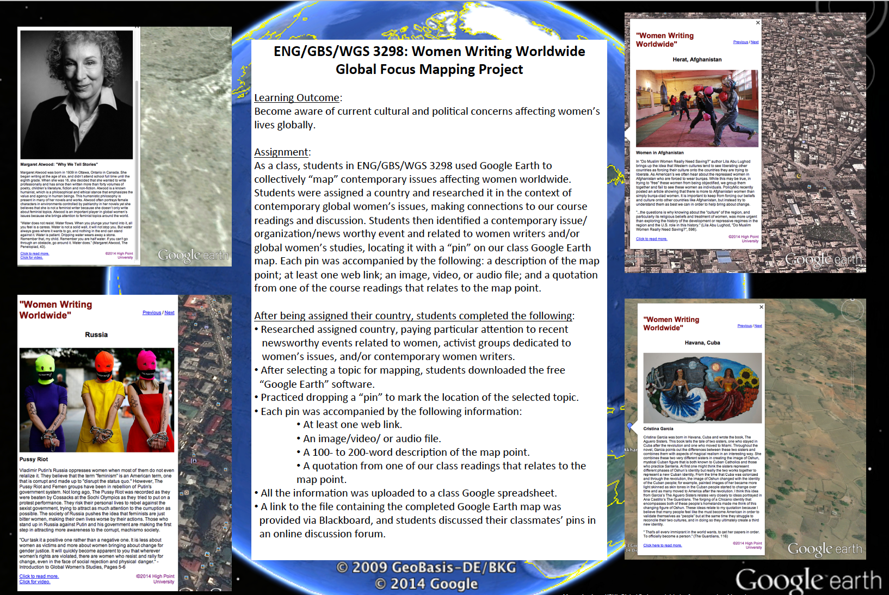
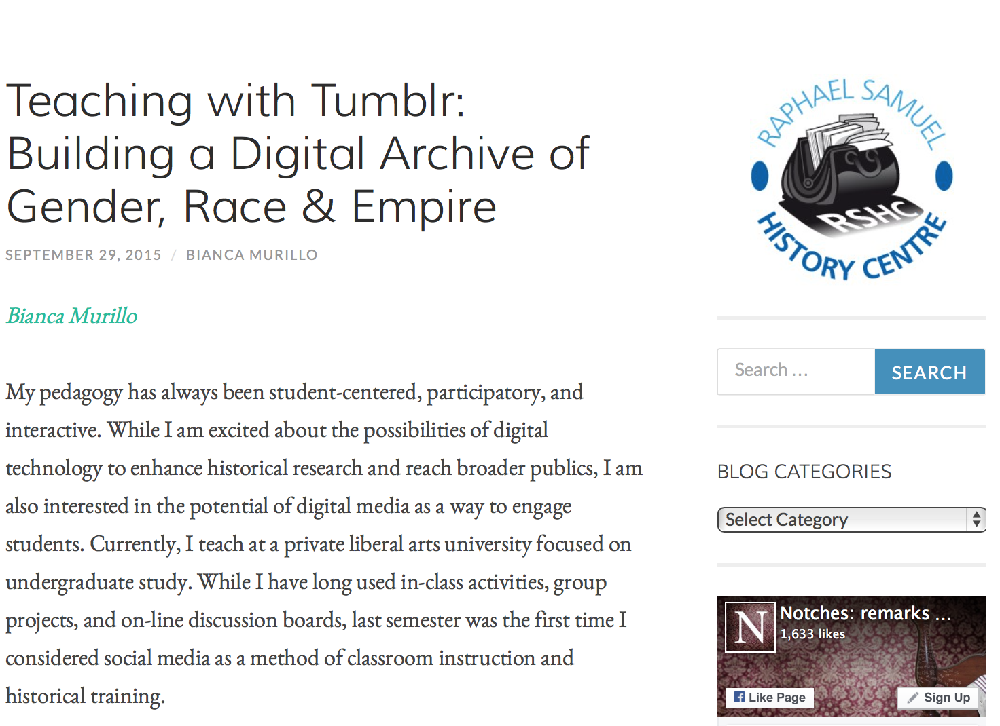
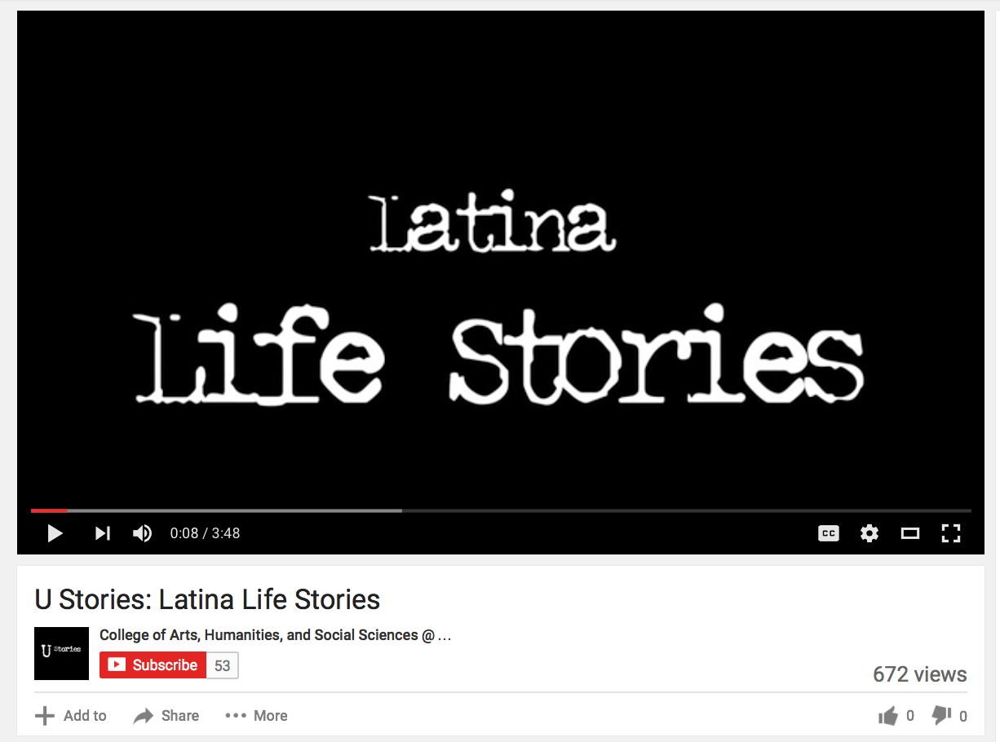
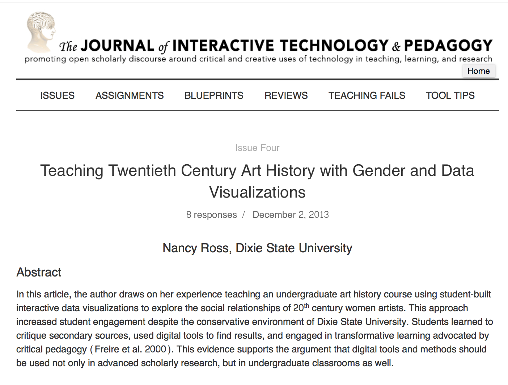
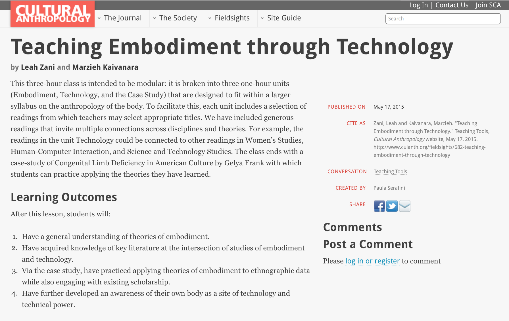
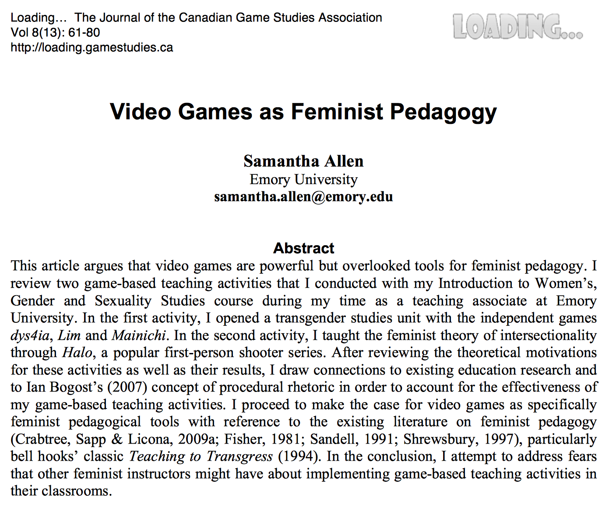
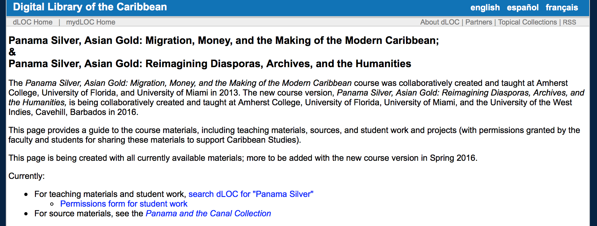
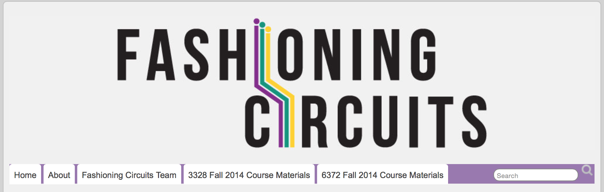

# INTERSECTIONALITY (Draft)

## Roopika Risam
Salem State University | Department of English | [Website](http://roopikarisam.com)

##### Publication Status:
* **unreviewed draft**
* draft version undergoing editorial review
* draft version undergoing peer-to-peer review
* published 

--- 

## CURATORIAL STATEMENT

In 1989, critical race scholar and legal theorist Kimberlé Crenshaw, coined the term “intersectionality” to address 
connections between dimensions of oppression that shape lived experience. In her work with women living in domestic 
violence shelters in Los Angeles, Crenshaw observed that black women were disproportionately affected by the 
compounding effects of race, gender, and class. At the same time, contemporary discourse on feminism failed to 
account for the specific needs of women of color, while anti-racist movements have failed to attend to the needs of 
women (1243-4). Crenshaw’s influential formulation has been expanded over time to reflect a broader range of 
intersections of identity categories and axes of oppression that produce and preclude privilege, shaping lived 
experience around the world (Carbin and Edenheim; Purkayastha; Davis). 

These complicated constructions of identity shape digital humanities as well. In recent years, scholars in the field 
have made the case for greater attention to gender, race, sexuality, nation, and language, among other axes of 
oppression (Arvidsson and Foka; McPherson; Earhart and Taylor; Keeling; Barnett et al.; Ortega; Gil). Still 
relatively new, however, is consideration of the affordances that intersectionality offers digital humanities. 
Moya Bailey has called for an intersectional approach to the field that views diversity not as a matter of adding and
stirring but of reconsidering the practices of digital humanities. Jacqueline Wernimont and Liz Losh have called on 
white feminist practitioners to be more conscious of their positionality in relation to scholarship. My own work has 
suggested that intersectionality as a framework connects theoretical and hands-on approaches to digital humanities 
(Risam). As Edmond Chang, Alexis Lothian, and Anne Cong-Huyen note in their curatorial statements in this collection,
keywords like “Queer,” “Sexuality,” and “Gender” can only be understood in terms of their relationships to each 
other, as well as to other categories like race and class. Therefore, intersectionality itself is an essential 
keyword because it provides language and a theoretical basis for conceptualizing the matrices that shape both 
lived experience and oppression — and for using this mode of thought to develop digital literacy and critical 
thinking skills with students. 

In the context of pedagogy, intersectionality asks students to think beyond narrow binaries that overdetermine 
contemporary discourse on identity and power. It offers them a framework through which they can deconstruct their own
subject positions and better understand the privileges and politics that are shaping their lives. Because 
intersectionality moves beyond single-issue approaches to identity, it promotes development of allyship and counters 
the effects of public discourse that pits identity categories against each other. Blending intersectionality with 
digital pedagogy enables the mentoring of students to become critical users and makers of technology. In doing so, 
they are able to articulate their relationships to facets of their own identities and the role of technology in 
constructing these identities. Moreover, they are better equipped to understand the development of technology in the 
contexts of culture, history, and literature. 

The artifacts collected here include student work, standalone assignments, assignment sequences, and course syllabi 
that position intersectionality at the heart of inquiry. They represent the materials that have influenced my “Race 
and Cyberspace” course, a first-year seminar that engages students with intersectional approaches to race, gender, 
class, and other axes of identity within cultures of technology. Attending to a vast range of institutional 
contexts, these artifacts take advantage of open source, out-of-the-box tools and cheaply available technologies that
can be easily incorporated into classes at universities without access to high-powered computing resources, digital 
humanities centers, or substantial financial resources. They offer students the opportunity to engage with a range 
of intersecting identities, while foregrounding methods that can be adapted for a variety of course topics. These 
artifacts combine theoretical analysis with hands-on, experiential learning, while demonstrating that digital 
pedagogy can be incorporated across multiple disciplines. While promoting digital literacies, they also foster 
collaboration. Moreover, they represent the broadest conception of digital humanities methods, from digital cultural
mapping to new media analysis to data visualization to digital storytelling to video games to digital archives to 
wearables. In doing so, the artifacts here demonstrate how an intersectional lens can facilitate a range of 
approaches to digital pedagogy. 
  
## CURATED ARTIFACTS 

### "Runaway Quilt Project: Digital Humanities Exploration of Quilting During the Era of Slavery"
* Artifact Type: Student Work

* Source URL: [http://jitp.commons.gc.cuny.edu/runaway-quilt-project-digital-humanities-exploration-of-quilting-during-the-era-of-slavery/](http://jitp.commons.gc.cuny.edu/runaway-quilt-project-digital-humanities-exploration-of-quilting-during-the-era-of-slavery/)
* Copy of Artifact:
* Creator: Deimosa Webber-Bey (Pratt Institute School of Information and Library Science) 

Deimosa Webber-Bey's article details her experience creating components of what would become *The Runaway Quilt 
Project* during a set of digital humanities courses taught by Dr. Chris Alen Sula at Pratt Institute School of 
Information and Library Science. Drawing on her work as an African and African American Studies scholar and 
experienced quilter, Webber-Bey's project explores the claim that quilts served as signs along the Underground 
Railroad. She created a range of digital projects - data visualizations in Tableau Public, digital 
annotation using Digress.it, word frequency analysis through Google N-grams Viewer, a timeline in TimelineJS, 
geospatial mapping using Leaflet Maps Marker, and network analysis in Cytoscape. This collection of assignments 
demonstrates how students can engage with multiple, small-scale analyses around a single research topic, which 
together provide a multi-pronged approach to answering a research question. It further suggests how students can 
draw on their personal experiences at intersections of their identities to develop a digital project. 

### "Digital Ethnography"
* Artifact type: Assignment

* Source URL: [http://joglep.com/files/5914/3934/2744/5._Teaching_Artifact-Ostergaard-Digital_Ethnography.pdf](http://joglep.com/files/5914/3934/2744/5._Teaching_Artifact-Ostergaard-Digital_Ethnography.pdf)
* Copy of Artifact: 
* Creator: [Lori Ostergaard](http://comp-rhet.net/) (Oakland University)

The digital ethnography assignment designed by Lori Ostergaard positions intersectionality at the heart of the 
rhetorical and ethical dimensions of the internet. Among the goals for the course in which Ostergaard uses this 
assignment are “study and apply theories of digital culture and its effects on online communities, especially in 
relation to ethnicity, gender, class, physical ability, and sexual orientation.” After initial assignments examining 
students' own online identities and researching emerging media forms, the digital ethnography assignment requires 
them to engage with and analyze online communities as participant-observers. In their guided analysis, students 
apply their understanding of intersectional theories of identity to their study of the online community and 
produce a multimodal final project on the community. This assignment engages students in understanding the 
relationship between online and offline identities and the way the internet is grounded in intersecting axes of 
oppression. 

### "Women Writing Worldwide Global Focus Mapping Project"
* Artifact Type: Assignment

* Source URL: [http://www.highpoint.edu/digiped/files/2014/02/20140331_JennBrandt_0001.pdf](http://www.highpoint.edu/digiped/files/2014/02/20140331_JennBrandt_0001.pdf)
* Copy of Artifact:
* Creator: Jenn Brandt (High Point University)

Through the assignment “Women Writing Worldwide,” Jenn Brandt’s students explore the affordances of digital cultural 
mapping for understanding the relationship between transnational feminist theory and global contemporary women’s 
fiction. She contends that mapping engages students from diverse backgrounds and connects them to the issues that 
affect women's lives around the globe. Students begin by using the Tour Builder storytelling tool in Google Earth to 
map their own lives and tell their own stories. After connecting them to the platform through their own experiences, 
Brandt engages students in mapping course material. In the collaborative project, each student is assigned a country and
asked to research its context for women's experiences. This assignment is significant for intersectional digital 
pedagogy because it challenges the students to think critically about the different experiences of oppression of 
women around the world and to understand the global as an assemblage of the local.

### "Teaching with Tumblr: Building a Digital Archive of Gender, Race & Empire" 
* Artifact Type: Assignment

* Source URL: [http://notchesblog.com/2015/09/29/teaching-with-tumblr-building-a-digital-archive-of-gender-race-empire/](http://notchesblog.com/2015/09/29/teaching-with-tumblr-building-a-digital-archive-of-gender-race-empire/)
* Copy of Artifact:
* Creator: [Bianca Murillo](https://biancamurillo.net/) (Willamette University)

Drawing on her background in interactive and participatory pedagogy, Bianca Murillo discusses her use of 
microblogging platform Tumblr to build the digital archive Gender, Race & Empire with her students. Through their 
engagement with the archive, students examined connections between  sexuality and colonialism, considering them 
through the lens of contemporary racism. This assignment gave students hands-on experience with creating archives, 
allowing them to consider their own roles in the constructions of archives and the ways that history as a discipline 
and archives themselves are shaped by dynamics of power inflected by race, sexuality, and colonialism. Grounded in an
intersectional framework, this assignment links student experience with the histories of colonialism and sexuality. 
It further reflects how user-friendly consumer social media platforms can be used for digital pedagogy. 

### "Latina Life Stories"
* Artifact: Assignment

* Source URL: [https://www.youtube.com/watch?v=bLbh2gw8EsA](https://www.youtube.com/watch?v=bLbh2gw8EsA)
* Copy of Artifact:
* Creator: [Rita Benmayor](https://csumb.edu/directory/people/rina-benmayor)

Rita Benmayor’s work with students on Latina Life Stories at California State, Monterey Bay, connects students with 
the intersections of race, ethnicity, class, immigration status, sexuality, and technology. After studying writing by
Latinas of Mexican, Puerto Rican, Dominican, Cuban, Chicana, and mixed heritage, students produce digital stories 
exploring their own identities and experiences. In these stories, Benmayor’s students share personal and family 
histories engaging with themes like bodies, migration, and violence. By encouraging students to produce digital 
stories, Benmayor helps them find their own voices as writers and to reflect on their own histories, situated at 
the intersections of their identities. Additionally, the assignment suggests how students can be positions as 
critical makers of technology, blending recorded narrative with visuals to bring their personal stories to life. 

### "Teaching Twentieth Century Art History with Gender and Data Visualizations"
* Artifact Type: Assignment Sequence

* Source URL: [http://jitp.commons.gc.cuny.edu/teaching-twentieth-century-art-history-with-gender-and-data-visualizations/](http://jitp.commons.gc.cuny.edu/teaching-twentieth-century-art-history-with-gender-and-data-visualizations/)
* Copy of Artifact: 
* Creator: Nancy Ross (Dixie State University)

In this article, Nancy Ross describes her approach to teaching gender and sexuality in 20th century art history by 
engaging students with interactive data visualization. Ross speaks to the challenges of teaching about gender and 
sexuality at a conservative university in Utah, suggesting that engaging students with art through a new approach 
facilitates their understanding and experiences with the topics. Through data visualization assignments, Ross’s 
students used network analysis to explore connections between women artists and their interlocutors, taking into 
account sexuality as well. The assignment challenged students to think critically about their assumptions about 
artists who are women, such as their tendency to interpret women’s work through biographical data or their 
assumptions that these artists were all heterosexual. Students are given the opportunity to challenge their own 
biases, prejudices, and deeply held beliefs about axes of identity by engaging with digital pedagogy. 

### Teaching Embodiment through Technology
* Artifact Type: Assignment Sequence

* Source URL: [http://www.culanth.org/fieldsights/682-teaching-embodiment-through-technology](http://www.culanth.org/fieldsights/682-teaching-embodiment-through-technology)
* Copy of Artifact:
* Creator: Leah Zani (University of California, Irvine) and [Marzieh Kaivanara](http://www.bristol.ac.uk/school-of-arts/people/marzieh-kaivanara/index.html) (University of Bristol)

Leah Zani and Marzieh Kaivanara’s modular assignment sequence asks students to think critically about the 
technologized body. In addition to learning about and applying theories of embodiment, their goal for this sequence 
is to encourage students to understand their own bodies in relation to technology and the power dynamics that shape 
them. After theoretical discussions on race, gender, and other facets of identity and activities connecting students 
with their own bodies to supplement their understanding of embodiment, they engage students with scholarship on 
technological embodiment. Together, the class analyzes images of technologized bodies sourced by students. Zani and 
Kaivanara then ask their students to consider their own use of bodily technologies - from glasses to cavities to 
wearable activity monitors. In doing so, they offer a model for teaching students to reflect on the relationship 
between gender, ability, and technology. 

### "Video Games as Feminist Pedagogy"
* Artifact Type: Assignment Sequence

* Source URL: [http://journals.sfu.ca/loading/index.php/loading/article/viewFile/135/166](http://journals.sfu.ca/loading/index.php/loading/article/viewFile/135/166)
* Copy of Artifact: 
* Creator: [Samantha Allen](http://samanthaleighallen.com/) (Independent Scholar)

Samantha Allen makes the case that video games are essential to teaching feminist pedagogy. She describes using video
games to teach units on transgender studies and intersectionality. These games, Allen argues, bridges gaps between 
students who do not share an understanding of feminism, leveraging their experiences with a shared understanding video
games. She introduces her students to independent video games made by people who are part of sexual and gender 
minorities, like *dys4ia,* *Lim,* and *Mainichi,* to engage them in perspectives other than their own. Additionally, 
Allen guided them through play of mass-market game *Halo,* interspersing game play with discussion groups to 
facilitate critical thinking about the game and to model intersectional dimensions of oppression. These assignments 
take advantage of students' immersion in technological cultures to introduce theories of intersectionality and 
challenge them to consider their own experiences in relation to those who may not share them.

### "Panama Silver, Asian Gold: Reimagining Diasporas, Archives, and the Humanities"
* Artifact Type: Syllabus

* Source URL: [http://dloc.com/digital/panamasilver](http://dloc.com/digital/panamasilver)
* Copy of Artifact: 
* Creator: Leah Rosenberg, Donette Francis, and Rhonda Cobham-Sander

“Panama Silver, Asian Gold: Reimagining Diasporas, Archives, and the Humanities” is the latest iteration of a 
collaborative, cross-institutional course taught at Amherst College, University of Florida, University of Miami, and 
the University of the West Indies, Cavehill, Barbados. The first iteration was taught in 2013 at Amherst, University 
of Florida, and University of Miami. Students in the course engage with literary studies of the Caribbean through an 
interdisciplinary lens, as well as archival research and digital scholarship. Through class assignments, they consider
the colonial dimensions of colonial archives, examining how particular facets of identity and subalternity influence 
Caribbean writers and scholars. The course demonstrates that intersectionality produces a range of archival 
interventions in which students can engage using the Digital Library of the Caribbean, from Kim Bain’s [“Ghosts in 
the Water: Chinese Women in Trinidad”](http://ghostsinthewater.wordpress.com/) to Yilin Andre Wang’s [“Mapping LGBT 
Caribbean Literature.”](https://queercaribbeanlit.wordpress.com/) 

### "Fashioning Circuits" 
* Artifact Type: Syllabus

* Source URL: [http://fashioningcircuits.com/?page_id=2365](http://fashioningcircuits.com/?page_id=2365)
* Copy of Artifact: 
* Creator: [Kim A. Knight](http://kimknight.com/) (University of Texas, Dallas)

Kim Knight’s course materials for “Fashioning Circuits” brings together the history of fashion and wearable 
electronics to engage students in exploration of the effects of media on bodies at the intersections of race, gender,
class, ability, and sexuality. After small-scale projects to introduce students to creating wearables and class 
discussions exploring intersectionality and media culture, students create social justice-oriented wearable projects
intended to provide a solution to a problem, make a statement, or create a social intervention. This hands-on 
experience in critical making is accompanied by discussion of the affordances and limitations of fashion and its 
relationship with wearable electronics. While other course materials that blend new media with intersectionality tend 
to emphasize analysis and multimodal writing to assess student outcomes, "Fashioning Circuits" exemplifies how students 
can create digital objects of a different kind to demonstrate their understanding of intersectionality and technology. 

## RELATED MATERIALS

Benmayor, Rina. "Digital Storytelling as a Signature Pedagogy for the New Humanities." *Arts and Humanities in Higher Education* 7.2 (2008): 188-204. [http://ahh.sagepub.com/content/7/2/188.short](http://ahh.sagepub.com/content/7/2/188.short).

Davis, Dawn Rae. "Unmirroring Pedagogies: Teaching with Intersectional and Transnational Methods in the Women and Gender Studies Classroom." *Feminist Formations* 22.1 (2010): 136-62. [https://muse.jhu.edu/article/381453](https://muse.jhu.edu/article/381453).

Risam, Roopika and micha cárdenas. "De/Post/Colonial Digital Humanities." HILT 2015. [http://www.dhtraining.org/hilt2015/course/depostcolonial-digital-humanities/](http://www.dhtraining.org/hilt2015/course/depostcolonial-digital-humanities/).

Stern, Danielle. "You Had Me at Foucault: Living Pedagogically in the Digital Age." *Text and Performance Quarterly* 31.3 (2011): 249-66. [http://www.tandfonline.com/doi/abs/10.1080/10462937.2011.573191](http://www.tandfonline.com/doi/abs/10.1080/10462937.2011.573191).

VanGilder, Kirk. "Intersectionality and Disclosure as Pedagogical Tools. *Religious Studies News.* 29 Apr. 2015. [http://rsn.aarweb.org/spotlight-on/theo-ed/intersectionality/intersectionality-and-disclosure-pedagogical-tools](http://rsn.aarweb.org/spotlight-on/theo-ed/intersectionality/intersectionality-and-disclosure-pedagogical-tools). 

## WORKS CITED

Allen, Samantha. "Video Games as Feminist Pedagogy." *The Journal of the Canadian Game Studies Association* 8.13 (2014): 61-80. [http://journals.sfu.ca/loading/index.php/loading/article/viewFile/135/166](http://journals.sfu.ca/loading/index.php/loading/article/viewFile/135/166).

Arvidsson, Viktor and Anna Foka. "Digital Gender: Perspective, Phenomena, Practice." *First Monday* 20.4 (2015). [http://firstmonday.org/ojs/index.php/fm/article/view/5930/4430](http://firstmonday.org/ojs/index.php/fm/article/view/5930/4430).

Bailey, Moya. "All the Digital Humanists Are White, All the Nerds Are Men, But Some of Us Are Brave." *Journal of Digital Humanities* 1.1 (2011). [http://journalofdigitalhumanities.org/1-1/all-the-digital-humanists-are-white-all-the-nerds-are-men-but-some-of-us-are-brave-by-moya-z-bailey/](http://journalofdigitalhumanities.org/1-1/all-the-digital-humanists-are-white-all-the-nerds-are-men-but-some-of-us-are-brave-by-moya-z-bailey/).

Barnett, Fiona, Zach Blas, micha cárdenas, Jacob Gaboury, Jessica Marie Johnson, and Margaret Rhee. "QueerOS: A User's Manual." *Debates in Digital Humanities, 2016*. Eds. Lauren Klein and Matthew K. Gold. Minneapolis: University of Minneapolis Press. (forthcoming). 

Benmayor, Rina. "Digital Storytelling as a Signature Pedagogy for the New Humanities." *Arts and Humanities in Higher Education* 7.2 (2008): 188-204. [http://ahh.sagepub.com/content/7/2/188.short](http://ahh.sagepub.com/content/7/2/188.short)

Benmayor, Rita. "Latina Life Stories." 5 Apr. 2010. [https://www.youtube.com/watch?v=bLbh2gw8EsA](https://www.youtube.com/watch?v=bLbh2gw8EsA).

Brandt, Jenn. "Women Writing Worldwide Global Focus Mapping Project." 2014. [http://www.highpoint.edu/digiped/files/2014/02/20140331_JennBrandt_0001.pdf](http://www.highpoint.edu/digiped/files/2014/02/20140331_JennBrandt_0001.pdf).

Carbin, Maria and Sara Edenheim. "The Intersectional Turn in Feminist Theory: A Dream of a Common Language." *European Journal of Women's Studies* 20.3 (2013):233-48. [http://ejw.sagepub.com/content/20/3/233.abstract](http://ejw.sagepub.com/content/20/3/233.abstract). 

Crenshaw, Kimberlé. "Mapping the Margins: Intersectionality, Identity Politics, and Violence Against Women of Color." *Stanford Law Review* 43.6 (1991): 1241-99. [http://www.jstor.org/stable/1229039](http://www.jstor.org/stable/1229039).

Davis, Dawn Rae. "Unmirroring Pedagogies: Teaching with Intersectional and Transnational Methods in the Women and Gender Studies Classroom." *Feminist Formations* 22.1 (2010): 136-62. [https://muse.jhu.edu/article/381453](https://muse.jhu.edu/article/381453).

Davis, Kathy. "Intersectionality as Buzzword: A Sociology of Science Perspective on What Makes a Feminist Theory Successful." *Feminist Theory* 9.1 (2008): 67-85. [http://fty.sagepub.com/content/9/1/67.short](http://fty.sagepub.com/content/9/1/67.short).

Earhart, Amy and Toniesha Taylor. "Pedagogies of Race: Digital Humanities in the Age of Ferguson." *Debates in Digital Humanities, 2016*. Eds. Lauren Klein and Matthew K. Gold. Minneapolis: University of Minnesota Press, 2016. 251-64.

Gil, Alex. "The (Digital) Library of Babel." *@elotroalex.* 7 Jun. 2014. [http://elotroalex.webfactional.com/digital-library-babel/](http://elotroalex.webfactional.com/digital-library-babel/).

Keeling, Kara. "Queer OS." *Cinema Journal* 53.2 (2014): 152-7. [https://muse.jhu.edu/article/535715/pdf](https://muse.jhu.edu/article/535715/pdf).

Knight, Kim. *Fashioning Circuits.* 2014. [http://fashioningcircuits.com/?page_id=2365](http://fashioningcircuits.com/?page_id=2365).

McPherson, Tara. "Why Are the Digital Humanities So White?: Thinking the Histories of Race and Computation." *Debates in Digital Humanities*. Ed. Matthew K. Gold. Minneapolis: University of Minnesota Press, 2012. [http://dhdebates.gc.cuny.edu/debates/text/29](http://dhdebates.gc.cuny.edu/debates/text/29).

Murillo, Bianca. "Teaching with Tumblr: Building a Digital Archive of Gender, Race & Empire." *Notches.* 29 Sept. 2015. [http://notchesblog.com/2015/09/29/teaching-with-tumblr-building-a-digital-archive-of-gender-race-empire/](http://notchesblog.com/2015/09/29/teaching-with-tumblr-building-a-digital-archive-of-gender-race-empire/).

Ortega, Élika. “RedHD: Open, Collective, and Multilingual Work Dynamics.” Canadian Society of Digital Humanities and Association for Computers and the Humanities Joint Conference. University of Ottawa. Ottawa, Canada. 3 Jun. 2015. 

Ostergaard, Lori. "Teaching Artifact - Assignment: Digital Ethnography." *Journal of Global Literacies, Technologies, and Emerging Pedagogies* 3.1 (2015): 422-25. [http://joglep.com/files/5914/3934/2744/5._Teaching_Artifact-Ostergaard-Digital_Ethnography.pdf](http://joglep.com/files/5914/3934/2744/5._Teaching_Artifact-Ostergaard-Digital_Ethnography.pdf).

Purkayastha, Bandana. "Intersectionality in a Transnational World." *Gender and Society* 26.1 (2012): 55-66. [http://gas.sagepub.com/content/26/1/55.extract](http://gas.sagepub.com/content/26/1/55.extract).

Risam, Roopika and micha cárdenas. "De/Post/Colonial Digital Humanities." HILT 2015. [http://www.dhtraining.org/hilt2015/course/depostcolonial-digital-humanities/](http://www.dhtraining.org/hilt2015/course/depostcolonial-digital-humanities/).

Risam, Roopika. "Beyond the Margins: Intersectionality and Digital Humanities." *Digital Humanities Quarterly* 9.2 (2015). [http://www.digitalhumanities.org/dhq/vol/9/2/000208/000208.html](http://www.digitalhumanities.org/dhq/vol/9/2/000208/000208.html).

Rosenberg, Leah, Donette Francis, and Rhonda Cobham-Sander. *Panama Silver, Asian Gold: Reimagining Diasporas, Archives, and the Humanities.* [http://dloc.com/digital/panamasilver](http://dloc.com/digital/panamasilver). 

Ross, Nancy. "Teaching Twentieth Century Art History with Gender and Data Visualizations." *Journal of Interactive Teaching and Pedagogy* 4 (2013). [http://jitp.commons.gc.cuny.edu/teaching-twentieth-century-art-history-with-gender-and-data-visualizations/](http://jitp.commons.gc.cuny.edu/teaching-twentieth-century-art-history-with-gender-and-data-visualizations/).

Stern, Danielle. "You Had Me at Foucault: Living Pedagogically in the Digital Age." *Text and Performance Quarterly* 31.3 (2011): 249-66. [http://www.tandfonline.com/doi/abs/10.1080/10462937.2011.573191](http://www.tandfonline.com/doi/abs/10.1080/10462937.2011.573191).

VanGilder, Kirk. "Intersectionality and Disclosure as Pedagogical Tools. *Religious Studies News.* 29 Apr. 2015. [http://rsn.aarweb.org/spotlight-on/theo-ed/intersectionality/intersectionality-and-disclosure-pedagogical-tools](http://rsn.aarweb.org/spotlight-on/theo-ed/intersectionality/intersectionality-and-disclosure-pedagogical-tools). 

Webber-Bey, Deimosa. "Runaway Quilt Project: Digital Humanities Exploration of Quilting During the Era of Slavery." *The Journal of Interactive Teaching and Pedagogy* 6 (2014). [http://jitp.commons.gc.cuny.edu/runaway-quilt-project-digital-humanities-exploration-of-quilting-during-the-era-of-slavery/](http://jitp.commons.gc.cuny.edu/runaway-quilt-project-digital-humanities-exploration-of-quilting-during-the-era-of-slavery/).

Wernimont, Jacqueline and Liz Losh. "Problems with White Feminism: Intersectionality and Digital Humanities." *Doing Digital Humanities.* Eds. Constance Crompton, Richard Lane, and Ray Siemens. NY: Routledge, 2016. (forthcoming).

Zani, Leah and Marzieh Kaivanara. "Teaching Embodiment through Technology." *Cultural Anthropology.* 17 May 2015. [http://www.culanth.org/fieldsights/682-teaching-embodiment-through-technology](http://www.culanth.org/fieldsights/682-teaching-embodiment-through-technology).