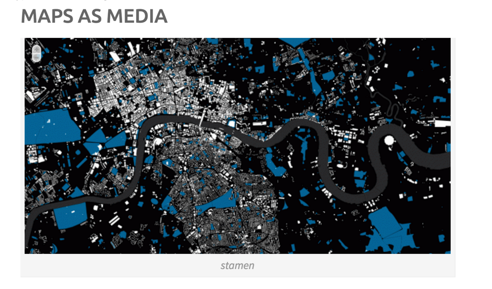
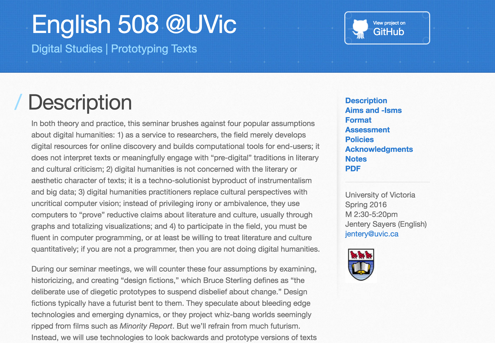
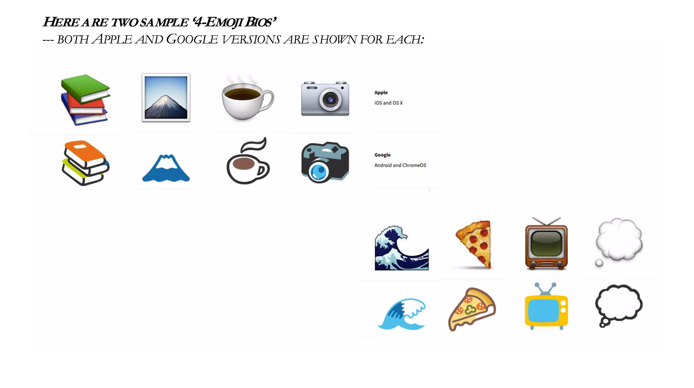
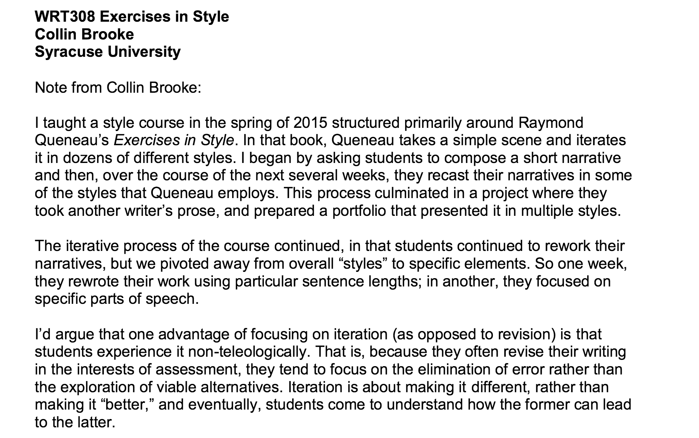
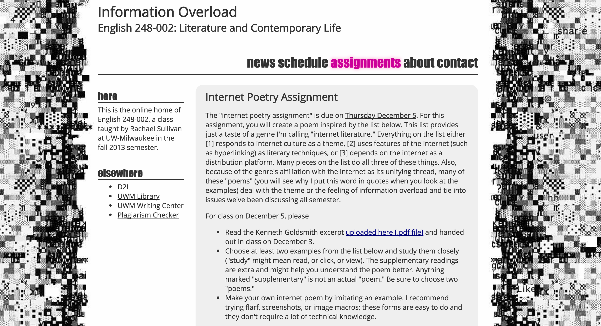
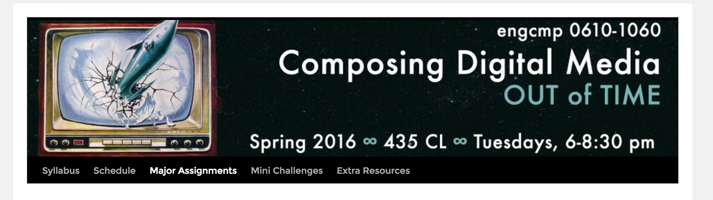
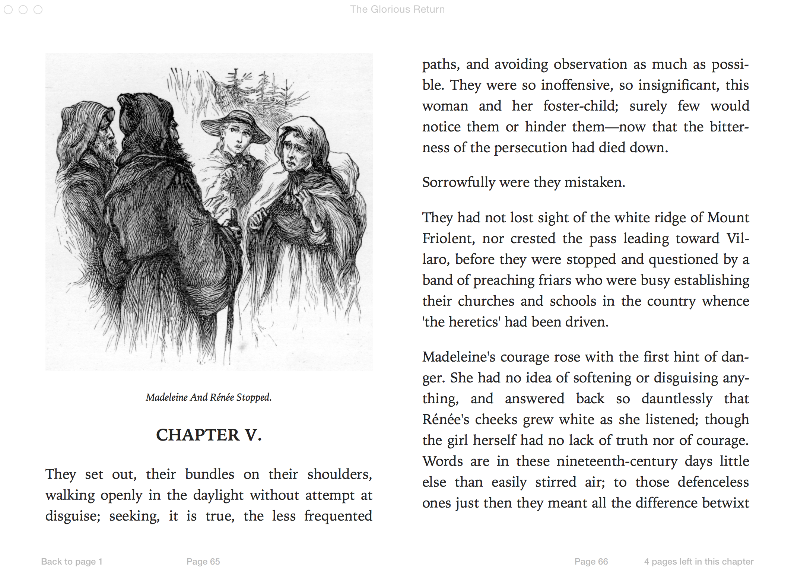
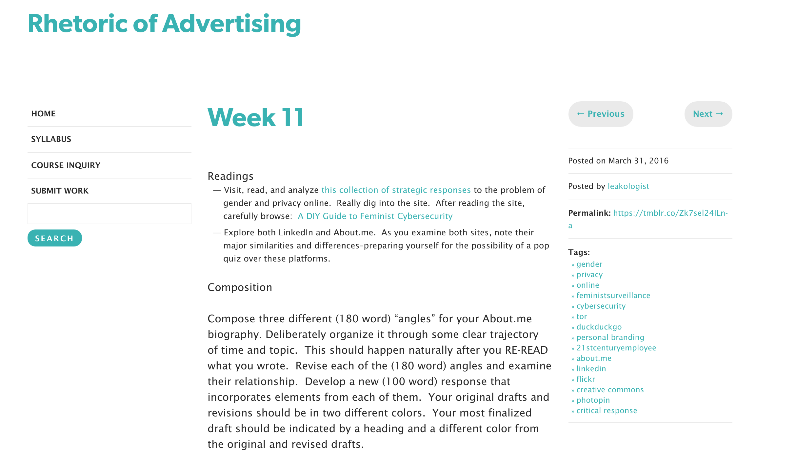
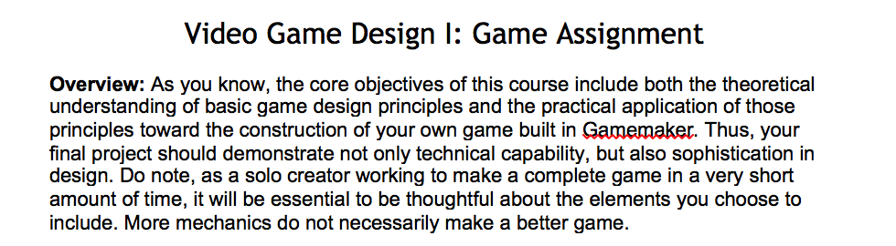

# ITERATION (Draft)

## AUTHOR: Annette Vee
University of Pittsburgh | http://annettevee.com/

---

##### Publication Status:
* unreviewed draft
* draft version undergoing editorial review
* **draft version undergoing peer-to-peer review**
* published

---

## CURATORIAL STATEMENT

Iteration: a hard-edged word, signaling copies, cycles, circuits. Its primary dictionary definitions belongs to math and computer science. In these contexts, iteration is working on a problem repetitively, with feedback, to incrementally solve it or improve it. Designers also iterate; they may produce many different versions of a logo or cover or website. Teachers iterate, too: each course brings repeated gestures, assignments and approaches, as well as tweaks for new students, insights and contexts. An assignment featured below ("Concept in 60 seconds") went through multiple iterations as different teachers adapted it to their own courses and objectives. As Kathi Inman Berens writes in “Interface” for this collection, “the best teachers tweak the assignment iteratively, learning how the students mis/use the interface.” For teaching, iteration may be thought of as remix, revision, mashup, adaptation, elaboration, repetition, reworking, signifying, retelling, doing-over, or variation. New affordances of digital media make iteration an especially vibrant form of pedagogy because students can work through ideas across platforms.

Iterative pedagogy is influenced by ideas in creative writing, software and design. Raymond Queneau’s *Exercises in Style*, in which he tells one story 99 different ways, is frequently an explicit or implicit influence; so is Oulipo poetry, especially Queneau’s combinatorial sonnets in *One Hundred Thousand Billion Poems*. For *Exercises in Style*, Queneau explains: “my intention was merely to produce some exercises; the finished product may possibly act as a kind of rust-remover to literature, help to rid it of some of its scabs.” This objective of “rust-removal” is common in the creative writing and design-influenced pedagogy: do something enough times to work beyond the clichés, to make something genuinely new. [Aaron Henderson](http://www.aaronhenderson.com/), who teaches studio arts classes at the University of Pittsburgh, begins almost every project asking students to draw a grid and sketch eight versions, which forces unique approaches. Mary-Jo Valentino, a professional designer who teaches design at The New School, remembers an assignment from her MFA at RISD where she had to make 100 Y's in Garamond. Each iteration had to be identical in size and shape, but methods of creating them would vary. Students first applied digital filters or cut them out of colored paper; by the end, they made letters out of putting shrinkydinks in the oven, cutting letters out of toast or jello, making them blindfolded, or lighting them on fire. About “iteration,” Valentino says: “This is basically my entire profession.... with most iterations ending up in the garbage. Some people just sit quietly and make one genius outcome, but this is the minority” (personal communication, May 10, 2016).

Conversely, Kenneth Goldsmith’s “uncreative writing” also influences iterative pedagogy. Goldsmith (in)famously transcribed an entire day of *The New York Times* and published it as a 900 page book, *Day*. The new version has the same words, but an entirely different context and meaning; it’s an iteration of the original. Applied to teaching, “uncreative writing” allows students to recombine or reshape older works for new contexts, as Rachael Sullivan has asked students to do when writing Internet poetry (see below). Iteration is also related to Henry Louis Gates’ description of signifyin’, a repetition with a difference.

Learning how to compose in digital media often involves iterations rather than revisions: many trial runs with new platforms and materials. In a kinetic typography assignment, Kerry Banazek requires students to turn in two minutes of material in either one edited project or several shorter projects. Rather than revise, they can start over and still get credit for an awkward early attempt. Iteration gives students a fresh start with new knowledge. Collin Brooke writes,
>I’d argue that one advantage of focusing on iteration (as opposed to revision) is that students experience it non-teleologically. That is, because they often revise their writing in the interests of assessment, they tend to focus on the elimination of error rather than the exploration of viable alternatives. Iteration is about making it different, rather than making it “better,” and eventually, students come to understand how the former can lead to the latter (personal communication, May 1, 2016).

Below are ten examples of iteration in digital pedagogy, organized into three different objectives:
+ _Iteration for multiple perspectives_: Like Queneau’s exercises, these assignments approach the same story or project from different angles, with the goal being flexibility, creativity, or as Queneau put it, “rust-removal.”
+ _Iteration for proliferation_: Here, the point is the process: what’s learned about a structure or platform by repeating or changing it multiple times.
+ _Iteration as versioning_: Aiming to teach students about genre or format, materials in this category ask for conversions across media platforms.

## CURATED ARTIFACTS

### Iteration for multiple perspectives

### Map Labs + Atlas

* Artifact Type: Portfolio assignment
* Source: [http://www.wordsinspace.net/mapsmedia/fall2015/requirements-assignments/](http://www.wordsinspace.net/mapsmedia/fall2015/requirements-assignments/)
* Copy of Artifact:
* Creators: Shannon Mattern, New School Graduate Studio   

In Shannon Mattern’s Maps as Media course, students produce a final portfolio of maps—an atlas—comprised of five different mapping approaches to one subject. The course asks students to “experiment with a variety of critical mapping tools and methods, from techniques of critical cartography to sensory mapping to time-lining, using both analog and digital approaches.” Students have produced atlases on politics in Sri Lanka, the body, counter-maps to NYPD’s “locations of [Muslim] concern,” and every brewery in Brooklyn since 1840. In producing multiple mapped perspectives on one subject, students see the gaps between their iterations and learn the limitations of mapping: “not everything is mappable, and not everything belongs on a map” (Mattern, “Map as Metaphor”). Although this assignment is from a masters-level course, it would scale to a project-based undergraduate course.

Maps as Media course website (including student projects): http://www.wordsinspace.net/mapsmedia/fall2015/ 
Additional student examples: http://www.wordsinspace.net/wordpress/2013/12/18/mapping_gyros/ 

### Prototyping Texts

* Artifact Type: Syllabus
* Source: [https://jentery.github.io/508/](https://jentery.github.io/508/ "Prototyping Texts syllabus")
* Copy of Artifact:
* Creators: Jentery Sayers, University of Victoria     

In this course, Jentery Sayers invites both undergraduates and graduate students to push against notions of Digital Humanities as instrumental, ahistorical or non-interpretive. Students perform “interpretation through alteration” of the texts under scrutiny by "prototyping" them in metadata, plain text/markup, typography, forms, glitch, and repair (Sayers). To alter/prototype/iterate these texts, they “substitute words, change formats, rearrange poems, remediate fictions, juxtapose images, bend texts, and reconstitute book arts” (Sayers). In so doing, students learn how making and iterating can be a form of criticism, and reinvigorate the now-depoliticized concept of iteration itself. Student examples include handmade books, overlapping Word documents, twitterbots, and even [a knitted interpretation of Queneau’s One Hundred Thousand Billion Poems](https://508prototypepage.wordpress.com/2016/04/06/week-12-knit-it/).

Student examples: [Tiffany Chan's "Act Natural"](http://eltiffster.github.io/ActNatural/)  
[Sarah Matheson's "My Oulipofolio"](https://508prototypepage.wordpress.com/2016/04/13/my-oulipofolio-a-summary-of-prototypes/) 
[Allison Murphy's "Prototyping Personism"](http://www.itisnotthesea.com/) 

### “Words and Images ‘Notes’ and ‘Bios’”

* Artifact Type: Unit with readings and assignments
* Source: ['Notes' and 'Bios' Unit for the Words and Images Course](files/iteration-WordsAndImagesBios-Banazek.pdf)
* Copy of Artifact: files/iteration-WordsAndImagesBios-Banazek.pdf
* Creators: Kerry Banazek, University of Pittsburgh 

In “Words and Images,” an undergraduate literature course, Kerry Banazek asks students to introduce themselves with six iterations of biographies: a paragraph, a sentence, five words, punctuation marks only, four emojis, then unlimited emojis. This exercise kicks off the course and a unit focused on expressing meaning and affect in both image and word. Later in the term, students translate poems into emoji and invent visualization methods for tracking patterns in poems. These iterative translation exercises help students develop dexterity in producing meaningful images and illustrative words.

###Exercises in Style

* Artifact Type: Weekly exercises
* Source: files/iteration-ExercisesInStyle-Brooke.docx
* Copy of Artifact: files/iteration-ExercisesInStyle-Brooke.docx
* Creators: Collin Brooke, Syracuse University

Collin Brooke’s undergraduate writing course was explicitly modeled on Queneau’s *Exercises in Style*. Students began by designing a scenario that echoed Queneau’s encounter on the Paris Metro and then each week rewrote it according to different constraints, always sharing and discussing their work, and sometimes working on each other’s scenarios. Although the exercises don’t explicitly feature digital approaches, Brooke designed them to be “procedural in a way that's analogous to iterating code, just the product is different.” Brooke says, “my favorite thing about iteration is that offers a path out of the Scylla-Charybdis of either revising toward perfection or 'taking risks'" (personal communication). This resource models the Queneau approach to iteration and could be easily adapted to digital platforms.

###Iteration for Proliferation

###Digital Creative Writing

* Artifact Type: Syllabus
* Source: [http://leonardoflores.net/3238/](http://leonardoflores.net/3238/)
* Copy of Artifact:
* Creators: Leonardo Flores, University of Puerto Rico: Mayagüez 

Leonardo Flores’s “Digital Creative Writing” course, in which students compose hypertext, Twine, Netprov, kinetic typography, memes, Twitterbots, and remixes of Nick Montfort’s Taroko Gorge or Christopher Strachey’s “Love Letter Generator," is a rich resource for iterative digital pedagogy. Flores calls these genres “generative writing,” suggesting that it is writing both generated and generative. Here, generating an interesting collection matters more than any given iteration; proliferation is the pedagogical point. A nice pairing with Flores's assignments might be James Brown, Jr.’s “Writing with machines: data and process in Taroko Gorge,” which offers a theoretical perspective and reference to historical precedence in Oulipo and cut-ups.

Student Twitterbots: [@atinyzoo](https://twitter.com/atinyzoo) [@BadNewsLetter](https://twitter.com/badnewsletter) [@ChezGenerate](https://twitter.com/ChezGenerate)  

[Taroko Gorge remix collection in *Electronic Literature Volume 3*](http://collection.eliterature.org/3/collection-taroko.html)

###Internet Poetry

* Artifact Type: Assignment
* Source: http://courses.rachaelsullivan.com/248/internet-poetry.html
* Copy of Artifact:
* Creators: Rachael Sullivan, St. Joseph’s University 

With inspiration and theoretical background from Kenneth Goldsmith’s “uncreative writing,” Rachael Sullivan asked her undergraduate students in “Information Overload: Literature and Contemporary Life” to compose poetry from found texts online, imitating a popular image-macro form. She showcases examples of “Internet literature,” where “Everything on the list either [1] responds to internet culture as a theme, [2] uses features of the internet (such as hyperlinking) as literary techniques, or [3] depends on the internet as a distribution platform” (“Assignment”). By composing their own "Internet poetry" from language found online, students used an iterative process to recontextualize and reconsider issues of information overload. This resource is just one example of ways instructors could have students iterate on found language online.

###Iteration as versioning

###"Concept in 60 Seconds" / “Emotion in 60 seconds” / “Audio cut-up”

* Artifact Type: Assignment sequence
* Sources:
["Concept in 60 Seconds"](files/iteration-Conceptin60-DeWitt.pdf)  
[“Emotion in 60 seconds”](files/iteration-Emotionin60-Campbell.pdf)  
https://composedm2016.wordpress.com/mini-challenges/  
https://composedm2016.files.wordpress.com/2016/01/hall_engcmp0610s_cdm_audiocutup1.pdf
* Copy of Artifacts:
* Creators: Scott Lloyd DeWitt, The Ohio State University;
Trisha Campbell, Salisbury University;
Lauren Rae Hall, University of Pittsburgh 

Three iterations of this "60 seconds" audio/video assignment are featured here, all of which help students to try out audio/video composing with low stakes. "Concept in 60 Seconds" was developed by Scott Lloyd DeWitt, who co-runs the [Digital Media and Composition Institute (DMAC)](http://www.dmacinstitute.com/) at Ohio State. This assignment, which DeWitt describes the origins and motivations for in ["In Context (Techne in 60)"](http://www.dmacinstitute.com/showcase/issues/no1/dewitt-techne-60-context)", asks students to compose a 60 second video that illustrates a concept such as rigor, loss, or comfort. Trisha Campbell revised the assignment to focus on an emotion such as first kiss, hunger, or how your grandmother makes you feel. Lauren Rae Hall’s version borrows from Campbell's, then leads into a larger, Burroughs-inspired “Audio Cut-up” project, which asks students to make a “cut-up” of sound, speech and music to create a story, poem, song or argument that evokes emotion. As Hall's sequence demonstrates, the “60 seconds” assignment could be used alone or as an early iteration--not meant for revision, but instead for preparing students for deeper engagement with a composition platform and paradigm.

###EBook Conversion Project

* Artifact Type: Assignment
* Source: [files/iteration-EPubAssignment-Lockridge.pdf](files/iteration-EPubAssignment-Lockridge.pdf)
* Copy of Artifact: [files/iteration-EPubAssignment-Lockridge.pdf](files/iteration-EPubAssignment-Lockridge.pdf)
* Creators: Tim Lockridge, Miami University of Ohio 

Tim Lockridge's undergraduate Digital Publishing course teaches students about the technologies, techniques and professional practices of digital publishing. For the midterm, featured here, students downloaded a book from Project Gutenberg, and converted it to an ePub format, and then wrote a production memo documenting their process. They turned plain text into (X)HTML, created a style sheet, included metadata, formatted a cover image and illustrations, and provided all copyright and source information for the text. The final project asked students to convert a Miami University Press book to ePub (with permission from the Press). By producing new iterations of books, students learned conventions of digital publishing and the importance of small details in different versions of texts. Literary or technical writing courses incorporating digital editions could benefit from this model resource.

[Student Production Memo, by Collins, Duffy, Maggio and Moore](files/iteration-EPubAssignment-Lockridge-StudentProductionMemoCollinsMaggioMoore)

###Social Media Bios

* Artifact Type: Assignment
* Source: http://spelmanwrites384.tumblr.com/post/142041620452/week-11
* Copy of Artifact:
* Creator: Alexandria Lockett, Spelman College 

This assignment asks students to produce three iterations of a public biography, combine them, and respond to each other’s work as “creative consultants.” It is part of Alexandria Lockett’s “Rhetoric of Advertising” course, which moves beyond a traditional, analytical frame and asks students to think about “strategic communication” and how they “brand” and present themselves online. Lockett aims to help students with strategic and proactive self-presentation in “a space where race, gender, and geography mediate students' relationship to privacy and their perception of legitimate public displays of 'professional identity’” (personal communication, May 18, 2016). Working toward that goal, these versioned bios help students to recognize and shape the impact of different iterations of themselves online--an important goal in social media courses.

[ePortfolio Social Media Profile assignment that builds on this assignment](https://docs.google.com/document/d/1Oc-uHjp_Q0oiOHWBhve5Aj6N8dIuwx9YL3tKtYLWAaw/edit) 
[Course syllabus](https://docs.google.com/document/d/1ffzirvXnQbF2wqyFfb75_63drMLw_EpsD8Add4b2o50/edit) 
Student examples: [Alexandra Calloway's Linked-in profile](https://www.linkedin.com/in/alexandra-calloway-5094549b) and her [About.me](https://about.me/alexandracalloway) 
[Fennella Miller's Linked-in profile](https://www.linkedin.com/in/fennella-miller-08b567a5) 
[Mikaela Smith Linked-in profile](https://www.linkedin.com/in/mikaela-smith-a4a56711a)

###Video game design assignment

* Artifact Type: Assignment Sequence
* Source: [files/iteration-VideoGameDesignAssignment-Sierra.pdf](files/iteration-VideoGameDesignAssignment-Sierra.pdf)
* Copy of Artifact: [files/iteration-VideoGameDesignAssignment-Sierra.pdf](files/iteration-VideoGameDesignAssignment-Sierra.pdf)
* Creator: Wendi Sierra, St. John Fisher University 

In Wendi Sierra's undergraduate game design class, students learn both theoretical and practical aspects of video game design by iterating from design doc to alpha and beta testing to a functioning game on the Gamemaker or Unity platforms. Her assignment includes technical specifications concerning sound, animated objects, and scalability, as well as design goals of genre, rules and thematic coherence. Her beta-testing worksheet guides peer review of the games in process. While the assignment may be challenging for teachers new to game design principles, Sierra's process for taking students through game design from theoretical readings to paper versions to executable games serves as a great model for iterative structure in pedagogy, and the earlier stages could be implemented without significant technical expertise in game design.

##RELATED MATERIALS

Brock, Kevin. "git as Site for Distributed and Iterative Rhetorical Action.” Presentation. CCCC 2016. <https://www.penflip.com/brockoleur/git-as-site-for-distributed-and-iterative-rhetorical-action>  slide deck here <https://docs.google.com/presentation/d/15pTuHvoINaOXsObX8NxzWUCNOAQaE-N3a4vzZHrL-94/edit#slide=id.g1297bf2e8c_0_54>

Burgess, Joel [from Bethesda Games]. “How We Used Iterative Level Design to Ship Skyrim and Fallout 3.” Presentation. GDC 2014 [Game Developer’s Conference]: January 22, 2016. YouTube video. <https://www.youtube.com/watch?v=PhW8CY8XkFg>

Edmond, Jacob. “Commentary on Iterations [special issue].” Jacket 2 (2013): n. pag. Web. <http://jacket2.org/commentary/jacob-edmond>

Goldsmith, Kenneth. “It’s Not Plagiarism. In the Digital Age, It’s ‘Repurposing.’” *The Chronicle of Higher Education*. 11 Sept. 2011. Web. <http://chronicle.com/article/Uncreative-Writing/128908>

“Daily Create” and "Assignment Bank." Assignment resources. Digital Storytelling 106 at University of Mary Washington. Fredricksburg, VA. n.d. http://daily.ds106.us/about/ http://assignments.ds106.us/

##WORKS CITED

Berens, Kathi Inman. “Interface.” *Digital Pedagogy in the Humanities*. Eds. Rebecca Frost Davis, Matthew K. Gold, Katherine D. Harris, Jentery Sayers. MLA. n.d. Web. 9 May 2016. https://digitalpedagogy.commons.mla.org/keywords/interface/  

Brown, James, Jr. “Writing with Machines: Data and Process in Taroko Gorge.” *Creative Writing in the Digital Age: Theory, Practice, and Pedagogy*. Ed. Michael Dean Clark, Trent Hergenrader, and Rein, Joseph. London: Bloomsbury Academic, 2015. 129–139. Print.

Calloway, Alexandra. About Me Profile. n.d. Web. 9 Jun. 2016. https://about.me/alexandracalloway

-----.  Linked-in Profile. n.d. Web. 9 Jun. 2016. https://www.linkedin.com/in/alexandra-calloway-5094549b

Carrero Sepúlveda, Carlos. “Bad News Letter.” Twitterbot. Mar. 2016. Web. 9 Jun. 2016. https://twitter.com/badNewsLetter

Chan, Tiffany. Act Natural: Prototyping Autodidacticism, Forging the Self. Web site. Spring 2016. Web. 6 Jun. 2016. http://eltiffster.github.io/ActNatural/

Collins, Christopher “Kit”, Sean Duffy, Christopher Maggio, and Alexandria Moore. "Production Memo for *Fountain*." Document. *English 426: Digital Publishing*. Miami University of Ohio. Oxford, OH. Fall 2015. Print. files/iteration-EPubAssignment-Lockridge-StudentProductionMemoCollinsMaggioMoore

DeWitt, Scott Lloyd. "Concept in 60." Assignment. The Ohio State University. Columbus, OH. n.d. Print. files/iteration-Conceptin60-Dewitt.pdf

-----. “In Context,” in "Techne in 60: The History and Practice of the Concept in 60," by Scott Lloyd DeWitt, Brian Harmon, Dundee Lackey, and Christina M. LaVecchia. *Showcasing the Best of CIWIC/DMAC*, 2015. Web. 9 Jun. 2016. http://www.dmacinstitute.com/showcase/issues/no1/dewitt-techne-60-context

Flores, Leonardo. Digital Creative Writing. Web site. Spring 2016. Web. 6 Jun. 2016. http://leonardoflores.net/3238/

Gates, Henry Louis, Jr. “The ‘Blackness of Blackness’: A Critique of the Sign and the Signifying Monkey.” *Critical Inquiry* 9.4 (1983): 685–723. Print.

Goldsmith, Kenneth. *Day*. Great Barrington, MA: The Figures, 2003.

Hall, Lauren Rae. Composing Digital Media: Out of Time. Web site. Spring 2016. Web. 6 Jun. 2016. https://composedm2016.wordpress.com/

Lockett, Alexandria. “ePortfolio Rubrics.” Document. Rhetoric of Advertising. 3 May 2016. Web. 6 Jun. 2016. https://docs.google.com/document/d/1Oc-uHjp_Q0oiOHWBhve5Aj6N8dIuwx9YL3tKtYLWAaw/edit

-----. “Week 11 [Social Media Bios].” Web blog post. Rhetoric of Advertising. 31 Mar. 2016. Web. 9 Jun. 2016. http://spelmanwrites384.tumblr.com/post/142041620452/week-11

Matheson, Sarah. "My Oulipofolio: A Summary of Prototypes." Web site. 13 Apr. 2016. Web. 6 Jun. 2016. https://508prototypepage.wordpress.com/2016/04/13/my-oulipofolio-a-summary-of-prototypes/

-----. “Week 12 – Knit it!” Web blog post. *My Oulipofolio*. 6 Apr. 2016. Web. 6 Jun. 2016. https://508prototypepage.wordpress.com/2016/04/06/week-12-knit-it/

Mattern, Shannon. “Map as Metaphor @ Center for Book Arts.” Web blog post. *Words in Space*. 22 Mar. 2016. Web. 9 May 2016. http://www.wordsinspace.net/wordpress/2016/03/22/map-as-metaphor-center-for-book-arts/

-----. “Maps as Media: Fall 2015.” Web site. *Words in Space*. Fall 2015. Web. 9 May 2016. http://www.wordsinspace.net/mapsmedia/fall2015/

-----. “Mapping Gyros, Juloos, Disaster Ruins, Beer, Fallout Shelters, Drive-ins, Serial Killers, and Other Stuff.” Web blog post. *Words in Space*. 18 Dec. 2013. Web. 9 Jun. 2016.
.” Maps as Media: Fall 2015http://www.wordsinspace.net/mapsmedia/fall2015/2016/04/03/final-projects/

Miller, Fennella. Linked-in Profile. n.d. Web. 9 Jun. 2016. https://www.linkedin.com/in/fennella-miller-08b567a5

Murphy, Allison. Prototyping Personism. Spring 2016. Web. 6 Jun. 2016. http://www.itisnotthesea.com/

Queneau, Raymond. *Exercises in Style*. Trans. Barbara Wright. New Directions, 1981. Print.

-----. “100,000,000,000,000 Poems,” Trans. Stanley Chapman. *Oulipo Compendium*. Ed. Harry Mathews and Alastair Brotchie. London: Atlas Press, 1998, 15–33.

Sayers, Jentery. “English 508@UVic.” Web site. Spring 2016. Web. 6 Jun. 2016. https://jentery.github.io/508/

Sedik, Karen and Lisneisy Nieves. “A Tiny Zoo.” Twitterbot. Mar. 2016. Web. 9 Jun. 2016. https://twitter.com/atinyzoo

Smith, Mikaela. Linked-in Profile. n.d. Web. 9 Jun. 2016. https://www.linkedin.com/in/mikaela-smith-a4a56711a

Sullivan, Rachael. Information Overload: English 248-002: Literature and Contemporary Life. Fall 2013. Web. 9 Jun. 2016. http://courses.rachaelsullivan.com/248/schedule.html

“Taroko Gorge Remixes.” *Electronic Literature Collection, Volume Three*. Eds., Stephanie Boluk, Leonardo Flores, Jacob Garbe and Anastasia Salter. Cambridge, MA: Electronic Literature Association, Feb. 2016. Web. 9 Jun. 2016. http://collection.eliterature.org/3/collection-taroko.html

Yordan Torres, Joan N. “DinnerBot.” Twitterbot. Oct. 2011. Web. 9 Jun. 2016. https://twitter.com/ChezGenerate
