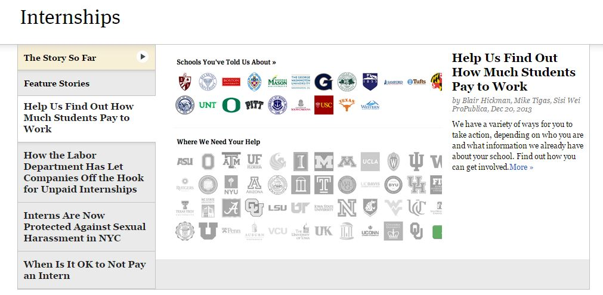
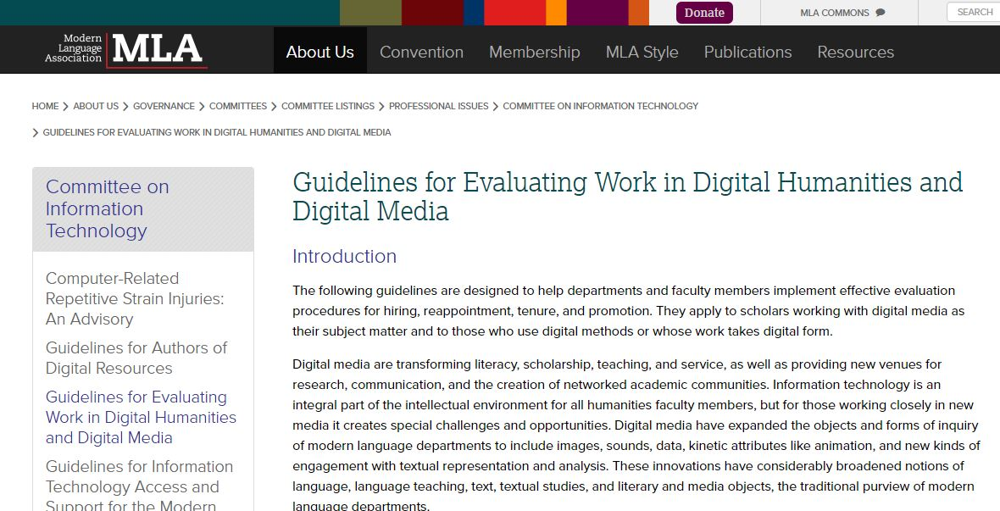
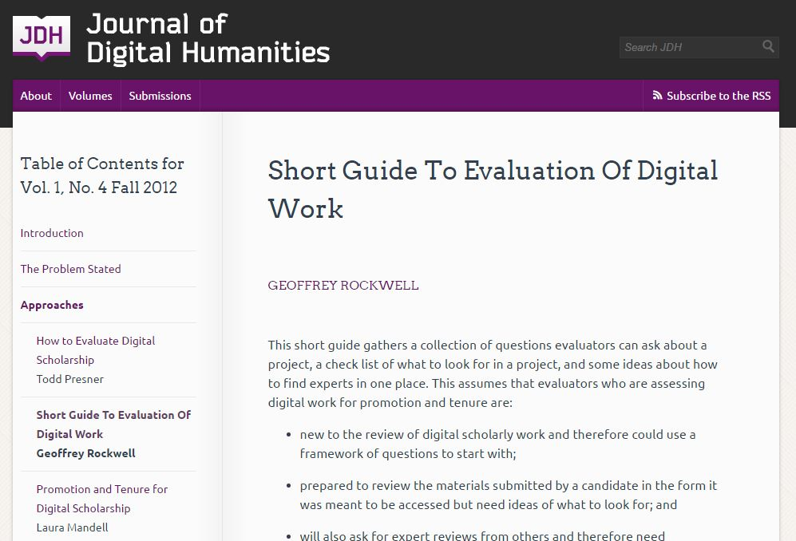
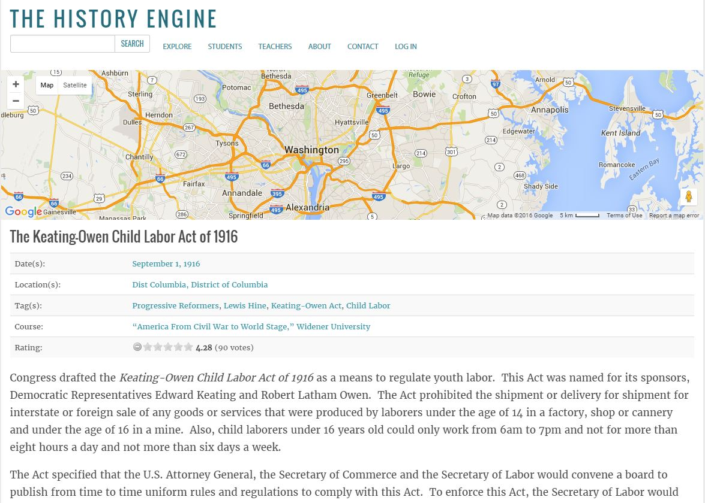
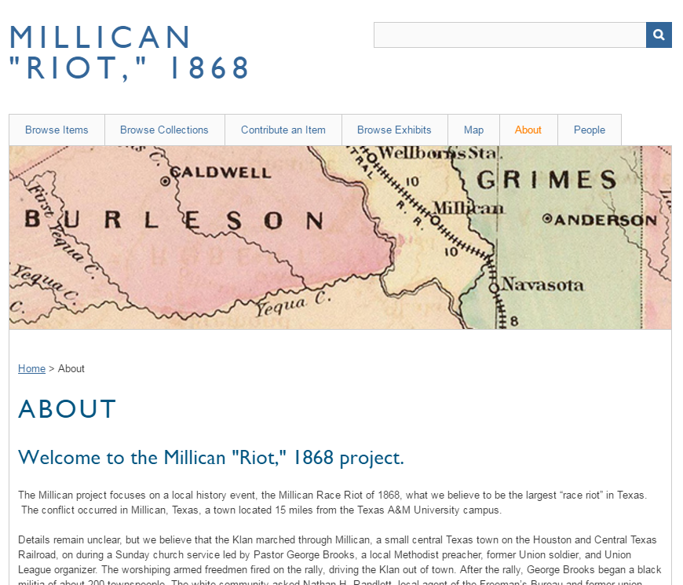

--- 
title: Digital Pedagogy in the Humanities
subtitle: Concepts, Models, and Experiments 
chapter: Labor
URL: keywords/labor.md
author: 
- family: Keralis
  given: Spencer D.C.
editor: 
- family: Davis
  given: Rebecca Frost
publisher: Modern Language Association
type: book
---

# LABOR (Draft)

## Spencer D.C. Keralis
University of North Texas | 

---

##### Publication Status:
* **unreviewed draft**
* draft version undergoing editorial review
* draft version undergoing peer-to-peer review
* published 

--- 

## CURATORIAL STATEMENT 

###The spectrality of labor###
Labor is the means of production of a product, and often the work of production is conflated with the work produced. This conflation collapses the relationship between the mode of production and the thing produced which, perhaps paradoxically, serves to hide labor behind the thing it generates. Labor, like work, is what William James described as "a double-barreled word," in which subject and object converge and intertwine. In the digital production environment this convergence can make it challenging to ensure that those who do the work on digital projects receive proper credit and compensation for the work they perform. While there has been for some time a preoccupation among humanities scholars about recognition of digital projects for tenure and promotion, this conversation has largely precluded discussion of other aspects of labor in relation to digital modes of production in the academy. The emphasis on acknowledgment of individual scholars' work in the tenure process ignores the contributions of interdisciplinary collaborators --librarians, technologists, and students--to a project. [*The Collaborator's Bill of Rights*](http://mcpress.media-commons.org/offthetracks/part-one-models-for-collaboration-career-paths-acquiring-institutional-support-and-transformation-in-the-field/a-collaboration/collaborators%E2%80%99-bill-of-rights/"The Collaboratorís Bill of Rights") offers a soft corrective to this trend, providing principles for recognizing this work within a specific community of practice, and others have developed [Memoranda of Understanding](https://uta-ir.tdl.org/uta-ir/handle/10106/25646 "UT-Arlington Libraries Memorandum of Understanding") defining credit, compensation, and limits for contributors to a digital project. Any consideration of labor in digital pedagogy must be conscious of the complexity of labor within the digital work environment.
   
The labor network necessary to produce digital projects is complex, ranging from the physical labor of maintaining hardware and the infrastructure essential to these projects, to hybrid labor ["in which machines combine with humans to perform tasks"](http://www.digitalhumanities.org/dhq/vol/5/3/000102/000102.html "New Media in the Academy") in software or with devices, to scripted tasks performed automatically within systems, to the writing of those scripts, to the knowledge work that serves as the intellectual foundation of a project, to the instrumentalized labor of workers who perform repetitive tasks that cannot be scripted. An individual at one point on the spectrum of these projects may be wholly unaware of the other labor going on elsewhere, so the scholar using a digital library may not know that the materials they rely on were digitized by students or other minimum-wage workers whose work is not acknowledged on the library's website. Their labor is rendered invisible, alienable, and is easily effaced and taken for granted. So, with apologies to Marx, if there is a spectre haunting digital pedagogy, it is the spectre of labor. The aim of this particular collection of artifacts is to help students perform a séance of sorts, to make visible the spectral labor that haunts our shared digital house.

###Curation###
As with [archival selection](https://digitalpedagogy.commons.mla.org/keywords/archive/ "Archive"), the labor choices made on digital projects reflect the values of the scholars and project managers responsible for those projects, within the context of institutional realities. The exposure many students receive to digital production in the classroom takes the form of them performing this labor on a faculty project without credit or compensation. Under the rubrics of skills building and exposure to active research, this has become a common, if not entirely unchallenged, practice in digital humanities in particular. The artifacts selected here offer a disruption of that pedagogic narrative. These artifacts can guide a student through an understanding of digital production ranging from analysis of existing projects to hands-on work crafting their own digital project online, all with a common theme of labor. The questions asked of each artifact can be applied to other, similar artifacts relevant to an individual course, or an individual instructor's or student's interests. Students will be encouraged to identify specific means of production, and determine where credit or compensation is given, and under what conditions the labor is performed. The artifacts begin with models for advocacy and evaluation, moving toward analyses of specific archives, projects, and digital products, to exercises which provide students the opportunity to both produce their own digital project, and to reflect on the modes of production necessary to do that work.  

To be clear, this is not an argument against students doing "work" in class. From seminar papers to digital portfolios, doing some form of intellectual or practical labor to demonstrate understanding and applied skills is a necessary cornerstone of most if not all pedagogy. However, student work created in the classroom is generally understood as ["Creator-Owned Intellectual Property"](https://research.unt.edu/sites/default/files/08-Intellectual%20Property_%20Research%20Intellectual%20Property_0.pdf "UNT Research Intellectual Property Policy") under most university policies. This distinction is blurred when students are used as uncredited labor on faculty projects as part of their coursework. In addition to questions of intellectual property, there may be implications under the Family Educational Rights and Privacy Act (FERPA) for sharing student work online, similar to concerns about classroom use of [social media](http://er.educause.edu/articles/2014/2/is-your-use-of-social-media-ferpa-compliant "Is Your Use of Social Media FERPA Compliant?"). And finally, the use of student labor in the classroom also hides the cost--in labor and in money--of digital scholarship from institutions, and effectively passes that cost onto students in the form of student debt accrued to pay for classes. Any use of student labor in the classroom must take all of these issues--and likely many others--into consideration.  

The digital labor environment can be difficult to understand. By giving students assignments that help them recognize and understand the real labor behind the websites and widgets, and to recognize the people who perform that labor, we can equip them with the ability to value labor and to advocate on behalf of themselves and others. In a landscape in which there are many forces competing to alienate and obscure the labor of students, women, people of color, and the underclass of digital workforce, equipping students to own their labor provides them with a crucial survival skill. 

## CURATED ARTIFACTS 

###Student Collaborators Bill of Rights###

* Artifact Type: Declaration of student rights developed in collaboration with students.
* Source URL: [http://www.cdh.ucla.edu/news-events/a-student-collaborators-bill-of-rights/](http://www.cdh.ucla.edu/news-events/a-student-collaborators-bill-of-rights/) 
*  Artifact Permissions: No site license noted.
* Copy of the Artifact: N/A
* Creators and Affiliations: Haley Di Pressi, Stephanie Gorman, Miriam Posner, Raphael Sasayama, and Tori Schmitt, all UCLA; with contributions from Roderic Crooks, Megan Driscoll, Amy Earhart, Spencer Keralis, Tiffany Naiman, and Todd Presner

*The Student Collaborators' Bill of Rights* offers principles to which "those embarking on collaboration with students [should] adhere." Published by the UCLA Center for Digital Humanities, the *Bill of Rights* was developed in collaboration with students, based on their experiences in digital humanities classes. The *Bill of Rights* reflects on the power inequities that are inevitable when student labor in the classroom is used to support faculty projects.  The *Bill of Rights* could be effectively integrated into course syllabi as an up-front, positive declaration of the rights of students. The *Bill of Rights* could also be used as a point of discussion for students, helping them build skills in personal advocacy, and empowering them to value their labor and recognize inequities when they occur.

###The Price of an Internship###
 

* Artifact Type: Pro Publicaís ongoing investigation of unpaid internship practices at American universities.
* Source URL: [http://projects.propublica.org/internships/](http://projects.propublica.org/internships/)
* Artifact Permissions: © 2015 Pro Publica Inc.
* Copy of the Artifact: N/A
* Creators and Affiliations: Blair Hickman, Mike Tigas, and Sisi Wei, ProPublica

The Pro Publica investigation of college internship programs compares costs of tuition for institutions and programs supporting unpaid internships. Investigators note that 90% of colleges offer credit for internships, and some programs require internships for graduation. The "crowd-powered" #ProjectIntern database allows students to view information about their institution's internship policies, add information about programs at their schools including internship policies, and write reviews of their experience as interns. Exercises using this information could include looking up programs at your institution that require internships and contributing this information to the database, writing reviews of internships students have held, or comparing [guidelines from the Department of Labor](https://www.dol.gov/whd/regs/compliance/whdfs71.pdf) for internships against university or program internship policies. Discussion of the possible irony of a "crowd-powered" project to interrogate unpaid internships that relies on uncredited and uncompensated investigative work by students might also be generative.

###Guidelines for Evaluating Work in Digital Humanities and Digital Media###
  

* Artifact Type: The Modern Language Associationís guidelines ìto help departments and faculty members implement effective evaluation procedures for hiring, reappointment, tenure, and promotionî of faculty working on digital projects.
* Source URL: [https://www.mla.org/About-Us/Governance/Committees/Committee-Listings/Professional-Issues/Committee-on-Information-Technology/Guidelines-for-Evaluating-Work-in-Digital-Humanities-and-Digital-Media](https://www.mla.org/About-Us/Governance/Committees/Committee-Listings/Professional-Issues/Committee-on-Information-Technology/Guidelines-for-Evaluating-Work-in-Digital-Humanities-and-Digital-Media)
* Artifact Permissions:  © 2016 Modern Language Association of America
* Copy of the Artifact: N/A
* Creators and Affiliations: MLA Committee on Information Technology

Originally drafted in 2000, these guidelines address the need for the labor of faculty with produces digital work to be recognized for tenure and promotion: "Academic work in digital media must be evaluated in the light of these rapidly changing technological, institutional, and professional contexts, and departments should recognize that many traditional notions of scholarship, teaching, and service are being redefined." Students are often largely unaware of the processes underlying faculty appointment and retention, the adjunctification of teaching labor, and the architectures of power that shape and institutionalize these processes. Introducing a document like this to students can help facilitate discussion of these issues, which can be valuable for students considering graduate school or academic careers. The criteria introduce questions of media specificity, accessibility, and roles and responsibilities on projects that can be useful in reviewing and evaluating classroom projects, or when looking at exemplar projects and platforms.

###Short Guide to Evaluation of Digital Work###
 

* Artifact Type: An "annotated expansion" of a checklist for evaluating digital work published in the Journal of Digital Humanities.
* Source URL: [http://journalofdigitalhumanities.org/1-4/short-guide-to-evaluation-of-digital-work-by-geoffrey-rockwell/](http://journalofdigitalhumanities.org/1-4/short-guide-to-evaluation-of-digital-work-by-geoffrey-rockwell/)
* Artifact Permissions: CC BY 3.0
* Copy of the Artifact: http://journalofdigitalhumanities.org/files/EvalMediaCheckList.2.pdf 
* Creators and Affiliations:  Geoffrey Rockwell

Written primarily for "evaluators" of digital work for promotion and tenure, the Short Guide provides a checklist of questions to ask about a project, what to look for in evaluating a project, and ideas for finding "experts" to consult about digital work. Substantially more specific than the MLA Guidelines above, the Short Guide emphasizes substantially different priorities as well, including a sharper focus on competitive funding and external review. Invite students to adapt the two sets of guidelines into evaluation rubrics. Have them use the two sets of guidelines to evaluate a published/public project. Does the project get different marks based on which set of guidelines is used to evaluate it? Have them use the rubrics for peer-evaluation of student projects in the classroom. Which rubric is geared more toward advocating for the interests of the people doing the project, and which toward protecting the interests of the evaluator or the institution?  

###ìThe Ladies Vanishî###
  

* Artifact Type: Essay from The New Inquiry describing the invisible labor of the mostly-African American and Latino women who work as digitizers for Google Books.
* Source URL: [http://thenewinquiry.com/essays/the-ladies-vanish/](http://thenewinquiry.com/essays/the-ladies-vanish/)
* Artifact Permissions: CC BY NC ND 3.0
* Copy of the Artifact: N/A
* Creators and Affiliations:  Shawn Wen

The essay "The Ladies Vanish" reflects on the feminization of labor in digital production, particularly types of labor that cannot be computerized or scripted: "women complete the tasks that men have not yet programmed computers to do, the tasks that make their 'genius' and their 'innovation' possible." An exposé of labor inequity in the tech field as a whole, the essay's focus on the invisible labor behind digitization projects like Google Books sets the stage for critical engagement with other content providers. The essay's premise can be used to effectively interrogate the invisibility of the labor that produces any large-scale digitization project, from small scale digital exhibits, to the content hubs that populate the Digital Public Library of America. Students should ask of these projects, "who does the work?" "how and how much are they compensated?" and "how are they credited on the site?"

###LaborArts###
  

* Artifact Type: *LaborArts* is a site featuring digital collections and online exhibits of images curated to "further understanding of the past and present lives of working people."
* Source URL: [http://www.laborarts.org/](http://www.laborarts.org/)
* Artifact Permissions: Copyright All Rights Reserved [http://www.laborarts.org/copyright.cfm](http://www.laborarts.org/copyright.cfm) 
* Copy of the Artifact: N/A
* Creators and Affiliations:  The Shelley and Donald Rubin Foundation and The Robert F. Wagner Labor Archives/ Tamiment Library at New York University

*LaborArts* was established as a joint project of The Shelley and Donald Rubin Foundation and The Robert F. Wagner Labor Archives/ Tamiment Library at New York University in 2001. 
 The archive collects the "artistic and cultural heritage of working people and the labor movement" in a keyword-searchable database complemented by curated exhibits of materials from the collections. The "Team" section of the website lists "Core team" members, "Advisors, Contributors, and Sources of Inspiration," and the "Technical Team." The latter are two professional agencies, one which designed and maintains the website, and the other which designs exhibits. There is no detail about individual roles of either "Core team" or "Advisors, etc." on the site, and no curatorial credit is provided on the exhibits. Invite students to explore the site and ask them to identify individual contributors to the site's exhibits and collections. Can they determine who did the work to create the site and curate the exhibits? Does the presence or absence of this information compromise the site's mission "to further understanding of the past and present lives of working people"?

###*The History Engine;* "The Keating-Owen Child Labor Act of 1916"###
  

* Artifact Type: Student-authored "episode" on the *Keating-Owen Child Labor Act of 1916* on *History Engine*, written for the course "America From Civil War to World Stage" at Widener University in Fall 2011.
* Source URL: [https://historyengine.richmond.edu/episodes/view/5309](https://historyengine.richmond.edu/episodes/view/5309)
* Artifact Permissions: Digital Scholarship Lab © 2008-2015 The University of Richmond, [https://historyengine.richmond.edu/pages/about/terms_of_service](https://historyengine.richmond.edu/pages/about/terms_of_service) 
* Copy of the Artifact: N/A
* Creators and Affiliations:  No author noted.

*History Engine* purports to teach students "the craft of an historian" by giving them experience working with primary documents and related secondary sources, and writing analysis of the sources for public consumption. However, student authors are uncredited on the "episodes" they write, and author is not a searchable term in the site's advanced search options. *History Engine* can be used to empower students to ask questions about authorship and intellectual property in doing digital work in the classroom. Useful exercises might include searching college websites to determine how much students paid per credit hour to contribute to the Engine, or discussing how to cite a work whose author has been rendered invisible. What does rendering student authors invisible teach them about "the craft of an historian"? 

###Digital Labor, Urban Space, and Materiality###
  

* Artifact Type: Syllabus for Digital Humanities 150 course taught by Miriam Posner
* Source URL: [http://digitalmateriallabor.org/](http://digitalmateriallabor.org/)
* Artifact Permissions: CC BY-NC 4.0 
* Copy of the Artifact: N/A
* Creators and Affiliations:  Miriam Posner, UCLA

This course examines the "real people in real places" who are involved in the transmission and storage of information. The emphasis on labor in the syllabus is grounded in space with a focus on Los Angeles, and in time, recognizing both historical trends and present issues. Through readings and hands-on exercises, students worked together to develop a digital publication, *Devices*, which collects group-authored essays telling the story of an electronic object:  "iPad," "Google Glass," etc. Students were asked to include reflections on their methodology, explaining the choices they made, and describing each team member's role on the final project. The students' final projects are available on the website, and each contributor is credited. Student reflections include observations about tech glitches, the ways tech can be an obstacle to collaboration, and how roles were defined on the project team.

###Millican "Riot," 1868###
  

* Artifact Type: Omeka.net exhibit of artifacts related to the Millican Race Riot of 1868. Provides access to curated materials "in the hopes of spurring research into what appears to be a major event that has disappeared from current discussion."
* Source URL: [http://millican.omeka.net/](http://millican.omeka.net/)
* Artifact Permissions: No site license noted.
* Copy of the Artifact: N/A
* Creators and Affiliations:  Amy Earhart, Associate Professor, Department of English, Texas A&M; Nigel Lepianka, Doctoral Student and Graduate Assistant, Department of English, Texas A&M 

Part of a growing suite of projects under Amy Earhart and Toneisha Taylor's  *White Violence, Black Resistance* project, *Millican "Riot," 1868* curates digital artifacts related to an early incident of race-motivated violence that has been effectively erased from the scholarly record. The project reflects on how events can be rendered invisible to history, and demonstrates how digital platforms can recover these events by making digital artifacts visible to scholars and the public. The metadata tag "Contributors" credits students who worked on adding artifacts to the collections. This project offers a model of how Omeka.net (the free version of the platform) can be used for a class project in which students make individual contributions for which they are acknowledged. Students gain practical experience in metadata and controlled vocabularies, digitization, curation, and using content management systems.

###Build Your Own Website###
  

* Artifact Type: An assignment for Ryan Cordell's "Texts, Maps, Networks: Digital Literary Studies" class taught at Northeastern University, Fall 2014.
* Source URL: [http://f14tmn.ryancordell.org/assignments/build-your-own-website/](http://f14tmn.ryancordell.org/assignments/build-your-own-website/)
* Artifact Permissions: CC BY SA 4.0
* Copy of the Artifact: N/A
* Creators and Affiliations:  Ryan Cordell, Northeastern University

This assignment gives students the opportunity to create their own website, with their own domain name, on which they can complete course assignments. Students purchase their own domain through Reclaim Hosting, install Wordpress, customize their theme, and install plugins to facilitate their work. While constructing a site provides students with some basic technical experience in working with and customizing a content management system, the exercise also helps them become accustomed to sharing their work in a much larger environment than is typically expected for a class assignment. Crafting an online persona in the manner of those digital humanities scholars "known just as readily by their [online] monikers . . . as by their actual names" prepares students for sharing their work with both a scholarly community and potentially wider publics. While the option of blogging anonymously is offered, the emphasis is on creating a web presence that can "rhetorically position yourself in relation to your studies and your career goals."

##Resources##

*Collaborator's Bill of Rights.* Media Commons, 2011. http://mediacommons.futureofthebook.org/mcpress/offthetracks/.  

*Hybrid Pedagaogy*. "Labor" keyword search.  http://www.digitalpedagogylab.com/hybridped/?s=labor 

Posner, Miriam. "How did they make that?" *Miriam Posner's Blog.* August 29, 2013. http://miriamposner.com/blog/how-did-they-make-that/ 

Scholz, Trebor. *Digital Labor: The Internet as Playground and Factory*. Routledge, 2012.

Williams, Raymond. "Labour." *Keywords: A Vocabulary of Culture and Society.* New York: Oxford University Press, 1983.

##Acknowledgements##
My thoughts on this topic have been shaped by conversations with Amy Earhart, Dorothy Kim, Miriam Posner, Jesse Stommel, and Toneisha Taylor. Discussion with Matthew Brown led me to William James. I am also deeply indebted to my research assistant Laura Schadt, who I can't pay nearly enough.

##Works Cited##
Burgess, Helen J. and Jeanne Hamming. "New Media in the Academy: Labor and the Production of Knowledge in Scholarly Multimedia." *DHQ* Vol. 5 No. 3, 2011  http://www.digitalhumanities.org/dhq/vol/5/3/000102/000102.html
 
Coats, Lauren, and Gabrielle Dean. "Archive." *Digital Pedagogy in the Humanities: Concepts, Models, and Experiments*. MLACommons, 2015. https://digitalpedagogy.commons.mla.org/keywords/archive/ 

*Collaborator's Bill of Rights*. Media Commons, 2011. http://mediacommons.futureofthebook.org/mcpress/offthetracks/. 

Cordell, Ryan. "Build Your Own Website." Texts, Maps, Networks: Digital Literary Studies. Northeastern University, Fall 2014. http://f14tmn.ryancordell.org/assignments/build-your-own-website/ 

Di Pressi, Haley, Stephanie Gorman, Miriam Posner, Raphael Sasayama, and Tori Schmitt. *A Student Collaboratorsí Bill of Rights.* UCLA Digital Humanities, 2015. http://www.cdh.ucla.edu/news-events/a-student-collaborators-bill-of-rights/

Drake, Perry D. "Is Your Use of Social Media FERPA Compliant?" *EDUCAUSEreview* February 24, 2014. http://er.educause.edu/articles/2014/2/is-your-use-of-social-media-ferpa-compliant

Earhart, Amy. Millican "Riot," 1868. http://millican.omeka.net/ 

The History Engine. "The Keating-Owen Child Labor Act of 1916."  https://historyengine.richmond.edu/episodes/view/5309 

Blair Hickman, Mike Tigas, and Sisi Wei. "The Price of an Internship: Help Us Find Out How Much Students Pay to Work." Pro Publica, 2013. http://projects.propublica.org/internships/ 

Hoffman, Anna Lauren and Raina Bloom. "Digitizing Books, Obscuring Women's Work." *ADA: A Journal of Gender, New Media & Technology.* Issue No. 9, May 2015. http://adanewmedia.org/2016/05/issue9-hoffmann-and-bloom/

*Hybrid Pedagaogy.* http://www.digitalpedagogylab.com/hybridped/ 

James, William. "Does Consciousness Exist?" *Essays in Radical Empiricism*. Lincoln, NE: University of Nebraska Press, 1996.

Keralis, Spencer D. C. "Milking the Deficit Internship." Jesse Stommel and Dorothy Kim, editors. *Disrupting the Digital Humanities.* January 6, 2016. http://www.disruptingdh.com/milking-the-deficit-internship/ 

Marx, Karl and Frederick Engels. *The Communist Manifesto.* London & New York: Verso Books, 1998. 

Mirza, Rafia, Brett Currier, Peace Ossom Williamson, Faedra Wills. *Memorandum of Understanding Collection.* University of Texas at Arlington Libraries, 2016. https://uta-ir.tdl.org/uta-ir/handle/10106/25646 

Modern Language Association. "Guidelines for Evaluating Work in Digital Humanities and Digital Media." https://www.mla.org/About-Us/Governance/Committees/Committee-Listings/Professional-Issues/Committee-on-InformationTechnology/Guidelines-for-Evaluating-Work-in-Digital-Humanities-and-Digital-Media 

LaborArts. http://www.laborarts.org/

Posner, Miriam. Digital Labor, Urban Space, and Materiality. UCLA, Spring 2014. http://digitalmateriallabor.org/

Posner, Miriam. "How did they make that?" Miriam Posner's Blog. August 29, 2013. http://miriamposner.com/blog/how-did-they-make-that/ 

Rockwell, Geoffrey. "Short Guide to Evaluation of Digital Work." *Journal of Digital Humanities.* Vol. 1, No. 4 Fall 2012. http://journalofdigitalhumanities.org/1-4/short-guide-to-evaluation-of-digital-work-by-geoffrey-rockwell/

University of North Texas. "Policy 16.13.1 Research Intellectual Property." Policies of the University of North Texas. https://research.unt.edu/sites/default/files/08-Intellectual%20Property_%20Research%20Intellectual%20Property_0.pdf

Wen, Shawn. "The Ladies Vanish." *The New Inquiry.* November 11, 2014. http://thenewinquiry.com/essays/the-ladies-vanish/
