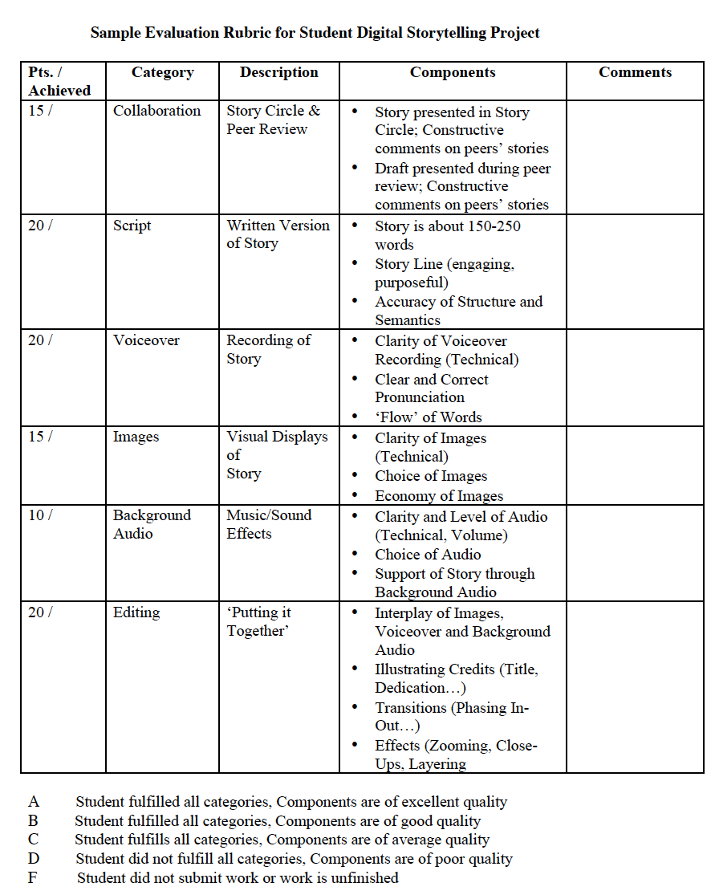
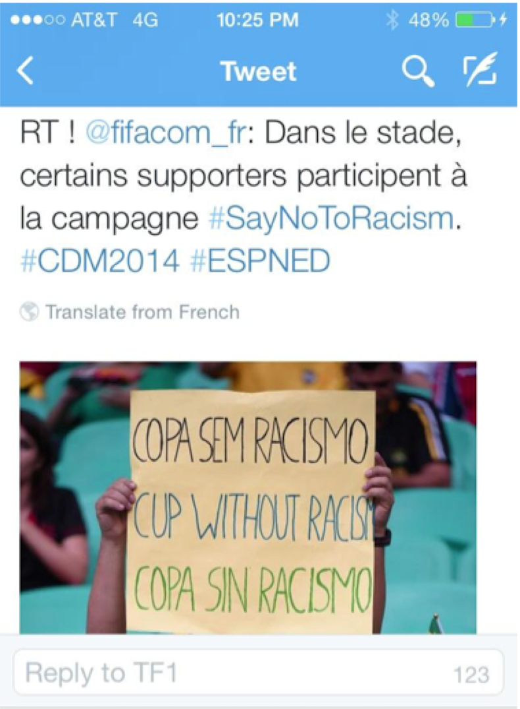
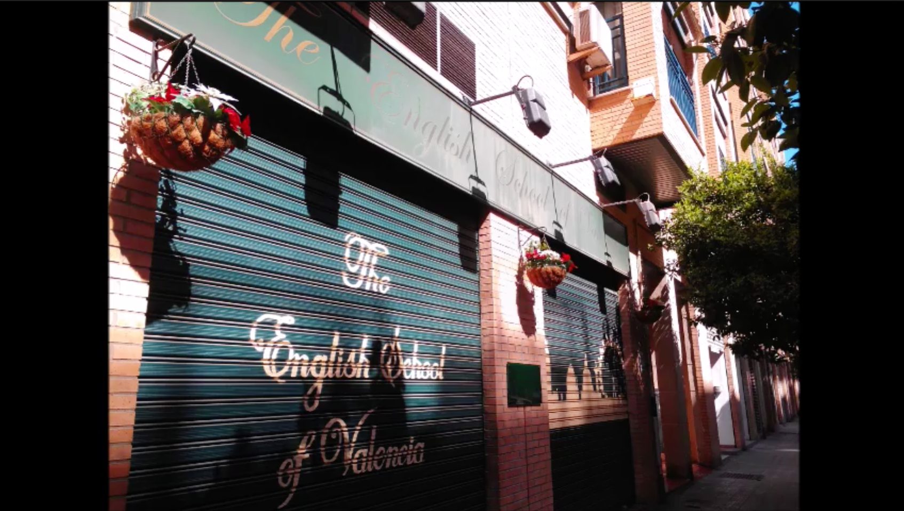
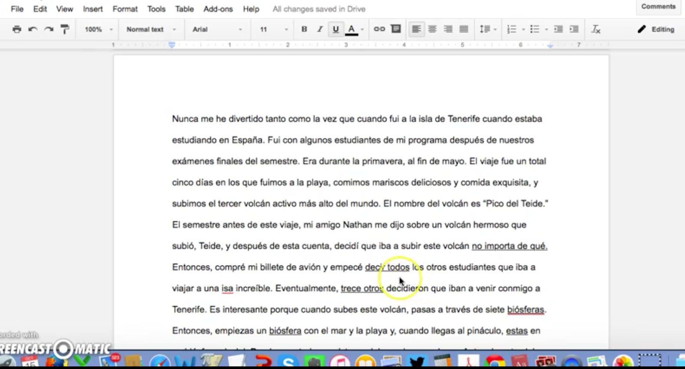
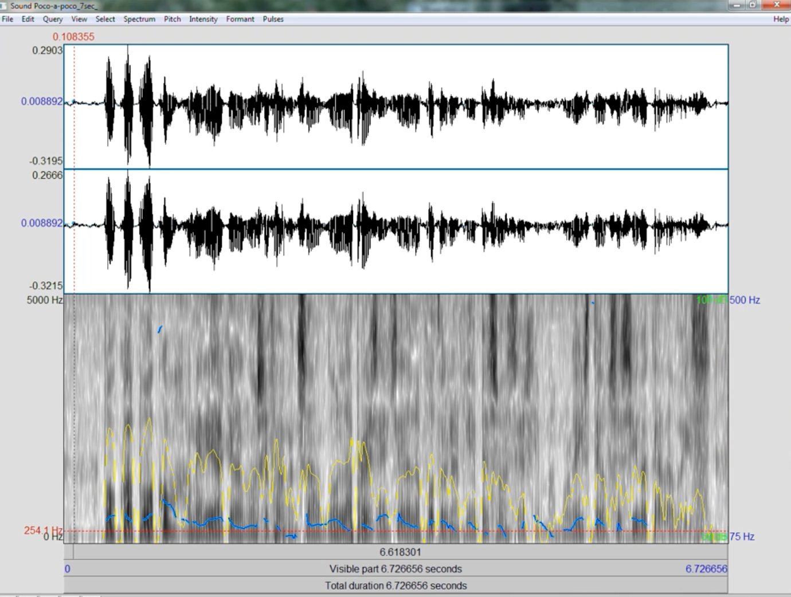
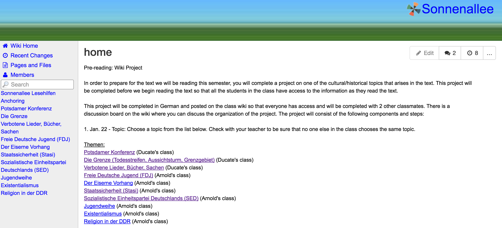
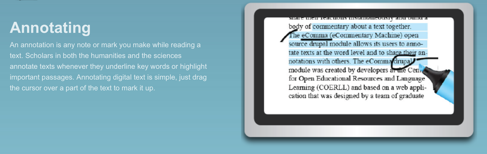
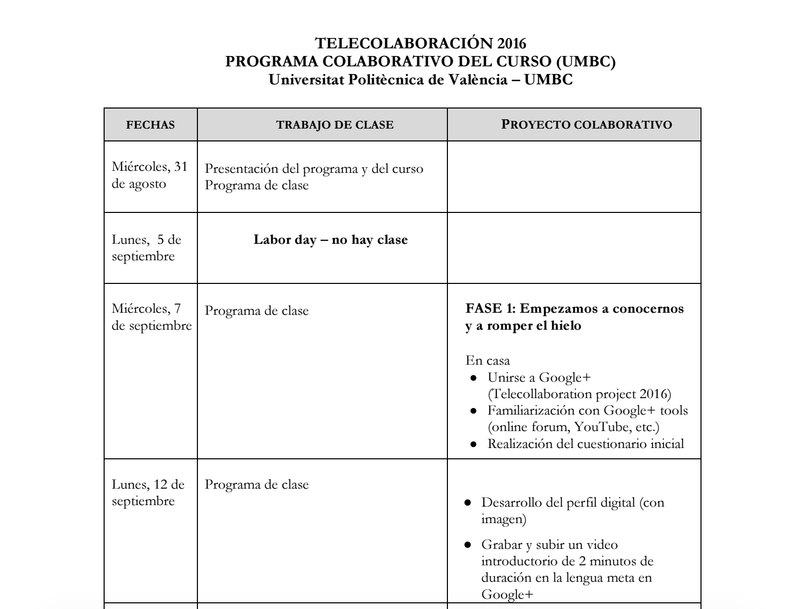
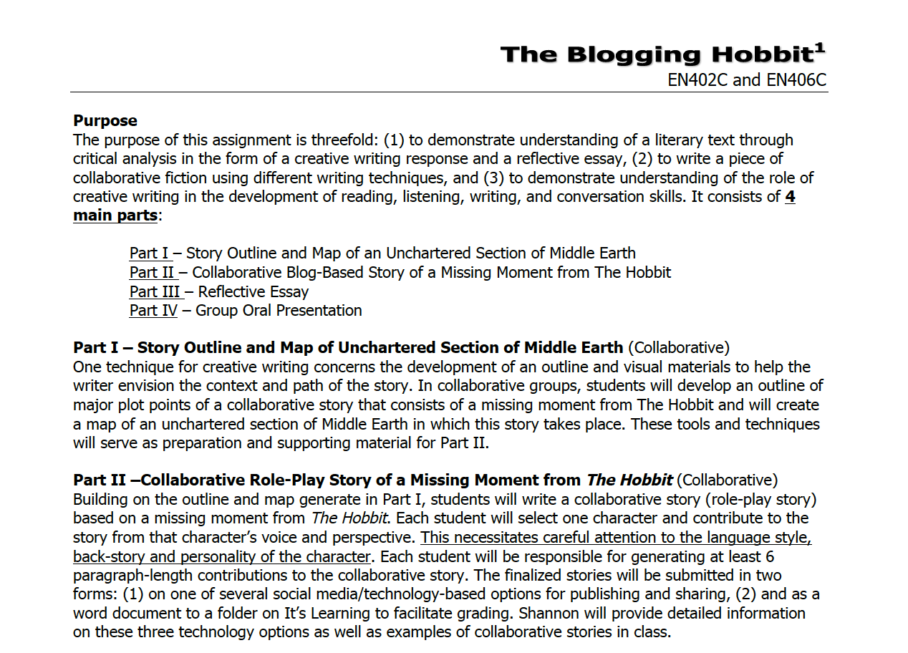
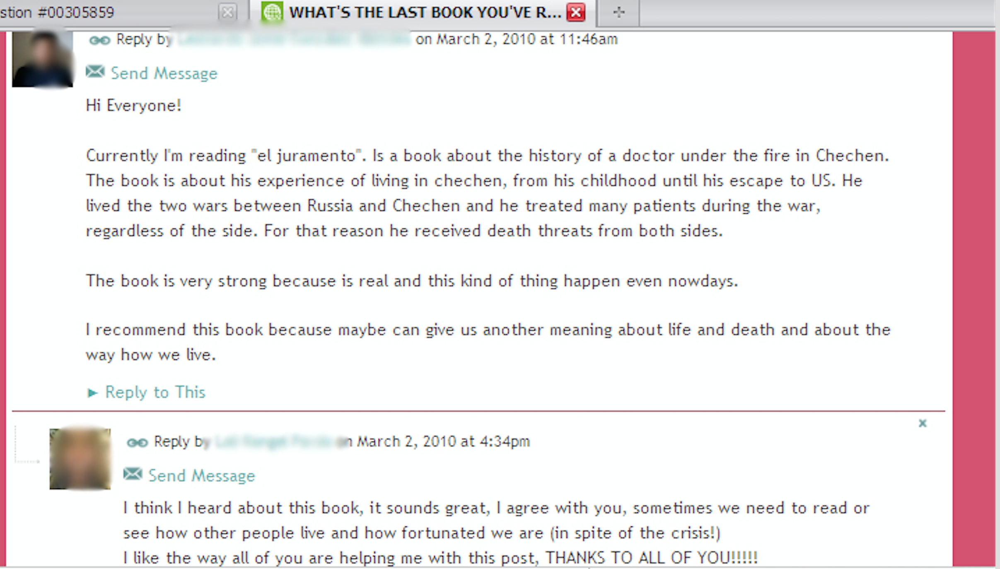

# Language Learning

### Ana Oskoz
University of Maryland, Baltimore County (UMBC)

---

##### Publication Status:
* unreviewed draft
* draft version undergoing editorial review
* draft version undergoing peer-to-peer review
* **draft version undergoing MLA copyediting**
* awaiting pre-print copy
* published 

---

### Cross-Reference Keywords: annotation, authorship, blogging, hashtag, collaboration, fiction, multimodal, reading, story telling 

---  

## CURATORIAL STATEMENT 

There is no question that the definition of language learning has evolved. Language learning was previously defined as obtaining a knowledge of vocabulary and functional grammar; however, it has gradually integrated the awareness of the main types of verbal interactions and registers of language, knowledge of other cultures, socio-pragmatics, and intercultural communication. In recent decades, language learning has also become a multimodal endeavor, which has been further emphasized by the “the rapid expansion of technologies into social, economic, and cultural life” (Lotherington and Ronda 14). This has increasingly transformed communicative practices both outside and within the language classroom. 

The gradual incorporation of new digital tools has both enhanced the capacity of language learners to become active agents of their own language learning process and enriched instructors’ teaching methods and learners’ learning practices in ways that were unimaginable a decade ago. Different modes (textual, aural, visual) and media, “the technological means of inscription and production that shape the ways by which messages are conveyed and accessed” (Guichon and Cohen 510), are used not only to present and receive information but also to actively engage with others. For instance, digital social tools, such as wikis, blogs, and Twitter, have expanded individuals’ reading and writing practices from solitary practices to practices with a strong social component. The inclusion of digital storytelling using digital storytelling software requires a successful mastery of the integration of the visual, aural, and textual modes to convey meaning; however, engaging in these new communicative practices with digital tools surpasses mere technical competencies (Lankshear and Knobel) because it includes the development of a particular way of thinking (Knobel and Lankshear). In relation to the classroom, this means that language learning possibilities change qualitatively because learners are required to expand their notions of context and audience as well as to critically interpret and convey multimodal messages. 
 
The artifacts presented provide examples of different digital tools or genres that have been integrated into the language learning classroom. The tools range from an adapted syllabus, which presents a breakdown of weekly activities in a telecollaborative encounter, to a presentation of screencast software used by instructors to provide aural feedback on learners’ essays, or to a rubric used to assess the main steps and processes involved in developing a digital story. Rather than viewing these artifacts as replications of activities that could occur in face-to-face interactions, the inclusion of these projects implies an expansion of the meaning of language learning. While connecting with members from different cultures is not new, the possibility of including videos, text, images, and synchronous and asynchronous discussions on current experiences in telecollaborative projects enhances language learners’ intercultural experiences. The opportunity to examine native speakers’ language use in social media provides a linguistic and socio-pragmatic unique and different perspective from what an instructor could bring to the language classroom. Replicating communicative practices encountered in interactions outside the class allows learners to develop their linguistic and literary abilities in a meaningful context. Even the use of artifacts in which learners listen to the instructor’s feedback, practice pronunciation, or discuss grammatical points and that could be considered a more advanced version of traditional classroom practices allow learners to be active and responsible knowledge creators and breakdown hierarchical classroom relations.
 
Language learning also implies developing multiliteracies (e.g., information literacies, digital literacies, media literacy) that are necessary in modern society. In this respect, it should be acknowledged that although many learners are savvy users of digital tools for recreational communicative purposes, they might not have the competency to recognize the value of Twitter, for example, “to build a community of like-minded individuals and to use that community for professional and personal development” (Dudeney and Hockly 117). All artifacts presented are supported by carefully crafted teaching philosophies that link language learning with educational and professional learners’ needs. Using the artifacts provided, learners transfer and learn new skills that can potentially enhance their use of digital tools for critical and educational self-improvement and for future professional purposes. 

Finally, incorporating digital pedagogy in language learning classrooms is a matter of social justice (Ortega), as it is the responsibility of educators to develop know-how skills and to implement digital practices to help L2 learners from different cultural and economic backgrounds engage in technology use that enables them to positively impact their economic future. Language educators must understand that implementing fan fiction blogs and digital storytelling or aiding in the development an understanding of Twitter hashtags extends beyond the immediate language and digital goals themselves. Learners should be enabled to become active members of an increasingly technological world (Lomicka and Lord). 

## CURATED ARTIFACTS

#### Digital Story Rubric

* Artifact Type: Rubric
* Source URL: N/A
* Permissions: CC-BY-NC
* Artifact Copy: [Digital Story Rubric](files/LanguageLearning-DSTRubric.pdf)
* Creator and Affiliation: [Polina Vinogradova](http://www.american.edu/profiles/staff/vinograd.cfm) (American University), Bev Bickel (University of Maryland, Baltimore County) and [Heather Linville](https://www.uwlax.edu/profile/hlinville/) (University of Wisconsin, La Crosse)

Assessing digital stories requires rubrics that equally consider a story's textual, visual, aural and digital components. The assessment should also reflect the stages required in the completion of a digital story. The first two criteria focus on the narrative of the story, which includes reading the story aloud in circles and providing and receiving comments related to the narrative, and the script (short, compelling, and linguistically accurate). These criteria are followed by criteria related to the audio, both the voiceover (clear with good pronunciation and intonation) and the background music (supporting without overwhelming the narrator) and the visual component (the appropriate use and amount of explicitly or implicit images to support the message). During the editing process, learners add the components (transitions, effects, credits) that contribute to the final form of the digital story. Providing the rubric at the beginning of the project will help learners integrate their digital literacies. 

#### Hashtag

* Artifact Type: Tweet image
* Source URL: N/A
* Permissions: CC-BY-NC
* Artifact Copy: N/A
* Creator and Affiliation:  [Geraldine Blattner](http://www.fau.edu/french/blattner.php) (Florida Atlantic University), [Amanda Dalola](http://artsandsciences.sc.edu/dllc/directory/Dalola) (University of 
South Carolina), [Lara Lomicka](http://artsandsciences.sc.edu/dllc/Fren/Faculty/facdocs/lomicka.html) (University of South Carolina)
* Tags: Getting started; Twitter

Three instructors from intermediate and advanced French classes asked their learners to follow three French personalities’ tweets to learn about the structural and functional types of hashtags in French and to develop their French sociopragramatic awareness (Blattner, Dalola, and Lomicka 2016). In the example below, the text and the image provide the content of the tweet and the three hashtags connect the topic, racism, to one social movement (#SayNoToRacism) and two sports-related groups (#ESPNED and #CDM2014). Although overall contextual cues generally assisted students in comprehending hashtag use, hashtags that do not use capital letters to separate strings of words or might have an unknown cultural meaning or unfamiliar acronyms can be ambiguous and can affect learners’ understanding of the tweet. By introducing activities with social media that extend beyond the often-stereotyped cultural content of the language textbooks, learners become more aware of the cultural nuances behind language use. 

#### Identity text

* Artifact Type: digital story 
* Artifact Permissions: CC-BY-NC
* Copy of the Artifact: [Identity Text](files/LanguageLearning-IdentityText.mp4)
* Creator and Affiliation: [María Dolores García-Pastor](https://uv.academia.edu/MariaDoloresGarciaPastor) (Universitat de València)
* Tags: advanced; digital story software

Language learning identity texts, which are artifacts that illustrate language learners’ identity construction, emphasize the role of language learners as active agents of their own learning process. To encourage self-reflection, the instructor of an advanced English class in Spain asked her students to develop a digital story in which they presented themselves as language learners by providing an account of either their entire language learning experience or a specific stage of their learning processes. Learners were asked to depict their idiosyncrasies and include their learning styles and strategies in their digital stories. By asking her learners to develop these digital identity texts, the instructor helped learners strengthen their literacy engagement, understand that language learning results from their own efforts, and reject a negative self-view that could prevent them from learning the target language. Because learners were expected to use video or photo-editing programs, they also developed digital literacy skills.

#### Nunca había sido tan feliz

* Artifact Type: image 
* Artifact Permissions: CC-BY-NC
* Copy of Artifact: [Nunca había sido tan feliz](files/LanguageLearning-NuncaHabiaSidoTanFeliz.mp4)
* Creator and Affiliation: Neil Anderson (Texas Tech University)
* Tags: Advanced; Screencast-O-Matic

One of the benefits of a screencast program in a language writing class is that it allows the instructor to provide feedback emphasizing the communicative purpose of the task. To overcome learners’ focus on the linguistic and local elements of an essay, the instructor first provided comments on content, structure, and organization to emphasize that these are fundamental aspects of effective written communication. Then, the instructor focused on local aspects, such as grammar, vocabulary, and editing. A benefit of this software program is that the instructor can use the cursor to hover over an error, which helps learners view the error in context. Albeit probably the least social or interactive of the artifacts presented, learners, who also practiced their listening comprehension, felt engaged in a dialogue with the instructor, which underscores that listening to an instructor’s voice makes feedback more personal and therefore more motivational than written feedback.

#### Poco a poco

* Artifact Type: A short movie showing acoustic analysis software  
* Artifact Permissions: CC-BY-NC
* Copy of the Artifact: [Poco a poco](files/LanguageLearning-Poco-a-poco.mp3)
* Creator and Affiliation: [Gillian Lord](http://people.clas.ufl.edu/glord) (University of Florida) 
* Tags: Advanced; podcast

To help her undergraduate learners develop their pronunciation skills, Lord’s learners completed a series of podcasts (weekly or biweekly) to practice their speech and pronunciation when reading short texts, speaking freely about a topic, or focusing on specific consonants, vowels, or tongue twisters. Because learners’ podcasts were uploaded to learners’ podcast channels (available to class members), learners could leave comments for one another. Learners also self-reflected on their pronunciation, which added a reflective process to the listening task. Learners appreciate receiving comments from peers, analyzing their own speech, and reflecting on their pronunciation skills. Although the example provided (a learner reading one class reading) is from a content class that focused on Spanish phonetics, learners who speak different languages at different language levels could create podcasts to practice their pronunciation and enunciation, leave comments for one another, and reflect on their progress.

#### Sonnenallee

* Artifact Type: website 
* Source URL: [http://sonnenallee.wikispaces.com/](http://sonnenallee.wikispaces.com/) 
* Permissions: CC BY-SA 3.0
* Creator and Affiliation: [Lara Ducate](http://artsandsciences.sc.edu/dllc/german/faculty/facdocs/Lara_Ducate.html) (University of South Carolina) and [Nike Arnold](http://www.pdx.edu/linguistics/nike-arnold) (Portland State
University)
* Tags: Advanced; wiki

Wikis, which allow learners to write collaboratively in a document, have frequently been used in language learning classes. As illustrated in two German classes, the instructors integrated a wiki as a collaborative venue for learners (in groups of three) to discuss and elaborate on the topics required to understand the cultural and historical context of a class reading. Given that collaborative writing can be challenging, the instructors provided explicit instructions regarding how and when to initiate the research, write an outline (including an introduction, a brief history of topic, and the significance of the reading), and work on the first and subsequent drafts. The editing opportunities provided by wikis allow learners to help others and correct others’ errors. The social learning component of wikis is enhanced by the discussion board feature, which allows learners to asynchronously discuss the content of the project as well as its structure and organization.

#### Surrealist poetry

* Artifact Type: website 
* Source URL: [https://ecomma.coerll.utexas.edu/references/ ](https://ecomma.coerll.utexas.edu/references/ ) 
* Permissions: CC BY 3.0
* Creator and Affiliation: [Carl Blyth](http://liberalarts.utexas.edu/frenchitalian/faculty/profile.php?id=blythcs) (The University of Texas at Austin)
* Tags: advanced; eComma

Digital social reading allows L2 learners to crowdsource their reading burdens while also sharing their insights (Blyth, 2014). By annotating in English or French and with images the unclear surreal non-sequiturs and juxtapositions in a surrealist French poem and by reading their classmates’ annotations, Blyth’s learners developed their vocabulary, focused on grammatical features, gained insights into cultural elements, and monitored their understanding. In addition, having learners read a text collaboratively before class allows the instructor to spend class time focusing on areas of greater difficulty and misunderstanding. Given that learners focus on different parts of the readings, the heat map or the sorting features that some social readers have allow the instructors to illustrate and have a class discussion regarding different reading styles and interactions with the text, resulting in a more nuanced and creative text analysis than learners could likely complete individually.

#### Telecollaboration

* Artifact Type: Syllabus 
* Artifact Permissions: CC-BY-NC 
* Copy of the Artifact: [Telecollaboration](files/LanguageLearning-Telecollaboration.pdf)
* Creator and Affiliation: [Ana María Gimeno Sanz](http://agimeno.webs.upv.es/) (Universitat Politècnica de València) 
and [Ana Oskoz](https://anaoskoz.com) (University of Maryland, Baltimore County)
* Tags: Getting started; Google +

This syllabus was used for a telecollaborative interaction between a third-year Spanish class in the US that focused on the history of Spain and an advanced English language class in Spain. Through an online community in Google +, six groups of students (each group had two students from the US and two from Spain) discussed two cultural topics—immigration (in Spanish) and nationalism (in English) from the perspective of the US and Spain. By combining synchronous and asynchronous communication with the use of a variety of digital tools (Google + for asynchronous discussions, Skype for synchronous conversations to resolve final questions, and podcasts to provide final presentations), this international collaboration allowed learners to obtain and provide first-hand information related to cultural practices and perspectives. The interaction helped learners acquire information not found in regular textbooks, and to some extent, it diminished stereotypes and erroneous perceptions about their counterpart’s culture.

#### The Blogging Hobbit

* Artifact Type: Project Description
* Source URL:  
* Artifact Permissions: CC-BY-NC
* Copy of the Artifact: [The Blogging Hobbit](files/LanguageLearning-TheBloggingHobbit.pdf)
* Creator and Affiliation: [Shannon Sauro](http://ssauro.info/index.html) (University of Malmö) and [Björn Sundmark](http://forskning.mah.se/en/id/lubjsu) (University of Malmö)
* Tags: Getting started; blogs, Archive of Our Own

Sauro and Sundmark (2016) incorporated the practice of online fandom in the classroom to help learners enhance their understanding of literary texts through the development of critical literary analyses and blog-based collaborative writing. For this project, learners were divided into groups and focused on underdeveloped moments from *The Hobbit*. By compiling visual materials to support their plots, learners (re)produced a fictional space in which the story was set, allowing the writer/reader to associate the event with a specific time and place. Whether working on blogs, a fan fiction site, such as Archive of Our Own, or using another social media tool, the learners, who each assumed the role of one of the characters, used their characters’ voices to collaboratively co-construct their stories (ultimately uploaded to the class site). Requiring learners to employ visual and textual modes along with collaborative writing using social media enhances learners’ multi-literacy competencies

#### What’s happeNING?

* Artifact Type: Educational Social Network Site 
* Artifact Permissions: CC-BY-NC (for image, edited for privacy of students)
* Creator and Affiliation: [Ana Brígido-Corachán](https://uv.academia.edu/AnnaMBrigidoCorachan) (Universitat de València) and Mª Goretti Zaragoza-Ninet (Universitat de València)
* Tags: Getting started; NING

At the Universitat de València, two English language instructors introduced NING, an educational social network site, into their advanced English classes (Brígido-Corachán and Zaragoza-Ninet). Their purposes in introducing this platform were to (a) develop learners’ grammatical competence through a balanced practice of listening, writing, and reading skills, (b) foster participation by building an affective atmosphere that would motivate learners while increasing engaged collective informal learning, and (c) enhance learners’ digital competency. Through combinations of blogs, forums, videos, and the development of a digital story, learners focused on formal, instructive, and reflective discourse as well as on other forms of free expression. The collaborative nature of NING allowed instructors to create an environment that extended beyond traditional hierarchical classroom relations, promoted collaborative and autonomous learning skills, created a multidirectional network of interactive peers and instructors, and helped learners develop digital competency.

## RELATED MATERIALS

Arnold, Nike et al. “Collaborative Writing in Wikis: Insights from Culture Project in German Class.” *The Next Generation: Social Networking and Online Collaboration in Foreign Language Learning*. Edited by Lara Lomicka and Gillian Lord, CALICO Monograph Series, Vol. 5, Texas State UP, 2009, pp. 115–44.

Elola, Idoia, and Ana Oskoz. “Supporting Second Language Writing Using Multimodal Feedback.” *Foreign Language Annals*, vol. 49, no. 1, 2016, pp. 58–74.

García-Pastor, María Dolores. “Learners’ Identities at Stake: Digital Identity Texts in the EFL Classroom.” *Language Value*, vol. 9, no. 1, 2017, pp. 36–61.

Lord, Gillian. “Podcasting Communities and Second Language Pronunciation.” *Foreign Language Annals*, vol. 41, no. 2, 2008, pp. 364–79. 

Vinogradova, Polina. “Digital Stories in a Language Classroom: Engaging Students through a Meaningful Multimodal Task.” *The FLTMAG*, 2014, http://fltmag.com/digital-stories/

## WORKS CITED

Anderson, Neil. “Nunca había sido tan feliz.” Instructor feedback. Advanced Composition. Texas Tech University, Lubbock. Fall 2015.

Geraldine Blattner, Dalola, Amanda, and Lomicka, Lara. Hashtag. Intermediate French Culture I and Intermediate French Culture II. Florida Atlantic University. Boca Raton. Fall 2015.

Blattner, Geraldine et al. “Mind Your Hashtags: A Sociopragamatic Study of Student Interpretations of French Native Speakers’ Tweets.” *Handbook of Research on Foreign Language Education in the Digital Age*, edited by Congcong Wang and Lisa Winstead, IGI Global, 2016, pp. 33–58.

Blyth, Carl. “Digital Social Reading for L2 Literacy: Ecomma.” *Digital Literacies in Foreign and Second Language Education*, edited by Guikema, Janel Pettes, and Lawrence Williams, Vol. CALICO Monograph Series Volume 12, CALICO, 2014, pp. 201–26.

Blyth, Carl.  *Surrealist Poetry*. Fourth semester French course. University of Texas at Austin. Austin. https://ecomma.coerll.utexas.edu/references/. Accessed 1 December 2016.
 
Brígido-Corachán Anna, and Mª Goretti Zaragoza-Ninet. “What’s happeNING.” Educational Social Network Site. English Language III. Universitat de València. Valencia. Fall 2009.
 
Brígido-Corachán, Anna, and María Goretti Zaragoza-Ninet. “What’s Happening? Expanding the ESL Classroom through Educational Social Network Sites.” *Digital Competence in Higher Education: An International Perspective*. Edited by Pérez Cañado, María Luisa, and Juan Ráez Padilla, Peter Lang, 2014, pp. 52–72.

Ducate, Lara and Nike Arnold. “Sonnenallee.” Student work. Intermediate German and Composition and Conversation. University of South Carolina, Columbia, and University of Tennessee, Knoxville. Spring 2008

Dudeney, Gavin, and Nicky Hockly. “Literacies, Technology and Language Teaching.” *The Routledge Handbook of Language Learning and Technology*, edited by Fiona Farr and Liam Murray, Routledge, 2016, pp. 115–26.

García-Pastor, María Dolores. “Identity Text.” Student work. 33663 Foreign Language Teaching I (English). Universitat de València, Valencia. Spring 2015.
 
Gimeno-Sanz, Ana María, and Ana Oskoz. “Telecollaboration.” Syllabus. Spanish Culture I. University of Maryland, Baltimore County. Baltimore City. Fall 2016.

Guichon, Nicolas, and Cathy Cohen. “Multimodality and Call.” *The Routledge Handbook of Language Learning and Technology*, edited by Fiona Farr and Liam Murray, Routledge Handbooks in Applied Linguistics, Routledge, 2016, pp. 509–21.

Knobel, Michele and Colin Lankshear, editors. *A New Literacies Sampler*. Peter Lang, 2007.

Lankshear, Colin and Michele Knobel. “Introduction: Digital literacies—Concepts, Policies and Practices.” *Digital Literacies: Concepts, Policies and Practices*. Edited by Coling Lankshear and Michele Knobel, Peter Lang, 2008, pp. 1–16.

Lomicka, Lara and Gilllian Lord. “Podcasting—Past, Present and Future: Applications of Academic Podcasting in and out of the Language Classroom.” *Academic Podcasting and Mobile Assisted Language Learning: Applications and Outcomes*. Edited by Betty Rose Facer and M’hammed Abdous, IGI Global, 2011, pp. 1–20.
 
Lord Gillian. “Poco a poco.” Student work. Spanish Phonetics. University of Florida, Gainesville.  Spring 2007.
 
Lotherington, Heather, and Natalia Ronda. “2b or Not 2b? From Pencil to Multimodal Programing: New Frontiers in Communicative Competences.” *Digital Literacies in Foreign and Second Language Education*. Edited by Guikema, Janel Pettes and Lawrence Williams, Vol. 10, CALICO, 2014, pp. 9–28.

Ortega, Lourdes. “New CALL-SLA Research Interfaces for the 21st Century: Towards Equitable Multilingualism.” *CALICO Journal*, vol. 34, no. 3, 2017, pp. 285–316.

Sauro, Shannon and Björn Sundmark. “Report from Middle-Earth: Fan Fiction Tasks in the EFL Classroom.” *ELT Journal*, vol. 70, no. 4, 2016, pp. 414–423.

Sauro, Shannon and Björn Sundmark. “The Blogging Hobbit.” Project description. EN402C and EN406C. University of Malmö. Malmö. Fall-Spring 2014-15

Vinogradova, Polina, Bev Bickel, and Heather Linville. “Digital story rubric”. New Media and Culture and Cross -Cultural Communication and University Life. University of Maryland, Baltimore County. Baltimore City, Summer 2008 and Fall 2008.
