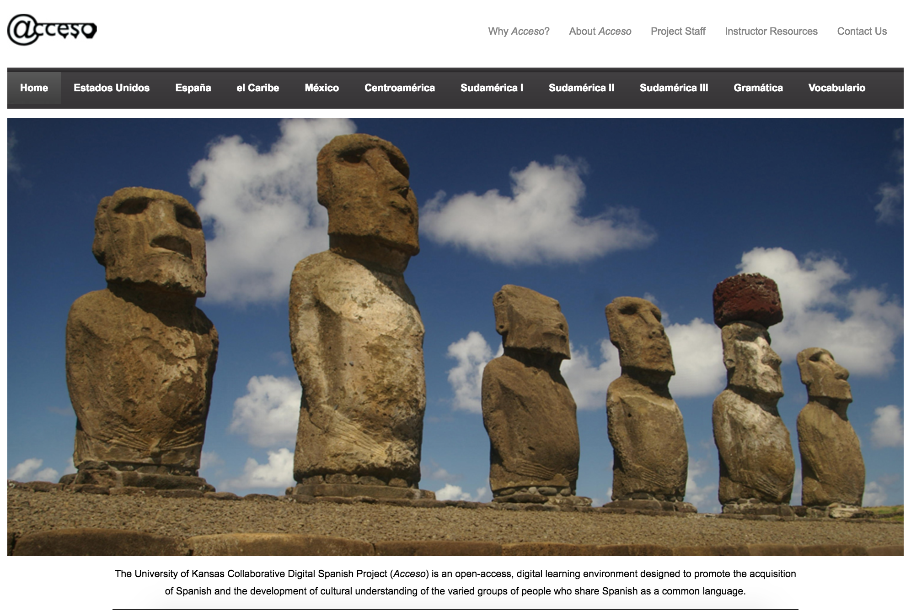
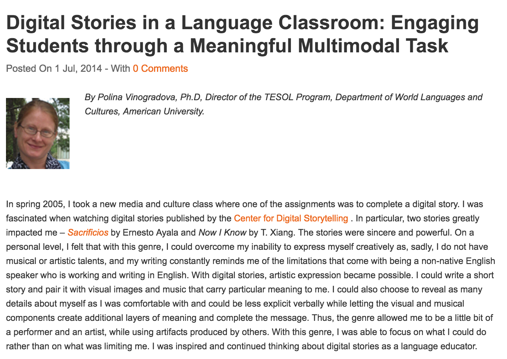
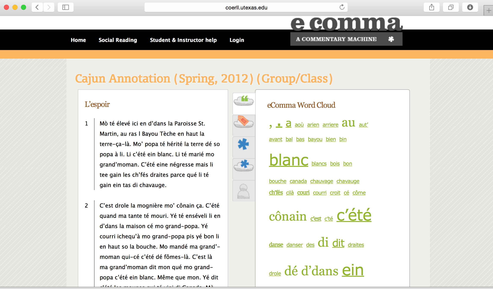
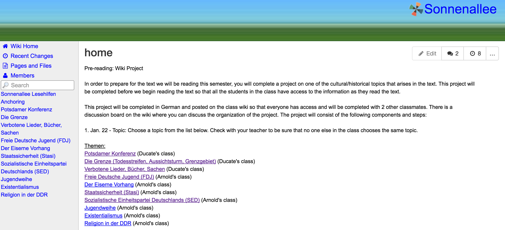
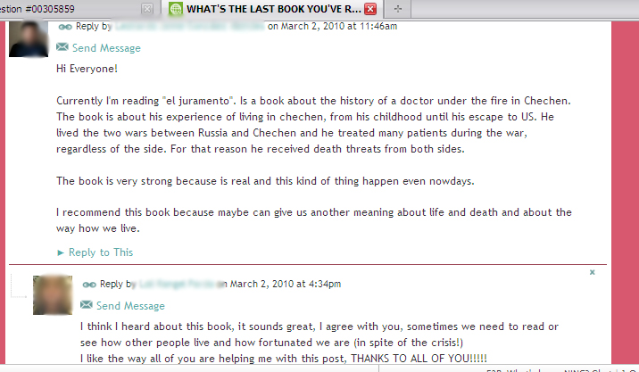

--- 
title: Digital Pedagogy in the Humanities
subtitle: Concepts, Models, and Experiments 
chapter: Language Learning
URL: keywords/language_learning.md
author: 
- family: Oskoz
  given: Ana
editor: 
- family: Davis
  given: Rebecca Frost
publisher: Modern Language Association
type: book
---

# LANGUAGE LEARNING (Draft)

### Ana Oskoz
University of Maryland, Baltimore County (UMBC) | Website

---

##### Publication Status:
* unreviewed draft
* draft version undergoing editorial review 
* **draft version undergoing peer-to-peer review** 
* published

---

## CURATORIAL STATEMENT 

There is no question that today’s foreign language (FL) learning reflects the increasing relevance of the development of learners’ communicative competence (Partnership for 21st Century Skills 2011). It is not about learning the technical aspects of language, usually grammar, but about how to use the language for communicative purposes. As such, in recent decades standards or guidelines for FL learning, such as the pedagogical framework of the Standards for Foreign Language Learning (National Standards) in the United States or the European Reference Framework (European Commission) in Europe have emphasized that language learning needs to move beyond the pure linguistic elements to include “the sociolinguistic and cultural aspects of the language” (National Standards 1). The European Commission, on its part, states that FL learning

	> is based on the ability to understand, express and interpret concepts, thoughts, feelings, facts and opinions in both oral and written form (listening, speaking, reading and writing) in an appropriate range of societal and cultural contexts (in education and training, work, home and leisure) according to one’s wants or needs. Communication in foreign languages also calls for skills such as mediation and intercultural understanding. (5)

Albeit using different terminology, both frameworks expect individuals to achieve knowledge of vocabulary, functional grammar, and awareness of the main types of verbal interaction and registers of language—to gain knowledge of societal conventions and the cultural aspects and variability of languages; become lifelong language learners; and have a positive attitude and appreciation of cultural diversity, together with an interest and curiosity in languages and intercultural communication.

Although technology has always played a pivotal role in language learning, perhaps because “the rapid expansion of technologies into social, economic, and cultural life has incredibly transformed communicative practices” (Lotherington and Ronda 14), the integration of language learning and technology has intensified in recent years. The gradual incorporation of new digital tools, which has enhanced the capacity of learners to become active agents of their own language learning process, has enriched instructors’ teaching and learners’ learning practices in ways that were unimaginable a decade ago. Digital social tools such as wikis, blogs, and Twitter have expanded individuals’ reading and writing practices, shifting them from being solitary practices to having a strong social component, which moves language learning beyond the traditional classroom walls. In addition, although not inherently unique to the integration of social tools, language learning has become a multimodal endeavor in recent decades. Different modes (textual, aural, visual) and media, "the technological means of inscription and production that shape the ways by which messages are conveyed and accessed" (Guichon and Cohen, 510), are used to present and receive information. The language learning possibilities, therefore, have changed qualitatively. Yet, when integrating all these tools it is imperative to keep in mind the communicative purposes of the different media, and not get sidetracked by their novelty.

The artifacts presented provide examples of meaningful implementations of digital technology for language learning, including enhancing learners’ writing, reading, speaking, and listening skills; helping them in their cultural understanding; aiding them in their comprehension of cross-cultural pragmatics; and even developing their own identity as language learners, which builds their agency in their own language learning process. Most of the selected tools are relatively accessible to instructors and learners, and some are free to use. These tools allow learners to receive input and produce output in the target language in a variety of formal and informal settings, either individually or collaboratively. In using some of these tools, the instructors or developers have a substantial role in content development, whereas in others the learners are the active creators of knowledge. The following tools have been selected because they provide learners with input that is similar to that found in the target language classes. In other instances however, tools such as Twitter, or social platforms such as Google + help learners familiarize themselves with new modes of communication in the target language, and facilitate informal learning, which is rarely a focus in higher education classes. These artifacts range from an adapted syllabus, which presents the breakdown of weekly activities in a telecollaborative encounter, to thepresentation of screencast software with which the instructor provides aural feedback on his learners’ essays, or an article that describes the main steps when developing a digital story. All these tools and projects enhance learners’ language knowledge while developing their digital skills for educational and professional purposes. Although many of our learners are savvy users of digital tools for recreational communicative purposes, they might not have the competency to recognize the value of, for example, Twitter “to build a community of like-minded individuals and to use that community for professional and personal development” (Dudeney & Hockly 117). In many of the artifacts provided, learners transfer and learn new skills to enhance the use of digital tools for critical and educational self-improvement. 

## CURATED ARTIFACTS (ten artifacts, each with metadata, a screenshot, and a 150-word annotation)

### Acceso – Spanish

* Artifact Type: Webpage 
* Source URL:  [http://acceso.ku.edu](http://acceso.ku.edu) 
* Artifact Permissions: 
* Copy of the Artifact: 
* Creator and Affiliation: [Amy E. Rossomondo](https://spanport.ku.edu/amy-rossomondo) (University of Kansas)

The Collaborative Digital Spanish Project *Acceso*, created at the University of Kansas, is an open-access platform that is free to anyone with Internet access. This platform, which is a complete, interactive curriculum for intermediate-level learners of Spanish, includes videos and readings on current topics, as well as grammar and vocabulary sections. More importantly, the six categories (Apertura, Voces, Almanaques, Sucesos, Un paso más, and Perspectivas) under each unit allow learners to enter the virtual Spanish-speaking world, which allows them to understand and interpret thoughts, feelings, facts and opinions, by linking to sites that connect learners with content read and seen by Spanish-native speakers. These units also include interactive activities and comprehension checks where learners can test their comprehension skills. Because of the digital nature of *Acceso*, its content is always up-to-date and relevant. From a pedagogical perspective, the curriculum is research-based and in line with current best practices in foreign language teaching. Thus, it makes the most of technological tools to enhance the learners’ learning experience.

### Digital stories in the Language Classroom

* Artifact Type: Article 
* Source URL: [http://fltmag.com/digital-stories/](http://fltmag.com/digital-stories/) 
* Artifact Permissions: 
* Copy of the Artifact: 
* Creator and Affiliation: [Polina Vinogradova](http://www.american.edu/profiles/staff/vinograd.cfm) (American University)

Digital stories, story lines that integrate text, images, and sounds in an
online environment are all increasingly used in the second language (L2) classroom environment. 
In the submitted online article, Polina Vinogradova talks about the linguistic
and digital literacy benefits of digital storytelling. After pointing out the
seven elements of a successful digital story, the author provides examples of
how different instructors have implemented digital stories in their L2 and FL
classrooms. In terms of linguistic development (despite the more commonly
striking visual and oral modes) the written text is one of the foundations of
digital stories. The writing and rewriting of the short narrative (~250 words)
requires learners to compose several drafts and receive feedback from both the
teacher and learners (see the Implementation steps outlined). With regards to
digital literacy, learners are required to master the use of digital story
software to successfully combine text, images, and sound to create a new
meaning.  The sample rubrics (see Appendix 2A and 2B) highlight the instructors’
relevant elements within the context of their classes.

### eComma

* Artifact Type: website 
* Source URL: [https://ecomma.coerll.utexas.edu](https://ecomma.coerll.utexas.edu) 
* Artifact Permissions: 
* Copy of the Artifact: 
* Creator and Affiliation: [Carl Blyth](http://liberalarts.utexas.edu/frenchitalian/faculty/profile.php?id=blythcs) (The University of Texas at Austin)

eComma, a free software module that plugs into Drupal, is an open source content management system that can be used synchronously or asynchronously and that allows a group of users to (a) annotate the same text together, and (b) share their annotations with one another. As seen in the work of Blyth (2014), regardless of its use in L2 sociolinguistic or L2 reading courses, eComma learners “crowd source” their reading burdens at the same time that they share their insights. Blyth, for example, asked his learners to annotate a poem’s surreal non-sequiturs and juxtapositions. Through the digital social reading (and learning!) facilitated by eComma, learners not only post multiple comments but also reply to their classmates’ entries. The result is a more nuanced and creative text analysis than learners could have probably done on their own. 

### Hashtag

* Artifact Type: Tweet
* Source URL: 
* Artifact Permissions: 
* Copy of the Artifact: 
* Creator and Affiliation:  [Geraldine Blattner](http://www.fau.edu/french/blattner.php) (Florida Atlantic University), [Amanda Dalola](http://artsandsciences.sc.edu/dllc/directory/Dalola) (University of 
South Carolina), [Lara Lomicka](http://artsandsciences.sc.edu/dllc/Fren/Faculty/facdocs/lomicka.html) (University of South Carolina)

Twitter can be used as a tool to expose L2 learners to authentic and culturally rich linguistic input, to aid them in their comprehension of cross-cultural pragmatics, and to enhance their digital skills. In the example presented in this artifact, the instructors asked their intermediate and advanced French learners to use Twitter to learn about the structural and functional types of hashtags in French. The instructors asked their students to join or log into their pre-existing Twitter accounts, and select three personalities (from a list of pre-selected French native speakers) to follow for 10 weeks. The relevance of following the tweets, including their hashtags, of the different personalities is that learners recognize the gap between formal and informal language. The latter is not only frequently used in social media and casual spoken communication among native speakers, but knowledge on it is also necessary to successfully participate in the daily interactions in the target language. 

### Identity text

* Artifact Type: digital story 
* Source URL:  	
* Artifact Permissions: (provided by creator)
* Copy of the Artifact: [files/language_leraning-Ester-Vizcaino-Zaera.mp4](files/language_leraning-Ester-Vizcaino-Zaera.mp4)
* Creator and Affiliation: [María Dolores García-Pastor](https://uv.academia.edu/MariaDoloresGarciaPastor) (Universitat de València)

Language learning identity texts, artifacts that illustrate language learners’ identity construction, emphasize the role of language learners as active agents of their own language learning process. To encourage learners’ self-reflection, the instructor of an advanced English class in Spain asked her students to develop a digital story in which they presented themselves as language learners by providing an account of either their entire language learning experience or a specific stage in their learning process. In addition to including a “dramatic question” in their stories, they were asked to depict their idiosyncrasies and include their learning styles and strategies. By asking her learners to develop these digital identity texts, the instructor hoped to help learners strengthen their literacy engagement or reject a negative identity that prevents them from learning the target language. Because they were expected to use video or photo-editing programs, these students also developed their digital literacy. 

### Nunca había sido tan feliz

* Artifact Type: image 
* Source URL: 
* Artifact Permissions: Permission to use screencast requested.
* Copy of the Artifact: 
* Creator and Affiliation: Neil Anderson (Texas Tech University)

One of the benefits of a screencast program in the language writing class is that it allows the instructor to emphasize the communicative purpose of the task. To overcome learners’ focus on the linguistic and local elements of an essay, the instructor in this example first provided comments on content, structure, and organization to emphasize that these are fundamental aspects of effective written communication. Then, the instructor focused on local aspects, such as grammar, vocabulary, and editing. A benefit of this software program is that the instructor can use the cursor to hover over the area where the error is, which thus helps learners see the error in context.  Albeit probably the least social and interactive of the artifacts presented, learners feel engaged in a dialogue with the instructor, which underscores that hearing the instructor’ s voice makes the feedback more personal and therefore motivational than written feedback.

### Poco a poco

* Artifact Type: A short movie showing acoustic analysis software  
* Source URL: 
* Artifact Permissions: (provided by creator) 
* Copy of the Artifact: [files/language_learning-poco-a-poco-in-praat-2.mp4](files/language_learning-poco-a-poco-in-praat-2.mp4)
* Creator and Affiliation: [Gillian Lord](http://people.clas.ufl.edu/glord) (University of Florida) 

Learners’ pronunciation is often neglected in Spanish language classes.  Gillian Lord uses podcasts to help her undergraduate learners in a phonetic class develop their pronunciation.  In her classes, learners complete a series of podcasts (either weekly or biweekly) to practice their speech and pronunciation when reading short texts, speaking freely about a topic, or focusing on specific consonants, vowels, or tongue twisters. Because learners’ podcasts are uploaded to learners’ podcast channels (available to class members), learners provide comments to one another. Learners also self-reflect on their pronunciation, which adds a reflective process to the listening task.  Learners appreciate receiving comments from their peers, analyzing their own speech, and reflecting on their pronunciation. The example presented is from one of the learners in her classes completing one of the class readings.  Although the example provided is from a content class focusing on Spanish phonetics, learners from different languages and language levels could complete podcasts to practice their pronunciation and enunciation, provide comments to one another, and reflect on their progress.

### Sonnenallee

* Artifact Type: website 
* Source URL: [http://sonnenallee.wikispaces.com/](http://sonnenallee.wikispaces.com/) 
* Artifact Permissions: 
* Copy of the Artifact: 
* Creator and Affiliation: [Lara Ducate](http://artsandsciences.sc.edu/dllc/german/faculty/facdocs/Lara_Ducate.html) (University of South Caroline) and [Nike Arnold](http://www.pdx.edu/linguistics/nike-arnold) (Portland State
University)

Wikis, which allow learners to write collaboratively in a document, have frequently been used in language learning classes. As seen in the two German classes presented in the example, the instructors integrated the wiki as a collaborative venue for learners (in groups of three) to discuss and elaborate on the topics required to understand the cultural and historical context of a class reading. Given that collaborative writing can be challenging, the instructors provided explicit instructions on how and by when to initiate the research, write an outline (including introduction, brief history of topic and the reading significance), and work on the first and subsequent drafts.  The editing possibility of the wiki allows learners to help and correct each other’s errors. The social learning of wikis is enhanced by their discussion board feature, which allows learners to asynchronously discuss the content of the project, as well as its structure and organization. 

### Telecollaboration

* Artifact Type: Syllabus 
* Source URL:  
* Artifact Permissions: (provided by creator) 
* Copy of the Artifact: [files/language_learning-Collaborative_schedule.pdf](files/language_learning-Collaborative_schedule.pdf)
* Creator and Affiliation: [Ana María Gimeno Sanz](http://agimeno.webs.upv.es/) (Universitat Politècnica de València) 
and [Ana Oskoz](https://anaoskoz.com) (University of Maryland, Baltimore County)

This syllabus belongs to a telecollaborative encounter between a third-year Spanish class focusing on the history of Spain and an advanced English language class. Through an online community in Google +, six groups of students (each group has two students from the US and two from Spain) discussed two cultural topics—immigration (in Spanish) and nationalism (in English) from the perspective of the US and Spain. By combining synchronous and asynchronous communication with the use of a variety of digital tools (Google + for asynchronous discussions, Skype synchronous conversations to resolve final questions, and podcasts to provide final presentations), this international collaboration allowed learners to obtain and provide first-hand information about cultural practices and perspectives. The interaction helped learners acquire information not found in regular textbooks and, to some extent, diminish stereotypes and erroneous perceptions. 

### What’s happeNING?

* Artifact Type: forum 
* Source URL:  
* Artifact Permissions: provided by creator
* Copy of the Artifact: 
* Creator and Affiliation: [Ana Brígido-Corachán](https://uv.academia.edu/AnnaMBrigidoCorachan) (Universitat de València) and Mª Goretti Zaragoza-Ninet
(Universitat de València)

At the Universitat de València, two of the English instructors introduced NING, an educational social network site, into their advanced English class. Their purpose in introducing this platform was to (a) develop learners’ grammatical competence through a balanced practice of listening, writing, and reading skills, (b) foster participation by building an affective atmosphere that would motivate learners while increasing engaged collective informal learning, and (c) enhance learners’ digital competency.  Through the combinations of blogs, forums, videos, and even the development of a digital story, learners focused on formal, instructive and reflective discourse, as well as on other forms of free expression. The collaborative nature of NING allowed instructors to create an environment that moved beyond traditional hierarchical classroom relations, promoted collaborative and autonomous learning skills, created a multidirectional network of interactive peers and instructors, and helped learners develop their digital competency. 

## RELATED MATERIALS

Arnold, Nike, Lara Ducate, and Claudia Kost. “Collaborative Writing in Wikis:
Insights from Culture Project in German Class.” *The Next Generation: Social
Networking and Online Collaboration in Foreign Language Learning.* Ed. Lara
Lomicka and Gillian Lord. CALICO Monograph Series, Vol. 5. San Marcos: Texas
State UP, 2009. 115–44. Print. 

Blattner, Geraldine, Amanda Dalola, and Lara Lomicka. “Mind Your Hashtags: A
Sociopragamatic Study of Student Interpretations of French Native Speakers’
Tweets.” *Handbook of Research on Foreign Language Education in the Digital Age.*
Ed. Congcong Wang and Lisa Winstead. Hershey, PA: IGI Global, 2016. Print.

Brígido-Corachán, Anna, and María Goretti Zaragoza-Ninet. "What's Happening?
Expanding the Esl Classroom through Educational Social Network Sites." *Digital
Competence in Higher Education: An International Perspective.* Eds. Pérez Cañado,
María Luisa and Juan Ráez Padilla. Frankfurt am Main, Germany: Peter Lang, 2014.
52–72. Print. 

Elola, Idoia, and Ana Oskoz. “Supporting Second Language Writing
Using Multimodal Feedback.” *Foreign Language Annals* 49.1 (2016): 58–74. Print.

Lord, Gillian. “Podcasting Communities and Second Language Pronunciation.”
*Foreign Language Annals* 41.2 (2008): 364–79. Print.

## WORKS CITED

Blyth, Carl. "Digital Social Reading for L2 Literacy: Ecomma." *Digital Literarcies in Foreign and Second Language Education.* Eds. Guikema, Janel Pettes and Lawrence Williams. Vol. CALICO Monograph Series Volume 12. San Marcos,Texas: CALICO, 2014. 201-26. Print.

Dudeney, Gavin , and Nicky Hockly. "Literacies, Technology and Language Teaching." *The Routledge Handbook of Language Learning and Technology.* Eds. Farr, F and L Murray. New York, NY: Routledge, 2016. 115-26. Print.

European Commission. “Key Competences for Lifelong Learning – A European Framework.” *Lifelong Learning Programme.* British Council. 2007. Online.

Guichon, Nicolas, and Cathy  Cohen. "Multimodality and Call." *The Routledge Handbook of Language Learning and Technology.* Eds. Farr, Fiona and Liam  Murray. Routledge Handbooks in Applied Linguistics. New York, NY: Routledge, 2016. 509-21. Print.

Lotherington, Heather, and Natalia Ronda. "2b or Not 2b? From Pencil to Multimodal Programing: New Frontiers in Communicative Competences." *Digital Literacies in Foreign and Second Language Education.* Eds. Guikema, Janel Pettes and Lawrence Williams. Vol. 10. San Marcos, TX: CALICO, 2014. 9–28. Print.

National Standards. *Standards for Foreign Language Learning in the 21st Century.* 3rd ed. Yonkers, NY: National Standards in Foreign Language Education Project, 2006. Print.

---. *Standards for Foreign Language Learning: Preparing for the 21st Century* (Executive Summary). Yonkers, NY: American council on the teaching of foreign languages, 1996. Print.

Partnership for 21st Century Skills. “P21 World Languages Map.” *21st Century Skills Map.* ATCFL. (2011). Online.

Vinogradova, Polina. "Digital Stories in a Language Classroom: Engaging Students through a Meaningful Multimodal Task." *The FLTMAG* (2014). Web.
