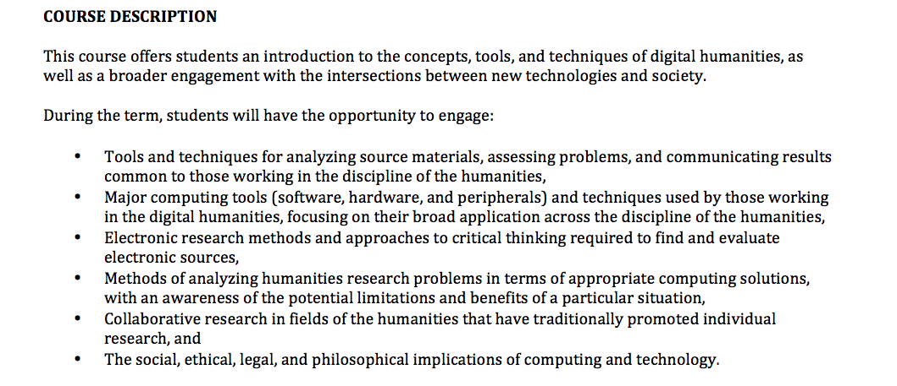
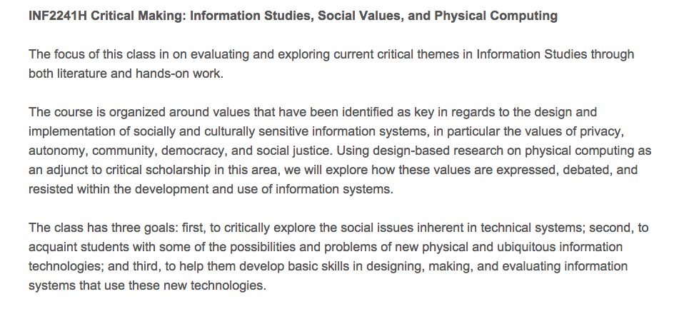
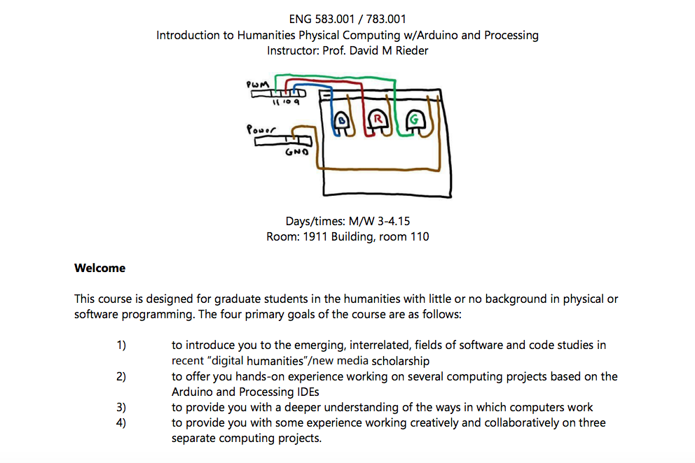
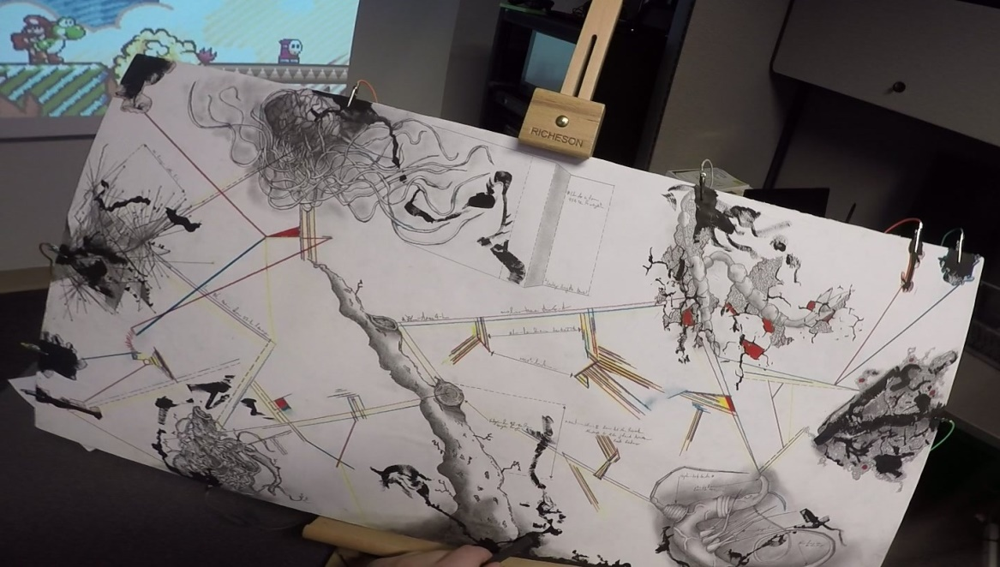
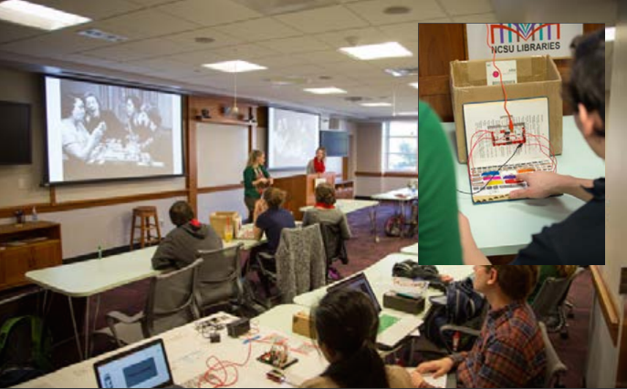
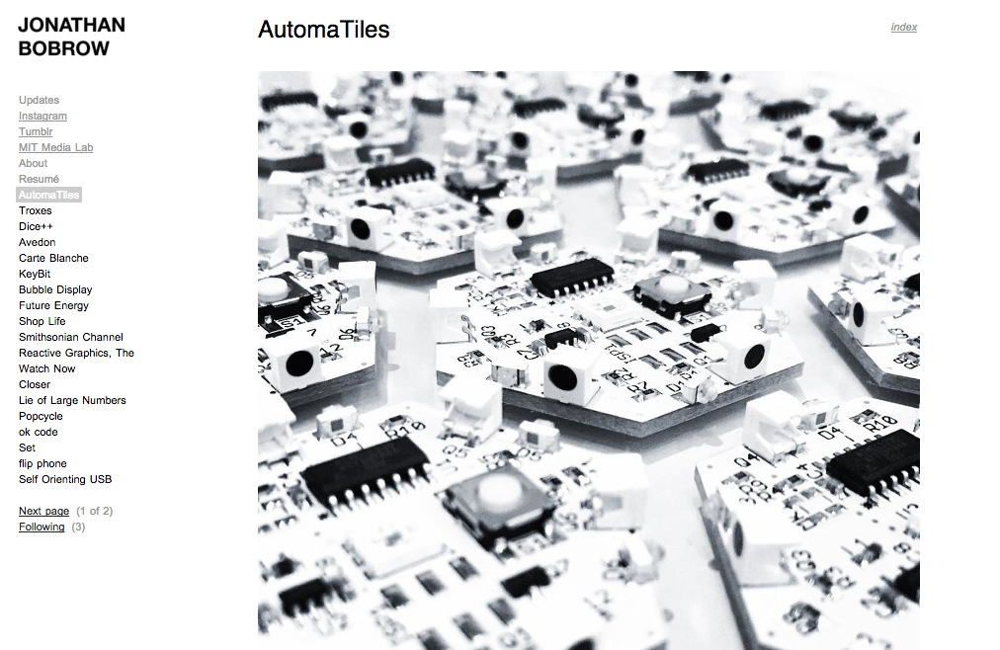
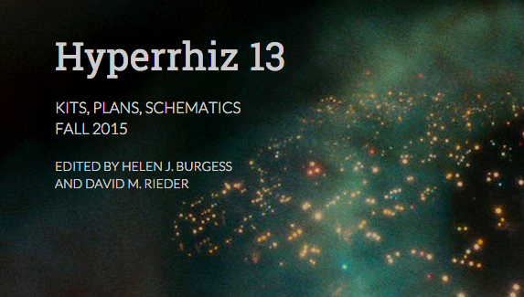
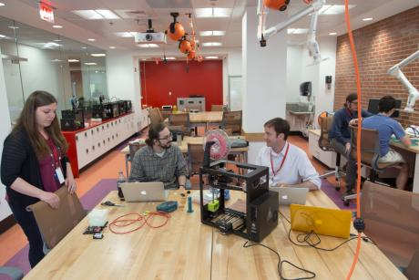
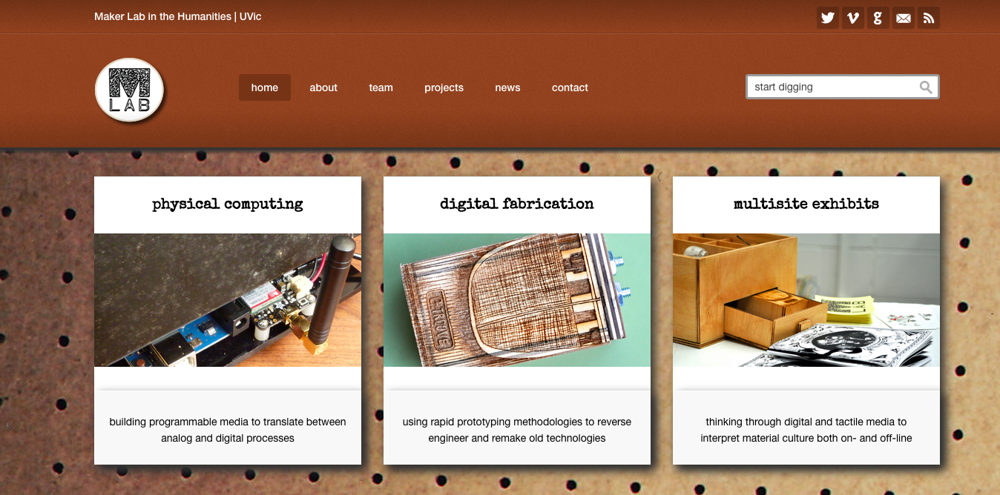
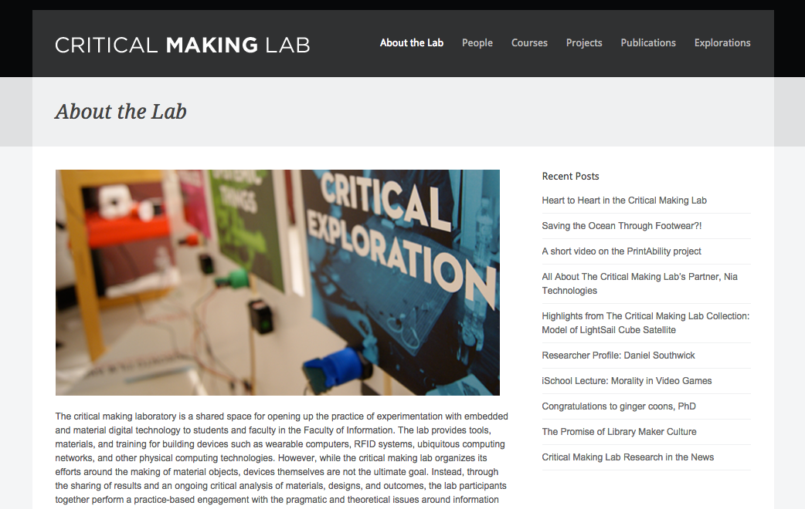

# MAKERSPACES (DRAFT)

## David M. Rieder and Jessica Elam-Handloff (North Carolina State University)

---

##### Publication Status:

* unreviewed draft
* **draft version undergoing editorial review**
* draft version undergoing peer-to-peer review
* published

---

## CURATORIAL STATEMENT

Makerspaces are community-oriented places in which an ethos of do-it-yourself (DIY) experimentation with new technologies and materials coalesces with the goals of sharing knowledge and collaborating on project design and development. They are spaces in which high and low tech are combined, where computing and crafting can share space on the same workbench - where a 3D printer might share counter space with a sewing machine, a touchscreen and stylus with sketch paper and charcoal pencil, and where tools serving the space could include wire cutters and fabric scissors, soldering filament and Mod Podge, as well as a broad range of micro-sensors, lights, and motors, various kinds of wood and metal, safety glasses and a reciprocating saw. As a sign of the eclecticism of many makerspaces, it is not uncommon to find a white board covered in anything from technical diagrams, storyboarded drawings, and lines of code, to poetic verse, mathematical equations, and wireframe mockups. 

Makerspaces are an increasingly important location for digital pedagogy in the humanities for several reasons. First, makerspaces promote an inquiry-based approach to learning that values experimentation, tinkering, and play as important means of discovery. Massimo Banzi, who is cofounder of the Arduino project, underscores the importance of this approach to learning. He  argues that “it is essential to play with technology, exploring different possibilities directly on hardware and software – sometimes without a very defined goal” (Banzi and Shiloh 6). Within these spaces, the bricoleur has a home in which to explore what Claude Levi-Strauss once characterized as a ‘science of the concrete’ (Levi-Strauss). 

Second, these spaces promote cross-disciplinary collaboration, which helps students and faculty move beyond the historic division between the sciences and the humanities. In the late-1950s,  C.P Snow gave a lecture titled “The Two Cultures” during which he spoke about the “gulf of mutual incomprehension” that separated humanists from scientists (Snow 4). He lamented the gulf, characterizing it as a “sheer loss to us as people, and to our society” (Snow 12). Snow may have been excited to witness the rise of makerspaces because of the ways in which the gulf is made more comprehensible, the rift separating the disciplines ameliorated. Related to the goals of sharing knowledge, makerspaces promote the ideals of the open software and hardware movements; the right to copy is always toward the left, i.e., toward the public domain. 

Third, makerspaces empower students and faculty in the humanities to expand their notion of what it means to think and engage critically with the world. Matt Ratto introduces the context for this point of empowerment as follows: “most people consider thinking a linguistic practice – an internal monologue in which we use conceptual categories to make sense of the world around us. Similarly, we tend to think of criticality as a particular form of thinking, one in which we pause to reflect, and step briefly away from action in the world in order to reason and consider these actions” (Hertz). The problem with this persistent bias in the humanities is that it holds back students and faculty from engaging creatively and critically with the wide range of non-linguistic materials comprising the built environments in which we increasingly live as well as with new forms of creativity and critical expression. Makerspaces promote an engagement with new forms of critical thinking through the process of making. 

Makerspaces can be found across the Americas, Europe, and in a growing number of locations in Asia and Africa. They are established in residential garages, community centers, schools, libraries, and museums. While there may be presently over 100 makerspaces in name across the world, when they are combined with hackerspaces or hack labs, fab(rication) labs, TechShops, and Men’s Sheds, which all share a related mission, their numbers grow into the thousands (Halverson and Sheridan).  The philosophical and counter-cultural origins of makerspaces can be traced back to the late-1960s when publisher and author Stewart Brand helped popularize the ideal of hacker culture. In the late-1960s, hackers were promoted by Brand as a burgeoning techno-elitist class of creatives and ‘outlaw’ experimentalists. It is for this reason that makerspaces are considered an off-shoot of the hackerspaces and hack labs that preceded them in name. More recently, makerspaces are associated with maker culture and the Maker Movement, which, since 2005, has been promoted by the bimonthly periodical Make Magazine and the Maker Faires associated with them. Make Magazine has promoted a culture of DIY and do-it-with-others (DIWO) project development by featuring hundreds of projects in its print magazine and website, publishing step-by-step technical guides, a “skill builder” section for learning everything from how to operate a laser cutter, sew leather with an awl, or 3D print objects, to name a few.

While makerspaces and maker culture are lauded for their democratizing potential, they have also been criticized for recreating some of the historic biases toward male-oriented. In an essay titled “Why I am Not a Maker,” Debbie Chachra recontextualizes the excitement to make and build within a social history in which women are marginalized: “The cultural primacy of making, especially in tech culture . . . is informed by the gendered history of who made things, and in particular, who made things that were shared with the world, not merely for hearth and home” (Chachra). Related to Chachra’s argument, Beth Buchholz et al argue that the maker “movement’s potential to transform education rests in our ability to address notable gender disparities” (278).  Makerspaces are a compelling location in a digital humanities curriculum for promoting new, cross-disciplinary forms of innovation and creativity, but it is important to realize that specific materials, tools, and technical processes are linked to social histories that have marginalized women and other groups. It is incumbent on digital pedagogues to consider these concerns as they work to promote the positive values of these spaces. 

Stephen Ramsay once wrote, “to me, there’s always been a profound – and profoundly exciting and enabling – commonality to everyone who finds their way to [the digital humanities]. And that commonality, I think, involves moving from reading and critiquing to building and making” (“On Building”). Makerspaces are a locations in which the profound excitement about which Ramsay wrote can be found. For students and faculty in the humanities, makerspaces empower us to explore the potential of new materials, so that we can connect and communicate with broader audiences both in and outside of the university. 

The selection of artifacts that follow are meant to represent broadly the kinds of coursework, projects, and work spaces comprising the pedagogical shift to making and maker culture in the digital humanities.

## CURATED ARTIFACTS

## Syllabi

### Introduction to Digital Humanities

* Artifact Type: syllabus 
* Source URL: [http://jenteryteaches.com/2011/150/syllabus_huma150.pdf](http://jenteryteaches.com/2011/150/syllabus_huma150.pdf)
* Creator: Jentery Sayers

The Introduction to Digital Humanities course taught by Jentery Sayers, Assistant Professor in the Department of English at the University of Victoria, combines critical analysis, material engagement, and collaborative research to expose students to the Digital Humanities. This foundational course includes integral sections on cultural and political issues within DH and overviews of tools and technologies, building a critical framework and knowledge base for further digital scholarship.

### Critical Making

* Artifact Type: syllabus 
* Source URL: [http://criticalmaking.com/courses/](http://criticalmaking.com/courses/)
* Creator: Matt Ratto

The Critical Making course developed by Matt Ratto, Associate Professor in the Faculty of Information at the University of Toronto, merges theory and practice in a seminar-and-lab setting. The course is open to and encourages novice participation, employing a scaffolded approach to learning new physical computing technologies in parallel with literature covering critical and emerging issues in information systems.

### Introduction to Humanities Physical Computing

* Artifact Type: syllabus
* Source URL: [http://siteslab.org/resources/RIEDER_ENG583-798_FALL2011.pdf](http://siteslab.org/resources/RIEDER_ENG583-798_FALL2011.pdf)
* Creator: David Rieder

David Rieder's graduate-level seminar invites students with little or no technical background to engage with software and code studies in digital humanities contexts in order to confer greater technical and conceptual comprehension of physical computing. This course offers a mix of theoretical, textual, and hands-on engagements in order to enhance students’ ability to think with technologies and invent through programming languages for a deeper understanding of the tools and techniques of the digital humanities. The course assignments begin with the basics and lead up to inventive projects and presentations, including critical essays, that demonstrate critical-technical scholarship.

## Projects

### SmoothSketch

* Artifact Type: project
* Source URL: [http://tinyurl.com/smoothsketch](http://tinyurl.com/smoothsketch)
* Creator: Eddie Lohmeyer

SmoothSketch is a Makey Makey powered easel and graphite game controller created by Eddie Lohmeyer, a doctoral student in the Communication, Rhetoric, and Digital Media (CRDM) program at North Carolina State University. Created partly in the Circuit Research Studio media lab at NCSU, the SmoothSketch installation explores non-representational interventions in digital gameplay through a reading of Gilles Deleuze’s concepts of smooth and striated space. SmoothSketch was created for a graduate game studies seminar with an open-ended final project requirement that opened exploration of the course theme of digital gaming and embodiment to multiple avenues of scholarly production. Incorporating opportunities for material engagement into assignments for traditional seminars expands the ways in which theory and practice become enmeshed in the classroom.

### Interpretive Machines

* Artifact Type: course assignment/projects
* Source URL: [http://www.lib.ncsu.edu/sites/default/files/files/pdfs/Vol.31no.3.Focus.online.pdf](http://www.lib.ncsu.edu/sites/default/files/files/pdfs/Vol.31no.3.Focus.online.pdf) (pp. 18-19)
* Creator: Paul Fyfe

Paul Fyfe, Associate Professor in the Department of English at North Carolina State University, taught an Honors English seminar titled “Interpretive Machines” in Fall 2015. The course focused on rethinking modes of cultural communication from historical, theoretical, and hands-on perspectives. The seminar’s final project involved the ground-up building of an object that incorporated course themes and explorations. These projects included, among others, an arduino-powered tone-typing QWERTY keyboard exploring textual and aural modalities of composition, an arduino-powered surveillance book that registered motion and location, and a Makey Makey powered conductive tape and Play Doh keyboard embedded in an old thesaurus challenging participants to consider algorithmic text input. Along with design documents and reflection journals, these projects encompass traditional texts and material engagement with new media through classroom learning and hands-on experience in sessions facilitated by the university’s makerspace. Such an approach to teaching and learning enmeshes theory and practice to extend student learning beyond the traditional text.

### AutomaTiles

* Artifact Type: project
* Source URL: [http://cargo.jonathanbobrow.com/AutomaTiles](http://cargo.jonathanbobrow.com/AutomaTiles)
* Creator: Jonathan Bobrow

Emerging from the MIT Media Lab, AutomaTiles is composed of individual, interlocking electronic components responding to touch, proximity to other tiles, and sound to produce different emergent outputs. Intended to explore systems thinking, AutomaTiles creator Jonathan Bobrow emphasizes the gestalt notion that the sum is other the whole of its parts through engagement with physical objects rather than just through digital simulation. AutomaTiles is not only a maker project from which students might learn systems thinking and processes through exploration and play with both the tiles and the digital design tool, but also illustrates an example of the ways in which maker projects and material engagement might be harnessed for innovative scholarly practices within the digital humanities.

### Hyperrhiz 13 & Rutgers-Camden Exhibit

* Artifact Type: publication & gallery exhibition
* Source URL: [http://hyperrhiz.io/hyperrhiz13/](http://hyperrhiz.io/hyperrhiz13/) & [https://digitalstudies.camden.rutgers.edu/2015/10/05/hyperrhiz-kits-plans-and-schematics/](https://digitalstudies.camden.rutgers.edu/2015/10/05/hyperrhiz-kits-plans-and-schematics/)
* Creators: Helen J. Burgess & David M. Rieder, eds.

Issue 13 of the journal Hyperrhiz, themed “Kits, Plans, and Schematics,” curated nine projects that combined DIY maker culture with humanities scholarship. These projects were later displayed in an exhibit at Rutgers University-Camden Digital Scholarship Center, inviting visitors to engage with the projects, while Hyperrhiz hosts the open access documentation and guides. The combined publication and exhibit represent one answer to questions surrounding the navigation of traditional scholarly publications and project-based digital scholarship. These projects may serve as a range of examples for project-based course assignments in introductory digital humanities courses. Additionally, the open-source documentation offers students the opportunity to explore, build, modify, or reimagine these projects as an introduction to what’s possible through maker tools and technologies, and perhaps inspiration for their own explorations of particular theoretical insights and course themes.

## Spaces

### D.H. Hill Library Makerspace

* Artifact Type: university makerspace
* Source URL: [http://www.lib.ncsu.edu/do/make-at-hill](http://www.lib.ncsu.edu/do/make-at-hill)
* Creator: D.H. Hill Library, North Carolina State University

The D.H. Hill Library Makerspace at North Carolina State University is a free to access DIY space equipped with maker tools like 3D printers, 3D scanners, sewing machines, soldering irons, electronics prototyping kits, a laser cutter and more. The space is part of a larger project within the NCSU libraries to cultivate a maker community and ensure the tools, technology, and support involved with making are accessible to all of campus. Libraries staff involved with the Hill Makerspace also facilitate classes, teach workshops, and provide consultations with students and faculty on their projects. These collaborations offer faculty and students the opportunity for hands-on experience with tools and tech that might otherwise seem intimidating without instruction. Bringing the classroom to the makerspace opens the range of possibilities for project-based coursework and demonstrates the cross-disciplinary nature of makerspace-facilitated learning.

### The Maker Lab in the Humanities (MLab)

* Artifact Type: university makerspace
* Source URL: [http://maker.uvic.ca/](http://maker.uvic.ca/)
* Creator: Jentery Sayers, Director

The Maker Lab in the Humanities (MLab) at the University of Victoria facilitates critical scholarship for teams of humanities faculty and students through physical computing, digital fabrication, and other digital humanities endeavors. MLab teams emphasize a critical approach to making and research, focusing on the processes of engaging with material components. Work emerging from the MLab has found its way to international conferences, publications, galleries, and exhibits. The experimental ethos inherent in the MLab takes coursework to interesting places, offering insights into the range of material engagements pedagogial strategies might draw upon to ask and/or reveal new and different types of questions in the course of Digital Humanities scholarship.

### Critical Making Lab

* Artifact Type: university makerspace
* Source URL: [http://criticalmaking.com/](http://criticalmaking.com/)
* Creator: Matt Ratto

The Critical Making Lab facilitates critical scholarship through hands-on engagement with the material and process-based learning rather than a focus on end products. Projects in the Critical Making Lab often involve a range of disciplines and modes of exploration, physical computing endeavors combining design, rapid prototyping, manufacturing, and crafting. The lab team boasts prolific publications on the projects emerging from the space, and also hosts a Critical Making course (see artifact #2 for syllabus). The cross-disciplinary collaboration in the Critical Making Lab empowers students and faculty alike to critically engage with the material in order to overcome the linguistic bias of "thinking," offering the opportunity for critical exploration and play. 

## RELATED MATERIALS

- Adafruit Industries Educator Resources. [https://www.adafruit.com/educators/](https://www.adafruit.com/educators/)
- “Arduino, the Documentary." [https://www.youtube.com/watch?v=lGkpWWY3JHk](https://www.youtube.com/watch?v=lGkpWWY3JHk)
- Arduino Software (IDE) download. [https://www.arduino.cc/en/Main/Software](https://www.arduino.cc/en/Main/Software)
- Make: Magazine articles, project ideas, and guides. [http://makezine.com/](http://makezine.com/)
- Processing Software download. [https://processing.org/](https://processing.org/)

## WORKS CITED

- Anderson, Chris. Makers: The New Industrial Revolution. New York: Crown Business, 2014. Print.
- Banzi, Massimo and Michael Shiloh. Make: Getting Started with Arduino. 3rd Ed. Sebastopol, CA: Maker Media, Inc, 2015. Print.
- Chachra, Debbie. “Why I Am Not a Maker.” The Atlantic. 23 Jan 2015. Web.
- Halverson, Erica Rosenfeld and Kimberly M. Sheridan. “The Maker Movement in Education.” Harvard Educational Review. 84:4 (Winter) 2014. Print.
- Levi-Strauss, Claude. The Savage Mind. Chicago: The University of Chicago Press, 1966. Print.
- Ramsay, Stephen. “On Building.” Stephen Ramsay Blog. 11 January 2011. 1 March 2016. Web.
- Hertz, Garnet and Matt Ratto. “Conversations in Critical Making.” Blueshift Series. Ctheory: 21C008C (May 2015). Web.
- Rosenfeld Halverson, Erica and Kimberly M. Sheridan. “The Maker Movement in Education.” Harvard Educational Review (Winter 2014): 495 - 504. Print.
- Snow, C.P. “The Two Cultures and The Scientific Revolution.” The Rede Lecture. New York: Cambridge University Press, 1961. Web. 