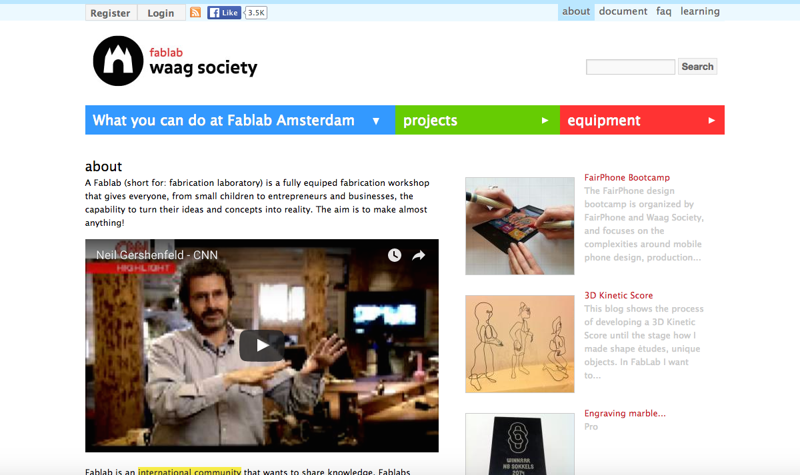
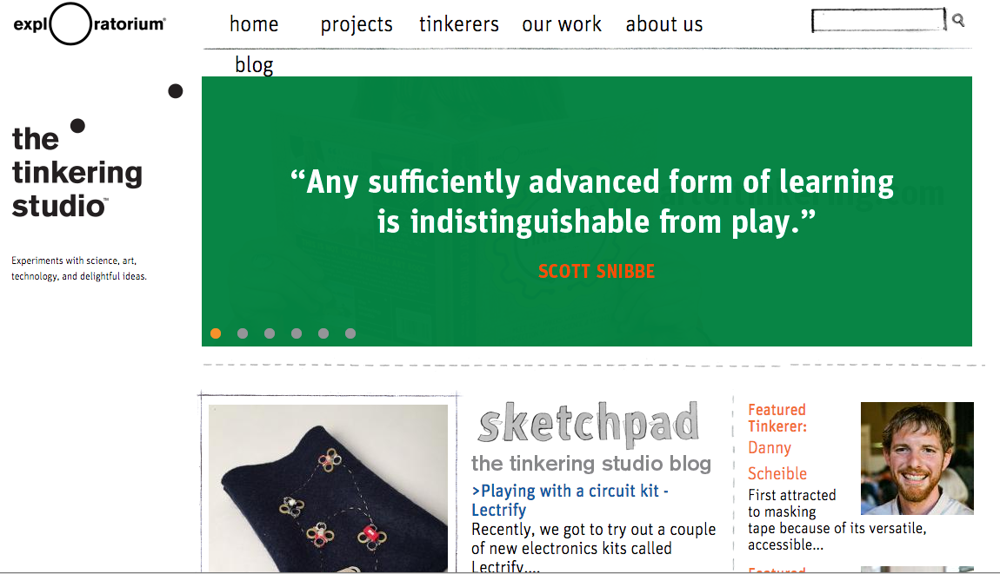
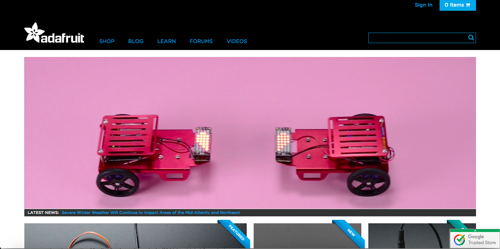
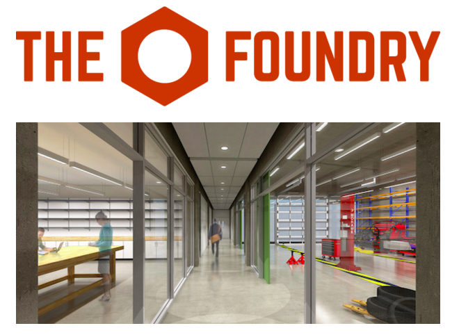
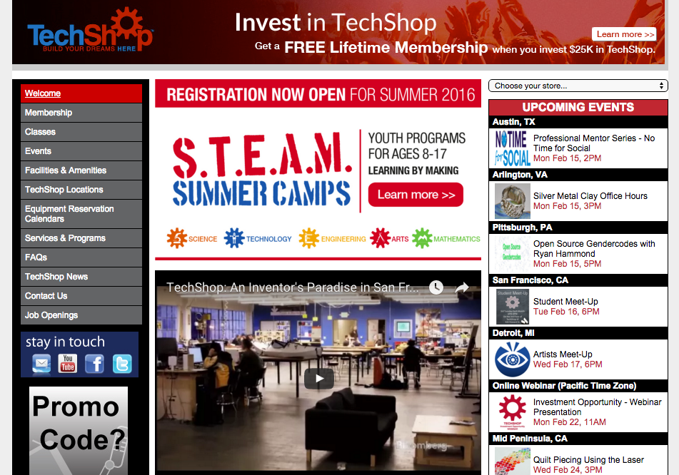
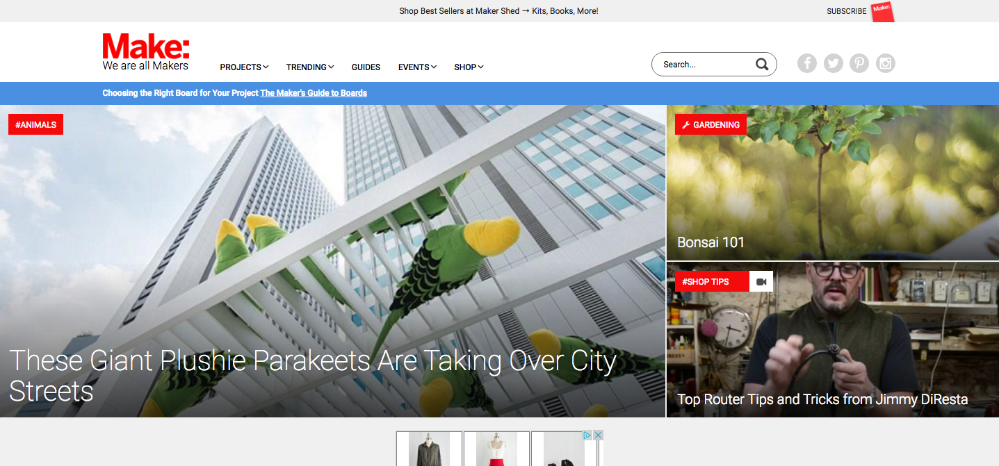

# MAKERSPACES (DRAFT)

## David M. Rieder and Jessica Elam-Handloff (North Carolina State University)

---

##### Publication Status:

* unreviewed draft
* **draft version undergoing editorial review**
* draft version undergoing peer-to-peer review
* published

---

## CURATORIAL STATEMENT

Makerspaces are community-oriented places in which an ethos of do-it-yourself (DIY) experimentation with new technologies and materials coalesces with the goals of sharing knowledge and do-it-with-others (DIWO) collaborations on projects. They are spaces in which high and low tech are combined, where computing and crafting can be combined - where a 3D printer might share counter space with a sewing machine, a touchscreen and stylus with sketch paper and charcoal pencil, and where tools serving the space could include wire cutters and fabric scissors, soldering filament and Mod Podge, as well as broad range of micro-sensors, lights, and motors, various kinds of wood and metal, safety glasses and reciprocating saw . As a sign of the eclecticism of many makerspaces, it is not uncommon to find a white board covered in anything from technical diagrams, storyboarded drawings, and lines of code, to poetic verse, mathematical equations, and wireframe mockups. They are spaces in which the historic division between the sciences and the humanities, which C.P Snow once characterized as the “two cultures,” are increasingly blurred. Related to the goals of sharing knowledge, makerspaces promote the ideals of the open software and hardware movements; the right to copy is always toward the left, i.e., toward the public domain.

>MATT: nice intro. Two things: 1. Please add CP Snow to works cited; and 2. Please keep the "digital pedagogy in the humanities" context -- and particularly "the humanities" in mind. Ie., the keyword should include some exploration not just of makerspaces in generally, but more specifically makerspaces in the context of digital pedagogy in the humanities.

Makerspaces can be found across the Americas, Europe, and in a growing number of locations in Asia and Africa. They are established in residential garages, community centers, schools, libraries, and museums. While there may be presently over 100 makerspaces in name across the world, when they are combined with hackerspaces or hack labs, fab(rication) labs, TechShops, and Men’s Sheds, which all share a related mission, their numbers grow into the thousands. Some proponents of the maker movement with which makerspaces are associated, argue that its practitioners are engaging in industrial revolution – one in which desktop computing technologies and the web contribute to a shared and open approach to micro-manufacturing (Anderson).

>MATT: Again, great -- but can you relate it to the classroom here or in the ensuing paragraphs? What are the implications of this work and these spaces for humanities pedagogy? 

The philosophical and counter-cultural origins of makerspaces can be traced back to the late-1960s when publisher and author Stewart Brand helped popularize the ideal of hacker culture. In the late-1960s, hackers were promoted by Brand as a burgeoning techno-elitist class of creatives and ‘outlaw’ experimentalists. It is for this reason that makerspaces are considered an off-shoot of the hackerspaces and hack labs that preceded them in name. More recently, makerspaces are associated with maker culture and the Maker Movement, which since 2005, have been promoted by bimonthly periodical Make Magazine and the Maker Faires associated with them. Make Magazine has promoted a culture of DIY and DIWO project development by featuring hundreds of projects in its print magazine and website, publishing step-by-step technical guides, a “skill builder” section for learning everything from how to operate a laser cut wood, sew leather with an awl, or 3D print objects, to name a few.  

>MATT: please add Brand to Works Cited. Please take another look at the last sentence here -- "how to operate a laser cut wood" should be reprased

>MATT: also: perhaps its important to include a reference to a work that critiques, or at least complicates/interrogates the hacker/maker/DIY construct? Perhaps *Fred Turner's [From Counterculture to Cyberculture](http://fredturner.stanford.edu/books/from-counterculture-to-cyberculture/)* could be helpful here.

While makerspaces were started outside of a formal, educational context, the informal, DIY approach to learning, the DIWO approach to project development, and the ethos of the bricoleur that is exemplified by the wide range of tools, technologies, and materials comprising these spaces, have been increasingly valued by academics – as well as have the ways in which makerspaces point toward new, interdisciplinary configurations (Rosenfeld Halverson and Sheridan). Extending Stephen Ramsay’s argument about the essential role of “building” in digital humanities work, makerspaces participate in a similarly novel “kind hermeneutic of – one that is quite a bit more radical than taking the traditional methods of humanistic inquiry and applying them to digital objects” (On Buil).

>MATT: please add all works mentioned here to the works cited. Please also correct your last parenthetical citation

>MAATT: Overall, this is a good introduction to makerspaces, but as mentioned above, I'd like to see more explicit connections to humanities classrooms. As a Curator's Statement, too, there should be some explanation of your principles of selection of the artifacts below. Why did you choose what you chose? 

## CURATED ARTIFACTS

>MATT: A few global notes on your selections: 1. We have recently instituted a requirement that at least two artifacts should be syllabi or assignments. Can you please add two such artifacts to your list (keeping the overall limit of 10)? 2. Your keyword is interesting, as it focuses on a type of space. But rather than offer the Lab itself as the artifact, I think it might be worthwhile to focus on a **specific** project in each location that you want to highlight, as the principle aim here is to give people ideas that they can use in our teaching. 3. Having said that, you may want to have a few entries where you focus specifically on space, and so the design/set-up of an entire lab might be important. If you want to go that way, perhaps include no more than three such listings. 4. You might consider grouping your entries into sub-categories, especially if "Spaces" is one of the categories you want to explore. 5. Finally, I that for each artifact below, clear connections to pedagogy should be made in each of the annotations. Again, the central question people should find answered is "How can I use this in my own teaching practice?"

### D.H. Hill Library Makerspace

* Artifact Type: university makerspace
* Source URL: http://www.lib.ncsu.edu/do/make-at-hill
* Creator: D.H. Hill Library, North Carolina State University

The D.H. Hill Library Makerspace at North Carolina State University is a free to access DIY space equipped with maker tools like 3D printers, 3D scanners, sewing machines, soldering irons, electronics prototyping kits, a laser cutter and more. The space is part of a larger project within the NCSU libraries to cultivate a maker community and ensure the tools, technology, and support involved with making is accessible to all of campus. Libraries staff involved with the Hill Makerspace also facilitate classes, teach workshops, and provide consultations with students and faculty on their projects.

## WAAG Society FabLab - Amsterdam

* Artifact Type: public fabrication laboratory
* Source URL: http://fablab.waag.org/
* Creator: The WAAG Society

The WAAG Society is a grassroots organization devoted to participatory action projects, working toward social improvement through art, research, and development. Their FabLab (short for fabrication laboratory) in Amsterdam offers equipment and support for a variety of maker projects to businesses, schools, and individuals. The WAAG FabLab offers access to industrial grade equipment, curates a digital collection of projects with technical documentation accessible to the community, and offers hands-on workshops. As part of the larger [international community of FabLabs](http://www.fabfoundation.org/fab-labs/what-is-a-fab-lab/) held in charter by MIT faculty, the FabLab is considered “a place to play, to create, to learn, to mentor, to invent” with an emphasis on entrepreneurial endeavors, especially in local communities. 

##The Tinkering Studio

* Artifact Type: public DIY space
* Source URL: http://tinkering.exploratorium.edu/
* Creator: Karen Wilkinson & Mike Petrich

Bringing tinkering to the masses, the Tinkering Studio in the Exploratorium, the museum of science, art, and human perception in San Fransisco, offers ”entry level” making projects via e-textiles, paper circuits, light painting, toy deconstruction and more. The Tinkering Studio brands itself as a space for constructivist learning, engaging museum visitors in hands-on experiences regardless of age or skill level. Beyond its branding, many makerspaces have adopted ideas and projects from The Art of Tinkering, written by the curators and facilitators of the Tinkering Studio, for hands-on gateway projects to entice people into spaces.

##The Maker Lab in the Humanities (MLab)

* Artifact Type: university makerspace
* Source URL: http://maker.uvic.ca/
* Creator: Jentery Sayers, Director

The Maker Lab in the Humanities (MLab) at the University of Victoria facilitates critical scholarship for teams of humanities faculty and students through physical computing, digital fabrication, and other digital humanities endeavors. MLab teams emphasize a critical approach to making and research, focusing on the processes of engaging with material components. Work emerging from the MLab has found its way to international conferences, publications, galleries, and exhibits.

>MATT: See my comments above in relation to the first four artifacts here

##Adafruit Industries

* Artifact Type: community site
* Source URL: http://adafruit.com
* Creator: Limor Fried

Maker community sites are abundant (e.g. Arduino Playground, Instructables.com) to share, modify, and inspire. Adafruit Industries, founded by MIT engineer Limor Fried, is an online source for tutorials, guides, and other learning resources for electronics and other maker projects. The site also sells kits, materials, and components for a wide variety of projects ranging in skill level. Adafruit also partners with educators to provide resources and support to encourage making in the classroom at all levels of education.

>MATT: Again, what is the connection to humanities pedagogy? How might this be used in the classroom? 

## Hyperrhiz 13 & Rutgers-Camden Exhibit

* Artifact Type: publication & gallery exhibition
* Source URL: http://hyperrhiz.io/hyperrhiz13/ & https://digitalstudies.camden.rutgers.edu/2015/10/05/hyperrhiz-kits-plans-and-schematics/
* Creator: Helen J. Burgess and David M. Rieder, eds.

Issue 13 of the journal Hyperrhiz, themed “Kits, Plans, and Schematics,” curated nine projects that combined DIY maker culture with humanities scholarship. These projects were later displayed in an exhibit at Rutgers University-Camden Digital Scholarship Center, inviting visitors to engage with the projects, while Hyperrhiz hosts the open access documentation and guides for others to explore, build, play, and modify. The combined publication and exhibit represented one answer to questions surrounding the navigation of traditional scholarly publications and project-based digital scholarship.

>MATT: This is good but just needs an additional sentence or two re pedagogy 

## The Foundry

* Artifact Type: university makerspace
* Source URL: http://pratt.duke.edu/foundry
* Creator: Duke University, Pratt School of Engineering

Built in response to a need for a facility with a wider range of resources for collaborative projects, the Foundry at Duke University-Pratt School of Engineering offers meeting spaces, tools and equipment, optics and electronics shops, and more for Duke faculty and students to develop projects and explore ideas. The Foundry emphasizes that its size, modularity, and range of applications enables team-based, multi-disciplinary activities. The space focuses on hands-on learning, embracing DIY culture with a focus on “from-the-ground-up design-build ethos.”

## TechShop

* Artifact Type: public makerspace
* Source URL: http://www.techshop.ws/
* Creator: Jim Newton & Ridge McGhee, founders

Branded and billed as a “playground…part fabrication and prototyping studio, part hackerspace and part learning center,” TechShops are member-based workshops with location around the U.S. and internationally. These workshops offer tools, equipment, software, classes and other events on a membership or pay basis. TechShops also sell materials and provides 3D printing services. Venues such as these provide space for exploration and access to equipment that is generally neither affordable nor accessible to the public. 

## Critical Making Lab

* Artifact Type: university makerspace
* Source URL: http://criticalmaking.com/
* Creator: Matt Ratto

Like the MLab at the University of Victoria, the Critical Making Lab facilitates critical scholarship through hands-on engagement with the material and process-based learning rather than a focus on end products. Projects in the Critical Making Lab often involve a range of disciplines and modes of exploration, physical computing endeavors combining design, rapid prototyping, manufacturing, and crafting. The lab team also hosts a Critical Making course, and boasts prolific publications on the projects emerging from the space.

>MATT: see my comments at the top of this section re spaces

##Makezine.com & Makerspace.com

* Artifact Type: community site
* Source URL: http://makezine.com/ & https://makerspace.com/
* Creator: Maker Media, Inc.

Makezine.com is an example of a maker community site that curates projects and hosts forums, wikis, and guides for open access to documentation and instructions for a wide range of projects and tools. They also sell kits and components, and publish Make Magazine and the Make: series of books. Makerspace.com is one of the social media components of Make, offering a feed of photos, info, and links posted by users under a variety of tags. 

>MATT: again, connection to pedagogical practices should be much more explicit here.

## RELATED MATERIALS

"Arduino, the Documentary."

>MATT: This list could be expanded. Please see if you can pull together 5 links to related materials

## WORKS CITED

Anderson, Chris. Makers: The New Industrial Revolution. New York: Crown Business, 2014. Print.

Ramsay, Stephen. “On Building.” Web.

Rosenfeld Halverson, Erica and Kimberly M. Sheridan. “The Maker Movement in Education.” Harvard Educational Review (Winter 2014): 495 - 504. Print.

>MATT: Please see my notes in the Curator's Statement re items to add to this list