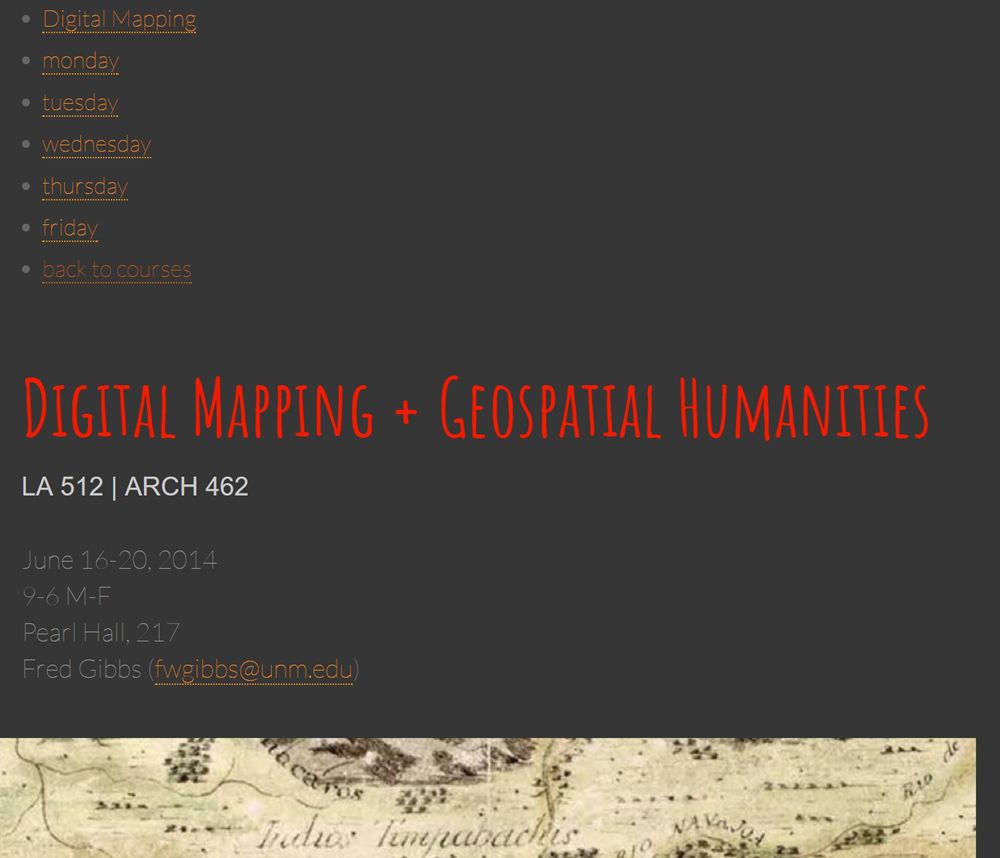
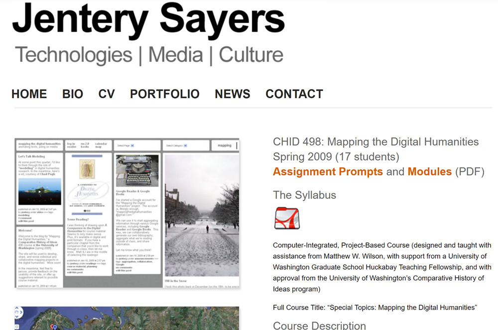
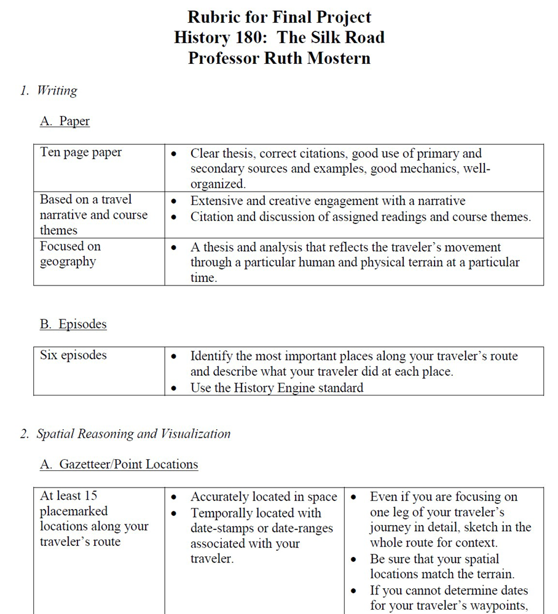
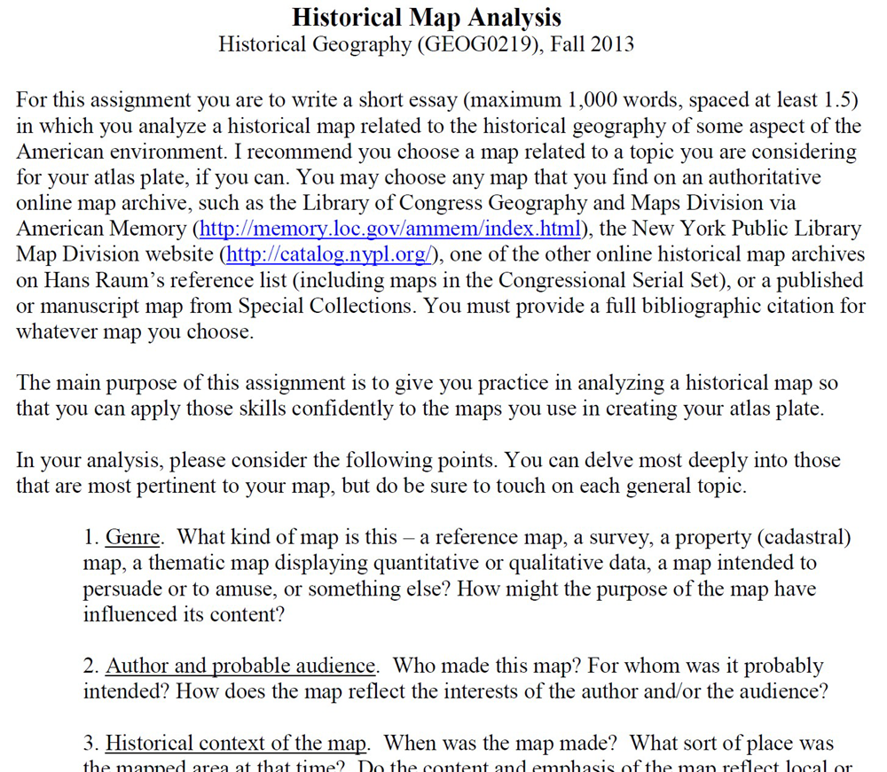
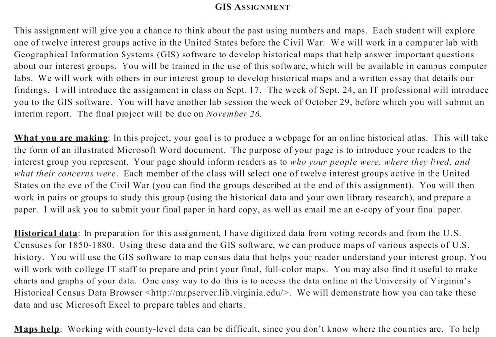
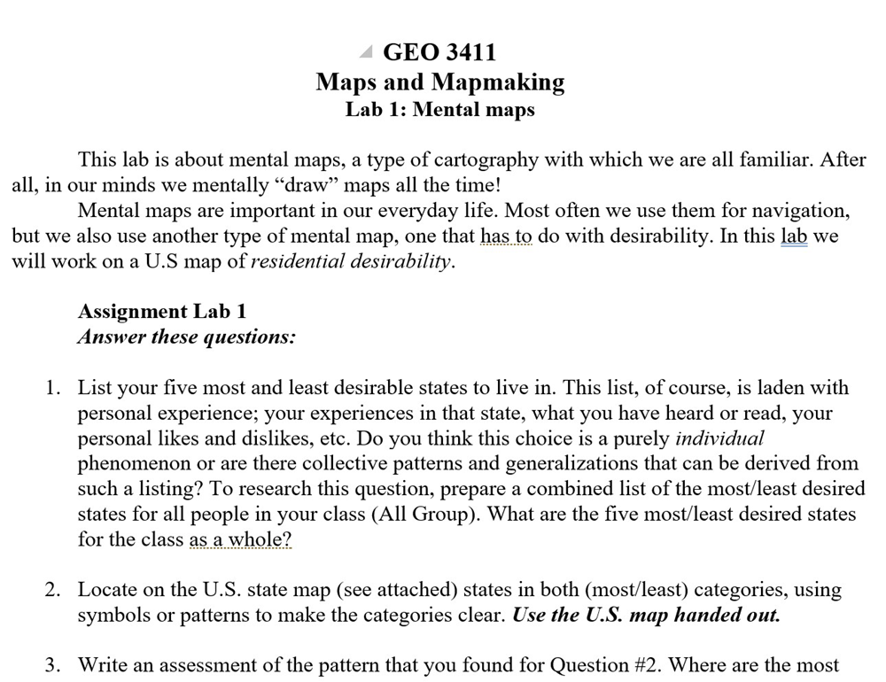
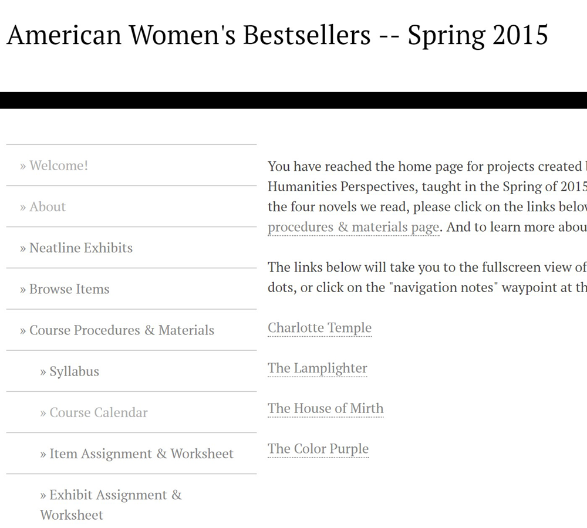
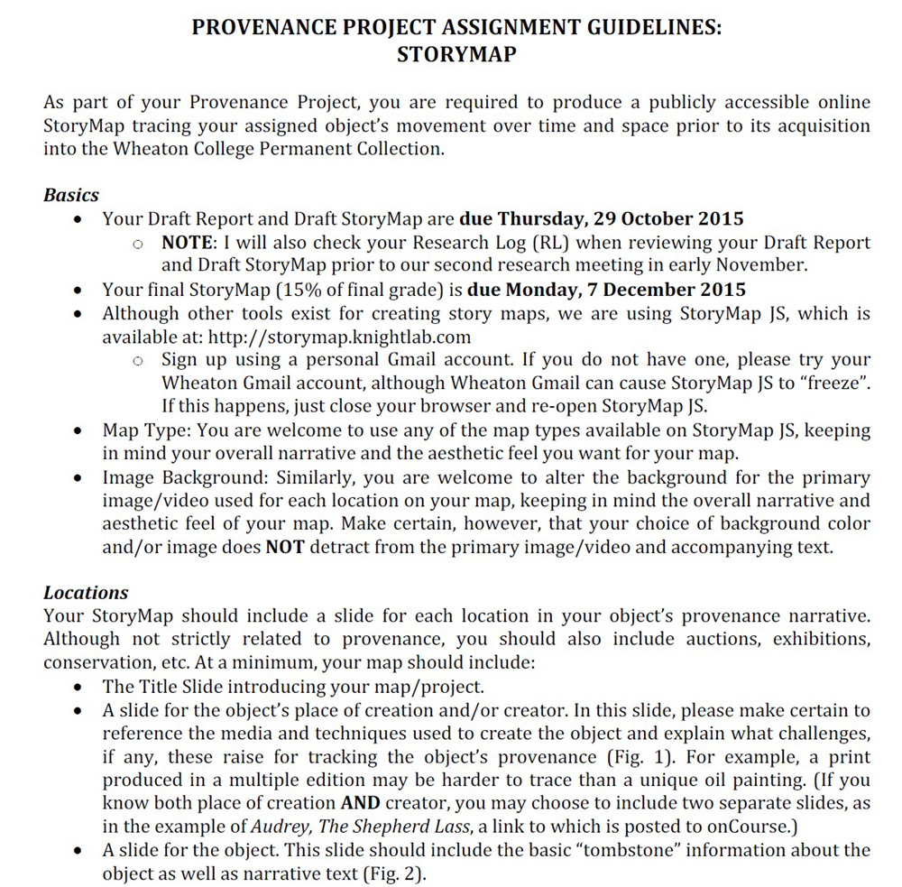
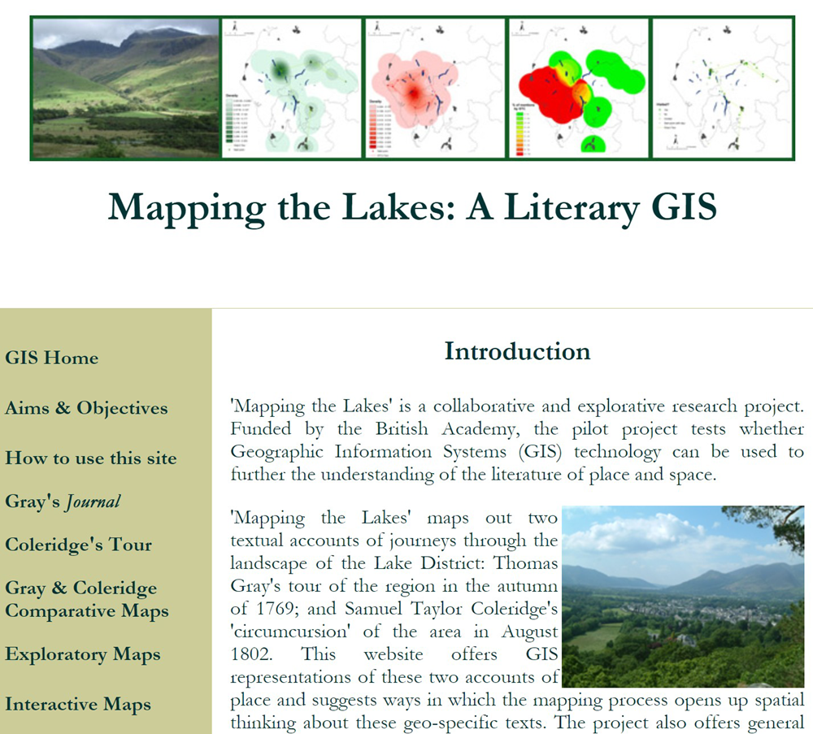
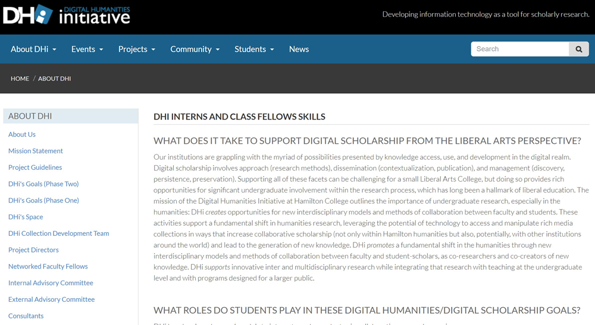

## Update April 1, 2020 - WE'RE LIVE!
*Digital Pedagogy in the Humanities* has emerged on its Modern Language Association platform in a beta form and being corrected live through June 2020. In light of the widespread move to online education at most universities, both the MLA staff and editors Davis, Gold, and Harris agreed that opening up the project in its post-peer review, copyedited state would be beneficial for everyone. Please join us in welcoming this long-standing project in its final platform into the world: [*Digital Pedagogy in the Humanities*(https://digitalpedagogy.hcommons.org/)

***************************

# Mapping 

### Diana S. Sinton
UCGIS and Cornell University

---

##### Publication Status:
* unreviewed draft
* draft version undergoing editorial review
* draft version undergoing peer-to-peer review
* **draft version undergoing MLA copyediting**
* awaiting pre-print copy
* published 

---

### Cross-Reference Keywords: project management, visualization

---   

## CURATORIAL STATEMENT

All at once, a map can be compelling, informative, and revealing. In many forms, maps are found throughout instructional and research contexts. What is less familiar is geographical thinking, and mapping as a process. Students and instructors alike are largely ill-prepared to read and interpret maps with confidence or competence (Lloyd and Bunch 170), especially when one goes beyond a conventional map as a normative, scientific product and considers them as a social construct or proposition. This has implications for mapping as a pedagogical activity, especially in the humanities. Texts can be read deeply, with a critical and inquisitive eye towards ideas behind the words on the paper. Maps also merit consideration beyond the superficial observation of graphic patterns. This applies to maps that depict geographical spaces (the focus of this entry) as well as information that is  [visualized](https://digitalpedagogy.mla.hcommons.org/keywords/visualization/) in abstract, non-geographic space.

Reading and interpreting maps without directed guidance can be challenging for novices. Having instructors prepared to pose thought-provoking questions of the map is one solution. But experiencing discomfort with interpretation could also reflect the map itself. A map may meet its minimum criteria of being able to illustrate what, where, and perhaps when, but it is a leap of explanatory faith to assume that why and how can be intuited by a viewer. Maps that independently tell a powerful story, as a stand-alone narrative, are uncommon. 

Maps that can most readily be generated with a geographic information system (GIS) depict spaces that have a consistent scale throughout, are displayed from an overhead (planar) perspective, and portray information as representations of simple geometric shapes. They are designed for geometrically consistent spaces rather than representing nuanced “senses of place” (Cresswell 8). Digital cartography is limited in its capacity to capture and display factors of cultural geography that we associate with the human experience (Tuan 5), producing instead “positivist representations of space” (Pearce and Louis 107). Having realistic expectations for what a digital map alone can support or provide is worthwhile. 

In spite of real and perceived challenges to achieving their vision, humanities scholars who have ventured into this realm of digital mapping have produced a rich variety of projects. An environmental scan of these shows a largely bimodal distribution: big and complex projects, or small and simple ones, with fairly few in between. Admittedly, this may reflect the fact that many such academic projects exist in a non-public, unpublished state.

Grand combinations of vision, funding, and technical expertise have produced projects in which spatial analysis and customized maps are central. Addressing research questions is the primary motivation behind these efforts, and instructional activities are linked but secondary. Projects at this scope and scale require significant [project management](https://digitalpedagogy.mla.hcommons.org/keywords/project-management/) effort from a team of people with different types of technical expertise, such as web programming in addition to any map-making applications.  Exciting and innovative examples can be found at [Stanford’s Spatial History Project](http://web.stanford.edu/group/spatialhistory/cgi-bin/site/index.php), [Hypercities](http://geohumanities.org/gis), and the [Keck Digital Cultural Mapping Program at UCLA](http://www.keckdcmp.ucla.edu/), the [University of Virginia’s Scholars' Lab](http://scholarslab.org/research/) and the [University of Richmond’s Digital Scholarship Lab](http://dsl.richmond.edu/projects/).  The American Association of Geographers maintains [a list of history projects that have used GIS](http://www.aag.org/cs/projects_and_programs/historical_gis_clearinghouse/hgis_projects_programs), as does the [GeoHumanities organization](http://geohumanities.org/gis).

At the same time, a rise in DIY map-making applications and affiliated tutorials and workshops have made it easier than ever for people everywhere to produce simple maps and publish them online. One very common form is the “map mashup,” the blending of user-contributed content - typically annotated point locations - over a Google Maps background. The [Toronto Poetry Map](http://www.torontopoetry.ca/), [Placing Literature](http://www.placingliterature.com/), or [Digital Harlem's map](http://digitalharlem.org/) are three of thousands of examples. The map becomes an organizational template, as well as an approach for search and discovery within what could otherwise be an uninteresting database of information.  Digital platforms can also rely on existing maps as a background on which to detail events from a work of literature. For example, [Don Quijote’s journeys](http://quijote.bne.es/libro.html) are chronicled over maps to provide an additional entry into the literary text. 

Maps and mapping are both avenues for learning in the humanities. Displaying geographic data via a map is arguably the only approach that supports its full realization (Hallisey 350), and therefore any other visualization approach is inherently limiting. Through mapping, we reconcile that which exists in relative or abstract space, and across multiple scales; this process offers a pedagogical framework to organize characters, events, and relationships. Mapping provides the opportunity to illustrate alternative points of view and evaluate assumptions or long-held-beliefs (Lund and Sinton 4). 

Increase satisfying outcomes and decrease being over- or under-whelmed by having the inquiry drive the data. Experiment with low tech methods (paper and colored pencils) while questions and data models are developed. Be prepared to spend three times as much time as had been allocated, and be creative with learning outcomes and assessments to allow for the mixture of content-knowledge and technical-knowledge acquisition.  

## CURATED ARTIFACTS 

#### Digital Mapping and Geospatial Humanities

* Artifact Type: Syllabus
* Source URL: [http://fredgibbs.net/courses/digital-mapping/](http://fredgibbs.net/courses/digital-mapping/)
* Permissions: Creative Commons License, Attribution 3.0 Unported (CC BY 3.0)
* Creator: Fred Gibbs, History Department, University of New Mexico

This syllabus is for a short-but-intense 5-day course on digital mapping, using open-source tools. This class took place in June 2014, and its audience was a mix of students, faculty, and other scholars. For its 40-45 hours of scheduled time, the ambitious instructor had the participants experiment with multiple methods of digital mapping platforms. He also includes references and content relevant to broader issues of place, representation, and uncertainty, all essential issues of digital mapping endeavors from a humanities’ perspective. The group project to compile historical data layers for Albuquerque, New Mexico, is strategic as class participants will likely be familiar with the venue, and will present the types of issues that historians will likely confront when developing digital mapping projects. This could be a very good model for a short course, recognizing that the instructor must have both confidence and competence with a mix of digital technologies. 

#### Mapping the Digital Humanities

* Artifact Type: Course Description, Syllabus, Assignments, and Modules
* Source URL: [http://www.jenterysayers.com/2009/498/](http://www.jenterysayers.com/2009/498/)  
* Permissions: CC BY-NC-SA 3.0
* Creator: Jentery Sayers, University of Victoria 

This course was the product of a collaboration between two graduate students at the University of Washington, Jentery Sayers (English) and Matt Wilson (Geography), supported to develop the course through a teaching fellowship. As the product of those two instructors, who had the luxury of additional time for development, it stands as an exemplar of an inter-disciplinary, humanities-focused mapping course. The parallelism of having students work on “mapping” a geographical location as well as “mapping” a text is a novel structure that the collaboration affords. The Modules and Prompts have extensive and interesting commentary and suggestions for readings and ideas about mapping topics (cartographic generalization, data structure and organization, critical cartography, etc). It also provides an understanding of “geography” itself, and doesn’t limit the geographical emphasis to only maps as a tool and outcome. 

#### Rubric for Final Project on The Silk Road

* Artifact Type: Evaluation Rubric
* Source URL: [http://crte.ucmerced.edu/teaching_silk_road_history](http://crte.ucmerced.edu/teaching_silk_road_history)
* Permissions: CC-BY-NC
* Copy of Artifact: [Rubric for Silk Road project](files/Mapping-3-Rubric-for-Final-Project-Silk-Road.pdf)
* Creator: Ruth Mostern, UC Merced

Students in this 100-level class recreate the trajectory of an historical route via the Google Earth virtual globe. The choice of the 3-D Earth platform (versus the 2-D Google Maps) provides a sense of topographical relief that would have affected all aspects of travel across that route. Students are expected to go beyond a simple recreation of the geometric “line” of the Silk Road itself by integrating other digital media (images, timelines, text) to annotate their geographical points. Though the rubric does not indicate what would constitute inferior or superior grades, the author has distinguished between the various technical, cartographic, and textual interpretive elements of the final project. 

#### Historical Map Analysis

* Artifact Type: Assignment
* Source URL: N/A
* Permissions: CC-BY-NC
* Copy of Artifact: [Historical Map Analysis](files/Mapping-4-Historical_Map_Analysis.pdf)
* Creator: Anne K. Knowles, University of Maine

This assignment prompts students with a series of questions that guide them through a structured critique of an historical map. The questions cover themes of genre, author and probable audience, historical context of the map, and the map as a source for historical geography. This activity prepares students for a subsequent assignment of researching, designing, and constructing a page for a collaboratively-produced Atlas. The questions are drafted with a historical map in mind, but they could also be modified for application to any map. They structure lines of inquiry about cartography, cartographers, and cartographic products that many students have never systematically thought through before.  

#### GIS Historical Atlas Assignment

* Artifact Type: Assignment and Codebook
* Source URL: N/A
* Permissions: CC-BY-NC
* Copy of Artifact: [Historical Atlas Assignment and Codebook](files/Mapping-5-GIS-Historical-Atlas-Assignment-and-Codebook.pdf)
* Creator: Patrick Rael, History, Bowdoin College

Students delve into historical Census data to produce a small Atlas that addresses questions about race and slavery in mid-19th century America. They produce not only maps, but also tables and charts, consistent with the Census emphasis on quantitative data. Students begin with a question that they wish to answer, comparing variables across different geographies, across time, or explore possible correlations. This models a good practice for Census data: to have a specific question that data will help address. Otherwise, Census data can readily become overwhelming in its specificity and abundance. The GIS “Code Book” facilitates the use of the “real” data, which is necessarily obtuse and confusing in its authenticity. Rael choose to do extensive out-of-class work to prepare supporting instructional materials so that students focus on the analysis while minimizing time spent grappling with data. This assignment could be adapted for Census data from any time period. 

####  Mental Maps Assignment

* Artifact Type: Lab Assignment
* Source URL: N/A
* Permissions: CC-BY-NC
* Copy of Artifact: [Mental Map Assignment](files/Mapping-6-Mental-Map-Assignment.pdf)
* Creator: Alberto Giordano, Texas State University

Most people are familiar with maps that depict phenomena that exist in our visual and physical world: roads, buildings, mountains, rivers. To be useful in a range of humanistic subjects, maps – as visual and graphic representations – must also accommodate subjects that are more challenging to represent, such as attitudes and beliefs. This introductory assignment for a class in map-making asks students to clarify and articulate their notions of residential desirability, and then design icons or symbols to be placed on the map that would represent those feelings. Using mapping as a means of non-text-based communication, students must think through how graphic representations evoke sentiments as well as be sensitive to effective visual communication for a range of audiences. Novices to mapping may find digital tools limiting with regards to creative expression.    

#### American Women's Bestsellers

* Artifact Type: Assignments
* Source URL:  [http://202s15.cesaunders.net/](http://202s15.cesaunders.net/) 
* Permissions: Creative Commons Attribution-NonCommercial-ShareAlike 3.0 Unported License. Copyright for student and instructor work remains with the individual author(s)
* Copy of Artifact: N/A
* Creator: Catherine Saunders, George Mason University

Students created a series of map-mashups, using the increasingly popular Neatline product, to provide point locations with annotated information for four novels they read. In the [Exhibit Assignment](http://202s15.cesaunders.net/exhwksht), the workshop systematically guides students on how to weigh the options for deciding point placement on the map. The [Final Exam writing assignment](http://202s15.cesaunders.net/exam) considers geographical perspectives, and the first prompt draws from different map scales and extents of the maps created. The creator has not chosen to place (i.e., georeference) an era-specific historical map over the built-in, default maps. So, when the map viewer is asked to consider Mr. Phillip’s circa 1850 experience in Rio de Janeiro (from Cummins’ The Lamplighter), in its “terrible state … of chaos and death,” the viewer instead only sees the standard Open Street map, circa 2015, background map of Rio. This is a standard conundrum with map-mashups, unfortunately, and cannot be mitigated without some effort.

#### Provenance Project for Museum Studies

* Artifact Type: Assignment
* Source URL: N/A
* Permissions: CC-BY-NC
* Copy of Artifact:  [Provenance Project](files/Mapping-8-Provenance-Project-Museum-Studies.pdf)
* Creator: Leah Niederstadt, Department of Art History, Wheaton College, Massachusetts

In her Introduction to Museum Studies course, Leah Niederstadt has students conduct research on the provenance of items held in the Wheaton College Permanent Collection. The assignment involves students compiling detailed research on the objects themselves and on their previous owners, before they each create a “StoryMap” that chronicles the “provenance narrative” for their assigned object. For the Fall 2015 iteration of the course, students used [StoryMap JS](https://storymap.knightlab.com/) for their projects. The application is simple enough that a minimum of student training was necessary. Earlier iterations of the assignment in this course and in a First-Year Seminar used Google Earth or Omeka, but StoryMap JS was a more desirable option for its functionality and design options.

#### Mapping the Lakes: A Literary GIS

* Artifact Type: Project website 
* Source URL: [http://www.lancaster.ac.uk/mappingthelakes/](http://www.lancaster.ac.uk/mappingthelakes/)
* Permissions:   "Copyright © 2006-2016 Lancaster University"
* Copy of Artifact: N/A 
* Creators: David Cooper and Ian Gregory, Lancaster University 

This project models what a student would be able to achieve when they are able to use GIS software at a more advanced level to address a disciplinary question. It exemplifies the “middle ground” between a grand, large scale research activity and a simple map mashup. It poses a question that is of interest to literary scholars (How does the corpus of these two scholars differ, though they are often regarded as dealing with similar places?) and then suggests an answer to that question that was derived via spatial analysis. The authors recognized that they could maintain aims and objectives that were concurrently “writer-specific, geo-specific, and theoretical,” and explain their process and arguments with both mapped images and text.

#### DHi Interns & CLASS Fellows Skills

* Artifact Type: Website containing Learning Objectives, Teaching Guidelines, Student Work 
* Source URL: [http://www.dhinitiative.org/about/interns-class-skills](http://www.dhinitiative.org/about/interns-class-skills)
* Permissions: CC-BY-NC
* Copy of Artifact: N/A
* Creators: Angel Nieves and Janet Simons, Co-Directors, DHi Initiative, Hamilton College

This useful information provides descriptive and explicit details about models to integrate undergraduates in collaborative teaching and research experiences, including technical skill sets that undergraduate students may encounter while doing work with DH projects. Examples and elements of mapping, GIS, 3D modeling, and spatial visualization are included in each of the categories. These types of activities and skills listed could be modeled by faculty for a single classroom-activity, assigned to students within a class context, or become the basis for a “DH research methods” with a focus on mapping. For example, maps are one student-produced outcome of the [Sacred Centers in India](http://sci.dhinitiative.org/pedagogy) project. 

## RELATED MATERIALS

Bodenhamer, David J., et al. *The spatial humanities: GIS and the future of humanities scholarship.* Bloomington, Indiana University Press, 2010. 

Drucker, Johanna. “GIS Analysis and Critical Issues.” *Introduction to Digital Humanities*, UCLA Center for Digital Humanities, dh101.humanities.ucla.edu/?page_id=66. Accessed 13 Sept. 2017. 

Guldi, Jo. “Spatial Humanities.” *What is the Spatial Turn? Spatial Humanities,* Scholars' Lab, spatial.scholarslab.org/spatial-turn/. Accessed 13 Sept. 2017.

Jessop, Martin. “The Inhibition of Geographical Information in Digital Humanities Scholarship.” *Literary and Linguistic Computing,* vol. 23, no. 1, 2007, pp. 39–50., doi:10.1093/llc/fqm041. 

Knowles, Anne Kelly. “A Case for Teaching Geographic Visualization without GIS.” *Cartographic Perspectives,* no. 36, Jan. 2000, pp. 23–37., doi:10.14714/cp36.823.

## WORKS CITED

Bodenhamer, David J., et al. *The spatial humanities: GIS and the future of humanities scholarship.* Bloomington, Indiana University Press, 2010. 

Cresswell, Tim. *Place: a short introduction.* Malden, Mass, Blackwell Publishing, 2013.

Digital Scholarship Lab. University of Richmond, dsl.richmond.edu/projects. Accessed 25 September 2017. 

Drucker, Johanna. “GIS Analysis and Critical Issues.” *Introduction to Digital Humanities,* UCLA Center for Digital Humanities, dh101.humanities.ucla.edu/?page_id=66. Accessed 13 Sept. 2017. 

*GeoHumanities.* Alliance of Digital Humanities Organizations, geohumanities.org/gis. Accessed 25 September 2017.
 
Gibbs, Fred. “Digital Mapping Geospatial Humanities.” *Digital Mapping,* fredgibbs.net/courses/digital-mapping/. Accessed 13 Sept. 2017.

Guldi, Jo. “Spatial Humanities.” *What is the Spatial Turn? • Spatial Humanities,* Scholars' Lab, spatial.scholarslab.org/spatial-turn/. Accessed 13 Sept. 2017

Hallisey, Elaine J. “Cartographic Visualization: An Assessment and Epistemological Review*.” *The Professional Geographer,* vol. 57, no. 3, 2005, pp. 350–364., doi:10.1111/j.0033-0124.2005.00483.x. 

*Historical GIS Clearinghouse and Forum.* American Association of Geographers, www.aag.org/cs/projects_and_programs/historical_gis_clearinghouse/hgis_projects_programs. Accessed 25 September 2017.
 
Jessop, Martin. “The Inhibition of Geographical Information in Digital Humanities Scholarship.” *Literary and Linguistic Computing,* vol. 23, no. 1, 2007, pp. 39–50., doi:10.1093/llc/fqm041.

Knowles, Anne Kelly. “A Case for Teaching Geographic Visualization without GIS.” *Cartographic Perspectives,* no. 36, Jan. 2000, pp. 23–37., doi:10.14714/cp36.823. 

Lloyd, Robert Earl, and Rick L. Bunch. “Learning Geographic Information from a Map and Text: Learning Environment and Individual Differences.” *Cartographica: The International Journal for Geographic Information and Geovisualization,* vol. 45, no. 3, 2010, pp. 169–184., doi:10.3138/carto.45.3.169.

Lund, Jennifer J., and Diana S. Sinton. “Critical and creative visual thinking.” *Understanding Place: GIS and Mapping across the Curriculum,* Esri Press, Redlands, CA, 2007, pp. 1–17.

*Mapa de aventuras de don Quijote (Map of the Adventures of Don Quijote).* Biblioteca Nacional de España (National Library of Spain), quijote.bne.es/libro.html. Accessed 25 September 2017. 

Pearce, Margaret, and Renee Louis. “Mapping Indigenous Depth of Place.” *American Indian Culture and Research Journal,* vol. 32, no. 3, 2008, pp. 107–126., doi:10.17953/aicr.32.3.n7g22w816486567j.

*PlacingLiterature.* www.placingliterature.com. Accessed 25 September 2017. 

Presner, Todd, David Shepard, and Yoh Kawano. *HyperCities.* www.hypercities.com/. Accessed 25 September 2017.

*Scholars’ Lab.* University of Virginia, scholarslab.org. Accessed 25 September 2017.

*Spatial History Project.* Stanford University, web.stanford.edu/group/spatialhistory/cgi-bin/site/index.php. Accessed 25 September 2017.
 
*Toronto Poetry Map.* Toronto Public Library, torontopoetry.ca. Accessed 25 September 2017. 

White, Shane, Stephen Garton, Graham White, and Stephen Robertson. *Digital Harlem.* digitalharlem.org. Accessed 25 September 2017. 

Williams, Andrew Bardin and Kathleen Colin Williams. *PlacingLiterature.* www.placingliterature.com. Accessed 25 September 2017. 

