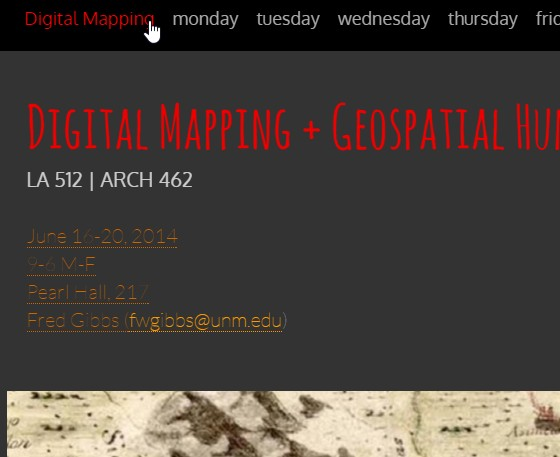
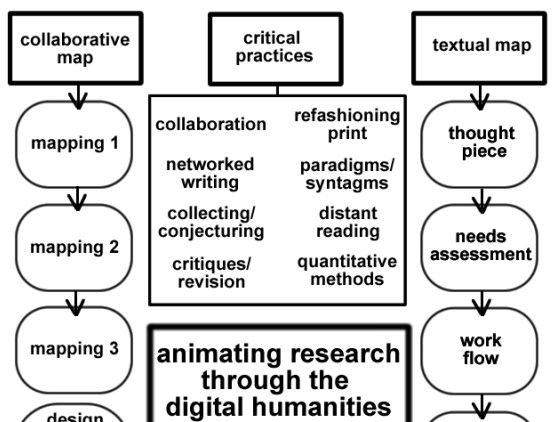
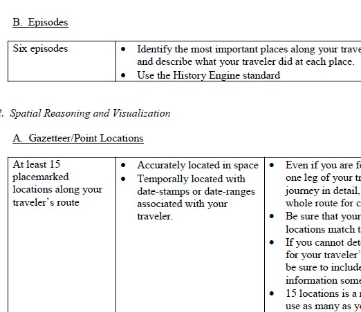
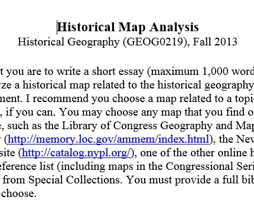
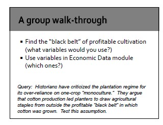
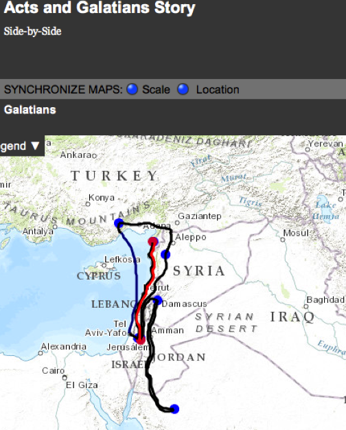
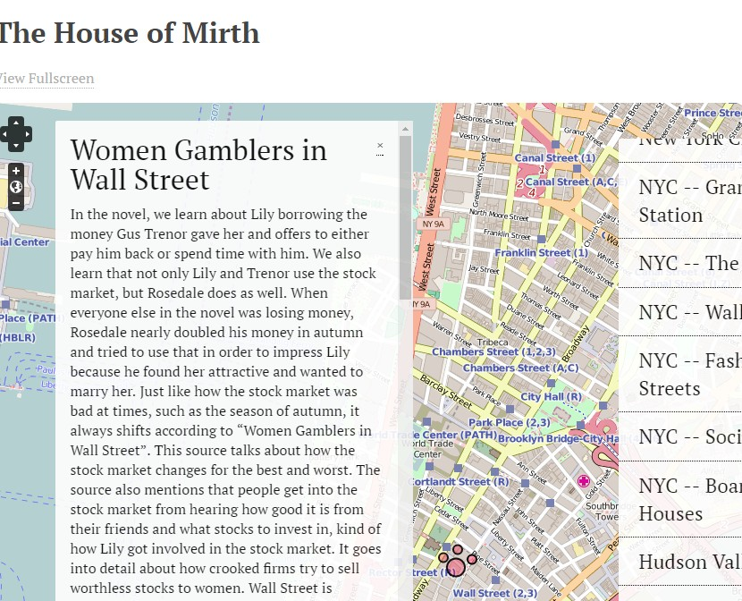
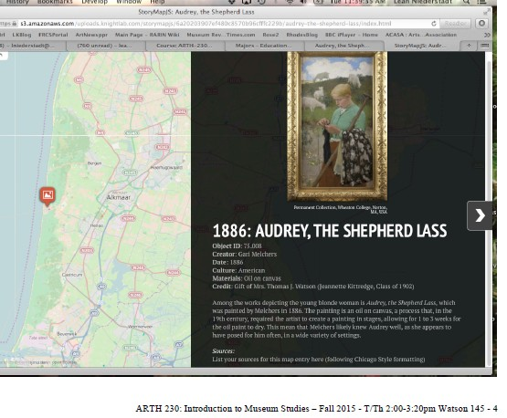
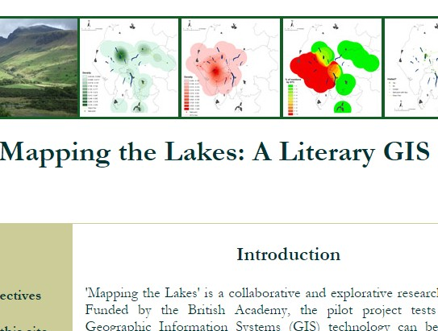
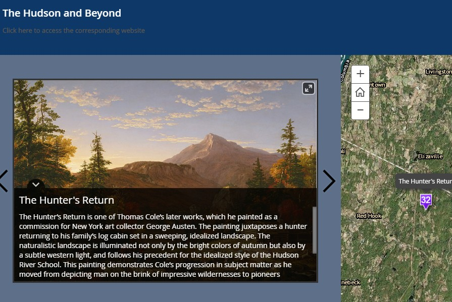

# MAPPING (Draft) 

### Diana S. Sinton
UCGIS and Cornell University

---

##### Publication Status:
* unreviewed draft
* **draft version undergoing editorial review**
* draft version undergoing peer-to-peer review
* published 

--- 

## CURATORIAL STATEMENT

All at once, a map can be compelling, informative, and revealing, and usually non-threatening, save for those who experience anxiety when forced to navigate with one. Thus it is no surprise that maps in many forms may be found within instructional and research academic contexts, and a map is a familiar item within humanities disciplines. Maps have played an understated but central and contentious role in the real-time activities of explorations, conquests, and migrations, and thus are equally helpful in studying these events later.  

What is less familiar is geographical thinking as a whole, as well as mapping as a process. The absence of geography as a subject within formal school settings has contributed to a general lack of geographical thinking in the United States. Students and instructors alike are largely ill-prepared to read and interpret maps with confidence or competence (Lloyd and Bunch 2010), especially when one goes beyond a conventional map as normative, scientific product and considers them as a social construct or proposition (Kitchin, Perkins and Dodge 20XX). Hence in the humanities in particular, this has implications for mapping as a pedagogical activity. An instructor models for students how to read a text deeply, with a critical and inquisitive eye towards ideas behind the words on the paper. Likewise, in many cases a map requires and merits consideration beyond the superficial observation of graphic patterns, yet there is uncertainty in this practice. 

From a teaching and learning perspective, assuming that the viewer will be able to read and interpret the map without directed guidance can be problematic. Having instructors prepared to pose thought-provoking questions of the map is one solution. But experiencing discomfort or dis-ease with the act of interpretation could also reflect the map itself, that a particular arrangement of information has had unreasonable expectations imbued within. A map may meet its minimum criteria of being able to illustrate what, where, and perhaps when, but it is a leap of explanatory faith to assume that why and how can be intuited automatically by a viewer. Maps that independently tell a powerful story all on their own, as a stand-alone narrative, are the exception rather than the rule. 

The type of maps that can most readily be generated with software such as a geographic information system (GIS) depict spaces that have a consistent scale throughout, are displayed from an overhead (planar) perspective, and portray information as representations of simple geometric shapes. They are designed for geometrically consistent spaces rather than representing nuanced “senses of place” (Cresswell 2004). Digital cartography is limited in its capacity to capture and display factors of cultural geography that we associate with the human experience (Tuan), producing instead “positivist representations of space” (Pearce and Louis 2008). So having realistic expectations for what a digital map alone can support or provide is worthwhile. 

In spite of real and perceived challenges to achieving their vision, humanities scholars who have ventured into this realm of digital mapping have produced a rich variety of projects. An environmental scan of these shows a largely bimodal distribution: big and complex projects, or small and simple ones, with fairly few in between. Admittedly, this may reflect the fact that many such academic projects exist in a non-public, unpublished state.

On the grand side, over the last decade a combination of vision, funding, and technical expertise have produced noteworthy and admirable projects in which spatial analysis and customized maps are central. Students may have been involved in the development activities, but addressing research questions was the primary motivation behind these efforts. Projects at this scope and scale require significant effort from a team of people with different types of technical expertise, as the mapping itself will involve just as much, if not more web programming as traditional map-making applications. Exciting and innovative examples can be found at [Stanford’s Spatial History Project](http://web.stanford.edu/group/spatialhistory/cgi-bin/site/index.php), the [Keck Digital Cultural Mapping Program at UCLA](http://www.keckdcmp.ucla.edu/), and the [University of Virginia’s Scholars' Lab](http://scholarslab.org/research/). The American Association of Geographers maintains [a list of history projects that have used GIS](http://www.aag.org/cs/projects_and_programs/historical_gis_clearinghouse/hgis_projects_programs), Clearinghouse, as does the [GeoHumanities organization](http://geohumanities.org/gis).

At the same time, a rise in DIY map-making applications and affiliated tutorials and workshops have made it easier than ever for people everywhere to produce simple maps and publish them online. One very common form is the “map mashup,” the blending of user-contributed content - typically annotated point locations - over a Google Maps background. The [Toronto Poetry Map](http://www.torontopoetry.ca/), [Placing Literature](http://www.placingliterature.com/), or [Digital Harlem's map](http://digitalharlem.org/) are three of thousands of examples. The map becomes an organizational template, as well as an approach for search and discovery within what could otherwise be an uninteresting database of information. 

Whether the project falls on the grand or simple end of the spectrum, maps and mapping are both avenues for learning in the humanities. Displaying geographic data via a map is arguably the only approach that supports its full realization (Hallisey 2005), and therefore any other visualization approach is inherently limiting. Through mapping, we must reconcile that which exists in relative or abstract space, and across multiple scales; this process offers a pedagogical framework to organize characters, events, and relationships. Mapping provides the opportunity to illustrate alternative points of view and evaluate assumptions or long-held-beliefs (Lund and Sinton 2007). 

To increase the chances of satisfying outcomes and decrease the chances of frustration and being over- or under-whelmed, have the inquiry drive the data, and not the other way around. Experiment with low tech methods (paper and colored pencils) while the questions and data models are being developed. Be prepared to spend three times as much time as you had allocated, and be creative with learning outcomes and assessments to allow for exploring and accommodating the mixture of content-knowledge and technical-knowledge acquisition.  

The artifacts chosen here reflect materials and resources from individuals and groups who have put thoughtful ideas into having maps, and the acts of mapping, be a meaningful pedagogical tool and practice within their classroom. Examples built with open source and proprietary software are both included, though sometimes it may just be a digital copy of a single map, produced itself by traditional analog methods, that is the focus of an artifact. The intent was to suggest a range of types of pedagogical contexts and support that can make map usage and production a more meaningful educational experience. 

## CURATED ARTIFACTS 

### Digital Mapping and Geospatial Humanities

* Source: http://fredgibbs.net/courses/digital-mapping/
* Copy of Artifact: forthcoming
* Creator: Fred Gibbs, History Department, University of New Mexico

This syllabus is for a short-but-intense 5-day course on digital mapping, using open-source tools and aimed at a humanities’ audience. This class took place in June 2014, thus its audience was likely a mix of students, faculty, and other scholars eager for an opportunity for professional development in this area. For its 40-45 hours of scheduled time, the instructor (Fred Gibbs) is ambitious enough to have the students experiment with multiple methods of digital mapping platforms but also includes references and content relevant to broader issues of place, representation, and uncertainty, all essential issues of digital mapping endeavors from a humanities’ perspective. The group project of working on a series of historical data layers for Albuquerque, New Mexico, is a wise choice as it is a venue the class participants likely have in common and will present clear exemplars of the types of issues that historians will likely confront when developing digital mapping projects. This could be a very good model for a short course, recognizing that the instructor must have both confidence and competence with a mix of digital technologies. 

### Mapping the Digital Humanities

* Source: http://www.jenterysayers.com/2009/498/  
* Copy of Artifact: forthcoming
* Creator: Jentery Sayers, University of Victoria 

This course was the product of a collaboration between two graduate students at the University of Washington, Jentery Sayers (English) and Matt Wilson (Geography), supported to develop the course through a teaching fellowship. As the product of those two instructors, who had the luxury of additional time for development, it stands as an exemplar of an inter-disciplinary, humanities-focused mapping course. The parallelism of having students work on “mapping” a geographical location as well as “mapping” a text is a novel structure that the collaboration affords. The Modules and Prompts have extensive and interesting commentary and suggestions for readings and ideas about mapping topics (cartographic generalization, data structure and organization, critical cartography, etc). It also provides an understanding of “geography” itself, and doesn’t limit the geographical emphasis to only maps as a tool and outcome. 

### The Silk Road

* Copy of Artifact: forthcoming
* Creator: Ruth Mostern, UC Merced

Students in this 100-level class recreate the trajectory of an historical route via the Google Earth virtual globe. The choice of the 3-D Earth platform (versus the 2-D Google Maps) provides a sense of topographical relief that would have affected all aspects of travel across that route. Students are expected to go beyond a simple recreation of the geometric “line” of the Silk Road itself by integrating other digital media (images, timelines, text) to annotate their geographical points. Though the rubric does not indicate what would constitute inferior or superior grades, the author has distinguished between the various technical, cartographic, and textual interpretive elements of the final project. 

### Historical Map Analysis

* Copy of Artifact: forthcoming
* Creator: Anne K. Knowles, University of Maine

This assignment prompts students with a series of questions that guide them through a structured critique of an historical map. The questions cover themes of genre, author and probable audience, historical context of the map, and the map as a source for historical geography. This activity prepares students for a subsequent assignment of researching, designing, and constructing a page for a collaboratively-produced Atlas. The questions are drafted with a historical map in mind, but they can could also be modified for application to any map. They structure lines of inquiry about cartography, cartographers, and cartographic products that many students have never systematically thought through before.  

### Historical Atlas Assignment

* Copy of Artifact: forthcoming 
* Creator: Patrick Rael, History, Bowdoin College

Rael has students delve into historical Census data to each produce a small Atlas that addresses questions about race and slavery in mid-19th century America. They need to produce not only maps, but also tables and charts, consistent with the Census emphasis on quantitative data. Students are prompted to begin with a question that they wish to answer, comparing variables across different geographies, across time, or for exploring possible correlations. This models a good practice for dealing with Census data: to have a specific question that data will help address. Otherwise, Census data can readily become overwhelming in its specificity and abundance. The GIS “Code Book” facilitates the use of the “real” data, which is necessarily obtuse and confusing in its authenticity. Rael choose to do extensive out-of-class work to prepare supporting instructional materials so that the students focus on the questions and analysis while minimizing time spent grappling with data. Though this assignment is focused on historical work, it could be adapted for Census data from any time period. 

###  Comparison of Paul’s Travels in Acts and Galatians

* Copy of Artifact: forthcoming 
* Creator: Lillian Larsen, University of Redlands

A professor of Early Christianity, Lillian Larsen long ago discovered the utility of mapping as an accessible entry way for her students to appreciate the distinctive versions of Biblical stories. One of her iconic experiences has been to have students sketch the journeys of Paul, as told in different Biblical books, to compare contrasting narratives. Over time, she and her students have experimented with hand-drawing on analog and digital maps to explore specific routes and journeys. This act of primary data creation requires her students to do close reading of the texts and question the distances and patterns chronicled in the ancient texts. She and one of her former students have also documented their processes in a recent article (Larsen and Benzek 2014). 

### American Women's Bestsellers: Digital Humanities Perspectives

* Source: http://202s15.cesaunders.net/ 
* Copy of Artifact: forthcoming 
* Creator: Catherine Saunders, George Mason University

Students in this course created a series of map-mashups, using the increasingly popular Neatline product, that provide point locations with annotated information for four novels they read. In the Exhibit Assignment, the workshop systematically guides students on how to weigh the options for deciding point placement on the map. The Final Exam writing assignment takes geographical perspectives into consideration, and the first prompt draws from different map scales and extents of the maps created. Unlike some other map-mashups that detail the content and context of an historical book, the creator has chosen not to place (i.e., georeference) an era-specific historical map over the built-in, default maps that one sees as the modern basemap. Thus, in the interface when the user is prompted to consider Mr. Phillip’s circa 1850 experience in Rio de Janeiro (from Cummins’ The Lamplighter, one of the books that the course covers), in its “terrible state . . . of chaos and death,” the viewer instead  sees only the contemporary Open Street map (circa 2015) background map of Rio. This is a standard conundrum with making map-mashups, unfortunately, and can be mitigated but not without some effort.

### Provenance Project, ARTH 230: Introduction to Museum Studies

* Copy of Artifact: forthcoming 
* Creator: Leah Niederstadt, Department of Art History, Wheaton College, Massachusetts

In her "Introduction to Museum Studies" class, Leah Niederstadt has students conduct research on the provenance of items that are part of the permanent collection of Wheaton College’s art museum. The assignment involves students compiling detailed citation information for the art pieces themselves, and then they create a “StoryMap” that chronicles the “provenance narrative” for the pieces. For the Fall 2015 iteration of the class, students used StoryMap JS for their projects. The application is simple enough that a minimum of student training was necessary. An earlier instance of this course taught as a First Year Seminar, Google Earth was used, but StoryMaps was a more desirable option for its functionality and design options.

### Mapping the Lakes: A Literary GIS

* Source: http://www.lancaster.ac.uk/mappingthelakes/ 
* Copy of Artifact: forthcoming 
* Creators: David Cooper and Ian Gregory, Lancaster University 

This project is the example of the “middle ground” between a grand, large scale research activity and a simple map mashup. It is noteworthy for posing a question that is of interest to literary scholars (How does the corpus of these two scholars differ, though they are often regarded as dealing with similar places?) and then suggesting an answer to that question that was actually derived via spatial analysis. The authors recognized that they could maintain aims and objectives that were concurrently “writer-specific, geo-specific, and theoretical,” and explain their process and arguments with both mapped images and text. This project models what a student would be able to achieve if they were able to use GIS software at a more advanced level, and they had a disciplinary question that they were able to envision a way to “measure,” or be innovative in how to imagine what a quantifiable proxy could be for their study. The structure of the project lends itself to a classroom experience. 

### DHi Interns & CLASS Fellows Skills

* Source: http://www.dhinitiative.org/about/interns-class-skills
* Copy of Artifact: Forthcoming 
* Creators: Angel Nieves and Janet Simons, Hamilton College

This useful information provides descriptive and explicit details about a technical skill set, placed within its relevant humanities contexts, that undergraduate students may encounter while doing work with DH projects. Though the list is not specific only for mapping & GIS related activities, examples and elements of mapping, GIS, 3D modeling, and spatial visualization are included in almost of the categories. Several examples of student mapping work are referenced here, such as Following the River. The types of activities and skills listed would also be the same ones that a faculty could model for a single classroom-activity. Or, they could become the basis for a “DH research methods” with a focus on mapping placed within a richer DH context.   

## RELATED MATERIALS

Bodenhamer, David J., John Corrigan, and Trevor M. Harris, eds. *The Spatial Humanities*. Bloomington: Indiana University Press, 2010. 

Drucker, Johanna. "GIS Analysis and Critical Issues." http://dh101.humanities.ucla.edu/?page_id=66

Guldi, Jo. "What is the Spatial Turn?" http://spatial.scholarslab.org/spatial-turn/ 

Jessop, Martyn. "The Inhibition of Geographical Information in Digital Humanities Scholarship." *Literary and Linguistic Computing*. 23.1 (2008): 39-50. Print. 

Knowles, Anne K. "A Case for Teaching Geographic Visualization without GIS." *Cartographic Perspectives*. 36 (2000): 24-37. Print. 

## WORKS CITED

Bodenhamer, David J., John Corrigan, and Trevor M. Harris, eds. *The Spatial Humanities*. Bloomington: Indiana University Press, 2010. 

Cooper, David, Ian Gregory, Sally Bushell, and Zoe Bolton. Mapping the Lakes: a Literary GIS. Project website http://www.lancaster.ac.uk/mappingthelakes/index.htm. Web. 

Cresswell, Tim. *Place: A Short Introduction*. 2nd Edition. Chichester, Sussex: Wiley Blackwell, 2015. Print. 

Drucker, Johanna. “GIS Analysis and Critical Issues.” http://dh101.humanities.ucla.edu/?page_id=66

Gibbs, Fred. Digital Mapping and Geospatial Humanities. http://fredgibbs.net/courses/digital-mapping/ Web. 

Guldi, Jo. “What is the Spatial Turn?” http://spatial.scholarslab.org/spatial-turn/ 

Hallisey, Elaine. “Cartographic Visualization: an Assessment and Epistemological Review.” *The Professional Geographer* 57(2005): 350-364. Print.

Jessop, Martin. “The Inhibition of Geographical Information in Digital Humanities Scholarship.” Literary and Linguistic Computing. 23.1 (2008): 39-50. Print. 

Kitchen, Rob, Chris Perkins, and Martin Dodge. Thinking about maps. 1-22.

Knowles, Anne K. “A Case for Teaching Geographic Visualization without GIS.” *Cartographic Perspectives*. 36 (2000): 24-37. Print. 

Knowles, Anne K. Historical Map Analysis. Copy of class assignment from Historical Geography (Geog 219), Middlebury College, Middlebury, Vermont. Taught in Fall 2013. 

Lillian Larsen, and Stephen Benzek. “Min(d)ing the Gaps: Exploring Ancient Landscapes Through the Lens of GIS”. *Transformations: The Journal of Inclusive Scholarship and Pedagogy* 25.1 (2014): 45–58. Web.

Lloyd, Robert Earl and Rick L. Bunch. “Learning Geographic Information from a Map and Text: Learning Environment and Individual Differences.” *Cartographica* 45(2010): 169-184.

Lund, Jennifer J. and Diana S. Sinton. “Critical and creative visual thinking." *Understanding Place: GIS and Mapping across the Curriculum*. Pages 1-17. Sinton and Lund, eds. Esri Press, 2007. 

Mostern, Ruth. The Silk Road. Syllabus and evaluation rubric for final assignment. For History 108 class at University of California, Merced.

Niederstadt, Leah. Provenance Project Assignment Guidelines for use of StoryMap, for Introduction to Museum Studies (ARTH 230), Wheaton College, Norton, Massachusetts. Taught Fall 2015.

Nieves, Angel, Janet Simons, Gregory Lord, Peter McDonald, Lisa McFall, and Steve Young. Digital Humanities Initiative (DHi) at Hamilton College. DHi Interns and Class Fellows Skills. http://www.dhinitiative.org/about/interns-class-skills. Web. 

Pearce, Margaret Wickens and Renee Pualani Louis. “Mapping Indigenous Depth of Place.” *American Indian Culture and Research Journal*. 32:3 (2008). 107-126.

Rael, Patrick. Historical Atlas Assignment and GIS Codebook. For History 139 class at Bowdoin College, New Brunswick, Maine. 

Sayers, Jentery. Mapping the Digital Humanities. http://www.jenterysayers.com/2009/498/. Web. 

Saunders, Catherine. American Women’s Bestsellers: Digital Humanities Perspectives. Course website. http://202s15.cesaunders.net/welcome. Web. 
