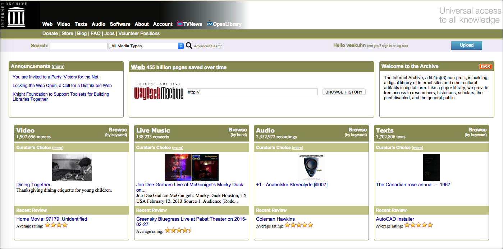
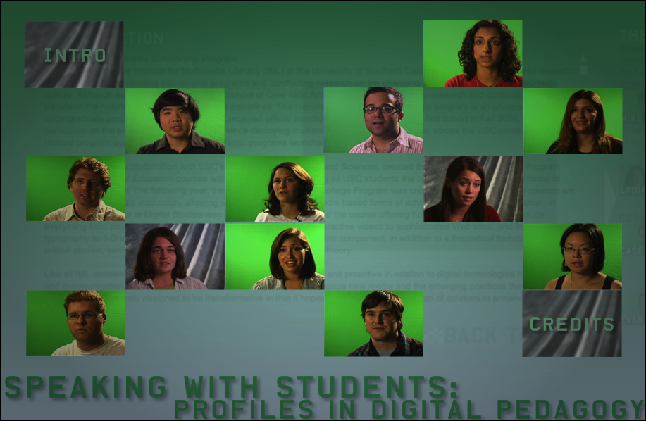
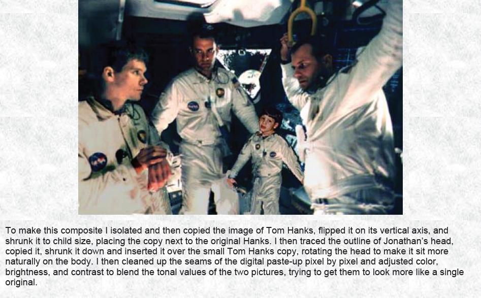
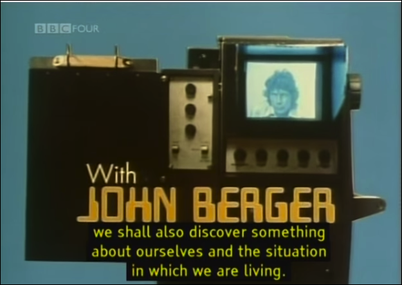
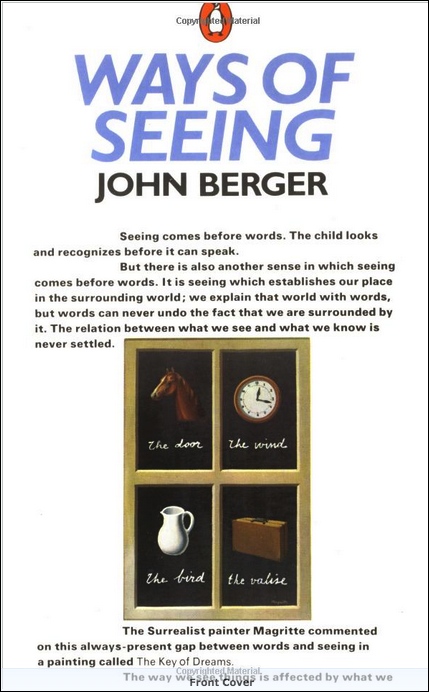
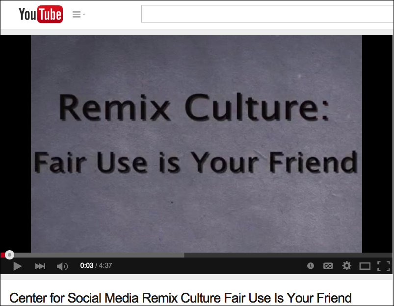
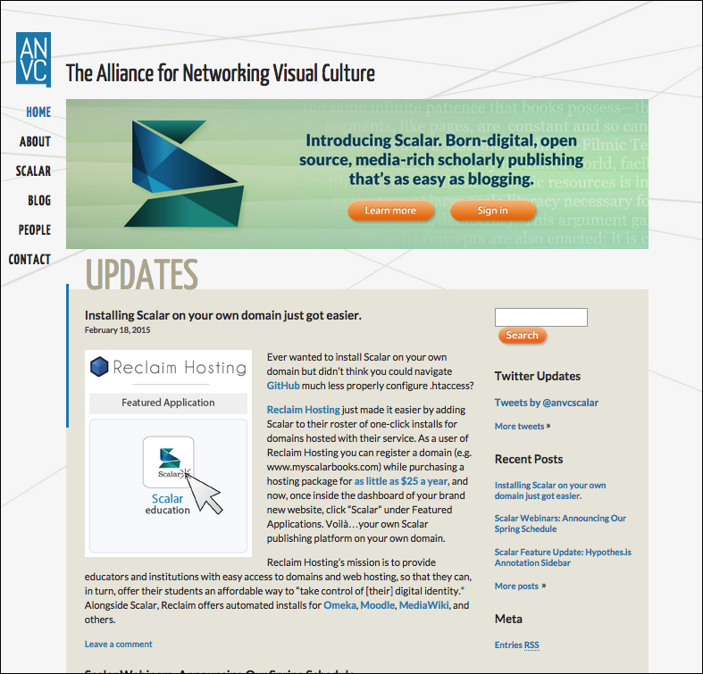
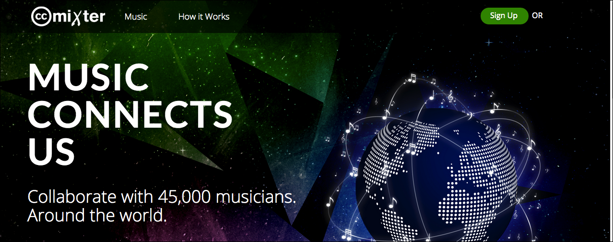
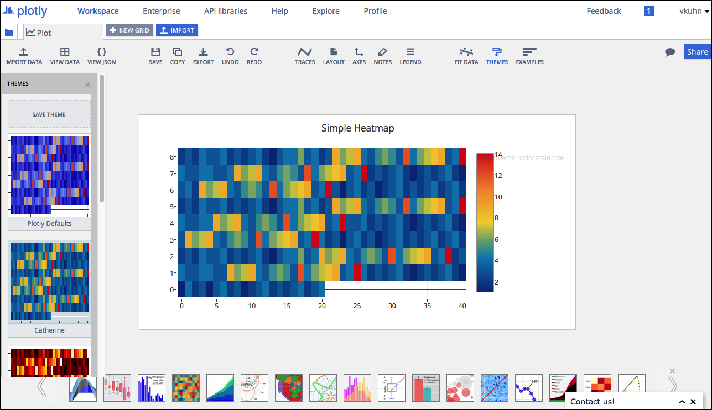

--- 
title: Digital Pedagogy in the Humanities
subtitle: Concepts, Models, and Experiments 
chapter: Multimodal
URL: keywords/multimodal.md
author: 
- family: Kuhn
  given: Virginia
editor: 
- family: Davis
  given: Rebecca Frost
publisher: Modern Language Association
type: book
---

# MULITIMODAL (Draft)

### [Virginia Kuhn] (http://virginiakuhn.net)
University of Southern California, School of Cinematic Arts, Division of Media Arts + Practice | [virginiakuhn.net](http://virginiakuhn.net) 

##### Publication Status:
* unreviewed draft
* **draft version undergoing editorial review**
* draft version undergoing peer-to-peer review
* published 

---

REBECCA: Editorial comments by Rebecca Frost Davis are included inline below following "REBECCA:" for each paragraph of feedback.  I begin with overall feedback, then add more inline comments mostly following the paragraph to which it applies.

REBECCA: This keyword offers valuable insights into how to teach multimodal work, especially for a key segment of our target audience--those instructors who might want to include a multimodal assignment but do not feel confident in that pedagogy.  In particular it makes the argument for the necessity of critical engagement by students in multimodal work in an age of digitally networked technologies. It also provides valuable resources and a model curriculum for instructors who want their students to engage in such work. My comments below are intended to help strengthen that argument and consider how it might be framed for instructors who do not regularly incorporate multimodal work into their pedagogy.

REBECCA: Overall, I think you could strengthen this keyword by more clearly articulating your vision of the multimodal curriculum rather than having the reader infer it from the ten artifacts.  You might order and frame the artifacts from the roles they play in that curriculum.  I'm not clearly seeing the logic underlying how you ordered the artifacts. You might lay that out in your curatorial statement building out from your curricular vision.  As I was reading, it struck me that you might consider grouping the artifacts by  framing them as common challenges or considerations in multimodal teaching--fair use, tools, archiving, professional vs. amateur composition, new applications of multimodal (plot.ly) (or is that visual literacy?), integration vs. privileging of one or more modes, and design.  When considering challenges to multimodal pedagogy, I'm also wondering about assessment.  In my experience, that is one of the biggest challenges for instructors who want to do have students do multimodal projects but don't feel competent to evaluate them (because they are not multimodal scholars).

REBECCA: Secondly, could you reframe a few of your pedagogical artifacts to align with how we are treating the concept of "pedagogical artifact" in this collection.  To me several of the artifacts included below, e.g., "From Pencils to Pixels", "Ways of Seeing", "Remix Culture", and "Universal Principles of Design," are more examples of course readings and resources rather than what we are considering pedagogical artifacts.  For this project,  as our [template](https://github.com/curateteaching/digitalpedagogy/blob/master/keywords/!template.md) says, "Pedagogical artifacts may include (but are not limited to) syllabi, teaching guidelines, assignments, lesson plans, course sites, learning objective, collaborative projects, and even student work."  I think that all of the artifacts in question are important building blocks in your curricular vision; I'm just asking for a revised presentation that gets at how they are used in assignments.  You might use your assignment prompt or a sample of student work that builds off of that resource then link to the resource in the works cited. Or many of these resources are included to get at a particular learning objective, so maybe that would be a good approach.  I make specific comments under the artifacts in question below.  

REBECCA: We are also hoping, where possible, for examples drawn from the openly available work of other instructors to demonstrate that this isn't just your own idiosyncratic pedagogy but rather an overall trend in digital pedagogy.  These do not necessarily need to be additional artifacts, but rather could be cited in the context of some of your artifacts.  As an example of you might do that, take a look at the keyword [hybrid](https://github.com/curateteaching/digitalpedagogy/blob/master/keywords/hybrid.md). In the annotation on his second artifact, "A 12-week Assignment to Write a Wikipedia Article," Jesse Stommel refers to a version of this assignment used by Adeline Koh.  

REBECCA: Finally, you signal some items in the curatorial statement that are not picked up in the artifacts, e.g., algorithmic literacy and remix video.  It may be that those ideas are included in the artifacts but need to be more clearly called out.  

## CURATORIAL STATEMENT

REBECCA: You opening three paragraphs lay out the theoretical context for this keyword, moving from the analog to the digital--including an explanation of how the digital differs from the analog (it is programmable)--, and then to different forms of dissemination made possible by the digital in the third paragraph.  This context is important for those seeking to understand how digital pedagogy differs in the form of multimodal work.  

The term *multimodal* is typically used as an alternative to *multimedia*, its origin academic rather than commercial, and stemming from semiotics, rather than from media. In the prominent book, *Reading Images: The Grammar of Visual Design*, Gunther Kress and Theo van Leeuwen define multimodal as “any text whose meanings are realized through more than one semiotic code,” (177). They argue for viewing multimodal texts as “integrated” rather than seeing each mode as a discrete component, and they further contend that the logic and coherence of this integration conforms to an “overarching code” which can be either spatially or temporally oriented (177). Notice that there is nothing specifically digital about this definition: A magazine with pictures qualifies as a spatially orientated multimodal text since it combines words and images, while a film is illustrative of a temporally oriented one, because it uses sound and images.

REBECCA: I think the point about integration in the first paragraph is significant; multimodal is not simply the inclusion of multiple different media but rather their effective integration.  I'm not sure you need to bring this reference in here, but I see a link to the goal of "integrative learning" articulated as an essential learning outcome of liberal education by the Association of American Colleges and Universities (AAC&U).  See [resources for integrative learning here](https://www.aacu.org/resources/integrative-learning), especially the [integrative learning rubric](https://www.aacu.org/value/rubrics/integrative-learning).  
 
There are benefits to anchoring the discussion of multimodality in the realm of the analogue since it reminds us that the digital is not a break with all that has come before. However, given the dearth of platforms that actually allow one to integrate more than two semiotic registers—namely word, sound and image—I strategically focus this synopsis on multimodal texts that exist in digital formats, be they natively digital or analogue artifacts that have been digitized. Why? Because once a word or a soundtrack or an image or a film is digitized, it becomes programmable and this, in turn, allows for a rich and nuanced integration of multiple semiotic modes into a single text.  
 
Digitization is a more commonly assumed feature of multimedia so why not simply use it? For Gunther Kress, the word *multimedia* is invoked by those whose first concern is *media*, and for whom, he further argues, the term harkens both the dissemination and the form of the text, two aspects that he prefers to keep separate (qtd in Lauer).  I would counter, however, that in contemporary parlance *multimedia* is far less a marker of dissemination than of form. Moreover, the very concept of “dissemination” signifies something quite different currently than it did only a few years ago; unlike broadcast media that essentially remains a one-to-many affair, digitally networked technologies allow people to “speak” with multiple forms of media, rather than simply consuming them even as they can house and transmit these utterances online. At the risk of hyperbole, this radically changes the nature of academic work, both epistemologically and pedagogically: As our ways of knowing expand to encompass more than words alone, our ways of teaching must also shift to foster critical engagement with the extra-textual registers of meaning, without, of course, losing sight of the power of words.

REBECCA: This shift to thinking about dissemination and the amateur vs. professional creation of media is important when we consider why students should even engage in multimodal work and the "critical engagement with extra-textual registers".  I wonder if a word like "converse" (rather than "speak") might go even further in indicating this break from the one-to-many of earlier dissemination of professional media makers to the back and forth or many-to-many of contemporary media creation?
 
With this context  in mind then, the following artifacts are offered as potential building blocks for curricula focused on the historical, logistical and political issues that come into play with regard to multimodal texts, particularly those that are digitally networked. They are meant to foster critical engagement—the ability to both decode and encode, or read and write these texts. An analogy that informs their assembly is that of foreign language learning; to be considered fluent in a language, a person must be able to form a sentence as well as understand one. The same holds true for learning different semiotic registers; one cannot fully understand the rhetorical choices involved in creating these texts without having to make those choices. Indeed, borrowing a premise from contrastive rhetoric, we can say that the potentials and limitations of a word can often be best understood when contrasted with an image and vice versa, and this is a key consideration when constructing multimodal texts.

REBECCA: I see your vision for this keyword articulated in this paragraph when you say, "the following artifacts are offered as potential building blocks for curricula focused on the historical, logistical and political issues that come into play with regard to multimodal texts, particularly those that are digitally networked."  Could you expand this thought to include the elements of this curriculum that are implied by the artifacts below.  I see common challenges or aspects in multimodal teaching, i.e., fair use, tools, archiving, professional vs. amateur composition, new applications of multimodal (plot.ly) (or is that visual literacy?), integration vs. privileging of one or more modes, and design.  I think you could clearly specify your criteria for choosing artifacts here.
 
There is a special emphasis on filmic texts since they incorporate word, sound and image and, once digitized, they function as multimodal texts. As Lev Manovich argued a decade ago, “although computer multimedia became commonplace only around 1990, filmmakers had been combining moving images, sound, and text (whether the intertitles of the silent era or the title sequences of the later period) for a whole century. Cinema was thus the original modern 'multimedia'" (51). Indeed, one can learn a lot about the available semiotic resources by analyzing and constructing the contemporary filmic text: the remix video.

REBECCA: Based on this paragraph, I was expecting to see one of the artifacts below clearly identified as a remix video, but I didn't find that. Again I think this is a matter of framing more than of needing to add an artifact.  More than one of your artifacts does imply use in creating remix videos.  Will the general audience (e.g., MLA members) understand what you mean?

Video can also provide a somewhat stable means for documenting projects that are ephemeral, idiosyncratic, or whose native platforms are obsolete. The obsolescence of software applications, paired with the digitization of semiotic modes, invokes the need for a certain degree of algorithmic literacy, or at the very least, an understanding of the logic of the code. As such, wherever possible I have endeavored to annotate artifacts by commenting on their form as much as their content.  

REBECCA: Could you expand on your point in the final paragraph?  It seems to trail off.  In particular, could you unpack this sentence, "The obsolescence of software applications, paired with the digitization of semiotic modes, invokes the need for a certain degree of algorithmic literacy, or at the very least, an understanding of the logic of the code."?  What do you mean by algorithmic literacy?  What are the implications of having this literacy? What would it look like?  Youv'e already demonstrated why it is important (i.e., "the obsolescence of software applications, paired with the digitization of semiotic modes"), but I'd like to hear more on this point. This point is also not clearly picked up in the artifacts below.

## CURATED ARTIFACTS

### The Internet Archive

* Source URL: [archive.org](https://archive.org)
* Creator: Library of Congress

This Library of Congress-supported site is a crucial one for multimodal texts, functioning as both a place for assets of all kinds (filmic, aural, and textual) as well as a potential place to house one’s own projects.  We might think of it as a form of a  dictionary of media texts given that it houses so many collections of television, sound recordings and books but I also use it as an alternative to YouTube given the way that corporate interests have resulted in copious and often wrongheaded take-down notices. The Internet Archive also includes The Wayback Machine, which crawls and archives web pages. Not only does this help one find expired pages, thus helping to battle link rot, it also can provide fodder for any number of lessons in the history of the internets.

REBECCA: I agree that this is a valuable resource for students and like how you point to multiple potential uses.  Could you point to a more concrete example?  Are any of your assignments using this resources openly available online? How do you or others help students use this resource?  Could you differentiate the internet archive and the wayback machine? Do you assign students to house projects here? Do you assign students to use material from there? How do you use it to teach about "the history of the internets"? (Also, is "internets" intentionally plural here?)

### Speaking with Students: Profiles in Digital Pedagogy

* Source URL: [kairos.technorhetoric.net/14.2/interviews/kuhn](http://kairos.technorhetoric.net/14.2/interviews/kuhn/)
* Creator: Virginia Kuhn

This webtext was published in the peer reviewed online journal *Kairos*, in order to document the natively digital, media rich thesis projects created by students in the first two cohorts of the Honors in Multimedia Scholarship program at USC. The Flash-based webtext includes a discussion of the program’s thesis parameters,  twelve brief videos in which students discuss their work which are intercut with screenshots from their projects.  Each video is accompanied by a textual abstract and a “notes on process” section that describes decisions made in representing the students and their work.  I typically show one or two of these videos at the start of class before launching a discussion about multimodal texts, the wide spectrum of subject matter they cover, the need for documentation of such work, the perils of applications like Flash, and finally, the controlled design decisions that went into creating the webtext.

REBECCA: I like the way you bring in concrete examples of student work here and explain how you use them as models for other students.  You mention that you use one or two of these videos; are there one or two that would make a good starting point for someone coming to them for the first time?  It would be useful to give the reader some place to start.

### From Pencils to Pixels: the Stages of Literacy Technology

REBECCA: (I'm now very conscious of how we are trying to make this project a multimodal text.--thanks!)  For this artifact, I pulled a screenshot from the pdf you sent.  I'm happy to switch to an image you choose--just let me know what you want here.

* Source URL: [english.illinois.edu/-people-/faculty/debaron/essays/pencils.htm](http://www.english.illinois.edu/-people-/faculty/debaron/essays/pencils.htm)
* Creator: Dennis Baron    

I assign this essay to give students a historical view of the tools necessary for constructing texts. While the Guttenberg press is often invoked as a touchstone in the evolution of print literacy, that invention made possible a broadcast model as only the very few could construct a manuscript that others might read. The pencil is a far more important tool in terms of allowing the average person to contribute to the discourse by constructing their own texts.

REBECCA: This essay seems like an excellent resource for students learning about multimedia and I love the point of the pencil bringing more agency than the printing press.  However, this seems more like a reading for the class rather than assignment or the results of an assignment.  That is, I might expect this to show up in a reader about multimodal rather than as a pedagogical artifact.  You start to get at how this builds into your pedagogy; could you elaborate.  Do you bring this point out in class discussion, in an online discussion board, or some other way?  Also, can you speak to how the pencil is specifically multimodal?  I think you are implying that the printing press actually limits output to text whereas the pencil would allow the combination of text and image, at least.  I think this point could be explicit (assuming a non-specialist audience). Another idea for framing this one would be by learning objective. 

 
### *Ways of Seeing* (video)

* Creator: John Berger

This is the digitized version of the BBC television series that appeared in 1972 in four parts. I show the first episode or two in class, and assign the rest of them as homework. Once we all have a chuckle about John Berger’s hip clothes and hair cut (retro is cool!), I use the ideas presented as a springboard to talk about the ideas of Walter Benjamin and the Frankfurt School; it is a far more accessible way to teach the tenets of cultural studies than reading the print based texts of Benjamin et al, even as it enacts its own theories.  It also fosters a conversation about the ways in which emergent technologies impact the production of knowledge.

REBECCA: Again, this seems like a useful resource for course content (what I might expect on a reading list rather than a pedagogical artifact) although you are getting to the pedagogical value with your discussion prompt.  When you assign the other parts for homework, what prompts do you use? Do students apply the cultural studies approach to some other multimodal works? Can you more clearly articulate the connection to multimodal.  Can you expand on how "it enacts its own theories"?  Is it important for your ideal curriculum to point to how far back this multimodal impulse goes?  Do you have any comments on professional vs. amateur production of media?  Another idea for framing this one would be by learning objective. 

### *Ways of Seeing* (book)

* Creator: John Berger

This book was written after the television series of the same name and I am careful to assign it after students have viewed the filmic version. While adapting a book to a film is somewhat commonplace, the reverse is highly unusual, and certainly was over forty years ago when this book was published. This video-book sequence affords many lessons in contrastive rhetoric as we look at similar ideas expressed in the two versions asking how they shift based on the affordances of the medium. But the book also includes many of the  features we now consider hypertextual:  it consists of five essays which can be read in any order and two of which are pictorial only with no words whatsoever. The print is also remarkable: the default is bold text, with emphasis shown by un-bolding and sometimes italicising it. This sequence is ripe with lessons in multimodality  both formally and conceptually.  

REBECCA: I'm wondering if it would make sense to treat these two "Ways of Seeing" items together?  I'm not sure.  How do you get students to apply what they learn with this resource?  Can you give a specific example of one of the "lessons in multimodality" you draw from this resource?

### Remix Culture: Fair Use is Your Friend 

* Source URL: [youtube.com/watch?v=7wwQTjR1N9g](https://www.youtube.com/watch?v=7wwQTjR1N9g)

Before we ever start making things, I show this video in class and discuss the four pillars of fair use. Afterwards,  I explain that the way we establish fair use in the projects we create is by using media elements as objects of analysis rather than decoration, by only using as much of an artifact as is necessary to make our point, and by citing all of our sources. This brings an appreciation, or at least an understanding of the rationale for the carefully crafted assignment sheets I give and their seemingly tedious requirements.

REBECCA: This seems like a useful resource for teaching about fair use.  Could you include one of your carefully crafted assignment sheets--that would be really, really helpful. You might even consider using the assignment sheet as the artifact and then cite this video as an additional resource or in the works cited list.--It's OK if the assignment sheet isn't multimodal ;)

### Scalar

* Source URL: [scalar.usc.edu](scalar.usc.edu)
* Creator: Alliance for Networking Visual Culture

It is difficult to find a platform that can accommodate the diverse semiotic codes that make up multimodal texts. Most platforms are either word friendly or media friendly but seldom both. Scalar allows multimodal authoring with all media forms and since it does not privilege one over another, it affords a sophisticated relationship among the various elements of the multimodal text. Scalar is also quite flexible in its potential for customization yet it retains a low barrier of entry such that students generally need very little instruction to begin using it.  The composition interface invokes familiar user interfaces wherever possible (e.g. from blogging, video hosting sites) and there are several video archives that hook into Scalar, including the Internet Archive. Finally, Scalar is fully online so it is accessible without the need for users to host and maintain their texts.

REBECCA: This is an excellent tool, and you persuasively describe its value for multimodal creation.  Could you also reference some sample student work in Scalar or refer to an assignment you or someone else gives to get students used to using it?

### *Universal Principles of Design*

* Creator: William Lidwell, et al

Unlike academic texts that are print-based and, having been around for hundreds of years, have their visual aspects reified, multimodal texts are  emergent and reminds us of the visual aspects of all texts, even as they require authors to consider user interfaces. And yet, design issues are seldom part of humanities curricula. I use this book in many classes. When justifying their design choices,  I ask to integrate at least one concept from this text. They do not have to follow the rule of the concept but they do have to articulate why they have either adhered or deviated from it.  This book offers a really smart, research based overview of the most salient issues associated with design and UI issues while it also enacts its these concepts and attends to aesthetics in a way that few books that address the benefits of multimodal texts do.

REBECCA: This paragraph seems to be missing a word in this sentence: "When justifying their design choices,  I ask to integrate at least one concept from this text." Would you be comfortable with this revision: "I ask students, when justifying their design choices, to integrate at least once concept from this text."

REBECCA: Can you point to an online version of an assignment asking students to justify their design choices.  Can you be more assertive about the importance of design and this book as a tool to get there--right now it seems to arise from the artifact rather than the artifact supporting your overall curricular vision.  I agree that design is essential and little treated in the humanities.  Overall, I would love to see you more clearly state what the curricular vision is in the introductory essay then bring these elements in to support and illustrate that vision.  Another idea for framing this one would be by learning objective. 

### ccMixter

* Source URL: [ccmixter.org](http://ccmixter.org/)

This is a public repository of soundtracks that can be downloaded, combined, and remixed for use in multimodal projects. One of the most common mistakes I find in multimodal projects comes via the soundtrack: For instance, a project’s controlling idea will be subversive, perhaps calling attention to gender stereotypes in mainstream media, and the author will use the Beatles’ *Revolution* as a soundtrack.  The music, then, functions only decoratively and since the song is not transformed from its original meaning in any way, it is not a critical act, nor does it meet the standards of fair use.  Further, because sound is so easily detected with automatic identification software, the project will nearly always be flagged for copyright infringement if added to a public hosting site.  Faulty takedown notices are already difficult to fight, and so a valid claim of infringement is not only sloppy scholarship, it muddies the fair use waters. 

REBECCA: It might be nice to put this artifact closer to the other fair use artifact.  Also, what kind of assignment uses this resource?  I'm assuming it is something like a multimodal project requiring a sound track. Can you point to some multimodal project assignments?  Of course I suppose the good examples of something taken down are not there to be used ;)  That might be the ideal artifact here--maybe something in the wayback machine that is otherwise not available at all or are they removed there as well?

### Plot.ly

* Source URL: [plot.ly](https://plot.ly/)

Contemporary culture is characterized by information overload, data deluge and an awareness of the systems complexity of a globally networked world. As such it is no surprise that the visual display of information has exploded as a means of representing vast datasets. This burgeoning multimodal genre, the infographic or the data visualization, demands critical attention at the level of the data itself, but also in terms of its visual representation.  I regularly teach a comparative visualization project that asks students to explore the ways in which the same data takes on different meanings based on how it is represented. Plot.ly is an open source tool that allows one to quickly create several different visualizations to help facilitate this effort. 

REBECCA: This seems like a great tool. Can you point to your assignment or someone else's to help illustrate it?  How is student work set up?  Can you point to student work in response to that assignment?

## RELATED MATERIALS

Anderson, Steve, et al. Critical Commons Public Media Archive and Media Advocacy site.  *n.p., n.d.* [criticalcommons.org](http://www.criticalcommons.org/)

Cazden, Courtney, et al. New London Group, “A Pedagogy of Multiliteracies: Designing Social Futures,” Harvard Educational Review. 66.1, 1996. 60-92. Online. [her.hepg.org/content/17370n67v22j160u](http://her.hepg.org/content/17370n67v22j160u/)

Code academy *n.p., n.d* Online. [codecademy.com](http://www.codecademy.com/)

Faden, Eric. A Fair(y) Use Tale. Media Education Foundation. 2007. Online. [cyberlaw.stanford.edu/blog/2007/03/fairy-use-tale](http://cyberlaw.stanford.edu/blog/2007/03/fairy-use-tale)

Kuhn, Virginia. “The Rhetoric of Remix,” *Transformative Works and Cultures 9*, 2012. Online. [journal.transformativeworks.org/index.php/twc/article/view/358/279](http://journal.transformativeworks.org/index.php/twc/article/view/358/279)

REBECCA: I feel like this last citation underlines much of your concept of multimodal; you might want to explicitly call that out in the curatorial statement.

## Works Cited 

Baron, Dennis. From Pencils to Pixels: The Stages of Literacy Technology. *n.p. n.d.* [english.illinois.edu/-people-/faculty/debaron/essays/pencils.htm](http://www.english.illinois.edu/-people-/faculty/debaron/essays/pencils.htm)

Berger, John. *Ways of Seeing*. BBC Television Series. Chicago: Film Incorporated. 1974. 

_______. *Ways of Seeing*. London: Penguin Books. 1973. Print. 

The Internet Archive. *n.p., n.d*. [archive.org](https://archive.org/) Online. 

Kuhn, Virginia, et al. “Speaking with Students: Profiles in Digital Pedagogy.” *Kairos: A Journal of Rhetoric, Technology, and Pedagogy*, Issue 14. 2, 2010. Online. 

_______.” The Rhetoric of Remix.” *Transformative Works and Culture 9*, 2012. Online. 

Kress, Gunther and Theo van Leeuwen. *Reading Images: The Grammar of Visual Design*. Second Edition. London: Routledge. 2006. Print.
 
Lauer, Claire. “What’s in a name? The Anatomy of Defining New/Multi/Modal/Digital /Media Texts,” *Kairos: A Journal of Rhetoric, Technology, and Pedagogy*. Issue 17.1, 2009. Online.

Lidwell, William et al. *Universal Principles of Design*. 2nd edition. Beverly: Rockport Publishers, 2010. Print. 
 
Manovich, Lev. *The Language of New Media*. Cambridge: MIT Press, 2001. Print.
