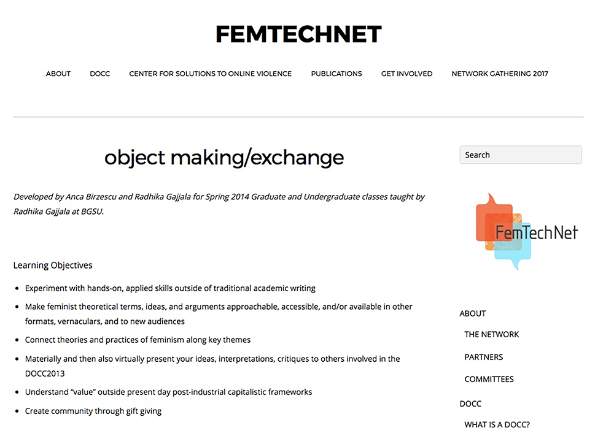
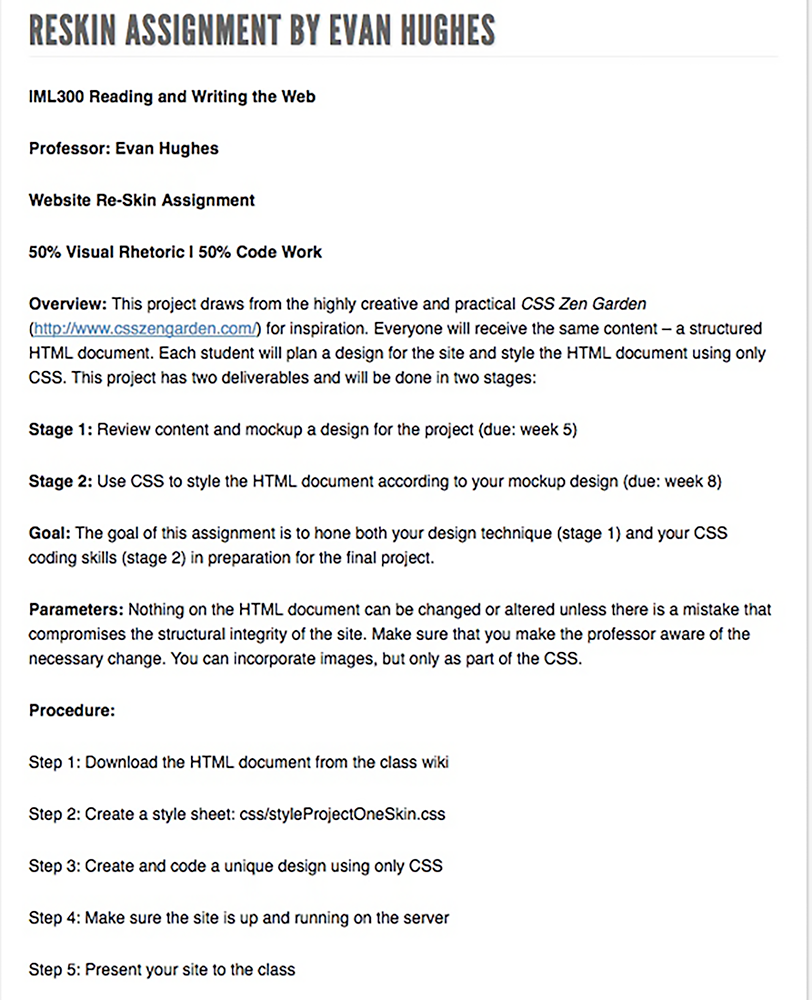
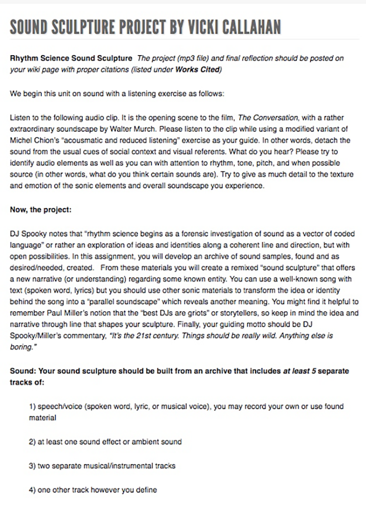
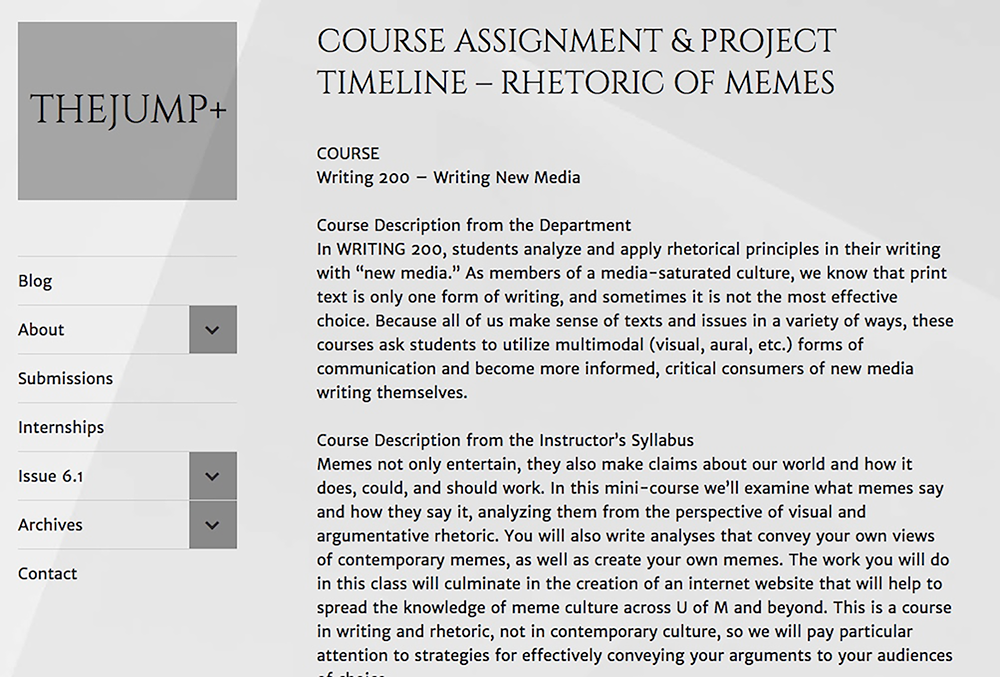
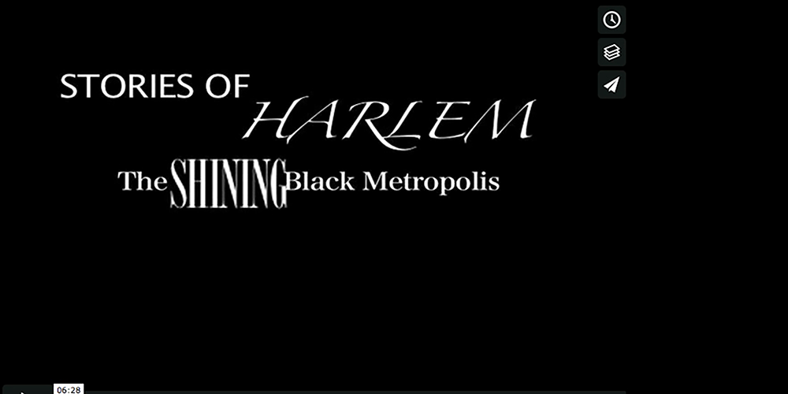
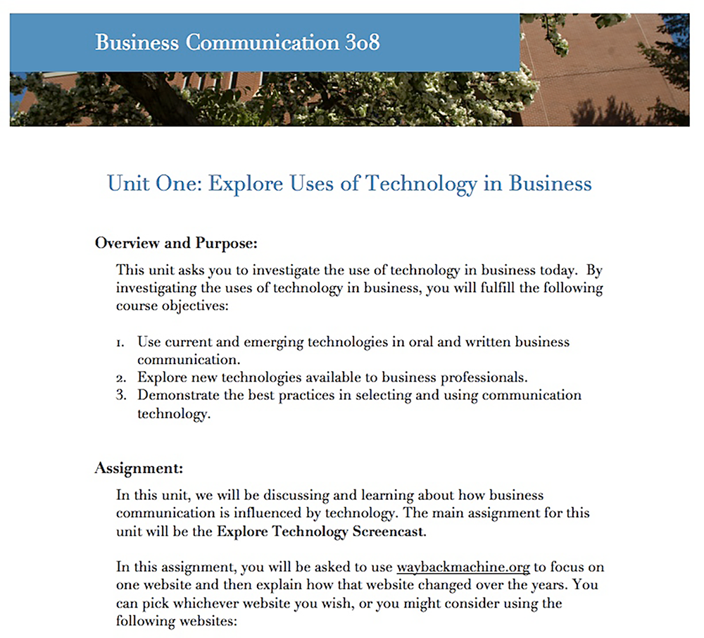
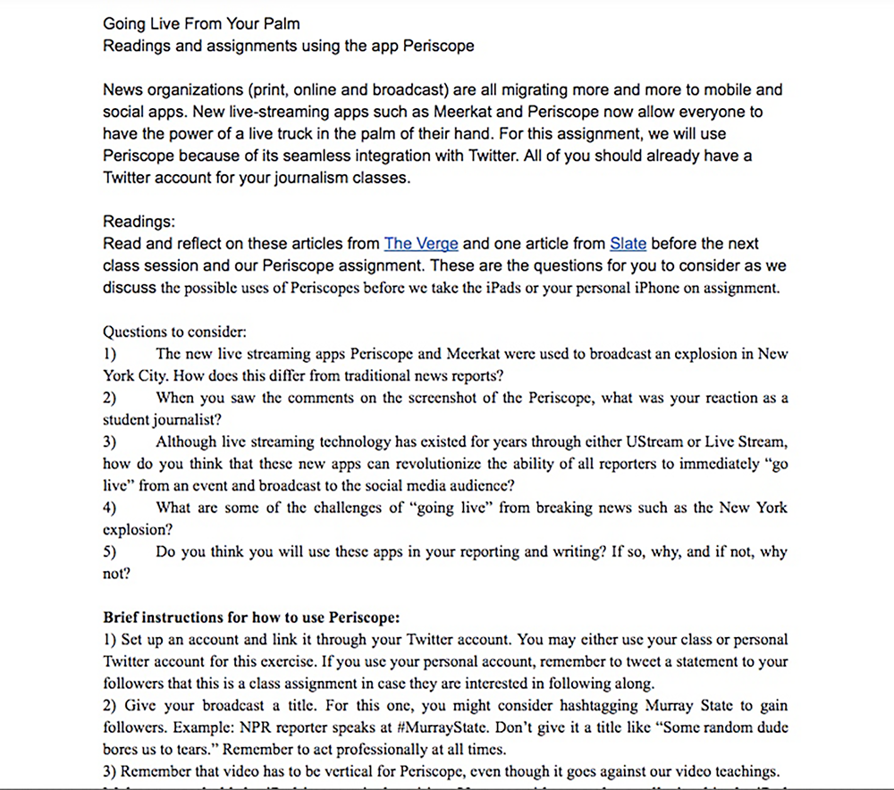
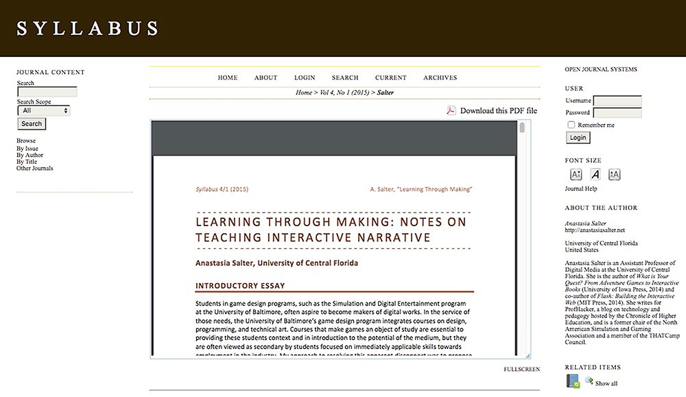
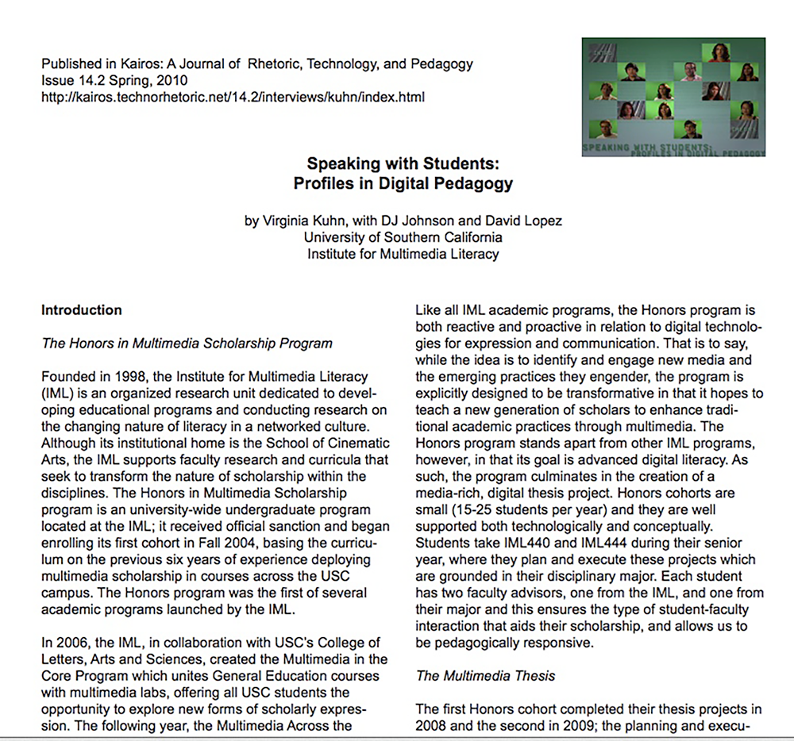

--- 
title: Digital Pedagogy in the Humanities
subtitle: Concepts, Models, and Experiments 
chapter: Multimodal
URL: keywords/multimodal.md
author: 
- family: Kuhn
  given: Virginia
editor: 
- family: Davis
  given: Rebecca Frost
publisher: Modern Language Association
type: book
---

# MULITIMODAL (draft)

## VIRGINIA KUHN
University of Southern California, School of Cinematic Arts, Division of Media Arts + Practice | [virginiakuhn.net](http://virginiakuhn.net) 

##### Publication Status: 
* unreviewed draft
* draft version undergoing editorial review
* draft version undergoing peer-to-peer review
* **draft version undergoing MLA copyediting**
* published 

---

### Cross-Reference Keywords: Archive, Failure, Praxis, Remix, Video 

---  
## CURATORIAL STATEMENT

The term *multimodal* was coined by Gunther Kress as an alternative to multimedia, its origin academic rather than commercial, and based in semiotics, rather than media. Kress defines multimodal as a text “whose meanings are realized through more than one semiotic code,” further noting that these semiotic codes are integrated, their logic and coherence conforming to an “overarching code” which is either spatially or temporally oriented (177). There is nothing specifically digital about the multimodal: A magazine with pictures qualifies as a spatially orientated multimodal text, while a film is illustrative of a temporally oriented one. However, the affordances of the digital effectively expand the available semiotic codes, allowing communication and expression across the registers of word, sound, image, video and interactivity. As such, this keyword focuses on multimodal texts in digital formats, be they natively digital or analogue objects that have been digitized. Indeed, once a word or a soundtrack or an image or a film is digitized, it becomes programmable and this, in turn, allows for a rich and nuanced integration of multiple semiotic modes into a single text. The digital exemplars of spatially and temporally oriented multimodal texts, then, are the website and the remix video respectively. That said, the lines between the two are increasingly blurry as, for instance, video is incorporated into websites and authoring platforms such as Scalar.
 
The expansion of semiotic resources holds enormous implications for pedagogy, since as our ways of knowing shift, our ways of relaying that knowledge—via  scholarship and teaching—must also shift. Thus, this keyword is informed by a definition of multimodal literacy as “competent control of the available semiotic resources” (Kuhn, “Rhetoric of Remix”) and the artifacts gathered are meant to foster critical engagement—the ability to both analyze and produce—with multimodal texts. While many teachers are skilled in writing about multimodal texts, fewer are prepared to create them or to guide their creation. Many do not see the need to do so. Yet a useful analogy is that of foreign language learning; to be considered fluent in a language, a person must be able to form a sentence as well as understand one. Similarly, one cannot fully understand the rhetorical choices involved in creating multimodal texts without actually having to make those choices. 
 
The artifacts included here are meant to be easily adaptable by teachers who are new to digital pedagogy, as well by veterans looking to refresh their curricula in this constantly shifting technological environment. The items are organized to be progressive in nature, moving from assignments that emphasize a particular extra-textual mode, to those that are more complex in their integration of multiple semiotic codes.  
 
The first artifact is an assignment prompt for the creation and exchange of a material objects which reminds us the digital is not a break with all that has come before even as it anchors academic concepts in the material world. The next three artifacts focus on specific semiotic codes, those that join the written word to create a multimodal text: these focus on code, sound and image. These are followed by a student project, a video-based digital argument that incorporates sound, text and image in compelling ways. This project is followed by a video essay assignment focused on fair use and the transformation of existing media. Understanding scholarly ways of using preexisting media and the concomitant citation practices cannot be overstated when considering multimodal texts. Simply put, it is a matter of free speech. 
 
The last four artifacts represent increasingly complex forms of multimodality with projects that span multiple registers of meaning and also complicate the spatial-temporal binary by including elements of both orientations. The first artifact is an assignment for an historical analysis of a web site, done via a screencast, and a scripted voiceover, using multiple tools. This is followed by an assignment that begins with a livestream broadcast and ends with a reflective essays into which is embedded a recording of the broadcast. Next there is a syllabus for a semester long course in interactive narrative, each unit building upon the last and contributing to a sophisticated final project. The last artifact includes a rubric for gauging multimodal projects which links to a webtext with twelve short videos that features students discussing their multimodal thesis projects. Given the pedagogical nature of this collection, it seemed fitting to end the keyword with student voices. 
 
 

## CURATED ARTIFACTS

### Object Making/Exchange

* Artifact type: assignment
* Source URL: [femtechnet.org](http://femtechnet.org/docc/object-makingexchange/)
* Permissions: © FemTechNet 2018
* Copy of Artifact: n/a
* Creators and Affiliation: Anca Birzescu and Radhika Gajjala (Bowling Green State University)

This assignment was developed for the inaugural class taught under the auspices of FemTechNet, a network that crosses disciplinary and institutional boundaries, offering feminist curricular materials to any and all who would use them. FemTechNet is a DOCC—a Distributed Open Collaborative Course —that supports decentralized and collaborative pedagogical principles. This particular project spans multiple modes of meaning and multiple forms of distribution. First, students create a physical object that responds to some aspect of feminist theory. Next, they create a “digital expression” of the piece that displays their object online. The final step is participation in a “gift exchange” where students must assign a value system and terms for bartering with other students. The project supports multimodal literacy by defamiliarizing academic writing; these objects exist outside verbal language and outside the realm of the digital. 

### Coding with Style

* Artifact type: assignment
* Source URL: [virginiakuhn.net/2015/05/reskin-assignment-hughes](http://virginiakuhn.net/2015/05/reskin-assignment-hughes/)
* Permissions: CC-BY-NC
* Copy of Artifact: [Coding with Style](files/multimodal-CodingAss.pdf)
* Creator: Evan Hughes (University of Southern California)

Evan Hughes designed this midterm assignment for an introductory undergraduate class on creative coding which covers the basics of HTML, CSS as well as some elements of visual design. The assignment asks students to use existing code and modify it with attention to its visual presentation, resulting in a spatially oriented multimodal text. Using preexisting code opens the project to beginners and is a great way to build students’ confidence, while it also shifts the emphasis from the code itself to its behavior and the ways in which HTML and CSS can be edited to change the look of a webpage. In emphasizing the underlying code, this project can foster a deeper understanding of the digital tools students use each day, though mostly in a superficial way. 

### Sound Sculpture  

* Artifact type: assignment   
* Source URL: [virginiakuhn.net/sound-sculpture-project-by-vicki-callahan/](http://virginiakuhn.net/sound-sculpture-project-by-vicki-callahan/)
* Permission: CC-BY-NC
* Copy of Artifact: [Sound Sculpture ](files/multimodal-SoundSculpt.pdf)
* Creator and Affiliation: Vicki Callahan (University of Southern California)

This assignment is focused on sound and encourages both careful listening practices in addition to composition practices that are controlled and deliberate. Contemporary culture is visually saturated, making it easy to neglect the role of sound, particularly as it impacts multimodal compositions. To prepare for the project, Vicki Callahan assigns readings from sound scholar Michel Chion, asking students to apply his listening strategies to the soundtrack of a seminal cinematic scene. From there, students acquire and assemble a series of soundtracks, both found and recorded, and edit them into a soundscape that offers a new slant on a particular concept or event. This project can be adopted by others quite easily.  Adding a viewing of “Scary Mary,” a short video that demonstrates the power of sound by placing scary music to the trailer of Mary Poppins, could enhance the preparatory work. 
 
### Course Assignment & Project Timeline – Rhetoric of Memes

* Artifact type: assignment
* Source URL: [jumpplus.net/course-assignment-project-timeline-rhetoric-of-memes/](https://jumpplus.net/course-assignment-project-timeline-rhetoric-of-memes/)
* Permission: CC-BY-NC
* Copy of Artifact: [Course Assignment & Project Timeline – Rhetoric of Memes](files/multimodal-RhetMemes.pdf)
* Creators: Nadeem Persico-Shammas & Simone Sessolo (University of Michigan)

This assignment asks students to create a website featuring a critical analysis of memes. As such, the project encourages student to explore what a word can do that an image cannot and vice versa. The piece was published in the *Journal of Undergraduate Multimedia Projects* in an issue devoted to memes and remix.  The assignment is accompanied by an overview essay, examples of student work, and reflective essays by the journal’s editorial collective. The *JUMP* offers a place for students to showcase their efforts, and provides teachers a source of potential models for projects they want to assign. As such, it becomes a potential gold mine of fodder for project ideas, and the scaffolding that can foster their production. The journal also helps students to see themselves as active contributors to the ongoing conversation around multimodality and fostering this sort of agency in students is perhaps the most worthy goal for multimodal curricula. 

### Where the Buffalo Roam

* Artifact type: Student project
* Source URL: [vimeo.com/24142859](https://vimeo.com/24142859)
* Permission: granted by the author
* Creator: Jarrod Finley

This video-based digital argument is sophisticated both conceptually and formally. The piece, which uses footage from the Shoah Visual History Archive, centers on the contradictions of U.S. military efforts in liberating Nazi camps, while also practicing racism in its treatment of its own troops. The interplay among the various modes is nuanced as the project’s form serves its conceptual goals: The images are stripped out which highlights the absence of regard for black soldiers, as it also places the focus on verbal language, encouraging careful listening during the witnesses’ oral testimony, and careful reading when the author’s commentary appears via white text on the black screen. The verbiage is stripped down using an economy of words that move in and out of frame in interesting ways, reminding us of the visual-graphical facet of writing. This piece is quite successful in constructing a complex multimodal argument in the space of a 5-10 minute video.

### Fair Use and the Video Essay

* Artifact type: assignment
* Source URL: [oxycopyrightandculture.wordpress.com/assignments/remix-video/](https://oxycopyrightandculture.wordpress.com/assignments/remix-video/)
* Permission: CC-BY-NC
* Copy of Artifact: [Fair Use and the Video Essay](files/multimodal-FairUseVid.pdf)
* Creator: Suzanne Scott (University of Texas, Austin)
* Tags: Starting out

This video essay assignment is meant to teach students about the doctrine of fair use using video essay. It is activist in nature, as Suzanne Scott frames her classroom efforts as generating not only these video essays, but also a code of best practices for exercising fair use in media making. It is incumbent upon multimodal authors to understand the four tenants of fair use and to advance their own fair use claims, which are deliberate and defensible. Scott’s approach puts transformation at the fore, allowing students to deeply understand their rights and obligations. Current copyright law did not anticipate the digital, and many digital scholars feel it is unethical to neglect issues of fair use in the classroom since it governs who may speak with media and who will be silenced. Additional context can be found in Scott's article, “Teaching Transformativity/Transformative Teaching: Fair Use and the Video Essay.” 

### Critical Genre Screencast

* Artifact type: assignment
* Source URL: [praxis.technorhetoric.net/tiki-index.php?page=PraxisWiki:_:critical%20genre%20awareness#The_Assignment_](http://praxis.technorhetoric.net/tiki-index.php?page=PraxisWiki:_:critical%20genre%20awareness#The_Assignment_)
* Permissions: Creative Commons
* Copy of Artifact: [Critical Genre Screencast](files/multimodal-critical-genre-screencast.pdf)
* Creator: Marcy Leasum Orwig (University of Wisconsin, Eau Claire)
* Tags: Advanced

This assignment asks students to create a critical analysis of a commercial website, focusing on the ways in which it has shifted over time, done in the form of a screencast. In this way, not only does the project encourage a critical analysis of digital texts, it also gives students practice in crating a multimodal piece. The assignment, which is further detailed in this Kairos Praxis Wiki piece, "'That Looks Weird': Analyzing the Rhetoric and Technology of Websites Over Time with Critical Genre Awareness", employs the Internet Archive’s Wayback Machine for historical snapshots of a website, Jing for recording a screencast, and Adobe Story to draft a script for the analysis. Although designed for a business class, this project’s potential is wide ranging and could be used in any number of classes that encourage critical engagement with media with very little revision needed. 

### Live Streaming with Periscope 

* Artifact type: assignment
* Source URL: [http://bit.ly/2HVuI7M](http://bit.ly/2HVuI7M)
* Permissions: Creative Commons
* Copy of Artifact: [Live Streaming with Periscope](files/multimodal-live-streaming-periscope.pdf)
* Creator: Leigh Landini Wright (Murray State University)

This assignment includes two readings, a live broadcast assignment, and a reflective blog post into which a recording of the live session is embedded. The result is a strongly multimodal text that includes words, sounds and images, while it also serves as a snapshot of a live event. Further context about the project can be found in Wright's “Live from Your Palm,” and although the class was geared to journalism students, its potential usefulness is more general. The unit might be reframed as a way of documenting interactive media in situ: filming the action of game play, recording interactions with virtual reality, or documenting activist events such as marches and protests. Periscope relies on vertical video, which as the author notes, is typically seen as a stylistic faux pas. The Vertical Cinema Manifesto, which argues for verticality as a feminist representation, would be a nice addition to the unit (Vertical Feminist Collective). 

### Interactive Narrative

* Artifact type: syllabus
* Source URL: 
[www.scholarlyexchange.org/ojs/index.php/TS/article/view/14485 ](http://www.scholarlyexchange.org/ojs/index.php/TS/article/view/14485)
* Permissions: Authors retain copyright and grant the journal right of first publication with the work simultaneously licensed under a CC BY-NC license.
* Copy of Artifact: [Interactive Narrative](files/multimodal-interactive-narrative.pdf)
* Creator: Anastasia Salter (University of Central Florida)

Anastasia Salter’s syllabus for a course on Interactive Narrative, published in *Syllabus*, approaches interactivity both creatively and critically, focusing on narrative structure as well as technological infrastructure. Each unit includes a mini project created with a different tools—namely, Twine, Scratch, and Inform 7. These units culminate in the creation of a final project, a Multimedia Interactive Narrative, which has clearly articulated goals and outcomes. The use of freeware and easy to learn tools makes this a viable approach for those who lack access to expensive production tools and who do not have advanced media skills. Although the class was designed for upper level classes in game design, the syllabus  emphasizes the conceptual aspect of game mechanics and interactivity making the syllabus customizable as it forms a bridge between analysis and production.

### Speaking with Students: Profiles in Digital Pedagogy

* Artifact type: rubric, teaching guide
* Source URL: [cinema.usc.edu/images/iml/SpeakingWithStudents_Webtext1.pdf](https://cinema.usc.edu/images/iml/SpeakingWithStudents_Webtext1.pdf)
* Permissions: CC BY-NC-SA license.
* Copy of Artifact: [Speaking with Students: Profiles in Digital Pedagogy](files/multimodal-SpeakingWithStudents_Webtext1.pdf)
* Creators: Virginia Kuhn, DJ Johnson, David Lopez (University of Southern California)

This assessment guide centers on multimodal thesis projects done by students in an undergraduate honors program at the Institute for Multimedia Literacy. It includes a brief program history, a discussion of the challenges to documenting multimodal work and a set of assessment parameters for gauging its efficacy. It is part of a webtext published in  *Kairos: A Journal of Rhetoric, Technology, and Pedagogy*. The webtext includes 12 short videos that feature students from a range of disciplinary majors describing their theses. Each video is accompanied by a “notes on process” section, which includes the decisions made in the constructing the video with regard to the representation of students and their work. Kairos editor Cheryl Ball builds on the thesis parameters and offers a nuanced reading of multimodal assessment practices in her article, “Assessing Scholarly Multimedia: A Rhetorical Genre Studies Approach,” which is a great resource for teachers. 

## RELATED MATERIALS

Alliance for Networking Visual Culture. Scalar multimedia authoring tool. [scalar.usc.edu](http://scalar.usc.edu/)

Anderson, Steve, et al. Critical Commons Public Media Archive and Media Advocacy site.  *n.p., n.d.* [criticalcommons.org](http://www.criticalcommons.org/)

Ball, Cheryl. "Assessing Scholarly Multimedia: A Rhetorical Genre Studies Approach." *Technical Communication Quarterly* 21.1 (2012): 61-77. Online. [dx.doi.org/10.1080/10572252.2012.626390](http://her.hepg.org/content/17370n67v22j160u/)

Baron, Dennis. From Pencils to Pixels: The Stages of Literacy Technology. *n.p. n.d.* [english.illinois.edu/-people-/faculty/debaron/essays/pencils.htm](http://www.english.illinois.edu/-people-/faculty/debaron/essays/pencils.htm)

Faden, Eric. “Media Stylos: A Manifesto for Critical Media.” Mediascape, Spring '08 (2008) 
[www.tft.ucla.edu/mediascape/Spring08_ManifestoForCriticalMedia.html] (http://www.tft.ucla.edu/mediascape/Spring08_ManifestoForCriticalMedia.html/)

## Works Cited 
Ball, Cheryl. "Assessing Scholarly Multimedia: A Rhetorical Genre Studies Approach." *Technical Communication Quarterly* 21:1 (2012): 61-77. Online.

Birzescu, Anca and Radhika Gajjala. Object Making/Exchange assignment. 2013, FemTechNet site [femtechnet.org/docc/object-makingexchange](http://femtechnet.org/docc/object-makingexchange/)

Callahan, Vicki. Sound Sculpture assignment. Received by Virginia Kuhn, 10 January 2012. http://virginiakuhn.net/sound-sculpture-project-by-vicki-callahan/

Chion, Michel. “The Three Listening Modes,” Audio-Vision: Sound on Screen, Trans. Claudia Gorbman, Columbia UP, 1994, P. P. 25-34. 

Findley, Jarrod. *Where the Buffalo Roam*, video. Online. 2011. Vimeo

Hughes, Evan. Coding with Style assignment. Received by Virginia Kuhn, 10 October 2015. [virginiakuhn.net/2015/05/reskin-assignment-hughes](http://virginiakuhn.net/2015/05/reskin-assignment-hughes/)

Kuhn, Virginia, et al. “Speaking with Students: Profiles in Digital Pedagogy.” *Kairos: A Journal of Rhetoric, Technology, and Pedagogy*, Issue 14. 2, 2010. Online. 

_______.” The Rhetoric of Remix.” *Transformative Works and Culture 9*, 2012. Online. 

Kress, Gunther and Theo van Leeuwen. *Reading Images: The Grammar of Visual Design*. Second Edition. London: Routledge. 2006. Print.
 
Orwig, Marcy. "That Looks Weird": Analyzing the Rhetoric and Technology of Websites Over Time with Critical Genre Awareness,” *Kairos: A Journal of Rhetoric, Technology, and Pedagogy,* Praxis Wiki,  Fall 2017 (Issue 22.1) 

moviemker. “THE ORIGINAL Scary 'Mary Poppins' Recut Trailer.” YouTube, YouTube, 8 Oct. 2006, www.youtube.com/watch?v=2T5_0AGdFic.

Salter, Anastasia. Interactive Narrative syllabus in “Learning Through Making: Notes on Teaching Interactive Narrative,” *Syllabus*, Vol 4, No. 1, 2015. Online. 
 
Scott, Suzanne. Remix Assignment, in “Teaching Transformativity/Transformative Teaching: Fair Use and the Video Essay.” *Cinema Journal Teaching Dossier*, Vol 1:2 (Spring/Summer 2013). Web. 

--- “Teaching Transformativity/Transformative Teaching: Fair Use and the Video Essay.” Cinema Journal Teaching Dossier, Vol 1:2 (Spring/Summer 2013). Web. 

Shammas, Nadeem Persico & Simone Sessolo, “The Rhetoric of Memes,” *The JUMP*, (Issue 5.2), 2016. 

The JUMP: Journal for Undergraduate Multimedia Projects
[https://jumpplus.net/](jumpplus.net/)

The Visual History Archive, USC Shoah Foundation. [https://sfi.usc.edu/vha/](sfi.usc.edu)

Vertical Feminist Collective, *Vertical Cinema Manifesto*, Video. Online. [www.youtube.com/watch?v=buHSJitp46w](https://www.youtube.com/watch?v=buHSJitp46w/)

Wright, Leigh Landini. “Live from Your Palm: Experiments with Using the Periscope Live-Streaming Video App in a Journalism Class,” *The Journal of Interactive Technology and Pedagogy*, April, 2017
