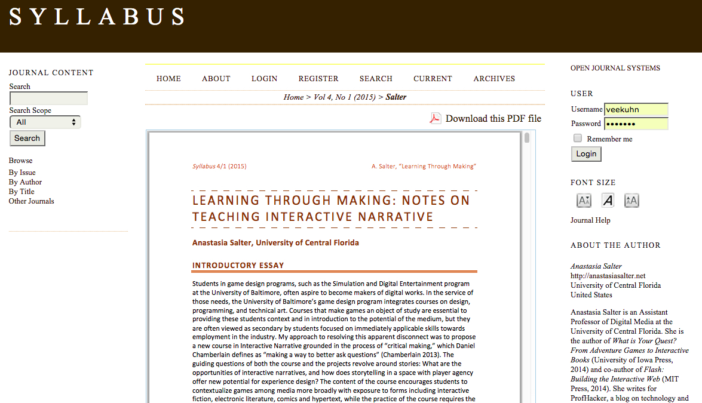
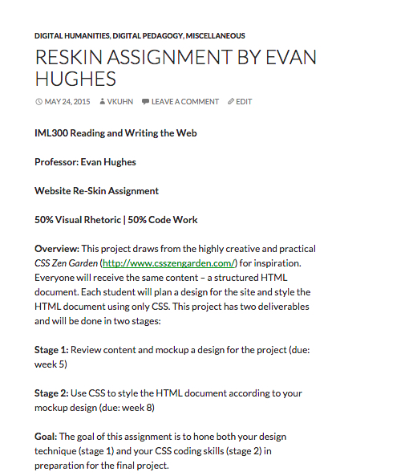
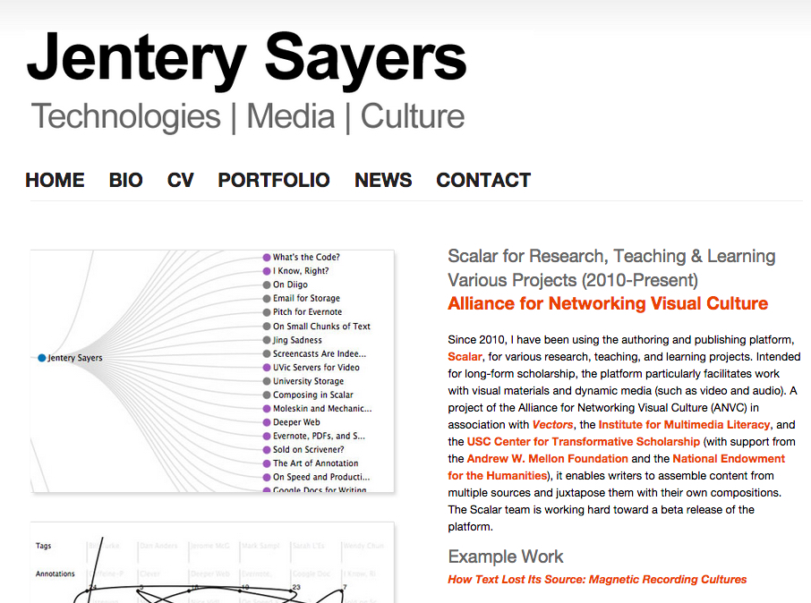
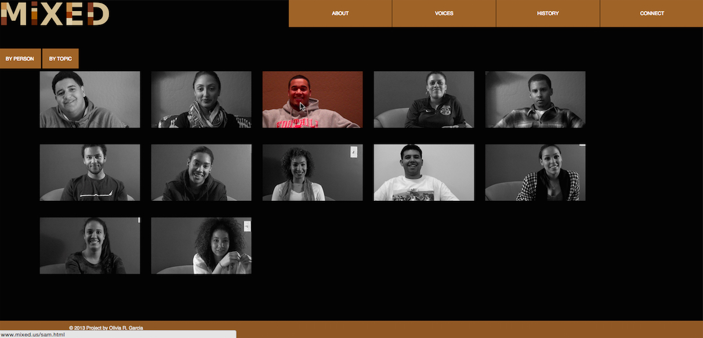
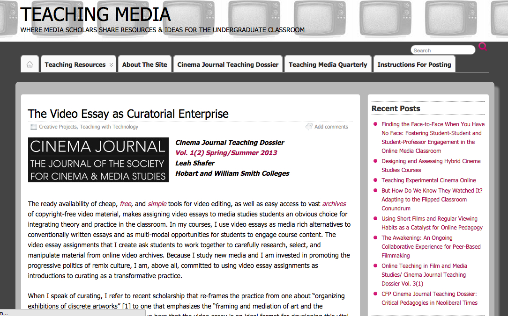
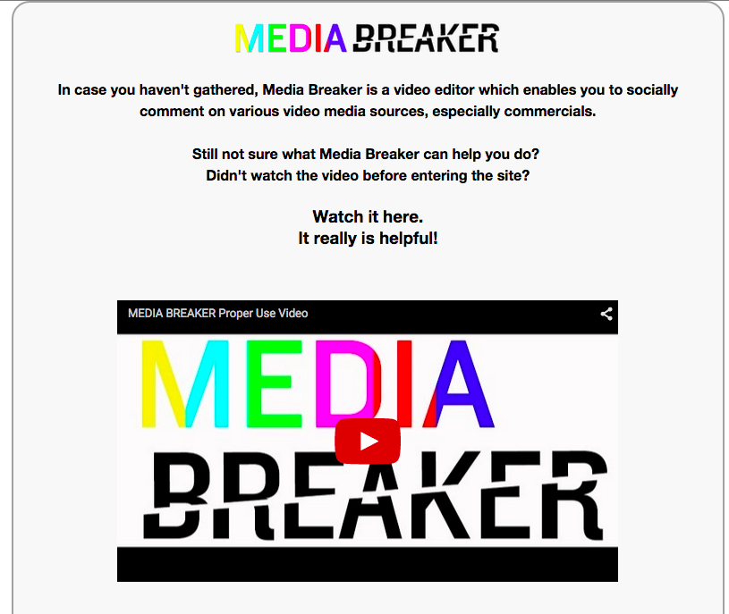
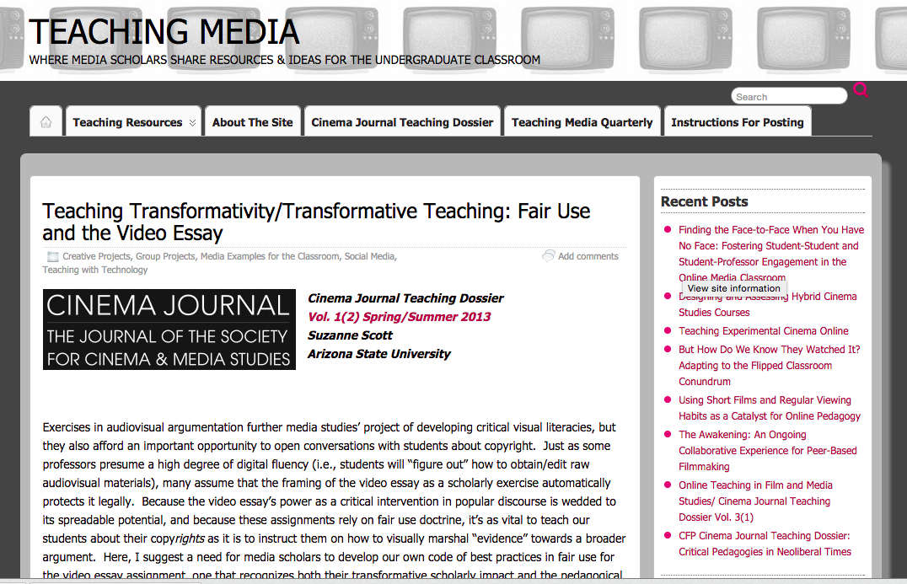
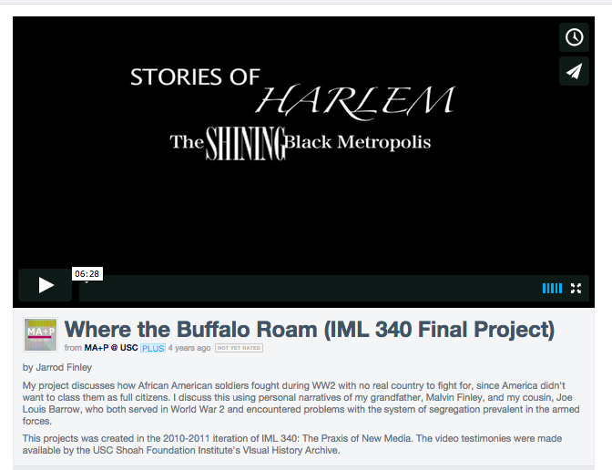
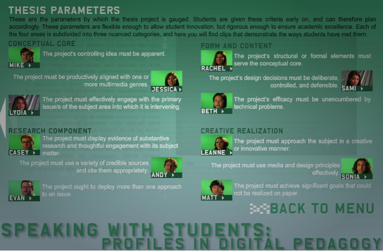
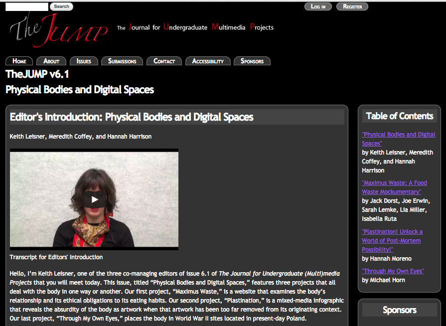

--- 
title: Digital Pedagogy in the Humanities
subtitle: Concepts, Models, and Experiments 
chapter: Multimodal
URL: keywords/multimodal.md
author: 
- family: Kuhn
  given: Virginia
editor: 
- family: Davis
  given: Rebecca Frost
publisher: Modern Language Association
type: book
---

# MULITIMODAL (Draft)

### [Virginia Kuhn] (http://virginiakuhn.net)
University of Southern California, School of Cinematic Arts, Division of Media Arts + Practice | [virginiakuhn.net](http://virginiakuhn.net) 

##### Publication Status:
* unreviewed draft
* draft version undergoing editorial review
* **draft version undergoing peer-to-peer review**
* published 

--- 

## CURATORIAL STATEMENT

Gunther Kress coined the term *multimodal* as an alternative to *multimedia*, its origin academic rather than commercial, and founded in semiotics, rather than media. Kress defines multimodal as “any text whose meanings are realized through more than one semiotic code” (177). The semiotic codes are integrated, their logic and coherence conforming to an “overarching code” which is either spatially or temporally oriented (Kress 177). Notice that there is nothing specifically digital about the multimodal: A magazine with pictures qualifies as a spatially orientated multimodal text, while a film is illustrative of a temporally oriented one.

While there are benefits to anchoring the discussion of multimodality in the realm of the analogue since it reminds us that the digital is not a break with all that has come before, I strategically focus on multimodal texts in digital formats, be they natively digital or analogue objects that have been digitized. Why? Because once a word or a soundtrack or an image or a film is digitized, it becomes programmable and this, in turn, allows for a rich and nuanced integration of multiple semiotic modes into a single text.  Thus, the affordances of the digital effectively expand the available semiotic resources, allowing communication and expression across the registers of word, sound, image, video and interactivity.  The digital exemplars of spatially and temporally oriented multimodal texts, then, are the website and the remix video respectively.
 
Digitization is a more commonly assumed feature of multimedia so why not simply use it? For Kress, the term *multimedia* includes both the dissemination and the form of a text, two aspects that he prefers to keep separate (qtd in Lauer). I would counter, however, that in contemporary parlance *multimedia* is far less a marker of dissemination than of form, and as the Associate Director of the Institute for Multimedia Literacy, I tend to use the terms interchangeably. Indeed, my research, teaching and scholarship for nearly two decades has centered on the shifting nature of communication and expression, which began in orality, moved through (print) literacy, and on to the culture in which we now find ourselves, whether one calls it “multiliterate” as the New London Group did in 1996, “electrate” as Gregory Ulmer dubbed it in 1989, or as in the case of my institution, “multimedia literate” (1998).

Although conceptions of contemporary literacy are highly contested, I define multimedia literacy as *competent control of the available semiotic resources*. Thus the resources gathered here are meant to foster critical engagement—the ability to both analyze and produce—multimodal texts. Each object supports some aspect of multimodal project design—from assigning to assessing, from citation to archiving. While many teachers are skilled in writing *about* multimodal texts, far less are prepared to create them or to guide their production. And many do not see the need to do so. Yet, a useful analogy is that of foreign language learning; to be considered fluent in a language, a person must be able to form a sentence as well as understand one. Similarly, I suggest, one cannot fully understand the rhetorical choices involved in creating multimodal texts without actually having to make those choices.  

Still, when I began assigning multimodal projects in classes I taught in departments of English and Fine Arts in 2003, I was at something of a loss as to how to best guide their creation or gauge their merits, and I’ve written about these [issues in some depth](http://enculturation.net/6.2/kuhn). Later, when I began teaching digital thesis projects and video remix, I confronted another set of technological, [conceptual](http://journal.transformativeworks.org/index.php/twc/article/view/358/279), and [political](http://enculturation.net/the-youtube-gaze) issues, all of which inform this entry.

The artifacts below begin with assignments and exemplars for spatially oriented multimodal texts, followed by assignments and exemplars for temporally oriented ones. At the same time, the lines between remix videos and webtexts are increasingly blurry as, for instance, video can be incorporated into websites and authoring platforms such as Scalar. The final two items operate at the meta-level providing an archive of sorts, one that includes rubrics, student reflections and published multimodal work by undergraduates.

The student projects offered here serve as exemplars and are fairly sophisticated as this may give students something to aspire to. However, the assignments represent a range of skill levels, and many assume no previous experience with media making.  The rationale is that even the smallest entry into critical multimodal production can be enlightening and exciting for students and teachers alike, and can provide a foundation for producing more complex projects.

## CURATED ARTIFACTS

### Learning Through Making: Notes On Teaching Interactive Narrative

* Artifact Type: Essay on Teaching
* Source URL: [syllabusjournal.org/article/view/14485/pdf_16](http://www.syllabusjournal.org/article/view/14485/pdf_16)
* Creator: Anastasia Saltar (University of Central Florida)

This article by Anastasia Salter was published in [*Syllabus*](http://www.syllabusjournal.org/), a peer reviewed journal dedicated to teaching materials. What I find most valuable is that it approaches interactivity both creatively and critically, focusing on the narrative structure as well as the technological infrastructure. The use of freeware and easy to learn tools also means that it is a viable approach for those who lack technological prowess and/or access to expensive production tools. The focus on open source tools emphasizes the conceptual and makes the syllabus customizable, as it forms a bridge between analysis and production.

### Coding with Style assignment

* Artifact Type: Assignment: Code and Visual Rhetoric
* Source URL: [virginiakuhn.net/2015/05/reskin-assignment-hughes](http://virginiakuhn.net/2015/05/reskin-assignment-hughes/)
* Creator: Evan Hughes (University of Southern California)

Evan Hughes designed this midterm project assignment for an introductory undergraduate class on creative coding which covers the basics of HTML, CSS as well as some elements of visual design. The assignment asks students to use existing code and modify it; this is a great way to build students’ confidence in coding while it also forces them to work within the confines of CSS (cascading style sheets). The creative constraints this restriction produces can be quite productive, especially when dealing with students who may not have preconceived notions about the potential of code.

### Scalar for Research, Teaching & Learning, Various Projects (2010-Present)

* Artifact Type: Webtext
* Source URL: [www.jenterysayers.com/2012/scalar](http://www.jenterysayers.com/2012/scalar/)
* Creator: Jentery Sayers (University of Victoria)

This post by Jentery Sayers offers an excellent overview of his scholarly and pedagogical use of the multimedia-authoring program, Scalar, describing its use in graduate as well as undergraduate courses, for individual assignments as well as collaborative projects. Scalar allows multimodal authoring with all media forms and, since it does not privilege one over another, allows the possibility for a sophisticated relationship among the various semiotic codes.  Scalar is flexible and allows customization yet it retains a low barrier of entry such that students generally need very little instruction to begin using it. There are several video archives that hook into Scalar, and it is fully online so it is accessible without the need for users to host and maintain their own domains.

## MiXED

* Artifact Type: Student Project: Webtext
* Source URL: [www.mixed.us](http://www.mixed.us/)
* Creator: Olivia Garcia

This video-heavy webtext is a senior thesis project from the 2013 cohort of the Honors in Multimedia Scholarship program and explores the issue of mixed race identity. It is the perfect transition piece in this context, since it has elements of both spatially and temporally oriented multimodal texts. The author interviewed several people of mixed race origin and then cut the videos so they can be accessed either by person or by topic. There is also a timeline included, which traces the history of the “mixed race” designation in legal terms. The default state of the “voices” section is black and white, but when one hovers over a particular interview, the interview changes to full color. This flourish, pictured in the screenshot attached, is a wonderfully smart addition that carries meaning at both the technological and conceptual level as it signals a selection that will complicate binary notions of what it means to be “mixed”. 

## Video Essay as Curatorial Enterprise

* Artifact Type: *Teaching Essay*
* Source URL: [teachingmedia.org/the-video-essay-as-curatorial-enterprise](http://www.teachingmedia.org/the-video-essay-as-curatorial-enterprise/)
* Creator: Leah Shafer (Hobart and William Smith Colleges)

This essay was published as part of the themed series of “Teaching Media,” the online component of the prominent *Cinema Journal*.  This piece by Leah Shafer appeared in the issue whose theme was teaching the video essay. Not only does the assignment Shafer describes render the act of curation legible to students, as it has come to be a prominent scholarly activity, it also sheds light on other common online activities such as the ubiquitous “sharing,” sparking a more critical aspect to the items that one choses to spread via social media, for instance. Moreover, as Shafer notes, when students engage with archival media (a.k.a. found footage) in group work, they foster a “community of meta-learning” giving students an investment in the media.

## MediaBreaker

* Artifcat Type: Online Video Library and Editing Tool
* Source URL: [mediabreaker.thelamp.org/login.php](http://mediabreaker.thelamp.org/login.php)
* Creator: The LAMP

MediaBreaker is a tool designed by [The LAMP](http://thelamp.org/), a media literacy nonprofit based in New York, that allows users to “talk back” to media in this age of media conglomeration, in order to shed a light on its biases. Users can import clips from YouTube or add their own to MediaBreaker’s online library, before using its editing tool to remix the message and, in so doing, offer an alternative media ecology. Once complete, users upload their transformed videos to MediaBreaker, where they are screened by a team of legal experts before being either posted, or sent back to the creator with notes for bringing the piece into compliance with fair use parameters.

## Teaching Transformativity/Transformative Teaching: Fair Use and the Video Essay

* Artifact Type: Article on Teaching the Video Essay
* Source URL: [teachingmedia.org/teaching-transformativitytransformative-teaching-fair-use-and-the-video-essay](http://www.teachingmedia.org/teaching-transformativitytransformative-teaching-fair-use-and-the-video-essay/)
* Creator: Suzanne Scott (Arizona State University)

This guide to teaching the video essay is activist in nature as Suzanne Scott frames her classroom efforts as generating not only video essays, but also a code of best practices for exercising fair use in media making. While MediaBreaker removes some of the onus for establishing fair use by employing legal counsel to submitted videos, it is incumbent upon multimodal authors to understand the four tenants of fair use and to advance their own fair use claims, which are deliberate and defensible. Scott’s approach puts transformation at the fore, allowing students to deeply understand their rights and obligations. Having fought [copyright infringement claims](http://enculturation.net/the-youtube-gaze) for several years, I appreciate the ways in which current copyright law never anticipated the digital, and feel it is unethical to neglect issues of fair use in the classroom since it governs who may speak with media and who will be silenced.

## *Where the Buffalo Roam*

* Artifact Type: Student project: Remix Video
* Source URL: [vimeo.com/24142859](https://vimeo.com/24142859)
* Creator: Jerrod Finley

Having taught video remix since 2008, I have seen a wide range of student work, which tends to be either conceptually sound or technically solid, but seldom both. Indeed, when students are learning a new technology, it can be difficult to keep the type of critical consciousness they have when composing with verbal language. But even for those who have mastered the technology, it takes a great deal of finesse to construct a multimodal argument that is [complex and nuanced](http://journal.transformativeworks.org/index.php/twc/article/view/358/279) in the space of a 5-10 minute video. *Where the Buffalo Roam* is the exception to this rule, demonstrating the contradictions of U.S. military efforts in liberating Nazi camps, while also practicing racism in its treatment of its own troops. By stripping out the images for most of this piece, the video’s form serves the conceptual ends as the absence of regard for black soldiers is highlighted. 

## Speaking with Students: Profiles in Digital Pedagogy

* Artifact Type: Webtext
* Source URL: [kairos.technorhetoric.net/14.2/interviews/kuhn](http://kairos.technorhetoric.net/14.2/interviews/kuhn/)
* Creators: Virginia Kuhn, DJ Johnson, Dave Lopez (University of Southern California)

This webtext, published in the online journal *Kairos: A Journal of Rhetoric, Technology, and Pedagogy*, features students from the Honors in Multimedia Scholarship program at USC discussing their natively digital and media-rich theses. They come from a range of disciplinary majors, from biology to theatre, which makes the videos useful for any number of classes aimed at integrating multimodal texts.  As the director of the Honors program, I had my own reasons for pursuing the publication—video provides a somewhat stable means for documenting projects that are ephemeral, idiosyncratic, or whose native platforms are obsolete—but it soon became clear that one of its most valuable aspects lay in its assessment parameters. *Kairos* editor Cheryl Ball builds on these and offers a nuanced reading of multimodal assessment practices, in her article, “[Assessing Scholarly Multimedia: A Rhetorical Genre Studies Approach](http://ceball.com/wp-content/uploads/2012/01/TCQ-Ball-publishedversion.pdf),” which is a great resource for teachers.

## *The JUMP: Journal of Undergraduate Multimedia Projects*

* Artifact Type: Journal
* Source URL: [jump.dwrl.utexas.edu](http://jump.dwrl.utexas.edu/)
* Creator: Founding editor, Justin Hodgson

This journal started by digital rhetorician Justin Hodgson, publishes undergraduate multimodal projects giving students a place to showcase their efforts, and providing teachers with an incentive for good work, as well as a source of potential models for projects they want to assign. In addition to the projects themselves there are various contextual items including the assignment sheet, an overview of the course from which it came, reflections by the project’s authors, and textual reviews done by faculty in the editorial collective. As such, *The JUMP* becomes a potential gold mine of fodder for project ideas, and the scaffolding that can foster their production. The journal also helps students to see themselves as active contributors to the ongoing conversation around multimodality. And, after all, fostering this type of agency in students is perhaps the most worthy goal for multimodal curricula. 

## RELATED MATERIALS

Anderson, Steve, et al. *Critical Commons Public Media Archive and Media Advocacy site*. *n.p.*, *n.d.* web. [criticalcommons.org](http://www.criticalcommons.org/)

Baron, Dennis. *From Pencils to Pixels: The Stages of Literacy Technology*/ *n.p.*, *n.d.* web. [english.illinois.edu/-people-/faculty/debaron/essays/pencils.htm](http://www.english.illinois.edu/-people-/faculty/debaron/essays/pencils.htm)

Ball, Cheryl. "Assessing Scholarly Multimedia: A Rhetorical Genre Studies Approach." *Technical Communication Quarterly* 21.1 (2012): 61-77. Online.  [dx.doi.org/10.1080/10572252.2012.626390](http://dx.doi.org/10.1080/10572252.2012.626390)

Faden, Eric. “Media Stylos: A Manifesto for Critical Media.” *Mediascape*, Spring '08 (2008): Meta section. Online. [http://www.tft.ucla.edu/mediascape/Spring08_ManifestoForCriticalMedia.html](http://www.tft.ucla.edu/mediascape/Spring08_ManifestoForCriticalMedia.html)

Cazden, Courtney, et al. New London Group. “A Pedagogy of Multiliteracies: Designing Social Futures.” *Harvard Educational Review* 66.1 (1996): 60-92. Online. [her.hepg.org/content/17370n67v22j160u](http://her.hepg.org/content/17370n67v22j160u/)

## Works Cited

Ball, Cheryl. "Assessing Scholarly Multimedia: A Rhetorical Genre Studies Approach." *Technical Communication Quarterly* 21:1 (2012): 61-77. Online.

Cazden, Courtney, The New London Group, et al. “A Pedagogy of Multiliteracies: Designing Social Futures.” *Harvard Educational Review* 66.1 (1996): 60-92. Online.

Kress, Gunther and Theo van Leeuwen. *Reading Images: The Grammar of Visual Design*. Second Edition. London: Routledge, 2006. Print.
 
Kuhn, Virginia. “Performing Life: Whose Pictures are Worth A Thousand Words?” *Enculturation* 6.2 (2009). Online.

---. “The YouTube Gaze: Permission to Create?” *Enculturation* 7 (2010). Online.

---, et al. “Speaking with Students: Profiles in Digital Pedagogy.” *Kairos: A Journal of Rhetoric, Technology, and Pedagogy* 14.2 (2010). Online.

---. “The Rhetoric of Remix.” *Transformative Works and Culture* 9 (2012). Online. 

Lauer, Claire. “What’s in a name? The Anatomy of Defining New/Multi/Modal/Digital/Media Texts,” *Kairos: A Journal of Rhetoric, Technology, and Pedagogy.* 17.1 (2009). Online.

Manovich, Lev. *The Language of New Media*. Cambridge: MIT Press, 2001. Print.

Tepper, Allegra. *Trials in Transmedia.* Scalar, *n.d*. Web.

Ulmer, Gregory. *Internet Invention: From Literacy to Electracy*. New York: Longman, 2002. Print.
