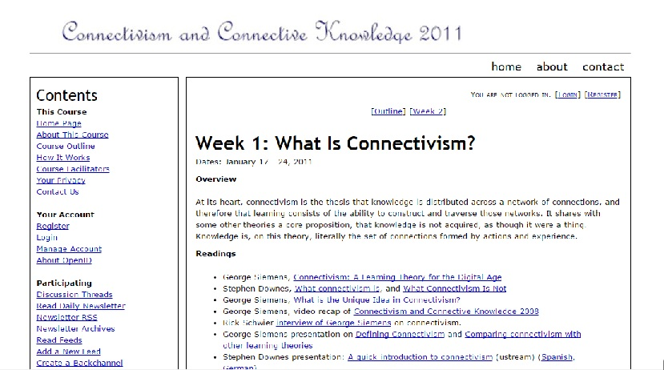
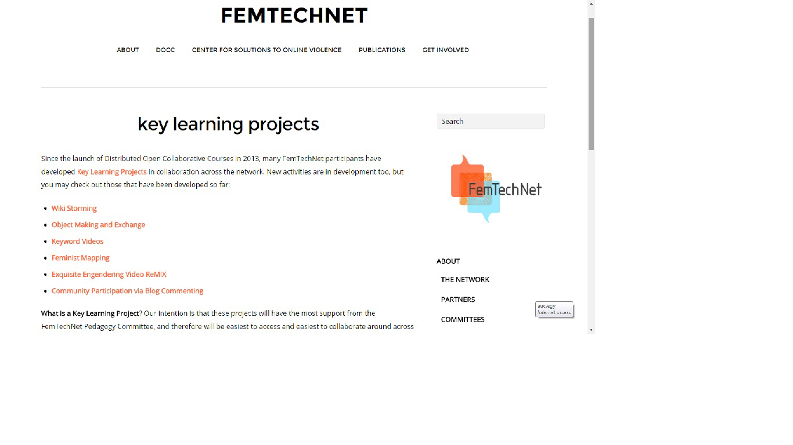
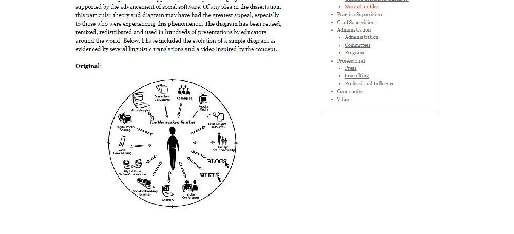
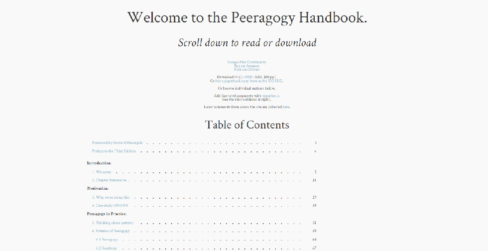
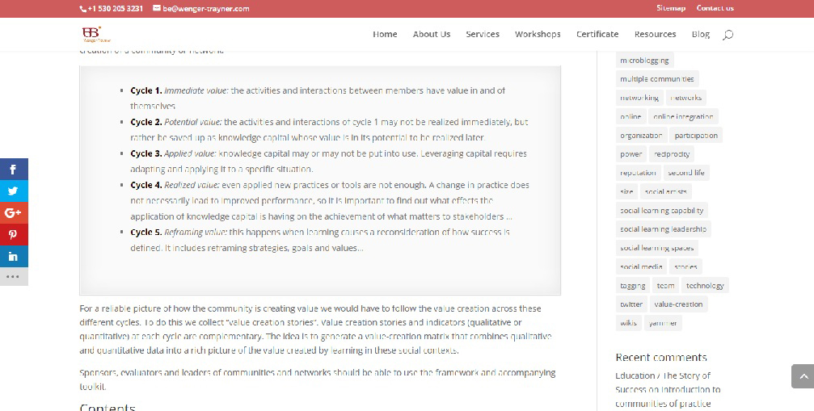
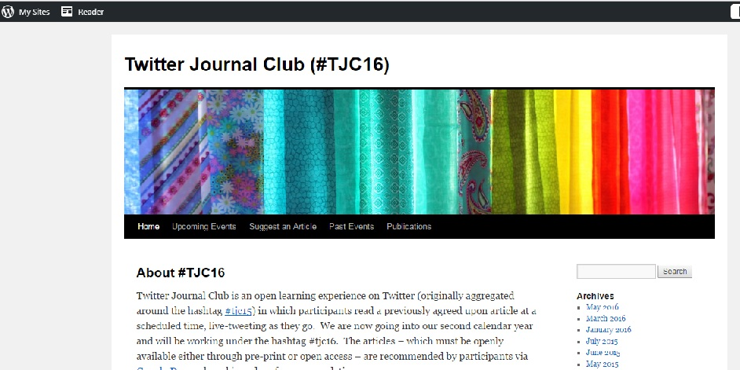
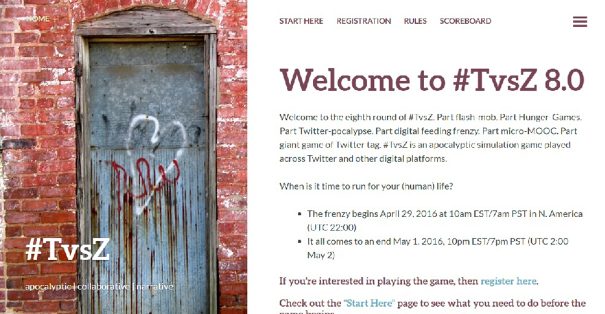
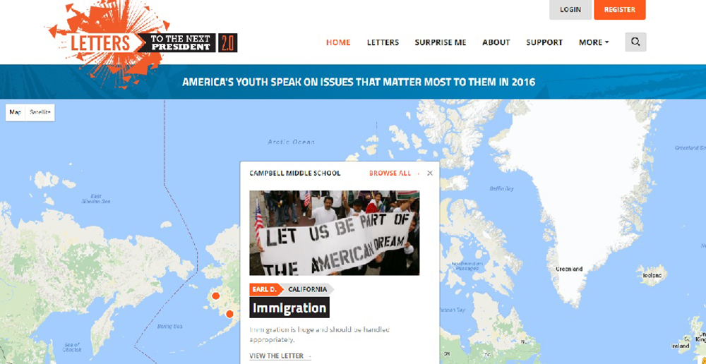
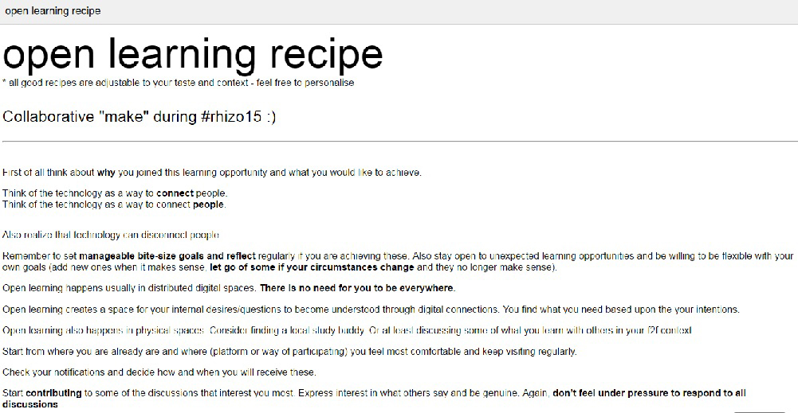

# NETWORK (Draft)

## Maha Bali and Mia Zamora

American University in Cairo | [http://blog.mahabali.me](http://blog.mahabali.me)

Kean University | [http://miazamoraphd.com](http://miazamoraphd.com)

---

##### Publication Status:
* unreviewed draft
* **draft version undergoing editorial review**
* draft version undergoing peer-to-peer review
* published 

--- 

## CURATORIAL STATEMENT

Classrooms are no longer bound by walls.  Information is readily available, and the tap of a screen gives us access to the open web.  With this new capacity to access content in a split-second, how has this transformed teaching and learning? What role might networks play in these contexts? 

People often associate the term network with infrastructure, but here we tackle the importance of the term as used for learning in the context of digital pedagogy and the social web. Networks can facilitate and expand the acquisition of knowledge, opening learning to a world beyond the immediate environment through connection.  But key considerations should be made when thinking about the network as a learning portal:  What may be the differences between a community versus a network? How does networked learning differ from connectivism? What is distinct about physical/analog vs digital networks? As social media has leant us powerful new tools to inquire with, to connect with (or to simply watch each other with), we take account of the pedagogical use of such tools in order to design inspired and empowered learning environments.

### Communities vs. Networks
As Wenger and Traynor have made clear, while communities are networks in the sense that they involve connections among members, not all networks are communities (of practice).  The network refers to the set of relationships, personal interactions, and connections among participants, viewed as a set of nodes and links, with its affordances for information flows and helpful linkages.  A community of practice entails a shared domain as a source of identification. “This identity creates a sense of commitment to the community as a whole, not just connections to a few linking nodes.” (Wenger, 191)  Wenger further adds that network emphasizes connectivity, while a community emphasizes identity, although the two usually coexist.  As Howard Rheingold puts it, “the difference between an online social network and a community has to do with the quality, continuity, and degree of commitment in the relationship between members.” (163) George Siemens goes one step further by suggesting that communities can be considered nodes within a network. 
In harnessing the power of the digital network for the sake of teaching and learning, one makes use of a complex lattice of relationships, nodes, links and associations, facilitating interaction via a form of connectivity that drives both discovery and sharing.  As an example, the Personal Learning Network (PLN) is a vibrant, ever-evolving and flexible group of connections.  In addition, the hashtag is a digital tool that pays tribute to the network.  In developing our own curation of this keyword network, we relied on our own PLNs to crowdsource our initial ideas and build a comprehensive reading list (Bali and Zamora).
 
### Networked Learning vs. Connectivism
McConnell et al highlight the philosophical roots of networked learning in the work of Dewey and Freire.  Emphasizing relationships and collaboration rather than technology, networked learning highlights openness in attitude, learner collaboration, self-directed learning, and authentic learning.  The more recent model of connectivism arose to describe networked learning enhanced by social media. McConnell et al suggest that the advent of social media supports networked learning more effectively than the confined learning model of the Learning Management System (LMS, e.g. Blackboard). Connectivism expands the meaning of openness to the open web, and interactions do not necessarily take place only in tight-knit communities or within the confines of a particular course, but are distributed over social media. Catherine Cronin considers how open online spaces are public, widening learners’ networks and possible identities, whereas bounded spaces (i.e., classes using LMSs) are private.

### Digital vs. Analog Networks
Even though we mention particular locations and tools here, the technologies are secondary to the relationships that occur in communities and networks, and of course, these connections can occur in digital, analog or hybrid form. HASTAC and FemTechNet are both hybrid. Keith Brennan discusses a networked learning experience akin to MOOCs that occurred before there were even telephones.  The key to new learning opportunity is the instinct to reach for new connections that will further intellectual curiosity and personal growth.  So why would we dismiss social media which stands as a powerful tool for transformational learning?  Most educators understand the significant learning benefits of a strong (analog/in-person) network, but many are fearful of public vulnerability and risk when considering the open web.  In an attempt to establish security, some educators and educational administrators are inclined to throw the proverbial baby out with the bathwater. 

### Selection Criteria:
We highlight many pedagogical collaborations that have established a culture of trust which must be emphasized as a critical factor to learning success in a digital network. We chose artifacts that show diverse ways of networking, many of which are meta: you learn about networking while observing/experiencing networking.

## CURATED ARTIFACTS

### Connectivism & Connected Knowledge

* Artifact Type: Open online course CCK11 (updated from CCK08, first connectivist MOOC)
* Source URL: [http://cck11.mooc.ca/index.html](http://cck11.mooc.ca/index.html) 
* Artifact Permissions: CC-BY-NC-SA
* Copy of the Artifact: 
* Creator and Affiliation: George Siemens, University of Texas, Arlington and Stephen Downes, Learning and Performance Support Systems, National Research Council of Canada 

Connectivism is a learning model developed by George Siemens and Stephen Downes. It emerged as previous theories of behaviorism, cognitivism and constructivism failed to explain distributed socially-networked learning. This artifact is a connectivist MOOC about connectivism. The [principles of connectivism](http://www.elearnspace.org/Articles/connectivism.htm) include that learning benefits from diversity of opinions, that the process of forming connections is more important than collecting knowledge, and that nurturing connections supports future learning of the unknowable unknown. [“How This Course Works”](http://cck11.mooc.ca/how.htm) is that participants aggregate, remix, repurpose and feedforward. The value is not content or assignments/activities suggested by facilitators, but what the participants themselves make of it - facilitators
share an [aggregation of feeds from participant blogs/tweets](http://cck11.mooc.ca/feeds.htm). See sample [daily newsletter](http://cck11.mooc.ca/archive/11/04_01_newsletter.htm), incorporating participant content as well as facilitator-led activities. Readers may adopt such a connectivist approach in an online or hybrid course.

### FemTechNet Commons

* Artifact Type: an online commons
* Source URL: [http://femtechnet.newschool.edu](http://femtechnet.newschool.edu) 
* Artifact Permissions: CC-BY-NC-SA
* Copy of the Artifact:  
* Creator and Affiliation: FemTechNet, Multiple Universities

FemTechNet is a network of scholars, artists, and students who work on, with, and at the borders of technology, science and feminism in a variety of fields including STS, Media & Visual Studies, Art, Women’s, Queer, and Ethnic Studies.  Members in the network collaborate on the design and creation of projects of feminist technological innovation. This artifact highlights how a network may support a variety of different kinds of learners. Some may participate in the [FemTechNet DOCC](http://femtechnet.newschool.edu/docc2013/) (“Distributed Open Collaborative Course” - a collaborative open course structure) through the creation of independent studies arranged by students and teachers in other learning contexts.  Others may connect as self-directed learners who participate on their own.  In addition, the network supports “drop-in learners” who tune in for a particular discussion. The power of the network is illustrated by the variety of FemTechNet projects which can be initiated by anyone through the FemTechNet Commons.

### Story of an Idea: The Networked Teacher

* Artifact Type: blogpost with diagram
* Source URL: [http://couros.ca/cv/research/story-of-an-idea/](http://couros.ca/cv/research/story-of-an-idea/) 
* Artifact Permissions: CC-BY-NC-SA
* Copy of the Artifact: 
* Creator and Affiliation: Alec Couros, University of Regina

The diagram titled “The Networked Teacher” produced by Alec Couros (within the context of his doctoral dissertation), illustrates his discovery of emerging teacher networks.  It has been reused, remixed, redistributed and used in hundreds of presentations by educators worldwide. The “Networked Teacher” blog and diagram is a testament to Couros’ devotion to open education influenced by the ideals of the open source software movement, open content, and open access (an important aspect of the ethics of networked learning). It highlights the tools and practices a networked teacher employs when growing a Personal Learning Network.  In turn, the blog post reveals the evolution of this simple diagram as evidenced by several linguistic translations and a video inspired by the concept.  This artifact serves both as a representation of networked learning, as well as evidence of the practices of educators who produce, share, and distribute open content via their learning networks. 

### Peeragogy Handbook

* Artifact Type: online handbook (with collaborative annotation)
* Source URL: [http://peeragogy.github.io](http://peeragogy.github.io)
* Artifact Permissions: CC0
* Copy of the Artifact:  
* Creator and Affiliation: J. Corneli, C. J. Danoff, C. Pierce, P. Ricuarte, and L. Snow MacDonald, eds. *The Peeragogy Handbook*. 3rd ed. Chicago, IL./Somerville, MA.: PubDomEd/Pierce Press, 2016. Downloaded from http://peeragogy.org.  

A “how-to-do-it” resource on how a group of self-learners can organize via networked co-learning. *The Peeragogy Handbook* is a crowdsourced and collaboratively annotated compendium for any group of people who want to co-learn any subject together using the tools and knowledge available online.  When students are given an open group research project, this handbook guides co-learners in identifying shared purpose and defining self determined learning outcomes. The term “peeragogy” comes from Howard Rheingold via his Social Media Classroom.  Rheingold instigated this project, serving as a “catalyst” for the creation of this peer-created guide to pure peer-to-peer learning in the networked era. Peeragogy is a flexible framework of techniques for peer learning and peer knowledge production. Whereas pedagogy deals with the transmission of knowledge from teachers to students, peeragogy is what people use to produce and apply knowledge together. The strength of peeragogy is its flexibility and scalability through networked learning. 

### Promoting and Assessing Value Creation in Communities and Networks: a Conceptual Framework 

* Artifact Type: resource for evaluation (pdf, framework)
* Source URL: [http://wenger-trayner.com/resources/publications/evaluation-framework](http://wenger-trayner.com/resources/publications/evaluation-framework) 
* Artifact Permissions: 
* Copy of the Artifact:  [files/network-assessingvaluecreation.pdf](files/network-assessingvaluecreation.pdf)
* Creator and Affiliation: Wenger, E., Trayner, B., and de Laat, M. 

This framework, published by the Open University of the Netherlands, addresses the need to assess value of communities/networks using five levels of value creation
1.	immediate (activities and interactions) , 
2.	potential (knowledge capital), 
3.	applied (changes in practice) , 
4.	realized (performance improvement) and
5.	reframing value (redefining success).

The first four of these are adapted from Kirkpatrick’s work, long used in the field of training. The document also describes differences between communities and networks, possible measures for each of the five levels, and approaches to writing narratives assessing value of communities/networks. They emphasize how the story of a network involves both personal and social networks with multiple perspectives. This artifact can be used pedagogically to measure the value of a learning network as learners experience networking.

### Twitter Journal Club

* Artifact Type: Twitter hashtag #tjc16 representing Twitter Journal Club
* Source URL: [https://tjc16.wordpress.com/](https://tjc16.wordpress.com/) 
* Artifact Permissions: Creative Commons Attribution-NonCommercial 4.0 International License.
* Copy of the Artifact: 
* Creator and Affiliation: Laura Gogia

Laura Gogia started Twitter Journal Club (originally #tjc15) while she was a graduate student; people agree to read an article together at a designated time period, and livetweet as they go (occasionally with the author responding on Twitter).  A hashtag on Twitter allows anyone to observe any time and jump in whenever they like; they do not need to be part of the community, nor does using a hashtag make them part of the community if they do not wish to use it regularly. Discussion can be synchronous, planned or spontaneous, or asynchronous over an extended time. Participation does not require membership in a community, but helps build PLNs, as (Shelly Terrell explains)[http://dmlcentral.net/shelly-terrell-global-netweaver-curator-pln-builder/].  This artifact serves as a both as a model and a tutorial.
  See this (Storify)[https://storify.com/GoogleGuacamole/may-2016-twitter-journal-club-tjc16] to see a sample Twitter chat in retrospect, and (this article)[http://www.digitalpedagogylab.com/hybridped/careful-approach-to-digital-scholarship/] for the backstory behind TJC.

### “#TvsZ”

* Artifact Type: Twitter game
* Source URL: [http://tvsz.us](http://tvsz.us) 
* Artifact Permissions: 
* Copy of the Artifact: 
* Creator and Affiliation: Pete Rorabaugh, Kennesaw State University and Jesse Stommel, University of Mary Washington (later redesigned and faciltated by others)

Rorabaugh & Stommel created “an epic zombified experiment in Twitter literacy, gamification, collaboration, and emergent learning.” #TvsZ is a Twitter adaptation of the game humans vs. zombies (a game of tag played in college), meant to develop digital literacy. Often played by college students with anyone on Twitter who wishes to participate, it “offers no certificate or diploma, but an opportunity to connect with others”. People who play need to learn to collaborate with virtual strangers online during the condensed (around 3-day) period of play, experiencing accelerated network-building. A key feature is emergent [game rules](http://tvsz.us/rules/), and that players themselves participate in suggesting changes. In 2015 Rorabaugh mentions how the game evolved. Its then-latest zombie-free version had 6 administrators from Canada, Egypt and US. It presents an approach to perforating the classroom, introducing students to global, networked learning while learning digital literacy. [Curated artifacts from 6.0](http://fliphtml5.com/segh/davk) 

### Virtually Connecting 

* Artifact Type: YouTube channel and accompanying website
* Source URL: [http://www.youtube.com/virtuallyconnecting](http://www.youtube.com/virtuallyconnecting) and [http://www.virtuallyconnecting.org](http://www.virtuallyconnecting.org)
* Artifact Permissions: YouTube Standard license
* Copy of the Artifact: 
* Creator and Affiliation: Rebecca J. Hogue and Maha Bali, American University in Cairo

Originally piloted as #et4buddy in April 2015, Virtually Connecting (VC) attempts to take Personal Learning Networks (PLN) to the next level and expand access to conferences to people who cannot attend for financial, social, logistical or health reasons. Some scholars have opportunities to meet their virtual PLN in person at conferences, but many do not. VC creates opportunities for people to participate in a conference _conversation_ virtually by meeting via synchronous video with onsite participants at that conference, going beyond virtual participation via  watching livestreams of selected sessions and using Twitter. Instead, VC invites virtual participants to converse with onsite participants (including keynote speakers) directly for an extended period of time. This supports the deepening and broadening of scholarly PLNs for graduate students, adjuncts, young mothers, and international scholars.  As a pedagogical gateway, instructors can work with VC to bring their class to the conference. 

### Letters to the Next President

* Artifact Type: Networked Digital Annotation
* Source URL: [https://hypothes.is/nwp-invitational-summer-institute-annotatathon/](https://hypothes.is/nwp-invitational-summer-institute-annotatathon/) and [http://letters2president.org/opportunity/nwp-a-more-perfect-union-teacher-annotatathon/](http://letters2president.org/opportunity/nwp-a-more-perfect-union-teacher-annotatathon/)
* Artifact Permissions: unclear, but annotations are by default CC0
* Copy of the Artifact: 
* Creator and Affiliation: Hypothes.is and National Writing Project

Digital annotation can expand our understanding of what is possible when we read together.  (Hypothes.is) [https://hypothes.is/] facilitates the act of shared reading. It leverages group annotation to enable sentence-level critique and multimodal note-taking on any text found on the internet. An example of the networked use of this tool comes from (Letters to the Next President 2.0) [http://letters2president.org] which hosted an “annotatathon” in Summer 2016 together with the National Writing Project and KQED, and several Educator Innovator partners. Through the power of social annotation, students and educators share insights on Obama’s “A More Perfect Union” speech.  L2P 2.0 has been launched as a network learning space to spark research, thinking and civic engagement with youth. After the annotatathon, the project will convert to a massive, open online publishing platform where any educator or youth mentor can make space for students to voice their thinking.

### Open Learning Recipe

* Artifact Type: crowdsourced document
* Source URL: [https://docs.google.com/document/d/14-V6ZQgIQ3Mpq6QCPvvFr2y-45zdzxIh721yPSlHbyo/pub](https://docs.google.com/document/d/14-V6ZQgIQ3Mpq6QCPvvFr2y-45zdzxIh721yPSlHbyo/pub)
* Artifact Permissions: unclear, but bottom of document says Creative Commons 
* Copy of the Artifact: [files/network-openlearningrecipe.pdf](files/network-openlearningrecipe.pdf)
* Creator and Affiliation: #rhizo15 MOOC participants (names listed in the document)

This is a crowdsourced document in which participants in a rhizomatic/connectivist open course (#rhizo15) worked together in the first week to create a recipe for open learning. It is created in an open Google document, where different participants entered the tips they feel would be helpful to someone new to the arena of open learning. Because participants could see each other’s tips, they could add to what already existed, add comments (viewable in the margins), and ask for clarification. The document is a good example of crowdsourcing knowledge in a network, and can be adapted for a variety of different learning contexts. 

##Acknowledgments
Thank you to contributors to our early google doc & hashtag: Rebecca J. Hogue, Andrea Rehn, Frances Bell, Jeffrey Keefer, Catherine Cronin, Howard Rheingold, Vanessa Vaile, Maha Abdelmoneim, Thomas Ryberg, Kevin Hodgson, Peter Goodyear, Virginia Yonkers, Linda Harasim, Jeff Merrell, Michael Weller

## RELATED MATERIALS

Bali, M., Crawford, M., Jessen, R., Signorelli, P., & Zamora, M. (2015). [What Makes a cMOOC Community Endure? Multiple Participant Perspectives From Diverse MOOCs.](http://www.tandfonline.com/doi/abs/10.1080/09523987.2015.1053290?tokenDomain=eprints&tokenAccess=KJCAAciPbwM2MFnjrvUY&forwardService=showFullText&doi=10.1080%2F09523987.2015.1053290&journalCode=remi20) *Educational Media International*, 100-115.

Cormier, David. (2008). Rhizomatic education: Community as curriculum. *Innovate: Journal of Online Learning.* 4(5). Republished and retrieved from (http://davecorkmier.com/edblog/2008/06/03/rhizomatic-education-community-as- curriculum/)

Dabbagh, N., & Kitsantas, A. (2012). Personal Learning Environments, social media, and self-regulated learning: A natural formula for connecting formal and informal learning. The Internet and Higher Education 15(1), 3-8. 

Downes, Stephen. “What connectivism is.” Web. 15 September 2007. http://halfanhour.blogspot.com/2007/02/what-connectivism-is.html

DML Central. Digital Media and Learning Research Hub, 2016. Web. 12 July 2016. http://dmlcentral.net 

Ferreday, Debra and Vivien Hodgson. “The Tyranny of Participation and Collaboration in Networked Learning” *Proceedings of the 6th International Conference on Networked Learning.* Web. http://www.networkedlearningconference.org.uk/past/nlc2008/abstracts/PDFs/Hodgson_640-647.pdf

Gogia, Laura “2015 ELI Annual Meeting Poster Session: Exploring Microblogging Data through a Lens of Student Assessment.” Web. 25 January 2015. https://googleguacamole.wordpress.com/2015/01/25/2015-eli-annual-meeting-poster-session-exploring-microblogging-data-through-a-lens-of-student-assessment/

Harasim, L. Hiltz, S.R., Teles, L. And M. Turoff. *Learning Networks: A Field Guide to Teaching and Learning Online.* Cambridge, MA: MIT Press, 1995.

Jenkins, Henry, Mizuko Ito, & danah boyd.  *Participatory Culture in a Networked Era: A Conversation on Youth, Learning, Commerce, and Politics.*  Polity Press, 2016.

Mason, Robin and Kaye, Tony. (Eds). "Mindweave: Communication, Computers, and Distance Education.” Oxford: Pergamon Press, 1989.

Meeks, Elijah & Maya Krishnan. *Introduction to Network Analysis and Representation.* Stanford U, 2016. 12 July 2016. http://dhs.stanford.edu/dh/networks/

Raine, Lee and Barry Wellman. *Networked: The New Social Operating System.* (Cambridge, MA: MIT Press, 2012).

Skallerup-Bessette, Lee. “What if I Never See You Again?” 7 February 2016. http://readywriting.org/uncategorized/what-if-i-never-see-you-again/

Spelic, Sherri, “Resistance Training”. Web. 12 February 2016. https://medium.com/@edifiedlistener/resistance-training-33f322a210d0#.barya2ncn

Stewart, Bonnie. “In Public: The Shifting Consequences of Twitter Scholarship.” *Hybrid Pedagogy.* Web. 14. 2015. http://www.digitalpedagogylab.com/hybridped/in-public-the-shifting-consequences-of-twitter-scholarship/

Stewart, Bonnie. “Open to Influence: What counts as academic influence in scholarly networked Twitter participation.” *Learning, Media and Technology: Critical Approaches to Open Education.* 40:3, 287-309. (2015): Web. 12 July 2016.

Stewart, Bonnie. “Contributions and Connections.” *Inside HigherEd.* Web. 6 April 2015. https://www.insidehighered.com/blogs/higher-ed-beta/contributions-and-connections

Watters, Audrey.  “Learning Networks, Not Teaching Machines.” *Hack Education.* Web. 10 June 2015. http://hackeducation.com/2015/06/10/eden2015

Zamora, Mia, & Maha Bali. “Creating Cyber Connections”. *DML Central: Digital Media & Learning: The Power of Participation.* (2015) n. pag. Web. 4 December, 2015. http://dmlcentral.net/creating-cyber-connections/

Zamora, Mia. “Reading as a Social Act”. *DML Central: Digital Media & Learning: The Power of Participation.* (2016) n. pag. Web. 24 March, 2016. http://dmlcentral.net/reading-social-act/

Zamora, Mia. “Dear Future President”. *DML Central: Digital Media & Learning: The Power of Participation.* (2016) n. pag. Web. 26 May, 2016. http://dmlcentral.net/dear-future-president/
 
10th International Conference on Networked Learning 2016. “Past Conference Proceedings.” Web. http://www.lancaster.ac.uk/fss/organisations/netlc/past/index.htm

## WORKS CITED

Bali, Maha, & Mia Zamora. “Crowdsourcing Curating Networks: It Has to Be Meta.” *ProfHacker: The Chronicle of Higher Education.* (2015) n. pag. Web. 7 December, 2015.

Brennan, Keith. “The Victorian MOOC.” Web. 23 February 2016. http://www.digitalpedagogylab.com/hybridped/the-victorian-mooc/
					
Cronin, Catherine. “Networked learning and identity development in open online spaces” *Proceedings of the 9th International Conference on Networked Learning.* Web. 2014. (http://www.lancaster.ac.uk/fss/organisations/netlc/past/nlc2014/abstracts/pdf/cronin.pdf)

Hansen, D.L., Schneiderman, B., & Smith, M.A. Analyzing Social Media Networks with NodeXL: Insights from a Connected World. Burlington: Elsevier, 2011. http://www.academia.edu/1322854/Hansen_Derek_L._Ben_Shneiderman_and_Marc_A._Smith._2011._Analysing_Social_Media_Networks_with_NodeXL_Insights_from_a_Connected_World_Burling-ton_

Rheingold, Howard. *Net Smart: How to Thrive Online.* Cambridge, MA: MIT Press, 2012.

Rorabaugh, Peter. “The Evolution of #TvsZ.” Web. 19 February 2015. http://peterorabaugh.org/tvsz/the-evolution-of-tvsz/ 

Stommel, Jesse. “Twitter Vs. Zombies: New Media Literacy & the Virtual Flash Mob.” Web. 21 July 2013. http://jessestommel.com/twitter-vs-zombies-new-media-literacy-the-virtual-flash-mob/ 

Siemens, George “Learning Ecology, Communities, and Networks: Extending the Classroom”  Web. 17 October , 2003. http://www.elearnspace.org/Articles/learning_communities.htm 

Wenger, E. “Communities of practice and social learning systems: the career of a concept.” In Blackmore, C. (Editor) *Social Learning Systems and communities of practice.* Springer Verlag and the Open University, 2010.
